cola Report for Consensus Partitioning
==================

**Date**: 2019-12-03 01:58:07 CET, **cola version**: 1.3.2

----------------------------------------------------------------

<style type='text/css'>

body, td, th {
   font-family: Arial,Helvetica,sans-serif;
   background-color: white;
   font-size: 13px;
  max-width: 800px;
  margin: auto;
  margin-left:210px;
  padding: 0px 10px 0px 10px;
  border-left: 1px solid #EEEEEE;
  line-height: 150%;
}

tt, code, pre {
   font-family: 'DejaVu Sans Mono', 'Droid Sans Mono', 'Lucida Console', Consolas, Monaco, 

monospace;
}

h1 {
   font-size:2.2em;
}

h2 {
   font-size:1.8em;
}

h3 {
   font-size:1.4em;
}

h4 {
   font-size:1.0em;
}

h5 {
   font-size:0.9em;
}

h6 {
   font-size:0.8em;
}

a {
  text-decoration: none;
  color: #0366d6;
}

a:hover {
  text-decoration: underline;
}

a:visited {
   color: #0366d6;
}

pre, img {
  max-width: 100%;
}
pre {
  overflow-x: auto;
}
pre code {
   display: block; padding: 0.5em;
}

code {
  font-size: 92%;
  border: 1px solid #ccc;
}

code[class] {
  background-color: #F8F8F8;
}

table, td, th {
  border: 1px solid #ccc;
}

blockquote {
   color:#666666;
   margin:0;
   padding-left: 1em;
   border-left: 0.5em #EEE solid;
}

hr {
   height: 0px;
   border-bottom: none;
   border-top-width: thin;
   border-top-style: dotted;
   border-top-color: #999999;
}

@media print {
   * {
      background: transparent !important;
      color: black !important;
      filter:none !important;
      -ms-filter: none !important;
   }

   body {
      font-size:12pt;
      max-width:100%;
   }

   a, a:visited {
      text-decoration: underline;
   }

   hr {
      visibility: hidden;
      page-break-before: always;
   }

   pre, blockquote {
      padding-right: 1em;
      page-break-inside: avoid;
   }

   tr, img {
      page-break-inside: avoid;
   }

   img {
      max-width: 100% !important;
   }

   @page :left {
      margin: 15mm 20mm 15mm 10mm;
   }

   @page :right {
      margin: 15mm 10mm 15mm 20mm;
   }

   p, h2, h3 {
      orphans: 3; widows: 3;
   }

   h2, h3 {
      page-break-after: avoid;
   }
}
</style>


## Summary


All available functions which can be applied to this `res_list` object:


```r
res_list
```

```
#> A 'ConsensusPartitionList' object with 24 methods.
#>   On a matrix with 21512 rows and 85 columns.
#>   Top rows are extracted by 'SD, CV, MAD, ATC' methods.
#>   Subgroups are detected by 'hclust, kmeans, skmeans, pam, mclust, NMF' method.
#>   Number of partitions are tried for k = 2, 3, 4, 5, 6.
#>   Performed in total 30000 partitions by row resampling.
#> 
#> Following methods can be applied to this 'ConsensusPartitionList' object:
#>  [1] "cola_report"           "collect_classes"       "collect_plots"         "collect_stats"        
#>  [5] "colnames"              "functional_enrichment" "get_anno_col"          "get_anno"             
#>  [9] "get_classes"           "get_matrix"            "get_membership"        "get_stats"            
#> [13] "is_best_k"             "is_stable_k"           "ncol"                  "nrow"                 
#> [17] "rownames"              "show"                  "suggest_best_k"        "test_to_known_factors"
#> [21] "top_rows_heatmap"      "top_rows_overlap"     
#> 
#> You can get result for a single method by, e.g. object["SD", "hclust"] or object["SD:hclust"]
#> or a subset of methods by object[c("SD", "CV")], c("hclust", "kmeans")]
```

The call of `run_all_consensus_partition_methods()` was:


```
#> run_all_consensus_partition_methods(data = mat, mc.cores = 4, anno = anno)
```

Dimension of the input matrix:


```r
mat = get_matrix(res_list)
dim(mat)
```

```
#> [1] 21512    85
```

### Density distribution

The density distribution for each sample is visualized as in one column in the
following heatmap. The clustering is based on the distance which is the
Kolmogorov-Smirnov statistic between two distributions.


```r
library(ComplexHeatmap)
densityHeatmap(mat, top_annotation = HeatmapAnnotation(df = get_anno(res_list), 
    col = get_anno_col(res_list)), ylab = "value", cluster_columns = TRUE, show_column_names = FALSE,
    mc.cores = 4)
```


### Suggest the best k


Folowing table shows the best `k` (number of partitions) for each combination
of top-value methods and partition methods. Clicking on the method name in
the table goes to the section for a single combination of methods.

[The cola vignette](http://bioconductor.org/packages/devel/bioc/vignettes/cola/inst/doc/cola.html#toc_13)
explains the definition of the metrics used for determining the best
number of partitions.


```r
suggest_best_k(res_list)
```


|                            | The best k| 1-PAC| Mean silhouette| Concordance|   |Optional k |
|:---------------------------|----------:|-----:|---------------:|-----------:|:--|:----------|
|[SD:NMF](#SD-NMF)           |          3| 1.000|           0.954|       0.979|** |           |
|[CV:pam](#CV-pam)           |          3| 1.000|           0.944|       0.977|** |           |
|[MAD:kmeans](#MAD-kmeans)   |          3| 1.000|           0.953|       0.963|** |           |
|[MAD:pam](#MAD-pam)         |          3| 1.000|           0.966|       0.985|** |2          |
|[MAD:NMF](#MAD-NMF)         |          3| 1.000|           0.948|       0.978|** |           |
|[ATC:kmeans](#ATC-kmeans)   |          3| 1.000|           0.989|       0.994|** |           |
|[ATC:skmeans](#ATC-skmeans) |          3| 1.000|           0.973|       0.989|** |2          |
|[SD:skmeans](#SD-skmeans)   |          3| 0.999|           0.955|       0.981|** |           |
|[CV:NMF](#CV-NMF)           |          3| 0.999|           0.944|       0.975|** |           |
|[MAD:skmeans](#MAD-skmeans) |          3| 0.984|           0.960|       0.982|** |           |
|[ATC:NMF](#ATC-NMF)         |          3| 0.982|           0.951|       0.977|** |2          |
|[CV:kmeans](#CV-kmeans)     |          3| 0.977|           0.935|       0.950|** |           |
|[CV:mclust](#CV-mclust)     |          2| 0.974|           0.916|       0.943|** |           |
|[SD:pam](#SD-pam)           |          3| 0.973|           0.937|       0.970|** |           |
|[SD:kmeans](#SD-kmeans)     |          3| 0.951|           0.939|       0.941|** |           |
|[SD:mclust](#SD-mclust)     |          3| 0.951|           0.912|       0.965|** |2          |
|[CV:skmeans](#CV-skmeans)   |          3| 0.951|           0.940|       0.974|** |           |
|[ATC:pam](#ATC-pam)         |          4| 0.937|           0.924|       0.967|*  |3          |
|[MAD:mclust](#MAD-mclust)   |          5| 0.936|           0.914|       0.952|*  |2,3        |
|[ATC:mclust](#ATC-mclust)   |          3| 0.860|           0.875|       0.946|   |           |
|[SD:hclust](#SD-hclust)     |          3| 0.609|           0.753|       0.878|   |           |
|[MAD:hclust](#MAD-hclust)   |          3| 0.590|           0.803|       0.890|   |           |
|[CV:hclust](#CV-hclust)     |          3| 0.565|           0.767|       0.882|   |           |
|[ATC:hclust](#ATC-hclust)   |          3| 0.531|           0.725|       0.859|   |           |

\*\*: 1-PAC > 0.95, \*: 1-PAC > 0.9


### CDF of consensus matrices

Cumulative distribution function curves of consensus matrix for all methods.


```r
collect_plots(res_list, fun = plot_ecdf)
```


### Consensus heatmap

Consensus heatmaps for all methods. ([What is a consensus heatmap?](http://bioconductor.org/packages/devel/bioc/vignettes/cola/inst/doc/cola.html#toc_9))


<style type='text/css'>


.ui-helper-hidden {
	display: none;
}
.ui-helper-hidden-accessible {
	border: 0;
	clip: rect(0 0 0 0);
	height: 1px;
	margin: -1px;
	overflow: hidden;
	padding: 0;
	position: absolute;
	width: 1px;
}
.ui-helper-reset {
	margin: 0;
	padding: 0;
	border: 0;
	outline: 0;
	line-height: 1.3;
	text-decoration: none;
	font-size: 100%;
	list-style: none;
}
.ui-helper-clearfix:before,
.ui-helper-clearfix:after {
	content: "";
	display: table;
	border-collapse: collapse;
}
.ui-helper-clearfix:after {
	clear: both;
}
.ui-helper-zfix {
	width: 100%;
	height: 100%;
	top: 0;
	left: 0;
	position: absolute;
	opacity: 0;
	filter:Alpha(Opacity=0); 
}

.ui-front {
	z-index: 100;
}


.ui-state-disabled {
	cursor: default !important;
	pointer-events: none;
}


.ui-icon {
	display: inline-block;
	vertical-align: middle;
	margin-top: -.25em;
	position: relative;
	text-indent: -99999px;
	overflow: hidden;
	background-repeat: no-repeat;
}

.ui-widget-icon-block {
	left: 50%;
	margin-left: -8px;
	display: block;
}


.ui-widget-overlay {
	position: fixed;
	top: 0;
	left: 0;
	width: 100%;
	height: 100%;
}
.ui-accordion .ui-accordion-header {
	display: block;
	cursor: pointer;
	position: relative;
	margin: 2px 0 0 0;
	padding: .5em .5em .5em .7em;
	font-size: 100%;
}
.ui-accordion .ui-accordion-content {
	padding: 1em 2.2em;
	border-top: 0;
	overflow: auto;
}
.ui-autocomplete {
	position: absolute;
	top: 0;
	left: 0;
	cursor: default;
}
.ui-menu {
	list-style: none;
	padding: 0;
	margin: 0;
	display: block;
	outline: 0;
}
.ui-menu .ui-menu {
	position: absolute;
}
.ui-menu .ui-menu-item {
	margin: 0;
	cursor: pointer;
	
	list-style-image: url("data:image/gif;base64,R0lGODlhAQABAIAAAAAAAP///yH5BAEAAAAALAAAAAABAAEAAAIBRAA7");
}
.ui-menu .ui-menu-item-wrapper {
	position: relative;
	padding: 3px 1em 3px .4em;
}
.ui-menu .ui-menu-divider {
	margin: 5px 0;
	height: 0;
	font-size: 0;
	line-height: 0;
	border-width: 1px 0 0 0;
}
.ui-menu .ui-state-focus,
.ui-menu .ui-state-active {
	margin: -1px;
}


.ui-menu-icons {
	position: relative;
}
.ui-menu-icons .ui-menu-item-wrapper {
	padding-left: 2em;
}


.ui-menu .ui-icon {
	position: absolute;
	top: 0;
	bottom: 0;
	left: .2em;
	margin: auto 0;
}


.ui-menu .ui-menu-icon {
	left: auto;
	right: 0;
}
.ui-button {
	padding: .4em 1em;
	display: inline-block;
	position: relative;
	line-height: normal;
	margin-right: .1em;
	cursor: pointer;
	vertical-align: middle;
	text-align: center;
	-webkit-user-select: none;
	-moz-user-select: none;
	-ms-user-select: none;
	user-select: none;

	
	overflow: visible;
}

.ui-button,
.ui-button:link,
.ui-button:visited,
.ui-button:hover,
.ui-button:active {
	text-decoration: none;
}


.ui-button-icon-only {
	width: 2em;
	box-sizing: border-box;
	text-indent: -9999px;
	white-space: nowrap;
}


input.ui-button.ui-button-icon-only {
	text-indent: 0;
}


.ui-button-icon-only .ui-icon {
	position: absolute;
	top: 50%;
	left: 50%;
	margin-top: -8px;
	margin-left: -8px;
}

.ui-button.ui-icon-notext .ui-icon {
	padding: 0;
	width: 2.1em;
	height: 2.1em;
	text-indent: -9999px;
	white-space: nowrap;

}

input.ui-button.ui-icon-notext .ui-icon {
	width: auto;
	height: auto;
	text-indent: 0;
	white-space: normal;
	padding: .4em 1em;
}


input.ui-button::-moz-focus-inner,
button.ui-button::-moz-focus-inner {
	border: 0;
	padding: 0;
}
.ui-controlgroup {
	vertical-align: middle;
	display: inline-block;
}
.ui-controlgroup > .ui-controlgroup-item {
	float: left;
	margin-left: 0;
	margin-right: 0;
}
.ui-controlgroup > .ui-controlgroup-item:focus,
.ui-controlgroup > .ui-controlgroup-item.ui-visual-focus {
	z-index: 9999;
}
.ui-controlgroup-vertical > .ui-controlgroup-item {
	display: block;
	float: none;
	width: 100%;
	margin-top: 0;
	margin-bottom: 0;
	text-align: left;
}
.ui-controlgroup-vertical .ui-controlgroup-item {
	box-sizing: border-box;
}
.ui-controlgroup .ui-controlgroup-label {
	padding: .4em 1em;
}
.ui-controlgroup .ui-controlgroup-label span {
	font-size: 80%;
}
.ui-controlgroup-horizontal .ui-controlgroup-label + .ui-controlgroup-item {
	border-left: none;
}
.ui-controlgroup-vertical .ui-controlgroup-label + .ui-controlgroup-item {
	border-top: none;
}
.ui-controlgroup-horizontal .ui-controlgroup-label.ui-widget-content {
	border-right: none;
}
.ui-controlgroup-vertical .ui-controlgroup-label.ui-widget-content {
	border-bottom: none;
}


.ui-controlgroup-vertical .ui-spinner-input {

	
	width: 75%;
	width: calc( 100% - 2.4em );
}
.ui-controlgroup-vertical .ui-spinner .ui-spinner-up {
	border-top-style: solid;
}

.ui-checkboxradio-label .ui-icon-background {
	box-shadow: inset 1px 1px 1px #ccc;
	border-radius: .12em;
	border: none;
}
.ui-checkboxradio-radio-label .ui-icon-background {
	width: 16px;
	height: 16px;
	border-radius: 1em;
	overflow: visible;
	border: none;
}
.ui-checkboxradio-radio-label.ui-checkboxradio-checked .ui-icon,
.ui-checkboxradio-radio-label.ui-checkboxradio-checked:hover .ui-icon {
	background-image: none;
	width: 8px;
	height: 8px;
	border-width: 4px;
	border-style: solid;
}
.ui-checkboxradio-disabled {
	pointer-events: none;
}
.ui-datepicker {
	width: 17em;
	padding: .2em .2em 0;
	display: none;
}
.ui-datepicker .ui-datepicker-header {
	position: relative;
	padding: .2em 0;
}
.ui-datepicker .ui-datepicker-prev,
.ui-datepicker .ui-datepicker-next {
	position: absolute;
	top: 2px;
	width: 1.8em;
	height: 1.8em;
}
.ui-datepicker .ui-datepicker-prev-hover,
.ui-datepicker .ui-datepicker-next-hover {
	top: 1px;
}
.ui-datepicker .ui-datepicker-prev {
	left: 2px;
}
.ui-datepicker .ui-datepicker-next {
	right: 2px;
}
.ui-datepicker .ui-datepicker-prev-hover {
	left: 1px;
}
.ui-datepicker .ui-datepicker-next-hover {
	right: 1px;
}
.ui-datepicker .ui-datepicker-prev span,
.ui-datepicker .ui-datepicker-next span {
	display: block;
	position: absolute;
	left: 50%;
	margin-left: -8px;
	top: 50%;
	margin-top: -8px;
}
.ui-datepicker .ui-datepicker-title {
	margin: 0 2.3em;
	line-height: 1.8em;
	text-align: center;
}
.ui-datepicker .ui-datepicker-title select {
	font-size: 1em;
	margin: 1px 0;
}
.ui-datepicker select.ui-datepicker-month,
.ui-datepicker select.ui-datepicker-year {
	width: 45%;
}
.ui-datepicker table {
	width: 100%;
	font-size: .9em;
	border-collapse: collapse;
	margin: 0 0 .4em;
}
.ui-datepicker th {
	padding: .7em .3em;
	text-align: center;
	font-weight: bold;
	border: 0;
}
.ui-datepicker td {
	border: 0;
	padding: 1px;
}
.ui-datepicker td span,
.ui-datepicker td a {
	display: block;
	padding: .2em;
	text-align: right;
	text-decoration: none;
}
.ui-datepicker .ui-datepicker-buttonpane {
	background-image: none;
	margin: .7em 0 0 0;
	padding: 0 .2em;
	border-left: 0;
	border-right: 0;
	border-bottom: 0;
}
.ui-datepicker .ui-datepicker-buttonpane button {
	float: right;
	margin: .5em .2em .4em;
	cursor: pointer;
	padding: .2em .6em .3em .6em;
	width: auto;
	overflow: visible;
}
.ui-datepicker .ui-datepicker-buttonpane button.ui-datepicker-current {
	float: left;
}


.ui-datepicker.ui-datepicker-multi {
	width: auto;
}
.ui-datepicker-multi .ui-datepicker-group {
	float: left;
}
.ui-datepicker-multi .ui-datepicker-group table {
	width: 95%;
	margin: 0 auto .4em;
}
.ui-datepicker-multi-2 .ui-datepicker-group {
	width: 50%;
}
.ui-datepicker-multi-3 .ui-datepicker-group {
	width: 33.3%;
}
.ui-datepicker-multi-4 .ui-datepicker-group {
	width: 25%;
}
.ui-datepicker-multi .ui-datepicker-group-last .ui-datepicker-header,
.ui-datepicker-multi .ui-datepicker-group-middle .ui-datepicker-header {
	border-left-width: 0;
}
.ui-datepicker-multi .ui-datepicker-buttonpane {
	clear: left;
}
.ui-datepicker-row-break {
	clear: both;
	width: 100%;
	font-size: 0;
}


.ui-datepicker-rtl {
	direction: rtl;
}
.ui-datepicker-rtl .ui-datepicker-prev {
	right: 2px;
	left: auto;
}
.ui-datepicker-rtl .ui-datepicker-next {
	left: 2px;
	right: auto;
}
.ui-datepicker-rtl .ui-datepicker-prev:hover {
	right: 1px;
	left: auto;
}
.ui-datepicker-rtl .ui-datepicker-next:hover {
	left: 1px;
	right: auto;
}
.ui-datepicker-rtl .ui-datepicker-buttonpane {
	clear: right;
}
.ui-datepicker-rtl .ui-datepicker-buttonpane button {
	float: left;
}
.ui-datepicker-rtl .ui-datepicker-buttonpane button.ui-datepicker-current,
.ui-datepicker-rtl .ui-datepicker-group {
	float: right;
}
.ui-datepicker-rtl .ui-datepicker-group-last .ui-datepicker-header,
.ui-datepicker-rtl .ui-datepicker-group-middle .ui-datepicker-header {
	border-right-width: 0;
	border-left-width: 1px;
}


.ui-datepicker .ui-icon {
	display: block;
	text-indent: -99999px;
	overflow: hidden;
	background-repeat: no-repeat;
	left: .5em;
	top: .3em;
}
.ui-dialog {
	position: absolute;
	top: 0;
	left: 0;
	padding: .2em;
	outline: 0;
}
.ui-dialog .ui-dialog-titlebar {
	padding: .4em 1em;
	position: relative;
}
.ui-dialog .ui-dialog-title {
	float: left;
	margin: .1em 0;
	white-space: nowrap;
	width: 90%;
	overflow: hidden;
	text-overflow: ellipsis;
}
.ui-dialog .ui-dialog-titlebar-close {
	position: absolute;
	right: .3em;
	top: 50%;
	width: 20px;
	margin: -10px 0 0 0;
	padding: 1px;
	height: 20px;
}
.ui-dialog .ui-dialog-content {
	position: relative;
	border: 0;
	padding: .5em 1em;
	background: none;
	overflow: auto;
}
.ui-dialog .ui-dialog-buttonpane {
	text-align: left;
	border-width: 1px 0 0 0;
	background-image: none;
	margin-top: .5em;
	padding: .3em 1em .5em .4em;
}
.ui-dialog .ui-dialog-buttonpane .ui-dialog-buttonset {
	float: right;
}
.ui-dialog .ui-dialog-buttonpane button {
	margin: .5em .4em .5em 0;
	cursor: pointer;
}
.ui-dialog .ui-resizable-n {
	height: 2px;
	top: 0;
}
.ui-dialog .ui-resizable-e {
	width: 2px;
	right: 0;
}
.ui-dialog .ui-resizable-s {
	height: 2px;
	bottom: 0;
}
.ui-dialog .ui-resizable-w {
	width: 2px;
	left: 0;
}
.ui-dialog .ui-resizable-se,
.ui-dialog .ui-resizable-sw,
.ui-dialog .ui-resizable-ne,
.ui-dialog .ui-resizable-nw {
	width: 7px;
	height: 7px;
}
.ui-dialog .ui-resizable-se {
	right: 0;
	bottom: 0;
}
.ui-dialog .ui-resizable-sw {
	left: 0;
	bottom: 0;
}
.ui-dialog .ui-resizable-ne {
	right: 0;
	top: 0;
}
.ui-dialog .ui-resizable-nw {
	left: 0;
	top: 0;
}
.ui-draggable .ui-dialog-titlebar {
	cursor: move;
}
.ui-draggable-handle {
	-ms-touch-action: none;
	touch-action: none;
}
.ui-resizable {
	position: relative;
}
.ui-resizable-handle {
	position: absolute;
	font-size: 0.1px;
	display: block;
	-ms-touch-action: none;
	touch-action: none;
}
.ui-resizable-disabled .ui-resizable-handle,
.ui-resizable-autohide .ui-resizable-handle {
	display: none;
}
.ui-resizable-n {
	cursor: n-resize;
	height: 7px;
	width: 100%;
	top: -5px;
	left: 0;
}
.ui-resizable-s {
	cursor: s-resize;
	height: 7px;
	width: 100%;
	bottom: -5px;
	left: 0;
}
.ui-resizable-e {
	cursor: e-resize;
	width: 7px;
	right: -5px;
	top: 0;
	height: 100%;
}
.ui-resizable-w {
	cursor: w-resize;
	width: 7px;
	left: -5px;
	top: 0;
	height: 100%;
}
.ui-resizable-se {
	cursor: se-resize;
	width: 12px;
	height: 12px;
	right: 1px;
	bottom: 1px;
}
.ui-resizable-sw {
	cursor: sw-resize;
	width: 9px;
	height: 9px;
	left: -5px;
	bottom: -5px;
}
.ui-resizable-nw {
	cursor: nw-resize;
	width: 9px;
	height: 9px;
	left: -5px;
	top: -5px;
}
.ui-resizable-ne {
	cursor: ne-resize;
	width: 9px;
	height: 9px;
	right: -5px;
	top: -5px;
}
.ui-progressbar {
	height: 2em;
	text-align: left;
	overflow: hidden;
}
.ui-progressbar .ui-progressbar-value {
	margin: -1px;
	height: 100%;
}
.ui-progressbar .ui-progressbar-overlay {
	background: url("data:image/gif;base64,R0lGODlhKAAoAIABAAAAAP///yH/C05FVFNDQVBFMi4wAwEAAAAh+QQJAQABACwAAAAAKAAoAAACkYwNqXrdC52DS06a7MFZI+4FHBCKoDeWKXqymPqGqxvJrXZbMx7Ttc+w9XgU2FB3lOyQRWET2IFGiU9m1frDVpxZZc6bfHwv4c1YXP6k1Vdy292Fb6UkuvFtXpvWSzA+HycXJHUXiGYIiMg2R6W459gnWGfHNdjIqDWVqemH2ekpObkpOlppWUqZiqr6edqqWQAAIfkECQEAAQAsAAAAACgAKAAAApSMgZnGfaqcg1E2uuzDmmHUBR8Qil95hiPKqWn3aqtLsS18y7G1SzNeowWBENtQd+T1JktP05nzPTdJZlR6vUxNWWjV+vUWhWNkWFwxl9VpZRedYcflIOLafaa28XdsH/ynlcc1uPVDZxQIR0K25+cICCmoqCe5mGhZOfeYSUh5yJcJyrkZWWpaR8doJ2o4NYq62lAAACH5BAkBAAEALAAAAAAoACgAAAKVDI4Yy22ZnINRNqosw0Bv7i1gyHUkFj7oSaWlu3ovC8GxNso5fluz3qLVhBVeT/Lz7ZTHyxL5dDalQWPVOsQWtRnuwXaFTj9jVVh8pma9JjZ4zYSj5ZOyma7uuolffh+IR5aW97cHuBUXKGKXlKjn+DiHWMcYJah4N0lYCMlJOXipGRr5qdgoSTrqWSq6WFl2ypoaUAAAIfkECQEAAQAsAAAAACgAKAAAApaEb6HLgd/iO7FNWtcFWe+ufODGjRfoiJ2akShbueb0wtI50zm02pbvwfWEMWBQ1zKGlLIhskiEPm9R6vRXxV4ZzWT2yHOGpWMyorblKlNp8HmHEb/lCXjcW7bmtXP8Xt229OVWR1fod2eWqNfHuMjXCPkIGNileOiImVmCOEmoSfn3yXlJWmoHGhqp6ilYuWYpmTqKUgAAIfkECQEAAQAsAAAAACgAKAAAApiEH6kb58biQ3FNWtMFWW3eNVcojuFGfqnZqSebuS06w5V80/X02pKe8zFwP6EFWOT1lDFk8rGERh1TTNOocQ61Hm4Xm2VexUHpzjymViHrFbiELsefVrn6XKfnt2Q9G/+Xdie499XHd2g4h7ioOGhXGJboGAnXSBnoBwKYyfioubZJ2Hn0RuRZaflZOil56Zp6iioKSXpUAAAh+QQJAQABACwAAAAAKAAoAAACkoQRqRvnxuI7kU1a1UU5bd5tnSeOZXhmn5lWK3qNTWvRdQxP8qvaC+/yaYQzXO7BMvaUEmJRd3TsiMAgswmNYrSgZdYrTX6tSHGZO73ezuAw2uxuQ+BbeZfMxsexY35+/Qe4J1inV0g4x3WHuMhIl2jXOKT2Q+VU5fgoSUI52VfZyfkJGkha6jmY+aaYdirq+lQAACH5BAkBAAEALAAAAAAoACgAAAKWBIKpYe0L3YNKToqswUlvznigd4wiR4KhZrKt9Upqip61i9E3vMvxRdHlbEFiEXfk9YARYxOZZD6VQ2pUunBmtRXo1Lf8hMVVcNl8JafV38aM2/Fu5V16Bn63r6xt97j09+MXSFi4BniGFae3hzbH9+hYBzkpuUh5aZmHuanZOZgIuvbGiNeomCnaxxap2upaCZsq+1kAACH5BAkBAAEALAAAAAAoACgAAAKXjI8By5zf4kOxTVrXNVlv1X0d8IGZGKLnNpYtm8Lr9cqVeuOSvfOW79D9aDHizNhDJidFZhNydEahOaDH6nomtJjp1tutKoNWkvA6JqfRVLHU/QUfau9l2x7G54d1fl995xcIGAdXqMfBNadoYrhH+Mg2KBlpVpbluCiXmMnZ2Sh4GBqJ+ckIOqqJ6LmKSllZmsoq6wpQAAAh+QQJAQABACwAAAAAKAAoAAAClYx/oLvoxuJDkU1a1YUZbJ59nSd2ZXhWqbRa2/gF8Gu2DY3iqs7yrq+xBYEkYvFSM8aSSObE+ZgRl1BHFZNr7pRCavZ5BW2142hY3AN/zWtsmf12p9XxxFl2lpLn1rseztfXZjdIWIf2s5dItwjYKBgo9yg5pHgzJXTEeGlZuenpyPmpGQoKOWkYmSpaSnqKileI2FAAACH5BAkBAAEALAAAAAAoACgAAAKVjB+gu+jG4kORTVrVhRlsnn2dJ3ZleFaptFrb+CXmO9OozeL5VfP99HvAWhpiUdcwkpBH3825AwYdU8xTqlLGhtCosArKMpvfa1mMRae9VvWZfeB2XfPkeLmm18lUcBj+p5dnN8jXZ3YIGEhYuOUn45aoCDkp16hl5IjYJvjWKcnoGQpqyPlpOhr3aElaqrq56Bq7VAAAOw==");
	height: 100%;
	filter: alpha(opacity=25); 
	opacity: 0.25;
}
.ui-progressbar-indeterminate .ui-progressbar-value {
	background-image: none;
}
.ui-selectable {
	-ms-touch-action: none;
	touch-action: none;
}
.ui-selectable-helper {
	position: absolute;
	z-index: 100;
	border: 1px dotted black;
}
.ui-selectmenu-menu {
	padding: 0;
	margin: 0;
	position: absolute;
	top: 0;
	left: 0;
	display: none;
}
.ui-selectmenu-menu .ui-menu {
	overflow: auto;
	overflow-x: hidden;
	padding-bottom: 1px;
}
.ui-selectmenu-menu .ui-menu .ui-selectmenu-optgroup {
	font-size: 1em;
	font-weight: bold;
	line-height: 1.5;
	padding: 2px 0.4em;
	margin: 0.5em 0 0 0;
	height: auto;
	border: 0;
}
.ui-selectmenu-open {
	display: block;
}
.ui-selectmenu-text {
	display: block;
	margin-right: 20px;
	overflow: hidden;
	text-overflow: ellipsis;
}
.ui-selectmenu-button.ui-button {
	text-align: left;
	white-space: nowrap;
	width: 14em;
}
.ui-selectmenu-icon.ui-icon {
	float: right;
	margin-top: 0;
}
.ui-slider {
	position: relative;
	text-align: left;
}
.ui-slider .ui-slider-handle {
	position: absolute;
	z-index: 2;
	width: 1.2em;
	height: 1.2em;
	cursor: default;
	-ms-touch-action: none;
	touch-action: none;
}
.ui-slider .ui-slider-range {
	position: absolute;
	z-index: 1;
	font-size: .7em;
	display: block;
	border: 0;
	background-position: 0 0;
}


.ui-slider.ui-state-disabled .ui-slider-handle,
.ui-slider.ui-state-disabled .ui-slider-range {
	filter: inherit;
}

.ui-slider-horizontal {
	height: .8em;
}
.ui-slider-horizontal .ui-slider-handle {
	top: -.3em;
	margin-left: -.6em;
}
.ui-slider-horizontal .ui-slider-range {
	top: 0;
	height: 100%;
}
.ui-slider-horizontal .ui-slider-range-min {
	left: 0;
}
.ui-slider-horizontal .ui-slider-range-max {
	right: 0;
}

.ui-slider-vertical {
	width: .8em;
	height: 100px;
}
.ui-slider-vertical .ui-slider-handle {
	left: -.3em;
	margin-left: 0;
	margin-bottom: -.6em;
}
.ui-slider-vertical .ui-slider-range {
	left: 0;
	width: 100%;
}
.ui-slider-vertical .ui-slider-range-min {
	bottom: 0;
}
.ui-slider-vertical .ui-slider-range-max {
	top: 0;
}
.ui-sortable-handle {
	-ms-touch-action: none;
	touch-action: none;
}
.ui-spinner {
	position: relative;
	display: inline-block;
	overflow: hidden;
	padding: 0;
	vertical-align: middle;
}
.ui-spinner-input {
	border: none;
	background: none;
	color: inherit;
	padding: .222em 0;
	margin: .2em 0;
	vertical-align: middle;
	margin-left: .4em;
	margin-right: 2em;
}
.ui-spinner-button {
	width: 1.6em;
	height: 50%;
	font-size: .5em;
	padding: 0;
	margin: 0;
	text-align: center;
	position: absolute;
	cursor: default;
	display: block;
	overflow: hidden;
	right: 0;
}

.ui-spinner a.ui-spinner-button {
	border-top-style: none;
	border-bottom-style: none;
	border-right-style: none;
}
.ui-spinner-up {
	top: 0;
}
.ui-spinner-down {
	bottom: 0;
}
.ui-tabs {
	position: relative;
	padding: .2em;
}
.ui-tabs .ui-tabs-nav {
	margin: 0;
	padding: .2em .2em 0;
}
.ui-tabs .ui-tabs-nav li {
	list-style: none;
	float: left;
	position: relative;
	top: 0;
	margin: 1px .2em 0 0;
	border-bottom-width: 0;
	padding: 0;
	white-space: nowrap;
}
.ui-tabs .ui-tabs-nav .ui-tabs-anchor {
	float: left;
	padding: .5em 1em;
	text-decoration: none;
}
.ui-tabs .ui-tabs-nav li.ui-tabs-active {
	margin-bottom: -1px;
	padding-bottom: 1px;
}
.ui-tabs .ui-tabs-nav li.ui-tabs-active .ui-tabs-anchor,
.ui-tabs .ui-tabs-nav li.ui-state-disabled .ui-tabs-anchor,
.ui-tabs .ui-tabs-nav li.ui-tabs-loading .ui-tabs-anchor {
	cursor: text;
}
.ui-tabs-collapsible .ui-tabs-nav li.ui-tabs-active .ui-tabs-anchor {
	cursor: pointer;
}
.ui-tabs .ui-tabs-panel {
	display: block;
	border-width: 0;
	padding: 1em 1.4em;
	background: none;
}
.ui-tooltip {
	padding: 8px;
	position: absolute;
	z-index: 9999;
	max-width: 300px;
}
body .ui-tooltip {
	border-width: 2px;
}

.ui-widget {
	font-family: Arial,Helvetica,sans-serif;
	font-size: 1em;
}
.ui-widget .ui-widget {
	font-size: 1em;
}
.ui-widget input,
.ui-widget select,
.ui-widget textarea,
.ui-widget button {
	font-family: Arial,Helvetica,sans-serif;
	font-size: 1em;
}
.ui-widget.ui-widget-content {
	border: 1px solid #c5c5c5;
}
.ui-widget-content {
	border: 1px solid #dddddd;
	background: #ffffff;
	color: #333333;
}
.ui-widget-content a {
	color: #333333;
}
.ui-widget-header {
	border: 1px solid #dddddd;
	background: #e9e9e9;
	color: #333333;
	font-weight: bold;
}
.ui-widget-header a {
	color: #333333;
}


.ui-state-default,
.ui-widget-content .ui-state-default,
.ui-widget-header .ui-state-default,
.ui-button,


html .ui-button.ui-state-disabled:hover,
html .ui-button.ui-state-disabled:active {
	border: 1px solid #c5c5c5;
	background: #f6f6f6;
	font-weight: normal;
	color: #454545;
}
.ui-state-default a,
.ui-state-default a:link,
.ui-state-default a:visited,
a.ui-button,
a:link.ui-button,
a:visited.ui-button,
.ui-button {
	color: #454545;
	text-decoration: none;
}
.ui-state-hover,
.ui-widget-content .ui-state-hover,
.ui-widget-header .ui-state-hover,
.ui-state-focus,
.ui-widget-content .ui-state-focus,
.ui-widget-header .ui-state-focus,
.ui-button:hover,
.ui-button:focus {
	border: 1px solid #cccccc;
	background: #ededed;
	font-weight: normal;
	color: #2b2b2b;
}
.ui-state-hover a,
.ui-state-hover a:hover,
.ui-state-hover a:link,
.ui-state-hover a:visited,
.ui-state-focus a,
.ui-state-focus a:hover,
.ui-state-focus a:link,
.ui-state-focus a:visited,
a.ui-button:hover,
a.ui-button:focus {
	color: #2b2b2b;
	text-decoration: none;
}

.ui-visual-focus {
	box-shadow: 0 0 3px 1px rgb(94, 158, 214);
}
.ui-state-active,
.ui-widget-content .ui-state-active,
.ui-widget-header .ui-state-active,
a.ui-button:active,
.ui-button:active,
.ui-button.ui-state-active:hover {
	border: 1px solid #003eff;
	background: #007fff;
	font-weight: normal;
	color: #ffffff;
}
.ui-icon-background,
.ui-state-active .ui-icon-background {
	border: #003eff;
	background-color: #ffffff;
}
.ui-state-active a,
.ui-state-active a:link,
.ui-state-active a:visited {
	color: #ffffff;
	text-decoration: none;
}


.ui-state-highlight,
.ui-widget-content .ui-state-highlight,
.ui-widget-header .ui-state-highlight {
	border: 1px solid #dad55e;
	background: #fffa90;
	color: #777620;
}
.ui-state-checked {
	border: 1px solid #dad55e;
	background: #fffa90;
}
.ui-state-highlight a,
.ui-widget-content .ui-state-highlight a,
.ui-widget-header .ui-state-highlight a {
	color: #777620;
}
.ui-state-error,
.ui-widget-content .ui-state-error,
.ui-widget-header .ui-state-error {
	border: 1px solid #f1a899;
	background: #fddfdf;
	color: #5f3f3f;
}
.ui-state-error a,
.ui-widget-content .ui-state-error a,
.ui-widget-header .ui-state-error a {
	color: #5f3f3f;
}
.ui-state-error-text,
.ui-widget-content .ui-state-error-text,
.ui-widget-header .ui-state-error-text {
	color: #5f3f3f;
}
.ui-priority-primary,
.ui-widget-content .ui-priority-primary,
.ui-widget-header .ui-priority-primary {
	font-weight: bold;
}
.ui-priority-secondary,
.ui-widget-content .ui-priority-secondary,
.ui-widget-header .ui-priority-secondary {
	opacity: .7;
	filter:Alpha(Opacity=70); 
	font-weight: normal;
}
.ui-state-disabled,
.ui-widget-content .ui-state-disabled,
.ui-widget-header .ui-state-disabled {
	opacity: .35;
	filter:Alpha(Opacity=35); 
	background-image: none;
}
.ui-state-disabled .ui-icon {
	filter:Alpha(Opacity=35); 
}


.ui-icon {
	width: 16px;
	height: 16px;
}
.ui-icon,
.ui-widget-content .ui-icon {
	background-image: url("images/ui-icons_444444_256x240.png");
}
.ui-widget-header .ui-icon {
	background-image: url("images/ui-icons_444444_256x240.png");
}
.ui-state-hover .ui-icon,
.ui-state-focus .ui-icon,
.ui-button:hover .ui-icon,
.ui-button:focus .ui-icon {
	background-image: url("images/ui-icons_555555_256x240.png");
}
.ui-state-active .ui-icon,
.ui-button:active .ui-icon {
	background-image: url("images/ui-icons_ffffff_256x240.png");
}
.ui-state-highlight .ui-icon,
.ui-button .ui-state-highlight.ui-icon {
	background-image: url("images/ui-icons_777620_256x240.png");
}
.ui-state-error .ui-icon,
.ui-state-error-text .ui-icon {
	background-image: url("images/ui-icons_cc0000_256x240.png");
}
.ui-button .ui-icon {
	background-image: url("images/ui-icons_777777_256x240.png");
}


.ui-icon-blank { background-position: 16px 16px; }
.ui-icon-caret-1-n { background-position: 0 0; }
.ui-icon-caret-1-ne { background-position: -16px 0; }
.ui-icon-caret-1-e { background-position: -32px 0; }
.ui-icon-caret-1-se { background-position: -48px 0; }
.ui-icon-caret-1-s { background-position: -65px 0; }
.ui-icon-caret-1-sw { background-position: -80px 0; }
.ui-icon-caret-1-w { background-position: -96px 0; }
.ui-icon-caret-1-nw { background-position: -112px 0; }
.ui-icon-caret-2-n-s { background-position: -128px 0; }
.ui-icon-caret-2-e-w { background-position: -144px 0; }
.ui-icon-triangle-1-n { background-position: 0 -16px; }
.ui-icon-triangle-1-ne { background-position: -16px -16px; }
.ui-icon-triangle-1-e { background-position: -32px -16px; }
.ui-icon-triangle-1-se { background-position: -48px -16px; }
.ui-icon-triangle-1-s { background-position: -65px -16px; }
.ui-icon-triangle-1-sw { background-position: -80px -16px; }
.ui-icon-triangle-1-w { background-position: -96px -16px; }
.ui-icon-triangle-1-nw { background-position: -112px -16px; }
.ui-icon-triangle-2-n-s { background-position: -128px -16px; }
.ui-icon-triangle-2-e-w { background-position: -144px -16px; }
.ui-icon-arrow-1-n { background-position: 0 -32px; }
.ui-icon-arrow-1-ne { background-position: -16px -32px; }
.ui-icon-arrow-1-e { background-position: -32px -32px; }
.ui-icon-arrow-1-se { background-position: -48px -32px; }
.ui-icon-arrow-1-s { background-position: -65px -32px; }
.ui-icon-arrow-1-sw { background-position: -80px -32px; }
.ui-icon-arrow-1-w { background-position: -96px -32px; }
.ui-icon-arrow-1-nw { background-position: -112px -32px; }
.ui-icon-arrow-2-n-s { background-position: -128px -32px; }
.ui-icon-arrow-2-ne-sw { background-position: -144px -32px; }
.ui-icon-arrow-2-e-w { background-position: -160px -32px; }
.ui-icon-arrow-2-se-nw { background-position: -176px -32px; }
.ui-icon-arrowstop-1-n { background-position: -192px -32px; }
.ui-icon-arrowstop-1-e { background-position: -208px -32px; }
.ui-icon-arrowstop-1-s { background-position: -224px -32px; }
.ui-icon-arrowstop-1-w { background-position: -240px -32px; }
.ui-icon-arrowthick-1-n { background-position: 1px -48px; }
.ui-icon-arrowthick-1-ne { background-position: -16px -48px; }
.ui-icon-arrowthick-1-e { background-position: -32px -48px; }
.ui-icon-arrowthick-1-se { background-position: -48px -48px; }
.ui-icon-arrowthick-1-s { background-position: -64px -48px; }
.ui-icon-arrowthick-1-sw { background-position: -80px -48px; }
.ui-icon-arrowthick-1-w { background-position: -96px -48px; }
.ui-icon-arrowthick-1-nw { background-position: -112px -48px; }
.ui-icon-arrowthick-2-n-s { background-position: -128px -48px; }
.ui-icon-arrowthick-2-ne-sw { background-position: -144px -48px; }
.ui-icon-arrowthick-2-e-w { background-position: -160px -48px; }
.ui-icon-arrowthick-2-se-nw { background-position: -176px -48px; }
.ui-icon-arrowthickstop-1-n { background-position: -192px -48px; }
.ui-icon-arrowthickstop-1-e { background-position: -208px -48px; }
.ui-icon-arrowthickstop-1-s { background-position: -224px -48px; }
.ui-icon-arrowthickstop-1-w { background-position: -240px -48px; }
.ui-icon-arrowreturnthick-1-w { background-position: 0 -64px; }
.ui-icon-arrowreturnthick-1-n { background-position: -16px -64px; }
.ui-icon-arrowreturnthick-1-e { background-position: -32px -64px; }
.ui-icon-arrowreturnthick-1-s { background-position: -48px -64px; }
.ui-icon-arrowreturn-1-w { background-position: -64px -64px; }
.ui-icon-arrowreturn-1-n { background-position: -80px -64px; }
.ui-icon-arrowreturn-1-e { background-position: -96px -64px; }
.ui-icon-arrowreturn-1-s { background-position: -112px -64px; }
.ui-icon-arrowrefresh-1-w { background-position: -128px -64px; }
.ui-icon-arrowrefresh-1-n { background-position: -144px -64px; }
.ui-icon-arrowrefresh-1-e { background-position: -160px -64px; }
.ui-icon-arrowrefresh-1-s { background-position: -176px -64px; }
.ui-icon-arrow-4 { background-position: 0 -80px; }
.ui-icon-arrow-4-diag { background-position: -16px -80px; }
.ui-icon-extlink { background-position: -32px -80px; }
.ui-icon-newwin { background-position: -48px -80px; }
.ui-icon-refresh { background-position: -64px -80px; }
.ui-icon-shuffle { background-position: -80px -80px; }
.ui-icon-transfer-e-w { background-position: -96px -80px; }
.ui-icon-transferthick-e-w { background-position: -112px -80px; }
.ui-icon-folder-collapsed { background-position: 0 -96px; }
.ui-icon-folder-open { background-position: -16px -96px; }
.ui-icon-document { background-position: -32px -96px; }
.ui-icon-document-b { background-position: -48px -96px; }
.ui-icon-note { background-position: -64px -96px; }
.ui-icon-mail-closed { background-position: -80px -96px; }
.ui-icon-mail-open { background-position: -96px -96px; }
.ui-icon-suitcase { background-position: -112px -96px; }
.ui-icon-comment { background-position: -128px -96px; }
.ui-icon-person { background-position: -144px -96px; }
.ui-icon-print { background-position: -160px -96px; }
.ui-icon-trash { background-position: -176px -96px; }
.ui-icon-locked { background-position: -192px -96px; }
.ui-icon-unlocked { background-position: -208px -96px; }
.ui-icon-bookmark { background-position: -224px -96px; }
.ui-icon-tag { background-position: -240px -96px; }
.ui-icon-home { background-position: 0 -112px; }
.ui-icon-flag { background-position: -16px -112px; }
.ui-icon-calendar { background-position: -32px -112px; }
.ui-icon-cart { background-position: -48px -112px; }
.ui-icon-pencil { background-position: -64px -112px; }
.ui-icon-clock { background-position: -80px -112px; }
.ui-icon-disk { background-position: -96px -112px; }
.ui-icon-calculator { background-position: -112px -112px; }
.ui-icon-zoomin { background-position: -128px -112px; }
.ui-icon-zoomout { background-position: -144px -112px; }
.ui-icon-search { background-position: -160px -112px; }
.ui-icon-wrench { background-position: -176px -112px; }
.ui-icon-gear { background-position: -192px -112px; }
.ui-icon-heart { background-position: -208px -112px; }
.ui-icon-star { background-position: -224px -112px; }
.ui-icon-link { background-position: -240px -112px; }
.ui-icon-cancel { background-position: 0 -128px; }
.ui-icon-plus { background-position: -16px -128px; }
.ui-icon-plusthick { background-position: -32px -128px; }
.ui-icon-minus { background-position: -48px -128px; }
.ui-icon-minusthick { background-position: -64px -128px; }
.ui-icon-close { background-position: -80px -128px; }
.ui-icon-closethick { background-position: -96px -128px; }
.ui-icon-key { background-position: -112px -128px; }
.ui-icon-lightbulb { background-position: -128px -128px; }
.ui-icon-scissors { background-position: -144px -128px; }
.ui-icon-clipboard { background-position: -160px -128px; }
.ui-icon-copy { background-position: -176px -128px; }
.ui-icon-contact { background-position: -192px -128px; }
.ui-icon-image { background-position: -208px -128px; }
.ui-icon-video { background-position: -224px -128px; }
.ui-icon-script { background-position: -240px -128px; }
.ui-icon-alert { background-position: 0 -144px; }
.ui-icon-info { background-position: -16px -144px; }
.ui-icon-notice { background-position: -32px -144px; }
.ui-icon-help { background-position: -48px -144px; }
.ui-icon-check { background-position: -64px -144px; }
.ui-icon-bullet { background-position: -80px -144px; }
.ui-icon-radio-on { background-position: -96px -144px; }
.ui-icon-radio-off { background-position: -112px -144px; }
.ui-icon-pin-w { background-position: -128px -144px; }
.ui-icon-pin-s { background-position: -144px -144px; }
.ui-icon-play { background-position: 0 -160px; }
.ui-icon-pause { background-position: -16px -160px; }
.ui-icon-seek-next { background-position: -32px -160px; }
.ui-icon-seek-prev { background-position: -48px -160px; }
.ui-icon-seek-end { background-position: -64px -160px; }
.ui-icon-seek-start { background-position: -80px -160px; }

.ui-icon-seek-first { background-position: -80px -160px; }
.ui-icon-stop { background-position: -96px -160px; }
.ui-icon-eject { background-position: -112px -160px; }
.ui-icon-volume-off { background-position: -128px -160px; }
.ui-icon-volume-on { background-position: -144px -160px; }
.ui-icon-power { background-position: 0 -176px; }
.ui-icon-signal-diag { background-position: -16px -176px; }
.ui-icon-signal { background-position: -32px -176px; }
.ui-icon-battery-0 { background-position: -48px -176px; }
.ui-icon-battery-1 { background-position: -64px -176px; }
.ui-icon-battery-2 { background-position: -80px -176px; }
.ui-icon-battery-3 { background-position: -96px -176px; }
.ui-icon-circle-plus { background-position: 0 -192px; }
.ui-icon-circle-minus { background-position: -16px -192px; }
.ui-icon-circle-close { background-position: -32px -192px; }
.ui-icon-circle-triangle-e { background-position: -48px -192px; }
.ui-icon-circle-triangle-s { background-position: -64px -192px; }
.ui-icon-circle-triangle-w { background-position: -80px -192px; }
.ui-icon-circle-triangle-n { background-position: -96px -192px; }
.ui-icon-circle-arrow-e { background-position: -112px -192px; }
.ui-icon-circle-arrow-s { background-position: -128px -192px; }
.ui-icon-circle-arrow-w { background-position: -144px -192px; }
.ui-icon-circle-arrow-n { background-position: -160px -192px; }
.ui-icon-circle-zoomin { background-position: -176px -192px; }
.ui-icon-circle-zoomout { background-position: -192px -192px; }
.ui-icon-circle-check { background-position: -208px -192px; }
.ui-icon-circlesmall-plus { background-position: 0 -208px; }
.ui-icon-circlesmall-minus { background-position: -16px -208px; }
.ui-icon-circlesmall-close { background-position: -32px -208px; }
.ui-icon-squaresmall-plus { background-position: -48px -208px; }
.ui-icon-squaresmall-minus { background-position: -64px -208px; }
.ui-icon-squaresmall-close { background-position: -80px -208px; }
.ui-icon-grip-dotted-vertical { background-position: 0 -224px; }
.ui-icon-grip-dotted-horizontal { background-position: -16px -224px; }
.ui-icon-grip-solid-vertical { background-position: -32px -224px; }
.ui-icon-grip-solid-horizontal { background-position: -48px -224px; }
.ui-icon-gripsmall-diagonal-se { background-position: -64px -224px; }
.ui-icon-grip-diagonal-se { background-position: -80px -224px; }


.ui-corner-all,
.ui-corner-top,
.ui-corner-left,
.ui-corner-tl {
	border-top-left-radius: 3px;
}
.ui-corner-all,
.ui-corner-top,
.ui-corner-right,
.ui-corner-tr {
	border-top-right-radius: 3px;
}
.ui-corner-all,
.ui-corner-bottom,
.ui-corner-left,
.ui-corner-bl {
	border-bottom-left-radius: 3px;
}
.ui-corner-all,
.ui-corner-bottom,
.ui-corner-right,
.ui-corner-br {
	border-bottom-right-radius: 3px;
}


.ui-widget-overlay {
	background: #aaaaaa;
	opacity: .3;
	filter: Alpha(Opacity=30); 
}
.ui-widget-shadow {
	-webkit-box-shadow: 0px 0px 5px #666666;
	box-shadow: 0px 0px 5px #666666;
} 
</style>
<script src='js/jquery-1.12.4.js'></script>
<script src='js/jquery-ui.js'></script>

<script>
$( function() {
	$( '#tabs-collect-consensus-heatmap' ).tabs();
} );
</script>
<div id='tabs-collect-consensus-heatmap'>
<ul>
<li><a href='#tab-collect-consensus-heatmap-1'>k = 2</a></li>
<li><a href='#tab-collect-consensus-heatmap-2'>k = 3</a></li>
<li><a href='#tab-collect-consensus-heatmap-3'>k = 4</a></li>
<li><a href='#tab-collect-consensus-heatmap-4'>k = 5</a></li>
<li><a href='#tab-collect-consensus-heatmap-5'>k = 6</a></li>
</ul>
<div id='tab-collect-consensus-heatmap-1'>
<pre><code class="r">collect_plots(res_list, k = 2, fun = consensus_heatmap, mc.cores = 4)
</code></pre>

<p></p>

</div>
<div id='tab-collect-consensus-heatmap-2'>
<pre><code class="r">collect_plots(res_list, k = 3, fun = consensus_heatmap, mc.cores = 4)
</code></pre>

<p></p>

</div>
<div id='tab-collect-consensus-heatmap-3'>
<pre><code class="r">collect_plots(res_list, k = 4, fun = consensus_heatmap, mc.cores = 4)
</code></pre>

<p></p>

</div>
<div id='tab-collect-consensus-heatmap-4'>
<pre><code class="r">collect_plots(res_list, k = 5, fun = consensus_heatmap, mc.cores = 4)
</code></pre>

<p></p>

</div>
<div id='tab-collect-consensus-heatmap-5'>
<pre><code class="r">collect_plots(res_list, k = 6, fun = consensus_heatmap, mc.cores = 4)
</code></pre>

<p></p>

</div>
</div>


### Membership heatmap

Membership heatmaps for all methods. ([What is a membership heatmap?](http://bioconductor.org/packages/devel/bioc/vignettes/cola/inst/doc/cola.html#toc_12))


<script>
$( function() {
	$( '#tabs-collect-membership-heatmap' ).tabs();
} );
</script>
<div id='tabs-collect-membership-heatmap'>
<ul>
<li><a href='#tab-collect-membership-heatmap-1'>k = 2</a></li>
<li><a href='#tab-collect-membership-heatmap-2'>k = 3</a></li>
<li><a href='#tab-collect-membership-heatmap-3'>k = 4</a></li>
<li><a href='#tab-collect-membership-heatmap-4'>k = 5</a></li>
<li><a href='#tab-collect-membership-heatmap-5'>k = 6</a></li>
</ul>
<div id='tab-collect-membership-heatmap-1'>
<pre><code class="r">collect_plots(res_list, k = 2, fun = membership_heatmap, mc.cores = 4)
</code></pre>

<p></p>

</div>
<div id='tab-collect-membership-heatmap-2'>
<pre><code class="r">collect_plots(res_list, k = 3, fun = membership_heatmap, mc.cores = 4)
</code></pre>

<p></p>

</div>
<div id='tab-collect-membership-heatmap-3'>
<pre><code class="r">collect_plots(res_list, k = 4, fun = membership_heatmap, mc.cores = 4)
</code></pre>

<p></p>

</div>
<div id='tab-collect-membership-heatmap-4'>
<pre><code class="r">collect_plots(res_list, k = 5, fun = membership_heatmap, mc.cores = 4)
</code></pre>

<p></p>

</div>
<div id='tab-collect-membership-heatmap-5'>
<pre><code class="r">collect_plots(res_list, k = 6, fun = membership_heatmap, mc.cores = 4)
</code></pre>

<p></p>

</div>
</div>


### Signature heatmap

Signature heatmaps for all methods. ([What is a signature heatmap?](http://bioconductor.org/packages/devel/bioc/vignettes/cola/inst/doc/cola.html#toc_22))


Note in following heatmaps, rows are scaled.


<script>
$( function() {
	$( '#tabs-collect-get-signatures' ).tabs();
} );
</script>
<div id='tabs-collect-get-signatures'>
<ul>
<li><a href='#tab-collect-get-signatures-1'>k = 2</a></li>
<li><a href='#tab-collect-get-signatures-2'>k = 3</a></li>
<li><a href='#tab-collect-get-signatures-3'>k = 4</a></li>
<li><a href='#tab-collect-get-signatures-4'>k = 5</a></li>
<li><a href='#tab-collect-get-signatures-5'>k = 6</a></li>
</ul>
<div id='tab-collect-get-signatures-1'>
<pre><code class="r">collect_plots(res_list, k = 2, fun = get_signatures, mc.cores = 4)
</code></pre>

<p></p>

</div>
<div id='tab-collect-get-signatures-2'>
<pre><code class="r">collect_plots(res_list, k = 3, fun = get_signatures, mc.cores = 4)
</code></pre>

<p></p>

</div>
<div id='tab-collect-get-signatures-3'>
<pre><code class="r">collect_plots(res_list, k = 4, fun = get_signatures, mc.cores = 4)
</code></pre>

<p></p>

</div>
<div id='tab-collect-get-signatures-4'>
<pre><code class="r">collect_plots(res_list, k = 5, fun = get_signatures, mc.cores = 4)
</code></pre>

<p></p>

</div>
<div id='tab-collect-get-signatures-5'>
<pre><code class="r">collect_plots(res_list, k = 6, fun = get_signatures, mc.cores = 4)
</code></pre>

<p></p>

</div>
</div>


### Statistics table

The statistics used for measuring the stability of consensus partitioning.
([How are they
defined?](http://bioconductor.org/packages/devel/bioc/vignettes/cola/inst/doc/cola.html#toc_13))


<script>
$( function() {
	$( '#tabs-get-stats-from-consensus-partition-list' ).tabs();
} );
</script>
<div id='tabs-get-stats-from-consensus-partition-list'>
<ul>
<li><a href='#tab-get-stats-from-consensus-partition-list-1'>k = 2</a></li>
<li><a href='#tab-get-stats-from-consensus-partition-list-2'>k = 3</a></li>
<li><a href='#tab-get-stats-from-consensus-partition-list-3'>k = 4</a></li>
<li><a href='#tab-get-stats-from-consensus-partition-list-4'>k = 5</a></li>
<li><a href='#tab-get-stats-from-consensus-partition-list-5'>k = 6</a></li>
</ul>
<div id='tab-get-stats-from-consensus-partition-list-1'>
<pre><code class="r">get_stats(res_list, k = 2)
</code></pre>

<pre><code>#&gt;             k 1-PAC mean_silhouette concordance area_increased  Rand Jaccard
#&gt; SD:NMF      2 0.855           0.902       0.961          0.502 0.495   0.495
#&gt; CV:NMF      2 0.830           0.900       0.958          0.502 0.495   0.495
#&gt; MAD:NMF     2 0.745           0.859       0.944          0.500 0.494   0.494
#&gt; ATC:NMF     2 0.927           0.942       0.976          0.495 0.503   0.503
#&gt; SD:skmeans  2 0.631           0.756       0.902          0.497 0.500   0.500
#&gt; CV:skmeans  2 0.611           0.731       0.898          0.498 0.497   0.497
#&gt; MAD:skmeans 2 0.630           0.776       0.911          0.498 0.497   0.497
#&gt; ATC:skmeans 2 1.000           0.957       0.984          0.500 0.500   0.500
#&gt; SD:mclust   2 0.978           0.923       0.957          0.356 0.624   0.624
#&gt; CV:mclust   2 0.974           0.916       0.943          0.358 0.636   0.636
#&gt; MAD:mclust  2 1.000           0.940       0.969          0.369 0.624   0.624
#&gt; ATC:mclust  2 0.449           0.771       0.822          0.395 0.662   0.662
#&gt; SD:kmeans   2 0.542           0.766       0.819          0.465 0.519   0.519
#&gt; CV:kmeans   2 0.572           0.629       0.849          0.464 0.519   0.519
#&gt; MAD:kmeans  2 0.569           0.698       0.861          0.463 0.531   0.531
#&gt; ATC:kmeans  2 0.644           0.936       0.951          0.473 0.525   0.525
#&gt; SD:pam      2 0.555           0.827       0.907          0.451 0.561   0.561
#&gt; CV:pam      2 0.608           0.897       0.933          0.442 0.570   0.570
#&gt; MAD:pam     2 1.000           0.955       0.971          0.430 0.580   0.580
#&gt; ATC:pam     2 0.817           0.908       0.959          0.488 0.503   0.503
#&gt; SD:hclust   2 0.376           0.782       0.858          0.428 0.561   0.561
#&gt; CV:hclust   2 0.445           0.852       0.898          0.420 0.580   0.580
#&gt; MAD:hclust  2 0.296           0.330       0.567          0.433 0.738   0.738
#&gt; ATC:hclust  2 0.330           0.630       0.813          0.422 0.510   0.510
</code></pre>

</div>
<div id='tab-get-stats-from-consensus-partition-list-2'>
<pre><code class="r">get_stats(res_list, k = 3)
</code></pre>

<pre><code>#&gt;             k 1-PAC mean_silhouette concordance area_increased  Rand Jaccard
#&gt; SD:NMF      3 1.000           0.954       0.979          0.344 0.717   0.487
#&gt; CV:NMF      3 0.999           0.944       0.975          0.341 0.714   0.484
#&gt; MAD:NMF     3 1.000           0.948       0.978          0.346 0.714   0.483
#&gt; ATC:NMF     3 0.982           0.951       0.977          0.357 0.741   0.524
#&gt; SD:skmeans  3 0.999           0.955       0.981          0.351 0.753   0.541
#&gt; CV:skmeans  3 0.951           0.940       0.974          0.348 0.766   0.559
#&gt; MAD:skmeans 3 0.984           0.960       0.982          0.346 0.754   0.542
#&gt; ATC:skmeans 3 1.000           0.973       0.989          0.334 0.788   0.594
#&gt; SD:mclust   3 0.951           0.912       0.965          0.887 0.645   0.456
#&gt; CV:mclust   3 0.847           0.894       0.949          0.866 0.601   0.413
#&gt; MAD:mclust  3 0.969           0.961       0.982          0.809 0.687   0.507
#&gt; ATC:mclust  3 0.860           0.875       0.946          0.676 0.651   0.485
#&gt; SD:kmeans   3 0.951           0.939       0.941          0.420 0.724   0.507
#&gt; CV:kmeans   3 0.977           0.935       0.950          0.432 0.726   0.511
#&gt; MAD:kmeans  3 1.000           0.953       0.963          0.443 0.739   0.533
#&gt; ATC:kmeans  3 1.000           0.989       0.994          0.424 0.757   0.556
#&gt; SD:pam      3 0.973           0.937       0.970          0.489 0.738   0.545
#&gt; CV:pam      3 1.000           0.944       0.977          0.517 0.743   0.556
#&gt; MAD:pam     3 1.000           0.966       0.985          0.562 0.720   0.529
#&gt; ATC:pam     3 1.000           0.963       0.981          0.379 0.681   0.444
#&gt; SD:hclust   3 0.609           0.753       0.878          0.522 0.749   0.559
#&gt; CV:hclust   3 0.565           0.767       0.882          0.542 0.734   0.549
#&gt; MAD:hclust  3 0.590           0.803       0.890          0.512 0.466   0.332
#&gt; ATC:hclust  3 0.531           0.725       0.859          0.450 0.691   0.469
</code></pre>

</div>
<div id='tab-get-stats-from-consensus-partition-list-3'>
<pre><code class="r">get_stats(res_list, k = 4)
</code></pre>

<pre><code>#&gt;             k 1-PAC mean_silhouette concordance area_increased  Rand Jaccard
#&gt; SD:NMF      4 0.704           0.700       0.832         0.0968 0.931   0.796
#&gt; CV:NMF      4 0.750           0.754       0.867         0.1011 0.901   0.710
#&gt; MAD:NMF     4 0.748           0.732       0.845         0.0938 0.940   0.822
#&gt; ATC:NMF     4 0.758           0.670       0.857         0.0771 0.978   0.933
#&gt; SD:skmeans  4 0.845           0.803       0.898         0.0880 0.919   0.765
#&gt; CV:skmeans  4 0.811           0.818       0.900         0.0938 0.935   0.806
#&gt; MAD:skmeans 4 0.777           0.796       0.878         0.0917 0.950   0.850
#&gt; ATC:skmeans 4 0.867           0.853       0.918         0.0990 0.920   0.762
#&gt; SD:mclust   4 0.798           0.807       0.852         0.0631 0.906   0.731
#&gt; CV:mclust   4 0.685           0.758       0.863         0.0594 0.936   0.813
#&gt; MAD:mclust  4 0.826           0.857       0.903         0.0650 0.938   0.818
#&gt; ATC:mclust  4 0.736           0.738       0.857         0.0988 0.901   0.726
#&gt; SD:kmeans   4 0.761           0.721       0.830         0.1107 0.919   0.759
#&gt; CV:kmeans   4 0.774           0.684       0.847         0.1026 0.954   0.866
#&gt; MAD:kmeans  4 0.747           0.700       0.837         0.1092 0.933   0.799
#&gt; ATC:kmeans  4 0.757           0.756       0.824         0.0951 0.876   0.654
#&gt; SD:pam      4 0.895           0.846       0.939         0.1252 0.860   0.606
#&gt; CV:pam      4 0.871           0.840       0.935         0.1241 0.883   0.664
#&gt; MAD:pam     4 0.887           0.868       0.938         0.1235 0.881   0.656
#&gt; ATC:pam     4 0.937           0.924       0.967         0.1173 0.840   0.563
#&gt; SD:hclust   4 0.594           0.630       0.781         0.0885 0.929   0.792
#&gt; CV:hclust   4 0.582           0.611       0.823         0.0777 0.974   0.924
#&gt; MAD:hclust  4 0.567           0.639       0.802         0.1058 0.945   0.834
#&gt; ATC:hclust  4 0.581           0.656       0.797         0.1741 0.845   0.588
</code></pre>

</div>
<div id='tab-get-stats-from-consensus-partition-list-4'>
<pre><code class="r">get_stats(res_list, k = 5)
</code></pre>

<pre><code>#&gt;             k 1-PAC mean_silhouette concordance area_increased  Rand Jaccard
#&gt; SD:NMF      5 0.701           0.653       0.799         0.0624 0.917   0.713
#&gt; CV:NMF      5 0.715           0.660       0.812         0.0616 0.930   0.745
#&gt; MAD:NMF     5 0.691           0.647       0.795         0.0648 0.915   0.711
#&gt; ATC:NMF     5 0.715           0.648       0.814         0.0586 0.904   0.714
#&gt; SD:skmeans  5 0.716           0.696       0.816         0.0647 0.952   0.829
#&gt; CV:skmeans  5 0.686           0.648       0.796         0.0646 0.977   0.917
#&gt; MAD:skmeans 5 0.698           0.656       0.807         0.0625 0.954   0.840
#&gt; ATC:skmeans 5 0.773           0.655       0.827         0.0558 0.970   0.886
#&gt; SD:mclust   5 0.890           0.878       0.918         0.0708 0.911   0.711
#&gt; CV:mclust   5 0.899           0.865       0.938         0.0858 0.926   0.754
#&gt; MAD:mclust  5 0.936           0.914       0.952         0.0884 0.888   0.644
#&gt; ATC:mclust  5 0.808           0.795       0.891         0.0663 0.913   0.705
#&gt; SD:kmeans   5 0.726           0.772       0.821         0.0610 0.892   0.641
#&gt; CV:kmeans   5 0.746           0.784       0.840         0.0609 0.900   0.686
#&gt; MAD:kmeans  5 0.730           0.697       0.776         0.0593 0.908   0.683
#&gt; ATC:kmeans  5 0.703           0.650       0.770         0.0623 0.936   0.765
#&gt; SD:pam      5 0.805           0.689       0.839         0.0460 0.944   0.780
#&gt; CV:pam      5 0.811           0.755       0.890         0.0397 0.967   0.868
#&gt; MAD:pam     5 0.824           0.784       0.879         0.0503 0.957   0.828
#&gt; ATC:pam     5 0.899           0.869       0.932         0.0450 0.964   0.857
#&gt; SD:hclust   5 0.621           0.603       0.794         0.0598 0.906   0.708
#&gt; CV:hclust   5 0.564           0.523       0.772         0.0590 0.915   0.752
#&gt; MAD:hclust  5 0.622           0.626       0.797         0.0605 0.935   0.781
#&gt; ATC:hclust  5 0.639           0.639       0.775         0.0711 0.949   0.809
</code></pre>

</div>
<div id='tab-get-stats-from-consensus-partition-list-5'>
<pre><code class="r">get_stats(res_list, k = 6)
</code></pre>

<pre><code>#&gt;             k 1-PAC mean_silhouette concordance area_increased  Rand Jaccard
#&gt; SD:NMF      6 0.736           0.618       0.787         0.0366 0.960   0.829
#&gt; CV:NMF      6 0.710           0.596       0.768         0.0398 0.962   0.836
#&gt; MAD:NMF     6 0.724           0.611       0.780         0.0406 0.951   0.791
#&gt; ATC:NMF     6 0.728           0.664       0.800         0.0441 0.916   0.693
#&gt; SD:skmeans  6 0.686           0.546       0.730         0.0407 0.971   0.882
#&gt; CV:skmeans  6 0.658           0.464       0.660         0.0424 0.934   0.756
#&gt; MAD:skmeans 6 0.668           0.578       0.736         0.0395 0.991   0.965
#&gt; ATC:skmeans 6 0.763           0.729       0.818         0.0410 0.900   0.610
#&gt; SD:mclust   6 0.814           0.742       0.862         0.0497 0.971   0.881
#&gt; CV:mclust   6 0.771           0.719       0.853         0.0523 0.934   0.731
#&gt; MAD:mclust  6 0.898           0.805       0.910         0.0393 0.961   0.836
#&gt; ATC:mclust  6 0.792           0.691       0.839         0.0390 0.967   0.858
#&gt; SD:kmeans   6 0.751           0.639       0.802         0.0418 0.970   0.873
#&gt; CV:kmeans   6 0.793           0.703       0.830         0.0430 0.961   0.833
#&gt; MAD:kmeans  6 0.715           0.606       0.749         0.0414 0.938   0.730
#&gt; ATC:kmeans  6 0.720           0.520       0.716         0.0461 0.919   0.681
#&gt; SD:pam      6 0.851           0.755       0.878         0.0365 0.920   0.656
#&gt; CV:pam      6 0.803           0.730       0.870         0.0241 0.956   0.809
#&gt; MAD:pam     6 0.828           0.729       0.855         0.0314 0.951   0.776
#&gt; ATC:pam     6 0.858           0.806       0.902         0.0336 0.962   0.829
#&gt; SD:hclust   6 0.647           0.632       0.777         0.0364 0.973   0.900
#&gt; CV:hclust   6 0.620           0.621       0.787         0.0395 0.962   0.865
#&gt; MAD:hclust  6 0.669           0.634       0.779         0.0337 0.954   0.812
#&gt; ATC:hclust  6 0.673           0.599       0.767         0.0420 0.966   0.852
</code></pre>

</div>
</div>

Following heatmap plots the partition for each combination of methods and the
lightness correspond to the silhouette scores for samples in each method. On
top the consensus subgroup is inferred from all methods by taking the mean
silhouette scores as weight.


<script>
$( function() {
	$( '#tabs-collect-stats-from-consensus-partition-list' ).tabs();
} );
</script>
<div id='tabs-collect-stats-from-consensus-partition-list'>
<ul>
<li><a href='#tab-collect-stats-from-consensus-partition-list-1'>k = 2</a></li>
<li><a href='#tab-collect-stats-from-consensus-partition-list-2'>k = 3</a></li>
<li><a href='#tab-collect-stats-from-consensus-partition-list-3'>k = 4</a></li>
<li><a href='#tab-collect-stats-from-consensus-partition-list-4'>k = 5</a></li>
<li><a href='#tab-collect-stats-from-consensus-partition-list-5'>k = 6</a></li>
</ul>
<div id='tab-collect-stats-from-consensus-partition-list-1'>
<pre><code class="r">collect_stats(res_list, k = 2)
</code></pre>

<p></p>

</div>
<div id='tab-collect-stats-from-consensus-partition-list-2'>
<pre><code class="r">collect_stats(res_list, k = 3)
</code></pre>

<p></p>

</div>
<div id='tab-collect-stats-from-consensus-partition-list-3'>
<pre><code class="r">collect_stats(res_list, k = 4)
</code></pre>

<p></p>

</div>
<div id='tab-collect-stats-from-consensus-partition-list-4'>
<pre><code class="r">collect_stats(res_list, k = 5)
</code></pre>

<p></p>

</div>
<div id='tab-collect-stats-from-consensus-partition-list-5'>
<pre><code class="r">collect_stats(res_list, k = 6)
</code></pre>

<p></p>

</div>
</div>

### Partition from all methods


Collect partitions from all methods:


<script>
$( function() {
	$( '#tabs-collect-classes-from-consensus-partition-list' ).tabs();
} );
</script>
<div id='tabs-collect-classes-from-consensus-partition-list'>
<ul>
<li><a href='#tab-collect-classes-from-consensus-partition-list-1'>k = 2</a></li>
<li><a href='#tab-collect-classes-from-consensus-partition-list-2'>k = 3</a></li>
<li><a href='#tab-collect-classes-from-consensus-partition-list-3'>k = 4</a></li>
<li><a href='#tab-collect-classes-from-consensus-partition-list-4'>k = 5</a></li>
<li><a href='#tab-collect-classes-from-consensus-partition-list-5'>k = 6</a></li>
</ul>
<div id='tab-collect-classes-from-consensus-partition-list-1'>
<pre><code class="r">collect_classes(res_list, k = 2)
</code></pre>

<p></p>

</div>
<div id='tab-collect-classes-from-consensus-partition-list-2'>
<pre><code class="r">collect_classes(res_list, k = 3)
</code></pre>

<p></p>

</div>
<div id='tab-collect-classes-from-consensus-partition-list-3'>
<pre><code class="r">collect_classes(res_list, k = 4)
</code></pre>

<p></p>

</div>
<div id='tab-collect-classes-from-consensus-partition-list-4'>
<pre><code class="r">collect_classes(res_list, k = 5)
</code></pre>

<p></p>

</div>
<div id='tab-collect-classes-from-consensus-partition-list-5'>
<pre><code class="r">collect_classes(res_list, k = 6)
</code></pre>

<p></p>

</div>
</div>


### Top rows overlap


Overlap of top rows from different top-row methods:


<script>
$( function() {
	$( '#tabs-top-rows-overlap-by-euler' ).tabs();
} );
</script>
<div id='tabs-top-rows-overlap-by-euler'>
<ul>
<li><a href='#tab-top-rows-overlap-by-euler-1'>top_n = 1000</a></li>
<li><a href='#tab-top-rows-overlap-by-euler-2'>top_n = 2000</a></li>
<li><a href='#tab-top-rows-overlap-by-euler-3'>top_n = 3000</a></li>
<li><a href='#tab-top-rows-overlap-by-euler-4'>top_n = 4000</a></li>
<li><a href='#tab-top-rows-overlap-by-euler-5'>top_n = 5000</a></li>
</ul>
<div id='tab-top-rows-overlap-by-euler-1'>
<pre><code class="r">top_rows_overlap(res_list, top_n = 1000, method = &quot;euler&quot;)
</code></pre>

<p></p>

</div>
<div id='tab-top-rows-overlap-by-euler-2'>
<pre><code class="r">top_rows_overlap(res_list, top_n = 2000, method = &quot;euler&quot;)
</code></pre>

<p></p>

</div>
<div id='tab-top-rows-overlap-by-euler-3'>
<pre><code class="r">top_rows_overlap(res_list, top_n = 3000, method = &quot;euler&quot;)
</code></pre>

<p></p>

</div>
<div id='tab-top-rows-overlap-by-euler-4'>
<pre><code class="r">top_rows_overlap(res_list, top_n = 4000, method = &quot;euler&quot;)
</code></pre>

<p></p>

</div>
<div id='tab-top-rows-overlap-by-euler-5'>
<pre><code class="r">top_rows_overlap(res_list, top_n = 5000, method = &quot;euler&quot;)
</code></pre>

<p></p>

</div>
</div>

Also visualize the correspondance of rankings between different top-row methods:


<script>
$( function() {
	$( '#tabs-top-rows-overlap-by-correspondance' ).tabs();
} );
</script>
<div id='tabs-top-rows-overlap-by-correspondance'>
<ul>
<li><a href='#tab-top-rows-overlap-by-correspondance-1'>top_n = 1000</a></li>
<li><a href='#tab-top-rows-overlap-by-correspondance-2'>top_n = 2000</a></li>
<li><a href='#tab-top-rows-overlap-by-correspondance-3'>top_n = 3000</a></li>
<li><a href='#tab-top-rows-overlap-by-correspondance-4'>top_n = 4000</a></li>
<li><a href='#tab-top-rows-overlap-by-correspondance-5'>top_n = 5000</a></li>
</ul>
<div id='tab-top-rows-overlap-by-correspondance-1'>
<pre><code class="r">top_rows_overlap(res_list, top_n = 1000, method = &quot;correspondance&quot;)
</code></pre>

<p></p>

</div>
<div id='tab-top-rows-overlap-by-correspondance-2'>
<pre><code class="r">top_rows_overlap(res_list, top_n = 2000, method = &quot;correspondance&quot;)
</code></pre>

<p></p>

</div>
<div id='tab-top-rows-overlap-by-correspondance-3'>
<pre><code class="r">top_rows_overlap(res_list, top_n = 3000, method = &quot;correspondance&quot;)
</code></pre>

<p></p>

</div>
<div id='tab-top-rows-overlap-by-correspondance-4'>
<pre><code class="r">top_rows_overlap(res_list, top_n = 4000, method = &quot;correspondance&quot;)
</code></pre>

<p></p>

</div>
<div id='tab-top-rows-overlap-by-correspondance-5'>
<pre><code class="r">top_rows_overlap(res_list, top_n = 5000, method = &quot;correspondance&quot;)
</code></pre>

<p></p>

</div>
</div>


Heatmaps of the top rows:


<script>
$( function() {
	$( '#tabs-top-rows-heatmap' ).tabs();
} );
</script>
<div id='tabs-top-rows-heatmap'>
<ul>
<li><a href='#tab-top-rows-heatmap-1'>top_n = 1000</a></li>
<li><a href='#tab-top-rows-heatmap-2'>top_n = 2000</a></li>
<li><a href='#tab-top-rows-heatmap-3'>top_n = 3000</a></li>
<li><a href='#tab-top-rows-heatmap-4'>top_n = 4000</a></li>
<li><a href='#tab-top-rows-heatmap-5'>top_n = 5000</a></li>
</ul>
<div id='tab-top-rows-heatmap-1'>
<pre><code class="r">top_rows_heatmap(res_list, top_n = 1000)
</code></pre>

<p></p>

</div>
<div id='tab-top-rows-heatmap-2'>
<pre><code class="r">top_rows_heatmap(res_list, top_n = 2000)
</code></pre>

<p></p>

</div>
<div id='tab-top-rows-heatmap-3'>
<pre><code class="r">top_rows_heatmap(res_list, top_n = 3000)
</code></pre>

<p></p>

</div>
<div id='tab-top-rows-heatmap-4'>
<pre><code class="r">top_rows_heatmap(res_list, top_n = 4000)
</code></pre>

<p></p>

</div>
<div id='tab-top-rows-heatmap-5'>
<pre><code class="r">top_rows_heatmap(res_list, top_n = 5000)
</code></pre>

<p></p>

</div>
</div>


### Test to known annotations


Test correlation between subgroups and known annotations. If the known
annotation is numeric, one-way ANOVA test is applied, and if the known
annotation is discrete, chi-squared contingency table test is applied.


<script>
$( function() {
	$( '#tabs-test-to-known-factors-from-consensus-partition-list' ).tabs();
} );
</script>
<div id='tabs-test-to-known-factors-from-consensus-partition-list'>
<ul>
<li><a href='#tab-test-to-known-factors-from-consensus-partition-list-1'>k = 2</a></li>
<li><a href='#tab-test-to-known-factors-from-consensus-partition-list-2'>k = 3</a></li>
<li><a href='#tab-test-to-known-factors-from-consensus-partition-list-3'>k = 4</a></li>
<li><a href='#tab-test-to-known-factors-from-consensus-partition-list-4'>k = 5</a></li>
<li><a href='#tab-test-to-known-factors-from-consensus-partition-list-5'>k = 6</a></li>
</ul>
<div id='tab-test-to-known-factors-from-consensus-partition-list-1'>
<pre><code class="r">test_to_known_factors(res_list, k = 2)
</code></pre>

<pre><code>#&gt;              n disease.state(p) cell.type(p) k
#&gt; SD:NMF      81         4.94e-04     2.54e-03 2
#&gt; CV:NMF      82         9.73e-04     4.50e-03 2
#&gt; MAD:NMF     78         1.07e-03     4.26e-03 2
#&gt; ATC:NMF     83         6.46e-06     4.04e-05 2
#&gt; SD:skmeans  69         2.56e-03     8.90e-03 2
#&gt; CV:skmeans  67         6.21e-03     1.76e-02 2
#&gt; MAD:skmeans 71         2.21e-03     7.42e-03 2
#&gt; ATC:skmeans 83         3.44e-06     2.20e-05 2
#&gt; SD:mclust   81         2.21e-04     5.78e-04 2
#&gt; CV:mclust   83         8.14e-05     2.80e-04 2
#&gt; MAD:mclust  82         4.93e-04     1.30e-03 2
#&gt; ATC:mclust  83         7.63e-04     1.60e-03 2
#&gt; SD:kmeans   85         3.31e-05     1.93e-04 2
#&gt; CV:kmeans   60         3.72e-04     1.30e-03 2
#&gt; MAD:kmeans  61         5.18e-04     1.80e-03 2
#&gt; ATC:kmeans  85         5.65e-05     3.19e-04 2
#&gt; SD:pam      82         4.33e-02     9.42e-02 2
#&gt; CV:pam      85         7.00e-02     1.75e-01 2
#&gt; MAD:pam     84         5.21e-02     1.37e-01 2
#&gt; ATC:pam     82         3.78e-05     2.21e-04 2
#&gt; SD:hclust   84         1.54e-01     3.67e-01 2
#&gt; CV:hclust   83         4.05e-01     7.09e-01 2
#&gt; MAD:hclust  42         6.84e-02     1.34e-01 2
#&gt; ATC:hclust  75         7.09e-05     3.79e-04 2
</code></pre>

</div>
<div id='tab-test-to-known-factors-from-consensus-partition-list-2'>
<pre><code class="r">test_to_known_factors(res_list, k = 3)
</code></pre>

<pre><code>#&gt;              n disease.state(p) cell.type(p) k
#&gt; SD:NMF      83         5.07e-04     0.007640 3
#&gt; CV:NMF      83         2.65e-04     0.003255 3
#&gt; MAD:NMF     82         3.91e-04     0.006181 3
#&gt; ATC:NMF     84         3.89e-04     0.006142 3
#&gt; SD:skmeans  84         8.79e-05     0.002744 3
#&gt; CV:skmeans  84         8.79e-05     0.002744 3
#&gt; MAD:skmeans 84         8.79e-05     0.002744 3
#&gt; ATC:skmeans 85         2.80e-05     0.001054 3
#&gt; SD:mclust   81         8.96e-05     0.002797 3
#&gt; CV:mclust   82         2.32e-04     0.006109 3
#&gt; MAD:mclust  85         2.13e-05     0.000834 3
#&gt; ATC:mclust  79         1.68e-05     0.000680 3
#&gt; SD:kmeans   84         9.92e-04     0.019335 3
#&gt; CV:kmeans   83         8.28e-04     0.016801 3
#&gt; MAD:kmeans  83         5.12e-04     0.011515 3
#&gt; ATC:kmeans  85         4.83e-04     0.010993 3
#&gt; SD:pam      82         1.21e-04     0.002308 3
#&gt; CV:pam      82         1.12e-04     0.002131 3
#&gt; MAD:pam     84         1.29e-04     0.002434 3
#&gt; ATC:pam     84         3.89e-04     0.009260 3
#&gt; SD:hclust   73         2.25e-03     0.042381 3
#&gt; CV:hclust   75         1.85e-03     0.033420 3
#&gt; MAD:hclust  79         1.10e-03     0.022627 3
#&gt; ATC:hclust  76         8.89e-03     0.085844 3
</code></pre>

</div>
<div id='tab-test-to-known-factors-from-consensus-partition-list-3'>
<pre><code class="r">test_to_known_factors(res_list, k = 4)
</code></pre>

<pre><code>#&gt;              n disease.state(p) cell.type(p) k
#&gt; SD:NMF      71         6.86e-04     0.009890 4
#&gt; CV:NMF      74         9.03e-05     0.003380 4
#&gt; MAD:NMF     70         9.05e-04     0.009286 4
#&gt; ATC:NMF     69         1.03e-03     0.013752 4
#&gt; SD:skmeans  77         6.68e-06     0.000871 4
#&gt; CV:skmeans  77         4.30e-06     0.000611 4
#&gt; MAD:skmeans 75         1.29e-05     0.001494 4
#&gt; ATC:skmeans 80         1.04e-04     0.007440 4
#&gt; SD:mclust   79         8.14e-07     0.000184 4
#&gt; CV:mclust   76         8.60e-04     0.035540 4
#&gt; MAD:mclust  82         6.88e-07     0.000135 4
#&gt; ATC:mclust  76         1.55e-04     0.012491 4
#&gt; SD:kmeans   71         3.37e-04     0.018355 4
#&gt; CV:kmeans   71         8.08e-06     0.000365 4
#&gt; MAD:kmeans  68         9.13e-05     0.006960 4
#&gt; ATC:kmeans  73         2.48e-04     0.017735 4
#&gt; SD:pam      77         6.54e-06     0.000508 4
#&gt; CV:pam      77         8.47e-06     0.000634 4
#&gt; MAD:pam     79         9.46e-06     0.000695 4
#&gt; ATC:pam     83         7.02e-06     0.000812 4
#&gt; SD:hclust   70         9.08e-03     0.185016 4
#&gt; CV:hclust   65         1.08e-04     0.003774 4
#&gt; MAD:hclust  64         4.37e-02     0.473348 4
#&gt; ATC:hclust  66         3.90e-04     0.016753 4
</code></pre>

</div>
<div id='tab-test-to-known-factors-from-consensus-partition-list-4'>
<pre><code class="r">test_to_known_factors(res_list, k = 5)
</code></pre>

<pre><code>#&gt;              n disease.state(p) cell.type(p) k
#&gt; SD:NMF      63         4.60e-04     1.63e-02 5
#&gt; CV:NMF      61         2.37e-04     7.94e-03 5
#&gt; MAD:NMF     61         8.82e-04     2.66e-02 5
#&gt; ATC:NMF     70         1.86e-04     1.00e-02 5
#&gt; SD:skmeans  71         1.49e-04     1.93e-02 5
#&gt; CV:skmeans  68         8.96e-05     6.70e-03 5
#&gt; MAD:skmeans 67         3.74e-04     3.61e-02 5
#&gt; ATC:skmeans 68         3.04e-06     5.30e-04 5
#&gt; SD:mclust   81         8.96e-05     1.37e-02 5
#&gt; CV:mclust   80         5.55e-05     9.54e-03 5
#&gt; MAD:mclust  84         2.30e-05     5.19e-03 5
#&gt; ATC:mclust  80         1.29e-06     6.32e-04 5
#&gt; SD:kmeans   77         2.97e-06     1.36e-03 5
#&gt; CV:kmeans   80         1.13e-06     6.38e-04 5
#&gt; MAD:kmeans  72         1.53e-05     4.68e-03 5
#&gt; ATC:kmeans  63         4.04e-06     1.50e-06 5
#&gt; SD:pam      70         2.45e-05     8.22e-04 5
#&gt; CV:pam      69         1.36e-05     1.57e-03 5
#&gt; MAD:pam     75         8.38e-05     1.91e-03 5
#&gt; ATC:pam     81         1.94e-06     7.17e-04 5
#&gt; SD:hclust   61         8.96e-04     4.00e-02 5
#&gt; CV:hclust   50         1.47e-02     2.87e-01 5
#&gt; MAD:hclust  68         7.48e-04     1.93e-02 5
#&gt; ATC:hclust  62         3.70e-04     2.91e-02 5
</code></pre>

</div>
<div id='tab-test-to-known-factors-from-consensus-partition-list-5'>
<pre><code class="r">test_to_known_factors(res_list, k = 6)
</code></pre>

<pre><code>#&gt;              n disease.state(p) cell.type(p) k
#&gt; SD:NMF      64         2.07e-04     1.16e-02 6
#&gt; CV:NMF      60         1.23e-03     3.40e-02 6
#&gt; MAD:NMF     61         1.08e-03     9.67e-04 6
#&gt; ATC:NMF     61         1.68e-03     3.80e-02 6
#&gt; SD:skmeans  59         1.31e-03     8.97e-02 6
#&gt; CV:skmeans  44         1.41e-02     1.86e-01 6
#&gt; MAD:skmeans 62         7.39e-04     5.51e-02 6
#&gt; ATC:skmeans 75         3.51e-08     7.99e-05 6
#&gt; SD:mclust   73         4.37e-05     8.24e-03 6
#&gt; CV:mclust   77         8.74e-07     7.05e-04 6
#&gt; MAD:mclust  75         1.19e-04     2.98e-02 6
#&gt; ATC:mclust  68         4.57e-07     3.24e-04 6
#&gt; SD:kmeans   70         7.31e-08     7.19e-05 6
#&gt; CV:kmeans   74         5.67e-08     1.44e-04 6
#&gt; MAD:kmeans  62         5.20e-06     4.84e-03 6
#&gt; ATC:kmeans  52         5.13e-07     7.59e-05 6
#&gt; SD:pam      75         1.64e-04     6.37e-03 6
#&gt; CV:pam      74         5.45e-05     3.28e-03 6
#&gt; MAD:pam     73         2.43e-04     1.27e-02 6
#&gt; ATC:pam     79         4.10e-07     2.36e-04 6
#&gt; SD:hclust   61         3.69e-03     7.74e-02 6
#&gt; CV:hclust   68         1.16e-04     1.83e-02 6
#&gt; MAD:hclust  64         1.50e-05     4.03e-03 6
#&gt; ATC:hclust  68         4.01e-05     1.76e-03 6
</code></pre>

</div>
</div>


 
## Results for each method


---------------------------------------------------


### SD:hclust


The object with results only for a single top-value method and a single partition method 
can be extracted as:

```r
res = res_list["SD", "hclust"]
# you can also extract it by
# res = res_list["SD:hclust"]
```

A summary of `res` and all the functions that can be applied to it:

```r
res
```

```
#> A 'ConsensusPartition' object with k = 2, 3, 4, 5, 6.
#>   On a matrix with 21512 rows and 85 columns.
#>   Top rows (1000, 2000, 3000, 4000, 5000) are extracted by 'SD' method.
#>   Subgroups are detected by 'hclust' method.
#>   Performed in total 1250 partitions by row resampling.
#>   Best k for subgroups seems to be 3.
#> 
#> Following methods can be applied to this 'ConsensusPartition' object:
#>  [1] "cola_report"             "collect_classes"         "collect_plots"          
#>  [4] "collect_stats"           "colnames"                "compare_signatures"     
#>  [7] "consensus_heatmap"       "dimension_reduction"     "functional_enrichment"  
#> [10] "get_anno_col"            "get_anno"                "get_classes"            
#> [13] "get_consensus"           "get_matrix"              "get_membership"         
#> [16] "get_param"               "get_signatures"          "get_stats"              
#> [19] "is_best_k"               "is_stable_k"             "membership_heatmap"     
#> [22] "ncol"                    "nrow"                    "plot_ecdf"              
#> [25] "rownames"                "select_partition_number" "show"                   
#> [28] "suggest_best_k"          "test_to_known_factors"
```

`collect_plots()` function collects all the plots made from `res` for all `k` (number of partitions)
into one single page to provide an easy and fast comparison between different `k`.

```r
collect_plots(res)
```


The plots are:

- The first row: a plot of the ECDF (Empirical cumulative distribution
  function) curves of the consensus matrix for each `k` and the heatmap of
  predicted classes for each `k`.
- The second row: heatmaps of the consensus matrix for each `k`.
- The third row: heatmaps of the membership matrix for each `k`.
- The fouth row: heatmaps of the signatures for each `k`.

All the plots in panels can be made by individual functions and they are
plotted later in this section.

`select_partition_number()` produces several plots showing different
statistics for choosing "optimized" `k`. There are following statistics:

- ECDF curves of the consensus matrix for each `k`;
- 1-PAC. [The PAC
  score](https://en.wikipedia.org/wiki/Consensus_clustering#Over-interpretation_potential_of_consensus_clustering)
  measures the proportion of the ambiguous subgrouping.
- Mean silhouette score.
- Concordance. The mean probability of fiting the consensus class ids in all
  partitions.
- Area increased. Denote $A_k$ as the area under the ECDF curve for current
  `k`, the area increased is defined as $A_k - A_{k-1}$.
- Rand index. The percent of pairs of samples that are both in a same cluster
  or both are not in a same cluster in the partition of k and k-1.
- Jaccard index. The ratio of pairs of samples are both in a same cluster in
  the partition of k and k-1 and the pairs of samples are both in a same
  cluster in the partition k or k-1.

The detailed explanations of these statistics can be found in [the cola
vignette](http://bioconductor.org/packages/devel/bioc/vignettes/cola/inst/doc/cola.html#toc_13).

Generally speaking, lower PAC score, higher mean silhouette score or higher
concordance corresponds to better partition. Rand index and Jaccard index
measure how similar the current partition is compared to partition with `k-1`.
If they are too similar, we won't accept `k` is better than `k-1`.

```r
select_partition_number(res)
```


The numeric values for all these statistics can be obtained by `get_stats()`.

```r
get_stats(res)
```

```
#>   k 1-PAC mean_silhouette concordance area_increased  Rand Jaccard
#> 2 2 0.376           0.782       0.858         0.4281 0.561   0.561
#> 3 3 0.609           0.753       0.878         0.5224 0.749   0.559
#> 4 4 0.594           0.630       0.781         0.0885 0.929   0.792
#> 5 5 0.621           0.603       0.794         0.0598 0.906   0.708
#> 6 6 0.647           0.632       0.777         0.0364 0.973   0.900
```

`suggest_best_k()` suggests the best $k$ based on these statistics. The rules are as follows:

- All $k$ with Jaccard index larger than 0.95 are removed because the increase of
  the partition number does not provides enough extra information. If all $k$ are removed,
  the best $k$ is assigned by `NA`.
- For $k$ with 1-PAC larger than 0.9, the maximal $k$ is taken as the "best k". Other $k$ is called "optional k".
- If it does not fit the second rule. The $k$ with the highest vote of highest
  1-PAC, mean silhouette and concordance is taken as the "best k".

```r
suggest_best_k(res)
```

```
#> [1] 3
```


Following shows the table of the partitions (You need to click the **show/hide
code output** link to see it). The membership matrix (columns with name `p*`)
is inferred by
[`clue::cl_consensus()`](https://www.rdocumentation.org/link/cl_consensus?package=clue)
function with the `SE` method. Basically the value in the membership matrix
represents the probability to belong to a certain group. The finall class
label for an item is determined with the group with highest probability it
belongs to.

In `get_classes()` function, the entropy is calculated from the membership
matrix and the silhouette score is calculated from the consensus matrix.


<script>
$( function() {
	$( '#tabs-SD-hclust-get-classes' ).tabs();
} );
</script>
<div id='tabs-SD-hclust-get-classes'>
<ul>
<li><a href='#tab-SD-hclust-get-classes-1'>k = 2</a></li>
<li><a href='#tab-SD-hclust-get-classes-2'>k = 3</a></li>
<li><a href='#tab-SD-hclust-get-classes-3'>k = 4</a></li>
<li><a href='#tab-SD-hclust-get-classes-4'>k = 5</a></li>
<li><a href='#tab-SD-hclust-get-classes-5'>k = 6</a></li>
</ul>

<div id='tab-SD-hclust-get-classes-1'>
<p><a id='tab-SD-hclust-get-classes-1-a' style='color:#0366d6' href='#'>show/hide code output</a></p>
<pre><code class="r">cbind(get_classes(res, k = 2), get_membership(res, k = 2))
</code></pre>

<pre><code>#&gt;          class entropy silhouette    p1    p2
#&gt; GSM99497     2  0.8955      0.756 0.312 0.688
#&gt; GSM99503     1  0.0000      0.910 1.000 0.000
#&gt; GSM99505     1  0.2043      0.901 0.968 0.032
#&gt; GSM99507     2  0.8955      0.756 0.312 0.688
#&gt; GSM99567     2  0.8955      0.756 0.312 0.688
#&gt; GSM99575     1  0.0000      0.910 1.000 0.000
#&gt; GSM99593     2  0.8955      0.756 0.312 0.688
#&gt; GSM99595     2  0.8955      0.756 0.312 0.688
#&gt; GSM99469     1  0.1414      0.906 0.980 0.020
#&gt; GSM99499     1  0.1843      0.903 0.972 0.028
#&gt; GSM99501     1  0.1414      0.906 0.980 0.020
#&gt; GSM99509     2  0.9170      0.736 0.332 0.668
#&gt; GSM99569     2  0.9170      0.736 0.332 0.668
#&gt; GSM99597     2  0.9248      0.727 0.340 0.660
#&gt; GSM99601     2  0.0000      0.780 0.000 1.000
#&gt; GSM99459     1  0.8267      0.541 0.740 0.260
#&gt; GSM99461     1  0.9996     -0.352 0.512 0.488
#&gt; GSM99511     2  0.9044      0.749 0.320 0.680
#&gt; GSM99513     2  0.9044      0.749 0.320 0.680
#&gt; GSM99515     2  0.8955      0.756 0.312 0.688
#&gt; GSM99517     1  0.0000      0.910 1.000 0.000
#&gt; GSM99519     1  0.7528      0.646 0.784 0.216
#&gt; GSM99521     2  0.9000      0.753 0.316 0.684
#&gt; GSM99523     2  0.9170      0.736 0.332 0.668
#&gt; GSM99571     1  0.0000      0.910 1.000 0.000
#&gt; GSM99599     1  0.0000      0.910 1.000 0.000
#&gt; GSM99433     2  0.3879      0.802 0.076 0.924
#&gt; GSM99435     2  0.9000      0.753 0.316 0.684
#&gt; GSM99437     2  0.0938      0.786 0.012 0.988
#&gt; GSM99439     2  0.0000      0.780 0.000 1.000
#&gt; GSM99441     1  0.0000      0.910 1.000 0.000
#&gt; GSM99443     2  0.0000      0.780 0.000 1.000
#&gt; GSM99445     2  0.0000      0.780 0.000 1.000
#&gt; GSM99447     2  0.3733      0.802 0.072 0.928
#&gt; GSM99449     2  0.8499      0.774 0.276 0.724
#&gt; GSM99451     2  0.9129      0.741 0.328 0.672
#&gt; GSM99453     1  0.0000      0.910 1.000 0.000
#&gt; GSM99455     1  0.0000      0.910 1.000 0.000
#&gt; GSM99457     1  0.0000      0.910 1.000 0.000
#&gt; GSM99463     2  0.0000      0.780 0.000 1.000
#&gt; GSM99465     2  0.9754      0.610 0.408 0.592
#&gt; GSM99467     2  0.5629      0.804 0.132 0.868
#&gt; GSM99471     1  0.4815      0.847 0.896 0.104
#&gt; GSM99473     1  0.6438      0.748 0.836 0.164
#&gt; GSM99475     2  0.8955      0.756 0.312 0.688
#&gt; GSM99477     2  0.5946      0.805 0.144 0.856
#&gt; GSM99479     2  0.5519      0.804 0.128 0.872
#&gt; GSM99481     1  0.0000      0.910 1.000 0.000
#&gt; GSM99483     1  0.0376      0.910 0.996 0.004
#&gt; GSM99485     2  0.5178      0.798 0.116 0.884
#&gt; GSM99487     2  0.0938      0.786 0.012 0.988
#&gt; GSM99489     2  0.0000      0.780 0.000 1.000
#&gt; GSM99491     2  0.2043      0.791 0.032 0.968
#&gt; GSM99493     1  0.0000      0.910 1.000 0.000
#&gt; GSM99495     2  0.0000      0.780 0.000 1.000
#&gt; GSM99525     1  0.3114      0.883 0.944 0.056
#&gt; GSM99527     2  0.9323      0.716 0.348 0.652
#&gt; GSM99529     2  0.6887      0.798 0.184 0.816
#&gt; GSM99531     2  0.9552      0.673 0.376 0.624
#&gt; GSM99533     2  0.9087      0.746 0.324 0.676
#&gt; GSM99535     2  0.9393      0.564 0.356 0.644
#&gt; GSM99537     1  0.0000      0.910 1.000 0.000
#&gt; GSM99539     2  0.2043      0.793 0.032 0.968
#&gt; GSM99541     1  0.4562      0.845 0.904 0.096
#&gt; GSM99543     2  0.4562      0.768 0.096 0.904
#&gt; GSM99545     2  0.1633      0.790 0.024 0.976
#&gt; GSM99547     2  0.9358      0.699 0.352 0.648
#&gt; GSM99549     2  0.0376      0.782 0.004 0.996
#&gt; GSM99551     1  0.4815      0.846 0.896 0.104
#&gt; GSM99553     2  0.8499      0.775 0.276 0.724
#&gt; GSM99555     2  0.0000      0.780 0.000 1.000
#&gt; GSM99557     2  0.0376      0.782 0.004 0.996
#&gt; GSM99559     2  0.8499      0.774 0.276 0.724
#&gt; GSM99561     2  0.1633      0.790 0.024 0.976
#&gt; GSM99563     2  0.9044      0.749 0.320 0.680
#&gt; GSM99565     2  0.0000      0.780 0.000 1.000
#&gt; GSM99573     2  0.0376      0.782 0.004 0.996
#&gt; GSM99577     1  0.5408      0.812 0.876 0.124
#&gt; GSM99579     2  0.3584      0.799 0.068 0.932
#&gt; GSM99581     2  0.8661      0.769 0.288 0.712
#&gt; GSM99583     2  0.7453      0.788 0.212 0.788
#&gt; GSM99585     2  0.6048      0.805 0.148 0.852
#&gt; GSM99587     1  0.0000      0.910 1.000 0.000
#&gt; GSM99589     2  0.4298      0.805 0.088 0.912
#&gt; GSM99591     2  0.0000      0.780 0.000 1.000
</code></pre>

<script>
$('#tab-SD-hclust-get-classes-1-a').parent().next().next().hide();
$('#tab-SD-hclust-get-classes-1-a').click(function(){
  $('#tab-SD-hclust-get-classes-1-a').parent().next().next().toggle();
  return(false);
});
</script>
</div>

<div id='tab-SD-hclust-get-classes-2'>
<p><a id='tab-SD-hclust-get-classes-2-a' style='color:#0366d6' href='#'>show/hide code output</a></p>
<pre><code class="r">cbind(get_classes(res, k = 3), get_membership(res, k = 3))
</code></pre>

<pre><code>#&gt;          class entropy silhouette    p1    p2    p3
#&gt; GSM99497     3  0.1015      0.880 0.012 0.008 0.980
#&gt; GSM99503     1  0.0424      0.913 0.992 0.000 0.008
#&gt; GSM99505     1  0.2711      0.891 0.912 0.000 0.088
#&gt; GSM99507     3  0.1015      0.880 0.012 0.008 0.980
#&gt; GSM99567     3  0.1015      0.880 0.012 0.008 0.980
#&gt; GSM99575     1  0.0424      0.913 0.992 0.000 0.008
#&gt; GSM99593     3  0.1015      0.880 0.012 0.008 0.980
#&gt; GSM99595     3  0.1015      0.880 0.012 0.008 0.980
#&gt; GSM99469     1  0.2261      0.900 0.932 0.000 0.068
#&gt; GSM99499     1  0.2625      0.892 0.916 0.000 0.084
#&gt; GSM99501     1  0.2261      0.900 0.932 0.000 0.068
#&gt; GSM99509     3  0.1031      0.878 0.024 0.000 0.976
#&gt; GSM99569     3  0.1031      0.879 0.024 0.000 0.976
#&gt; GSM99597     3  0.1411      0.873 0.036 0.000 0.964
#&gt; GSM99601     2  0.0892      0.799 0.000 0.980 0.020
#&gt; GSM99459     1  0.6126      0.401 0.600 0.000 0.400
#&gt; GSM99461     3  0.5254      0.602 0.264 0.000 0.736
#&gt; GSM99511     3  0.0592      0.879 0.012 0.000 0.988
#&gt; GSM99513     3  0.0592      0.879 0.012 0.000 0.988
#&gt; GSM99515     3  0.1015      0.880 0.012 0.008 0.980
#&gt; GSM99517     1  0.0424      0.913 0.992 0.000 0.008
#&gt; GSM99519     1  0.5760      0.570 0.672 0.000 0.328
#&gt; GSM99521     3  0.1491      0.878 0.016 0.016 0.968
#&gt; GSM99523     3  0.1031      0.879 0.024 0.000 0.976
#&gt; GSM99571     1  0.0000      0.911 1.000 0.000 0.000
#&gt; GSM99599     1  0.0424      0.913 0.992 0.000 0.008
#&gt; GSM99433     2  0.6225      0.407 0.000 0.568 0.432
#&gt; GSM99435     3  0.0829      0.880 0.012 0.004 0.984
#&gt; GSM99437     2  0.3752      0.768 0.000 0.856 0.144
#&gt; GSM99439     2  0.0000      0.794 0.000 1.000 0.000
#&gt; GSM99441     1  0.0424      0.913 0.992 0.000 0.008
#&gt; GSM99443     2  0.0424      0.798 0.000 0.992 0.008
#&gt; GSM99445     2  0.0424      0.798 0.000 0.992 0.008
#&gt; GSM99447     2  0.5706      0.617 0.000 0.680 0.320
#&gt; GSM99449     3  0.3454      0.812 0.008 0.104 0.888
#&gt; GSM99451     3  0.0892      0.879 0.020 0.000 0.980
#&gt; GSM99453     1  0.0000      0.911 1.000 0.000 0.000
#&gt; GSM99455     1  0.0000      0.911 1.000 0.000 0.000
#&gt; GSM99457     1  0.0000      0.911 1.000 0.000 0.000
#&gt; GSM99463     2  0.0000      0.794 0.000 1.000 0.000
#&gt; GSM99465     3  0.3619      0.788 0.136 0.000 0.864
#&gt; GSM99467     2  0.6647      0.353 0.008 0.540 0.452
#&gt; GSM99471     1  0.4063      0.854 0.868 0.020 0.112
#&gt; GSM99473     1  0.5244      0.717 0.756 0.004 0.240
#&gt; GSM99475     3  0.0661      0.879 0.008 0.004 0.988
#&gt; GSM99477     2  0.6295      0.311 0.000 0.528 0.472
#&gt; GSM99479     2  0.6633      0.371 0.008 0.548 0.444
#&gt; GSM99481     1  0.0424      0.913 0.992 0.000 0.008
#&gt; GSM99483     1  0.0237      0.910 0.996 0.004 0.000
#&gt; GSM99485     2  0.6800      0.601 0.032 0.660 0.308
#&gt; GSM99487     2  0.3752      0.768 0.000 0.856 0.144
#&gt; GSM99489     2  0.0000      0.794 0.000 1.000 0.000
#&gt; GSM99491     2  0.2860      0.789 0.004 0.912 0.084
#&gt; GSM99493     1  0.0000      0.911 1.000 0.000 0.000
#&gt; GSM99495     2  0.0000      0.794 0.000 1.000 0.000
#&gt; GSM99525     1  0.2590      0.890 0.924 0.004 0.072
#&gt; GSM99527     3  0.2680      0.849 0.068 0.008 0.924
#&gt; GSM99529     3  0.7188     -0.244 0.024 0.484 0.492
#&gt; GSM99531     3  0.2625      0.841 0.084 0.000 0.916
#&gt; GSM99533     3  0.0747      0.880 0.016 0.000 0.984
#&gt; GSM99535     2  0.9906      0.215 0.272 0.388 0.340
#&gt; GSM99537     1  0.0747      0.912 0.984 0.000 0.016
#&gt; GSM99539     3  0.5948      0.305 0.000 0.360 0.640
#&gt; GSM99541     1  0.3879      0.833 0.848 0.000 0.152
#&gt; GSM99543     2  0.3805      0.755 0.092 0.884 0.024
#&gt; GSM99545     3  0.5465      0.497 0.000 0.288 0.712
#&gt; GSM99547     3  0.4526      0.797 0.104 0.040 0.856
#&gt; GSM99549     2  0.0747      0.798 0.000 0.984 0.016
#&gt; GSM99551     1  0.4602      0.821 0.832 0.016 0.152
#&gt; GSM99553     3  0.3921      0.804 0.016 0.112 0.872
#&gt; GSM99555     2  0.2066      0.797 0.000 0.940 0.060
#&gt; GSM99557     2  0.0592      0.799 0.000 0.988 0.012
#&gt; GSM99559     3  0.3607      0.803 0.008 0.112 0.880
#&gt; GSM99561     2  0.4605      0.731 0.000 0.796 0.204
#&gt; GSM99563     3  0.0592      0.879 0.012 0.000 0.988
#&gt; GSM99565     2  0.2066      0.797 0.000 0.940 0.060
#&gt; GSM99573     2  0.0747      0.798 0.000 0.984 0.016
#&gt; GSM99577     1  0.4452      0.787 0.808 0.000 0.192
#&gt; GSM99579     2  0.5220      0.720 0.012 0.780 0.208
#&gt; GSM99581     3  0.2955      0.831 0.008 0.080 0.912
#&gt; GSM99583     3  0.7819     -0.142 0.052 0.440 0.508
#&gt; GSM99585     2  0.6678      0.288 0.008 0.512 0.480
#&gt; GSM99587     1  0.0000      0.911 1.000 0.000 0.000
#&gt; GSM99589     2  0.6215      0.398 0.000 0.572 0.428
#&gt; GSM99591     2  0.0424      0.798 0.000 0.992 0.008
</code></pre>

<script>
$('#tab-SD-hclust-get-classes-2-a').parent().next().next().hide();
$('#tab-SD-hclust-get-classes-2-a').click(function(){
  $('#tab-SD-hclust-get-classes-2-a').parent().next().next().toggle();
  return(false);
});
</script>
</div>

<div id='tab-SD-hclust-get-classes-3'>
<p><a id='tab-SD-hclust-get-classes-3-a' style='color:#0366d6' href='#'>show/hide code output</a></p>
<pre><code class="r">cbind(get_classes(res, k = 4), get_membership(res, k = 4))
</code></pre>

<pre><code>#&gt;          class entropy silhouette    p1    p2    p3    p4
#&gt; GSM99497     3  0.0592      0.789 0.000 0.000 0.984 0.016
#&gt; GSM99503     1  0.0336      0.900 0.992 0.000 0.008 0.000
#&gt; GSM99505     1  0.2266      0.877 0.912 0.000 0.084 0.004
#&gt; GSM99507     3  0.0592      0.789 0.000 0.000 0.984 0.016
#&gt; GSM99567     3  0.0592      0.789 0.000 0.000 0.984 0.016
#&gt; GSM99575     1  0.0336      0.900 0.992 0.000 0.008 0.000
#&gt; GSM99593     3  0.0592      0.789 0.000 0.000 0.984 0.016
#&gt; GSM99595     3  0.0592      0.789 0.000 0.000 0.984 0.016
#&gt; GSM99469     1  0.1902      0.887 0.932 0.000 0.064 0.004
#&gt; GSM99499     1  0.2197      0.879 0.916 0.000 0.080 0.004
#&gt; GSM99501     1  0.1902      0.887 0.932 0.000 0.064 0.004
#&gt; GSM99509     3  0.2473      0.759 0.012 0.000 0.908 0.080
#&gt; GSM99569     3  0.0804      0.787 0.012 0.000 0.980 0.008
#&gt; GSM99597     3  0.3718      0.703 0.012 0.000 0.820 0.168
#&gt; GSM99601     2  0.4331      0.596 0.000 0.712 0.000 0.288
#&gt; GSM99459     1  0.6616      0.443 0.584 0.000 0.308 0.108
#&gt; GSM99461     3  0.6691      0.374 0.236 0.000 0.612 0.152
#&gt; GSM99511     3  0.0336      0.788 0.000 0.000 0.992 0.008
#&gt; GSM99513     3  0.0336      0.788 0.000 0.000 0.992 0.008
#&gt; GSM99515     3  0.0592      0.789 0.000 0.000 0.984 0.016
#&gt; GSM99517     1  0.0336      0.900 0.992 0.000 0.008 0.000
#&gt; GSM99519     1  0.6139      0.579 0.656 0.000 0.244 0.100
#&gt; GSM99521     3  0.1576      0.785 0.004 0.000 0.948 0.048
#&gt; GSM99523     3  0.0804      0.787 0.012 0.000 0.980 0.008
#&gt; GSM99571     1  0.1209      0.897 0.964 0.000 0.004 0.032
#&gt; GSM99599     1  0.0336      0.900 0.992 0.000 0.008 0.000
#&gt; GSM99433     4  0.7917      0.519 0.000 0.312 0.340 0.348
#&gt; GSM99435     3  0.1211      0.787 0.000 0.000 0.960 0.040
#&gt; GSM99437     2  0.6648      0.327 0.000 0.536 0.092 0.372
#&gt; GSM99439     2  0.1792      0.600 0.000 0.932 0.000 0.068
#&gt; GSM99441     1  0.0336      0.900 0.992 0.000 0.008 0.000
#&gt; GSM99443     2  0.3726      0.623 0.000 0.788 0.000 0.212
#&gt; GSM99445     2  0.3726      0.623 0.000 0.788 0.000 0.212
#&gt; GSM99447     2  0.7684     -0.361 0.000 0.396 0.216 0.388
#&gt; GSM99449     3  0.3587      0.703 0.000 0.040 0.856 0.104
#&gt; GSM99451     3  0.1890      0.780 0.008 0.000 0.936 0.056
#&gt; GSM99453     1  0.1209      0.897 0.964 0.000 0.004 0.032
#&gt; GSM99455     1  0.1209      0.897 0.964 0.000 0.004 0.032
#&gt; GSM99457     1  0.1557      0.891 0.944 0.000 0.000 0.056
#&gt; GSM99463     2  0.0000      0.591 0.000 1.000 0.000 0.000
#&gt; GSM99465     3  0.5582      0.579 0.108 0.000 0.724 0.168
#&gt; GSM99467     4  0.7785      0.680 0.000 0.284 0.288 0.428
#&gt; GSM99471     1  0.4621      0.822 0.816 0.012 0.080 0.092
#&gt; GSM99473     1  0.5346      0.693 0.732 0.000 0.192 0.076
#&gt; GSM99475     3  0.3726      0.676 0.000 0.000 0.788 0.212
#&gt; GSM99477     4  0.7896      0.662 0.000 0.296 0.336 0.368
#&gt; GSM99479     4  0.7773      0.673 0.000 0.288 0.280 0.432
#&gt; GSM99481     1  0.0336      0.900 0.992 0.000 0.008 0.000
#&gt; GSM99483     1  0.1305      0.897 0.960 0.000 0.004 0.036
#&gt; GSM99485     4  0.7762      0.276 0.012 0.400 0.160 0.428
#&gt; GSM99487     2  0.6648      0.327 0.000 0.536 0.092 0.372
#&gt; GSM99489     2  0.0707      0.583 0.000 0.980 0.000 0.020
#&gt; GSM99491     2  0.5161      0.552 0.000 0.676 0.024 0.300
#&gt; GSM99493     1  0.1474      0.892 0.948 0.000 0.000 0.052
#&gt; GSM99495     2  0.0707      0.583 0.000 0.980 0.000 0.020
#&gt; GSM99525     1  0.3168      0.872 0.884 0.000 0.060 0.056
#&gt; GSM99527     3  0.4237      0.687 0.040 0.000 0.808 0.152
#&gt; GSM99529     4  0.7983      0.630 0.008 0.272 0.272 0.448
#&gt; GSM99531     3  0.5947      0.402 0.044 0.000 0.572 0.384
#&gt; GSM99533     3  0.4011      0.680 0.008 0.000 0.784 0.208
#&gt; GSM99535     4  0.9960      0.335 0.228 0.240 0.236 0.296
#&gt; GSM99537     1  0.0804      0.900 0.980 0.000 0.012 0.008
#&gt; GSM99539     3  0.7493     -0.213 0.000 0.208 0.488 0.304
#&gt; GSM99541     1  0.3900      0.838 0.844 0.000 0.072 0.084
#&gt; GSM99543     2  0.4332      0.464 0.072 0.816 0.000 0.112
#&gt; GSM99545     3  0.6974      0.125 0.000 0.152 0.564 0.284
#&gt; GSM99547     3  0.5307      0.595 0.076 0.000 0.736 0.188
#&gt; GSM99549     2  0.2345      0.560 0.000 0.900 0.000 0.100
#&gt; GSM99551     1  0.4655      0.792 0.760 0.000 0.032 0.208
#&gt; GSM99553     3  0.3962      0.684 0.004 0.052 0.844 0.100
#&gt; GSM99555     2  0.5511      0.517 0.000 0.620 0.028 0.352
#&gt; GSM99557     2  0.4008      0.617 0.000 0.756 0.000 0.244
#&gt; GSM99559     3  0.3850      0.684 0.000 0.044 0.840 0.116
#&gt; GSM99561     2  0.6778      0.248 0.000 0.552 0.112 0.336
#&gt; GSM99563     3  0.0336      0.788 0.000 0.000 0.992 0.008
#&gt; GSM99565     2  0.5511      0.517 0.000 0.620 0.028 0.352
#&gt; GSM99573     2  0.2345      0.560 0.000 0.900 0.000 0.100
#&gt; GSM99577     1  0.4547      0.798 0.804 0.000 0.104 0.092
#&gt; GSM99579     2  0.6542      0.151 0.000 0.496 0.076 0.428
#&gt; GSM99581     3  0.3082      0.725 0.000 0.032 0.884 0.084
#&gt; GSM99583     4  0.8494      0.664 0.032 0.224 0.336 0.408
#&gt; GSM99585     3  0.7920     -0.729 0.000 0.316 0.344 0.340
#&gt; GSM99587     1  0.1474      0.892 0.948 0.000 0.000 0.052
#&gt; GSM99589     2  0.7921     -0.533 0.000 0.348 0.328 0.324
#&gt; GSM99591     2  0.3907      0.621 0.000 0.768 0.000 0.232
</code></pre>

<script>
$('#tab-SD-hclust-get-classes-3-a').parent().next().next().hide();
$('#tab-SD-hclust-get-classes-3-a').click(function(){
  $('#tab-SD-hclust-get-classes-3-a').parent().next().next().toggle();
  return(false);
});
</script>
</div>

<div id='tab-SD-hclust-get-classes-4'>
<p><a id='tab-SD-hclust-get-classes-4-a' style='color:#0366d6' href='#'>show/hide code output</a></p>
<pre><code class="r">cbind(get_classes(res, k = 5), get_membership(res, k = 5))
</code></pre>

<pre><code>#&gt;          class entropy silhouette    p1    p2    p3    p4    p5
#&gt; GSM99497     3  0.0771     0.7123 0.000 0.020 0.976 0.004 0.000
#&gt; GSM99503     1  0.0000     0.8805 1.000 0.000 0.000 0.000 0.000
#&gt; GSM99505     1  0.2144     0.8510 0.912 0.000 0.068 0.020 0.000
#&gt; GSM99507     3  0.0771     0.7123 0.000 0.020 0.976 0.004 0.000
#&gt; GSM99567     3  0.0609     0.7115 0.000 0.020 0.980 0.000 0.000
#&gt; GSM99575     1  0.0000     0.8805 1.000 0.000 0.000 0.000 0.000
#&gt; GSM99593     3  0.0771     0.7114 0.000 0.020 0.976 0.004 0.000
#&gt; GSM99595     3  0.0609     0.7115 0.000 0.020 0.980 0.000 0.000
#&gt; GSM99469     1  0.1800     0.8632 0.932 0.000 0.048 0.020 0.000
#&gt; GSM99499     1  0.2079     0.8535 0.916 0.000 0.064 0.020 0.000
#&gt; GSM99501     1  0.1800     0.8632 0.932 0.000 0.048 0.020 0.000
#&gt; GSM99509     3  0.3070     0.5628 0.012 0.000 0.860 0.112 0.016
#&gt; GSM99569     3  0.0798     0.7037 0.008 0.000 0.976 0.016 0.000
#&gt; GSM99597     3  0.4588     0.3199 0.012 0.008 0.744 0.208 0.028
#&gt; GSM99601     2  0.3266     0.4378 0.000 0.796 0.000 0.004 0.200
#&gt; GSM99459     1  0.6723     0.2806 0.552 0.032 0.252 0.164 0.000
#&gt; GSM99461     3  0.7207    -0.0609 0.200 0.044 0.492 0.264 0.000
#&gt; GSM99511     3  0.0290     0.7061 0.000 0.000 0.992 0.008 0.000
#&gt; GSM99513     3  0.0290     0.7061 0.000 0.000 0.992 0.008 0.000
#&gt; GSM99515     3  0.0771     0.7123 0.000 0.020 0.976 0.004 0.000
#&gt; GSM99517     1  0.0000     0.8805 1.000 0.000 0.000 0.000 0.000
#&gt; GSM99519     1  0.6189     0.4762 0.632 0.032 0.192 0.144 0.000
#&gt; GSM99521     3  0.2142     0.6927 0.004 0.028 0.920 0.048 0.000
#&gt; GSM99523     3  0.0798     0.7037 0.008 0.000 0.976 0.016 0.000
#&gt; GSM99571     1  0.1124     0.8762 0.960 0.000 0.000 0.036 0.004
#&gt; GSM99599     1  0.0000     0.8805 1.000 0.000 0.000 0.000 0.000
#&gt; GSM99433     2  0.6182     0.4612 0.000 0.608 0.268 0.080 0.044
#&gt; GSM99435     3  0.1768     0.6867 0.000 0.000 0.924 0.072 0.004
#&gt; GSM99437     2  0.3067     0.5934 0.000 0.876 0.068 0.016 0.040
#&gt; GSM99439     5  0.3884     0.7487 0.000 0.288 0.000 0.004 0.708
#&gt; GSM99441     1  0.0000     0.8805 1.000 0.000 0.000 0.000 0.000
#&gt; GSM99443     2  0.3730     0.3480 0.000 0.712 0.000 0.000 0.288
#&gt; GSM99445     2  0.3730     0.3480 0.000 0.712 0.000 0.000 0.288
#&gt; GSM99447     2  0.5201     0.6113 0.000 0.732 0.144 0.092 0.032
#&gt; GSM99449     3  0.3712     0.6017 0.000 0.132 0.820 0.040 0.008
#&gt; GSM99451     3  0.2805     0.6355 0.004 0.004 0.864 0.124 0.004
#&gt; GSM99453     1  0.1124     0.8762 0.960 0.000 0.000 0.036 0.004
#&gt; GSM99455     1  0.1124     0.8762 0.960 0.000 0.000 0.036 0.004
#&gt; GSM99457     1  0.1830     0.8679 0.924 0.000 0.000 0.068 0.008
#&gt; GSM99463     5  0.3336     0.8371 0.000 0.228 0.000 0.000 0.772
#&gt; GSM99465     3  0.6410     0.1604 0.072 0.056 0.572 0.300 0.000
#&gt; GSM99467     2  0.6105     0.5402 0.000 0.620 0.176 0.188 0.016
#&gt; GSM99471     1  0.4899     0.7551 0.764 0.008 0.060 0.140 0.028
#&gt; GSM99473     1  0.5575     0.6222 0.712 0.028 0.152 0.100 0.008
#&gt; GSM99475     3  0.4806     0.0266 0.004 0.008 0.600 0.380 0.008
#&gt; GSM99477     2  0.5778     0.5029 0.000 0.620 0.244 0.132 0.004
#&gt; GSM99479     2  0.6338     0.5445 0.000 0.616 0.172 0.180 0.032
#&gt; GSM99481     1  0.0000     0.8805 1.000 0.000 0.000 0.000 0.000
#&gt; GSM99483     1  0.1205     0.8761 0.956 0.000 0.000 0.040 0.004
#&gt; GSM99485     2  0.6482     0.5698 0.000 0.624 0.080 0.200 0.096
#&gt; GSM99487     2  0.3067     0.5934 0.000 0.876 0.068 0.016 0.040
#&gt; GSM99489     5  0.2852     0.8763 0.000 0.172 0.000 0.000 0.828
#&gt; GSM99491     2  0.4578     0.4545 0.000 0.724 0.004 0.048 0.224
#&gt; GSM99493     1  0.1764     0.8683 0.928 0.000 0.000 0.064 0.008
#&gt; GSM99495     5  0.2852     0.8763 0.000 0.172 0.000 0.000 0.828
#&gt; GSM99525     1  0.3099     0.8440 0.872 0.004 0.048 0.072 0.004
#&gt; GSM99527     3  0.5175     0.3527 0.012 0.048 0.656 0.284 0.000
#&gt; GSM99529     2  0.7172     0.4527 0.000 0.516 0.148 0.272 0.064
#&gt; GSM99531     4  0.6692     0.0000 0.028 0.020 0.364 0.516 0.072
#&gt; GSM99533     3  0.4667     0.0830 0.008 0.004 0.612 0.372 0.004
#&gt; GSM99535     2  0.9393     0.1882 0.180 0.352 0.148 0.232 0.088
#&gt; GSM99537     1  0.0609     0.8776 0.980 0.000 0.000 0.020 0.000
#&gt; GSM99539     2  0.7571    -0.0941 0.000 0.360 0.312 0.288 0.040
#&gt; GSM99541     1  0.3889     0.7992 0.832 0.016 0.028 0.108 0.016
#&gt; GSM99543     5  0.4195     0.7623 0.048 0.080 0.000 0.056 0.816
#&gt; GSM99545     3  0.7456    -0.2277 0.000 0.276 0.400 0.288 0.036
#&gt; GSM99547     3  0.6285     0.2700 0.048 0.080 0.596 0.276 0.000
#&gt; GSM99549     5  0.3106     0.8682 0.000 0.140 0.000 0.020 0.840
#&gt; GSM99551     1  0.4598     0.7144 0.700 0.008 0.000 0.264 0.028
#&gt; GSM99553     3  0.3591     0.6000 0.004 0.132 0.828 0.032 0.004
#&gt; GSM99555     2  0.2208     0.5501 0.000 0.908 0.020 0.000 0.072
#&gt; GSM99557     2  0.3814     0.3688 0.000 0.720 0.000 0.004 0.276
#&gt; GSM99559     3  0.4069     0.5712 0.000 0.148 0.796 0.044 0.012
#&gt; GSM99561     2  0.5727     0.4707 0.000 0.680 0.040 0.088 0.192
#&gt; GSM99563     3  0.0290     0.7061 0.000 0.000 0.992 0.008 0.000
#&gt; GSM99565     2  0.2208     0.5501 0.000 0.908 0.020 0.000 0.072
#&gt; GSM99573     5  0.3106     0.8682 0.000 0.140 0.000 0.020 0.840
#&gt; GSM99577     1  0.4600     0.7524 0.792 0.016 0.056 0.116 0.020
#&gt; GSM99579     2  0.4819     0.5533 0.000 0.736 0.004 0.148 0.112
#&gt; GSM99581     3  0.2828     0.6450 0.000 0.104 0.872 0.020 0.004
#&gt; GSM99583     2  0.7068     0.4203 0.012 0.512 0.220 0.240 0.016
#&gt; GSM99585     2  0.6297     0.5010 0.000 0.572 0.216 0.204 0.008
#&gt; GSM99587     1  0.1764     0.8683 0.928 0.000 0.000 0.064 0.008
#&gt; GSM99589     2  0.7050     0.4502 0.000 0.532 0.280 0.080 0.108
#&gt; GSM99591     2  0.3684     0.3569 0.000 0.720 0.000 0.000 0.280
</code></pre>

<script>
$('#tab-SD-hclust-get-classes-4-a').parent().next().next().hide();
$('#tab-SD-hclust-get-classes-4-a').click(function(){
  $('#tab-SD-hclust-get-classes-4-a').parent().next().next().toggle();
  return(false);
});
</script>
</div>

<div id='tab-SD-hclust-get-classes-5'>
<p><a id='tab-SD-hclust-get-classes-5-a' style='color:#0366d6' href='#'>show/hide code output</a></p>
<pre><code class="r">cbind(get_classes(res, k = 6), get_membership(res, k = 6))
</code></pre>

<pre><code>#&gt;          class entropy silhouette    p1    p2    p3    p4    p5    p6
#&gt; GSM99497     3  0.0837     0.7651 0.000 0.020 0.972 0.004 0.000 0.004
#&gt; GSM99503     1  0.0000     0.8610 1.000 0.000 0.000 0.000 0.000 0.000
#&gt; GSM99505     1  0.2285     0.8338 0.900 0.000 0.064 0.008 0.000 0.028
#&gt; GSM99507     3  0.0837     0.7651 0.000 0.020 0.972 0.004 0.000 0.004
#&gt; GSM99567     3  0.0837     0.7647 0.000 0.020 0.972 0.004 0.000 0.004
#&gt; GSM99575     1  0.0000     0.8610 1.000 0.000 0.000 0.000 0.000 0.000
#&gt; GSM99593     3  0.1053     0.7643 0.000 0.020 0.964 0.012 0.000 0.004
#&gt; GSM99595     3  0.0837     0.7647 0.000 0.020 0.972 0.004 0.000 0.004
#&gt; GSM99469     1  0.1970     0.8450 0.920 0.000 0.044 0.008 0.000 0.028
#&gt; GSM99499     1  0.2226     0.8362 0.904 0.000 0.060 0.008 0.000 0.028
#&gt; GSM99501     1  0.1970     0.8450 0.920 0.000 0.044 0.008 0.000 0.028
#&gt; GSM99509     3  0.3377     0.5872 0.000 0.000 0.808 0.056 0.000 0.136
#&gt; GSM99569     3  0.0891     0.7571 0.000 0.000 0.968 0.008 0.000 0.024
#&gt; GSM99597     3  0.4640     0.3130 0.000 0.004 0.676 0.080 0.000 0.240
#&gt; GSM99601     2  0.3642     0.5239 0.000 0.760 0.000 0.036 0.204 0.000
#&gt; GSM99459     1  0.6332     0.3182 0.536 0.024 0.236 0.012 0.000 0.192
#&gt; GSM99461     3  0.6960     0.0828 0.184 0.032 0.440 0.028 0.000 0.316
#&gt; GSM99511     3  0.0405     0.7592 0.000 0.000 0.988 0.008 0.000 0.004
#&gt; GSM99513     3  0.0405     0.7592 0.000 0.000 0.988 0.008 0.000 0.004
#&gt; GSM99515     3  0.0837     0.7651 0.000 0.020 0.972 0.004 0.000 0.004
#&gt; GSM99517     1  0.0000     0.8610 1.000 0.000 0.000 0.000 0.000 0.000
#&gt; GSM99519     1  0.5812     0.4838 0.616 0.020 0.176 0.012 0.000 0.176
#&gt; GSM99521     3  0.2383     0.7458 0.000 0.028 0.900 0.020 0.000 0.052
#&gt; GSM99523     3  0.0891     0.7571 0.000 0.000 0.968 0.008 0.000 0.024
#&gt; GSM99571     1  0.0937     0.8559 0.960 0.000 0.000 0.000 0.000 0.040
#&gt; GSM99599     1  0.0000     0.8610 1.000 0.000 0.000 0.000 0.000 0.000
#&gt; GSM99433     2  0.6473     0.3717 0.000 0.568 0.224 0.136 0.020 0.052
#&gt; GSM99435     3  0.2501     0.7059 0.000 0.004 0.872 0.108 0.000 0.016
#&gt; GSM99437     2  0.3828     0.6165 0.000 0.828 0.052 0.040 0.060 0.020
#&gt; GSM99439     5  0.3804     0.7406 0.000 0.184 0.000 0.040 0.768 0.008
#&gt; GSM99441     1  0.0000     0.8610 1.000 0.000 0.000 0.000 0.000 0.000
#&gt; GSM99443     2  0.3672     0.4545 0.000 0.688 0.000 0.008 0.304 0.000
#&gt; GSM99445     2  0.3672     0.4545 0.000 0.688 0.000 0.008 0.304 0.000
#&gt; GSM99447     2  0.5214     0.5682 0.000 0.724 0.100 0.084 0.016 0.076
#&gt; GSM99449     3  0.4151     0.6325 0.000 0.124 0.780 0.052 0.000 0.044
#&gt; GSM99451     3  0.3971     0.5640 0.000 0.012 0.772 0.156 0.000 0.060
#&gt; GSM99453     1  0.0937     0.8559 0.960 0.000 0.000 0.000 0.000 0.040
#&gt; GSM99455     1  0.0937     0.8559 0.960 0.000 0.000 0.000 0.000 0.040
#&gt; GSM99457     1  0.2999     0.8059 0.836 0.000 0.000 0.040 0.000 0.124
#&gt; GSM99463     5  0.2300     0.8102 0.000 0.144 0.000 0.000 0.856 0.000
#&gt; GSM99465     3  0.6545     0.2399 0.056 0.040 0.500 0.060 0.000 0.344
#&gt; GSM99467     2  0.5896     0.5119 0.000 0.632 0.136 0.052 0.008 0.172
#&gt; GSM99471     1  0.4826     0.7224 0.736 0.008 0.036 0.048 0.008 0.164
#&gt; GSM99473     1  0.5476     0.6016 0.688 0.020 0.140 0.024 0.004 0.124
#&gt; GSM99475     4  0.5253     0.3909 0.000 0.012 0.352 0.560 0.000 0.076
#&gt; GSM99477     2  0.5810     0.4836 0.000 0.628 0.188 0.072 0.000 0.112
#&gt; GSM99479     2  0.5951     0.5153 0.000 0.628 0.136 0.056 0.008 0.172
#&gt; GSM99481     1  0.0000     0.8610 1.000 0.000 0.000 0.000 0.000 0.000
#&gt; GSM99483     1  0.1152     0.8555 0.952 0.000 0.000 0.004 0.000 0.044
#&gt; GSM99485     2  0.6161     0.5605 0.000 0.640 0.052 0.064 0.068 0.176
#&gt; GSM99487     2  0.3828     0.6165 0.000 0.828 0.052 0.040 0.060 0.020
#&gt; GSM99489     5  0.1444     0.8525 0.000 0.072 0.000 0.000 0.928 0.000
#&gt; GSM99491     2  0.4015     0.5423 0.000 0.744 0.000 0.012 0.208 0.036
#&gt; GSM99493     1  0.2930     0.8080 0.840 0.000 0.000 0.036 0.000 0.124
#&gt; GSM99495     5  0.1444     0.8525 0.000 0.072 0.000 0.000 0.928 0.000
#&gt; GSM99525     1  0.2794     0.8282 0.868 0.004 0.036 0.004 0.000 0.088
#&gt; GSM99527     3  0.5654     0.3560 0.000 0.040 0.572 0.080 0.000 0.308
#&gt; GSM99529     2  0.6730     0.4451 0.000 0.516 0.084 0.076 0.028 0.296
#&gt; GSM99531     6  0.5846     0.0000 0.000 0.004 0.224 0.256 0.000 0.516
#&gt; GSM99533     4  0.5491     0.3668 0.000 0.008 0.356 0.528 0.000 0.108
#&gt; GSM99535     2  0.9049     0.1837 0.148 0.336 0.100 0.100 0.056 0.260
#&gt; GSM99537     1  0.0820     0.8580 0.972 0.000 0.000 0.012 0.000 0.016
#&gt; GSM99539     4  0.5784     0.3652 0.000 0.288 0.128 0.564 0.008 0.012
#&gt; GSM99541     1  0.3318     0.7845 0.824 0.000 0.020 0.024 0.000 0.132
#&gt; GSM99543     5  0.3569     0.7401 0.020 0.020 0.000 0.068 0.840 0.052
#&gt; GSM99545     4  0.5414     0.4632 0.000 0.184 0.176 0.628 0.008 0.004
#&gt; GSM99547     3  0.6634     0.2679 0.032 0.064 0.512 0.076 0.000 0.316
#&gt; GSM99549     5  0.2582     0.8320 0.000 0.032 0.000 0.060 0.888 0.020
#&gt; GSM99551     1  0.5303     0.5748 0.588 0.004 0.000 0.088 0.008 0.312
#&gt; GSM99553     3  0.3875     0.6433 0.000 0.120 0.796 0.024 0.000 0.060
#&gt; GSM99555     2  0.2703     0.6101 0.000 0.876 0.016 0.028 0.080 0.000
#&gt; GSM99557     2  0.3767     0.4735 0.000 0.708 0.000 0.012 0.276 0.004
#&gt; GSM99559     3  0.4431     0.6011 0.000 0.140 0.756 0.056 0.000 0.048
#&gt; GSM99561     2  0.6176     0.4281 0.000 0.576 0.008 0.180 0.200 0.036
#&gt; GSM99563     3  0.0405     0.7592 0.000 0.000 0.988 0.008 0.000 0.004
#&gt; GSM99565     2  0.2778     0.6090 0.000 0.872 0.016 0.032 0.080 0.000
#&gt; GSM99573     5  0.2582     0.8320 0.000 0.032 0.000 0.060 0.888 0.020
#&gt; GSM99577     1  0.3973     0.7377 0.780 0.000 0.048 0.024 0.000 0.148
#&gt; GSM99579     2  0.4455     0.5986 0.000 0.764 0.000 0.056 0.076 0.104
#&gt; GSM99581     3  0.2939     0.6931 0.000 0.100 0.856 0.012 0.000 0.032
#&gt; GSM99583     2  0.6797     0.4202 0.012 0.528 0.168 0.060 0.004 0.228
#&gt; GSM99585     2  0.6390     0.4766 0.000 0.568 0.144 0.076 0.004 0.208
#&gt; GSM99587     1  0.2930     0.8080 0.840 0.000 0.000 0.036 0.000 0.124
#&gt; GSM99589     2  0.7047     0.4092 0.000 0.528 0.244 0.052 0.092 0.084
#&gt; GSM99591     2  0.3875     0.4692 0.000 0.700 0.000 0.016 0.280 0.004
</code></pre>

<script>
$('#tab-SD-hclust-get-classes-5-a').parent().next().next().hide();
$('#tab-SD-hclust-get-classes-5-a').click(function(){
  $('#tab-SD-hclust-get-classes-5-a').parent().next().next().toggle();
  return(false);
});
</script>
</div>
</div>

Heatmaps for the consensus matrix. It visualizes the probability of two
samples to be in a same group.


<script>
$( function() {
	$( '#tabs-SD-hclust-consensus-heatmap' ).tabs();
} );
</script>
<div id='tabs-SD-hclust-consensus-heatmap'>
<ul>
<li><a href='#tab-SD-hclust-consensus-heatmap-1'>k = 2</a></li>
<li><a href='#tab-SD-hclust-consensus-heatmap-2'>k = 3</a></li>
<li><a href='#tab-SD-hclust-consensus-heatmap-3'>k = 4</a></li>
<li><a href='#tab-SD-hclust-consensus-heatmap-4'>k = 5</a></li>
<li><a href='#tab-SD-hclust-consensus-heatmap-5'>k = 6</a></li>
</ul>
<div id='tab-SD-hclust-consensus-heatmap-1'>
<pre><code class="r">consensus_heatmap(res, k = 2)
</code></pre>

<p>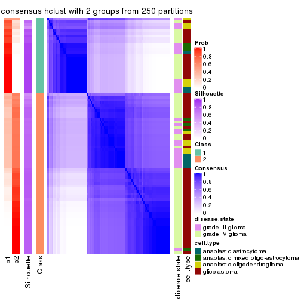</p>

</div>
<div id='tab-SD-hclust-consensus-heatmap-2'>
<pre><code class="r">consensus_heatmap(res, k = 3)
</code></pre>

<p>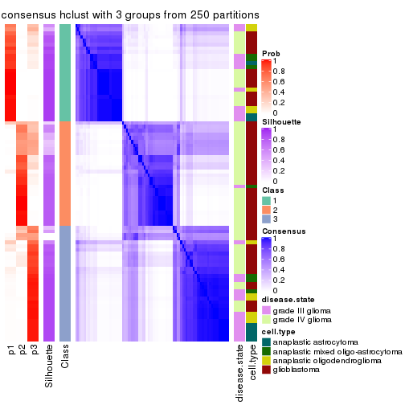</p>

</div>
<div id='tab-SD-hclust-consensus-heatmap-3'>
<pre><code class="r">consensus_heatmap(res, k = 4)
</code></pre>

<p></p>

</div>
<div id='tab-SD-hclust-consensus-heatmap-4'>
<pre><code class="r">consensus_heatmap(res, k = 5)
</code></pre>

<p></p>

</div>
<div id='tab-SD-hclust-consensus-heatmap-5'>
<pre><code class="r">consensus_heatmap(res, k = 6)
</code></pre>

<p></p>

</div>
</div>

Heatmaps for the membership of samples in all partitions to see how consistent they are:


<script>
$( function() {
	$( '#tabs-SD-hclust-membership-heatmap' ).tabs();
} );
</script>
<div id='tabs-SD-hclust-membership-heatmap'>
<ul>
<li><a href='#tab-SD-hclust-membership-heatmap-1'>k = 2</a></li>
<li><a href='#tab-SD-hclust-membership-heatmap-2'>k = 3</a></li>
<li><a href='#tab-SD-hclust-membership-heatmap-3'>k = 4</a></li>
<li><a href='#tab-SD-hclust-membership-heatmap-4'>k = 5</a></li>
<li><a href='#tab-SD-hclust-membership-heatmap-5'>k = 6</a></li>
</ul>
<div id='tab-SD-hclust-membership-heatmap-1'>
<pre><code class="r">membership_heatmap(res, k = 2)
</code></pre>

<p></p>

</div>
<div id='tab-SD-hclust-membership-heatmap-2'>
<pre><code class="r">membership_heatmap(res, k = 3)
</code></pre>

<p></p>

</div>
<div id='tab-SD-hclust-membership-heatmap-3'>
<pre><code class="r">membership_heatmap(res, k = 4)
</code></pre>

<p></p>

</div>
<div id='tab-SD-hclust-membership-heatmap-4'>
<pre><code class="r">membership_heatmap(res, k = 5)
</code></pre>

<p></p>

</div>
<div id='tab-SD-hclust-membership-heatmap-5'>
<pre><code class="r">membership_heatmap(res, k = 6)
</code></pre>

<p></p>

</div>
</div>

As soon as we have had the classes for columns, we can look for signatures
which are significantly different between classes which can be candidate marks
for certain classes. Following are the heatmaps for signatures.


Signature heatmaps where rows are scaled:


<script>
$( function() {
	$( '#tabs-SD-hclust-get-signatures' ).tabs();
} );
</script>
<div id='tabs-SD-hclust-get-signatures'>
<ul>
<li><a href='#tab-SD-hclust-get-signatures-1'>k = 2</a></li>
<li><a href='#tab-SD-hclust-get-signatures-2'>k = 3</a></li>
<li><a href='#tab-SD-hclust-get-signatures-3'>k = 4</a></li>
<li><a href='#tab-SD-hclust-get-signatures-4'>k = 5</a></li>
<li><a href='#tab-SD-hclust-get-signatures-5'>k = 6</a></li>
</ul>
<div id='tab-SD-hclust-get-signatures-1'>
<pre><code class="r">get_signatures(res, k = 2)
</code></pre>

<p></p>

</div>
<div id='tab-SD-hclust-get-signatures-2'>
<pre><code class="r">get_signatures(res, k = 3)
</code></pre>

<p></p>

</div>
<div id='tab-SD-hclust-get-signatures-3'>
<pre><code class="r">get_signatures(res, k = 4)
</code></pre>

<p></p>

</div>
<div id='tab-SD-hclust-get-signatures-4'>
<pre><code class="r">get_signatures(res, k = 5)
</code></pre>

<p></p>

</div>
<div id='tab-SD-hclust-get-signatures-5'>
<pre><code class="r">get_signatures(res, k = 6)
</code></pre>

<p></p>

</div>
</div>


Signature heatmaps where rows are not scaled:


<script>
$( function() {
	$( '#tabs-SD-hclust-get-signatures-no-scale' ).tabs();
} );
</script>
<div id='tabs-SD-hclust-get-signatures-no-scale'>
<ul>
<li><a href='#tab-SD-hclust-get-signatures-no-scale-1'>k = 2</a></li>
<li><a href='#tab-SD-hclust-get-signatures-no-scale-2'>k = 3</a></li>
<li><a href='#tab-SD-hclust-get-signatures-no-scale-3'>k = 4</a></li>
<li><a href='#tab-SD-hclust-get-signatures-no-scale-4'>k = 5</a></li>
<li><a href='#tab-SD-hclust-get-signatures-no-scale-5'>k = 6</a></li>
</ul>
<div id='tab-SD-hclust-get-signatures-no-scale-1'>
<pre><code class="r">get_signatures(res, k = 2, scale_rows = FALSE)
</code></pre>

<p></p>

</div>
<div id='tab-SD-hclust-get-signatures-no-scale-2'>
<pre><code class="r">get_signatures(res, k = 3, scale_rows = FALSE)
</code></pre>

<p></p>

</div>
<div id='tab-SD-hclust-get-signatures-no-scale-3'>
<pre><code class="r">get_signatures(res, k = 4, scale_rows = FALSE)
</code></pre>

<p></p>

</div>
<div id='tab-SD-hclust-get-signatures-no-scale-4'>
<pre><code class="r">get_signatures(res, k = 5, scale_rows = FALSE)
</code></pre>

<p></p>

</div>
<div id='tab-SD-hclust-get-signatures-no-scale-5'>
<pre><code class="r">get_signatures(res, k = 6, scale_rows = FALSE)
</code></pre>

<p></p>

</div>
</div>


Compare the overlap of signatures from different k:

```r
compare_signatures(res)
```


`get_signature()` returns a data frame invisibly. TO get the list of signatures, the function
call should be assigned to a variable explicitly. In following code, if `plot` argument is set
to `FALSE`, no heatmap is plotted while only the differential analysis is performed.

```r
# code only for demonstration
tb = get_signature(res, k = ..., plot = FALSE)
```

An example of the output of `tb` is:

```
#>   which_row         fdr    mean_1    mean_2 scaled_mean_1 scaled_mean_2 km
#> 1        38 0.042760348  8.373488  9.131774    -0.5533452     0.5164555  1
#> 2        40 0.018707592  7.106213  8.469186    -0.6173731     0.5762149  1
#> 3        55 0.019134737 10.221463 11.207825    -0.6159697     0.5749050  1
#> 4        59 0.006059896  5.921854  7.869574    -0.6899429     0.6439467  1
#> 5        60 0.018055526  8.928898 10.211722    -0.6204761     0.5791110  1
#> 6        98 0.009384629 15.714769 14.887706     0.6635654    -0.6193277  2
...
```

The columns in `tb` are:

1. `which_row`: row indices corresponding to the input matrix.
2. `fdr`: FDR for the differential test. 
3. `mean_x`: The mean value in group x.
4. `scaled_mean_x`: The mean value in group x after rows are scaled.
5. `km`: Row groups if k-means clustering is applied to rows.


UMAP plot which shows how samples are separated.


<script>
$( function() {
	$( '#tabs-SD-hclust-dimension-reduction' ).tabs();
} );
</script>
<div id='tabs-SD-hclust-dimension-reduction'>
<ul>
<li><a href='#tab-SD-hclust-dimension-reduction-1'>k = 2</a></li>
<li><a href='#tab-SD-hclust-dimension-reduction-2'>k = 3</a></li>
<li><a href='#tab-SD-hclust-dimension-reduction-3'>k = 4</a></li>
<li><a href='#tab-SD-hclust-dimension-reduction-4'>k = 5</a></li>
<li><a href='#tab-SD-hclust-dimension-reduction-5'>k = 6</a></li>
</ul>
<div id='tab-SD-hclust-dimension-reduction-1'>
<pre><code class="r">dimension_reduction(res, k = 2, method = &quot;UMAP&quot;)
</code></pre>

<p></p>

</div>
<div id='tab-SD-hclust-dimension-reduction-2'>
<pre><code class="r">dimension_reduction(res, k = 3, method = &quot;UMAP&quot;)
</code></pre>

<p></p>

</div>
<div id='tab-SD-hclust-dimension-reduction-3'>
<pre><code class="r">dimension_reduction(res, k = 4, method = &quot;UMAP&quot;)
</code></pre>

<p></p>

</div>
<div id='tab-SD-hclust-dimension-reduction-4'>
<pre><code class="r">dimension_reduction(res, k = 5, method = &quot;UMAP&quot;)
</code></pre>

<p></p>

</div>
<div id='tab-SD-hclust-dimension-reduction-5'>
<pre><code class="r">dimension_reduction(res, k = 6, method = &quot;UMAP&quot;)
</code></pre>

<p></p>

</div>
</div>


Following heatmap shows how subgroups are split when increasing `k`:

```r
collect_classes(res)
```


Test correlation between subgroups and known annotations. If the known
annotation is numeric, one-way ANOVA test is applied, and if the known
annotation is discrete, chi-squared contingency table test is applied.

```r
test_to_known_factors(res)
```

```
#>            n disease.state(p) cell.type(p) k
#> SD:hclust 84         0.153952       0.3667 2
#> SD:hclust 73         0.002253       0.0424 3
#> SD:hclust 70         0.009084       0.1850 4
#> SD:hclust 61         0.000896       0.0400 5
#> SD:hclust 61         0.003689       0.0774 6
```


If matrix rows can be associated to genes, consider to use `GO_Enrichment(res,
...)` to perform function enrichment for the signature genes.


 

---------------------------------------------------


### SD:kmeans**


The object with results only for a single top-value method and a single partition method 
can be extracted as:

```r
res = res_list["SD", "kmeans"]
# you can also extract it by
# res = res_list["SD:kmeans"]
```

A summary of `res` and all the functions that can be applied to it:

```r
res
```

```
#> A 'ConsensusPartition' object with k = 2, 3, 4, 5, 6.
#>   On a matrix with 21512 rows and 85 columns.
#>   Top rows (1000, 2000, 3000, 4000, 5000) are extracted by 'SD' method.
#>   Subgroups are detected by 'kmeans' method.
#>   Performed in total 1250 partitions by row resampling.
#>   Best k for subgroups seems to be 3.
#> 
#> Following methods can be applied to this 'ConsensusPartition' object:
#>  [1] "cola_report"             "collect_classes"         "collect_plots"          
#>  [4] "collect_stats"           "colnames"                "compare_signatures"     
#>  [7] "consensus_heatmap"       "dimension_reduction"     "functional_enrichment"  
#> [10] "get_anno_col"            "get_anno"                "get_classes"            
#> [13] "get_consensus"           "get_matrix"              "get_membership"         
#> [16] "get_param"               "get_signatures"          "get_stats"              
#> [19] "is_best_k"               "is_stable_k"             "membership_heatmap"     
#> [22] "ncol"                    "nrow"                    "plot_ecdf"              
#> [25] "rownames"                "select_partition_number" "show"                   
#> [28] "suggest_best_k"          "test_to_known_factors"
```

`collect_plots()` function collects all the plots made from `res` for all `k` (number of partitions)
into one single page to provide an easy and fast comparison between different `k`.

```r
collect_plots(res)
```


The plots are:

- The first row: a plot of the ECDF (Empirical cumulative distribution
  function) curves of the consensus matrix for each `k` and the heatmap of
  predicted classes for each `k`.
- The second row: heatmaps of the consensus matrix for each `k`.
- The third row: heatmaps of the membership matrix for each `k`.
- The fouth row: heatmaps of the signatures for each `k`.

All the plots in panels can be made by individual functions and they are
plotted later in this section.

`select_partition_number()` produces several plots showing different
statistics for choosing "optimized" `k`. There are following statistics:

- ECDF curves of the consensus matrix for each `k`;
- 1-PAC. [The PAC
  score](https://en.wikipedia.org/wiki/Consensus_clustering#Over-interpretation_potential_of_consensus_clustering)
  measures the proportion of the ambiguous subgrouping.
- Mean silhouette score.
- Concordance. The mean probability of fiting the consensus class ids in all
  partitions.
- Area increased. Denote $A_k$ as the area under the ECDF curve for current
  `k`, the area increased is defined as $A_k - A_{k-1}$.
- Rand index. The percent of pairs of samples that are both in a same cluster
  or both are not in a same cluster in the partition of k and k-1.
- Jaccard index. The ratio of pairs of samples are both in a same cluster in
  the partition of k and k-1 and the pairs of samples are both in a same
  cluster in the partition k or k-1.

The detailed explanations of these statistics can be found in [the cola
vignette](http://bioconductor.org/packages/devel/bioc/vignettes/cola/inst/doc/cola.html#toc_13).

Generally speaking, lower PAC score, higher mean silhouette score or higher
concordance corresponds to better partition. Rand index and Jaccard index
measure how similar the current partition is compared to partition with `k-1`.
If they are too similar, we won't accept `k` is better than `k-1`.

```r
select_partition_number(res)
```


The numeric values for all these statistics can be obtained by `get_stats()`.

```r
get_stats(res)
```

```
#>   k 1-PAC mean_silhouette concordance area_increased  Rand Jaccard
#> 2 2 0.542           0.766       0.819         0.4655 0.519   0.519
#> 3 3 0.951           0.939       0.941         0.4198 0.724   0.507
#> 4 4 0.761           0.721       0.830         0.1107 0.919   0.759
#> 5 5 0.726           0.772       0.821         0.0610 0.892   0.641
#> 6 6 0.751           0.639       0.802         0.0418 0.970   0.873
```

`suggest_best_k()` suggests the best $k$ based on these statistics. The rules are as follows:

- All $k$ with Jaccard index larger than 0.95 are removed because the increase of
  the partition number does not provides enough extra information. If all $k$ are removed,
  the best $k$ is assigned by `NA`.
- For $k$ with 1-PAC larger than 0.9, the maximal $k$ is taken as the "best k". Other $k$ is called "optional k".
- If it does not fit the second rule. The $k$ with the highest vote of highest
  1-PAC, mean silhouette and concordance is taken as the "best k".

```r
suggest_best_k(res)
```

```
#> [1] 3
```


Following shows the table of the partitions (You need to click the **show/hide
code output** link to see it). The membership matrix (columns with name `p*`)
is inferred by
[`clue::cl_consensus()`](https://www.rdocumentation.org/link/cl_consensus?package=clue)
function with the `SE` method. Basically the value in the membership matrix
represents the probability to belong to a certain group. The finall class
label for an item is determined with the group with highest probability it
belongs to.

In `get_classes()` function, the entropy is calculated from the membership
matrix and the silhouette score is calculated from the consensus matrix.


<script>
$( function() {
	$( '#tabs-SD-kmeans-get-classes' ).tabs();
} );
</script>
<div id='tabs-SD-kmeans-get-classes'>
<ul>
<li><a href='#tab-SD-kmeans-get-classes-1'>k = 2</a></li>
<li><a href='#tab-SD-kmeans-get-classes-2'>k = 3</a></li>
<li><a href='#tab-SD-kmeans-get-classes-3'>k = 4</a></li>
<li><a href='#tab-SD-kmeans-get-classes-4'>k = 5</a></li>
<li><a href='#tab-SD-kmeans-get-classes-5'>k = 6</a></li>
</ul>

<div id='tab-SD-kmeans-get-classes-1'>
<p><a id='tab-SD-kmeans-get-classes-1-a' style='color:#0366d6' href='#'>show/hide code output</a></p>
<pre><code class="r">cbind(get_classes(res, k = 2), get_membership(res, k = 2))
</code></pre>

<pre><code>#&gt;          class entropy silhouette    p1    p2
#&gt; GSM99497     1   0.998      0.530 0.524 0.476
#&gt; GSM99503     1   0.000      0.741 1.000 0.000
#&gt; GSM99505     1   0.204      0.728 0.968 0.032
#&gt; GSM99507     1   0.998      0.530 0.524 0.476
#&gt; GSM99567     1   0.998      0.530 0.524 0.476
#&gt; GSM99575     1   0.000      0.741 1.000 0.000
#&gt; GSM99593     1   0.998      0.530 0.524 0.476
#&gt; GSM99595     1   0.998      0.530 0.524 0.476
#&gt; GSM99469     1   0.000      0.741 1.000 0.000
#&gt; GSM99499     1   0.000      0.741 1.000 0.000
#&gt; GSM99501     1   0.000      0.741 1.000 0.000
#&gt; GSM99509     1   0.998      0.530 0.524 0.476
#&gt; GSM99569     1   0.998      0.530 0.524 0.476
#&gt; GSM99597     1   0.995      0.544 0.540 0.460
#&gt; GSM99601     2   0.224      0.977 0.036 0.964
#&gt; GSM99459     1   0.000      0.741 1.000 0.000
#&gt; GSM99461     1   0.000      0.741 1.000 0.000
#&gt; GSM99511     1   0.998      0.530 0.524 0.476
#&gt; GSM99513     1   0.998      0.530 0.524 0.476
#&gt; GSM99515     1   0.998      0.530 0.524 0.476
#&gt; GSM99517     1   0.000      0.741 1.000 0.000
#&gt; GSM99519     1   0.000      0.741 1.000 0.000
#&gt; GSM99521     1   0.998      0.530 0.524 0.476
#&gt; GSM99523     1   0.929      0.620 0.656 0.344
#&gt; GSM99571     1   0.000      0.741 1.000 0.000
#&gt; GSM99599     1   0.000      0.741 1.000 0.000
#&gt; GSM99433     2   0.000      0.946 0.000 1.000
#&gt; GSM99435     1   0.998      0.530 0.524 0.476
#&gt; GSM99437     2   0.224      0.977 0.036 0.964
#&gt; GSM99439     2   0.224      0.977 0.036 0.964
#&gt; GSM99441     1   0.000      0.741 1.000 0.000
#&gt; GSM99443     2   0.224      0.977 0.036 0.964
#&gt; GSM99445     2   0.224      0.977 0.036 0.964
#&gt; GSM99447     2   0.224      0.977 0.036 0.964
#&gt; GSM99449     2   0.000      0.946 0.000 1.000
#&gt; GSM99451     1   0.998      0.530 0.524 0.476
#&gt; GSM99453     1   0.000      0.741 1.000 0.000
#&gt; GSM99455     1   0.000      0.741 1.000 0.000
#&gt; GSM99457     1   0.000      0.741 1.000 0.000
#&gt; GSM99463     2   0.224      0.977 0.036 0.964
#&gt; GSM99465     1   0.876      0.641 0.704 0.296
#&gt; GSM99467     2   0.224      0.977 0.036 0.964
#&gt; GSM99471     1   0.000      0.741 1.000 0.000
#&gt; GSM99473     1   0.000      0.741 1.000 0.000
#&gt; GSM99475     1   0.998      0.530 0.524 0.476
#&gt; GSM99477     2   0.000      0.946 0.000 1.000
#&gt; GSM99479     2   0.224      0.977 0.036 0.964
#&gt; GSM99481     1   0.000      0.741 1.000 0.000
#&gt; GSM99483     1   0.000      0.741 1.000 0.000
#&gt; GSM99485     2   0.224      0.977 0.036 0.964
#&gt; GSM99487     2   0.224      0.977 0.036 0.964
#&gt; GSM99489     2   0.224      0.977 0.036 0.964
#&gt; GSM99491     2   0.224      0.977 0.036 0.964
#&gt; GSM99493     1   0.000      0.741 1.000 0.000
#&gt; GSM99495     2   0.224      0.977 0.036 0.964
#&gt; GSM99525     1   0.000      0.741 1.000 0.000
#&gt; GSM99527     1   0.997      0.527 0.532 0.468
#&gt; GSM99529     2   0.722      0.695 0.200 0.800
#&gt; GSM99531     1   0.994      0.548 0.544 0.456
#&gt; GSM99533     1   0.921      0.625 0.664 0.336
#&gt; GSM99535     2   0.653      0.800 0.168 0.832
#&gt; GSM99537     1   0.000      0.741 1.000 0.000
#&gt; GSM99539     2   0.000      0.946 0.000 1.000
#&gt; GSM99541     1   0.141      0.733 0.980 0.020
#&gt; GSM99543     2   0.224      0.977 0.036 0.964
#&gt; GSM99545     2   0.000      0.946 0.000 1.000
#&gt; GSM99547     1   0.980      0.539 0.584 0.416
#&gt; GSM99549     2   0.224      0.977 0.036 0.964
#&gt; GSM99551     1   0.000      0.741 1.000 0.000
#&gt; GSM99553     1   0.998      0.530 0.524 0.476
#&gt; GSM99555     2   0.224      0.977 0.036 0.964
#&gt; GSM99557     2   0.224      0.977 0.036 0.964
#&gt; GSM99559     2   0.000      0.946 0.000 1.000
#&gt; GSM99561     2   0.224      0.977 0.036 0.964
#&gt; GSM99563     1   0.998      0.530 0.524 0.476
#&gt; GSM99565     2   0.184      0.971 0.028 0.972
#&gt; GSM99573     2   0.224      0.977 0.036 0.964
#&gt; GSM99577     1   0.000      0.741 1.000 0.000
#&gt; GSM99579     2   0.224      0.977 0.036 0.964
#&gt; GSM99581     1   0.998      0.530 0.524 0.476
#&gt; GSM99583     1   0.990      0.512 0.560 0.440
#&gt; GSM99585     2   0.224      0.977 0.036 0.964
#&gt; GSM99587     1   0.000      0.741 1.000 0.000
#&gt; GSM99589     2   0.224      0.977 0.036 0.964
#&gt; GSM99591     2   0.224      0.977 0.036 0.964
</code></pre>

<script>
$('#tab-SD-kmeans-get-classes-1-a').parent().next().next().hide();
$('#tab-SD-kmeans-get-classes-1-a').click(function(){
  $('#tab-SD-kmeans-get-classes-1-a').parent().next().next().toggle();
  return(false);
});
</script>
</div>

<div id='tab-SD-kmeans-get-classes-2'>
<p><a id='tab-SD-kmeans-get-classes-2-a' style='color:#0366d6' href='#'>show/hide code output</a></p>
<pre><code class="r">cbind(get_classes(res, k = 3), get_membership(res, k = 3))
</code></pre>

<pre><code>#&gt;          class entropy silhouette    p1    p2    p3
#&gt; GSM99497     3  0.1289      0.949 0.032 0.000 0.968
#&gt; GSM99503     1  0.0000      0.984 1.000 0.000 0.000
#&gt; GSM99505     1  0.0000      0.984 1.000 0.000 0.000
#&gt; GSM99507     3  0.1289      0.949 0.032 0.000 0.968
#&gt; GSM99567     3  0.1289      0.949 0.032 0.000 0.968
#&gt; GSM99575     1  0.0000      0.984 1.000 0.000 0.000
#&gt; GSM99593     3  0.1163      0.947 0.028 0.000 0.972
#&gt; GSM99595     3  0.1289      0.949 0.032 0.000 0.968
#&gt; GSM99469     1  0.0000      0.984 1.000 0.000 0.000
#&gt; GSM99499     1  0.0000      0.984 1.000 0.000 0.000
#&gt; GSM99501     1  0.0000      0.984 1.000 0.000 0.000
#&gt; GSM99509     3  0.1289      0.949 0.032 0.000 0.968
#&gt; GSM99569     3  0.1289      0.949 0.032 0.000 0.968
#&gt; GSM99597     3  0.1289      0.949 0.032 0.000 0.968
#&gt; GSM99601     2  0.2066      0.969 0.000 0.940 0.060
#&gt; GSM99459     1  0.0000      0.984 1.000 0.000 0.000
#&gt; GSM99461     1  0.0000      0.984 1.000 0.000 0.000
#&gt; GSM99511     3  0.1289      0.949 0.032 0.000 0.968
#&gt; GSM99513     3  0.1289      0.949 0.032 0.000 0.968
#&gt; GSM99515     3  0.1289      0.949 0.032 0.000 0.968
#&gt; GSM99517     1  0.0000      0.984 1.000 0.000 0.000
#&gt; GSM99519     1  0.0000      0.984 1.000 0.000 0.000
#&gt; GSM99521     3  0.1289      0.949 0.032 0.000 0.968
#&gt; GSM99523     3  0.2537      0.910 0.080 0.000 0.920
#&gt; GSM99571     1  0.1031      0.983 0.976 0.024 0.000
#&gt; GSM99599     1  0.0237      0.985 0.996 0.004 0.000
#&gt; GSM99433     2  0.4235      0.852 0.000 0.824 0.176
#&gt; GSM99435     3  0.1289      0.949 0.032 0.000 0.968
#&gt; GSM99437     2  0.2165      0.969 0.000 0.936 0.064
#&gt; GSM99439     2  0.2711      0.961 0.000 0.912 0.088
#&gt; GSM99441     1  0.0424      0.985 0.992 0.008 0.000
#&gt; GSM99443     2  0.2165      0.969 0.000 0.936 0.064
#&gt; GSM99445     2  0.2066      0.969 0.000 0.940 0.060
#&gt; GSM99447     2  0.2165      0.969 0.000 0.936 0.064
#&gt; GSM99449     3  0.1163      0.925 0.000 0.028 0.972
#&gt; GSM99451     3  0.1289      0.949 0.032 0.000 0.968
#&gt; GSM99453     1  0.1643      0.979 0.956 0.044 0.000
#&gt; GSM99455     1  0.1643      0.979 0.956 0.044 0.000
#&gt; GSM99457     1  0.2066      0.973 0.940 0.060 0.000
#&gt; GSM99463     2  0.2711      0.961 0.000 0.912 0.088
#&gt; GSM99465     3  0.4235      0.822 0.176 0.000 0.824
#&gt; GSM99467     2  0.2165      0.969 0.000 0.936 0.064
#&gt; GSM99471     1  0.1643      0.979 0.956 0.044 0.000
#&gt; GSM99473     1  0.0237      0.985 0.996 0.004 0.000
#&gt; GSM99475     3  0.1877      0.942 0.032 0.012 0.956
#&gt; GSM99477     3  0.3340      0.844 0.000 0.120 0.880
#&gt; GSM99479     2  0.5363      0.695 0.000 0.724 0.276
#&gt; GSM99481     1  0.0424      0.985 0.992 0.008 0.000
#&gt; GSM99483     1  0.1643      0.979 0.956 0.044 0.000
#&gt; GSM99485     2  0.2165      0.969 0.000 0.936 0.064
#&gt; GSM99487     2  0.2165      0.969 0.000 0.936 0.064
#&gt; GSM99489     2  0.2711      0.961 0.000 0.912 0.088
#&gt; GSM99491     2  0.2165      0.969 0.000 0.936 0.064
#&gt; GSM99493     1  0.2066      0.973 0.940 0.060 0.000
#&gt; GSM99495     2  0.2711      0.961 0.000 0.912 0.088
#&gt; GSM99525     1  0.1529      0.980 0.960 0.040 0.000
#&gt; GSM99527     3  0.1289      0.949 0.032 0.000 0.968
#&gt; GSM99529     3  0.4504      0.745 0.000 0.196 0.804
#&gt; GSM99531     3  0.2569      0.928 0.032 0.032 0.936
#&gt; GSM99533     3  0.2806      0.922 0.040 0.032 0.928
#&gt; GSM99535     2  0.4859      0.844 0.116 0.840 0.044
#&gt; GSM99537     1  0.0592      0.984 0.988 0.012 0.000
#&gt; GSM99539     3  0.4842      0.701 0.000 0.224 0.776
#&gt; GSM99541     1  0.0592      0.984 0.988 0.012 0.000
#&gt; GSM99543     2  0.1964      0.937 0.000 0.944 0.056
#&gt; GSM99545     3  0.6192      0.172 0.000 0.420 0.580
#&gt; GSM99547     3  0.2590      0.921 0.072 0.004 0.924
#&gt; GSM99549     2  0.2448      0.954 0.000 0.924 0.076
#&gt; GSM99551     1  0.2066      0.973 0.940 0.060 0.000
#&gt; GSM99553     3  0.1289      0.949 0.032 0.000 0.968
#&gt; GSM99555     2  0.2165      0.969 0.000 0.936 0.064
#&gt; GSM99557     2  0.2261      0.968 0.000 0.932 0.068
#&gt; GSM99559     3  0.1163      0.925 0.000 0.028 0.972
#&gt; GSM99561     2  0.2448      0.967 0.000 0.924 0.076
#&gt; GSM99563     3  0.1289      0.949 0.032 0.000 0.968
#&gt; GSM99565     2  0.2165      0.969 0.000 0.936 0.064
#&gt; GSM99573     2  0.2711      0.961 0.000 0.912 0.088
#&gt; GSM99577     1  0.1964      0.975 0.944 0.056 0.000
#&gt; GSM99579     2  0.2165      0.969 0.000 0.936 0.064
#&gt; GSM99581     3  0.1289      0.949 0.032 0.000 0.968
#&gt; GSM99583     3  0.2313      0.932 0.032 0.024 0.944
#&gt; GSM99585     2  0.2796      0.949 0.000 0.908 0.092
#&gt; GSM99587     1  0.2066      0.973 0.940 0.060 0.000
#&gt; GSM99589     2  0.2165      0.969 0.000 0.936 0.064
#&gt; GSM99591     2  0.2066      0.969 0.000 0.940 0.060
</code></pre>

<script>
$('#tab-SD-kmeans-get-classes-2-a').parent().next().next().hide();
$('#tab-SD-kmeans-get-classes-2-a').click(function(){
  $('#tab-SD-kmeans-get-classes-2-a').parent().next().next().toggle();
  return(false);
});
</script>
</div>

<div id='tab-SD-kmeans-get-classes-3'>
<p><a id='tab-SD-kmeans-get-classes-3-a' style='color:#0366d6' href='#'>show/hide code output</a></p>
<pre><code class="r">cbind(get_classes(res, k = 4), get_membership(res, k = 4))
</code></pre>

<pre><code>#&gt;          class entropy silhouette    p1    p2    p3    p4
#&gt; GSM99497     3  0.0000    0.87571 0.000 0.000 1.000 0.000
#&gt; GSM99503     1  0.0000    0.92009 1.000 0.000 0.000 0.000
#&gt; GSM99505     1  0.1042    0.91769 0.972 0.000 0.008 0.020
#&gt; GSM99507     3  0.0000    0.87571 0.000 0.000 1.000 0.000
#&gt; GSM99567     3  0.0000    0.87571 0.000 0.000 1.000 0.000
#&gt; GSM99575     1  0.0000    0.92009 1.000 0.000 0.000 0.000
#&gt; GSM99593     3  0.0000    0.87571 0.000 0.000 1.000 0.000
#&gt; GSM99595     3  0.0000    0.87571 0.000 0.000 1.000 0.000
#&gt; GSM99469     1  0.0817    0.91793 0.976 0.000 0.000 0.024
#&gt; GSM99499     1  0.0707    0.91860 0.980 0.000 0.000 0.020
#&gt; GSM99501     1  0.0817    0.91793 0.976 0.000 0.000 0.024
#&gt; GSM99509     3  0.0000    0.87571 0.000 0.000 1.000 0.000
#&gt; GSM99569     3  0.0000    0.87571 0.000 0.000 1.000 0.000
#&gt; GSM99597     3  0.0000    0.87571 0.000 0.000 1.000 0.000
#&gt; GSM99601     2  0.3726    0.78523 0.000 0.788 0.000 0.212
#&gt; GSM99459     1  0.1792    0.90486 0.932 0.000 0.000 0.068
#&gt; GSM99461     1  0.1792    0.90486 0.932 0.000 0.000 0.068
#&gt; GSM99511     3  0.0000    0.87571 0.000 0.000 1.000 0.000
#&gt; GSM99513     3  0.0000    0.87571 0.000 0.000 1.000 0.000
#&gt; GSM99515     3  0.0000    0.87571 0.000 0.000 1.000 0.000
#&gt; GSM99517     1  0.0000    0.92009 1.000 0.000 0.000 0.000
#&gt; GSM99519     1  0.1716    0.90598 0.936 0.000 0.000 0.064
#&gt; GSM99521     3  0.0188    0.87280 0.000 0.000 0.996 0.004
#&gt; GSM99523     3  0.0000    0.87571 0.000 0.000 1.000 0.000
#&gt; GSM99571     1  0.2081    0.90685 0.916 0.000 0.000 0.084
#&gt; GSM99599     1  0.0000    0.92009 1.000 0.000 0.000 0.000
#&gt; GSM99433     4  0.5573    0.27830 0.000 0.272 0.052 0.676
#&gt; GSM99435     3  0.4406    0.54738 0.000 0.000 0.700 0.300
#&gt; GSM99437     2  0.4522    0.76969 0.000 0.680 0.000 0.320
#&gt; GSM99439     2  0.0188    0.70479 0.000 0.996 0.000 0.004
#&gt; GSM99441     1  0.0000    0.92009 1.000 0.000 0.000 0.000
#&gt; GSM99443     2  0.4193    0.78428 0.000 0.732 0.000 0.268
#&gt; GSM99445     2  0.3356    0.77940 0.000 0.824 0.000 0.176
#&gt; GSM99447     2  0.4605    0.75940 0.000 0.664 0.000 0.336
#&gt; GSM99449     3  0.0000    0.87571 0.000 0.000 1.000 0.000
#&gt; GSM99451     3  0.4564    0.51134 0.000 0.000 0.672 0.328
#&gt; GSM99453     1  0.3356    0.87652 0.824 0.000 0.000 0.176
#&gt; GSM99455     1  0.3311    0.87844 0.828 0.000 0.000 0.172
#&gt; GSM99457     1  0.3764    0.85389 0.784 0.000 0.000 0.216
#&gt; GSM99463     2  0.0000    0.70494 0.000 1.000 0.000 0.000
#&gt; GSM99465     4  0.7358    0.00176 0.160 0.000 0.392 0.448
#&gt; GSM99467     4  0.4977   -0.35592 0.000 0.460 0.000 0.540
#&gt; GSM99471     1  0.3486    0.87917 0.812 0.000 0.000 0.188
#&gt; GSM99473     1  0.1637    0.91156 0.940 0.000 0.000 0.060
#&gt; GSM99475     3  0.4679    0.47729 0.000 0.000 0.648 0.352
#&gt; GSM99477     4  0.6394    0.53570 0.000 0.088 0.316 0.596
#&gt; GSM99479     4  0.5558   -0.00190 0.000 0.364 0.028 0.608
#&gt; GSM99481     1  0.0000    0.92009 1.000 0.000 0.000 0.000
#&gt; GSM99483     1  0.3074    0.88653 0.848 0.000 0.000 0.152
#&gt; GSM99485     2  0.4804    0.69453 0.000 0.616 0.000 0.384
#&gt; GSM99487     2  0.4522    0.76969 0.000 0.680 0.000 0.320
#&gt; GSM99489     2  0.0000    0.70494 0.000 1.000 0.000 0.000
#&gt; GSM99491     2  0.4522    0.76875 0.000 0.680 0.000 0.320
#&gt; GSM99493     1  0.3726    0.85568 0.788 0.000 0.000 0.212
#&gt; GSM99495     2  0.0000    0.70494 0.000 1.000 0.000 0.000
#&gt; GSM99525     1  0.2469    0.90081 0.892 0.000 0.000 0.108
#&gt; GSM99527     3  0.4999    0.10846 0.000 0.000 0.508 0.492
#&gt; GSM99529     4  0.5204    0.53232 0.000 0.088 0.160 0.752
#&gt; GSM99531     3  0.4730    0.46008 0.000 0.000 0.636 0.364
#&gt; GSM99533     3  0.4730    0.46008 0.000 0.000 0.636 0.364
#&gt; GSM99535     2  0.5693    0.49089 0.024 0.504 0.000 0.472
#&gt; GSM99537     1  0.0188    0.92026 0.996 0.000 0.000 0.004
#&gt; GSM99539     4  0.7293    0.40161 0.000 0.156 0.368 0.476
#&gt; GSM99541     1  0.1474    0.91358 0.948 0.000 0.000 0.052
#&gt; GSM99543     2  0.1389    0.67897 0.000 0.952 0.000 0.048
#&gt; GSM99545     4  0.7734    0.41319 0.000 0.236 0.344 0.420
#&gt; GSM99547     4  0.5285   -0.09920 0.008 0.000 0.468 0.524
#&gt; GSM99549     2  0.0336    0.70349 0.000 0.992 0.000 0.008
#&gt; GSM99551     1  0.4977    0.57418 0.540 0.000 0.000 0.460
#&gt; GSM99553     3  0.0000    0.87571 0.000 0.000 1.000 0.000
#&gt; GSM99555     2  0.4250    0.78343 0.000 0.724 0.000 0.276
#&gt; GSM99557     2  0.2647    0.76127 0.000 0.880 0.000 0.120
#&gt; GSM99559     3  0.0000    0.87571 0.000 0.000 1.000 0.000
#&gt; GSM99561     2  0.4543    0.76462 0.000 0.676 0.000 0.324
#&gt; GSM99563     3  0.0000    0.87571 0.000 0.000 1.000 0.000
#&gt; GSM99565     2  0.4522    0.76969 0.000 0.680 0.000 0.320
#&gt; GSM99573     2  0.0336    0.70349 0.000 0.992 0.000 0.008
#&gt; GSM99577     1  0.3764    0.87130 0.784 0.000 0.000 0.216
#&gt; GSM99579     2  0.4643    0.74969 0.000 0.656 0.000 0.344
#&gt; GSM99581     3  0.0000    0.87571 0.000 0.000 1.000 0.000
#&gt; GSM99583     4  0.5349    0.47487 0.000 0.024 0.336 0.640
#&gt; GSM99585     4  0.4936   -0.06204 0.000 0.372 0.004 0.624
#&gt; GSM99587     1  0.3726    0.85568 0.788 0.000 0.000 0.212
#&gt; GSM99589     2  0.4585    0.75894 0.000 0.668 0.000 0.332
#&gt; GSM99591     2  0.3528    0.78289 0.000 0.808 0.000 0.192
</code></pre>

<script>
$('#tab-SD-kmeans-get-classes-3-a').parent().next().next().hide();
$('#tab-SD-kmeans-get-classes-3-a').click(function(){
  $('#tab-SD-kmeans-get-classes-3-a').parent().next().next().toggle();
  return(false);
});
</script>
</div>

<div id='tab-SD-kmeans-get-classes-4'>
<p><a id='tab-SD-kmeans-get-classes-4-a' style='color:#0366d6' href='#'>show/hide code output</a></p>
<pre><code class="r">cbind(get_classes(res, k = 5), get_membership(res, k = 5))
</code></pre>

<pre><code>#&gt;          class entropy silhouette    p1    p2    p3    p4    p5
#&gt; GSM99497     3  0.0000      0.982 0.000 0.000 1.000 0.000 0.000
#&gt; GSM99503     1  0.0000      0.874 1.000 0.000 0.000 0.000 0.000
#&gt; GSM99505     1  0.2313      0.866 0.916 0.000 0.012 0.040 0.032
#&gt; GSM99507     3  0.0000      0.982 0.000 0.000 1.000 0.000 0.000
#&gt; GSM99567     3  0.0162      0.982 0.000 0.000 0.996 0.000 0.004
#&gt; GSM99575     1  0.0000      0.874 1.000 0.000 0.000 0.000 0.000
#&gt; GSM99593     3  0.0324      0.981 0.000 0.000 0.992 0.004 0.004
#&gt; GSM99595     3  0.0162      0.982 0.000 0.000 0.996 0.000 0.004
#&gt; GSM99469     1  0.1907      0.868 0.928 0.000 0.000 0.044 0.028
#&gt; GSM99499     1  0.1915      0.869 0.928 0.000 0.000 0.040 0.032
#&gt; GSM99501     1  0.1907      0.868 0.928 0.000 0.000 0.044 0.028
#&gt; GSM99509     3  0.0579      0.978 0.000 0.000 0.984 0.008 0.008
#&gt; GSM99569     3  0.0798      0.977 0.000 0.000 0.976 0.008 0.016
#&gt; GSM99597     3  0.0807      0.971 0.000 0.000 0.976 0.012 0.012
#&gt; GSM99601     2  0.4297      0.352 0.000 0.728 0.000 0.036 0.236
#&gt; GSM99459     1  0.2903      0.847 0.872 0.000 0.000 0.080 0.048
#&gt; GSM99461     1  0.2974      0.845 0.868 0.000 0.000 0.080 0.052
#&gt; GSM99511     3  0.1211      0.971 0.000 0.000 0.960 0.016 0.024
#&gt; GSM99513     3  0.1211      0.971 0.000 0.000 0.960 0.016 0.024
#&gt; GSM99515     3  0.0000      0.982 0.000 0.000 1.000 0.000 0.000
#&gt; GSM99517     1  0.0000      0.874 1.000 0.000 0.000 0.000 0.000
#&gt; GSM99519     1  0.2843      0.849 0.876 0.000 0.000 0.076 0.048
#&gt; GSM99521     3  0.0794      0.956 0.000 0.000 0.972 0.028 0.000
#&gt; GSM99523     3  0.1012      0.973 0.000 0.000 0.968 0.012 0.020
#&gt; GSM99571     1  0.2325      0.862 0.904 0.000 0.000 0.068 0.028
#&gt; GSM99599     1  0.0162      0.874 0.996 0.000 0.000 0.000 0.004
#&gt; GSM99433     2  0.5394      0.356 0.000 0.560 0.008 0.388 0.044
#&gt; GSM99435     4  0.4457      0.719 0.000 0.000 0.368 0.620 0.012
#&gt; GSM99437     2  0.2426      0.645 0.000 0.900 0.000 0.036 0.064
#&gt; GSM99439     5  0.4387      0.935 0.000 0.348 0.000 0.012 0.640
#&gt; GSM99441     1  0.0162      0.874 0.996 0.000 0.000 0.000 0.004
#&gt; GSM99443     2  0.2304      0.619 0.000 0.892 0.000 0.008 0.100
#&gt; GSM99445     2  0.4127      0.135 0.000 0.680 0.000 0.008 0.312
#&gt; GSM99447     2  0.2992      0.651 0.000 0.868 0.000 0.064 0.068
#&gt; GSM99449     3  0.0451      0.981 0.000 0.000 0.988 0.004 0.008
#&gt; GSM99451     4  0.4201      0.775 0.000 0.000 0.328 0.664 0.008
#&gt; GSM99453     1  0.4111      0.823 0.788 0.000 0.000 0.120 0.092
#&gt; GSM99455     1  0.3955      0.828 0.800 0.000 0.000 0.116 0.084
#&gt; GSM99457     1  0.5307      0.771 0.676 0.000 0.000 0.156 0.168
#&gt; GSM99463     5  0.3999      0.939 0.000 0.344 0.000 0.000 0.656
#&gt; GSM99465     4  0.6175      0.717 0.120 0.008 0.112 0.684 0.076
#&gt; GSM99467     2  0.3888      0.631 0.000 0.812 0.004 0.112 0.072
#&gt; GSM99471     1  0.5113      0.802 0.708 0.004 0.000 0.160 0.128
#&gt; GSM99473     1  0.2751      0.857 0.888 0.004 0.000 0.052 0.056
#&gt; GSM99475     4  0.4193      0.795 0.000 0.000 0.304 0.684 0.012
#&gt; GSM99477     2  0.6204      0.514 0.000 0.640 0.112 0.200 0.048
#&gt; GSM99479     2  0.4679      0.609 0.000 0.768 0.024 0.136 0.072
#&gt; GSM99481     1  0.0162      0.874 0.996 0.000 0.000 0.000 0.004
#&gt; GSM99483     1  0.3731      0.834 0.816 0.000 0.000 0.112 0.072
#&gt; GSM99485     2  0.2889      0.648 0.000 0.872 0.000 0.044 0.084
#&gt; GSM99487     2  0.2370      0.651 0.000 0.904 0.000 0.040 0.056
#&gt; GSM99489     5  0.4268      0.933 0.000 0.344 0.000 0.008 0.648
#&gt; GSM99491     2  0.1774      0.641 0.000 0.932 0.000 0.016 0.052
#&gt; GSM99493     1  0.5163      0.774 0.692 0.000 0.000 0.152 0.156
#&gt; GSM99495     5  0.3999      0.939 0.000 0.344 0.000 0.000 0.656
#&gt; GSM99525     1  0.3346      0.844 0.844 0.000 0.000 0.092 0.064
#&gt; GSM99527     4  0.4971      0.819 0.000 0.040 0.188 0.732 0.040
#&gt; GSM99529     2  0.6464      0.378 0.000 0.552 0.040 0.316 0.092
#&gt; GSM99531     4  0.4380      0.811 0.000 0.000 0.260 0.708 0.032
#&gt; GSM99533     4  0.4132      0.815 0.000 0.000 0.260 0.720 0.020
#&gt; GSM99535     2  0.3861      0.623 0.004 0.816 0.000 0.088 0.092
#&gt; GSM99537     1  0.1216      0.876 0.960 0.000 0.000 0.020 0.020
#&gt; GSM99539     4  0.5355      0.685 0.000 0.184 0.120 0.688 0.008
#&gt; GSM99541     1  0.3262      0.835 0.840 0.000 0.000 0.124 0.036
#&gt; GSM99543     5  0.4585      0.760 0.000 0.352 0.000 0.020 0.628
#&gt; GSM99545     4  0.6087      0.704 0.000 0.140 0.120 0.672 0.068
#&gt; GSM99547     4  0.5854      0.779 0.000 0.076 0.160 0.688 0.076
#&gt; GSM99549     5  0.4451      0.934 0.000 0.340 0.000 0.016 0.644
#&gt; GSM99551     1  0.6651      0.448 0.428 0.000 0.000 0.336 0.236
#&gt; GSM99553     3  0.0000      0.982 0.000 0.000 1.000 0.000 0.000
#&gt; GSM99555     2  0.2450      0.633 0.000 0.896 0.000 0.028 0.076
#&gt; GSM99557     2  0.4473     -0.304 0.000 0.580 0.000 0.008 0.412
#&gt; GSM99559     3  0.0324      0.980 0.000 0.004 0.992 0.004 0.000
#&gt; GSM99561     2  0.3454      0.610 0.000 0.836 0.000 0.064 0.100
#&gt; GSM99563     3  0.1211      0.971 0.000 0.000 0.960 0.016 0.024
#&gt; GSM99565     2  0.2504      0.643 0.000 0.896 0.000 0.040 0.064
#&gt; GSM99573     5  0.4451      0.934 0.000 0.340 0.000 0.016 0.644
#&gt; GSM99577     1  0.5422      0.787 0.656 0.000 0.000 0.212 0.132
#&gt; GSM99579     2  0.2595      0.642 0.000 0.888 0.000 0.032 0.080
#&gt; GSM99581     3  0.0162      0.982 0.000 0.000 0.996 0.000 0.004
#&gt; GSM99583     2  0.6753      0.452 0.000 0.600 0.124 0.196 0.080
#&gt; GSM99585     2  0.4762      0.581 0.000 0.700 0.000 0.236 0.064
#&gt; GSM99587     1  0.5163      0.774 0.692 0.000 0.000 0.152 0.156
#&gt; GSM99589     2  0.1386      0.656 0.000 0.952 0.000 0.016 0.032
#&gt; GSM99591     2  0.3934      0.268 0.000 0.716 0.000 0.008 0.276
</code></pre>

<script>
$('#tab-SD-kmeans-get-classes-4-a').parent().next().next().hide();
$('#tab-SD-kmeans-get-classes-4-a').click(function(){
  $('#tab-SD-kmeans-get-classes-4-a').parent().next().next().toggle();
  return(false);
});
</script>
</div>

<div id='tab-SD-kmeans-get-classes-5'>
<p><a id='tab-SD-kmeans-get-classes-5-a' style='color:#0366d6' href='#'>show/hide code output</a></p>
<pre><code class="r">cbind(get_classes(res, k = 6), get_membership(res, k = 6))
</code></pre>

<pre><code>#&gt;          class entropy silhouette    p1    p2    p3    p4    p5    p6
#&gt; GSM99497     3  0.0146     0.9687 0.000 0.000 0.996 0.000 0.000 0.004
#&gt; GSM99503     1  0.0000     0.6930 1.000 0.000 0.000 0.000 0.000 0.000
#&gt; GSM99505     1  0.2494     0.6809 0.892 0.000 0.008 0.020 0.008 0.072
#&gt; GSM99507     3  0.0000     0.9695 0.000 0.000 1.000 0.000 0.000 0.000
#&gt; GSM99567     3  0.0000     0.9695 0.000 0.000 1.000 0.000 0.000 0.000
#&gt; GSM99575     1  0.0000     0.6930 1.000 0.000 0.000 0.000 0.000 0.000
#&gt; GSM99593     3  0.0291     0.9686 0.000 0.000 0.992 0.004 0.000 0.004
#&gt; GSM99595     3  0.0000     0.9695 0.000 0.000 1.000 0.000 0.000 0.000
#&gt; GSM99469     1  0.2402     0.6793 0.888 0.000 0.000 0.020 0.008 0.084
#&gt; GSM99499     1  0.2239     0.6831 0.900 0.000 0.000 0.020 0.008 0.072
#&gt; GSM99501     1  0.2402     0.6793 0.888 0.000 0.000 0.020 0.008 0.084
#&gt; GSM99509     3  0.0508     0.9669 0.000 0.000 0.984 0.000 0.012 0.004
#&gt; GSM99569     3  0.1894     0.9434 0.000 0.004 0.928 0.012 0.016 0.040
#&gt; GSM99597     3  0.0665     0.9654 0.000 0.000 0.980 0.004 0.008 0.008
#&gt; GSM99601     2  0.5589     0.0629 0.000 0.484 0.000 0.024 0.416 0.076
#&gt; GSM99459     1  0.4070     0.6040 0.780 0.000 0.000 0.068 0.024 0.128
#&gt; GSM99461     1  0.4070     0.6040 0.780 0.000 0.000 0.068 0.024 0.128
#&gt; GSM99511     3  0.2680     0.9159 0.000 0.004 0.884 0.016 0.028 0.068
#&gt; GSM99513     3  0.2562     0.9224 0.000 0.004 0.892 0.016 0.028 0.060
#&gt; GSM99515     3  0.0000     0.9695 0.000 0.000 1.000 0.000 0.000 0.000
#&gt; GSM99517     1  0.0260     0.6931 0.992 0.000 0.000 0.000 0.000 0.008
#&gt; GSM99519     1  0.3820     0.6165 0.796 0.000 0.000 0.056 0.020 0.128
#&gt; GSM99521     3  0.0508     0.9622 0.000 0.000 0.984 0.012 0.000 0.004
#&gt; GSM99523     3  0.2246     0.9332 0.000 0.004 0.908 0.012 0.020 0.056
#&gt; GSM99571     1  0.2378     0.6009 0.848 0.000 0.000 0.000 0.000 0.152
#&gt; GSM99599     1  0.0363     0.6909 0.988 0.000 0.000 0.000 0.000 0.012
#&gt; GSM99433     2  0.5353     0.4378 0.000 0.612 0.000 0.280 0.028 0.080
#&gt; GSM99435     4  0.4580     0.7661 0.000 0.036 0.164 0.744 0.008 0.048
#&gt; GSM99437     2  0.4580     0.6246 0.000 0.716 0.000 0.036 0.204 0.044
#&gt; GSM99439     5  0.2203     0.7613 0.000 0.084 0.000 0.016 0.896 0.004
#&gt; GSM99441     1  0.0363     0.6909 0.988 0.000 0.000 0.000 0.000 0.012
#&gt; GSM99443     2  0.4615     0.5643 0.000 0.676 0.000 0.016 0.260 0.048
#&gt; GSM99445     5  0.4822     0.1314 0.000 0.444 0.000 0.004 0.508 0.044
#&gt; GSM99447     2  0.4711     0.6447 0.000 0.724 0.000 0.052 0.172 0.052
#&gt; GSM99449     3  0.0508     0.9673 0.000 0.000 0.984 0.004 0.000 0.012
#&gt; GSM99451     4  0.3753     0.7895 0.000 0.032 0.144 0.800 0.008 0.016
#&gt; GSM99453     1  0.3695     0.2641 0.624 0.000 0.000 0.000 0.000 0.376
#&gt; GSM99455     1  0.3695     0.2641 0.624 0.000 0.000 0.000 0.000 0.376
#&gt; GSM99457     1  0.4634    -0.1890 0.496 0.000 0.000 0.008 0.024 0.472
#&gt; GSM99463     5  0.1700     0.7639 0.000 0.080 0.000 0.004 0.916 0.000
#&gt; GSM99465     4  0.6361     0.5301 0.092 0.060 0.004 0.608 0.028 0.208
#&gt; GSM99467     2  0.2504     0.6574 0.000 0.892 0.008 0.032 0.004 0.064
#&gt; GSM99471     1  0.4860     0.1518 0.540 0.036 0.000 0.012 0.000 0.412
#&gt; GSM99473     1  0.3581     0.6317 0.800 0.008 0.000 0.020 0.012 0.160
#&gt; GSM99475     4  0.3016     0.7889 0.000 0.012 0.136 0.836 0.000 0.016
#&gt; GSM99477     2  0.3657     0.6381 0.000 0.824 0.044 0.072 0.000 0.060
#&gt; GSM99479     2  0.2563     0.6513 0.000 0.884 0.008 0.040 0.000 0.068
#&gt; GSM99481     1  0.0363     0.6909 0.988 0.000 0.000 0.000 0.000 0.012
#&gt; GSM99483     1  0.3634     0.3098 0.644 0.000 0.000 0.000 0.000 0.356
#&gt; GSM99485     2  0.3155     0.6565 0.000 0.840 0.000 0.004 0.088 0.068
#&gt; GSM99487     2  0.4523     0.6320 0.000 0.724 0.000 0.036 0.196 0.044
#&gt; GSM99489     5  0.2342     0.7556 0.000 0.088 0.000 0.004 0.888 0.020
#&gt; GSM99491     2  0.3663     0.6194 0.000 0.776 0.000 0.004 0.180 0.040
#&gt; GSM99493     1  0.4617    -0.1397 0.524 0.000 0.000 0.008 0.024 0.444
#&gt; GSM99495     5  0.1700     0.7639 0.000 0.080 0.000 0.004 0.916 0.000
#&gt; GSM99525     1  0.3288     0.4565 0.724 0.000 0.000 0.000 0.000 0.276
#&gt; GSM99527     4  0.4280     0.7371 0.000 0.064 0.020 0.788 0.024 0.104
#&gt; GSM99529     2  0.4882     0.5342 0.000 0.704 0.008 0.144 0.008 0.136
#&gt; GSM99531     4  0.3797     0.7859 0.000 0.012 0.108 0.804 0.004 0.072
#&gt; GSM99533     4  0.3078     0.7934 0.000 0.012 0.112 0.844 0.000 0.032
#&gt; GSM99535     2  0.4158     0.6437 0.000 0.768 0.000 0.032 0.048 0.152
#&gt; GSM99537     1  0.1370     0.6912 0.948 0.000 0.000 0.012 0.004 0.036
#&gt; GSM99539     4  0.3529     0.7429 0.000 0.096 0.020 0.832 0.008 0.044
#&gt; GSM99541     1  0.3402     0.6410 0.820 0.000 0.000 0.052 0.008 0.120
#&gt; GSM99543     5  0.4270     0.6426 0.000 0.184 0.000 0.008 0.736 0.072
#&gt; GSM99545     4  0.3523     0.7450 0.000 0.056 0.028 0.848 0.032 0.036
#&gt; GSM99547     4  0.5867     0.6349 0.000 0.160 0.028 0.640 0.024 0.148
#&gt; GSM99549     5  0.3534     0.7423 0.000 0.084 0.000 0.028 0.828 0.060
#&gt; GSM99551     6  0.5693     0.0000 0.204 0.028 0.000 0.096 0.024 0.648
#&gt; GSM99553     3  0.0000     0.9695 0.000 0.000 1.000 0.000 0.000 0.000
#&gt; GSM99555     2  0.4549     0.6122 0.000 0.708 0.000 0.028 0.220 0.044
#&gt; GSM99557     5  0.4428     0.4434 0.000 0.340 0.000 0.004 0.624 0.032
#&gt; GSM99559     3  0.0291     0.9678 0.000 0.004 0.992 0.004 0.000 0.000
#&gt; GSM99561     2  0.5720     0.5223 0.000 0.624 0.000 0.056 0.212 0.108
#&gt; GSM99563     3  0.2390     0.9270 0.000 0.004 0.900 0.012 0.024 0.060
#&gt; GSM99565     2  0.4728     0.6184 0.000 0.704 0.000 0.036 0.208 0.052
#&gt; GSM99573     5  0.3534     0.7423 0.000 0.084 0.000 0.028 0.828 0.060
#&gt; GSM99577     1  0.4721     0.1180 0.496 0.000 0.000 0.036 0.004 0.464
#&gt; GSM99579     2  0.3726     0.6370 0.000 0.792 0.000 0.004 0.124 0.080
#&gt; GSM99581     3  0.0146     0.9697 0.000 0.000 0.996 0.000 0.000 0.004
#&gt; GSM99583     2  0.4103     0.5956 0.000 0.792 0.048 0.044 0.004 0.112
#&gt; GSM99585     2  0.4309     0.6066 0.000 0.736 0.000 0.176 0.008 0.080
#&gt; GSM99587     1  0.4617    -0.1397 0.524 0.000 0.000 0.008 0.024 0.444
#&gt; GSM99589     2  0.3000     0.6614 0.000 0.824 0.000 0.004 0.156 0.016
#&gt; GSM99591     5  0.4834     0.0436 0.000 0.468 0.000 0.004 0.484 0.044
</code></pre>

<script>
$('#tab-SD-kmeans-get-classes-5-a').parent().next().next().hide();
$('#tab-SD-kmeans-get-classes-5-a').click(function(){
  $('#tab-SD-kmeans-get-classes-5-a').parent().next().next().toggle();
  return(false);
});
</script>
</div>
</div>

Heatmaps for the consensus matrix. It visualizes the probability of two
samples to be in a same group.


<script>
$( function() {
	$( '#tabs-SD-kmeans-consensus-heatmap' ).tabs();
} );
</script>
<div id='tabs-SD-kmeans-consensus-heatmap'>
<ul>
<li><a href='#tab-SD-kmeans-consensus-heatmap-1'>k = 2</a></li>
<li><a href='#tab-SD-kmeans-consensus-heatmap-2'>k = 3</a></li>
<li><a href='#tab-SD-kmeans-consensus-heatmap-3'>k = 4</a></li>
<li><a href='#tab-SD-kmeans-consensus-heatmap-4'>k = 5</a></li>
<li><a href='#tab-SD-kmeans-consensus-heatmap-5'>k = 6</a></li>
</ul>
<div id='tab-SD-kmeans-consensus-heatmap-1'>
<pre><code class="r">consensus_heatmap(res, k = 2)
</code></pre>

<p>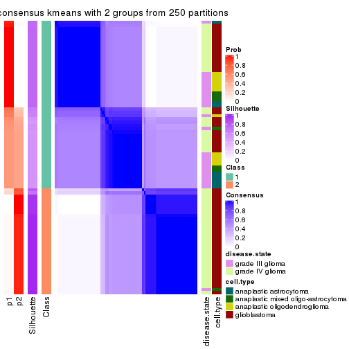</p>

</div>
<div id='tab-SD-kmeans-consensus-heatmap-2'>
<pre><code class="r">consensus_heatmap(res, k = 3)
</code></pre>

<p></p>

</div>
<div id='tab-SD-kmeans-consensus-heatmap-3'>
<pre><code class="r">consensus_heatmap(res, k = 4)
</code></pre>

<p></p>

</div>
<div id='tab-SD-kmeans-consensus-heatmap-4'>
<pre><code class="r">consensus_heatmap(res, k = 5)
</code></pre>

<p></p>

</div>
<div id='tab-SD-kmeans-consensus-heatmap-5'>
<pre><code class="r">consensus_heatmap(res, k = 6)
</code></pre>

<p></p>

</div>
</div>

Heatmaps for the membership of samples in all partitions to see how consistent they are:


<script>
$( function() {
	$( '#tabs-SD-kmeans-membership-heatmap' ).tabs();
} );
</script>
<div id='tabs-SD-kmeans-membership-heatmap'>
<ul>
<li><a href='#tab-SD-kmeans-membership-heatmap-1'>k = 2</a></li>
<li><a href='#tab-SD-kmeans-membership-heatmap-2'>k = 3</a></li>
<li><a href='#tab-SD-kmeans-membership-heatmap-3'>k = 4</a></li>
<li><a href='#tab-SD-kmeans-membership-heatmap-4'>k = 5</a></li>
<li><a href='#tab-SD-kmeans-membership-heatmap-5'>k = 6</a></li>
</ul>
<div id='tab-SD-kmeans-membership-heatmap-1'>
<pre><code class="r">membership_heatmap(res, k = 2)
</code></pre>

<p></p>

</div>
<div id='tab-SD-kmeans-membership-heatmap-2'>
<pre><code class="r">membership_heatmap(res, k = 3)
</code></pre>

<p></p>

</div>
<div id='tab-SD-kmeans-membership-heatmap-3'>
<pre><code class="r">membership_heatmap(res, k = 4)
</code></pre>

<p></p>

</div>
<div id='tab-SD-kmeans-membership-heatmap-4'>
<pre><code class="r">membership_heatmap(res, k = 5)
</code></pre>

<p></p>

</div>
<div id='tab-SD-kmeans-membership-heatmap-5'>
<pre><code class="r">membership_heatmap(res, k = 6)
</code></pre>

<p></p>

</div>
</div>

As soon as we have had the classes for columns, we can look for signatures
which are significantly different between classes which can be candidate marks
for certain classes. Following are the heatmaps for signatures.


Signature heatmaps where rows are scaled:


<script>
$( function() {
	$( '#tabs-SD-kmeans-get-signatures' ).tabs();
} );
</script>
<div id='tabs-SD-kmeans-get-signatures'>
<ul>
<li><a href='#tab-SD-kmeans-get-signatures-1'>k = 2</a></li>
<li><a href='#tab-SD-kmeans-get-signatures-2'>k = 3</a></li>
<li><a href='#tab-SD-kmeans-get-signatures-3'>k = 4</a></li>
<li><a href='#tab-SD-kmeans-get-signatures-4'>k = 5</a></li>
<li><a href='#tab-SD-kmeans-get-signatures-5'>k = 6</a></li>
</ul>
<div id='tab-SD-kmeans-get-signatures-1'>
<pre><code class="r">get_signatures(res, k = 2)
</code></pre>

<p></p>

</div>
<div id='tab-SD-kmeans-get-signatures-2'>
<pre><code class="r">get_signatures(res, k = 3)
</code></pre>

<p></p>

</div>
<div id='tab-SD-kmeans-get-signatures-3'>
<pre><code class="r">get_signatures(res, k = 4)
</code></pre>

<p></p>

</div>
<div id='tab-SD-kmeans-get-signatures-4'>
<pre><code class="r">get_signatures(res, k = 5)
</code></pre>

<p></p>

</div>
<div id='tab-SD-kmeans-get-signatures-5'>
<pre><code class="r">get_signatures(res, k = 6)
</code></pre>

<p></p>

</div>
</div>


Signature heatmaps where rows are not scaled:


<script>
$( function() {
	$( '#tabs-SD-kmeans-get-signatures-no-scale' ).tabs();
} );
</script>
<div id='tabs-SD-kmeans-get-signatures-no-scale'>
<ul>
<li><a href='#tab-SD-kmeans-get-signatures-no-scale-1'>k = 2</a></li>
<li><a href='#tab-SD-kmeans-get-signatures-no-scale-2'>k = 3</a></li>
<li><a href='#tab-SD-kmeans-get-signatures-no-scale-3'>k = 4</a></li>
<li><a href='#tab-SD-kmeans-get-signatures-no-scale-4'>k = 5</a></li>
<li><a href='#tab-SD-kmeans-get-signatures-no-scale-5'>k = 6</a></li>
</ul>
<div id='tab-SD-kmeans-get-signatures-no-scale-1'>
<pre><code class="r">get_signatures(res, k = 2, scale_rows = FALSE)
</code></pre>

<p></p>

</div>
<div id='tab-SD-kmeans-get-signatures-no-scale-2'>
<pre><code class="r">get_signatures(res, k = 3, scale_rows = FALSE)
</code></pre>

<p></p>

</div>
<div id='tab-SD-kmeans-get-signatures-no-scale-3'>
<pre><code class="r">get_signatures(res, k = 4, scale_rows = FALSE)
</code></pre>

<p></p>

</div>
<div id='tab-SD-kmeans-get-signatures-no-scale-4'>
<pre><code class="r">get_signatures(res, k = 5, scale_rows = FALSE)
</code></pre>

<p></p>

</div>
<div id='tab-SD-kmeans-get-signatures-no-scale-5'>
<pre><code class="r">get_signatures(res, k = 6, scale_rows = FALSE)
</code></pre>

<p></p>

</div>
</div>


Compare the overlap of signatures from different k:

```r
compare_signatures(res)
```


`get_signature()` returns a data frame invisibly. TO get the list of signatures, the function
call should be assigned to a variable explicitly. In following code, if `plot` argument is set
to `FALSE`, no heatmap is plotted while only the differential analysis is performed.

```r
# code only for demonstration
tb = get_signature(res, k = ..., plot = FALSE)
```

An example of the output of `tb` is:

```
#>   which_row         fdr    mean_1    mean_2 scaled_mean_1 scaled_mean_2 km
#> 1        38 0.042760348  8.373488  9.131774    -0.5533452     0.5164555  1
#> 2        40 0.018707592  7.106213  8.469186    -0.6173731     0.5762149  1
#> 3        55 0.019134737 10.221463 11.207825    -0.6159697     0.5749050  1
#> 4        59 0.006059896  5.921854  7.869574    -0.6899429     0.6439467  1
#> 5        60 0.018055526  8.928898 10.211722    -0.6204761     0.5791110  1
#> 6        98 0.009384629 15.714769 14.887706     0.6635654    -0.6193277  2
...
```

The columns in `tb` are:

1. `which_row`: row indices corresponding to the input matrix.
2. `fdr`: FDR for the differential test. 
3. `mean_x`: The mean value in group x.
4. `scaled_mean_x`: The mean value in group x after rows are scaled.
5. `km`: Row groups if k-means clustering is applied to rows.


UMAP plot which shows how samples are separated.


<script>
$( function() {
	$( '#tabs-SD-kmeans-dimension-reduction' ).tabs();
} );
</script>
<div id='tabs-SD-kmeans-dimension-reduction'>
<ul>
<li><a href='#tab-SD-kmeans-dimension-reduction-1'>k = 2</a></li>
<li><a href='#tab-SD-kmeans-dimension-reduction-2'>k = 3</a></li>
<li><a href='#tab-SD-kmeans-dimension-reduction-3'>k = 4</a></li>
<li><a href='#tab-SD-kmeans-dimension-reduction-4'>k = 5</a></li>
<li><a href='#tab-SD-kmeans-dimension-reduction-5'>k = 6</a></li>
</ul>
<div id='tab-SD-kmeans-dimension-reduction-1'>
<pre><code class="r">dimension_reduction(res, k = 2, method = &quot;UMAP&quot;)
</code></pre>

<p></p>

</div>
<div id='tab-SD-kmeans-dimension-reduction-2'>
<pre><code class="r">dimension_reduction(res, k = 3, method = &quot;UMAP&quot;)
</code></pre>

<p></p>

</div>
<div id='tab-SD-kmeans-dimension-reduction-3'>
<pre><code class="r">dimension_reduction(res, k = 4, method = &quot;UMAP&quot;)
</code></pre>

<p></p>

</div>
<div id='tab-SD-kmeans-dimension-reduction-4'>
<pre><code class="r">dimension_reduction(res, k = 5, method = &quot;UMAP&quot;)
</code></pre>

<p></p>

</div>
<div id='tab-SD-kmeans-dimension-reduction-5'>
<pre><code class="r">dimension_reduction(res, k = 6, method = &quot;UMAP&quot;)
</code></pre>

<p></p>

</div>
</div>


Following heatmap shows how subgroups are split when increasing `k`:

```r
collect_classes(res)
```


Test correlation between subgroups and known annotations. If the known
annotation is numeric, one-way ANOVA test is applied, and if the known
annotation is discrete, chi-squared contingency table test is applied.

```r
test_to_known_factors(res)
```

```
#>            n disease.state(p) cell.type(p) k
#> SD:kmeans 85         3.31e-05     1.93e-04 2
#> SD:kmeans 84         9.92e-04     1.93e-02 3
#> SD:kmeans 71         3.37e-04     1.84e-02 4
#> SD:kmeans 77         2.97e-06     1.36e-03 5
#> SD:kmeans 70         7.31e-08     7.19e-05 6
```


If matrix rows can be associated to genes, consider to use `GO_Enrichment(res,
...)` to perform function enrichment for the signature genes.


 

---------------------------------------------------


### SD:skmeans**


The object with results only for a single top-value method and a single partition method 
can be extracted as:

```r
res = res_list["SD", "skmeans"]
# you can also extract it by
# res = res_list["SD:skmeans"]
```

A summary of `res` and all the functions that can be applied to it:

```r
res
```

```
#> A 'ConsensusPartition' object with k = 2, 3, 4, 5, 6.
#>   On a matrix with 21512 rows and 85 columns.
#>   Top rows (1000, 2000, 3000, 4000, 5000) are extracted by 'SD' method.
#>   Subgroups are detected by 'skmeans' method.
#>   Performed in total 1250 partitions by row resampling.
#>   Best k for subgroups seems to be 3.
#> 
#> Following methods can be applied to this 'ConsensusPartition' object:
#>  [1] "cola_report"             "collect_classes"         "collect_plots"          
#>  [4] "collect_stats"           "colnames"                "compare_signatures"     
#>  [7] "consensus_heatmap"       "dimension_reduction"     "functional_enrichment"  
#> [10] "get_anno_col"            "get_anno"                "get_classes"            
#> [13] "get_consensus"           "get_matrix"              "get_membership"         
#> [16] "get_param"               "get_signatures"          "get_stats"              
#> [19] "is_best_k"               "is_stable_k"             "membership_heatmap"     
#> [22] "ncol"                    "nrow"                    "plot_ecdf"              
#> [25] "rownames"                "select_partition_number" "show"                   
#> [28] "suggest_best_k"          "test_to_known_factors"
```

`collect_plots()` function collects all the plots made from `res` for all `k` (number of partitions)
into one single page to provide an easy and fast comparison between different `k`.

```r
collect_plots(res)
```


The plots are:

- The first row: a plot of the ECDF (Empirical cumulative distribution
  function) curves of the consensus matrix for each `k` and the heatmap of
  predicted classes for each `k`.
- The second row: heatmaps of the consensus matrix for each `k`.
- The third row: heatmaps of the membership matrix for each `k`.
- The fouth row: heatmaps of the signatures for each `k`.

All the plots in panels can be made by individual functions and they are
plotted later in this section.

`select_partition_number()` produces several plots showing different
statistics for choosing "optimized" `k`. There are following statistics:

- ECDF curves of the consensus matrix for each `k`;
- 1-PAC. [The PAC
  score](https://en.wikipedia.org/wiki/Consensus_clustering#Over-interpretation_potential_of_consensus_clustering)
  measures the proportion of the ambiguous subgrouping.
- Mean silhouette score.
- Concordance. The mean probability of fiting the consensus class ids in all
  partitions.
- Area increased. Denote $A_k$ as the area under the ECDF curve for current
  `k`, the area increased is defined as $A_k - A_{k-1}$.
- Rand index. The percent of pairs of samples that are both in a same cluster
  or both are not in a same cluster in the partition of k and k-1.
- Jaccard index. The ratio of pairs of samples are both in a same cluster in
  the partition of k and k-1 and the pairs of samples are both in a same
  cluster in the partition k or k-1.

The detailed explanations of these statistics can be found in [the cola
vignette](http://bioconductor.org/packages/devel/bioc/vignettes/cola/inst/doc/cola.html#toc_13).

Generally speaking, lower PAC score, higher mean silhouette score or higher
concordance corresponds to better partition. Rand index and Jaccard index
measure how similar the current partition is compared to partition with `k-1`.
If they are too similar, we won't accept `k` is better than `k-1`.

```r
select_partition_number(res)
```


The numeric values for all these statistics can be obtained by `get_stats()`.

```r
get_stats(res)
```

```
#>   k 1-PAC mean_silhouette concordance area_increased  Rand Jaccard
#> 2 2 0.631           0.756       0.902         0.4967 0.500   0.500
#> 3 3 0.999           0.955       0.981         0.3513 0.753   0.541
#> 4 4 0.845           0.803       0.898         0.0880 0.919   0.765
#> 5 5 0.716           0.696       0.816         0.0647 0.952   0.829
#> 6 6 0.686           0.546       0.730         0.0407 0.971   0.882
```

`suggest_best_k()` suggests the best $k$ based on these statistics. The rules are as follows:

- All $k$ with Jaccard index larger than 0.95 are removed because the increase of
  the partition number does not provides enough extra information. If all $k$ are removed,
  the best $k$ is assigned by `NA`.
- For $k$ with 1-PAC larger than 0.9, the maximal $k$ is taken as the "best k". Other $k$ is called "optional k".
- If it does not fit the second rule. The $k$ with the highest vote of highest
  1-PAC, mean silhouette and concordance is taken as the "best k".

```r
suggest_best_k(res)
```

```
#> [1] 3
```


Following shows the table of the partitions (You need to click the **show/hide
code output** link to see it). The membership matrix (columns with name `p*`)
is inferred by
[`clue::cl_consensus()`](https://www.rdocumentation.org/link/cl_consensus?package=clue)
function with the `SE` method. Basically the value in the membership matrix
represents the probability to belong to a certain group. The finall class
label for an item is determined with the group with highest probability it
belongs to.

In `get_classes()` function, the entropy is calculated from the membership
matrix and the silhouette score is calculated from the consensus matrix.


<script>
$( function() {
	$( '#tabs-SD-skmeans-get-classes' ).tabs();
} );
</script>
<div id='tabs-SD-skmeans-get-classes'>
<ul>
<li><a href='#tab-SD-skmeans-get-classes-1'>k = 2</a></li>
<li><a href='#tab-SD-skmeans-get-classes-2'>k = 3</a></li>
<li><a href='#tab-SD-skmeans-get-classes-3'>k = 4</a></li>
<li><a href='#tab-SD-skmeans-get-classes-4'>k = 5</a></li>
<li><a href='#tab-SD-skmeans-get-classes-5'>k = 6</a></li>
</ul>

<div id='tab-SD-skmeans-get-classes-1'>
<p><a id='tab-SD-skmeans-get-classes-1-a' style='color:#0366d6' href='#'>show/hide code output</a></p>
<pre><code class="r">cbind(get_classes(res, k = 2), get_membership(res, k = 2))
</code></pre>

<pre><code>#&gt;          class entropy silhouette    p1    p2
#&gt; GSM99497     1   0.997     0.2754 0.532 0.468
#&gt; GSM99503     1   0.000     0.8546 1.000 0.000
#&gt; GSM99505     1   0.000     0.8546 1.000 0.000
#&gt; GSM99507     1   0.994     0.3079 0.544 0.456
#&gt; GSM99567     1   0.999     0.2395 0.520 0.480
#&gt; GSM99575     1   0.000     0.8546 1.000 0.000
#&gt; GSM99593     2   0.722     0.6595 0.200 0.800
#&gt; GSM99595     1   0.995     0.2975 0.540 0.460
#&gt; GSM99469     1   0.000     0.8546 1.000 0.000
#&gt; GSM99499     1   0.000     0.8546 1.000 0.000
#&gt; GSM99501     1   0.000     0.8546 1.000 0.000
#&gt; GSM99509     1   0.946     0.4931 0.636 0.364
#&gt; GSM99569     1   0.767     0.6795 0.776 0.224
#&gt; GSM99597     1   0.680     0.7238 0.820 0.180
#&gt; GSM99601     2   0.000     0.9136 0.000 1.000
#&gt; GSM99459     1   0.000     0.8546 1.000 0.000
#&gt; GSM99461     1   0.000     0.8546 1.000 0.000
#&gt; GSM99511     1   0.994     0.3079 0.544 0.456
#&gt; GSM99513     1   0.997     0.2755 0.532 0.468
#&gt; GSM99515     1   0.992     0.3271 0.552 0.448
#&gt; GSM99517     1   0.000     0.8546 1.000 0.000
#&gt; GSM99519     1   0.000     0.8546 1.000 0.000
#&gt; GSM99521     1   0.985     0.3715 0.572 0.428
#&gt; GSM99523     1   0.000     0.8546 1.000 0.000
#&gt; GSM99571     1   0.000     0.8546 1.000 0.000
#&gt; GSM99599     1   0.000     0.8546 1.000 0.000
#&gt; GSM99433     2   0.000     0.9136 0.000 1.000
#&gt; GSM99435     2   0.946     0.2828 0.364 0.636
#&gt; GSM99437     2   0.000     0.9136 0.000 1.000
#&gt; GSM99439     2   0.000     0.9136 0.000 1.000
#&gt; GSM99441     1   0.000     0.8546 1.000 0.000
#&gt; GSM99443     2   0.000     0.9136 0.000 1.000
#&gt; GSM99445     2   0.000     0.9136 0.000 1.000
#&gt; GSM99447     2   0.000     0.9136 0.000 1.000
#&gt; GSM99449     2   0.000     0.9136 0.000 1.000
#&gt; GSM99451     1   0.443     0.7980 0.908 0.092
#&gt; GSM99453     1   0.000     0.8546 1.000 0.000
#&gt; GSM99455     1   0.000     0.8546 1.000 0.000
#&gt; GSM99457     1   0.000     0.8546 1.000 0.000
#&gt; GSM99463     2   0.000     0.9136 0.000 1.000
#&gt; GSM99465     1   0.000     0.8546 1.000 0.000
#&gt; GSM99467     2   0.000     0.9136 0.000 1.000
#&gt; GSM99471     1   0.000     0.8546 1.000 0.000
#&gt; GSM99473     1   0.000     0.8546 1.000 0.000
#&gt; GSM99475     1   0.929     0.5254 0.656 0.344
#&gt; GSM99477     2   0.000     0.9136 0.000 1.000
#&gt; GSM99479     2   0.000     0.9136 0.000 1.000
#&gt; GSM99481     1   0.000     0.8546 1.000 0.000
#&gt; GSM99483     1   0.000     0.8546 1.000 0.000
#&gt; GSM99485     2   0.000     0.9136 0.000 1.000
#&gt; GSM99487     2   0.000     0.9136 0.000 1.000
#&gt; GSM99489     2   0.000     0.9136 0.000 1.000
#&gt; GSM99491     2   0.000     0.9136 0.000 1.000
#&gt; GSM99493     1   0.000     0.8546 1.000 0.000
#&gt; GSM99495     2   0.000     0.9136 0.000 1.000
#&gt; GSM99525     1   0.000     0.8546 1.000 0.000
#&gt; GSM99527     1   0.929     0.4693 0.656 0.344
#&gt; GSM99529     2   0.000     0.9136 0.000 1.000
#&gt; GSM99531     1   0.163     0.8418 0.976 0.024
#&gt; GSM99533     1   0.000     0.8546 1.000 0.000
#&gt; GSM99535     2   0.971     0.3024 0.400 0.600
#&gt; GSM99537     1   0.000     0.8546 1.000 0.000
#&gt; GSM99539     2   0.000     0.9136 0.000 1.000
#&gt; GSM99541     1   0.000     0.8546 1.000 0.000
#&gt; GSM99543     2   0.932     0.4152 0.348 0.652
#&gt; GSM99545     2   0.000     0.9136 0.000 1.000
#&gt; GSM99547     1   0.584     0.7316 0.860 0.140
#&gt; GSM99549     2   0.000     0.9136 0.000 1.000
#&gt; GSM99551     1   0.000     0.8546 1.000 0.000
#&gt; GSM99553     2   0.961     0.2247 0.384 0.616
#&gt; GSM99555     2   0.000     0.9136 0.000 1.000
#&gt; GSM99557     2   0.000     0.9136 0.000 1.000
#&gt; GSM99559     2   0.000     0.9136 0.000 1.000
#&gt; GSM99561     2   0.000     0.9136 0.000 1.000
#&gt; GSM99563     1   0.939     0.5063 0.644 0.356
#&gt; GSM99565     2   0.000     0.9136 0.000 1.000
#&gt; GSM99573     2   0.000     0.9136 0.000 1.000
#&gt; GSM99577     1   0.000     0.8546 1.000 0.000
#&gt; GSM99579     2   0.000     0.9136 0.000 1.000
#&gt; GSM99581     2   0.990     0.0145 0.440 0.560
#&gt; GSM99583     2   0.991     0.1960 0.444 0.556
#&gt; GSM99585     2   0.000     0.9136 0.000 1.000
#&gt; GSM99587     1   0.000     0.8546 1.000 0.000
#&gt; GSM99589     2   0.000     0.9136 0.000 1.000
#&gt; GSM99591     2   0.000     0.9136 0.000 1.000
</code></pre>

<script>
$('#tab-SD-skmeans-get-classes-1-a').parent().next().next().hide();
$('#tab-SD-skmeans-get-classes-1-a').click(function(){
  $('#tab-SD-skmeans-get-classes-1-a').parent().next().next().toggle();
  return(false);
});
</script>
</div>

<div id='tab-SD-skmeans-get-classes-2'>
<p><a id='tab-SD-skmeans-get-classes-2-a' style='color:#0366d6' href='#'>show/hide code output</a></p>
<pre><code class="r">cbind(get_classes(res, k = 3), get_membership(res, k = 3))
</code></pre>

<pre><code>#&gt;          class entropy silhouette    p1    p2    p3
#&gt; GSM99497     3  0.0000      0.991 0.000 0.000 1.000
#&gt; GSM99503     1  0.0000      0.965 1.000 0.000 0.000
#&gt; GSM99505     1  0.0000      0.965 1.000 0.000 0.000
#&gt; GSM99507     3  0.0000      0.991 0.000 0.000 1.000
#&gt; GSM99567     3  0.0000      0.991 0.000 0.000 1.000
#&gt; GSM99575     1  0.0000      0.965 1.000 0.000 0.000
#&gt; GSM99593     3  0.0000      0.991 0.000 0.000 1.000
#&gt; GSM99595     3  0.0000      0.991 0.000 0.000 1.000
#&gt; GSM99469     1  0.0000      0.965 1.000 0.000 0.000
#&gt; GSM99499     1  0.0000      0.965 1.000 0.000 0.000
#&gt; GSM99501     1  0.0000      0.965 1.000 0.000 0.000
#&gt; GSM99509     3  0.0000      0.991 0.000 0.000 1.000
#&gt; GSM99569     3  0.0000      0.991 0.000 0.000 1.000
#&gt; GSM99597     3  0.0000      0.991 0.000 0.000 1.000
#&gt; GSM99601     2  0.0000      0.985 0.000 1.000 0.000
#&gt; GSM99459     1  0.0000      0.965 1.000 0.000 0.000
#&gt; GSM99461     1  0.0000      0.965 1.000 0.000 0.000
#&gt; GSM99511     3  0.0000      0.991 0.000 0.000 1.000
#&gt; GSM99513     3  0.0000      0.991 0.000 0.000 1.000
#&gt; GSM99515     3  0.0000      0.991 0.000 0.000 1.000
#&gt; GSM99517     1  0.0000      0.965 1.000 0.000 0.000
#&gt; GSM99519     1  0.0000      0.965 1.000 0.000 0.000
#&gt; GSM99521     3  0.0000      0.991 0.000 0.000 1.000
#&gt; GSM99523     3  0.0000      0.991 0.000 0.000 1.000
#&gt; GSM99571     1  0.0000      0.965 1.000 0.000 0.000
#&gt; GSM99599     1  0.0000      0.965 1.000 0.000 0.000
#&gt; GSM99433     2  0.0000      0.985 0.000 1.000 0.000
#&gt; GSM99435     3  0.0000      0.991 0.000 0.000 1.000
#&gt; GSM99437     2  0.0000      0.985 0.000 1.000 0.000
#&gt; GSM99439     2  0.0000      0.985 0.000 1.000 0.000
#&gt; GSM99441     1  0.0000      0.965 1.000 0.000 0.000
#&gt; GSM99443     2  0.0000      0.985 0.000 1.000 0.000
#&gt; GSM99445     2  0.0000      0.985 0.000 1.000 0.000
#&gt; GSM99447     2  0.0000      0.985 0.000 1.000 0.000
#&gt; GSM99449     3  0.0000      0.991 0.000 0.000 1.000
#&gt; GSM99451     3  0.0000      0.991 0.000 0.000 1.000
#&gt; GSM99453     1  0.0000      0.965 1.000 0.000 0.000
#&gt; GSM99455     1  0.0000      0.965 1.000 0.000 0.000
#&gt; GSM99457     1  0.0000      0.965 1.000 0.000 0.000
#&gt; GSM99463     2  0.0000      0.985 0.000 1.000 0.000
#&gt; GSM99465     1  0.5678      0.541 0.684 0.000 0.316
#&gt; GSM99467     2  0.0000      0.985 0.000 1.000 0.000
#&gt; GSM99471     1  0.0000      0.965 1.000 0.000 0.000
#&gt; GSM99473     1  0.0000      0.965 1.000 0.000 0.000
#&gt; GSM99475     3  0.0000      0.991 0.000 0.000 1.000
#&gt; GSM99477     2  0.1643      0.947 0.000 0.956 0.044
#&gt; GSM99479     2  0.0000      0.985 0.000 1.000 0.000
#&gt; GSM99481     1  0.0000      0.965 1.000 0.000 0.000
#&gt; GSM99483     1  0.0000      0.965 1.000 0.000 0.000
#&gt; GSM99485     2  0.0000      0.985 0.000 1.000 0.000
#&gt; GSM99487     2  0.0000      0.985 0.000 1.000 0.000
#&gt; GSM99489     2  0.0000      0.985 0.000 1.000 0.000
#&gt; GSM99491     2  0.0000      0.985 0.000 1.000 0.000
#&gt; GSM99493     1  0.0000      0.965 1.000 0.000 0.000
#&gt; GSM99495     2  0.0000      0.985 0.000 1.000 0.000
#&gt; GSM99525     1  0.0000      0.965 1.000 0.000 0.000
#&gt; GSM99527     3  0.4725      0.853 0.088 0.060 0.852
#&gt; GSM99529     2  0.0000      0.985 0.000 1.000 0.000
#&gt; GSM99531     3  0.0237      0.988 0.004 0.000 0.996
#&gt; GSM99533     3  0.1753      0.946 0.048 0.000 0.952
#&gt; GSM99535     2  0.5016      0.671 0.240 0.760 0.000
#&gt; GSM99537     1  0.0000      0.965 1.000 0.000 0.000
#&gt; GSM99539     2  0.1860      0.939 0.000 0.948 0.052
#&gt; GSM99541     1  0.0000      0.965 1.000 0.000 0.000
#&gt; GSM99543     2  0.0000      0.985 0.000 1.000 0.000
#&gt; GSM99545     2  0.2537      0.910 0.000 0.920 0.080
#&gt; GSM99547     1  0.5461      0.705 0.768 0.016 0.216
#&gt; GSM99549     2  0.0000      0.985 0.000 1.000 0.000
#&gt; GSM99551     1  0.0000      0.965 1.000 0.000 0.000
#&gt; GSM99553     3  0.0000      0.991 0.000 0.000 1.000
#&gt; GSM99555     2  0.0000      0.985 0.000 1.000 0.000
#&gt; GSM99557     2  0.0000      0.985 0.000 1.000 0.000
#&gt; GSM99559     3  0.0892      0.973 0.000 0.020 0.980
#&gt; GSM99561     2  0.0000      0.985 0.000 1.000 0.000
#&gt; GSM99563     3  0.0000      0.991 0.000 0.000 1.000
#&gt; GSM99565     2  0.0000      0.985 0.000 1.000 0.000
#&gt; GSM99573     2  0.0000      0.985 0.000 1.000 0.000
#&gt; GSM99577     1  0.0000      0.965 1.000 0.000 0.000
#&gt; GSM99579     2  0.0000      0.985 0.000 1.000 0.000
#&gt; GSM99581     3  0.0000      0.991 0.000 0.000 1.000
#&gt; GSM99583     1  0.8130      0.229 0.528 0.400 0.072
#&gt; GSM99585     2  0.0000      0.985 0.000 1.000 0.000
#&gt; GSM99587     1  0.0000      0.965 1.000 0.000 0.000
#&gt; GSM99589     2  0.0000      0.985 0.000 1.000 0.000
#&gt; GSM99591     2  0.0000      0.985 0.000 1.000 0.000
</code></pre>

<script>
$('#tab-SD-skmeans-get-classes-2-a').parent().next().next().hide();
$('#tab-SD-skmeans-get-classes-2-a').click(function(){
  $('#tab-SD-skmeans-get-classes-2-a').parent().next().next().toggle();
  return(false);
});
</script>
</div>

<div id='tab-SD-skmeans-get-classes-3'>
<p><a id='tab-SD-skmeans-get-classes-3-a' style='color:#0366d6' href='#'>show/hide code output</a></p>
<pre><code class="r">cbind(get_classes(res, k = 4), get_membership(res, k = 4))
</code></pre>

<pre><code>#&gt;          class entropy silhouette    p1    p2    p3    p4
#&gt; GSM99497     3  0.0000    0.94008 0.000 0.000 1.000 0.000
#&gt; GSM99503     1  0.0000    0.96686 1.000 0.000 0.000 0.000
#&gt; GSM99505     1  0.1452    0.94219 0.956 0.000 0.036 0.008
#&gt; GSM99507     3  0.0000    0.94008 0.000 0.000 1.000 0.000
#&gt; GSM99567     3  0.0000    0.94008 0.000 0.000 1.000 0.000
#&gt; GSM99575     1  0.0000    0.96686 1.000 0.000 0.000 0.000
#&gt; GSM99593     3  0.0188    0.93992 0.000 0.000 0.996 0.004
#&gt; GSM99595     3  0.0000    0.94008 0.000 0.000 1.000 0.000
#&gt; GSM99469     1  0.0817    0.96114 0.976 0.000 0.000 0.024
#&gt; GSM99499     1  0.0000    0.96686 1.000 0.000 0.000 0.000
#&gt; GSM99501     1  0.0592    0.96402 0.984 0.000 0.000 0.016
#&gt; GSM99509     3  0.0000    0.94008 0.000 0.000 1.000 0.000
#&gt; GSM99569     3  0.0921    0.93168 0.000 0.000 0.972 0.028
#&gt; GSM99597     3  0.0707    0.93309 0.000 0.000 0.980 0.020
#&gt; GSM99601     2  0.0707    0.86672 0.000 0.980 0.000 0.020
#&gt; GSM99459     1  0.1940    0.92922 0.924 0.000 0.000 0.076
#&gt; GSM99461     1  0.1867    0.93245 0.928 0.000 0.000 0.072
#&gt; GSM99511     3  0.1867    0.88963 0.000 0.000 0.928 0.072
#&gt; GSM99513     3  0.1022    0.92702 0.000 0.000 0.968 0.032
#&gt; GSM99515     3  0.0000    0.94008 0.000 0.000 1.000 0.000
#&gt; GSM99517     1  0.0000    0.96686 1.000 0.000 0.000 0.000
#&gt; GSM99519     1  0.1637    0.94048 0.940 0.000 0.000 0.060
#&gt; GSM99521     3  0.3024    0.77435 0.000 0.000 0.852 0.148
#&gt; GSM99523     3  0.0707    0.93551 0.000 0.000 0.980 0.020
#&gt; GSM99571     1  0.0000    0.96686 1.000 0.000 0.000 0.000
#&gt; GSM99599     1  0.0000    0.96686 1.000 0.000 0.000 0.000
#&gt; GSM99433     2  0.4406    0.61484 0.000 0.700 0.000 0.300
#&gt; GSM99435     3  0.4998   -0.12752 0.000 0.000 0.512 0.488
#&gt; GSM99437     2  0.1389    0.86166 0.000 0.952 0.000 0.048
#&gt; GSM99439     2  0.1557    0.85805 0.000 0.944 0.000 0.056
#&gt; GSM99441     1  0.0000    0.96686 1.000 0.000 0.000 0.000
#&gt; GSM99443     2  0.0921    0.86372 0.000 0.972 0.000 0.028
#&gt; GSM99445     2  0.0188    0.86529 0.000 0.996 0.000 0.004
#&gt; GSM99447     2  0.2216    0.85578 0.000 0.908 0.000 0.092
#&gt; GSM99449     3  0.0592    0.93621 0.000 0.000 0.984 0.016
#&gt; GSM99451     4  0.4898    0.29924 0.000 0.000 0.416 0.584
#&gt; GSM99453     1  0.0592    0.96513 0.984 0.000 0.000 0.016
#&gt; GSM99455     1  0.0592    0.96513 0.984 0.000 0.000 0.016
#&gt; GSM99457     1  0.0817    0.96350 0.976 0.000 0.000 0.024
#&gt; GSM99463     2  0.1118    0.86302 0.000 0.964 0.000 0.036
#&gt; GSM99465     4  0.5993    0.53607 0.248 0.004 0.076 0.672
#&gt; GSM99467     2  0.3356    0.77991 0.000 0.824 0.000 0.176
#&gt; GSM99471     1  0.0921    0.96228 0.972 0.000 0.000 0.028
#&gt; GSM99473     1  0.0817    0.96172 0.976 0.000 0.000 0.024
#&gt; GSM99475     4  0.4406    0.50145 0.000 0.000 0.300 0.700
#&gt; GSM99477     2  0.7270    0.25112 0.000 0.504 0.164 0.332
#&gt; GSM99479     2  0.3764    0.74680 0.000 0.784 0.000 0.216
#&gt; GSM99481     1  0.0000    0.96686 1.000 0.000 0.000 0.000
#&gt; GSM99483     1  0.0469    0.96578 0.988 0.000 0.000 0.012
#&gt; GSM99485     2  0.2216    0.83404 0.000 0.908 0.000 0.092
#&gt; GSM99487     2  0.1474    0.86094 0.000 0.948 0.000 0.052
#&gt; GSM99489     2  0.0817    0.86515 0.000 0.976 0.000 0.024
#&gt; GSM99491     2  0.0469    0.86534 0.000 0.988 0.000 0.012
#&gt; GSM99493     1  0.0707    0.96439 0.980 0.000 0.000 0.020
#&gt; GSM99495     2  0.1302    0.86124 0.000 0.956 0.000 0.044
#&gt; GSM99525     1  0.0336    0.96628 0.992 0.000 0.000 0.008
#&gt; GSM99527     4  0.3562    0.61884 0.020 0.032 0.072 0.876
#&gt; GSM99529     2  0.4967    0.28929 0.000 0.548 0.000 0.452
#&gt; GSM99531     4  0.5099    0.39083 0.008 0.000 0.380 0.612
#&gt; GSM99533     4  0.5332    0.59461 0.080 0.000 0.184 0.736
#&gt; GSM99535     2  0.4775    0.69016 0.140 0.784 0.000 0.076
#&gt; GSM99537     1  0.0707    0.96436 0.980 0.000 0.000 0.020
#&gt; GSM99539     4  0.5938   -0.03637 0.000 0.480 0.036 0.484
#&gt; GSM99541     1  0.2921    0.86590 0.860 0.000 0.000 0.140
#&gt; GSM99543     2  0.1557    0.86124 0.000 0.944 0.000 0.056
#&gt; GSM99545     4  0.5597   -0.00508 0.000 0.464 0.020 0.516
#&gt; GSM99547     4  0.5959    0.54738 0.220 0.028 0.048 0.704
#&gt; GSM99549     2  0.1867    0.85175 0.000 0.928 0.000 0.072
#&gt; GSM99551     1  0.3688    0.75797 0.792 0.000 0.000 0.208
#&gt; GSM99553     3  0.0188    0.93916 0.000 0.000 0.996 0.004
#&gt; GSM99555     2  0.1389    0.86630 0.000 0.952 0.000 0.048
#&gt; GSM99557     2  0.0707    0.86537 0.000 0.980 0.000 0.020
#&gt; GSM99559     3  0.1174    0.91789 0.000 0.012 0.968 0.020
#&gt; GSM99561     2  0.2281    0.83893 0.000 0.904 0.000 0.096
#&gt; GSM99563     3  0.0592    0.93674 0.000 0.000 0.984 0.016
#&gt; GSM99565     2  0.1389    0.86267 0.000 0.952 0.000 0.048
#&gt; GSM99573     2  0.1792    0.85358 0.000 0.932 0.000 0.068
#&gt; GSM99577     1  0.1557    0.94603 0.944 0.000 0.000 0.056
#&gt; GSM99579     2  0.1716    0.84735 0.000 0.936 0.000 0.064
#&gt; GSM99581     3  0.0188    0.93991 0.000 0.000 0.996 0.004
#&gt; GSM99583     2  0.9906   -0.22166 0.208 0.308 0.216 0.268
#&gt; GSM99585     2  0.4277    0.66151 0.000 0.720 0.000 0.280
#&gt; GSM99587     1  0.0707    0.96439 0.980 0.000 0.000 0.020
#&gt; GSM99589     2  0.0592    0.86671 0.000 0.984 0.000 0.016
#&gt; GSM99591     2  0.0188    0.86529 0.000 0.996 0.000 0.004
</code></pre>

<script>
$('#tab-SD-skmeans-get-classes-3-a').parent().next().next().hide();
$('#tab-SD-skmeans-get-classes-3-a').click(function(){
  $('#tab-SD-skmeans-get-classes-3-a').parent().next().next().toggle();
  return(false);
});
</script>
</div>

<div id='tab-SD-skmeans-get-classes-4'>
<p><a id='tab-SD-skmeans-get-classes-4-a' style='color:#0366d6' href='#'>show/hide code output</a></p>
<pre><code class="r">cbind(get_classes(res, k = 5), get_membership(res, k = 5))
</code></pre>

<pre><code>#&gt;          class entropy silhouette    p1    p2    p3    p4    p5
#&gt; GSM99497     3  0.0162    0.94365 0.000 0.000 0.996 0.000 0.004
#&gt; GSM99503     1  0.1399    0.86346 0.952 0.000 0.000 0.020 0.028
#&gt; GSM99505     1  0.3274    0.83096 0.868 0.000 0.060 0.024 0.048
#&gt; GSM99507     3  0.0162    0.94365 0.000 0.000 0.996 0.000 0.004
#&gt; GSM99567     3  0.0000    0.94362 0.000 0.000 1.000 0.000 0.000
#&gt; GSM99575     1  0.1399    0.86334 0.952 0.000 0.000 0.020 0.028
#&gt; GSM99593     3  0.0451    0.94475 0.000 0.000 0.988 0.008 0.004
#&gt; GSM99595     3  0.0566    0.94510 0.000 0.000 0.984 0.012 0.004
#&gt; GSM99469     1  0.2124    0.85640 0.916 0.000 0.000 0.028 0.056
#&gt; GSM99499     1  0.1740    0.86761 0.932 0.000 0.000 0.012 0.056
#&gt; GSM99501     1  0.2221    0.85448 0.912 0.000 0.000 0.036 0.052
#&gt; GSM99509     3  0.0807    0.94461 0.000 0.000 0.976 0.012 0.012
#&gt; GSM99569     3  0.1579    0.93765 0.000 0.000 0.944 0.032 0.024
#&gt; GSM99597     3  0.2423    0.89039 0.000 0.000 0.896 0.080 0.024
#&gt; GSM99601     2  0.2488    0.71742 0.000 0.872 0.000 0.004 0.124
#&gt; GSM99459     1  0.4038    0.77941 0.792 0.000 0.000 0.128 0.080
#&gt; GSM99461     1  0.4393    0.74619 0.756 0.000 0.000 0.168 0.076
#&gt; GSM99511     3  0.2390    0.89859 0.000 0.000 0.896 0.084 0.020
#&gt; GSM99513     3  0.1701    0.92950 0.000 0.000 0.936 0.048 0.016
#&gt; GSM99515     3  0.0324    0.94415 0.000 0.000 0.992 0.004 0.004
#&gt; GSM99517     1  0.1741    0.86485 0.936 0.000 0.000 0.024 0.040
#&gt; GSM99519     1  0.3840    0.79488 0.808 0.000 0.000 0.116 0.076
#&gt; GSM99521     3  0.2522    0.85519 0.000 0.000 0.880 0.108 0.012
#&gt; GSM99523     3  0.1914    0.92242 0.004 0.000 0.932 0.032 0.032
#&gt; GSM99571     1  0.2074    0.86500 0.920 0.000 0.000 0.036 0.044
#&gt; GSM99599     1  0.0807    0.86952 0.976 0.000 0.000 0.012 0.012
#&gt; GSM99433     2  0.6401    0.09804 0.000 0.532 0.004 0.196 0.268
#&gt; GSM99435     4  0.5227    0.17231 0.000 0.000 0.448 0.508 0.044
#&gt; GSM99437     2  0.4341    0.43388 0.000 0.628 0.000 0.008 0.364
#&gt; GSM99439     2  0.0898    0.71276 0.000 0.972 0.000 0.008 0.020
#&gt; GSM99441     1  0.0807    0.86983 0.976 0.000 0.000 0.012 0.012
#&gt; GSM99443     2  0.3231    0.66743 0.000 0.800 0.000 0.004 0.196
#&gt; GSM99445     2  0.2471    0.70647 0.000 0.864 0.000 0.000 0.136
#&gt; GSM99447     2  0.4104    0.59886 0.000 0.748 0.000 0.032 0.220
#&gt; GSM99449     3  0.1741    0.92638 0.000 0.000 0.936 0.024 0.040
#&gt; GSM99451     4  0.4747    0.43969 0.000 0.000 0.332 0.636 0.032
#&gt; GSM99453     1  0.3800    0.82893 0.812 0.000 0.000 0.080 0.108
#&gt; GSM99455     1  0.3741    0.83136 0.816 0.000 0.000 0.076 0.108
#&gt; GSM99457     1  0.3758    0.83358 0.816 0.000 0.000 0.088 0.096
#&gt; GSM99463     2  0.0290    0.71699 0.000 0.992 0.000 0.000 0.008
#&gt; GSM99465     4  0.6665    0.32755 0.264 0.000 0.020 0.536 0.180
#&gt; GSM99467     5  0.4182    0.51959 0.000 0.352 0.000 0.004 0.644
#&gt; GSM99471     1  0.4181    0.81782 0.788 0.004 0.000 0.076 0.132
#&gt; GSM99473     1  0.2535    0.85621 0.892 0.000 0.000 0.032 0.076
#&gt; GSM99475     4  0.3988    0.56728 0.000 0.008 0.192 0.776 0.024
#&gt; GSM99477     5  0.5903    0.61243 0.000 0.208 0.068 0.060 0.664
#&gt; GSM99479     5  0.4508    0.57160 0.000 0.332 0.000 0.020 0.648
#&gt; GSM99481     1  0.0798    0.87076 0.976 0.000 0.000 0.016 0.008
#&gt; GSM99483     1  0.3579    0.83518 0.828 0.000 0.000 0.072 0.100
#&gt; GSM99485     2  0.4171    0.16334 0.000 0.604 0.000 0.000 0.396
#&gt; GSM99487     2  0.4505    0.37612 0.000 0.604 0.000 0.012 0.384
#&gt; GSM99489     2  0.0510    0.71851 0.000 0.984 0.000 0.000 0.016
#&gt; GSM99491     2  0.3521    0.62846 0.000 0.764 0.000 0.004 0.232
#&gt; GSM99493     1  0.3359    0.84264 0.844 0.000 0.000 0.072 0.084
#&gt; GSM99495     2  0.0566    0.71479 0.000 0.984 0.000 0.004 0.012
#&gt; GSM99525     1  0.2927    0.85365 0.868 0.000 0.000 0.040 0.092
#&gt; GSM99527     4  0.3660    0.50161 0.016 0.016 0.020 0.844 0.104
#&gt; GSM99529     5  0.6462    0.54378 0.004 0.260 0.008 0.172 0.556
#&gt; GSM99531     4  0.5243    0.55801 0.036 0.004 0.212 0.708 0.040
#&gt; GSM99533     4  0.3864    0.55062 0.040 0.004 0.076 0.840 0.040
#&gt; GSM99535     2  0.6578    0.15912 0.116 0.596 0.000 0.056 0.232
#&gt; GSM99537     1  0.1915    0.87090 0.928 0.000 0.000 0.040 0.032
#&gt; GSM99539     4  0.6606   -0.04919 0.000 0.416 0.020 0.440 0.124
#&gt; GSM99541     1  0.4367    0.75793 0.748 0.000 0.000 0.192 0.060
#&gt; GSM99543     2  0.2732    0.65126 0.008 0.884 0.000 0.020 0.088
#&gt; GSM99545     4  0.5951   -0.00489 0.000 0.456 0.012 0.460 0.072
#&gt; GSM99547     4  0.7782    0.28803 0.112 0.072 0.036 0.508 0.272
#&gt; GSM99549     2  0.1364    0.70316 0.000 0.952 0.000 0.012 0.036
#&gt; GSM99551     1  0.6338    0.56663 0.584 0.016 0.000 0.228 0.172
#&gt; GSM99553     3  0.1628    0.92177 0.000 0.000 0.936 0.008 0.056
#&gt; GSM99555     2  0.3421    0.67509 0.000 0.788 0.000 0.008 0.204
#&gt; GSM99557     2  0.1410    0.72428 0.000 0.940 0.000 0.000 0.060
#&gt; GSM99559     3  0.2783    0.83584 0.000 0.012 0.868 0.004 0.116
#&gt; GSM99561     2  0.3239    0.67338 0.000 0.852 0.000 0.068 0.080
#&gt; GSM99563     3  0.1300    0.93963 0.000 0.000 0.956 0.028 0.016
#&gt; GSM99565     2  0.4232    0.52435 0.000 0.676 0.000 0.012 0.312
#&gt; GSM99573     2  0.1386    0.70810 0.000 0.952 0.000 0.016 0.032
#&gt; GSM99577     1  0.4751    0.78047 0.732 0.000 0.000 0.152 0.116
#&gt; GSM99579     2  0.3895    0.46573 0.000 0.680 0.000 0.000 0.320
#&gt; GSM99581     3  0.0807    0.94500 0.000 0.000 0.976 0.012 0.012
#&gt; GSM99583     5  0.7294    0.42376 0.100 0.104 0.084 0.084 0.628
#&gt; GSM99585     5  0.6527    0.28895 0.000 0.376 0.000 0.196 0.428
#&gt; GSM99587     1  0.3644    0.83229 0.824 0.000 0.000 0.080 0.096
#&gt; GSM99589     2  0.2612    0.71218 0.000 0.868 0.000 0.008 0.124
#&gt; GSM99591     2  0.2806    0.69749 0.000 0.844 0.000 0.004 0.152
</code></pre>

<script>
$('#tab-SD-skmeans-get-classes-4-a').parent().next().next().hide();
$('#tab-SD-skmeans-get-classes-4-a').click(function(){
  $('#tab-SD-skmeans-get-classes-4-a').parent().next().next().toggle();
  return(false);
});
</script>
</div>

<div id='tab-SD-skmeans-get-classes-5'>
<p><a id='tab-SD-skmeans-get-classes-5-a' style='color:#0366d6' href='#'>show/hide code output</a></p>
<pre><code class="r">cbind(get_classes(res, k = 6), get_membership(res, k = 6))
</code></pre>

<pre><code>#&gt;          class entropy silhouette    p1    p2    p3    p4    p5    p6
#&gt; GSM99497     3  0.0976     0.8720 0.000 0.000 0.968 0.008 0.016 0.008
#&gt; GSM99503     1  0.0717     0.7266 0.976 0.000 0.000 0.000 0.008 0.016
#&gt; GSM99505     1  0.3281     0.6732 0.848 0.000 0.048 0.004 0.020 0.080
#&gt; GSM99507     3  0.0976     0.8726 0.000 0.000 0.968 0.008 0.016 0.008
#&gt; GSM99567     3  0.0748     0.8734 0.000 0.000 0.976 0.004 0.004 0.016
#&gt; GSM99575     1  0.0935     0.7272 0.964 0.000 0.000 0.000 0.004 0.032
#&gt; GSM99593     3  0.1838     0.8701 0.000 0.000 0.928 0.040 0.012 0.020
#&gt; GSM99595     3  0.0767     0.8741 0.000 0.000 0.976 0.008 0.004 0.012
#&gt; GSM99469     1  0.1951     0.7117 0.916 0.000 0.000 0.004 0.020 0.060
#&gt; GSM99499     1  0.2597     0.7180 0.880 0.000 0.008 0.004 0.020 0.088
#&gt; GSM99501     1  0.1785     0.7142 0.928 0.000 0.000 0.008 0.016 0.048
#&gt; GSM99509     3  0.1426     0.8724 0.000 0.000 0.948 0.028 0.008 0.016
#&gt; GSM99569     3  0.3798     0.8359 0.008 0.000 0.824 0.052 0.048 0.068
#&gt; GSM99597     3  0.3819     0.7702 0.000 0.000 0.788 0.152 0.028 0.032
#&gt; GSM99601     2  0.3411     0.6031 0.000 0.756 0.000 0.004 0.232 0.008
#&gt; GSM99459     1  0.4062     0.5461 0.764 0.000 0.000 0.064 0.012 0.160
#&gt; GSM99461     1  0.4572     0.4676 0.700 0.000 0.000 0.080 0.008 0.212
#&gt; GSM99511     3  0.4691     0.7205 0.000 0.000 0.728 0.144 0.028 0.100
#&gt; GSM99513     3  0.3246     0.8374 0.000 0.000 0.844 0.072 0.016 0.068
#&gt; GSM99515     3  0.0964     0.8742 0.000 0.000 0.968 0.004 0.012 0.016
#&gt; GSM99517     1  0.0547     0.7317 0.980 0.000 0.000 0.000 0.000 0.020
#&gt; GSM99519     1  0.3943     0.5672 0.776 0.000 0.000 0.052 0.016 0.156
#&gt; GSM99521     3  0.4268     0.7196 0.000 0.000 0.748 0.180 0.032 0.040
#&gt; GSM99523     3  0.3983     0.8292 0.036 0.000 0.820 0.036 0.040 0.068
#&gt; GSM99571     1  0.2219     0.7235 0.864 0.000 0.000 0.000 0.000 0.136
#&gt; GSM99599     1  0.0937     0.7368 0.960 0.000 0.000 0.000 0.000 0.040
#&gt; GSM99433     2  0.6713     0.1334 0.000 0.460 0.000 0.152 0.312 0.076
#&gt; GSM99435     4  0.6154     0.2506 0.000 0.000 0.380 0.464 0.040 0.116
#&gt; GSM99437     2  0.4644     0.2886 0.000 0.512 0.000 0.012 0.456 0.020
#&gt; GSM99439     2  0.0806     0.6254 0.000 0.972 0.000 0.000 0.020 0.008
#&gt; GSM99441     1  0.1082     0.7382 0.956 0.000 0.000 0.000 0.004 0.040
#&gt; GSM99443     2  0.4489     0.5050 0.000 0.632 0.000 0.008 0.328 0.032
#&gt; GSM99445     2  0.3697     0.5825 0.000 0.732 0.000 0.004 0.248 0.016
#&gt; GSM99447     2  0.4980     0.4419 0.000 0.616 0.000 0.036 0.316 0.032
#&gt; GSM99449     3  0.3294     0.8265 0.000 0.000 0.848 0.040 0.064 0.048
#&gt; GSM99451     4  0.4609     0.4849 0.000 0.000 0.244 0.684 0.012 0.060
#&gt; GSM99453     1  0.3738     0.6183 0.680 0.000 0.000 0.004 0.004 0.312
#&gt; GSM99455     1  0.3840     0.6333 0.696 0.000 0.000 0.008 0.008 0.288
#&gt; GSM99457     1  0.3887     0.5655 0.632 0.000 0.000 0.008 0.000 0.360
#&gt; GSM99463     2  0.1036     0.6359 0.000 0.964 0.000 0.004 0.024 0.008
#&gt; GSM99465     6  0.7523     0.1273 0.264 0.000 0.008 0.312 0.100 0.316
#&gt; GSM99467     5  0.3692     0.5019 0.000 0.184 0.000 0.012 0.776 0.028
#&gt; GSM99471     1  0.5363     0.4367 0.572 0.000 0.000 0.040 0.048 0.340
#&gt; GSM99473     1  0.3043     0.6697 0.832 0.000 0.000 0.008 0.020 0.140
#&gt; GSM99475     4  0.3359     0.5149 0.000 0.000 0.136 0.820 0.024 0.020
#&gt; GSM99477     5  0.5077     0.5399 0.000 0.108 0.044 0.036 0.740 0.072
#&gt; GSM99479     5  0.4070     0.5311 0.000 0.168 0.000 0.020 0.764 0.048
#&gt; GSM99481     1  0.1610     0.7378 0.916 0.000 0.000 0.000 0.000 0.084
#&gt; GSM99483     1  0.3650     0.6399 0.708 0.000 0.000 0.000 0.012 0.280
#&gt; GSM99485     2  0.4886     0.0731 0.000 0.480 0.000 0.004 0.468 0.048
#&gt; GSM99487     5  0.4926    -0.3196 0.000 0.464 0.000 0.016 0.488 0.032
#&gt; GSM99489     2  0.1594     0.6344 0.000 0.932 0.000 0.000 0.052 0.016
#&gt; GSM99491     2  0.4165     0.5190 0.000 0.664 0.000 0.004 0.308 0.024
#&gt; GSM99493     1  0.3464     0.6156 0.688 0.000 0.000 0.000 0.000 0.312
#&gt; GSM99495     2  0.0458     0.6263 0.000 0.984 0.000 0.000 0.000 0.016
#&gt; GSM99525     1  0.3136     0.6969 0.796 0.000 0.000 0.000 0.016 0.188
#&gt; GSM99527     4  0.5001     0.2486 0.008 0.000 0.016 0.676 0.072 0.228
#&gt; GSM99529     5  0.6974     0.2689 0.008 0.120 0.008 0.240 0.520 0.104
#&gt; GSM99531     4  0.5956     0.3778 0.016 0.004 0.116 0.632 0.036 0.196
#&gt; GSM99533     4  0.3308     0.4144 0.012 0.000 0.028 0.844 0.016 0.100
#&gt; GSM99535     2  0.7224     0.1458 0.076 0.488 0.000 0.028 0.196 0.212
#&gt; GSM99537     1  0.3037     0.7157 0.820 0.000 0.000 0.016 0.004 0.160
#&gt; GSM99539     4  0.7422    -0.0838 0.000 0.348 0.032 0.376 0.180 0.064
#&gt; GSM99541     1  0.5667     0.3684 0.592 0.000 0.000 0.196 0.016 0.196
#&gt; GSM99543     2  0.3444     0.5551 0.000 0.836 0.000 0.032 0.056 0.076
#&gt; GSM99545     2  0.6165    -0.0529 0.000 0.440 0.008 0.420 0.100 0.032
#&gt; GSM99547     6  0.7789    -0.0991 0.072 0.032 0.032 0.332 0.120 0.412
#&gt; GSM99549     2  0.1642     0.6125 0.000 0.936 0.000 0.004 0.032 0.028
#&gt; GSM99551     6  0.6555    -0.1910 0.376 0.036 0.000 0.116 0.020 0.452
#&gt; GSM99553     3  0.2752     0.8439 0.000 0.000 0.880 0.024 0.052 0.044
#&gt; GSM99555     2  0.4638     0.4881 0.000 0.632 0.000 0.016 0.320 0.032
#&gt; GSM99557     2  0.2400     0.6329 0.000 0.872 0.000 0.004 0.116 0.008
#&gt; GSM99559     3  0.4320     0.6954 0.000 0.012 0.752 0.020 0.180 0.036
#&gt; GSM99561     2  0.3640     0.5953 0.000 0.816 0.000 0.056 0.104 0.024
#&gt; GSM99563     3  0.3216     0.8465 0.000 0.000 0.848 0.060 0.020 0.072
#&gt; GSM99565     2  0.4759     0.3267 0.000 0.540 0.000 0.016 0.420 0.024
#&gt; GSM99573     2  0.2285     0.6077 0.000 0.900 0.000 0.008 0.064 0.028
#&gt; GSM99577     1  0.5898     0.2670 0.472 0.000 0.000 0.104 0.028 0.396
#&gt; GSM99579     2  0.4723     0.3231 0.000 0.548 0.000 0.004 0.408 0.040
#&gt; GSM99581     3  0.2084     0.8736 0.000 0.000 0.916 0.044 0.024 0.016
#&gt; GSM99583     5  0.7913     0.2477 0.100 0.048 0.096 0.080 0.532 0.144
#&gt; GSM99585     5  0.6940     0.3003 0.000 0.248 0.000 0.120 0.476 0.156
#&gt; GSM99587     1  0.3789     0.5899 0.660 0.000 0.000 0.008 0.000 0.332
#&gt; GSM99589     2  0.4172     0.5726 0.000 0.720 0.000 0.004 0.224 0.052
#&gt; GSM99591     2  0.3648     0.5895 0.000 0.740 0.000 0.004 0.240 0.016
</code></pre>

<script>
$('#tab-SD-skmeans-get-classes-5-a').parent().next().next().hide();
$('#tab-SD-skmeans-get-classes-5-a').click(function(){
  $('#tab-SD-skmeans-get-classes-5-a').parent().next().next().toggle();
  return(false);
});
</script>
</div>
</div>

Heatmaps for the consensus matrix. It visualizes the probability of two
samples to be in a same group.


<script>
$( function() {
	$( '#tabs-SD-skmeans-consensus-heatmap' ).tabs();
} );
</script>
<div id='tabs-SD-skmeans-consensus-heatmap'>
<ul>
<li><a href='#tab-SD-skmeans-consensus-heatmap-1'>k = 2</a></li>
<li><a href='#tab-SD-skmeans-consensus-heatmap-2'>k = 3</a></li>
<li><a href='#tab-SD-skmeans-consensus-heatmap-3'>k = 4</a></li>
<li><a href='#tab-SD-skmeans-consensus-heatmap-4'>k = 5</a></li>
<li><a href='#tab-SD-skmeans-consensus-heatmap-5'>k = 6</a></li>
</ul>
<div id='tab-SD-skmeans-consensus-heatmap-1'>
<pre><code class="r">consensus_heatmap(res, k = 2)
</code></pre>

<p></p>

</div>
<div id='tab-SD-skmeans-consensus-heatmap-2'>
<pre><code class="r">consensus_heatmap(res, k = 3)
</code></pre>

<p></p>

</div>
<div id='tab-SD-skmeans-consensus-heatmap-3'>
<pre><code class="r">consensus_heatmap(res, k = 4)
</code></pre>

<p></p>

</div>
<div id='tab-SD-skmeans-consensus-heatmap-4'>
<pre><code class="r">consensus_heatmap(res, k = 5)
</code></pre>

<p></p>

</div>
<div id='tab-SD-skmeans-consensus-heatmap-5'>
<pre><code class="r">consensus_heatmap(res, k = 6)
</code></pre>

<p>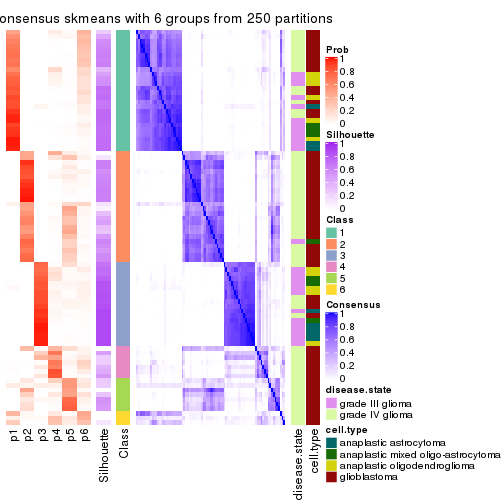</p>

</div>
</div>

Heatmaps for the membership of samples in all partitions to see how consistent they are:


<script>
$( function() {
	$( '#tabs-SD-skmeans-membership-heatmap' ).tabs();
} );
</script>
<div id='tabs-SD-skmeans-membership-heatmap'>
<ul>
<li><a href='#tab-SD-skmeans-membership-heatmap-1'>k = 2</a></li>
<li><a href='#tab-SD-skmeans-membership-heatmap-2'>k = 3</a></li>
<li><a href='#tab-SD-skmeans-membership-heatmap-3'>k = 4</a></li>
<li><a href='#tab-SD-skmeans-membership-heatmap-4'>k = 5</a></li>
<li><a href='#tab-SD-skmeans-membership-heatmap-5'>k = 6</a></li>
</ul>
<div id='tab-SD-skmeans-membership-heatmap-1'>
<pre><code class="r">membership_heatmap(res, k = 2)
</code></pre>

<p></p>

</div>
<div id='tab-SD-skmeans-membership-heatmap-2'>
<pre><code class="r">membership_heatmap(res, k = 3)
</code></pre>

<p></p>

</div>
<div id='tab-SD-skmeans-membership-heatmap-3'>
<pre><code class="r">membership_heatmap(res, k = 4)
</code></pre>

<p></p>

</div>
<div id='tab-SD-skmeans-membership-heatmap-4'>
<pre><code class="r">membership_heatmap(res, k = 5)
</code></pre>

<p></p>

</div>
<div id='tab-SD-skmeans-membership-heatmap-5'>
<pre><code class="r">membership_heatmap(res, k = 6)
</code></pre>

<p></p>

</div>
</div>

As soon as we have had the classes for columns, we can look for signatures
which are significantly different between classes which can be candidate marks
for certain classes. Following are the heatmaps for signatures.


Signature heatmaps where rows are scaled:


<script>
$( function() {
	$( '#tabs-SD-skmeans-get-signatures' ).tabs();
} );
</script>
<div id='tabs-SD-skmeans-get-signatures'>
<ul>
<li><a href='#tab-SD-skmeans-get-signatures-1'>k = 2</a></li>
<li><a href='#tab-SD-skmeans-get-signatures-2'>k = 3</a></li>
<li><a href='#tab-SD-skmeans-get-signatures-3'>k = 4</a></li>
<li><a href='#tab-SD-skmeans-get-signatures-4'>k = 5</a></li>
<li><a href='#tab-SD-skmeans-get-signatures-5'>k = 6</a></li>
</ul>
<div id='tab-SD-skmeans-get-signatures-1'>
<pre><code class="r">get_signatures(res, k = 2)
</code></pre>

<p></p>

</div>
<div id='tab-SD-skmeans-get-signatures-2'>
<pre><code class="r">get_signatures(res, k = 3)
</code></pre>

<p></p>

</div>
<div id='tab-SD-skmeans-get-signatures-3'>
<pre><code class="r">get_signatures(res, k = 4)
</code></pre>

<p></p>

</div>
<div id='tab-SD-skmeans-get-signatures-4'>
<pre><code class="r">get_signatures(res, k = 5)
</code></pre>

<p></p>

</div>
<div id='tab-SD-skmeans-get-signatures-5'>
<pre><code class="r">get_signatures(res, k = 6)
</code></pre>

<p></p>

</div>
</div>


Signature heatmaps where rows are not scaled:


<script>
$( function() {
	$( '#tabs-SD-skmeans-get-signatures-no-scale' ).tabs();
} );
</script>
<div id='tabs-SD-skmeans-get-signatures-no-scale'>
<ul>
<li><a href='#tab-SD-skmeans-get-signatures-no-scale-1'>k = 2</a></li>
<li><a href='#tab-SD-skmeans-get-signatures-no-scale-2'>k = 3</a></li>
<li><a href='#tab-SD-skmeans-get-signatures-no-scale-3'>k = 4</a></li>
<li><a href='#tab-SD-skmeans-get-signatures-no-scale-4'>k = 5</a></li>
<li><a href='#tab-SD-skmeans-get-signatures-no-scale-5'>k = 6</a></li>
</ul>
<div id='tab-SD-skmeans-get-signatures-no-scale-1'>
<pre><code class="r">get_signatures(res, k = 2, scale_rows = FALSE)
</code></pre>

<p></p>

</div>
<div id='tab-SD-skmeans-get-signatures-no-scale-2'>
<pre><code class="r">get_signatures(res, k = 3, scale_rows = FALSE)
</code></pre>

<p></p>

</div>
<div id='tab-SD-skmeans-get-signatures-no-scale-3'>
<pre><code class="r">get_signatures(res, k = 4, scale_rows = FALSE)
</code></pre>

<p></p>

</div>
<div id='tab-SD-skmeans-get-signatures-no-scale-4'>
<pre><code class="r">get_signatures(res, k = 5, scale_rows = FALSE)
</code></pre>

<p></p>

</div>
<div id='tab-SD-skmeans-get-signatures-no-scale-5'>
<pre><code class="r">get_signatures(res, k = 6, scale_rows = FALSE)
</code></pre>

<p></p>

</div>
</div>


Compare the overlap of signatures from different k:

```r
compare_signatures(res)
```


`get_signature()` returns a data frame invisibly. TO get the list of signatures, the function
call should be assigned to a variable explicitly. In following code, if `plot` argument is set
to `FALSE`, no heatmap is plotted while only the differential analysis is performed.

```r
# code only for demonstration
tb = get_signature(res, k = ..., plot = FALSE)
```

An example of the output of `tb` is:

```
#>   which_row         fdr    mean_1    mean_2 scaled_mean_1 scaled_mean_2 km
#> 1        38 0.042760348  8.373488  9.131774    -0.5533452     0.5164555  1
#> 2        40 0.018707592  7.106213  8.469186    -0.6173731     0.5762149  1
#> 3        55 0.019134737 10.221463 11.207825    -0.6159697     0.5749050  1
#> 4        59 0.006059896  5.921854  7.869574    -0.6899429     0.6439467  1
#> 5        60 0.018055526  8.928898 10.211722    -0.6204761     0.5791110  1
#> 6        98 0.009384629 15.714769 14.887706     0.6635654    -0.6193277  2
...
```

The columns in `tb` are:

1. `which_row`: row indices corresponding to the input matrix.
2. `fdr`: FDR for the differential test. 
3. `mean_x`: The mean value in group x.
4. `scaled_mean_x`: The mean value in group x after rows are scaled.
5. `km`: Row groups if k-means clustering is applied to rows.


UMAP plot which shows how samples are separated.


<script>
$( function() {
	$( '#tabs-SD-skmeans-dimension-reduction' ).tabs();
} );
</script>
<div id='tabs-SD-skmeans-dimension-reduction'>
<ul>
<li><a href='#tab-SD-skmeans-dimension-reduction-1'>k = 2</a></li>
<li><a href='#tab-SD-skmeans-dimension-reduction-2'>k = 3</a></li>
<li><a href='#tab-SD-skmeans-dimension-reduction-3'>k = 4</a></li>
<li><a href='#tab-SD-skmeans-dimension-reduction-4'>k = 5</a></li>
<li><a href='#tab-SD-skmeans-dimension-reduction-5'>k = 6</a></li>
</ul>
<div id='tab-SD-skmeans-dimension-reduction-1'>
<pre><code class="r">dimension_reduction(res, k = 2, method = &quot;UMAP&quot;)
</code></pre>

<p></p>

</div>
<div id='tab-SD-skmeans-dimension-reduction-2'>
<pre><code class="r">dimension_reduction(res, k = 3, method = &quot;UMAP&quot;)
</code></pre>

<p></p>

</div>
<div id='tab-SD-skmeans-dimension-reduction-3'>
<pre><code class="r">dimension_reduction(res, k = 4, method = &quot;UMAP&quot;)
</code></pre>

<p></p>

</div>
<div id='tab-SD-skmeans-dimension-reduction-4'>
<pre><code class="r">dimension_reduction(res, k = 5, method = &quot;UMAP&quot;)
</code></pre>

<p></p>

</div>
<div id='tab-SD-skmeans-dimension-reduction-5'>
<pre><code class="r">dimension_reduction(res, k = 6, method = &quot;UMAP&quot;)
</code></pre>

<p></p>

</div>
</div>


Following heatmap shows how subgroups are split when increasing `k`:

```r
collect_classes(res)
```


Test correlation between subgroups and known annotations. If the known
annotation is numeric, one-way ANOVA test is applied, and if the known
annotation is discrete, chi-squared contingency table test is applied.

```r
test_to_known_factors(res)
```

```
#>             n disease.state(p) cell.type(p) k
#> SD:skmeans 69         2.56e-03     0.008903 2
#> SD:skmeans 84         8.79e-05     0.002744 3
#> SD:skmeans 77         6.68e-06     0.000871 4
#> SD:skmeans 71         1.49e-04     0.019314 5
#> SD:skmeans 59         1.31e-03     0.089662 6
```


If matrix rows can be associated to genes, consider to use `GO_Enrichment(res,
...)` to perform function enrichment for the signature genes.


 

---------------------------------------------------


### SD:pam**


The object with results only for a single top-value method and a single partition method 
can be extracted as:

```r
res = res_list["SD", "pam"]
# you can also extract it by
# res = res_list["SD:pam"]
```

A summary of `res` and all the functions that can be applied to it:

```r
res
```

```
#> A 'ConsensusPartition' object with k = 2, 3, 4, 5, 6.
#>   On a matrix with 21512 rows and 85 columns.
#>   Top rows (1000, 2000, 3000, 4000, 5000) are extracted by 'SD' method.
#>   Subgroups are detected by 'pam' method.
#>   Performed in total 1250 partitions by row resampling.
#>   Best k for subgroups seems to be 3.
#> 
#> Following methods can be applied to this 'ConsensusPartition' object:
#>  [1] "cola_report"             "collect_classes"         "collect_plots"          
#>  [4] "collect_stats"           "colnames"                "compare_signatures"     
#>  [7] "consensus_heatmap"       "dimension_reduction"     "functional_enrichment"  
#> [10] "get_anno_col"            "get_anno"                "get_classes"            
#> [13] "get_consensus"           "get_matrix"              "get_membership"         
#> [16] "get_param"               "get_signatures"          "get_stats"              
#> [19] "is_best_k"               "is_stable_k"             "membership_heatmap"     
#> [22] "ncol"                    "nrow"                    "plot_ecdf"              
#> [25] "rownames"                "select_partition_number" "show"                   
#> [28] "suggest_best_k"          "test_to_known_factors"
```

`collect_plots()` function collects all the plots made from `res` for all `k` (number of partitions)
into one single page to provide an easy and fast comparison between different `k`.

```r
collect_plots(res)
```

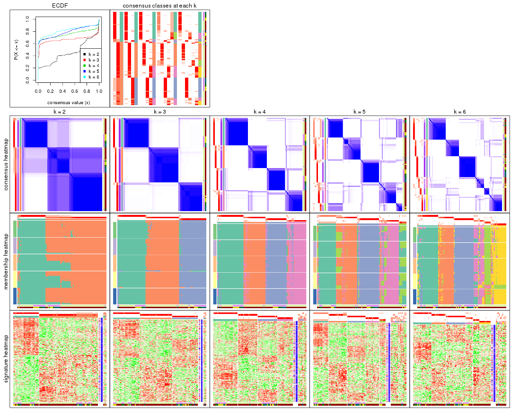

The plots are:

- The first row: a plot of the ECDF (Empirical cumulative distribution
  function) curves of the consensus matrix for each `k` and the heatmap of
  predicted classes for each `k`.
- The second row: heatmaps of the consensus matrix for each `k`.
- The third row: heatmaps of the membership matrix for each `k`.
- The fouth row: heatmaps of the signatures for each `k`.

All the plots in panels can be made by individual functions and they are
plotted later in this section.

`select_partition_number()` produces several plots showing different
statistics for choosing "optimized" `k`. There are following statistics:

- ECDF curves of the consensus matrix for each `k`;
- 1-PAC. [The PAC
  score](https://en.wikipedia.org/wiki/Consensus_clustering#Over-interpretation_potential_of_consensus_clustering)
  measures the proportion of the ambiguous subgrouping.
- Mean silhouette score.
- Concordance. The mean probability of fiting the consensus class ids in all
  partitions.
- Area increased. Denote $A_k$ as the area under the ECDF curve for current
  `k`, the area increased is defined as $A_k - A_{k-1}$.
- Rand index. The percent of pairs of samples that are both in a same cluster
  or both are not in a same cluster in the partition of k and k-1.
- Jaccard index. The ratio of pairs of samples are both in a same cluster in
  the partition of k and k-1 and the pairs of samples are both in a same
  cluster in the partition k or k-1.

The detailed explanations of these statistics can be found in [the cola
vignette](http://bioconductor.org/packages/devel/bioc/vignettes/cola/inst/doc/cola.html#toc_13).

Generally speaking, lower PAC score, higher mean silhouette score or higher
concordance corresponds to better partition. Rand index and Jaccard index
measure how similar the current partition is compared to partition with `k-1`.
If they are too similar, we won't accept `k` is better than `k-1`.

```r
select_partition_number(res)
```


The numeric values for all these statistics can be obtained by `get_stats()`.

```r
get_stats(res)
```

```
#>   k 1-PAC mean_silhouette concordance area_increased  Rand Jaccard
#> 2 2 0.555           0.827       0.907         0.4507 0.561   0.561
#> 3 3 0.973           0.937       0.970         0.4887 0.738   0.545
#> 4 4 0.895           0.846       0.939         0.1252 0.860   0.606
#> 5 5 0.805           0.689       0.839         0.0460 0.944   0.780
#> 6 6 0.851           0.755       0.878         0.0365 0.920   0.656
```

`suggest_best_k()` suggests the best $k$ based on these statistics. The rules are as follows:

- All $k$ with Jaccard index larger than 0.95 are removed because the increase of
  the partition number does not provides enough extra information. If all $k$ are removed,
  the best $k$ is assigned by `NA`.
- For $k$ with 1-PAC larger than 0.9, the maximal $k$ is taken as the "best k". Other $k$ is called "optional k".
- If it does not fit the second rule. The $k$ with the highest vote of highest
  1-PAC, mean silhouette and concordance is taken as the "best k".

```r
suggest_best_k(res)
```

```
#> [1] 3
```


Following shows the table of the partitions (You need to click the **show/hide
code output** link to see it). The membership matrix (columns with name `p*`)
is inferred by
[`clue::cl_consensus()`](https://www.rdocumentation.org/link/cl_consensus?package=clue)
function with the `SE` method. Basically the value in the membership matrix
represents the probability to belong to a certain group. The finall class
label for an item is determined with the group with highest probability it
belongs to.

In `get_classes()` function, the entropy is calculated from the membership
matrix and the silhouette score is calculated from the consensus matrix.


<script>
$( function() {
	$( '#tabs-SD-pam-get-classes' ).tabs();
} );
</script>
<div id='tabs-SD-pam-get-classes'>
<ul>
<li><a href='#tab-SD-pam-get-classes-1'>k = 2</a></li>
<li><a href='#tab-SD-pam-get-classes-2'>k = 3</a></li>
<li><a href='#tab-SD-pam-get-classes-3'>k = 4</a></li>
<li><a href='#tab-SD-pam-get-classes-4'>k = 5</a></li>
<li><a href='#tab-SD-pam-get-classes-5'>k = 6</a></li>
</ul>

<div id='tab-SD-pam-get-classes-1'>
<p><a id='tab-SD-pam-get-classes-1-a' style='color:#0366d6' href='#'>show/hide code output</a></p>
<pre><code class="r">cbind(get_classes(res, k = 2), get_membership(res, k = 2))
</code></pre>

<pre><code>#&gt;          class entropy silhouette    p1    p2
#&gt; GSM99497     2  0.8955     0.6987 0.312 0.688
#&gt; GSM99503     1  0.0000     0.9514 1.000 0.000
#&gt; GSM99505     1  0.0000     0.9514 1.000 0.000
#&gt; GSM99507     2  0.8955     0.6987 0.312 0.688
#&gt; GSM99567     2  0.8955     0.6987 0.312 0.688
#&gt; GSM99575     1  0.0000     0.9514 1.000 0.000
#&gt; GSM99593     2  0.8955     0.6987 0.312 0.688
#&gt; GSM99595     2  0.8955     0.6987 0.312 0.688
#&gt; GSM99469     1  0.0000     0.9514 1.000 0.000
#&gt; GSM99499     1  0.0000     0.9514 1.000 0.000
#&gt; GSM99501     1  0.0000     0.9514 1.000 0.000
#&gt; GSM99509     2  0.9000     0.6929 0.316 0.684
#&gt; GSM99569     2  0.8955     0.6987 0.312 0.688
#&gt; GSM99597     2  0.8955     0.6987 0.312 0.688
#&gt; GSM99601     2  0.0000     0.8632 0.000 1.000
#&gt; GSM99459     1  0.0000     0.9514 1.000 0.000
#&gt; GSM99461     1  0.0000     0.9514 1.000 0.000
#&gt; GSM99511     2  0.8955     0.6987 0.312 0.688
#&gt; GSM99513     2  0.8955     0.6987 0.312 0.688
#&gt; GSM99515     2  0.8955     0.6987 0.312 0.688
#&gt; GSM99517     1  0.0000     0.9514 1.000 0.000
#&gt; GSM99519     1  0.0000     0.9514 1.000 0.000
#&gt; GSM99521     2  0.8861     0.7072 0.304 0.696
#&gt; GSM99523     1  0.9000     0.3944 0.684 0.316
#&gt; GSM99571     1  0.0000     0.9514 1.000 0.000
#&gt; GSM99599     1  0.0000     0.9514 1.000 0.000
#&gt; GSM99433     2  0.0000     0.8632 0.000 1.000
#&gt; GSM99435     2  0.7674     0.7748 0.224 0.776
#&gt; GSM99437     2  0.0000     0.8632 0.000 1.000
#&gt; GSM99439     2  0.0000     0.8632 0.000 1.000
#&gt; GSM99441     1  0.0000     0.9514 1.000 0.000
#&gt; GSM99443     2  0.0000     0.8632 0.000 1.000
#&gt; GSM99445     2  0.0000     0.8632 0.000 1.000
#&gt; GSM99447     2  0.0000     0.8632 0.000 1.000
#&gt; GSM99449     2  0.0000     0.8632 0.000 1.000
#&gt; GSM99451     2  0.8608     0.7269 0.284 0.716
#&gt; GSM99453     1  0.0000     0.9514 1.000 0.000
#&gt; GSM99455     1  0.0000     0.9514 1.000 0.000
#&gt; GSM99457     1  0.0000     0.9514 1.000 0.000
#&gt; GSM99463     2  0.0000     0.8632 0.000 1.000
#&gt; GSM99465     2  0.7745     0.7729 0.228 0.772
#&gt; GSM99467     2  0.0000     0.8632 0.000 1.000
#&gt; GSM99471     1  0.9963    -0.0743 0.536 0.464
#&gt; GSM99473     1  0.7219     0.7111 0.800 0.200
#&gt; GSM99475     2  0.8081     0.7580 0.248 0.752
#&gt; GSM99477     2  0.0000     0.8632 0.000 1.000
#&gt; GSM99479     2  0.0000     0.8632 0.000 1.000
#&gt; GSM99481     1  0.0000     0.9514 1.000 0.000
#&gt; GSM99483     1  0.0000     0.9514 1.000 0.000
#&gt; GSM99485     2  0.0000     0.8632 0.000 1.000
#&gt; GSM99487     2  0.0000     0.8632 0.000 1.000
#&gt; GSM99489     2  0.0000     0.8632 0.000 1.000
#&gt; GSM99491     2  0.0000     0.8632 0.000 1.000
#&gt; GSM99493     1  0.0000     0.9514 1.000 0.000
#&gt; GSM99495     2  0.0000     0.8632 0.000 1.000
#&gt; GSM99525     1  0.0000     0.9514 1.000 0.000
#&gt; GSM99527     2  0.2423     0.8533 0.040 0.960
#&gt; GSM99529     2  0.0000     0.8632 0.000 1.000
#&gt; GSM99531     2  0.8016     0.7611 0.244 0.756
#&gt; GSM99533     2  0.8443     0.7328 0.272 0.728
#&gt; GSM99535     2  0.2948     0.8326 0.052 0.948
#&gt; GSM99537     1  0.0000     0.9514 1.000 0.000
#&gt; GSM99539     2  0.0000     0.8632 0.000 1.000
#&gt; GSM99541     1  0.0000     0.9514 1.000 0.000
#&gt; GSM99543     2  0.0672     0.8594 0.008 0.992
#&gt; GSM99545     2  0.0000     0.8632 0.000 1.000
#&gt; GSM99547     2  0.4431     0.8163 0.092 0.908
#&gt; GSM99549     2  0.0000     0.8632 0.000 1.000
#&gt; GSM99551     2  0.7602     0.7774 0.220 0.780
#&gt; GSM99553     2  0.7453     0.7812 0.212 0.788
#&gt; GSM99555     2  0.0000     0.8632 0.000 1.000
#&gt; GSM99557     2  0.0000     0.8632 0.000 1.000
#&gt; GSM99559     2  0.5294     0.8249 0.120 0.880
#&gt; GSM99561     2  0.0000     0.8632 0.000 1.000
#&gt; GSM99563     2  0.9909     0.4312 0.444 0.556
#&gt; GSM99565     2  0.0000     0.8632 0.000 1.000
#&gt; GSM99573     2  0.0000     0.8632 0.000 1.000
#&gt; GSM99577     1  0.3879     0.8686 0.924 0.076
#&gt; GSM99579     2  0.0000     0.8632 0.000 1.000
#&gt; GSM99581     2  0.7453     0.7812 0.212 0.788
#&gt; GSM99583     2  0.7453     0.7812 0.212 0.788
#&gt; GSM99585     2  0.0000     0.8632 0.000 1.000
#&gt; GSM99587     1  0.0000     0.9514 1.000 0.000
#&gt; GSM99589     2  0.0000     0.8632 0.000 1.000
#&gt; GSM99591     2  0.0000     0.8632 0.000 1.000
</code></pre>

<script>
$('#tab-SD-pam-get-classes-1-a').parent().next().next().hide();
$('#tab-SD-pam-get-classes-1-a').click(function(){
  $('#tab-SD-pam-get-classes-1-a').parent().next().next().toggle();
  return(false);
});
</script>
</div>

<div id='tab-SD-pam-get-classes-2'>
<p><a id='tab-SD-pam-get-classes-2-a' style='color:#0366d6' href='#'>show/hide code output</a></p>
<pre><code class="r">cbind(get_classes(res, k = 3), get_membership(res, k = 3))
</code></pre>

<pre><code>#&gt;          class entropy silhouette    p1    p2    p3
#&gt; GSM99497     3  0.0592      0.964 0.012 0.000 0.988
#&gt; GSM99503     1  0.0000      0.976 1.000 0.000 0.000
#&gt; GSM99505     1  0.6045      0.362 0.620 0.000 0.380
#&gt; GSM99507     3  0.0592      0.964 0.012 0.000 0.988
#&gt; GSM99567     3  0.0592      0.964 0.012 0.000 0.988
#&gt; GSM99575     1  0.0000      0.976 1.000 0.000 0.000
#&gt; GSM99593     3  0.0592      0.964 0.012 0.000 0.988
#&gt; GSM99595     3  0.0592      0.964 0.012 0.000 0.988
#&gt; GSM99469     1  0.0000      0.976 1.000 0.000 0.000
#&gt; GSM99499     1  0.3619      0.829 0.864 0.000 0.136
#&gt; GSM99501     1  0.0000      0.976 1.000 0.000 0.000
#&gt; GSM99509     3  0.0592      0.964 0.012 0.000 0.988
#&gt; GSM99569     3  0.0592      0.964 0.012 0.000 0.988
#&gt; GSM99597     3  0.0592      0.964 0.012 0.000 0.988
#&gt; GSM99601     2  0.0000      0.970 0.000 1.000 0.000
#&gt; GSM99459     1  0.0000      0.976 1.000 0.000 0.000
#&gt; GSM99461     1  0.0000      0.976 1.000 0.000 0.000
#&gt; GSM99511     3  0.0592      0.964 0.012 0.000 0.988
#&gt; GSM99513     3  0.0592      0.964 0.012 0.000 0.988
#&gt; GSM99515     3  0.0592      0.964 0.012 0.000 0.988
#&gt; GSM99517     1  0.0000      0.976 1.000 0.000 0.000
#&gt; GSM99519     1  0.0000      0.976 1.000 0.000 0.000
#&gt; GSM99521     3  0.0424      0.963 0.008 0.000 0.992
#&gt; GSM99523     3  0.0592      0.964 0.012 0.000 0.988
#&gt; GSM99571     1  0.0000      0.976 1.000 0.000 0.000
#&gt; GSM99599     1  0.0000      0.976 1.000 0.000 0.000
#&gt; GSM99433     2  0.0000      0.970 0.000 1.000 0.000
#&gt; GSM99435     3  0.0000      0.960 0.000 0.000 1.000
#&gt; GSM99437     2  0.0000      0.970 0.000 1.000 0.000
#&gt; GSM99439     2  0.0000      0.970 0.000 1.000 0.000
#&gt; GSM99441     1  0.0000      0.976 1.000 0.000 0.000
#&gt; GSM99443     2  0.0000      0.970 0.000 1.000 0.000
#&gt; GSM99445     2  0.0000      0.970 0.000 1.000 0.000
#&gt; GSM99447     2  0.0000      0.970 0.000 1.000 0.000
#&gt; GSM99449     3  0.0592      0.958 0.000 0.012 0.988
#&gt; GSM99451     3  0.1015      0.961 0.012 0.008 0.980
#&gt; GSM99453     1  0.0000      0.976 1.000 0.000 0.000
#&gt; GSM99455     1  0.0000      0.976 1.000 0.000 0.000
#&gt; GSM99457     1  0.0000      0.976 1.000 0.000 0.000
#&gt; GSM99463     2  0.0000      0.970 0.000 1.000 0.000
#&gt; GSM99465     3  0.6935      0.368 0.372 0.024 0.604
#&gt; GSM99467     2  0.0592      0.967 0.000 0.988 0.012
#&gt; GSM99471     1  0.1182      0.958 0.976 0.012 0.012
#&gt; GSM99473     1  0.1182      0.958 0.976 0.012 0.012
#&gt; GSM99475     3  0.0983      0.953 0.004 0.016 0.980
#&gt; GSM99477     2  0.0592      0.967 0.000 0.988 0.012
#&gt; GSM99479     2  0.2448      0.916 0.000 0.924 0.076
#&gt; GSM99481     1  0.0000      0.976 1.000 0.000 0.000
#&gt; GSM99483     1  0.0000      0.976 1.000 0.000 0.000
#&gt; GSM99485     2  0.0592      0.967 0.000 0.988 0.012
#&gt; GSM99487     2  0.0000      0.970 0.000 1.000 0.000
#&gt; GSM99489     2  0.0000      0.970 0.000 1.000 0.000
#&gt; GSM99491     2  0.0000      0.970 0.000 1.000 0.000
#&gt; GSM99493     1  0.0000      0.976 1.000 0.000 0.000
#&gt; GSM99495     2  0.0000      0.970 0.000 1.000 0.000
#&gt; GSM99525     1  0.0000      0.976 1.000 0.000 0.000
#&gt; GSM99527     2  0.2280      0.931 0.052 0.940 0.008
#&gt; GSM99529     3  0.2878      0.875 0.000 0.096 0.904
#&gt; GSM99531     3  0.1337      0.956 0.012 0.016 0.972
#&gt; GSM99533     3  0.5461      0.703 0.216 0.016 0.768
#&gt; GSM99535     2  0.4749      0.791 0.172 0.816 0.012
#&gt; GSM99537     1  0.0000      0.976 1.000 0.000 0.000
#&gt; GSM99539     2  0.1529      0.946 0.000 0.960 0.040
#&gt; GSM99541     1  0.0000      0.976 1.000 0.000 0.000
#&gt; GSM99543     2  0.3207      0.898 0.084 0.904 0.012
#&gt; GSM99545     2  0.0592      0.964 0.000 0.988 0.012
#&gt; GSM99547     2  0.6796      0.412 0.368 0.612 0.020
#&gt; GSM99549     2  0.0237      0.969 0.000 0.996 0.004
#&gt; GSM99551     1  0.1337      0.954 0.972 0.016 0.012
#&gt; GSM99553     3  0.0000      0.960 0.000 0.000 1.000
#&gt; GSM99555     2  0.0000      0.970 0.000 1.000 0.000
#&gt; GSM99557     2  0.0000      0.970 0.000 1.000 0.000
#&gt; GSM99559     3  0.0000      0.960 0.000 0.000 1.000
#&gt; GSM99561     2  0.0000      0.970 0.000 1.000 0.000
#&gt; GSM99563     3  0.0592      0.964 0.012 0.000 0.988
#&gt; GSM99565     2  0.0000      0.970 0.000 1.000 0.000
#&gt; GSM99573     2  0.0424      0.968 0.000 0.992 0.008
#&gt; GSM99577     1  0.0000      0.976 1.000 0.000 0.000
#&gt; GSM99579     2  0.0592      0.967 0.000 0.988 0.012
#&gt; GSM99581     3  0.0000      0.960 0.000 0.000 1.000
#&gt; GSM99583     3  0.0983      0.950 0.004 0.016 0.980
#&gt; GSM99585     2  0.0592      0.967 0.000 0.988 0.012
#&gt; GSM99587     1  0.0000      0.976 1.000 0.000 0.000
#&gt; GSM99589     2  0.1163      0.958 0.000 0.972 0.028
#&gt; GSM99591     2  0.0000      0.970 0.000 1.000 0.000
</code></pre>

<script>
$('#tab-SD-pam-get-classes-2-a').parent().next().next().hide();
$('#tab-SD-pam-get-classes-2-a').click(function(){
  $('#tab-SD-pam-get-classes-2-a').parent().next().next().toggle();
  return(false);
});
</script>
</div>

<div id='tab-SD-pam-get-classes-3'>
<p><a id='tab-SD-pam-get-classes-3-a' style='color:#0366d6' href='#'>show/hide code output</a></p>
<pre><code class="r">cbind(get_classes(res, k = 4), get_membership(res, k = 4))
</code></pre>

<pre><code>#&gt;          class entropy silhouette    p1    p2    p3    p4
#&gt; GSM99497     3  0.0000     0.9582 0.000 0.000 1.000 0.000
#&gt; GSM99503     1  0.0000     0.9640 1.000 0.000 0.000 0.000
#&gt; GSM99505     1  0.4790     0.4069 0.620 0.000 0.380 0.000
#&gt; GSM99507     3  0.0000     0.9582 0.000 0.000 1.000 0.000
#&gt; GSM99567     3  0.0000     0.9582 0.000 0.000 1.000 0.000
#&gt; GSM99575     1  0.0000     0.9640 1.000 0.000 0.000 0.000
#&gt; GSM99593     3  0.0000     0.9582 0.000 0.000 1.000 0.000
#&gt; GSM99595     3  0.0000     0.9582 0.000 0.000 1.000 0.000
#&gt; GSM99469     1  0.0000     0.9640 1.000 0.000 0.000 0.000
#&gt; GSM99499     1  0.2868     0.8306 0.864 0.000 0.136 0.000
#&gt; GSM99501     1  0.0000     0.9640 1.000 0.000 0.000 0.000
#&gt; GSM99509     3  0.0000     0.9582 0.000 0.000 1.000 0.000
#&gt; GSM99569     3  0.0000     0.9582 0.000 0.000 1.000 0.000
#&gt; GSM99597     3  0.0000     0.9582 0.000 0.000 1.000 0.000
#&gt; GSM99601     2  0.0000     0.9122 0.000 1.000 0.000 0.000
#&gt; GSM99459     1  0.0000     0.9640 1.000 0.000 0.000 0.000
#&gt; GSM99461     1  0.0000     0.9640 1.000 0.000 0.000 0.000
#&gt; GSM99511     3  0.0000     0.9582 0.000 0.000 1.000 0.000
#&gt; GSM99513     3  0.0000     0.9582 0.000 0.000 1.000 0.000
#&gt; GSM99515     3  0.0000     0.9582 0.000 0.000 1.000 0.000
#&gt; GSM99517     1  0.0000     0.9640 1.000 0.000 0.000 0.000
#&gt; GSM99519     1  0.0000     0.9640 1.000 0.000 0.000 0.000
#&gt; GSM99521     3  0.0000     0.9582 0.000 0.000 1.000 0.000
#&gt; GSM99523     3  0.0000     0.9582 0.000 0.000 1.000 0.000
#&gt; GSM99571     1  0.0000     0.9640 1.000 0.000 0.000 0.000
#&gt; GSM99599     1  0.0000     0.9640 1.000 0.000 0.000 0.000
#&gt; GSM99433     2  0.0817     0.9018 0.000 0.976 0.000 0.024
#&gt; GSM99435     3  0.4500     0.5288 0.000 0.000 0.684 0.316
#&gt; GSM99437     2  0.0000     0.9122 0.000 1.000 0.000 0.000
#&gt; GSM99439     2  0.0000     0.9122 0.000 1.000 0.000 0.000
#&gt; GSM99441     1  0.0000     0.9640 1.000 0.000 0.000 0.000
#&gt; GSM99443     2  0.0000     0.9122 0.000 1.000 0.000 0.000
#&gt; GSM99445     2  0.0000     0.9122 0.000 1.000 0.000 0.000
#&gt; GSM99447     2  0.3400     0.7693 0.000 0.820 0.000 0.180
#&gt; GSM99449     3  0.0000     0.9582 0.000 0.000 1.000 0.000
#&gt; GSM99451     3  0.4877     0.2967 0.000 0.000 0.592 0.408
#&gt; GSM99453     1  0.0000     0.9640 1.000 0.000 0.000 0.000
#&gt; GSM99455     1  0.0000     0.9640 1.000 0.000 0.000 0.000
#&gt; GSM99457     1  0.0000     0.9640 1.000 0.000 0.000 0.000
#&gt; GSM99463     2  0.0188     0.9109 0.000 0.996 0.000 0.004
#&gt; GSM99465     4  0.0188     0.8717 0.004 0.000 0.000 0.996
#&gt; GSM99467     4  0.0000     0.8728 0.000 0.000 0.000 1.000
#&gt; GSM99471     4  0.5000    -0.0123 0.500 0.000 0.000 0.500
#&gt; GSM99473     1  0.3726     0.7065 0.788 0.000 0.000 0.212
#&gt; GSM99475     4  0.4948     0.2049 0.000 0.000 0.440 0.560
#&gt; GSM99477     4  0.0000     0.8728 0.000 0.000 0.000 1.000
#&gt; GSM99479     4  0.0000     0.8728 0.000 0.000 0.000 1.000
#&gt; GSM99481     1  0.0000     0.9640 1.000 0.000 0.000 0.000
#&gt; GSM99483     1  0.0000     0.9640 1.000 0.000 0.000 0.000
#&gt; GSM99485     4  0.0000     0.8728 0.000 0.000 0.000 1.000
#&gt; GSM99487     2  0.0000     0.9122 0.000 1.000 0.000 0.000
#&gt; GSM99489     2  0.0000     0.9122 0.000 1.000 0.000 0.000
#&gt; GSM99491     2  0.3764     0.7244 0.000 0.784 0.000 0.216
#&gt; GSM99493     1  0.0000     0.9640 1.000 0.000 0.000 0.000
#&gt; GSM99495     2  0.0000     0.9122 0.000 1.000 0.000 0.000
#&gt; GSM99525     1  0.0000     0.9640 1.000 0.000 0.000 0.000
#&gt; GSM99527     4  0.1792     0.8225 0.000 0.068 0.000 0.932
#&gt; GSM99529     4  0.0000     0.8728 0.000 0.000 0.000 1.000
#&gt; GSM99531     4  0.4585     0.4814 0.000 0.000 0.332 0.668
#&gt; GSM99533     4  0.1452     0.8531 0.036 0.000 0.008 0.956
#&gt; GSM99535     4  0.1302     0.8495 0.044 0.000 0.000 0.956
#&gt; GSM99537     1  0.0000     0.9640 1.000 0.000 0.000 0.000
#&gt; GSM99539     4  0.4996    -0.0979 0.000 0.484 0.000 0.516
#&gt; GSM99541     1  0.0000     0.9640 1.000 0.000 0.000 0.000
#&gt; GSM99543     4  0.0000     0.8728 0.000 0.000 0.000 1.000
#&gt; GSM99545     2  0.0188     0.9104 0.000 0.996 0.004 0.000
#&gt; GSM99547     4  0.1867     0.8272 0.072 0.000 0.000 0.928
#&gt; GSM99549     2  0.4661     0.4959 0.000 0.652 0.000 0.348
#&gt; GSM99551     4  0.0000     0.8728 0.000 0.000 0.000 1.000
#&gt; GSM99553     3  0.0000     0.9582 0.000 0.000 1.000 0.000
#&gt; GSM99555     2  0.0000     0.9122 0.000 1.000 0.000 0.000
#&gt; GSM99557     2  0.1716     0.8768 0.000 0.936 0.000 0.064
#&gt; GSM99559     3  0.0707     0.9401 0.000 0.000 0.980 0.020
#&gt; GSM99561     2  0.0707     0.9036 0.000 0.980 0.000 0.020
#&gt; GSM99563     3  0.0000     0.9582 0.000 0.000 1.000 0.000
#&gt; GSM99565     2  0.0000     0.9122 0.000 1.000 0.000 0.000
#&gt; GSM99573     2  0.4382     0.6073 0.000 0.704 0.000 0.296
#&gt; GSM99577     1  0.1716     0.9044 0.936 0.000 0.000 0.064
#&gt; GSM99579     4  0.0000     0.8728 0.000 0.000 0.000 1.000
#&gt; GSM99581     3  0.0000     0.9582 0.000 0.000 1.000 0.000
#&gt; GSM99583     4  0.0000     0.8728 0.000 0.000 0.000 1.000
#&gt; GSM99585     2  0.4994     0.1358 0.000 0.520 0.000 0.480
#&gt; GSM99587     1  0.0000     0.9640 1.000 0.000 0.000 0.000
#&gt; GSM99589     4  0.0469     0.8670 0.000 0.012 0.000 0.988
#&gt; GSM99591     2  0.0000     0.9122 0.000 1.000 0.000 0.000
</code></pre>

<script>
$('#tab-SD-pam-get-classes-3-a').parent().next().next().hide();
$('#tab-SD-pam-get-classes-3-a').click(function(){
  $('#tab-SD-pam-get-classes-3-a').parent().next().next().toggle();
  return(false);
});
</script>
</div>

<div id='tab-SD-pam-get-classes-4'>
<p><a id='tab-SD-pam-get-classes-4-a' style='color:#0366d6' href='#'>show/hide code output</a></p>
<pre><code class="r">cbind(get_classes(res, k = 5), get_membership(res, k = 5))
</code></pre>

<pre><code>#&gt;          class entropy silhouette    p1    p2    p3    p4    p5
#&gt; GSM99497     3  0.0000    0.91720 0.000 0.000 1.000 0.000 0.000
#&gt; GSM99503     1  0.4074    0.81092 0.636 0.000 0.000 0.000 0.364
#&gt; GSM99505     3  0.6783   -0.35625 0.296 0.000 0.388 0.000 0.316
#&gt; GSM99507     3  0.0000    0.91720 0.000 0.000 1.000 0.000 0.000
#&gt; GSM99567     3  0.0000    0.91720 0.000 0.000 1.000 0.000 0.000
#&gt; GSM99575     1  0.4074    0.81092 0.636 0.000 0.000 0.000 0.364
#&gt; GSM99593     3  0.0000    0.91720 0.000 0.000 1.000 0.000 0.000
#&gt; GSM99595     3  0.0000    0.91720 0.000 0.000 1.000 0.000 0.000
#&gt; GSM99469     1  0.4114    0.79330 0.624 0.000 0.000 0.000 0.376
#&gt; GSM99499     1  0.6153    0.44032 0.484 0.000 0.136 0.000 0.380
#&gt; GSM99501     1  0.4101    0.79886 0.628 0.000 0.000 0.000 0.372
#&gt; GSM99509     3  0.0000    0.91720 0.000 0.000 1.000 0.000 0.000
#&gt; GSM99569     3  0.0000    0.91720 0.000 0.000 1.000 0.000 0.000
#&gt; GSM99597     3  0.0000    0.91720 0.000 0.000 1.000 0.000 0.000
#&gt; GSM99601     2  0.0000    0.84053 0.000 1.000 0.000 0.000 0.000
#&gt; GSM99459     5  0.2966    0.72729 0.184 0.000 0.000 0.000 0.816
#&gt; GSM99461     5  0.2966    0.72729 0.184 0.000 0.000 0.000 0.816
#&gt; GSM99511     3  0.0000    0.91720 0.000 0.000 1.000 0.000 0.000
#&gt; GSM99513     3  0.0000    0.91720 0.000 0.000 1.000 0.000 0.000
#&gt; GSM99515     3  0.0000    0.91720 0.000 0.000 1.000 0.000 0.000
#&gt; GSM99517     1  0.4074    0.81092 0.636 0.000 0.000 0.000 0.364
#&gt; GSM99519     5  0.3143    0.69887 0.204 0.000 0.000 0.000 0.796
#&gt; GSM99521     3  0.0000    0.91720 0.000 0.000 1.000 0.000 0.000
#&gt; GSM99523     3  0.0162    0.91441 0.000 0.000 0.996 0.000 0.004
#&gt; GSM99571     1  0.4074    0.81092 0.636 0.000 0.000 0.000 0.364
#&gt; GSM99599     1  0.4074    0.81092 0.636 0.000 0.000 0.000 0.364
#&gt; GSM99433     2  0.0703    0.83441 0.000 0.976 0.000 0.024 0.000
#&gt; GSM99435     3  0.3876    0.48523 0.000 0.000 0.684 0.316 0.000
#&gt; GSM99437     2  0.0000    0.84053 0.000 1.000 0.000 0.000 0.000
#&gt; GSM99439     2  0.4074    0.71187 0.364 0.636 0.000 0.000 0.000
#&gt; GSM99441     1  0.4074    0.81092 0.636 0.000 0.000 0.000 0.364
#&gt; GSM99443     2  0.0000    0.84053 0.000 1.000 0.000 0.000 0.000
#&gt; GSM99445     2  0.0000    0.84053 0.000 1.000 0.000 0.000 0.000
#&gt; GSM99447     2  0.2929    0.71294 0.000 0.820 0.000 0.180 0.000
#&gt; GSM99449     3  0.0000    0.91720 0.000 0.000 1.000 0.000 0.000
#&gt; GSM99451     3  0.6733   -0.00801 0.000 0.000 0.416 0.296 0.288
#&gt; GSM99453     1  0.4074    0.81092 0.636 0.000 0.000 0.000 0.364
#&gt; GSM99455     1  0.4074    0.81092 0.636 0.000 0.000 0.000 0.364
#&gt; GSM99457     5  0.2966    0.72395 0.184 0.000 0.000 0.000 0.816
#&gt; GSM99463     2  0.4074    0.71187 0.364 0.636 0.000 0.000 0.000
#&gt; GSM99465     4  0.4300    0.36821 0.000 0.000 0.000 0.524 0.476
#&gt; GSM99467     4  0.0000    0.78636 0.000 0.000 0.000 1.000 0.000
#&gt; GSM99471     4  0.6442   -0.08194 0.300 0.000 0.000 0.492 0.208
#&gt; GSM99473     1  0.6598    0.21153 0.428 0.000 0.000 0.216 0.356
#&gt; GSM99475     4  0.6642    0.22875 0.000 0.000 0.352 0.420 0.228
#&gt; GSM99477     4  0.0000    0.78636 0.000 0.000 0.000 1.000 0.000
#&gt; GSM99479     4  0.0000    0.78636 0.000 0.000 0.000 1.000 0.000
#&gt; GSM99481     1  0.4074    0.81092 0.636 0.000 0.000 0.000 0.364
#&gt; GSM99483     1  0.4074    0.81092 0.636 0.000 0.000 0.000 0.364
#&gt; GSM99485     4  0.0000    0.78636 0.000 0.000 0.000 1.000 0.000
#&gt; GSM99487     2  0.0000    0.84053 0.000 1.000 0.000 0.000 0.000
#&gt; GSM99489     2  0.4015    0.72020 0.348 0.652 0.000 0.000 0.000
#&gt; GSM99491     2  0.3242    0.68466 0.000 0.784 0.000 0.216 0.000
#&gt; GSM99493     1  0.4074    0.81092 0.636 0.000 0.000 0.000 0.364
#&gt; GSM99495     2  0.4074    0.71187 0.364 0.636 0.000 0.000 0.000
#&gt; GSM99525     1  0.4074    0.81092 0.636 0.000 0.000 0.000 0.364
#&gt; GSM99527     4  0.4971    0.36662 0.000 0.028 0.000 0.512 0.460
#&gt; GSM99529     4  0.0000    0.78636 0.000 0.000 0.000 1.000 0.000
#&gt; GSM99531     4  0.6234    0.40201 0.000 0.000 0.296 0.528 0.176
#&gt; GSM99533     4  0.4323    0.57766 0.000 0.000 0.012 0.656 0.332
#&gt; GSM99535     4  0.1168    0.76494 0.008 0.000 0.000 0.960 0.032
#&gt; GSM99537     5  0.4161   -0.25134 0.392 0.000 0.000 0.000 0.608
#&gt; GSM99539     4  0.4304   -0.08133 0.000 0.484 0.000 0.516 0.000
#&gt; GSM99541     5  0.0000    0.65299 0.000 0.000 0.000 0.000 1.000
#&gt; GSM99543     4  0.2890    0.70190 0.160 0.000 0.000 0.836 0.004
#&gt; GSM99545     2  0.2890    0.80384 0.160 0.836 0.004 0.000 0.000
#&gt; GSM99547     4  0.2997    0.70279 0.012 0.000 0.000 0.840 0.148
#&gt; GSM99549     1  0.6795   -0.57666 0.364 0.348 0.000 0.288 0.000
#&gt; GSM99551     4  0.0290    0.78481 0.000 0.000 0.000 0.992 0.008
#&gt; GSM99553     3  0.0000    0.91720 0.000 0.000 1.000 0.000 0.000
#&gt; GSM99555     2  0.0162    0.84053 0.004 0.996 0.000 0.000 0.000
#&gt; GSM99557     2  0.2729    0.81524 0.056 0.884 0.000 0.060 0.000
#&gt; GSM99559     3  0.0609    0.89963 0.000 0.000 0.980 0.020 0.000
#&gt; GSM99561     2  0.1626    0.83401 0.044 0.940 0.000 0.016 0.000
#&gt; GSM99563     3  0.0000    0.91720 0.000 0.000 1.000 0.000 0.000
#&gt; GSM99565     2  0.0000    0.84053 0.000 1.000 0.000 0.000 0.000
#&gt; GSM99573     2  0.6667    0.41301 0.364 0.404 0.000 0.232 0.000
#&gt; GSM99577     5  0.1282    0.61959 0.004 0.000 0.000 0.044 0.952
#&gt; GSM99579     4  0.0000    0.78636 0.000 0.000 0.000 1.000 0.000
#&gt; GSM99581     3  0.0000    0.91720 0.000 0.000 1.000 0.000 0.000
#&gt; GSM99583     4  0.0000    0.78636 0.000 0.000 0.000 1.000 0.000
#&gt; GSM99585     2  0.4302    0.10938 0.000 0.520 0.000 0.480 0.000
#&gt; GSM99587     1  0.4074    0.81092 0.636 0.000 0.000 0.000 0.364
#&gt; GSM99589     4  0.0404    0.78309 0.000 0.012 0.000 0.988 0.000
#&gt; GSM99591     2  0.0000    0.84053 0.000 1.000 0.000 0.000 0.000
</code></pre>

<script>
$('#tab-SD-pam-get-classes-4-a').parent().next().next().hide();
$('#tab-SD-pam-get-classes-4-a').click(function(){
  $('#tab-SD-pam-get-classes-4-a').parent().next().next().toggle();
  return(false);
});
</script>
</div>

<div id='tab-SD-pam-get-classes-5'>
<p><a id='tab-SD-pam-get-classes-5-a' style='color:#0366d6' href='#'>show/hide code output</a></p>
<pre><code class="r">cbind(get_classes(res, k = 6), get_membership(res, k = 6))
</code></pre>

<pre><code>#&gt;          class entropy silhouette    p1    p2    p3    p4    p5    p6
#&gt; GSM99497     3  0.0000     0.9764 0.000 0.000 1.000 0.000 0.000 0.000
#&gt; GSM99503     1  0.0000     0.8778 1.000 0.000 0.000 0.000 0.000 0.000
#&gt; GSM99505     1  0.4428     0.3142 0.580 0.000 0.388 0.032 0.000 0.000
#&gt; GSM99507     3  0.0000     0.9764 0.000 0.000 1.000 0.000 0.000 0.000
#&gt; GSM99567     3  0.0000     0.9764 0.000 0.000 1.000 0.000 0.000 0.000
#&gt; GSM99575     1  0.0000     0.8778 1.000 0.000 0.000 0.000 0.000 0.000
#&gt; GSM99593     3  0.0000     0.9764 0.000 0.000 1.000 0.000 0.000 0.000
#&gt; GSM99595     3  0.0000     0.9764 0.000 0.000 1.000 0.000 0.000 0.000
#&gt; GSM99469     1  0.0713     0.8649 0.972 0.000 0.000 0.028 0.000 0.000
#&gt; GSM99499     1  0.3435     0.6928 0.804 0.000 0.136 0.060 0.000 0.000
#&gt; GSM99501     1  0.0632     0.8668 0.976 0.000 0.000 0.024 0.000 0.000
#&gt; GSM99509     3  0.0000     0.9764 0.000 0.000 1.000 0.000 0.000 0.000
#&gt; GSM99569     3  0.0146     0.9747 0.000 0.000 0.996 0.004 0.000 0.000
#&gt; GSM99597     3  0.0000     0.9764 0.000 0.000 1.000 0.000 0.000 0.000
#&gt; GSM99601     2  0.0000     0.8723 0.000 1.000 0.000 0.000 0.000 0.000
#&gt; GSM99459     4  0.3330     0.6068 0.284 0.000 0.000 0.716 0.000 0.000
#&gt; GSM99461     4  0.3351     0.6046 0.288 0.000 0.000 0.712 0.000 0.000
#&gt; GSM99511     3  0.0146     0.9747 0.000 0.000 0.996 0.004 0.000 0.000
#&gt; GSM99513     3  0.0146     0.9747 0.000 0.000 0.996 0.004 0.000 0.000
#&gt; GSM99515     3  0.0000     0.9764 0.000 0.000 1.000 0.000 0.000 0.000
#&gt; GSM99517     1  0.0000     0.8778 1.000 0.000 0.000 0.000 0.000 0.000
#&gt; GSM99519     4  0.3515     0.5528 0.324 0.000 0.000 0.676 0.000 0.000
#&gt; GSM99521     3  0.0000     0.9764 0.000 0.000 1.000 0.000 0.000 0.000
#&gt; GSM99523     3  0.0260     0.9719 0.000 0.000 0.992 0.008 0.000 0.000
#&gt; GSM99571     1  0.0000     0.8778 1.000 0.000 0.000 0.000 0.000 0.000
#&gt; GSM99599     1  0.0000     0.8778 1.000 0.000 0.000 0.000 0.000 0.000
#&gt; GSM99433     2  0.0632     0.8632 0.000 0.976 0.000 0.000 0.000 0.024
#&gt; GSM99435     3  0.3601     0.5210 0.000 0.000 0.684 0.004 0.000 0.312
#&gt; GSM99437     2  0.0000     0.8723 0.000 1.000 0.000 0.000 0.000 0.000
#&gt; GSM99439     5  0.1444     0.9193 0.000 0.072 0.000 0.000 0.928 0.000
#&gt; GSM99441     1  0.0000     0.8778 1.000 0.000 0.000 0.000 0.000 0.000
#&gt; GSM99443     2  0.0000     0.8723 0.000 1.000 0.000 0.000 0.000 0.000
#&gt; GSM99445     2  0.0000     0.8723 0.000 1.000 0.000 0.000 0.000 0.000
#&gt; GSM99447     2  0.2631     0.7282 0.000 0.820 0.000 0.000 0.000 0.180
#&gt; GSM99449     3  0.0000     0.9764 0.000 0.000 1.000 0.000 0.000 0.000
#&gt; GSM99451     4  0.6157     0.1397 0.000 0.000 0.364 0.384 0.004 0.248
#&gt; GSM99453     1  0.0790     0.8578 0.968 0.000 0.000 0.032 0.000 0.000
#&gt; GSM99455     1  0.0000     0.8778 1.000 0.000 0.000 0.000 0.000 0.000
#&gt; GSM99457     4  0.3288     0.6078 0.276 0.000 0.000 0.724 0.000 0.000
#&gt; GSM99463     5  0.1501     0.9181 0.000 0.076 0.000 0.000 0.924 0.000
#&gt; GSM99465     4  0.3076     0.5159 0.000 0.000 0.000 0.760 0.000 0.240
#&gt; GSM99467     6  0.0000     0.8164 0.000 0.000 0.000 0.000 0.000 1.000
#&gt; GSM99471     1  0.4856     0.0358 0.480 0.000 0.000 0.056 0.000 0.464
#&gt; GSM99473     1  0.4354     0.5377 0.704 0.000 0.000 0.080 0.000 0.216
#&gt; GSM99475     4  0.7077    -0.0254 0.000 0.000 0.280 0.352 0.068 0.300
#&gt; GSM99477     6  0.0000     0.8164 0.000 0.000 0.000 0.000 0.000 1.000
#&gt; GSM99479     6  0.0000     0.8164 0.000 0.000 0.000 0.000 0.000 1.000
#&gt; GSM99481     1  0.0000     0.8778 1.000 0.000 0.000 0.000 0.000 0.000
#&gt; GSM99483     1  0.0146     0.8764 0.996 0.000 0.000 0.004 0.000 0.000
#&gt; GSM99485     6  0.0000     0.8164 0.000 0.000 0.000 0.000 0.000 1.000
#&gt; GSM99487     2  0.0000     0.8723 0.000 1.000 0.000 0.000 0.000 0.000
#&gt; GSM99489     5  0.3330     0.6575 0.000 0.284 0.000 0.000 0.716 0.000
#&gt; GSM99491     2  0.2912     0.6988 0.000 0.784 0.000 0.000 0.000 0.216
#&gt; GSM99493     1  0.0260     0.8753 0.992 0.000 0.000 0.008 0.000 0.000
#&gt; GSM99495     5  0.1387     0.9194 0.000 0.068 0.000 0.000 0.932 0.000
#&gt; GSM99525     1  0.0000     0.8778 1.000 0.000 0.000 0.000 0.000 0.000
#&gt; GSM99527     4  0.3541     0.4916 0.000 0.012 0.000 0.728 0.000 0.260
#&gt; GSM99529     6  0.0000     0.8164 0.000 0.000 0.000 0.000 0.000 1.000
#&gt; GSM99531     6  0.6225     0.1839 0.000 0.000 0.276 0.256 0.012 0.456
#&gt; GSM99533     6  0.5442     0.3001 0.008 0.000 0.012 0.372 0.068 0.540
#&gt; GSM99535     6  0.0713     0.7977 0.028 0.000 0.000 0.000 0.000 0.972
#&gt; GSM99537     1  0.3766     0.5266 0.684 0.000 0.000 0.304 0.012 0.000
#&gt; GSM99539     6  0.3996    -0.0816 0.000 0.484 0.000 0.000 0.004 0.512
#&gt; GSM99541     4  0.1151     0.5856 0.032 0.000 0.000 0.956 0.012 0.000
#&gt; GSM99543     6  0.4247     0.4866 0.000 0.000 0.000 0.040 0.296 0.664
#&gt; GSM99545     2  0.3151     0.5925 0.000 0.748 0.000 0.000 0.252 0.000
#&gt; GSM99547     6  0.3658     0.5569 0.032 0.000 0.000 0.216 0.000 0.752
#&gt; GSM99549     5  0.1594     0.8719 0.000 0.016 0.000 0.000 0.932 0.052
#&gt; GSM99551     6  0.1501     0.7796 0.000 0.000 0.000 0.076 0.000 0.924
#&gt; GSM99553     3  0.0000     0.9764 0.000 0.000 1.000 0.000 0.000 0.000
#&gt; GSM99555     2  0.0146     0.8710 0.000 0.996 0.000 0.000 0.004 0.000
#&gt; GSM99557     2  0.3455     0.7240 0.000 0.800 0.000 0.000 0.144 0.056
#&gt; GSM99559     3  0.0547     0.9560 0.000 0.000 0.980 0.000 0.000 0.020
#&gt; GSM99561     2  0.1787     0.8262 0.000 0.920 0.000 0.004 0.068 0.008
#&gt; GSM99563     3  0.0146     0.9747 0.000 0.000 0.996 0.004 0.000 0.000
#&gt; GSM99565     2  0.0000     0.8723 0.000 1.000 0.000 0.000 0.000 0.000
#&gt; GSM99573     5  0.1616     0.9101 0.000 0.048 0.000 0.000 0.932 0.020
#&gt; GSM99577     4  0.0909     0.5857 0.020 0.000 0.000 0.968 0.012 0.000
#&gt; GSM99579     6  0.0000     0.8164 0.000 0.000 0.000 0.000 0.000 1.000
#&gt; GSM99581     3  0.0000     0.9764 0.000 0.000 1.000 0.000 0.000 0.000
#&gt; GSM99583     6  0.0000     0.8164 0.000 0.000 0.000 0.000 0.000 1.000
#&gt; GSM99585     2  0.3864     0.0843 0.000 0.520 0.000 0.000 0.000 0.480
#&gt; GSM99587     1  0.0363     0.8747 0.988 0.000 0.000 0.012 0.000 0.000
#&gt; GSM99589     6  0.0363     0.8112 0.000 0.012 0.000 0.000 0.000 0.988
#&gt; GSM99591     2  0.0000     0.8723 0.000 1.000 0.000 0.000 0.000 0.000
</code></pre>

<script>
$('#tab-SD-pam-get-classes-5-a').parent().next().next().hide();
$('#tab-SD-pam-get-classes-5-a').click(function(){
  $('#tab-SD-pam-get-classes-5-a').parent().next().next().toggle();
  return(false);
});
</script>
</div>
</div>

Heatmaps for the consensus matrix. It visualizes the probability of two
samples to be in a same group.


<script>
$( function() {
	$( '#tabs-SD-pam-consensus-heatmap' ).tabs();
} );
</script>
<div id='tabs-SD-pam-consensus-heatmap'>
<ul>
<li><a href='#tab-SD-pam-consensus-heatmap-1'>k = 2</a></li>
<li><a href='#tab-SD-pam-consensus-heatmap-2'>k = 3</a></li>
<li><a href='#tab-SD-pam-consensus-heatmap-3'>k = 4</a></li>
<li><a href='#tab-SD-pam-consensus-heatmap-4'>k = 5</a></li>
<li><a href='#tab-SD-pam-consensus-heatmap-5'>k = 6</a></li>
</ul>
<div id='tab-SD-pam-consensus-heatmap-1'>
<pre><code class="r">consensus_heatmap(res, k = 2)
</code></pre>

<p></p>

</div>
<div id='tab-SD-pam-consensus-heatmap-2'>
<pre><code class="r">consensus_heatmap(res, k = 3)
</code></pre>

<p></p>

</div>
<div id='tab-SD-pam-consensus-heatmap-3'>
<pre><code class="r">consensus_heatmap(res, k = 4)
</code></pre>

<p></p>

</div>
<div id='tab-SD-pam-consensus-heatmap-4'>
<pre><code class="r">consensus_heatmap(res, k = 5)
</code></pre>

<p></p>

</div>
<div id='tab-SD-pam-consensus-heatmap-5'>
<pre><code class="r">consensus_heatmap(res, k = 6)
</code></pre>

<p></p>

</div>
</div>

Heatmaps for the membership of samples in all partitions to see how consistent they are:


<script>
$( function() {
	$( '#tabs-SD-pam-membership-heatmap' ).tabs();
} );
</script>
<div id='tabs-SD-pam-membership-heatmap'>
<ul>
<li><a href='#tab-SD-pam-membership-heatmap-1'>k = 2</a></li>
<li><a href='#tab-SD-pam-membership-heatmap-2'>k = 3</a></li>
<li><a href='#tab-SD-pam-membership-heatmap-3'>k = 4</a></li>
<li><a href='#tab-SD-pam-membership-heatmap-4'>k = 5</a></li>
<li><a href='#tab-SD-pam-membership-heatmap-5'>k = 6</a></li>
</ul>
<div id='tab-SD-pam-membership-heatmap-1'>
<pre><code class="r">membership_heatmap(res, k = 2)
</code></pre>

<p></p>

</div>
<div id='tab-SD-pam-membership-heatmap-2'>
<pre><code class="r">membership_heatmap(res, k = 3)
</code></pre>

<p></p>

</div>
<div id='tab-SD-pam-membership-heatmap-3'>
<pre><code class="r">membership_heatmap(res, k = 4)
</code></pre>

<p></p>

</div>
<div id='tab-SD-pam-membership-heatmap-4'>
<pre><code class="r">membership_heatmap(res, k = 5)
</code></pre>

<p></p>

</div>
<div id='tab-SD-pam-membership-heatmap-5'>
<pre><code class="r">membership_heatmap(res, k = 6)
</code></pre>

<p></p>

</div>
</div>

As soon as we have had the classes for columns, we can look for signatures
which are significantly different between classes which can be candidate marks
for certain classes. Following are the heatmaps for signatures.


Signature heatmaps where rows are scaled:


<script>
$( function() {
	$( '#tabs-SD-pam-get-signatures' ).tabs();
} );
</script>
<div id='tabs-SD-pam-get-signatures'>
<ul>
<li><a href='#tab-SD-pam-get-signatures-1'>k = 2</a></li>
<li><a href='#tab-SD-pam-get-signatures-2'>k = 3</a></li>
<li><a href='#tab-SD-pam-get-signatures-3'>k = 4</a></li>
<li><a href='#tab-SD-pam-get-signatures-4'>k = 5</a></li>
<li><a href='#tab-SD-pam-get-signatures-5'>k = 6</a></li>
</ul>
<div id='tab-SD-pam-get-signatures-1'>
<pre><code class="r">get_signatures(res, k = 2)
</code></pre>

<p></p>

</div>
<div id='tab-SD-pam-get-signatures-2'>
<pre><code class="r">get_signatures(res, k = 3)
</code></pre>

<p></p>

</div>
<div id='tab-SD-pam-get-signatures-3'>
<pre><code class="r">get_signatures(res, k = 4)
</code></pre>

<p></p>

</div>
<div id='tab-SD-pam-get-signatures-4'>
<pre><code class="r">get_signatures(res, k = 5)
</code></pre>

<p></p>

</div>
<div id='tab-SD-pam-get-signatures-5'>
<pre><code class="r">get_signatures(res, k = 6)
</code></pre>

<p></p>

</div>
</div>


Signature heatmaps where rows are not scaled:


<script>
$( function() {
	$( '#tabs-SD-pam-get-signatures-no-scale' ).tabs();
} );
</script>
<div id='tabs-SD-pam-get-signatures-no-scale'>
<ul>
<li><a href='#tab-SD-pam-get-signatures-no-scale-1'>k = 2</a></li>
<li><a href='#tab-SD-pam-get-signatures-no-scale-2'>k = 3</a></li>
<li><a href='#tab-SD-pam-get-signatures-no-scale-3'>k = 4</a></li>
<li><a href='#tab-SD-pam-get-signatures-no-scale-4'>k = 5</a></li>
<li><a href='#tab-SD-pam-get-signatures-no-scale-5'>k = 6</a></li>
</ul>
<div id='tab-SD-pam-get-signatures-no-scale-1'>
<pre><code class="r">get_signatures(res, k = 2, scale_rows = FALSE)
</code></pre>

<p></p>

</div>
<div id='tab-SD-pam-get-signatures-no-scale-2'>
<pre><code class="r">get_signatures(res, k = 3, scale_rows = FALSE)
</code></pre>

<p></p>

</div>
<div id='tab-SD-pam-get-signatures-no-scale-3'>
<pre><code class="r">get_signatures(res, k = 4, scale_rows = FALSE)
</code></pre>

<p></p>

</div>
<div id='tab-SD-pam-get-signatures-no-scale-4'>
<pre><code class="r">get_signatures(res, k = 5, scale_rows = FALSE)
</code></pre>

<p></p>

</div>
<div id='tab-SD-pam-get-signatures-no-scale-5'>
<pre><code class="r">get_signatures(res, k = 6, scale_rows = FALSE)
</code></pre>

<p></p>

</div>
</div>


Compare the overlap of signatures from different k:

```r
compare_signatures(res)
```


`get_signature()` returns a data frame invisibly. TO get the list of signatures, the function
call should be assigned to a variable explicitly. In following code, if `plot` argument is set
to `FALSE`, no heatmap is plotted while only the differential analysis is performed.

```r
# code only for demonstration
tb = get_signature(res, k = ..., plot = FALSE)
```

An example of the output of `tb` is:

```
#>   which_row         fdr    mean_1    mean_2 scaled_mean_1 scaled_mean_2 km
#> 1        38 0.042760348  8.373488  9.131774    -0.5533452     0.5164555  1
#> 2        40 0.018707592  7.106213  8.469186    -0.6173731     0.5762149  1
#> 3        55 0.019134737 10.221463 11.207825    -0.6159697     0.5749050  1
#> 4        59 0.006059896  5.921854  7.869574    -0.6899429     0.6439467  1
#> 5        60 0.018055526  8.928898 10.211722    -0.6204761     0.5791110  1
#> 6        98 0.009384629 15.714769 14.887706     0.6635654    -0.6193277  2
...
```

The columns in `tb` are:

1. `which_row`: row indices corresponding to the input matrix.
2. `fdr`: FDR for the differential test. 
3. `mean_x`: The mean value in group x.
4. `scaled_mean_x`: The mean value in group x after rows are scaled.
5. `km`: Row groups if k-means clustering is applied to rows.


UMAP plot which shows how samples are separated.


<script>
$( function() {
	$( '#tabs-SD-pam-dimension-reduction' ).tabs();
} );
</script>
<div id='tabs-SD-pam-dimension-reduction'>
<ul>
<li><a href='#tab-SD-pam-dimension-reduction-1'>k = 2</a></li>
<li><a href='#tab-SD-pam-dimension-reduction-2'>k = 3</a></li>
<li><a href='#tab-SD-pam-dimension-reduction-3'>k = 4</a></li>
<li><a href='#tab-SD-pam-dimension-reduction-4'>k = 5</a></li>
<li><a href='#tab-SD-pam-dimension-reduction-5'>k = 6</a></li>
</ul>
<div id='tab-SD-pam-dimension-reduction-1'>
<pre><code class="r">dimension_reduction(res, k = 2, method = &quot;UMAP&quot;)
</code></pre>

<p></p>

</div>
<div id='tab-SD-pam-dimension-reduction-2'>
<pre><code class="r">dimension_reduction(res, k = 3, method = &quot;UMAP&quot;)
</code></pre>

<p></p>

</div>
<div id='tab-SD-pam-dimension-reduction-3'>
<pre><code class="r">dimension_reduction(res, k = 4, method = &quot;UMAP&quot;)
</code></pre>

<p></p>

</div>
<div id='tab-SD-pam-dimension-reduction-4'>
<pre><code class="r">dimension_reduction(res, k = 5, method = &quot;UMAP&quot;)
</code></pre>

<p></p>

</div>
<div id='tab-SD-pam-dimension-reduction-5'>
<pre><code class="r">dimension_reduction(res, k = 6, method = &quot;UMAP&quot;)
</code></pre>

<p></p>

</div>
</div>


Following heatmap shows how subgroups are split when increasing `k`:

```r
collect_classes(res)
```


Test correlation between subgroups and known annotations. If the known
annotation is numeric, one-way ANOVA test is applied, and if the known
annotation is discrete, chi-squared contingency table test is applied.

```r
test_to_known_factors(res)
```

```
#>         n disease.state(p) cell.type(p) k
#> SD:pam 82         4.33e-02     0.094209 2
#> SD:pam 82         1.21e-04     0.002308 3
#> SD:pam 77         6.54e-06     0.000508 4
#> SD:pam 70         2.45e-05     0.000822 5
#> SD:pam 75         1.64e-04     0.006370 6
```


If matrix rows can be associated to genes, consider to use `GO_Enrichment(res,
...)` to perform function enrichment for the signature genes.


 

---------------------------------------------------


### SD:mclust**


The object with results only for a single top-value method and a single partition method 
can be extracted as:

```r
res = res_list["SD", "mclust"]
# you can also extract it by
# res = res_list["SD:mclust"]
```

A summary of `res` and all the functions that can be applied to it:

```r
res
```

```
#> A 'ConsensusPartition' object with k = 2, 3, 4, 5, 6.
#>   On a matrix with 21512 rows and 85 columns.
#>   Top rows (1000, 2000, 3000, 4000, 5000) are extracted by 'SD' method.
#>   Subgroups are detected by 'mclust' method.
#>   Performed in total 1250 partitions by row resampling.
#>   Best k for subgroups seems to be 3.
#> 
#> Following methods can be applied to this 'ConsensusPartition' object:
#>  [1] "cola_report"             "collect_classes"         "collect_plots"          
#>  [4] "collect_stats"           "colnames"                "compare_signatures"     
#>  [7] "consensus_heatmap"       "dimension_reduction"     "functional_enrichment"  
#> [10] "get_anno_col"            "get_anno"                "get_classes"            
#> [13] "get_consensus"           "get_matrix"              "get_membership"         
#> [16] "get_param"               "get_signatures"          "get_stats"              
#> [19] "is_best_k"               "is_stable_k"             "membership_heatmap"     
#> [22] "ncol"                    "nrow"                    "plot_ecdf"              
#> [25] "rownames"                "select_partition_number" "show"                   
#> [28] "suggest_best_k"          "test_to_known_factors"
```

`collect_plots()` function collects all the plots made from `res` for all `k` (number of partitions)
into one single page to provide an easy and fast comparison between different `k`.

```r
collect_plots(res)
```


The plots are:

- The first row: a plot of the ECDF (Empirical cumulative distribution
  function) curves of the consensus matrix for each `k` and the heatmap of
  predicted classes for each `k`.
- The second row: heatmaps of the consensus matrix for each `k`.
- The third row: heatmaps of the membership matrix for each `k`.
- The fouth row: heatmaps of the signatures for each `k`.

All the plots in panels can be made by individual functions and they are
plotted later in this section.

`select_partition_number()` produces several plots showing different
statistics for choosing "optimized" `k`. There are following statistics:

- ECDF curves of the consensus matrix for each `k`;
- 1-PAC. [The PAC
  score](https://en.wikipedia.org/wiki/Consensus_clustering#Over-interpretation_potential_of_consensus_clustering)
  measures the proportion of the ambiguous subgrouping.
- Mean silhouette score.
- Concordance. The mean probability of fiting the consensus class ids in all
  partitions.
- Area increased. Denote $A_k$ as the area under the ECDF curve for current
  `k`, the area increased is defined as $A_k - A_{k-1}$.
- Rand index. The percent of pairs of samples that are both in a same cluster
  or both are not in a same cluster in the partition of k and k-1.
- Jaccard index. The ratio of pairs of samples are both in a same cluster in
  the partition of k and k-1 and the pairs of samples are both in a same
  cluster in the partition k or k-1.

The detailed explanations of these statistics can be found in [the cola
vignette](http://bioconductor.org/packages/devel/bioc/vignettes/cola/inst/doc/cola.html#toc_13).

Generally speaking, lower PAC score, higher mean silhouette score or higher
concordance corresponds to better partition. Rand index and Jaccard index
measure how similar the current partition is compared to partition with `k-1`.
If they are too similar, we won't accept `k` is better than `k-1`.

```r
select_partition_number(res)
```


The numeric values for all these statistics can be obtained by `get_stats()`.

```r
get_stats(res)
```

```
#>   k 1-PAC mean_silhouette concordance area_increased  Rand Jaccard
#> 2 2 0.978           0.923       0.957         0.3557 0.624   0.624
#> 3 3 0.951           0.912       0.965         0.8866 0.645   0.456
#> 4 4 0.798           0.807       0.852         0.0631 0.906   0.731
#> 5 5 0.890           0.878       0.918         0.0708 0.911   0.711
#> 6 6 0.814           0.742       0.862         0.0497 0.971   0.881
```

`suggest_best_k()` suggests the best $k$ based on these statistics. The rules are as follows:

- All $k$ with Jaccard index larger than 0.95 are removed because the increase of
  the partition number does not provides enough extra information. If all $k$ are removed,
  the best $k$ is assigned by `NA`.
- For $k$ with 1-PAC larger than 0.9, the maximal $k$ is taken as the "best k". Other $k$ is called "optional k".
- If it does not fit the second rule. The $k$ with the highest vote of highest
  1-PAC, mean silhouette and concordance is taken as the "best k".

```r
suggest_best_k(res)
```

```
#> [1] 3
#> attr(,"optional")
#> [1] 2
```

There is also optional best $k$ = 2 that is worth to check.

Following shows the table of the partitions (You need to click the **show/hide
code output** link to see it). The membership matrix (columns with name `p*`)
is inferred by
[`clue::cl_consensus()`](https://www.rdocumentation.org/link/cl_consensus?package=clue)
function with the `SE` method. Basically the value in the membership matrix
represents the probability to belong to a certain group. The finall class
label for an item is determined with the group with highest probability it
belongs to.

In `get_classes()` function, the entropy is calculated from the membership
matrix and the silhouette score is calculated from the consensus matrix.


<script>
$( function() {
	$( '#tabs-SD-mclust-get-classes' ).tabs();
} );
</script>
<div id='tabs-SD-mclust-get-classes'>
<ul>
<li><a href='#tab-SD-mclust-get-classes-1'>k = 2</a></li>
<li><a href='#tab-SD-mclust-get-classes-2'>k = 3</a></li>
<li><a href='#tab-SD-mclust-get-classes-3'>k = 4</a></li>
<li><a href='#tab-SD-mclust-get-classes-4'>k = 5</a></li>
<li><a href='#tab-SD-mclust-get-classes-5'>k = 6</a></li>
</ul>

<div id='tab-SD-mclust-get-classes-1'>
<p><a id='tab-SD-mclust-get-classes-1-a' style='color:#0366d6' href='#'>show/hide code output</a></p>
<pre><code class="r">cbind(get_classes(res, k = 2), get_membership(res, k = 2))
</code></pre>

<pre><code>#&gt;          class entropy silhouette    p1    p2
#&gt; GSM99497     2  0.0000      0.893 0.000 1.000
#&gt; GSM99503     1  0.0376      0.972 0.996 0.004
#&gt; GSM99505     1  0.0376      0.972 0.996 0.004
#&gt; GSM99507     2  0.0000      0.893 0.000 1.000
#&gt; GSM99567     2  0.0000      0.893 0.000 1.000
#&gt; GSM99575     1  0.0376      0.972 0.996 0.004
#&gt; GSM99593     2  0.0000      0.893 0.000 1.000
#&gt; GSM99595     2  0.0000      0.893 0.000 1.000
#&gt; GSM99469     1  0.0376      0.972 0.996 0.004
#&gt; GSM99499     1  0.0376      0.972 0.996 0.004
#&gt; GSM99501     1  0.0376      0.972 0.996 0.004
#&gt; GSM99509     2  0.0000      0.893 0.000 1.000
#&gt; GSM99569     2  0.3274      0.864 0.060 0.940
#&gt; GSM99597     2  0.2043      0.880 0.032 0.968
#&gt; GSM99601     1  0.2236      0.976 0.964 0.036
#&gt; GSM99459     1  0.0376      0.972 0.996 0.004
#&gt; GSM99461     1  0.0376      0.972 0.996 0.004
#&gt; GSM99511     2  0.0000      0.893 0.000 1.000
#&gt; GSM99513     2  0.0000      0.893 0.000 1.000
#&gt; GSM99515     2  0.0000      0.893 0.000 1.000
#&gt; GSM99517     1  0.0376      0.972 0.996 0.004
#&gt; GSM99519     1  0.0376      0.972 0.996 0.004
#&gt; GSM99521     2  0.0000      0.893 0.000 1.000
#&gt; GSM99523     2  0.9775      0.378 0.412 0.588
#&gt; GSM99571     1  0.0376      0.972 0.996 0.004
#&gt; GSM99599     1  0.0376      0.972 0.996 0.004
#&gt; GSM99433     1  0.2236      0.976 0.964 0.036
#&gt; GSM99435     2  0.0000      0.893 0.000 1.000
#&gt; GSM99437     1  0.2236      0.976 0.964 0.036
#&gt; GSM99439     1  0.2236      0.976 0.964 0.036
#&gt; GSM99441     1  0.0376      0.972 0.996 0.004
#&gt; GSM99443     1  0.2236      0.976 0.964 0.036
#&gt; GSM99445     1  0.2236      0.976 0.964 0.036
#&gt; GSM99447     1  0.2236      0.976 0.964 0.036
#&gt; GSM99449     2  0.6887      0.751 0.184 0.816
#&gt; GSM99451     2  0.0000      0.893 0.000 1.000
#&gt; GSM99453     1  0.0376      0.972 0.996 0.004
#&gt; GSM99455     1  0.0376      0.972 0.996 0.004
#&gt; GSM99457     1  0.0376      0.972 0.996 0.004
#&gt; GSM99463     1  0.2236      0.976 0.964 0.036
#&gt; GSM99465     1  0.0376      0.972 0.996 0.004
#&gt; GSM99467     1  0.2236      0.976 0.964 0.036
#&gt; GSM99471     1  0.0376      0.972 0.996 0.004
#&gt; GSM99473     1  0.0000      0.971 1.000 0.000
#&gt; GSM99475     2  0.9661      0.420 0.392 0.608
#&gt; GSM99477     1  0.2236      0.976 0.964 0.036
#&gt; GSM99479     1  0.2236      0.976 0.964 0.036
#&gt; GSM99481     1  0.0376      0.972 0.996 0.004
#&gt; GSM99483     1  0.0376      0.972 0.996 0.004
#&gt; GSM99485     1  0.2236      0.976 0.964 0.036
#&gt; GSM99487     1  0.2236      0.976 0.964 0.036
#&gt; GSM99489     1  0.2236      0.976 0.964 0.036
#&gt; GSM99491     1  0.2236      0.976 0.964 0.036
#&gt; GSM99493     1  0.0376      0.972 0.996 0.004
#&gt; GSM99495     1  0.2236      0.976 0.964 0.036
#&gt; GSM99525     1  0.0376      0.972 0.996 0.004
#&gt; GSM99527     1  0.3274      0.961 0.940 0.060
#&gt; GSM99529     1  0.2236      0.976 0.964 0.036
#&gt; GSM99531     1  0.5178      0.895 0.884 0.116
#&gt; GSM99533     1  0.4690      0.916 0.900 0.100
#&gt; GSM99535     1  0.2236      0.976 0.964 0.036
#&gt; GSM99537     1  0.0376      0.972 0.996 0.004
#&gt; GSM99539     1  0.3114      0.961 0.944 0.056
#&gt; GSM99541     1  0.0376      0.972 0.996 0.004
#&gt; GSM99543     1  0.2236      0.976 0.964 0.036
#&gt; GSM99545     1  0.2778      0.968 0.952 0.048
#&gt; GSM99547     1  0.2423      0.975 0.960 0.040
#&gt; GSM99549     1  0.2236      0.976 0.964 0.036
#&gt; GSM99551     1  0.0376      0.972 0.996 0.004
#&gt; GSM99553     2  0.9795      0.362 0.416 0.584
#&gt; GSM99555     1  0.2236      0.976 0.964 0.036
#&gt; GSM99557     1  0.2236      0.976 0.964 0.036
#&gt; GSM99559     2  0.9988      0.171 0.480 0.520
#&gt; GSM99561     1  0.2236      0.976 0.964 0.036
#&gt; GSM99563     2  0.0000      0.893 0.000 1.000
#&gt; GSM99565     1  0.2236      0.976 0.964 0.036
#&gt; GSM99573     1  0.2236      0.976 0.964 0.036
#&gt; GSM99577     1  0.0376      0.972 0.996 0.004
#&gt; GSM99579     1  0.2236      0.976 0.964 0.036
#&gt; GSM99581     2  0.2948      0.869 0.052 0.948
#&gt; GSM99583     1  0.2236      0.976 0.964 0.036
#&gt; GSM99585     1  0.2236      0.976 0.964 0.036
#&gt; GSM99587     1  0.0376      0.972 0.996 0.004
#&gt; GSM99589     1  0.2236      0.976 0.964 0.036
#&gt; GSM99591     1  0.2236      0.976 0.964 0.036
</code></pre>

<script>
$('#tab-SD-mclust-get-classes-1-a').parent().next().next().hide();
$('#tab-SD-mclust-get-classes-1-a').click(function(){
  $('#tab-SD-mclust-get-classes-1-a').parent().next().next().toggle();
  return(false);
});
</script>
</div>

<div id='tab-SD-mclust-get-classes-2'>
<p><a id='tab-SD-mclust-get-classes-2-a' style='color:#0366d6' href='#'>show/hide code output</a></p>
<pre><code class="r">cbind(get_classes(res, k = 3), get_membership(res, k = 3))
</code></pre>

<pre><code>#&gt;          class entropy silhouette    p1    p2    p3
#&gt; GSM99497     3  0.0000     0.9433 0.000 0.000 1.000
#&gt; GSM99503     1  0.0000     0.9833 1.000 0.000 0.000
#&gt; GSM99505     1  0.0237     0.9794 0.996 0.000 0.004
#&gt; GSM99507     3  0.0000     0.9433 0.000 0.000 1.000
#&gt; GSM99567     3  0.0000     0.9433 0.000 0.000 1.000
#&gt; GSM99575     1  0.0000     0.9833 1.000 0.000 0.000
#&gt; GSM99593     3  0.0000     0.9433 0.000 0.000 1.000
#&gt; GSM99595     3  0.0000     0.9433 0.000 0.000 1.000
#&gt; GSM99469     1  0.0000     0.9833 1.000 0.000 0.000
#&gt; GSM99499     1  0.0000     0.9833 1.000 0.000 0.000
#&gt; GSM99501     1  0.0000     0.9833 1.000 0.000 0.000
#&gt; GSM99509     3  0.0000     0.9433 0.000 0.000 1.000
#&gt; GSM99569     3  0.0000     0.9433 0.000 0.000 1.000
#&gt; GSM99597     3  0.0000     0.9433 0.000 0.000 1.000
#&gt; GSM99601     2  0.0000     0.9595 0.000 1.000 0.000
#&gt; GSM99459     1  0.0000     0.9833 1.000 0.000 0.000
#&gt; GSM99461     1  0.0000     0.9833 1.000 0.000 0.000
#&gt; GSM99511     3  0.0000     0.9433 0.000 0.000 1.000
#&gt; GSM99513     3  0.0000     0.9433 0.000 0.000 1.000
#&gt; GSM99515     3  0.0000     0.9433 0.000 0.000 1.000
#&gt; GSM99517     1  0.0000     0.9833 1.000 0.000 0.000
#&gt; GSM99519     1  0.0000     0.9833 1.000 0.000 0.000
#&gt; GSM99521     3  0.0000     0.9433 0.000 0.000 1.000
#&gt; GSM99523     3  0.0747     0.9337 0.016 0.000 0.984
#&gt; GSM99571     1  0.0000     0.9833 1.000 0.000 0.000
#&gt; GSM99599     1  0.0000     0.9833 1.000 0.000 0.000
#&gt; GSM99433     2  0.0424     0.9536 0.000 0.992 0.008
#&gt; GSM99435     3  0.0000     0.9433 0.000 0.000 1.000
#&gt; GSM99437     2  0.0000     0.9595 0.000 1.000 0.000
#&gt; GSM99439     2  0.0000     0.9595 0.000 1.000 0.000
#&gt; GSM99441     1  0.0000     0.9833 1.000 0.000 0.000
#&gt; GSM99443     2  0.0000     0.9595 0.000 1.000 0.000
#&gt; GSM99445     2  0.0000     0.9595 0.000 1.000 0.000
#&gt; GSM99447     2  0.0000     0.9595 0.000 1.000 0.000
#&gt; GSM99449     3  0.0237     0.9408 0.000 0.004 0.996
#&gt; GSM99451     3  0.0000     0.9433 0.000 0.000 1.000
#&gt; GSM99453     1  0.0000     0.9833 1.000 0.000 0.000
#&gt; GSM99455     1  0.0000     0.9833 1.000 0.000 0.000
#&gt; GSM99457     1  0.0000     0.9833 1.000 0.000 0.000
#&gt; GSM99463     2  0.0000     0.9595 0.000 1.000 0.000
#&gt; GSM99465     1  0.6180     0.2281 0.584 0.000 0.416
#&gt; GSM99467     2  0.0000     0.9595 0.000 1.000 0.000
#&gt; GSM99471     1  0.0000     0.9833 1.000 0.000 0.000
#&gt; GSM99473     1  0.0000     0.9833 1.000 0.000 0.000
#&gt; GSM99475     3  0.0000     0.9433 0.000 0.000 1.000
#&gt; GSM99477     2  0.6305     0.0109 0.000 0.516 0.484
#&gt; GSM99479     2  0.1163     0.9377 0.000 0.972 0.028
#&gt; GSM99481     1  0.0000     0.9833 1.000 0.000 0.000
#&gt; GSM99483     1  0.0000     0.9833 1.000 0.000 0.000
#&gt; GSM99485     2  0.0000     0.9595 0.000 1.000 0.000
#&gt; GSM99487     2  0.0000     0.9595 0.000 1.000 0.000
#&gt; GSM99489     2  0.0000     0.9595 0.000 1.000 0.000
#&gt; GSM99491     2  0.0000     0.9595 0.000 1.000 0.000
#&gt; GSM99493     1  0.0000     0.9833 1.000 0.000 0.000
#&gt; GSM99495     2  0.0000     0.9595 0.000 1.000 0.000
#&gt; GSM99525     1  0.0000     0.9833 1.000 0.000 0.000
#&gt; GSM99527     3  0.2537     0.8770 0.000 0.080 0.920
#&gt; GSM99529     2  0.5650     0.5166 0.000 0.688 0.312
#&gt; GSM99531     3  0.1643     0.9129 0.044 0.000 0.956
#&gt; GSM99533     3  0.2261     0.8909 0.068 0.000 0.932
#&gt; GSM99535     2  0.1964     0.9099 0.056 0.944 0.000
#&gt; GSM99537     1  0.0000     0.9833 1.000 0.000 0.000
#&gt; GSM99539     2  0.3482     0.8354 0.000 0.872 0.128
#&gt; GSM99541     1  0.0000     0.9833 1.000 0.000 0.000
#&gt; GSM99543     2  0.0000     0.9595 0.000 1.000 0.000
#&gt; GSM99545     2  0.2959     0.8665 0.000 0.900 0.100
#&gt; GSM99547     3  0.9463     0.3745 0.244 0.256 0.500
#&gt; GSM99549     2  0.0000     0.9595 0.000 1.000 0.000
#&gt; GSM99551     1  0.0000     0.9833 1.000 0.000 0.000
#&gt; GSM99553     3  0.0000     0.9433 0.000 0.000 1.000
#&gt; GSM99555     2  0.0000     0.9595 0.000 1.000 0.000
#&gt; GSM99557     2  0.0000     0.9595 0.000 1.000 0.000
#&gt; GSM99559     3  0.5016     0.6660 0.000 0.240 0.760
#&gt; GSM99561     2  0.0000     0.9595 0.000 1.000 0.000
#&gt; GSM99563     3  0.0000     0.9433 0.000 0.000 1.000
#&gt; GSM99565     2  0.0000     0.9595 0.000 1.000 0.000
#&gt; GSM99573     2  0.0000     0.9595 0.000 1.000 0.000
#&gt; GSM99577     1  0.0000     0.9833 1.000 0.000 0.000
#&gt; GSM99579     2  0.0000     0.9595 0.000 1.000 0.000
#&gt; GSM99581     3  0.0000     0.9433 0.000 0.000 1.000
#&gt; GSM99583     3  0.7895     0.1407 0.056 0.436 0.508
#&gt; GSM99585     2  0.0000     0.9595 0.000 1.000 0.000
#&gt; GSM99587     1  0.0000     0.9833 1.000 0.000 0.000
#&gt; GSM99589     2  0.0000     0.9595 0.000 1.000 0.000
#&gt; GSM99591     2  0.0000     0.9595 0.000 1.000 0.000
</code></pre>

<script>
$('#tab-SD-mclust-get-classes-2-a').parent().next().next().hide();
$('#tab-SD-mclust-get-classes-2-a').click(function(){
  $('#tab-SD-mclust-get-classes-2-a').parent().next().next().toggle();
  return(false);
});
</script>
</div>

<div id='tab-SD-mclust-get-classes-3'>
<p><a id='tab-SD-mclust-get-classes-3-a' style='color:#0366d6' href='#'>show/hide code output</a></p>
<pre><code class="r">cbind(get_classes(res, k = 4), get_membership(res, k = 4))
</code></pre>

<pre><code>#&gt;          class entropy silhouette    p1    p2    p3    p4
#&gt; GSM99497     3  0.0000     0.9529 0.000 0.000 1.000 0.000
#&gt; GSM99503     1  0.4994     0.9883 0.520 0.000 0.000 0.480
#&gt; GSM99505     1  0.5290     0.9693 0.516 0.000 0.008 0.476
#&gt; GSM99507     3  0.0000     0.9529 0.000 0.000 1.000 0.000
#&gt; GSM99567     3  0.0000     0.9529 0.000 0.000 1.000 0.000
#&gt; GSM99575     1  0.4994     0.9883 0.520 0.000 0.000 0.480
#&gt; GSM99593     3  0.0000     0.9529 0.000 0.000 1.000 0.000
#&gt; GSM99595     3  0.0000     0.9529 0.000 0.000 1.000 0.000
#&gt; GSM99469     1  0.4994     0.9883 0.520 0.000 0.000 0.480
#&gt; GSM99499     1  0.4994     0.9883 0.520 0.000 0.000 0.480
#&gt; GSM99501     1  0.4994     0.9883 0.520 0.000 0.000 0.480
#&gt; GSM99509     3  0.0000     0.9529 0.000 0.000 1.000 0.000
#&gt; GSM99569     3  0.0000     0.9529 0.000 0.000 1.000 0.000
#&gt; GSM99597     3  0.0000     0.9529 0.000 0.000 1.000 0.000
#&gt; GSM99601     2  0.1716     0.8476 0.064 0.936 0.000 0.000
#&gt; GSM99459     1  0.4994     0.9883 0.520 0.000 0.000 0.480
#&gt; GSM99461     1  0.4994     0.9883 0.520 0.000 0.000 0.480
#&gt; GSM99511     3  0.0000     0.9529 0.000 0.000 1.000 0.000
#&gt; GSM99513     3  0.0000     0.9529 0.000 0.000 1.000 0.000
#&gt; GSM99515     3  0.0000     0.9529 0.000 0.000 1.000 0.000
#&gt; GSM99517     1  0.4994     0.9883 0.520 0.000 0.000 0.480
#&gt; GSM99519     1  0.4994     0.9883 0.520 0.000 0.000 0.480
#&gt; GSM99521     3  0.0000     0.9529 0.000 0.000 1.000 0.000
#&gt; GSM99523     3  0.0657     0.9455 0.004 0.012 0.984 0.000
#&gt; GSM99571     4  0.4008     0.0204 0.244 0.000 0.000 0.756
#&gt; GSM99599     1  0.4994     0.9883 0.520 0.000 0.000 0.480
#&gt; GSM99433     2  0.1042     0.8553 0.008 0.972 0.020 0.000
#&gt; GSM99435     3  0.0000     0.9529 0.000 0.000 1.000 0.000
#&gt; GSM99437     2  0.0188     0.8583 0.004 0.996 0.000 0.000
#&gt; GSM99439     2  0.4830     0.6734 0.392 0.608 0.000 0.000
#&gt; GSM99441     1  0.4994     0.9883 0.520 0.000 0.000 0.480
#&gt; GSM99443     2  0.0592     0.8581 0.016 0.984 0.000 0.000
#&gt; GSM99445     2  0.1637     0.8488 0.060 0.940 0.000 0.000
#&gt; GSM99447     2  0.0000     0.8580 0.000 1.000 0.000 0.000
#&gt; GSM99449     3  0.1004     0.9364 0.004 0.024 0.972 0.000
#&gt; GSM99451     3  0.0000     0.9529 0.000 0.000 1.000 0.000
#&gt; GSM99453     4  0.0000     0.7319 0.000 0.000 0.000 1.000
#&gt; GSM99455     4  0.0000     0.7319 0.000 0.000 0.000 1.000
#&gt; GSM99457     4  0.0188     0.7289 0.004 0.000 0.000 0.996
#&gt; GSM99463     2  0.4830     0.6734 0.392 0.608 0.000 0.000
#&gt; GSM99465     3  0.9245     0.2060 0.228 0.212 0.440 0.120
#&gt; GSM99467     2  0.1211     0.8492 0.040 0.960 0.000 0.000
#&gt; GSM99471     4  0.6546     0.0941 0.080 0.396 0.000 0.524
#&gt; GSM99473     1  0.6082     0.8538 0.480 0.044 0.000 0.476
#&gt; GSM99475     3  0.0188     0.9514 0.000 0.004 0.996 0.000
#&gt; GSM99477     2  0.4599     0.7579 0.088 0.800 0.112 0.000
#&gt; GSM99479     2  0.2081     0.8330 0.084 0.916 0.000 0.000
#&gt; GSM99481     1  0.4994     0.9883 0.520 0.000 0.000 0.480
#&gt; GSM99483     4  0.0000     0.7319 0.000 0.000 0.000 1.000
#&gt; GSM99485     2  0.0000     0.8580 0.000 1.000 0.000 0.000
#&gt; GSM99487     2  0.0188     0.8583 0.004 0.996 0.000 0.000
#&gt; GSM99489     2  0.3649     0.7905 0.204 0.796 0.000 0.000
#&gt; GSM99491     2  0.0336     0.8583 0.008 0.992 0.000 0.000
#&gt; GSM99493     4  0.0000     0.7319 0.000 0.000 0.000 1.000
#&gt; GSM99495     2  0.4830     0.6734 0.392 0.608 0.000 0.000
#&gt; GSM99525     4  0.4994    -0.9078 0.480 0.000 0.000 0.520
#&gt; GSM99527     3  0.5113     0.7246 0.088 0.152 0.760 0.000
#&gt; GSM99529     2  0.2473     0.8308 0.080 0.908 0.012 0.000
#&gt; GSM99531     3  0.0779     0.9426 0.004 0.016 0.980 0.000
#&gt; GSM99533     3  0.0992     0.9416 0.004 0.012 0.976 0.008
#&gt; GSM99535     2  0.2412     0.8307 0.084 0.908 0.000 0.008
#&gt; GSM99537     1  0.4994     0.9883 0.520 0.000 0.000 0.480
#&gt; GSM99539     2  0.4053     0.6929 0.004 0.768 0.228 0.000
#&gt; GSM99541     1  0.5163     0.9798 0.516 0.000 0.004 0.480
#&gt; GSM99543     2  0.3401     0.8132 0.152 0.840 0.000 0.008
#&gt; GSM99545     2  0.5173     0.5336 0.020 0.660 0.320 0.000
#&gt; GSM99547     2  0.7279     0.2252 0.088 0.484 0.408 0.020
#&gt; GSM99549     2  0.4817     0.6739 0.388 0.612 0.000 0.000
#&gt; GSM99551     4  0.1489     0.6864 0.004 0.044 0.000 0.952
#&gt; GSM99553     3  0.0188     0.9514 0.000 0.004 0.996 0.000
#&gt; GSM99555     2  0.0469     0.8583 0.012 0.988 0.000 0.000
#&gt; GSM99557     2  0.2647     0.8271 0.120 0.880 0.000 0.000
#&gt; GSM99559     3  0.3791     0.7041 0.004 0.200 0.796 0.000
#&gt; GSM99561     2  0.0336     0.8589 0.008 0.992 0.000 0.000
#&gt; GSM99563     3  0.0000     0.9529 0.000 0.000 1.000 0.000
#&gt; GSM99565     2  0.0188     0.8583 0.004 0.996 0.000 0.000
#&gt; GSM99573     2  0.4817     0.6739 0.388 0.612 0.000 0.000
#&gt; GSM99577     4  0.1510     0.6986 0.016 0.028 0.000 0.956
#&gt; GSM99579     2  0.0592     0.8581 0.016 0.984 0.000 0.000
#&gt; GSM99581     3  0.0469     0.9468 0.000 0.012 0.988 0.000
#&gt; GSM99583     2  0.7031     0.3761 0.092 0.536 0.360 0.012
#&gt; GSM99585     2  0.2149     0.8312 0.088 0.912 0.000 0.000
#&gt; GSM99587     4  0.0000     0.7319 0.000 0.000 0.000 1.000
#&gt; GSM99589     2  0.0000     0.8580 0.000 1.000 0.000 0.000
#&gt; GSM99591     2  0.0707     0.8576 0.020 0.980 0.000 0.000
</code></pre>

<script>
$('#tab-SD-mclust-get-classes-3-a').parent().next().next().hide();
$('#tab-SD-mclust-get-classes-3-a').click(function(){
  $('#tab-SD-mclust-get-classes-3-a').parent().next().next().toggle();
  return(false);
});
</script>
</div>

<div id='tab-SD-mclust-get-classes-4'>
<p><a id='tab-SD-mclust-get-classes-4-a' style='color:#0366d6' href='#'>show/hide code output</a></p>
<pre><code class="r">cbind(get_classes(res, k = 5), get_membership(res, k = 5))
</code></pre>

<pre><code>#&gt;          class entropy silhouette    p1    p2    p3    p4    p5
#&gt; GSM99497     3  0.0000      0.943 0.000 0.000 1.000 0.000 0.000
#&gt; GSM99503     1  0.0000      0.951 1.000 0.000 0.000 0.000 0.000
#&gt; GSM99505     1  0.0162      0.950 0.996 0.000 0.004 0.000 0.000
#&gt; GSM99507     3  0.0162      0.943 0.000 0.000 0.996 0.000 0.004
#&gt; GSM99567     3  0.0290      0.941 0.000 0.000 0.992 0.000 0.008
#&gt; GSM99575     1  0.0000      0.951 1.000 0.000 0.000 0.000 0.000
#&gt; GSM99593     3  0.0162      0.943 0.000 0.000 0.996 0.000 0.004
#&gt; GSM99595     3  0.0404      0.940 0.000 0.000 0.988 0.000 0.012
#&gt; GSM99469     1  0.0000      0.951 1.000 0.000 0.000 0.000 0.000
#&gt; GSM99499     1  0.0162      0.950 0.996 0.000 0.000 0.004 0.000
#&gt; GSM99501     1  0.0000      0.951 1.000 0.000 0.000 0.000 0.000
#&gt; GSM99509     3  0.0162      0.943 0.000 0.000 0.996 0.000 0.004
#&gt; GSM99569     3  0.0000      0.943 0.000 0.000 1.000 0.000 0.000
#&gt; GSM99597     3  0.0000      0.943 0.000 0.000 1.000 0.000 0.000
#&gt; GSM99601     2  0.1478      0.885 0.000 0.936 0.000 0.000 0.064
#&gt; GSM99459     1  0.0880      0.929 0.968 0.000 0.000 0.032 0.000
#&gt; GSM99461     1  0.1478      0.898 0.936 0.000 0.000 0.064 0.000
#&gt; GSM99511     3  0.0404      0.940 0.000 0.000 0.988 0.000 0.012
#&gt; GSM99513     3  0.0404      0.940 0.000 0.000 0.988 0.000 0.012
#&gt; GSM99515     3  0.0162      0.943 0.000 0.000 0.996 0.000 0.004
#&gt; GSM99517     1  0.0000      0.951 1.000 0.000 0.000 0.000 0.000
#&gt; GSM99519     1  0.0000      0.951 1.000 0.000 0.000 0.000 0.000
#&gt; GSM99521     3  0.0162      0.943 0.000 0.000 0.996 0.000 0.004
#&gt; GSM99523     3  0.0000      0.943 0.000 0.000 1.000 0.000 0.000
#&gt; GSM99571     4  0.3752      0.777 0.292 0.000 0.000 0.708 0.000
#&gt; GSM99599     1  0.1197      0.924 0.952 0.000 0.000 0.048 0.000
#&gt; GSM99433     2  0.1043      0.870 0.000 0.960 0.040 0.000 0.000
#&gt; GSM99435     3  0.0404      0.940 0.000 0.000 0.988 0.000 0.012
#&gt; GSM99437     2  0.0000      0.898 0.000 1.000 0.000 0.000 0.000
#&gt; GSM99439     5  0.0609      1.000 0.000 0.020 0.000 0.000 0.980
#&gt; GSM99441     1  0.1270      0.921 0.948 0.000 0.000 0.052 0.000
#&gt; GSM99443     2  0.1043      0.894 0.000 0.960 0.000 0.000 0.040
#&gt; GSM99445     2  0.1851      0.869 0.000 0.912 0.000 0.000 0.088
#&gt; GSM99447     2  0.0000      0.898 0.000 1.000 0.000 0.000 0.000
#&gt; GSM99449     3  0.0000      0.943 0.000 0.000 1.000 0.000 0.000
#&gt; GSM99451     3  0.0162      0.943 0.000 0.000 0.996 0.000 0.004
#&gt; GSM99453     4  0.2424      0.944 0.132 0.000 0.000 0.868 0.000
#&gt; GSM99455     4  0.2424      0.944 0.132 0.000 0.000 0.868 0.000
#&gt; GSM99457     4  0.2561      0.937 0.144 0.000 0.000 0.856 0.000
#&gt; GSM99463     5  0.0609      1.000 0.000 0.020 0.000 0.000 0.980
#&gt; GSM99465     3  0.6170      0.335 0.336 0.000 0.528 0.132 0.004
#&gt; GSM99467     2  0.0162      0.897 0.000 0.996 0.000 0.004 0.000
#&gt; GSM99471     4  0.4016      0.743 0.272 0.012 0.000 0.716 0.000
#&gt; GSM99473     1  0.2179      0.884 0.888 0.000 0.000 0.112 0.000
#&gt; GSM99475     3  0.0000      0.943 0.000 0.000 1.000 0.000 0.000
#&gt; GSM99477     2  0.0613      0.893 0.000 0.984 0.008 0.004 0.004
#&gt; GSM99479     2  0.0324      0.896 0.000 0.992 0.000 0.004 0.004
#&gt; GSM99481     1  0.1197      0.924 0.952 0.000 0.000 0.048 0.000
#&gt; GSM99483     4  0.2424      0.944 0.132 0.000 0.000 0.868 0.000
#&gt; GSM99485     2  0.0794      0.898 0.000 0.972 0.000 0.000 0.028
#&gt; GSM99487     2  0.0000      0.898 0.000 1.000 0.000 0.000 0.000
#&gt; GSM99489     2  0.4291      0.239 0.000 0.536 0.000 0.000 0.464
#&gt; GSM99491     2  0.0880      0.897 0.000 0.968 0.000 0.000 0.032
#&gt; GSM99493     4  0.2424      0.944 0.132 0.000 0.000 0.868 0.000
#&gt; GSM99495     5  0.0609      1.000 0.000 0.020 0.000 0.000 0.980
#&gt; GSM99525     1  0.3612      0.550 0.732 0.000 0.000 0.268 0.000
#&gt; GSM99527     3  0.4000      0.785 0.000 0.064 0.800 0.132 0.004
#&gt; GSM99529     2  0.1544      0.869 0.000 0.932 0.000 0.068 0.000
#&gt; GSM99531     3  0.0000      0.943 0.000 0.000 1.000 0.000 0.000
#&gt; GSM99533     3  0.0162      0.941 0.004 0.000 0.996 0.000 0.000
#&gt; GSM99535     2  0.2970      0.795 0.000 0.828 0.000 0.168 0.004
#&gt; GSM99537     1  0.0609      0.943 0.980 0.000 0.000 0.020 0.000
#&gt; GSM99539     2  0.4171      0.281 0.000 0.604 0.396 0.000 0.000
#&gt; GSM99541     1  0.0162      0.950 0.996 0.000 0.004 0.000 0.000
#&gt; GSM99543     2  0.4682      0.333 0.000 0.564 0.000 0.016 0.420
#&gt; GSM99545     3  0.5490      0.537 0.000 0.228 0.644 0.000 0.128
#&gt; GSM99547     3  0.4150      0.786 0.008 0.056 0.800 0.132 0.004
#&gt; GSM99549     5  0.0609      1.000 0.000 0.020 0.000 0.000 0.980
#&gt; GSM99551     4  0.2020      0.909 0.100 0.000 0.000 0.900 0.000
#&gt; GSM99553     3  0.0000      0.943 0.000 0.000 1.000 0.000 0.000
#&gt; GSM99555     2  0.0880      0.898 0.000 0.968 0.000 0.000 0.032
#&gt; GSM99557     2  0.3039      0.768 0.000 0.808 0.000 0.000 0.192
#&gt; GSM99559     3  0.0000      0.943 0.000 0.000 1.000 0.000 0.000
#&gt; GSM99561     2  0.0880      0.898 0.000 0.968 0.000 0.000 0.032
#&gt; GSM99563     3  0.0162      0.943 0.000 0.000 0.996 0.000 0.004
#&gt; GSM99565     2  0.0000      0.898 0.000 1.000 0.000 0.000 0.000
#&gt; GSM99573     5  0.0609      1.000 0.000 0.020 0.000 0.000 0.980
#&gt; GSM99577     4  0.2424      0.944 0.132 0.000 0.000 0.868 0.000
#&gt; GSM99579     2  0.1544      0.882 0.000 0.932 0.000 0.000 0.068
#&gt; GSM99581     3  0.0000      0.943 0.000 0.000 1.000 0.000 0.000
#&gt; GSM99583     3  0.4610      0.733 0.000 0.112 0.756 0.128 0.004
#&gt; GSM99585     2  0.0324      0.896 0.000 0.992 0.000 0.004 0.004
#&gt; GSM99587     4  0.2424      0.944 0.132 0.000 0.000 0.868 0.000
#&gt; GSM99589     2  0.0000      0.898 0.000 1.000 0.000 0.000 0.000
#&gt; GSM99591     2  0.1043      0.894 0.000 0.960 0.000 0.000 0.040
</code></pre>

<script>
$('#tab-SD-mclust-get-classes-4-a').parent().next().next().hide();
$('#tab-SD-mclust-get-classes-4-a').click(function(){
  $('#tab-SD-mclust-get-classes-4-a').parent().next().next().toggle();
  return(false);
});
</script>
</div>

<div id='tab-SD-mclust-get-classes-5'>
<p><a id='tab-SD-mclust-get-classes-5-a' style='color:#0366d6' href='#'>show/hide code output</a></p>
<pre><code class="r">cbind(get_classes(res, k = 6), get_membership(res, k = 6))
</code></pre>

<pre><code>#&gt;          class entropy silhouette    p1    p2    p3    p4    p5    p6
#&gt; GSM99497     3  0.2191     0.8018 0.000 0.000 0.876 0.120 0.000 0.004
#&gt; GSM99503     1  0.0000     0.9381 1.000 0.000 0.000 0.000 0.000 0.000
#&gt; GSM99505     1  0.0260     0.9377 0.992 0.000 0.000 0.008 0.000 0.000
#&gt; GSM99507     3  0.1700     0.8299 0.000 0.000 0.916 0.080 0.000 0.004
#&gt; GSM99567     3  0.0603     0.8453 0.000 0.000 0.980 0.016 0.000 0.004
#&gt; GSM99575     1  0.0000     0.9381 1.000 0.000 0.000 0.000 0.000 0.000
#&gt; GSM99593     3  0.0713     0.8447 0.000 0.000 0.972 0.028 0.000 0.000
#&gt; GSM99595     3  0.1265     0.8384 0.000 0.000 0.948 0.044 0.000 0.008
#&gt; GSM99469     1  0.0000     0.9381 1.000 0.000 0.000 0.000 0.000 0.000
#&gt; GSM99499     1  0.0260     0.9377 0.992 0.000 0.000 0.008 0.000 0.000
#&gt; GSM99501     1  0.0000     0.9381 1.000 0.000 0.000 0.000 0.000 0.000
#&gt; GSM99509     3  0.1219     0.8415 0.000 0.000 0.948 0.048 0.000 0.004
#&gt; GSM99569     3  0.2489     0.7967 0.000 0.000 0.860 0.128 0.000 0.012
#&gt; GSM99597     3  0.0972     0.8436 0.000 0.000 0.964 0.028 0.000 0.008
#&gt; GSM99601     2  0.1204     0.7805 0.000 0.944 0.000 0.000 0.056 0.000
#&gt; GSM99459     1  0.0713     0.9221 0.972 0.000 0.000 0.028 0.000 0.000
#&gt; GSM99461     1  0.1075     0.9035 0.952 0.000 0.000 0.048 0.000 0.000
#&gt; GSM99511     3  0.1528     0.8375 0.000 0.000 0.936 0.048 0.000 0.016
#&gt; GSM99513     3  0.1531     0.8318 0.000 0.000 0.928 0.068 0.000 0.004
#&gt; GSM99515     3  0.2212     0.8077 0.000 0.000 0.880 0.112 0.000 0.008
#&gt; GSM99517     1  0.0000     0.9381 1.000 0.000 0.000 0.000 0.000 0.000
#&gt; GSM99519     1  0.0260     0.9363 0.992 0.000 0.000 0.008 0.000 0.000
#&gt; GSM99521     3  0.0405     0.8467 0.000 0.000 0.988 0.008 0.000 0.004
#&gt; GSM99523     3  0.3619     0.6618 0.000 0.000 0.744 0.232 0.000 0.024
#&gt; GSM99571     6  0.3489     0.6715 0.288 0.000 0.000 0.004 0.000 0.708
#&gt; GSM99599     1  0.1531     0.9011 0.928 0.000 0.000 0.004 0.000 0.068
#&gt; GSM99433     2  0.4067     0.6548 0.000 0.728 0.060 0.212 0.000 0.000
#&gt; GSM99435     3  0.1492     0.8410 0.000 0.000 0.940 0.036 0.000 0.024
#&gt; GSM99437     2  0.0146     0.7863 0.000 0.996 0.000 0.000 0.000 0.004
#&gt; GSM99439     5  0.0000     0.8467 0.000 0.000 0.000 0.000 1.000 0.000
#&gt; GSM99441     1  0.1531     0.9011 0.928 0.000 0.000 0.004 0.000 0.068
#&gt; GSM99443     2  0.1007     0.7833 0.000 0.956 0.000 0.000 0.044 0.000
#&gt; GSM99445     2  0.1610     0.7683 0.000 0.916 0.000 0.000 0.084 0.000
#&gt; GSM99447     2  0.1285     0.7828 0.000 0.944 0.000 0.052 0.000 0.004
#&gt; GSM99449     3  0.2147     0.8284 0.000 0.000 0.896 0.084 0.000 0.020
#&gt; GSM99451     3  0.2039     0.8251 0.000 0.000 0.904 0.076 0.000 0.020
#&gt; GSM99453     6  0.1204     0.9143 0.056 0.000 0.000 0.000 0.000 0.944
#&gt; GSM99455     6  0.1267     0.9132 0.060 0.000 0.000 0.000 0.000 0.940
#&gt; GSM99457     6  0.2048     0.8735 0.120 0.000 0.000 0.000 0.000 0.880
#&gt; GSM99463     5  0.0000     0.8467 0.000 0.000 0.000 0.000 1.000 0.000
#&gt; GSM99465     4  0.5303     0.3793 0.232 0.000 0.172 0.596 0.000 0.000
#&gt; GSM99467     2  0.2969     0.7037 0.000 0.776 0.000 0.224 0.000 0.000
#&gt; GSM99471     6  0.4767     0.6707 0.168 0.000 0.000 0.156 0.000 0.676
#&gt; GSM99473     1  0.3513     0.7910 0.796 0.000 0.000 0.144 0.000 0.060
#&gt; GSM99475     3  0.3071     0.7410 0.000 0.000 0.804 0.180 0.000 0.016
#&gt; GSM99477     2  0.4229     0.4182 0.000 0.548 0.016 0.436 0.000 0.000
#&gt; GSM99479     2  0.3592     0.5958 0.000 0.656 0.000 0.344 0.000 0.000
#&gt; GSM99481     1  0.1531     0.9011 0.928 0.000 0.000 0.004 0.000 0.068
#&gt; GSM99483     6  0.1204     0.9143 0.056 0.000 0.000 0.000 0.000 0.944
#&gt; GSM99485     2  0.2959     0.7771 0.000 0.852 0.000 0.104 0.036 0.008
#&gt; GSM99487     2  0.0146     0.7863 0.000 0.996 0.000 0.000 0.000 0.004
#&gt; GSM99489     2  0.3789     0.2324 0.000 0.584 0.000 0.000 0.416 0.000
#&gt; GSM99491     2  0.1010     0.7860 0.000 0.960 0.000 0.004 0.036 0.000
#&gt; GSM99493     6  0.1204     0.9143 0.056 0.000 0.000 0.000 0.000 0.944
#&gt; GSM99495     5  0.0000     0.8467 0.000 0.000 0.000 0.000 1.000 0.000
#&gt; GSM99525     1  0.3620     0.4297 0.648 0.000 0.000 0.000 0.000 0.352
#&gt; GSM99527     3  0.4445     0.4167 0.004 0.044 0.656 0.296 0.000 0.000
#&gt; GSM99529     2  0.4184     0.3421 0.000 0.500 0.000 0.488 0.000 0.012
#&gt; GSM99531     3  0.3073     0.7174 0.000 0.000 0.788 0.204 0.000 0.008
#&gt; GSM99533     3  0.3424     0.7165 0.004 0.000 0.780 0.196 0.000 0.020
#&gt; GSM99535     2  0.5022     0.3578 0.000 0.496 0.000 0.432 0.000 0.072
#&gt; GSM99537     1  0.0692     0.9304 0.976 0.000 0.000 0.004 0.000 0.020
#&gt; GSM99539     2  0.5875     0.0356 0.000 0.476 0.288 0.236 0.000 0.000
#&gt; GSM99541     1  0.0146     0.9376 0.996 0.000 0.000 0.004 0.000 0.000
#&gt; GSM99543     5  0.6168    -0.1898 0.000 0.416 0.000 0.140 0.416 0.028
#&gt; GSM99545     3  0.6738     0.0406 0.000 0.196 0.508 0.204 0.092 0.000
#&gt; GSM99547     4  0.4812     0.1054 0.004 0.044 0.432 0.520 0.000 0.000
#&gt; GSM99549     5  0.0000     0.8467 0.000 0.000 0.000 0.000 1.000 0.000
#&gt; GSM99551     6  0.1572     0.8831 0.028 0.000 0.000 0.036 0.000 0.936
#&gt; GSM99553     3  0.2070     0.8164 0.000 0.000 0.892 0.100 0.000 0.008
#&gt; GSM99555     2  0.1245     0.7899 0.000 0.952 0.000 0.016 0.032 0.000
#&gt; GSM99557     2  0.2793     0.6607 0.000 0.800 0.000 0.000 0.200 0.000
#&gt; GSM99559     3  0.1387     0.8418 0.000 0.000 0.932 0.068 0.000 0.000
#&gt; GSM99561     2  0.2999     0.7707 0.000 0.836 0.000 0.124 0.040 0.000
#&gt; GSM99563     3  0.1745     0.8360 0.000 0.000 0.920 0.068 0.000 0.012
#&gt; GSM99565     2  0.0146     0.7863 0.000 0.996 0.000 0.000 0.000 0.004
#&gt; GSM99573     5  0.0000     0.8467 0.000 0.000 0.000 0.000 1.000 0.000
#&gt; GSM99577     6  0.1528     0.9040 0.048 0.000 0.000 0.016 0.000 0.936
#&gt; GSM99579     2  0.1802     0.7778 0.000 0.916 0.000 0.012 0.072 0.000
#&gt; GSM99581     3  0.2623     0.7913 0.000 0.000 0.852 0.132 0.000 0.016
#&gt; GSM99583     4  0.4995     0.2542 0.004 0.220 0.092 0.672 0.000 0.012
#&gt; GSM99585     2  0.3409     0.6424 0.000 0.700 0.000 0.300 0.000 0.000
#&gt; GSM99587     6  0.1204     0.9143 0.056 0.000 0.000 0.000 0.000 0.944
#&gt; GSM99589     2  0.2178     0.7557 0.000 0.868 0.000 0.132 0.000 0.000
#&gt; GSM99591     2  0.1075     0.7825 0.000 0.952 0.000 0.000 0.048 0.000
</code></pre>

<script>
$('#tab-SD-mclust-get-classes-5-a').parent().next().next().hide();
$('#tab-SD-mclust-get-classes-5-a').click(function(){
  $('#tab-SD-mclust-get-classes-5-a').parent().next().next().toggle();
  return(false);
});
</script>
</div>
</div>

Heatmaps for the consensus matrix. It visualizes the probability of two
samples to be in a same group.


<script>
$( function() {
	$( '#tabs-SD-mclust-consensus-heatmap' ).tabs();
} );
</script>
<div id='tabs-SD-mclust-consensus-heatmap'>
<ul>
<li><a href='#tab-SD-mclust-consensus-heatmap-1'>k = 2</a></li>
<li><a href='#tab-SD-mclust-consensus-heatmap-2'>k = 3</a></li>
<li><a href='#tab-SD-mclust-consensus-heatmap-3'>k = 4</a></li>
<li><a href='#tab-SD-mclust-consensus-heatmap-4'>k = 5</a></li>
<li><a href='#tab-SD-mclust-consensus-heatmap-5'>k = 6</a></li>
</ul>
<div id='tab-SD-mclust-consensus-heatmap-1'>
<pre><code class="r">consensus_heatmap(res, k = 2)
</code></pre>

<p></p>

</div>
<div id='tab-SD-mclust-consensus-heatmap-2'>
<pre><code class="r">consensus_heatmap(res, k = 3)
</code></pre>

<p></p>

</div>
<div id='tab-SD-mclust-consensus-heatmap-3'>
<pre><code class="r">consensus_heatmap(res, k = 4)
</code></pre>

<p></p>

</div>
<div id='tab-SD-mclust-consensus-heatmap-4'>
<pre><code class="r">consensus_heatmap(res, k = 5)
</code></pre>

<p></p>

</div>
<div id='tab-SD-mclust-consensus-heatmap-5'>
<pre><code class="r">consensus_heatmap(res, k = 6)
</code></pre>

<p></p>

</div>
</div>

Heatmaps for the membership of samples in all partitions to see how consistent they are:


<script>
$( function() {
	$( '#tabs-SD-mclust-membership-heatmap' ).tabs();
} );
</script>
<div id='tabs-SD-mclust-membership-heatmap'>
<ul>
<li><a href='#tab-SD-mclust-membership-heatmap-1'>k = 2</a></li>
<li><a href='#tab-SD-mclust-membership-heatmap-2'>k = 3</a></li>
<li><a href='#tab-SD-mclust-membership-heatmap-3'>k = 4</a></li>
<li><a href='#tab-SD-mclust-membership-heatmap-4'>k = 5</a></li>
<li><a href='#tab-SD-mclust-membership-heatmap-5'>k = 6</a></li>
</ul>
<div id='tab-SD-mclust-membership-heatmap-1'>
<pre><code class="r">membership_heatmap(res, k = 2)
</code></pre>

<p></p>

</div>
<div id='tab-SD-mclust-membership-heatmap-2'>
<pre><code class="r">membership_heatmap(res, k = 3)
</code></pre>

<p></p>

</div>
<div id='tab-SD-mclust-membership-heatmap-3'>
<pre><code class="r">membership_heatmap(res, k = 4)
</code></pre>

<p></p>

</div>
<div id='tab-SD-mclust-membership-heatmap-4'>
<pre><code class="r">membership_heatmap(res, k = 5)
</code></pre>

<p></p>

</div>
<div id='tab-SD-mclust-membership-heatmap-5'>
<pre><code class="r">membership_heatmap(res, k = 6)
</code></pre>

<p></p>

</div>
</div>

As soon as we have had the classes for columns, we can look for signatures
which are significantly different between classes which can be candidate marks
for certain classes. Following are the heatmaps for signatures.


Signature heatmaps where rows are scaled:


<script>
$( function() {
	$( '#tabs-SD-mclust-get-signatures' ).tabs();
} );
</script>
<div id='tabs-SD-mclust-get-signatures'>
<ul>
<li><a href='#tab-SD-mclust-get-signatures-1'>k = 2</a></li>
<li><a href='#tab-SD-mclust-get-signatures-2'>k = 3</a></li>
<li><a href='#tab-SD-mclust-get-signatures-3'>k = 4</a></li>
<li><a href='#tab-SD-mclust-get-signatures-4'>k = 5</a></li>
<li><a href='#tab-SD-mclust-get-signatures-5'>k = 6</a></li>
</ul>
<div id='tab-SD-mclust-get-signatures-1'>
<pre><code class="r">get_signatures(res, k = 2)
</code></pre>

<p></p>

</div>
<div id='tab-SD-mclust-get-signatures-2'>
<pre><code class="r">get_signatures(res, k = 3)
</code></pre>

<p></p>

</div>
<div id='tab-SD-mclust-get-signatures-3'>
<pre><code class="r">get_signatures(res, k = 4)
</code></pre>

<p></p>

</div>
<div id='tab-SD-mclust-get-signatures-4'>
<pre><code class="r">get_signatures(res, k = 5)
</code></pre>

<p></p>

</div>
<div id='tab-SD-mclust-get-signatures-5'>
<pre><code class="r">get_signatures(res, k = 6)
</code></pre>

<p></p>

</div>
</div>


Signature heatmaps where rows are not scaled:


<script>
$( function() {
	$( '#tabs-SD-mclust-get-signatures-no-scale' ).tabs();
} );
</script>
<div id='tabs-SD-mclust-get-signatures-no-scale'>
<ul>
<li><a href='#tab-SD-mclust-get-signatures-no-scale-1'>k = 2</a></li>
<li><a href='#tab-SD-mclust-get-signatures-no-scale-2'>k = 3</a></li>
<li><a href='#tab-SD-mclust-get-signatures-no-scale-3'>k = 4</a></li>
<li><a href='#tab-SD-mclust-get-signatures-no-scale-4'>k = 5</a></li>
<li><a href='#tab-SD-mclust-get-signatures-no-scale-5'>k = 6</a></li>
</ul>
<div id='tab-SD-mclust-get-signatures-no-scale-1'>
<pre><code class="r">get_signatures(res, k = 2, scale_rows = FALSE)
</code></pre>

<p></p>

</div>
<div id='tab-SD-mclust-get-signatures-no-scale-2'>
<pre><code class="r">get_signatures(res, k = 3, scale_rows = FALSE)
</code></pre>

<p></p>

</div>
<div id='tab-SD-mclust-get-signatures-no-scale-3'>
<pre><code class="r">get_signatures(res, k = 4, scale_rows = FALSE)
</code></pre>

<p></p>

</div>
<div id='tab-SD-mclust-get-signatures-no-scale-4'>
<pre><code class="r">get_signatures(res, k = 5, scale_rows = FALSE)
</code></pre>

<p></p>

</div>
<div id='tab-SD-mclust-get-signatures-no-scale-5'>
<pre><code class="r">get_signatures(res, k = 6, scale_rows = FALSE)
</code></pre>

<p></p>

</div>
</div>


Compare the overlap of signatures from different k:

```r
compare_signatures(res)
```


`get_signature()` returns a data frame invisibly. TO get the list of signatures, the function
call should be assigned to a variable explicitly. In following code, if `plot` argument is set
to `FALSE`, no heatmap is plotted while only the differential analysis is performed.

```r
# code only for demonstration
tb = get_signature(res, k = ..., plot = FALSE)
```

An example of the output of `tb` is:

```
#>   which_row         fdr    mean_1    mean_2 scaled_mean_1 scaled_mean_2 km
#> 1        38 0.042760348  8.373488  9.131774    -0.5533452     0.5164555  1
#> 2        40 0.018707592  7.106213  8.469186    -0.6173731     0.5762149  1
#> 3        55 0.019134737 10.221463 11.207825    -0.6159697     0.5749050  1
#> 4        59 0.006059896  5.921854  7.869574    -0.6899429     0.6439467  1
#> 5        60 0.018055526  8.928898 10.211722    -0.6204761     0.5791110  1
#> 6        98 0.009384629 15.714769 14.887706     0.6635654    -0.6193277  2
...
```

The columns in `tb` are:

1. `which_row`: row indices corresponding to the input matrix.
2. `fdr`: FDR for the differential test. 
3. `mean_x`: The mean value in group x.
4. `scaled_mean_x`: The mean value in group x after rows are scaled.
5. `km`: Row groups if k-means clustering is applied to rows.


UMAP plot which shows how samples are separated.


<script>
$( function() {
	$( '#tabs-SD-mclust-dimension-reduction' ).tabs();
} );
</script>
<div id='tabs-SD-mclust-dimension-reduction'>
<ul>
<li><a href='#tab-SD-mclust-dimension-reduction-1'>k = 2</a></li>
<li><a href='#tab-SD-mclust-dimension-reduction-2'>k = 3</a></li>
<li><a href='#tab-SD-mclust-dimension-reduction-3'>k = 4</a></li>
<li><a href='#tab-SD-mclust-dimension-reduction-4'>k = 5</a></li>
<li><a href='#tab-SD-mclust-dimension-reduction-5'>k = 6</a></li>
</ul>
<div id='tab-SD-mclust-dimension-reduction-1'>
<pre><code class="r">dimension_reduction(res, k = 2, method = &quot;UMAP&quot;)
</code></pre>

<p></p>

</div>
<div id='tab-SD-mclust-dimension-reduction-2'>
<pre><code class="r">dimension_reduction(res, k = 3, method = &quot;UMAP&quot;)
</code></pre>

<p></p>

</div>
<div id='tab-SD-mclust-dimension-reduction-3'>
<pre><code class="r">dimension_reduction(res, k = 4, method = &quot;UMAP&quot;)
</code></pre>

<p></p>

</div>
<div id='tab-SD-mclust-dimension-reduction-4'>
<pre><code class="r">dimension_reduction(res, k = 5, method = &quot;UMAP&quot;)
</code></pre>

<p></p>

</div>
<div id='tab-SD-mclust-dimension-reduction-5'>
<pre><code class="r">dimension_reduction(res, k = 6, method = &quot;UMAP&quot;)
</code></pre>

<p></p>

</div>
</div>


Following heatmap shows how subgroups are split when increasing `k`:

```r
collect_classes(res)
```


Test correlation between subgroups and known annotations. If the known
annotation is numeric, one-way ANOVA test is applied, and if the known
annotation is discrete, chi-squared contingency table test is applied.

```r
test_to_known_factors(res)
```

```
#>            n disease.state(p) cell.type(p) k
#> SD:mclust 81         2.21e-04     0.000578 2
#> SD:mclust 81         8.96e-05     0.002797 3
#> SD:mclust 79         8.14e-07     0.000184 4
#> SD:mclust 81         8.96e-05     0.013674 5
#> SD:mclust 73         4.37e-05     0.008239 6
```


If matrix rows can be associated to genes, consider to use `GO_Enrichment(res,
...)` to perform function enrichment for the signature genes.


 

---------------------------------------------------


### SD:NMF**


The object with results only for a single top-value method and a single partition method 
can be extracted as:

```r
res = res_list["SD", "NMF"]
# you can also extract it by
# res = res_list["SD:NMF"]
```

A summary of `res` and all the functions that can be applied to it:

```r
res
```

```
#> A 'ConsensusPartition' object with k = 2, 3, 4, 5, 6.
#>   On a matrix with 21512 rows and 85 columns.
#>   Top rows (1000, 2000, 3000, 4000, 5000) are extracted by 'SD' method.
#>   Subgroups are detected by 'NMF' method.
#>   Performed in total 1250 partitions by row resampling.
#>   Best k for subgroups seems to be 3.
#> 
#> Following methods can be applied to this 'ConsensusPartition' object:
#>  [1] "cola_report"             "collect_classes"         "collect_plots"          
#>  [4] "collect_stats"           "colnames"                "compare_signatures"     
#>  [7] "consensus_heatmap"       "dimension_reduction"     "functional_enrichment"  
#> [10] "get_anno_col"            "get_anno"                "get_classes"            
#> [13] "get_consensus"           "get_matrix"              "get_membership"         
#> [16] "get_param"               "get_signatures"          "get_stats"              
#> [19] "is_best_k"               "is_stable_k"             "membership_heatmap"     
#> [22] "ncol"                    "nrow"                    "plot_ecdf"              
#> [25] "rownames"                "select_partition_number" "show"                   
#> [28] "suggest_best_k"          "test_to_known_factors"
```

`collect_plots()` function collects all the plots made from `res` for all `k` (number of partitions)
into one single page to provide an easy and fast comparison between different `k`.

```r
collect_plots(res)
```


The plots are:

- The first row: a plot of the ECDF (Empirical cumulative distribution
  function) curves of the consensus matrix for each `k` and the heatmap of
  predicted classes for each `k`.
- The second row: heatmaps of the consensus matrix for each `k`.
- The third row: heatmaps of the membership matrix for each `k`.
- The fouth row: heatmaps of the signatures for each `k`.

All the plots in panels can be made by individual functions and they are
plotted later in this section.

`select_partition_number()` produces several plots showing different
statistics for choosing "optimized" `k`. There are following statistics:

- ECDF curves of the consensus matrix for each `k`;
- 1-PAC. [The PAC
  score](https://en.wikipedia.org/wiki/Consensus_clustering#Over-interpretation_potential_of_consensus_clustering)
  measures the proportion of the ambiguous subgrouping.
- Mean silhouette score.
- Concordance. The mean probability of fiting the consensus class ids in all
  partitions.
- Area increased. Denote $A_k$ as the area under the ECDF curve for current
  `k`, the area increased is defined as $A_k - A_{k-1}$.
- Rand index. The percent of pairs of samples that are both in a same cluster
  or both are not in a same cluster in the partition of k and k-1.
- Jaccard index. The ratio of pairs of samples are both in a same cluster in
  the partition of k and k-1 and the pairs of samples are both in a same
  cluster in the partition k or k-1.

The detailed explanations of these statistics can be found in [the cola
vignette](http://bioconductor.org/packages/devel/bioc/vignettes/cola/inst/doc/cola.html#toc_13).

Generally speaking, lower PAC score, higher mean silhouette score or higher
concordance corresponds to better partition. Rand index and Jaccard index
measure how similar the current partition is compared to partition with `k-1`.
If they are too similar, we won't accept `k` is better than `k-1`.

```r
select_partition_number(res)
```


The numeric values for all these statistics can be obtained by `get_stats()`.

```r
get_stats(res)
```

```
#>   k 1-PAC mean_silhouette concordance area_increased  Rand Jaccard
#> 2 2 0.855           0.902       0.961         0.5016 0.495   0.495
#> 3 3 1.000           0.954       0.979         0.3435 0.717   0.487
#> 4 4 0.704           0.700       0.832         0.0968 0.931   0.796
#> 5 5 0.701           0.653       0.799         0.0624 0.917   0.713
#> 6 6 0.736           0.618       0.787         0.0366 0.960   0.829
```

`suggest_best_k()` suggests the best $k$ based on these statistics. The rules are as follows:

- All $k$ with Jaccard index larger than 0.95 are removed because the increase of
  the partition number does not provides enough extra information. If all $k$ are removed,
  the best $k$ is assigned by `NA`.
- For $k$ with 1-PAC larger than 0.9, the maximal $k$ is taken as the "best k". Other $k$ is called "optional k".
- If it does not fit the second rule. The $k$ with the highest vote of highest
  1-PAC, mean silhouette and concordance is taken as the "best k".

```r
suggest_best_k(res)
```

```
#> [1] 3
```


Following shows the table of the partitions (You need to click the **show/hide
code output** link to see it). The membership matrix (columns with name `p*`)
is inferred by
[`clue::cl_consensus()`](https://www.rdocumentation.org/link/cl_consensus?package=clue)
function with the `SE` method. Basically the value in the membership matrix
represents the probability to belong to a certain group. The finall class
label for an item is determined with the group with highest probability it
belongs to.

In `get_classes()` function, the entropy is calculated from the membership
matrix and the silhouette score is calculated from the consensus matrix.


<script>
$( function() {
	$( '#tabs-SD-NMF-get-classes' ).tabs();
} );
</script>
<div id='tabs-SD-NMF-get-classes'>
<ul>
<li><a href='#tab-SD-NMF-get-classes-1'>k = 2</a></li>
<li><a href='#tab-SD-NMF-get-classes-2'>k = 3</a></li>
<li><a href='#tab-SD-NMF-get-classes-3'>k = 4</a></li>
<li><a href='#tab-SD-NMF-get-classes-4'>k = 5</a></li>
<li><a href='#tab-SD-NMF-get-classes-5'>k = 6</a></li>
</ul>

<div id='tab-SD-NMF-get-classes-1'>
<p><a id='tab-SD-NMF-get-classes-1-a' style='color:#0366d6' href='#'>show/hide code output</a></p>
<pre><code class="r">cbind(get_classes(res, k = 2), get_membership(res, k = 2))
</code></pre>

<pre><code>#&gt;          class entropy silhouette    p1    p2
#&gt; GSM99497     1  0.8763     0.5643 0.704 0.296
#&gt; GSM99503     1  0.0000     0.9703 1.000 0.000
#&gt; GSM99505     1  0.0000     0.9703 1.000 0.000
#&gt; GSM99507     1  0.1843     0.9475 0.972 0.028
#&gt; GSM99567     2  0.5059     0.8489 0.112 0.888
#&gt; GSM99575     1  0.0000     0.9703 1.000 0.000
#&gt; GSM99593     2  0.0376     0.9412 0.004 0.996
#&gt; GSM99595     1  0.3274     0.9181 0.940 0.060
#&gt; GSM99469     1  0.0000     0.9703 1.000 0.000
#&gt; GSM99499     1  0.0000     0.9703 1.000 0.000
#&gt; GSM99501     1  0.0000     0.9703 1.000 0.000
#&gt; GSM99509     1  0.0000     0.9703 1.000 0.000
#&gt; GSM99569     1  0.0000     0.9703 1.000 0.000
#&gt; GSM99597     1  0.0000     0.9703 1.000 0.000
#&gt; GSM99601     2  0.0000     0.9438 0.000 1.000
#&gt; GSM99459     1  0.0000     0.9703 1.000 0.000
#&gt; GSM99461     1  0.0000     0.9703 1.000 0.000
#&gt; GSM99511     1  0.9881     0.1869 0.564 0.436
#&gt; GSM99513     2  0.6048     0.8092 0.148 0.852
#&gt; GSM99515     1  0.0000     0.9703 1.000 0.000
#&gt; GSM99517     1  0.0000     0.9703 1.000 0.000
#&gt; GSM99519     1  0.0000     0.9703 1.000 0.000
#&gt; GSM99521     1  0.5294     0.8509 0.880 0.120
#&gt; GSM99523     1  0.0000     0.9703 1.000 0.000
#&gt; GSM99571     1  0.0000     0.9703 1.000 0.000
#&gt; GSM99599     1  0.0000     0.9703 1.000 0.000
#&gt; GSM99433     2  0.0000     0.9438 0.000 1.000
#&gt; GSM99435     2  0.5629     0.8271 0.132 0.868
#&gt; GSM99437     2  0.0000     0.9438 0.000 1.000
#&gt; GSM99439     2  0.0000     0.9438 0.000 1.000
#&gt; GSM99441     1  0.0000     0.9703 1.000 0.000
#&gt; GSM99443     2  0.0000     0.9438 0.000 1.000
#&gt; GSM99445     2  0.0000     0.9438 0.000 1.000
#&gt; GSM99447     2  0.0000     0.9438 0.000 1.000
#&gt; GSM99449     2  0.0000     0.9438 0.000 1.000
#&gt; GSM99451     1  0.0000     0.9703 1.000 0.000
#&gt; GSM99453     1  0.0000     0.9703 1.000 0.000
#&gt; GSM99455     1  0.0000     0.9703 1.000 0.000
#&gt; GSM99457     1  0.0000     0.9703 1.000 0.000
#&gt; GSM99463     2  0.0000     0.9438 0.000 1.000
#&gt; GSM99465     1  0.0000     0.9703 1.000 0.000
#&gt; GSM99467     2  0.0000     0.9438 0.000 1.000
#&gt; GSM99471     1  0.0000     0.9703 1.000 0.000
#&gt; GSM99473     1  0.0000     0.9703 1.000 0.000
#&gt; GSM99475     1  0.3584     0.9098 0.932 0.068
#&gt; GSM99477     2  0.0000     0.9438 0.000 1.000
#&gt; GSM99479     2  0.0000     0.9438 0.000 1.000
#&gt; GSM99481     1  0.0000     0.9703 1.000 0.000
#&gt; GSM99483     1  0.0000     0.9703 1.000 0.000
#&gt; GSM99485     2  0.0000     0.9438 0.000 1.000
#&gt; GSM99487     2  0.0000     0.9438 0.000 1.000
#&gt; GSM99489     2  0.0000     0.9438 0.000 1.000
#&gt; GSM99491     2  0.0000     0.9438 0.000 1.000
#&gt; GSM99493     1  0.0000     0.9703 1.000 0.000
#&gt; GSM99495     2  0.0000     0.9438 0.000 1.000
#&gt; GSM99525     1  0.0000     0.9703 1.000 0.000
#&gt; GSM99527     2  0.9795     0.3166 0.416 0.584
#&gt; GSM99529     2  0.0672     0.9386 0.008 0.992
#&gt; GSM99531     1  0.0000     0.9703 1.000 0.000
#&gt; GSM99533     1  0.0000     0.9703 1.000 0.000
#&gt; GSM99535     2  0.2423     0.9141 0.040 0.960
#&gt; GSM99537     1  0.0000     0.9703 1.000 0.000
#&gt; GSM99539     2  0.0000     0.9438 0.000 1.000
#&gt; GSM99541     1  0.0000     0.9703 1.000 0.000
#&gt; GSM99543     2  0.0000     0.9438 0.000 1.000
#&gt; GSM99545     2  0.0000     0.9438 0.000 1.000
#&gt; GSM99547     1  0.6712     0.7751 0.824 0.176
#&gt; GSM99549     2  0.0000     0.9438 0.000 1.000
#&gt; GSM99551     1  0.0000     0.9703 1.000 0.000
#&gt; GSM99553     2  0.9933     0.2072 0.452 0.548
#&gt; GSM99555     2  0.0000     0.9438 0.000 1.000
#&gt; GSM99557     2  0.0000     0.9438 0.000 1.000
#&gt; GSM99559     2  0.0000     0.9438 0.000 1.000
#&gt; GSM99561     2  0.0000     0.9438 0.000 1.000
#&gt; GSM99563     1  0.0376     0.9672 0.996 0.004
#&gt; GSM99565     2  0.0000     0.9438 0.000 1.000
#&gt; GSM99573     2  0.0000     0.9438 0.000 1.000
#&gt; GSM99577     1  0.0000     0.9703 1.000 0.000
#&gt; GSM99579     2  0.0000     0.9438 0.000 1.000
#&gt; GSM99581     2  0.9209     0.5112 0.336 0.664
#&gt; GSM99583     2  1.0000     0.0423 0.496 0.504
#&gt; GSM99585     2  0.0000     0.9438 0.000 1.000
#&gt; GSM99587     1  0.0000     0.9703 1.000 0.000
#&gt; GSM99589     2  0.0000     0.9438 0.000 1.000
#&gt; GSM99591     2  0.0000     0.9438 0.000 1.000
</code></pre>

<script>
$('#tab-SD-NMF-get-classes-1-a').parent().next().next().hide();
$('#tab-SD-NMF-get-classes-1-a').click(function(){
  $('#tab-SD-NMF-get-classes-1-a').parent().next().next().toggle();
  return(false);
});
</script>
</div>

<div id='tab-SD-NMF-get-classes-2'>
<p><a id='tab-SD-NMF-get-classes-2-a' style='color:#0366d6' href='#'>show/hide code output</a></p>
<pre><code class="r">cbind(get_classes(res, k = 3), get_membership(res, k = 3))
</code></pre>

<pre><code>#&gt;          class entropy silhouette    p1    p2    p3
#&gt; GSM99497     3  0.0000      0.966 0.000 0.000 1.000
#&gt; GSM99503     1  0.0000      0.982 1.000 0.000 0.000
#&gt; GSM99505     3  0.5882      0.462 0.348 0.000 0.652
#&gt; GSM99507     3  0.0000      0.966 0.000 0.000 1.000
#&gt; GSM99567     3  0.0000      0.966 0.000 0.000 1.000
#&gt; GSM99575     1  0.0000      0.982 1.000 0.000 0.000
#&gt; GSM99593     3  0.0000      0.966 0.000 0.000 1.000
#&gt; GSM99595     3  0.0000      0.966 0.000 0.000 1.000
#&gt; GSM99469     1  0.0000      0.982 1.000 0.000 0.000
#&gt; GSM99499     1  0.0747      0.969 0.984 0.000 0.016
#&gt; GSM99501     1  0.0424      0.976 0.992 0.000 0.008
#&gt; GSM99509     3  0.0000      0.966 0.000 0.000 1.000
#&gt; GSM99569     3  0.0000      0.966 0.000 0.000 1.000
#&gt; GSM99597     3  0.0000      0.966 0.000 0.000 1.000
#&gt; GSM99601     2  0.0000      0.990 0.000 1.000 0.000
#&gt; GSM99459     1  0.0000      0.982 1.000 0.000 0.000
#&gt; GSM99461     1  0.0237      0.979 0.996 0.000 0.004
#&gt; GSM99511     3  0.0000      0.966 0.000 0.000 1.000
#&gt; GSM99513     3  0.0000      0.966 0.000 0.000 1.000
#&gt; GSM99515     3  0.0000      0.966 0.000 0.000 1.000
#&gt; GSM99517     1  0.0000      0.982 1.000 0.000 0.000
#&gt; GSM99519     1  0.0000      0.982 1.000 0.000 0.000
#&gt; GSM99521     3  0.0000      0.966 0.000 0.000 1.000
#&gt; GSM99523     3  0.0000      0.966 0.000 0.000 1.000
#&gt; GSM99571     1  0.0000      0.982 1.000 0.000 0.000
#&gt; GSM99599     1  0.0000      0.982 1.000 0.000 0.000
#&gt; GSM99433     2  0.1964      0.944 0.000 0.944 0.056
#&gt; GSM99435     3  0.0000      0.966 0.000 0.000 1.000
#&gt; GSM99437     2  0.0000      0.990 0.000 1.000 0.000
#&gt; GSM99439     2  0.0000      0.990 0.000 1.000 0.000
#&gt; GSM99441     1  0.0000      0.982 1.000 0.000 0.000
#&gt; GSM99443     2  0.0000      0.990 0.000 1.000 0.000
#&gt; GSM99445     2  0.0000      0.990 0.000 1.000 0.000
#&gt; GSM99447     2  0.0000      0.990 0.000 1.000 0.000
#&gt; GSM99449     3  0.0000      0.966 0.000 0.000 1.000
#&gt; GSM99451     3  0.0000      0.966 0.000 0.000 1.000
#&gt; GSM99453     1  0.0000      0.982 1.000 0.000 0.000
#&gt; GSM99455     1  0.0000      0.982 1.000 0.000 0.000
#&gt; GSM99457     1  0.0000      0.982 1.000 0.000 0.000
#&gt; GSM99463     2  0.0000      0.990 0.000 1.000 0.000
#&gt; GSM99465     3  0.0237      0.963 0.004 0.000 0.996
#&gt; GSM99467     2  0.0000      0.990 0.000 1.000 0.000
#&gt; GSM99471     1  0.0000      0.982 1.000 0.000 0.000
#&gt; GSM99473     1  0.0000      0.982 1.000 0.000 0.000
#&gt; GSM99475     3  0.0000      0.966 0.000 0.000 1.000
#&gt; GSM99477     3  0.0424      0.960 0.000 0.008 0.992
#&gt; GSM99479     2  0.1643      0.956 0.000 0.956 0.044
#&gt; GSM99481     1  0.0000      0.982 1.000 0.000 0.000
#&gt; GSM99483     1  0.0000      0.982 1.000 0.000 0.000
#&gt; GSM99485     2  0.0000      0.990 0.000 1.000 0.000
#&gt; GSM99487     2  0.0000      0.990 0.000 1.000 0.000
#&gt; GSM99489     2  0.0000      0.990 0.000 1.000 0.000
#&gt; GSM99491     2  0.0000      0.990 0.000 1.000 0.000
#&gt; GSM99493     1  0.0000      0.982 1.000 0.000 0.000
#&gt; GSM99495     2  0.0000      0.990 0.000 1.000 0.000
#&gt; GSM99525     1  0.0000      0.982 1.000 0.000 0.000
#&gt; GSM99527     3  0.0424      0.960 0.000 0.008 0.992
#&gt; GSM99529     2  0.0892      0.976 0.000 0.980 0.020
#&gt; GSM99531     3  0.0000      0.966 0.000 0.000 1.000
#&gt; GSM99533     3  0.1411      0.936 0.036 0.000 0.964
#&gt; GSM99535     2  0.1163      0.967 0.028 0.972 0.000
#&gt; GSM99537     1  0.0000      0.982 1.000 0.000 0.000
#&gt; GSM99539     3  0.5706      0.522 0.000 0.320 0.680
#&gt; GSM99541     1  0.1964      0.929 0.944 0.000 0.056
#&gt; GSM99543     2  0.0000      0.990 0.000 1.000 0.000
#&gt; GSM99545     2  0.3038      0.889 0.000 0.896 0.104
#&gt; GSM99547     1  0.8790      0.415 0.572 0.160 0.268
#&gt; GSM99549     2  0.0000      0.990 0.000 1.000 0.000
#&gt; GSM99551     1  0.0000      0.982 1.000 0.000 0.000
#&gt; GSM99553     3  0.0000      0.966 0.000 0.000 1.000
#&gt; GSM99555     2  0.0000      0.990 0.000 1.000 0.000
#&gt; GSM99557     2  0.0000      0.990 0.000 1.000 0.000
#&gt; GSM99559     3  0.0000      0.966 0.000 0.000 1.000
#&gt; GSM99561     2  0.0000      0.990 0.000 1.000 0.000
#&gt; GSM99563     3  0.0000      0.966 0.000 0.000 1.000
#&gt; GSM99565     2  0.0000      0.990 0.000 1.000 0.000
#&gt; GSM99573     2  0.0000      0.990 0.000 1.000 0.000
#&gt; GSM99577     1  0.0000      0.982 1.000 0.000 0.000
#&gt; GSM99579     2  0.0000      0.990 0.000 1.000 0.000
#&gt; GSM99581     3  0.0000      0.966 0.000 0.000 1.000
#&gt; GSM99583     3  0.6148      0.754 0.148 0.076 0.776
#&gt; GSM99585     2  0.1289      0.966 0.000 0.968 0.032
#&gt; GSM99587     1  0.0000      0.982 1.000 0.000 0.000
#&gt; GSM99589     2  0.0000      0.990 0.000 1.000 0.000
#&gt; GSM99591     2  0.0000      0.990 0.000 1.000 0.000
</code></pre>

<script>
$('#tab-SD-NMF-get-classes-2-a').parent().next().next().hide();
$('#tab-SD-NMF-get-classes-2-a').click(function(){
  $('#tab-SD-NMF-get-classes-2-a').parent().next().next().toggle();
  return(false);
});
</script>
</div>

<div id='tab-SD-NMF-get-classes-3'>
<p><a id='tab-SD-NMF-get-classes-3-a' style='color:#0366d6' href='#'>show/hide code output</a></p>
<pre><code class="r">cbind(get_classes(res, k = 4), get_membership(res, k = 4))
</code></pre>

<pre><code>#&gt;          class entropy silhouette    p1    p2    p3    p4
#&gt; GSM99497     3  0.1474     0.7811 0.000 0.000 0.948 0.052
#&gt; GSM99503     1  0.0376     0.9601 0.992 0.000 0.004 0.004
#&gt; GSM99505     3  0.4905     0.3132 0.364 0.000 0.632 0.004
#&gt; GSM99507     3  0.0592     0.7910 0.000 0.000 0.984 0.016
#&gt; GSM99567     3  0.1118     0.7948 0.000 0.000 0.964 0.036
#&gt; GSM99575     1  0.0376     0.9601 0.992 0.000 0.004 0.004
#&gt; GSM99593     3  0.1940     0.7965 0.000 0.000 0.924 0.076
#&gt; GSM99595     3  0.2530     0.7860 0.000 0.000 0.888 0.112
#&gt; GSM99469     1  0.0000     0.9607 1.000 0.000 0.000 0.000
#&gt; GSM99499     1  0.3706     0.7906 0.848 0.000 0.112 0.040
#&gt; GSM99501     1  0.0188     0.9605 0.996 0.000 0.004 0.000
#&gt; GSM99509     3  0.2149     0.7905 0.000 0.000 0.912 0.088
#&gt; GSM99569     3  0.0817     0.7920 0.000 0.000 0.976 0.024
#&gt; GSM99597     3  0.3172     0.7724 0.000 0.000 0.840 0.160
#&gt; GSM99601     2  0.2704     0.7578 0.000 0.876 0.000 0.124
#&gt; GSM99459     1  0.0188     0.9604 0.996 0.000 0.000 0.004
#&gt; GSM99461     1  0.1389     0.9278 0.952 0.000 0.000 0.048
#&gt; GSM99511     3  0.4222     0.7255 0.000 0.000 0.728 0.272
#&gt; GSM99513     3  0.3975     0.7355 0.000 0.000 0.760 0.240
#&gt; GSM99515     3  0.1557     0.7784 0.000 0.000 0.944 0.056
#&gt; GSM99517     1  0.0376     0.9601 0.992 0.000 0.004 0.004
#&gt; GSM99519     1  0.0336     0.9598 0.992 0.000 0.000 0.008
#&gt; GSM99521     3  0.2647     0.7868 0.000 0.000 0.880 0.120
#&gt; GSM99523     3  0.3024     0.7588 0.000 0.000 0.852 0.148
#&gt; GSM99571     1  0.0524     0.9606 0.988 0.000 0.004 0.008
#&gt; GSM99599     1  0.0376     0.9601 0.992 0.000 0.004 0.004
#&gt; GSM99433     2  0.6650     0.2055 0.000 0.484 0.084 0.432
#&gt; GSM99435     3  0.4250     0.7279 0.000 0.000 0.724 0.276
#&gt; GSM99437     2  0.2281     0.7556 0.000 0.904 0.000 0.096
#&gt; GSM99439     2  0.4697     0.4997 0.000 0.644 0.000 0.356
#&gt; GSM99441     1  0.0000     0.9607 1.000 0.000 0.000 0.000
#&gt; GSM99443     2  0.1022     0.7803 0.000 0.968 0.000 0.032
#&gt; GSM99445     2  0.0817     0.7816 0.000 0.976 0.000 0.024
#&gt; GSM99447     2  0.4477     0.6365 0.000 0.688 0.000 0.312
#&gt; GSM99449     3  0.2973     0.7705 0.000 0.000 0.856 0.144
#&gt; GSM99451     3  0.4356     0.7188 0.000 0.000 0.708 0.292
#&gt; GSM99453     1  0.1302     0.9390 0.956 0.000 0.000 0.044
#&gt; GSM99455     1  0.0707     0.9550 0.980 0.000 0.000 0.020
#&gt; GSM99457     1  0.1211     0.9418 0.960 0.000 0.000 0.040
#&gt; GSM99463     2  0.3873     0.6760 0.000 0.772 0.000 0.228
#&gt; GSM99465     3  0.5751     0.6615 0.016 0.036 0.684 0.264
#&gt; GSM99467     2  0.3024     0.7194 0.000 0.852 0.000 0.148
#&gt; GSM99471     1  0.0188     0.9603 0.996 0.000 0.000 0.004
#&gt; GSM99473     1  0.3501     0.7742 0.848 0.132 0.000 0.020
#&gt; GSM99475     3  0.4916     0.5274 0.000 0.000 0.576 0.424
#&gt; GSM99477     3  0.7525     0.2965 0.000 0.232 0.492 0.276
#&gt; GSM99479     2  0.3913     0.6968 0.000 0.824 0.028 0.148
#&gt; GSM99481     1  0.0188     0.9604 0.996 0.000 0.000 0.004
#&gt; GSM99483     1  0.0336     0.9594 0.992 0.000 0.000 0.008
#&gt; GSM99485     2  0.0707     0.7803 0.000 0.980 0.000 0.020
#&gt; GSM99487     2  0.2973     0.7271 0.000 0.856 0.000 0.144
#&gt; GSM99489     2  0.2704     0.7535 0.000 0.876 0.000 0.124
#&gt; GSM99491     2  0.0469     0.7783 0.000 0.988 0.000 0.012
#&gt; GSM99493     1  0.0592     0.9570 0.984 0.000 0.000 0.016
#&gt; GSM99495     2  0.4277     0.6215 0.000 0.720 0.000 0.280
#&gt; GSM99525     1  0.0000     0.9607 1.000 0.000 0.000 0.000
#&gt; GSM99527     3  0.5345     0.5977 0.004 0.008 0.584 0.404
#&gt; GSM99529     2  0.4398     0.6709 0.004 0.820 0.072 0.104
#&gt; GSM99531     4  0.5143    -0.3119 0.004 0.000 0.456 0.540
#&gt; GSM99533     3  0.5606     0.3229 0.020 0.000 0.500 0.480
#&gt; GSM99535     2  0.3421     0.7297 0.088 0.868 0.000 0.044
#&gt; GSM99537     1  0.0336     0.9594 0.992 0.000 0.000 0.008
#&gt; GSM99539     3  0.6308     0.5832 0.000 0.136 0.656 0.208
#&gt; GSM99541     1  0.3996     0.7563 0.836 0.000 0.104 0.060
#&gt; GSM99543     2  0.4040     0.6573 0.000 0.752 0.000 0.248
#&gt; GSM99545     4  0.5512     0.3622 0.000 0.172 0.100 0.728
#&gt; GSM99547     4  0.8571     0.2431 0.328 0.044 0.200 0.428
#&gt; GSM99549     4  0.4961    -0.1091 0.000 0.448 0.000 0.552
#&gt; GSM99551     4  0.5395     0.3560 0.352 0.016 0.004 0.628
#&gt; GSM99553     3  0.2216     0.7767 0.000 0.000 0.908 0.092
#&gt; GSM99555     2  0.2530     0.7716 0.000 0.888 0.000 0.112
#&gt; GSM99557     2  0.2760     0.7514 0.000 0.872 0.000 0.128
#&gt; GSM99559     3  0.1940     0.7736 0.000 0.000 0.924 0.076
#&gt; GSM99561     2  0.4804     0.4442 0.000 0.616 0.000 0.384
#&gt; GSM99563     3  0.2704     0.7897 0.000 0.000 0.876 0.124
#&gt; GSM99565     2  0.2149     0.7631 0.000 0.912 0.000 0.088
#&gt; GSM99573     4  0.4998    -0.2232 0.000 0.488 0.000 0.512
#&gt; GSM99577     4  0.6358     0.1579 0.440 0.008 0.044 0.508
#&gt; GSM99579     2  0.0921     0.7758 0.000 0.972 0.000 0.028
#&gt; GSM99581     3  0.1867     0.7853 0.000 0.000 0.928 0.072
#&gt; GSM99583     2  0.9306    -0.0439 0.128 0.380 0.332 0.160
#&gt; GSM99585     2  0.4422     0.6053 0.000 0.736 0.008 0.256
#&gt; GSM99587     1  0.0921     0.9511 0.972 0.000 0.000 0.028
#&gt; GSM99589     2  0.1302     0.7785 0.000 0.956 0.000 0.044
#&gt; GSM99591     2  0.0707     0.7805 0.000 0.980 0.000 0.020
</code></pre>

<script>
$('#tab-SD-NMF-get-classes-3-a').parent().next().next().hide();
$('#tab-SD-NMF-get-classes-3-a').click(function(){
  $('#tab-SD-NMF-get-classes-3-a').parent().next().next().toggle();
  return(false);
});
</script>
</div>

<div id='tab-SD-NMF-get-classes-4'>
<p><a id='tab-SD-NMF-get-classes-4-a' style='color:#0366d6' href='#'>show/hide code output</a></p>
<pre><code class="r">cbind(get_classes(res, k = 5), get_membership(res, k = 5))
</code></pre>

<pre><code>#&gt;          class entropy silhouette    p1    p2    p3    p4    p5
#&gt; GSM99497     3  0.1697   8.31e-01 0.000 0.000 0.932 0.060 0.008
#&gt; GSM99503     1  0.0000   9.23e-01 1.000 0.000 0.000 0.000 0.000
#&gt; GSM99505     3  0.2930   6.71e-01 0.164 0.000 0.832 0.000 0.004
#&gt; GSM99507     3  0.1704   8.30e-01 0.000 0.000 0.928 0.068 0.004
#&gt; GSM99567     3  0.0566   8.31e-01 0.000 0.000 0.984 0.012 0.004
#&gt; GSM99575     1  0.0162   9.23e-01 0.996 0.000 0.004 0.000 0.000
#&gt; GSM99593     3  0.1300   8.33e-01 0.000 0.000 0.956 0.028 0.016
#&gt; GSM99595     3  0.2438   8.25e-01 0.000 0.000 0.900 0.060 0.040
#&gt; GSM99469     1  0.0290   9.22e-01 0.992 0.000 0.000 0.008 0.000
#&gt; GSM99499     1  0.6253   2.94e-01 0.552 0.000 0.340 0.068 0.040
#&gt; GSM99501     1  0.1369   9.09e-01 0.956 0.000 0.008 0.028 0.008
#&gt; GSM99509     3  0.2879   7.99e-01 0.000 0.000 0.868 0.100 0.032
#&gt; GSM99569     3  0.3209   7.47e-01 0.000 0.000 0.812 0.180 0.008
#&gt; GSM99597     3  0.6036   3.48e-01 0.000 0.000 0.548 0.308 0.144
#&gt; GSM99601     2  0.1952   7.43e-01 0.000 0.912 0.000 0.004 0.084
#&gt; GSM99459     1  0.0162   9.23e-01 0.996 0.000 0.000 0.004 0.000
#&gt; GSM99461     1  0.2329   8.32e-01 0.876 0.000 0.000 0.124 0.000
#&gt; GSM99511     3  0.4409   6.87e-01 0.000 0.000 0.752 0.176 0.072
#&gt; GSM99513     3  0.3644   7.79e-01 0.000 0.000 0.824 0.096 0.080
#&gt; GSM99515     3  0.0404   8.30e-01 0.000 0.000 0.988 0.000 0.012
#&gt; GSM99517     1  0.0000   9.23e-01 1.000 0.000 0.000 0.000 0.000
#&gt; GSM99519     1  0.1197   9.06e-01 0.952 0.000 0.000 0.048 0.000
#&gt; GSM99521     3  0.5470   4.60e-01 0.000 0.000 0.612 0.296 0.092
#&gt; GSM99523     3  0.2408   8.06e-01 0.000 0.000 0.892 0.092 0.016
#&gt; GSM99571     1  0.0162   9.23e-01 0.996 0.000 0.004 0.000 0.000
#&gt; GSM99599     1  0.0000   9.23e-01 1.000 0.000 0.000 0.000 0.000
#&gt; GSM99433     5  0.6642   4.17e-02 0.000 0.168 0.008 0.408 0.416
#&gt; GSM99435     4  0.6024   4.88e-01 0.000 0.000 0.288 0.560 0.152
#&gt; GSM99437     2  0.2628   7.23e-01 0.000 0.884 0.000 0.088 0.028
#&gt; GSM99439     5  0.4557   5.31e-05 0.000 0.476 0.000 0.008 0.516
#&gt; GSM99441     1  0.0000   9.23e-01 1.000 0.000 0.000 0.000 0.000
#&gt; GSM99443     2  0.0992   7.55e-01 0.000 0.968 0.000 0.008 0.024
#&gt; GSM99445     2  0.0955   7.54e-01 0.000 0.968 0.000 0.004 0.028
#&gt; GSM99447     2  0.6122   1.38e-01 0.000 0.512 0.000 0.140 0.348
#&gt; GSM99449     3  0.2818   7.73e-01 0.000 0.000 0.856 0.132 0.012
#&gt; GSM99451     4  0.5887   5.70e-01 0.000 0.000 0.240 0.596 0.164
#&gt; GSM99453     1  0.1942   8.93e-01 0.920 0.000 0.012 0.000 0.068
#&gt; GSM99455     1  0.1251   9.12e-01 0.956 0.000 0.008 0.000 0.036
#&gt; GSM99457     1  0.2879   8.37e-01 0.868 0.000 0.000 0.032 0.100
#&gt; GSM99463     2  0.4306   4.56e-01 0.000 0.660 0.000 0.012 0.328
#&gt; GSM99465     4  0.4007   5.19e-01 0.004 0.044 0.128 0.812 0.012
#&gt; GSM99467     2  0.3427   6.93e-01 0.000 0.844 0.004 0.096 0.056
#&gt; GSM99471     1  0.0000   9.23e-01 1.000 0.000 0.000 0.000 0.000
#&gt; GSM99473     1  0.2748   8.21e-01 0.880 0.096 0.000 0.008 0.016
#&gt; GSM99475     4  0.6050   5.45e-01 0.000 0.000 0.144 0.544 0.312
#&gt; GSM99477     4  0.6985   1.72e-01 0.000 0.344 0.132 0.480 0.044
#&gt; GSM99479     2  0.4403   6.40e-01 0.000 0.776 0.012 0.148 0.064
#&gt; GSM99481     1  0.0000   9.23e-01 1.000 0.000 0.000 0.000 0.000
#&gt; GSM99483     1  0.0671   9.20e-01 0.980 0.000 0.004 0.000 0.016
#&gt; GSM99485     2  0.1579   7.55e-01 0.000 0.944 0.000 0.024 0.032
#&gt; GSM99487     2  0.3242   7.05e-01 0.000 0.844 0.000 0.116 0.040
#&gt; GSM99489     2  0.2773   6.94e-01 0.000 0.836 0.000 0.000 0.164
#&gt; GSM99491     2  0.2300   7.37e-01 0.000 0.904 0.000 0.072 0.024
#&gt; GSM99493     1  0.0771   9.19e-01 0.976 0.000 0.000 0.004 0.020
#&gt; GSM99495     2  0.4425   3.01e-01 0.000 0.600 0.000 0.008 0.392
#&gt; GSM99525     1  0.0000   9.23e-01 1.000 0.000 0.000 0.000 0.000
#&gt; GSM99527     4  0.5272   5.58e-01 0.000 0.004 0.104 0.680 0.212
#&gt; GSM99529     4  0.6770   1.20e-01 0.000 0.356 0.056 0.500 0.088
#&gt; GSM99531     4  0.6162   4.02e-01 0.000 0.000 0.132 0.436 0.432
#&gt; GSM99533     4  0.5724   5.28e-01 0.000 0.000 0.112 0.584 0.304
#&gt; GSM99535     2  0.4032   6.81e-01 0.088 0.820 0.000 0.024 0.068
#&gt; GSM99537     1  0.1117   9.13e-01 0.964 0.000 0.000 0.016 0.020
#&gt; GSM99539     4  0.5979   5.46e-01 0.000 0.024 0.116 0.636 0.224
#&gt; GSM99541     1  0.6308   2.38e-01 0.548 0.000 0.028 0.332 0.092
#&gt; GSM99543     2  0.4183   4.70e-01 0.000 0.668 0.000 0.008 0.324
#&gt; GSM99545     5  0.4777   1.92e-01 0.000 0.040 0.012 0.240 0.708
#&gt; GSM99547     4  0.8516   2.53e-01 0.084 0.032 0.256 0.400 0.228
#&gt; GSM99549     5  0.3690   5.24e-01 0.000 0.224 0.000 0.012 0.764
#&gt; GSM99551     5  0.5084   2.38e-01 0.144 0.004 0.000 0.140 0.712
#&gt; GSM99553     3  0.2913   7.90e-01 0.000 0.004 0.876 0.080 0.040
#&gt; GSM99555     2  0.3496   7.12e-01 0.000 0.832 0.004 0.040 0.124
#&gt; GSM99557     2  0.2329   7.24e-01 0.000 0.876 0.000 0.000 0.124
#&gt; GSM99559     3  0.0912   8.32e-01 0.000 0.000 0.972 0.016 0.012
#&gt; GSM99561     5  0.5420   2.38e-01 0.000 0.416 0.000 0.060 0.524
#&gt; GSM99563     3  0.2189   8.10e-01 0.000 0.000 0.904 0.084 0.012
#&gt; GSM99565     2  0.2927   7.26e-01 0.000 0.868 0.000 0.092 0.040
#&gt; GSM99573     5  0.3949   4.52e-01 0.000 0.300 0.004 0.000 0.696
#&gt; GSM99577     5  0.5112   1.79e-01 0.256 0.000 0.000 0.080 0.664
#&gt; GSM99579     2  0.2144   7.40e-01 0.000 0.912 0.000 0.068 0.020
#&gt; GSM99581     3  0.3381   7.50e-01 0.000 0.000 0.808 0.176 0.016
#&gt; GSM99583     2  0.7648   2.36e-01 0.036 0.516 0.268 0.128 0.052
#&gt; GSM99585     2  0.5441   3.66e-01 0.000 0.572 0.020 0.376 0.032
#&gt; GSM99587     1  0.1638   8.99e-01 0.932 0.000 0.000 0.004 0.064
#&gt; GSM99589     2  0.2462   7.31e-01 0.000 0.880 0.000 0.008 0.112
#&gt; GSM99591     2  0.0798   7.55e-01 0.000 0.976 0.000 0.008 0.016
</code></pre>

<script>
$('#tab-SD-NMF-get-classes-4-a').parent().next().next().hide();
$('#tab-SD-NMF-get-classes-4-a').click(function(){
  $('#tab-SD-NMF-get-classes-4-a').parent().next().next().toggle();
  return(false);
});
</script>
</div>

<div id='tab-SD-NMF-get-classes-5'>
<p><a id='tab-SD-NMF-get-classes-5-a' style='color:#0366d6' href='#'>show/hide code output</a></p>
<pre><code class="r">cbind(get_classes(res, k = 6), get_membership(res, k = 6))
</code></pre>

<pre><code>#&gt;          class entropy silhouette    p1    p2    p3    p4    p5    p6
#&gt; GSM99497     3  0.2527     0.7346 0.000 0.000 0.832 0.000 0.000 0.168
#&gt; GSM99503     1  0.0000     0.8959 1.000 0.000 0.000 0.000 0.000 0.000
#&gt; GSM99505     3  0.2182     0.7391 0.076 0.000 0.900 0.000 0.004 0.020
#&gt; GSM99507     3  0.2520     0.7426 0.000 0.000 0.844 0.004 0.000 0.152
#&gt; GSM99567     3  0.0717     0.7728 0.000 0.000 0.976 0.000 0.016 0.008
#&gt; GSM99575     1  0.0405     0.8958 0.988 0.000 0.004 0.000 0.000 0.008
#&gt; GSM99593     3  0.1408     0.7732 0.000 0.000 0.944 0.020 0.000 0.036
#&gt; GSM99595     3  0.2056     0.7697 0.000 0.000 0.904 0.004 0.012 0.080
#&gt; GSM99469     1  0.3409     0.7294 0.780 0.000 0.028 0.000 0.000 0.192
#&gt; GSM99499     3  0.5962     0.0864 0.248 0.000 0.488 0.000 0.004 0.260
#&gt; GSM99501     1  0.4827     0.4814 0.632 0.000 0.092 0.000 0.000 0.276
#&gt; GSM99509     3  0.2669     0.7381 0.000 0.000 0.836 0.008 0.000 0.156
#&gt; GSM99569     3  0.3601     0.5499 0.000 0.000 0.684 0.004 0.000 0.312
#&gt; GSM99597     6  0.4365     0.2723 0.000 0.000 0.332 0.024 0.008 0.636
#&gt; GSM99601     2  0.1901     0.7152 0.000 0.912 0.000 0.004 0.076 0.008
#&gt; GSM99459     1  0.1194     0.8873 0.956 0.000 0.000 0.032 0.004 0.008
#&gt; GSM99461     1  0.4468     0.4364 0.612 0.000 0.000 0.356 0.016 0.016
#&gt; GSM99511     3  0.4447     0.6549 0.000 0.000 0.764 0.080 0.052 0.104
#&gt; GSM99513     3  0.3634     0.7113 0.000 0.000 0.820 0.028 0.060 0.092
#&gt; GSM99515     3  0.0891     0.7732 0.000 0.000 0.968 0.000 0.008 0.024
#&gt; GSM99517     1  0.0146     0.8960 0.996 0.000 0.000 0.000 0.000 0.004
#&gt; GSM99519     1  0.1429     0.8808 0.940 0.000 0.000 0.052 0.004 0.004
#&gt; GSM99521     3  0.5824     0.1170 0.000 0.000 0.516 0.112 0.024 0.348
#&gt; GSM99523     3  0.3099     0.7233 0.000 0.000 0.848 0.044 0.012 0.096
#&gt; GSM99571     1  0.0146     0.8964 0.996 0.000 0.004 0.000 0.000 0.000
#&gt; GSM99599     1  0.0000     0.8959 1.000 0.000 0.000 0.000 0.000 0.000
#&gt; GSM99433     4  0.3492     0.6392 0.000 0.028 0.004 0.816 0.136 0.016
#&gt; GSM99435     4  0.3098     0.6397 0.000 0.000 0.056 0.860 0.052 0.032
#&gt; GSM99437     2  0.3616     0.6778 0.000 0.824 0.000 0.048 0.088 0.040
#&gt; GSM99439     5  0.4070     0.0651 0.000 0.424 0.000 0.004 0.568 0.004
#&gt; GSM99441     1  0.0146     0.8961 0.996 0.000 0.000 0.000 0.000 0.004
#&gt; GSM99443     2  0.2113     0.7176 0.000 0.908 0.000 0.004 0.060 0.028
#&gt; GSM99445     2  0.1700     0.7200 0.000 0.928 0.000 0.000 0.048 0.024
#&gt; GSM99447     2  0.6601    -0.1374 0.000 0.348 0.000 0.336 0.292 0.024
#&gt; GSM99449     3  0.3652     0.6934 0.000 0.000 0.808 0.056 0.016 0.120
#&gt; GSM99451     4  0.2113     0.6513 0.000 0.000 0.032 0.912 0.048 0.008
#&gt; GSM99453     1  0.1668     0.8757 0.928 0.000 0.004 0.000 0.060 0.008
#&gt; GSM99455     1  0.0692     0.8948 0.976 0.000 0.000 0.000 0.020 0.004
#&gt; GSM99457     1  0.3814     0.7726 0.808 0.000 0.000 0.096 0.064 0.032
#&gt; GSM99463     2  0.3927     0.4617 0.000 0.644 0.000 0.000 0.344 0.012
#&gt; GSM99465     4  0.3334     0.6194 0.008 0.004 0.012 0.844 0.032 0.100
#&gt; GSM99467     2  0.3850     0.6577 0.000 0.792 0.000 0.016 0.064 0.128
#&gt; GSM99471     1  0.0653     0.8944 0.980 0.012 0.000 0.000 0.004 0.004
#&gt; GSM99473     1  0.1615     0.8575 0.928 0.064 0.000 0.000 0.004 0.004
#&gt; GSM99475     4  0.4478     0.5735 0.000 0.000 0.028 0.744 0.152 0.076
#&gt; GSM99477     4  0.7219     0.3118 0.000 0.260 0.044 0.496 0.084 0.116
#&gt; GSM99479     2  0.4383     0.5702 0.000 0.700 0.004 0.016 0.028 0.252
#&gt; GSM99481     1  0.0000     0.8959 1.000 0.000 0.000 0.000 0.000 0.000
#&gt; GSM99483     1  0.0291     0.8961 0.992 0.000 0.000 0.000 0.004 0.004
#&gt; GSM99485     2  0.1863     0.7210 0.000 0.920 0.000 0.000 0.036 0.044
#&gt; GSM99487     2  0.5025     0.5971 0.000 0.720 0.000 0.096 0.096 0.088
#&gt; GSM99489     2  0.3309     0.6625 0.000 0.800 0.000 0.004 0.172 0.024
#&gt; GSM99491     2  0.2201     0.7128 0.000 0.896 0.000 0.000 0.028 0.076
#&gt; GSM99493     1  0.1555     0.8821 0.940 0.000 0.000 0.008 0.012 0.040
#&gt; GSM99495     2  0.4039     0.2680 0.000 0.568 0.000 0.000 0.424 0.008
#&gt; GSM99525     1  0.0291     0.8961 0.992 0.000 0.000 0.000 0.004 0.004
#&gt; GSM99527     4  0.1963     0.6580 0.000 0.004 0.012 0.924 0.044 0.016
#&gt; GSM99529     6  0.4681     0.4286 0.000 0.168 0.044 0.044 0.008 0.736
#&gt; GSM99531     6  0.6619     0.2385 0.000 0.004 0.072 0.260 0.148 0.516
#&gt; GSM99533     4  0.5323     0.4576 0.000 0.000 0.024 0.648 0.124 0.204
#&gt; GSM99535     2  0.5183     0.5500 0.148 0.692 0.000 0.004 0.124 0.032
#&gt; GSM99537     1  0.1350     0.8878 0.952 0.000 0.000 0.020 0.008 0.020
#&gt; GSM99539     4  0.5385     0.3387 0.000 0.008 0.036 0.612 0.048 0.296
#&gt; GSM99541     1  0.6542     0.1971 0.488 0.000 0.008 0.240 0.028 0.236
#&gt; GSM99543     2  0.4308     0.5134 0.000 0.676 0.000 0.004 0.280 0.040
#&gt; GSM99545     4  0.4958     0.2306 0.000 0.016 0.008 0.492 0.464 0.020
#&gt; GSM99547     4  0.6057     0.5507 0.024 0.020 0.028 0.656 0.152 0.120
#&gt; GSM99549     5  0.3669     0.5366 0.000 0.140 0.000 0.044 0.800 0.016
#&gt; GSM99551     5  0.6288     0.1445 0.080 0.012 0.000 0.248 0.576 0.084
#&gt; GSM99553     3  0.2869     0.7406 0.000 0.000 0.832 0.000 0.020 0.148
#&gt; GSM99555     2  0.3959     0.6494 0.000 0.760 0.000 0.004 0.172 0.064
#&gt; GSM99557     2  0.2968     0.6599 0.000 0.816 0.000 0.000 0.168 0.016
#&gt; GSM99559     3  0.2288     0.7597 0.000 0.004 0.876 0.000 0.004 0.116
#&gt; GSM99561     5  0.6462     0.2742 0.000 0.372 0.000 0.056 0.440 0.132
#&gt; GSM99563     3  0.3565     0.7008 0.000 0.000 0.816 0.056 0.016 0.112
#&gt; GSM99565     2  0.4439     0.6537 0.000 0.772 0.004 0.052 0.100 0.072
#&gt; GSM99573     5  0.3231     0.5342 0.000 0.200 0.000 0.016 0.784 0.000
#&gt; GSM99577     5  0.7299     0.0833 0.212 0.004 0.024 0.088 0.496 0.176
#&gt; GSM99579     2  0.2633     0.7004 0.000 0.864 0.000 0.004 0.020 0.112
#&gt; GSM99581     3  0.3264     0.7457 0.000 0.000 0.820 0.040 0.004 0.136
#&gt; GSM99583     2  0.6819     0.3148 0.032 0.544 0.172 0.008 0.032 0.212
#&gt; GSM99585     4  0.6747     0.3617 0.000 0.256 0.012 0.524 0.088 0.120
#&gt; GSM99587     1  0.2606     0.8492 0.888 0.000 0.000 0.020 0.048 0.044
#&gt; GSM99589     2  0.2905     0.6843 0.000 0.836 0.008 0.000 0.144 0.012
#&gt; GSM99591     2  0.1642     0.7221 0.000 0.936 0.000 0.004 0.032 0.028
</code></pre>

<script>
$('#tab-SD-NMF-get-classes-5-a').parent().next().next().hide();
$('#tab-SD-NMF-get-classes-5-a').click(function(){
  $('#tab-SD-NMF-get-classes-5-a').parent().next().next().toggle();
  return(false);
});
</script>
</div>
</div>

Heatmaps for the consensus matrix. It visualizes the probability of two
samples to be in a same group.


<script>
$( function() {
	$( '#tabs-SD-NMF-consensus-heatmap' ).tabs();
} );
</script>
<div id='tabs-SD-NMF-consensus-heatmap'>
<ul>
<li><a href='#tab-SD-NMF-consensus-heatmap-1'>k = 2</a></li>
<li><a href='#tab-SD-NMF-consensus-heatmap-2'>k = 3</a></li>
<li><a href='#tab-SD-NMF-consensus-heatmap-3'>k = 4</a></li>
<li><a href='#tab-SD-NMF-consensus-heatmap-4'>k = 5</a></li>
<li><a href='#tab-SD-NMF-consensus-heatmap-5'>k = 6</a></li>
</ul>
<div id='tab-SD-NMF-consensus-heatmap-1'>
<pre><code class="r">consensus_heatmap(res, k = 2)
</code></pre>

<p></p>

</div>
<div id='tab-SD-NMF-consensus-heatmap-2'>
<pre><code class="r">consensus_heatmap(res, k = 3)
</code></pre>

<p></p>

</div>
<div id='tab-SD-NMF-consensus-heatmap-3'>
<pre><code class="r">consensus_heatmap(res, k = 4)
</code></pre>

<p></p>

</div>
<div id='tab-SD-NMF-consensus-heatmap-4'>
<pre><code class="r">consensus_heatmap(res, k = 5)
</code></pre>

<p></p>

</div>
<div id='tab-SD-NMF-consensus-heatmap-5'>
<pre><code class="r">consensus_heatmap(res, k = 6)
</code></pre>

<p></p>

</div>
</div>

Heatmaps for the membership of samples in all partitions to see how consistent they are:


<script>
$( function() {
	$( '#tabs-SD-NMF-membership-heatmap' ).tabs();
} );
</script>
<div id='tabs-SD-NMF-membership-heatmap'>
<ul>
<li><a href='#tab-SD-NMF-membership-heatmap-1'>k = 2</a></li>
<li><a href='#tab-SD-NMF-membership-heatmap-2'>k = 3</a></li>
<li><a href='#tab-SD-NMF-membership-heatmap-3'>k = 4</a></li>
<li><a href='#tab-SD-NMF-membership-heatmap-4'>k = 5</a></li>
<li><a href='#tab-SD-NMF-membership-heatmap-5'>k = 6</a></li>
</ul>
<div id='tab-SD-NMF-membership-heatmap-1'>
<pre><code class="r">membership_heatmap(res, k = 2)
</code></pre>

<p></p>

</div>
<div id='tab-SD-NMF-membership-heatmap-2'>
<pre><code class="r">membership_heatmap(res, k = 3)
</code></pre>

<p></p>

</div>
<div id='tab-SD-NMF-membership-heatmap-3'>
<pre><code class="r">membership_heatmap(res, k = 4)
</code></pre>

<p>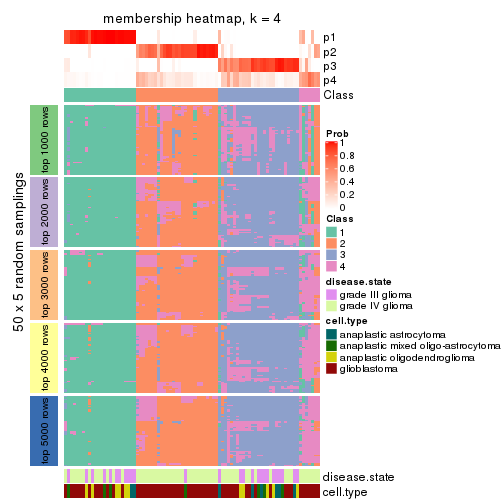</p>

</div>
<div id='tab-SD-NMF-membership-heatmap-4'>
<pre><code class="r">membership_heatmap(res, k = 5)
</code></pre>

<p></p>

</div>
<div id='tab-SD-NMF-membership-heatmap-5'>
<pre><code class="r">membership_heatmap(res, k = 6)
</code></pre>

<p></p>

</div>
</div>

As soon as we have had the classes for columns, we can look for signatures
which are significantly different between classes which can be candidate marks
for certain classes. Following are the heatmaps for signatures.


Signature heatmaps where rows are scaled:


<script>
$( function() {
	$( '#tabs-SD-NMF-get-signatures' ).tabs();
} );
</script>
<div id='tabs-SD-NMF-get-signatures'>
<ul>
<li><a href='#tab-SD-NMF-get-signatures-1'>k = 2</a></li>
<li><a href='#tab-SD-NMF-get-signatures-2'>k = 3</a></li>
<li><a href='#tab-SD-NMF-get-signatures-3'>k = 4</a></li>
<li><a href='#tab-SD-NMF-get-signatures-4'>k = 5</a></li>
<li><a href='#tab-SD-NMF-get-signatures-5'>k = 6</a></li>
</ul>
<div id='tab-SD-NMF-get-signatures-1'>
<pre><code class="r">get_signatures(res, k = 2)
</code></pre>

<p></p>

</div>
<div id='tab-SD-NMF-get-signatures-2'>
<pre><code class="r">get_signatures(res, k = 3)
</code></pre>

<p></p>

</div>
<div id='tab-SD-NMF-get-signatures-3'>
<pre><code class="r">get_signatures(res, k = 4)
</code></pre>

<p></p>

</div>
<div id='tab-SD-NMF-get-signatures-4'>
<pre><code class="r">get_signatures(res, k = 5)
</code></pre>

<p></p>

</div>
<div id='tab-SD-NMF-get-signatures-5'>
<pre><code class="r">get_signatures(res, k = 6)
</code></pre>

<p></p>

</div>
</div>


Signature heatmaps where rows are not scaled:


<script>
$( function() {
	$( '#tabs-SD-NMF-get-signatures-no-scale' ).tabs();
} );
</script>
<div id='tabs-SD-NMF-get-signatures-no-scale'>
<ul>
<li><a href='#tab-SD-NMF-get-signatures-no-scale-1'>k = 2</a></li>
<li><a href='#tab-SD-NMF-get-signatures-no-scale-2'>k = 3</a></li>
<li><a href='#tab-SD-NMF-get-signatures-no-scale-3'>k = 4</a></li>
<li><a href='#tab-SD-NMF-get-signatures-no-scale-4'>k = 5</a></li>
<li><a href='#tab-SD-NMF-get-signatures-no-scale-5'>k = 6</a></li>
</ul>
<div id='tab-SD-NMF-get-signatures-no-scale-1'>
<pre><code class="r">get_signatures(res, k = 2, scale_rows = FALSE)
</code></pre>

<p></p>

</div>
<div id='tab-SD-NMF-get-signatures-no-scale-2'>
<pre><code class="r">get_signatures(res, k = 3, scale_rows = FALSE)
</code></pre>

<p></p>

</div>
<div id='tab-SD-NMF-get-signatures-no-scale-3'>
<pre><code class="r">get_signatures(res, k = 4, scale_rows = FALSE)
</code></pre>

<p></p>

</div>
<div id='tab-SD-NMF-get-signatures-no-scale-4'>
<pre><code class="r">get_signatures(res, k = 5, scale_rows = FALSE)
</code></pre>

<p></p>

</div>
<div id='tab-SD-NMF-get-signatures-no-scale-5'>
<pre><code class="r">get_signatures(res, k = 6, scale_rows = FALSE)
</code></pre>

<p></p>

</div>
</div>


Compare the overlap of signatures from different k:

```r
compare_signatures(res)
```


`get_signature()` returns a data frame invisibly. TO get the list of signatures, the function
call should be assigned to a variable explicitly. In following code, if `plot` argument is set
to `FALSE`, no heatmap is plotted while only the differential analysis is performed.

```r
# code only for demonstration
tb = get_signature(res, k = ..., plot = FALSE)
```

An example of the output of `tb` is:

```
#>   which_row         fdr    mean_1    mean_2 scaled_mean_1 scaled_mean_2 km
#> 1        38 0.042760348  8.373488  9.131774    -0.5533452     0.5164555  1
#> 2        40 0.018707592  7.106213  8.469186    -0.6173731     0.5762149  1
#> 3        55 0.019134737 10.221463 11.207825    -0.6159697     0.5749050  1
#> 4        59 0.006059896  5.921854  7.869574    -0.6899429     0.6439467  1
#> 5        60 0.018055526  8.928898 10.211722    -0.6204761     0.5791110  1
#> 6        98 0.009384629 15.714769 14.887706     0.6635654    -0.6193277  2
...
```

The columns in `tb` are:

1. `which_row`: row indices corresponding to the input matrix.
2. `fdr`: FDR for the differential test. 
3. `mean_x`: The mean value in group x.
4. `scaled_mean_x`: The mean value in group x after rows are scaled.
5. `km`: Row groups if k-means clustering is applied to rows.


UMAP plot which shows how samples are separated.


<script>
$( function() {
	$( '#tabs-SD-NMF-dimension-reduction' ).tabs();
} );
</script>
<div id='tabs-SD-NMF-dimension-reduction'>
<ul>
<li><a href='#tab-SD-NMF-dimension-reduction-1'>k = 2</a></li>
<li><a href='#tab-SD-NMF-dimension-reduction-2'>k = 3</a></li>
<li><a href='#tab-SD-NMF-dimension-reduction-3'>k = 4</a></li>
<li><a href='#tab-SD-NMF-dimension-reduction-4'>k = 5</a></li>
<li><a href='#tab-SD-NMF-dimension-reduction-5'>k = 6</a></li>
</ul>
<div id='tab-SD-NMF-dimension-reduction-1'>
<pre><code class="r">dimension_reduction(res, k = 2, method = &quot;UMAP&quot;)
</code></pre>

<p></p>

</div>
<div id='tab-SD-NMF-dimension-reduction-2'>
<pre><code class="r">dimension_reduction(res, k = 3, method = &quot;UMAP&quot;)
</code></pre>

<p></p>

</div>
<div id='tab-SD-NMF-dimension-reduction-3'>
<pre><code class="r">dimension_reduction(res, k = 4, method = &quot;UMAP&quot;)
</code></pre>

<p></p>

</div>
<div id='tab-SD-NMF-dimension-reduction-4'>
<pre><code class="r">dimension_reduction(res, k = 5, method = &quot;UMAP&quot;)
</code></pre>

<p></p>

</div>
<div id='tab-SD-NMF-dimension-reduction-5'>
<pre><code class="r">dimension_reduction(res, k = 6, method = &quot;UMAP&quot;)
</code></pre>

<p></p>

</div>
</div>


Following heatmap shows how subgroups are split when increasing `k`:

```r
collect_classes(res)
```


Test correlation between subgroups and known annotations. If the known
annotation is numeric, one-way ANOVA test is applied, and if the known
annotation is discrete, chi-squared contingency table test is applied.

```r
test_to_known_factors(res)
```

```
#>         n disease.state(p) cell.type(p) k
#> SD:NMF 81         0.000494      0.00254 2
#> SD:NMF 83         0.000507      0.00764 3
#> SD:NMF 71         0.000686      0.00989 4
#> SD:NMF 63         0.000460      0.01625 5
#> SD:NMF 64         0.000207      0.01155 6
```


If matrix rows can be associated to genes, consider to use `GO_Enrichment(res,
...)` to perform function enrichment for the signature genes.


 

---------------------------------------------------


### CV:hclust


The object with results only for a single top-value method and a single partition method 
can be extracted as:

```r
res = res_list["CV", "hclust"]
# you can also extract it by
# res = res_list["CV:hclust"]
```

A summary of `res` and all the functions that can be applied to it:

```r
res
```

```
#> A 'ConsensusPartition' object with k = 2, 3, 4, 5, 6.
#>   On a matrix with 21512 rows and 85 columns.
#>   Top rows (1000, 2000, 3000, 4000, 5000) are extracted by 'CV' method.
#>   Subgroups are detected by 'hclust' method.
#>   Performed in total 1250 partitions by row resampling.
#>   Best k for subgroups seems to be 3.
#> 
#> Following methods can be applied to this 'ConsensusPartition' object:
#>  [1] "cola_report"             "collect_classes"         "collect_plots"          
#>  [4] "collect_stats"           "colnames"                "compare_signatures"     
#>  [7] "consensus_heatmap"       "dimension_reduction"     "functional_enrichment"  
#> [10] "get_anno_col"            "get_anno"                "get_classes"            
#> [13] "get_consensus"           "get_matrix"              "get_membership"         
#> [16] "get_param"               "get_signatures"          "get_stats"              
#> [19] "is_best_k"               "is_stable_k"             "membership_heatmap"     
#> [22] "ncol"                    "nrow"                    "plot_ecdf"              
#> [25] "rownames"                "select_partition_number" "show"                   
#> [28] "suggest_best_k"          "test_to_known_factors"
```

`collect_plots()` function collects all the plots made from `res` for all `k` (number of partitions)
into one single page to provide an easy and fast comparison between different `k`.

```r
collect_plots(res)
```


The plots are:

- The first row: a plot of the ECDF (Empirical cumulative distribution
  function) curves of the consensus matrix for each `k` and the heatmap of
  predicted classes for each `k`.
- The second row: heatmaps of the consensus matrix for each `k`.
- The third row: heatmaps of the membership matrix for each `k`.
- The fouth row: heatmaps of the signatures for each `k`.

All the plots in panels can be made by individual functions and they are
plotted later in this section.

`select_partition_number()` produces several plots showing different
statistics for choosing "optimized" `k`. There are following statistics:

- ECDF curves of the consensus matrix for each `k`;
- 1-PAC. [The PAC
  score](https://en.wikipedia.org/wiki/Consensus_clustering#Over-interpretation_potential_of_consensus_clustering)
  measures the proportion of the ambiguous subgrouping.
- Mean silhouette score.
- Concordance. The mean probability of fiting the consensus class ids in all
  partitions.
- Area increased. Denote $A_k$ as the area under the ECDF curve for current
  `k`, the area increased is defined as $A_k - A_{k-1}$.
- Rand index. The percent of pairs of samples that are both in a same cluster
  or both are not in a same cluster in the partition of k and k-1.
- Jaccard index. The ratio of pairs of samples are both in a same cluster in
  the partition of k and k-1 and the pairs of samples are both in a same
  cluster in the partition k or k-1.

The detailed explanations of these statistics can be found in [the cola
vignette](http://bioconductor.org/packages/devel/bioc/vignettes/cola/inst/doc/cola.html#toc_13).

Generally speaking, lower PAC score, higher mean silhouette score or higher
concordance corresponds to better partition. Rand index and Jaccard index
measure how similar the current partition is compared to partition with `k-1`.
If they are too similar, we won't accept `k` is better than `k-1`.

```r
select_partition_number(res)
```


The numeric values for all these statistics can be obtained by `get_stats()`.

```r
get_stats(res)
```

```
#>   k 1-PAC mean_silhouette concordance area_increased  Rand Jaccard
#> 2 2 0.445           0.852       0.898         0.4203 0.580   0.580
#> 3 3 0.565           0.767       0.882         0.5420 0.734   0.549
#> 4 4 0.582           0.611       0.823         0.0777 0.974   0.924
#> 5 5 0.564           0.523       0.772         0.0590 0.915   0.752
#> 6 6 0.620           0.621       0.787         0.0395 0.962   0.865
```

`suggest_best_k()` suggests the best $k$ based on these statistics. The rules are as follows:

- All $k$ with Jaccard index larger than 0.95 are removed because the increase of
  the partition number does not provides enough extra information. If all $k$ are removed,
  the best $k$ is assigned by `NA`.
- For $k$ with 1-PAC larger than 0.9, the maximal $k$ is taken as the "best k". Other $k$ is called "optional k".
- If it does not fit the second rule. The $k$ with the highest vote of highest
  1-PAC, mean silhouette and concordance is taken as the "best k".

```r
suggest_best_k(res)
```

```
#> [1] 3
```


Following shows the table of the partitions (You need to click the **show/hide
code output** link to see it). The membership matrix (columns with name `p*`)
is inferred by
[`clue::cl_consensus()`](https://www.rdocumentation.org/link/cl_consensus?package=clue)
function with the `SE` method. Basically the value in the membership matrix
represents the probability to belong to a certain group. The finall class
label for an item is determined with the group with highest probability it
belongs to.

In `get_classes()` function, the entropy is calculated from the membership
matrix and the silhouette score is calculated from the consensus matrix.


<script>
$( function() {
	$( '#tabs-CV-hclust-get-classes' ).tabs();
} );
</script>
<div id='tabs-CV-hclust-get-classes'>
<ul>
<li><a href='#tab-CV-hclust-get-classes-1'>k = 2</a></li>
<li><a href='#tab-CV-hclust-get-classes-2'>k = 3</a></li>
<li><a href='#tab-CV-hclust-get-classes-3'>k = 4</a></li>
<li><a href='#tab-CV-hclust-get-classes-4'>k = 5</a></li>
<li><a href='#tab-CV-hclust-get-classes-5'>k = 6</a></li>
</ul>

<div id='tab-CV-hclust-get-classes-1'>
<p><a id='tab-CV-hclust-get-classes-1-a' style='color:#0366d6' href='#'>show/hide code output</a></p>
<pre><code class="r">cbind(get_classes(res, k = 2), get_membership(res, k = 2))
</code></pre>

<pre><code>#&gt;          class entropy silhouette    p1    p2
#&gt; GSM99497     2  0.6531     0.8758 0.168 0.832
#&gt; GSM99503     1  0.0000     0.9263 1.000 0.000
#&gt; GSM99505     1  0.4298     0.8855 0.912 0.088
#&gt; GSM99507     2  0.6531     0.8758 0.168 0.832
#&gt; GSM99567     2  0.6531     0.8758 0.168 0.832
#&gt; GSM99575     1  0.0000     0.9263 1.000 0.000
#&gt; GSM99593     2  0.6531     0.8758 0.168 0.832
#&gt; GSM99595     2  0.6531     0.8758 0.168 0.832
#&gt; GSM99469     1  0.3114     0.9069 0.944 0.056
#&gt; GSM99499     1  0.4298     0.8855 0.912 0.088
#&gt; GSM99501     1  0.3114     0.9069 0.944 0.056
#&gt; GSM99509     2  0.7139     0.8591 0.196 0.804
#&gt; GSM99569     2  0.6801     0.8702 0.180 0.820
#&gt; GSM99597     2  0.7219     0.8558 0.200 0.800
#&gt; GSM99601     2  0.0000     0.8668 0.000 1.000
#&gt; GSM99459     2  1.0000     0.2427 0.496 0.504
#&gt; GSM99461     2  0.9580     0.5830 0.380 0.620
#&gt; GSM99511     2  0.6712     0.8721 0.176 0.824
#&gt; GSM99513     2  0.6712     0.8721 0.176 0.824
#&gt; GSM99515     2  0.6623     0.8741 0.172 0.828
#&gt; GSM99517     1  0.0000     0.9263 1.000 0.000
#&gt; GSM99519     1  0.9833     0.0459 0.576 0.424
#&gt; GSM99521     2  0.6438     0.8772 0.164 0.836
#&gt; GSM99523     2  0.6801     0.8702 0.180 0.820
#&gt; GSM99571     1  0.0000     0.9263 1.000 0.000
#&gt; GSM99599     1  0.0000     0.9263 1.000 0.000
#&gt; GSM99433     2  0.2603     0.8818 0.044 0.956
#&gt; GSM99435     2  0.6712     0.8721 0.176 0.824
#&gt; GSM99437     2  0.1184     0.8736 0.016 0.984
#&gt; GSM99439     2  0.0000     0.8668 0.000 1.000
#&gt; GSM99441     1  0.0000     0.9263 1.000 0.000
#&gt; GSM99443     2  0.0000     0.8668 0.000 1.000
#&gt; GSM99445     2  0.0000     0.8668 0.000 1.000
#&gt; GSM99447     2  0.0938     0.8721 0.012 0.988
#&gt; GSM99449     2  0.5737     0.8835 0.136 0.864
#&gt; GSM99451     2  0.6801     0.8703 0.180 0.820
#&gt; GSM99453     1  0.0000     0.9263 1.000 0.000
#&gt; GSM99455     1  0.0000     0.9263 1.000 0.000
#&gt; GSM99457     1  0.0000     0.9263 1.000 0.000
#&gt; GSM99463     2  0.0000     0.8668 0.000 1.000
#&gt; GSM99465     2  0.9209     0.6721 0.336 0.664
#&gt; GSM99467     2  0.4161     0.8859 0.084 0.916
#&gt; GSM99471     1  0.5842     0.8258 0.860 0.140
#&gt; GSM99473     1  0.7376     0.7033 0.792 0.208
#&gt; GSM99475     2  0.6973     0.8655 0.188 0.812
#&gt; GSM99477     2  0.4161     0.8863 0.084 0.916
#&gt; GSM99479     2  0.4161     0.8863 0.084 0.916
#&gt; GSM99481     1  0.0000     0.9263 1.000 0.000
#&gt; GSM99483     1  0.0000     0.9263 1.000 0.000
#&gt; GSM99485     2  0.4562     0.8693 0.096 0.904
#&gt; GSM99487     2  0.1184     0.8736 0.016 0.984
#&gt; GSM99489     2  0.0000     0.8668 0.000 1.000
#&gt; GSM99491     2  0.0000     0.8668 0.000 1.000
#&gt; GSM99493     1  0.0000     0.9263 1.000 0.000
#&gt; GSM99495     2  0.0000     0.8668 0.000 1.000
#&gt; GSM99525     1  0.4690     0.8704 0.900 0.100
#&gt; GSM99527     2  0.7674     0.8337 0.224 0.776
#&gt; GSM99529     2  0.4562     0.8853 0.096 0.904
#&gt; GSM99531     2  0.8813     0.7363 0.300 0.700
#&gt; GSM99533     2  0.6973     0.8655 0.188 0.812
#&gt; GSM99535     2  0.8713     0.6756 0.292 0.708
#&gt; GSM99537     1  0.0000     0.9263 1.000 0.000
#&gt; GSM99539     2  0.2603     0.8821 0.044 0.956
#&gt; GSM99541     1  0.3879     0.8937 0.924 0.076
#&gt; GSM99543     2  0.1414     0.8658 0.020 0.980
#&gt; GSM99545     2  0.5178     0.8865 0.116 0.884
#&gt; GSM99547     2  0.8443     0.7806 0.272 0.728
#&gt; GSM99549     2  0.0000     0.8668 0.000 1.000
#&gt; GSM99551     1  0.5408     0.8459 0.876 0.124
#&gt; GSM99553     2  0.6343     0.8797 0.160 0.840
#&gt; GSM99555     2  0.0000     0.8668 0.000 1.000
#&gt; GSM99557     2  0.0000     0.8668 0.000 1.000
#&gt; GSM99559     2  0.5737     0.8835 0.136 0.864
#&gt; GSM99561     2  0.1633     0.8766 0.024 0.976
#&gt; GSM99563     2  0.6712     0.8721 0.176 0.824
#&gt; GSM99565     2  0.0000     0.8668 0.000 1.000
#&gt; GSM99573     2  0.0000     0.8668 0.000 1.000
#&gt; GSM99577     1  0.3879     0.8937 0.924 0.076
#&gt; GSM99579     2  0.1633     0.8763 0.024 0.976
#&gt; GSM99581     2  0.6623     0.8741 0.172 0.828
#&gt; GSM99583     2  0.6973     0.8445 0.188 0.812
#&gt; GSM99585     2  0.4562     0.8879 0.096 0.904
#&gt; GSM99587     1  0.0000     0.9263 1.000 0.000
#&gt; GSM99589     2  0.3431     0.8840 0.064 0.936
#&gt; GSM99591     2  0.0000     0.8668 0.000 1.000
</code></pre>

<script>
$('#tab-CV-hclust-get-classes-1-a').parent().next().next().hide();
$('#tab-CV-hclust-get-classes-1-a').click(function(){
  $('#tab-CV-hclust-get-classes-1-a').parent().next().next().toggle();
  return(false);
});
</script>
</div>

<div id='tab-CV-hclust-get-classes-2'>
<p><a id='tab-CV-hclust-get-classes-2-a' style='color:#0366d6' href='#'>show/hide code output</a></p>
<pre><code class="r">cbind(get_classes(res, k = 3), get_membership(res, k = 3))
</code></pre>

<pre><code>#&gt;          class entropy silhouette    p1    p2    p3
#&gt; GSM99497     3  0.0424     0.8521 0.000 0.008 0.992
#&gt; GSM99503     1  0.0237     0.9331 0.996 0.000 0.004
#&gt; GSM99505     1  0.3267     0.8856 0.884 0.000 0.116
#&gt; GSM99507     3  0.0424     0.8521 0.000 0.008 0.992
#&gt; GSM99567     3  0.0424     0.8521 0.000 0.008 0.992
#&gt; GSM99575     1  0.0237     0.9331 0.996 0.000 0.004
#&gt; GSM99593     3  0.0424     0.8521 0.000 0.008 0.992
#&gt; GSM99595     3  0.0424     0.8521 0.000 0.008 0.992
#&gt; GSM99469     1  0.2537     0.9083 0.920 0.000 0.080
#&gt; GSM99499     1  0.3267     0.8856 0.884 0.000 0.116
#&gt; GSM99501     1  0.2537     0.9083 0.920 0.000 0.080
#&gt; GSM99509     3  0.0892     0.8498 0.020 0.000 0.980
#&gt; GSM99569     3  0.0237     0.8530 0.004 0.000 0.996
#&gt; GSM99597     3  0.1031     0.8479 0.024 0.000 0.976
#&gt; GSM99601     2  0.2165     0.8232 0.000 0.936 0.064
#&gt; GSM99459     3  0.5905     0.4479 0.352 0.000 0.648
#&gt; GSM99461     3  0.4887     0.6789 0.228 0.000 0.772
#&gt; GSM99511     3  0.0000     0.8521 0.000 0.000 1.000
#&gt; GSM99513     3  0.0000     0.8521 0.000 0.000 1.000
#&gt; GSM99515     3  0.0237     0.8523 0.000 0.004 0.996
#&gt; GSM99517     1  0.0237     0.9331 0.996 0.000 0.004
#&gt; GSM99519     3  0.6244     0.2144 0.440 0.000 0.560
#&gt; GSM99521     3  0.0747     0.8497 0.000 0.016 0.984
#&gt; GSM99523     3  0.0237     0.8530 0.004 0.000 0.996
#&gt; GSM99571     1  0.0237     0.9331 0.996 0.000 0.004
#&gt; GSM99599     1  0.0237     0.9331 0.996 0.000 0.004
#&gt; GSM99433     2  0.6126     0.5187 0.000 0.600 0.400
#&gt; GSM99435     3  0.0000     0.8521 0.000 0.000 1.000
#&gt; GSM99437     2  0.5178     0.7254 0.000 0.744 0.256
#&gt; GSM99439     2  0.0424     0.8107 0.000 0.992 0.008
#&gt; GSM99441     1  0.0747     0.9309 0.984 0.000 0.016
#&gt; GSM99443     2  0.0237     0.8099 0.000 0.996 0.004
#&gt; GSM99445     2  0.0237     0.8099 0.000 0.996 0.004
#&gt; GSM99447     2  0.4555     0.7740 0.000 0.800 0.200
#&gt; GSM99449     3  0.2959     0.7936 0.000 0.100 0.900
#&gt; GSM99451     3  0.0424     0.8529 0.008 0.000 0.992
#&gt; GSM99453     1  0.0237     0.9331 0.996 0.000 0.004
#&gt; GSM99455     1  0.0237     0.9331 0.996 0.000 0.004
#&gt; GSM99457     1  0.0237     0.9331 0.996 0.000 0.004
#&gt; GSM99463     2  0.0000     0.8076 0.000 1.000 0.000
#&gt; GSM99465     3  0.4178     0.7443 0.172 0.000 0.828
#&gt; GSM99467     2  0.6724     0.4575 0.012 0.568 0.420
#&gt; GSM99471     1  0.4473     0.8199 0.828 0.008 0.164
#&gt; GSM99473     1  0.5285     0.6962 0.752 0.004 0.244
#&gt; GSM99475     3  0.0747     0.8512 0.016 0.000 0.984
#&gt; GSM99477     2  0.6598     0.4472 0.008 0.564 0.428
#&gt; GSM99479     2  0.6598     0.4472 0.008 0.564 0.428
#&gt; GSM99481     1  0.0237     0.9331 0.996 0.000 0.004
#&gt; GSM99483     1  0.0237     0.9331 0.996 0.000 0.004
#&gt; GSM99485     2  0.7189     0.6392 0.052 0.656 0.292
#&gt; GSM99487     2  0.5178     0.7254 0.000 0.744 0.256
#&gt; GSM99489     2  0.0000     0.8076 0.000 1.000 0.000
#&gt; GSM99491     2  0.2165     0.8240 0.000 0.936 0.064
#&gt; GSM99493     1  0.0237     0.9331 0.996 0.000 0.004
#&gt; GSM99495     2  0.0000     0.8076 0.000 1.000 0.000
#&gt; GSM99525     1  0.3272     0.8838 0.892 0.004 0.104
#&gt; GSM99527     3  0.3276     0.8199 0.068 0.024 0.908
#&gt; GSM99529     2  0.6881     0.5133 0.020 0.592 0.388
#&gt; GSM99531     3  0.3412     0.7855 0.124 0.000 0.876
#&gt; GSM99533     3  0.0747     0.8512 0.016 0.000 0.984
#&gt; GSM99535     3  0.9811    -0.1317 0.240 0.380 0.380
#&gt; GSM99537     1  0.1529     0.9250 0.960 0.000 0.040
#&gt; GSM99539     3  0.5497     0.4801 0.000 0.292 0.708
#&gt; GSM99541     1  0.3752     0.8562 0.856 0.000 0.144
#&gt; GSM99543     2  0.1636     0.8123 0.016 0.964 0.020
#&gt; GSM99545     3  0.2066     0.8233 0.000 0.060 0.940
#&gt; GSM99547     3  0.4342     0.7835 0.120 0.024 0.856
#&gt; GSM99549     2  0.1765     0.8116 0.004 0.956 0.040
#&gt; GSM99551     1  0.4531     0.8055 0.824 0.008 0.168
#&gt; GSM99553     3  0.5156     0.6165 0.008 0.216 0.776
#&gt; GSM99555     2  0.3038     0.8181 0.000 0.896 0.104
#&gt; GSM99557     2  0.2066     0.8232 0.000 0.940 0.060
#&gt; GSM99559     3  0.3038     0.7900 0.000 0.104 0.896
#&gt; GSM99561     2  0.4504     0.7764 0.000 0.804 0.196
#&gt; GSM99563     3  0.0000     0.8521 0.000 0.000 1.000
#&gt; GSM99565     2  0.3038     0.8181 0.000 0.896 0.104
#&gt; GSM99573     2  0.1525     0.8129 0.004 0.964 0.032
#&gt; GSM99577     1  0.3816     0.8515 0.852 0.000 0.148
#&gt; GSM99579     2  0.3752     0.8037 0.000 0.856 0.144
#&gt; GSM99581     3  0.1643     0.8344 0.000 0.044 0.956
#&gt; GSM99583     3  0.8452     0.0837 0.096 0.372 0.532
#&gt; GSM99585     3  0.6540     0.0821 0.008 0.408 0.584
#&gt; GSM99587     1  0.0237     0.9331 0.996 0.000 0.004
#&gt; GSM99589     2  0.6735     0.4406 0.012 0.564 0.424
#&gt; GSM99591     2  0.2066     0.8236 0.000 0.940 0.060
</code></pre>

<script>
$('#tab-CV-hclust-get-classes-2-a').parent().next().next().hide();
$('#tab-CV-hclust-get-classes-2-a').click(function(){
  $('#tab-CV-hclust-get-classes-2-a').parent().next().next().toggle();
  return(false);
});
</script>
</div>

<div id='tab-CV-hclust-get-classes-3'>
<p><a id='tab-CV-hclust-get-classes-3-a' style='color:#0366d6' href='#'>show/hide code output</a></p>
<pre><code class="r">cbind(get_classes(res, k = 4), get_membership(res, k = 4))
</code></pre>

<pre><code>#&gt;          class entropy silhouette    p1    p2    p3    p4
#&gt; GSM99497     3  0.0657     0.6514 0.000 0.012 0.984 0.004
#&gt; GSM99503     1  0.0000     0.9031 1.000 0.000 0.000 0.000
#&gt; GSM99505     1  0.3497     0.8385 0.860 0.000 0.104 0.036
#&gt; GSM99507     3  0.0657     0.6514 0.000 0.012 0.984 0.004
#&gt; GSM99567     3  0.0657     0.6514 0.000 0.012 0.984 0.004
#&gt; GSM99575     1  0.0000     0.9031 1.000 0.000 0.000 0.000
#&gt; GSM99593     3  0.0804     0.6504 0.000 0.012 0.980 0.008
#&gt; GSM99595     3  0.0657     0.6514 0.000 0.012 0.984 0.004
#&gt; GSM99469     1  0.2892     0.8678 0.896 0.000 0.068 0.036
#&gt; GSM99499     1  0.3497     0.8385 0.860 0.000 0.104 0.036
#&gt; GSM99501     1  0.2892     0.8678 0.896 0.000 0.068 0.036
#&gt; GSM99509     3  0.2530     0.5838 0.008 0.008 0.912 0.072
#&gt; GSM99569     3  0.0188     0.6481 0.000 0.000 0.996 0.004
#&gt; GSM99597     3  0.3246     0.5110 0.008 0.008 0.868 0.116
#&gt; GSM99601     2  0.2089     0.7466 0.000 0.932 0.020 0.048
#&gt; GSM99459     3  0.7103    -0.1758 0.296 0.000 0.544 0.160
#&gt; GSM99461     3  0.6539     0.0283 0.172 0.004 0.652 0.172
#&gt; GSM99511     3  0.0469     0.6457 0.000 0.000 0.988 0.012
#&gt; GSM99513     3  0.0469     0.6457 0.000 0.000 0.988 0.012
#&gt; GSM99515     3  0.0336     0.6509 0.000 0.008 0.992 0.000
#&gt; GSM99517     1  0.0000     0.9031 1.000 0.000 0.000 0.000
#&gt; GSM99519     3  0.7292    -0.2434 0.388 0.000 0.460 0.152
#&gt; GSM99521     3  0.1182     0.6477 0.000 0.016 0.968 0.016
#&gt; GSM99523     3  0.0188     0.6481 0.000 0.000 0.996 0.004
#&gt; GSM99571     1  0.1022     0.8998 0.968 0.000 0.000 0.032
#&gt; GSM99599     1  0.0000     0.9031 1.000 0.000 0.000 0.000
#&gt; GSM99433     2  0.5773     0.4925 0.000 0.620 0.336 0.044
#&gt; GSM99435     3  0.1118     0.6329 0.000 0.000 0.964 0.036
#&gt; GSM99437     2  0.4617     0.6622 0.000 0.764 0.204 0.032
#&gt; GSM99439     2  0.3528     0.7121 0.000 0.808 0.000 0.192
#&gt; GSM99441     1  0.0921     0.8968 0.972 0.000 0.000 0.028
#&gt; GSM99443     2  0.2589     0.7319 0.000 0.884 0.000 0.116
#&gt; GSM99445     2  0.2589     0.7319 0.000 0.884 0.000 0.116
#&gt; GSM99447     2  0.4174     0.7112 0.000 0.816 0.140 0.044
#&gt; GSM99449     3  0.3205     0.5623 0.000 0.104 0.872 0.024
#&gt; GSM99451     3  0.2198     0.6057 0.008 0.000 0.920 0.072
#&gt; GSM99453     1  0.1022     0.8998 0.968 0.000 0.000 0.032
#&gt; GSM99455     1  0.1022     0.8998 0.968 0.000 0.000 0.032
#&gt; GSM99457     1  0.1389     0.8977 0.952 0.000 0.000 0.048
#&gt; GSM99463     2  0.3649     0.7043 0.000 0.796 0.000 0.204
#&gt; GSM99465     3  0.6140     0.1190 0.116 0.004 0.684 0.196
#&gt; GSM99467     2  0.6091     0.4697 0.000 0.596 0.344 0.060
#&gt; GSM99471     1  0.4880     0.7595 0.796 0.016 0.132 0.056
#&gt; GSM99473     1  0.5315     0.5959 0.724 0.004 0.224 0.048
#&gt; GSM99475     3  0.4049     0.3377 0.008 0.000 0.780 0.212
#&gt; GSM99477     2  0.6054     0.4629 0.000 0.592 0.352 0.056
#&gt; GSM99479     2  0.6054     0.4629 0.000 0.592 0.352 0.056
#&gt; GSM99481     1  0.0336     0.9019 0.992 0.000 0.000 0.008
#&gt; GSM99483     1  0.1022     0.8998 0.968 0.000 0.000 0.032
#&gt; GSM99485     2  0.6200     0.6023 0.032 0.692 0.220 0.056
#&gt; GSM99487     2  0.4617     0.6622 0.000 0.764 0.204 0.032
#&gt; GSM99489     2  0.3726     0.7001 0.000 0.788 0.000 0.212
#&gt; GSM99491     2  0.2256     0.7471 0.000 0.924 0.020 0.056
#&gt; GSM99493     1  0.1389     0.8977 0.952 0.000 0.000 0.048
#&gt; GSM99495     2  0.3764     0.6984 0.000 0.784 0.000 0.216
#&gt; GSM99525     1  0.3748     0.8347 0.860 0.008 0.088 0.044
#&gt; GSM99527     3  0.4996     0.4753 0.060 0.028 0.800 0.112
#&gt; GSM99529     2  0.6503     0.5256 0.008 0.620 0.288 0.084
#&gt; GSM99531     4  0.5992     0.0000 0.040 0.000 0.444 0.516
#&gt; GSM99533     3  0.4049     0.3377 0.008 0.000 0.780 0.212
#&gt; GSM99535     2  0.9428     0.0441 0.212 0.388 0.280 0.120
#&gt; GSM99537     1  0.1824     0.8871 0.936 0.000 0.004 0.060
#&gt; GSM99539     3  0.7353    -0.1168 0.000 0.288 0.516 0.196
#&gt; GSM99541     1  0.4168     0.8195 0.828 0.000 0.080 0.092
#&gt; GSM99543     2  0.4535     0.6896 0.016 0.744 0.000 0.240
#&gt; GSM99545     3  0.4956     0.3450 0.000 0.056 0.756 0.188
#&gt; GSM99547     3  0.5835     0.3949 0.096 0.036 0.752 0.116
#&gt; GSM99549     2  0.4134     0.6845 0.000 0.740 0.000 0.260
#&gt; GSM99551     1  0.5350     0.7401 0.744 0.008 0.060 0.188
#&gt; GSM99553     3  0.4652     0.3529 0.004 0.220 0.756 0.020
#&gt; GSM99555     2  0.2660     0.7402 0.000 0.908 0.056 0.036
#&gt; GSM99557     2  0.2089     0.7466 0.000 0.932 0.020 0.048
#&gt; GSM99559     3  0.3307     0.5581 0.000 0.104 0.868 0.028
#&gt; GSM99561     2  0.4688     0.7114 0.000 0.792 0.128 0.080
#&gt; GSM99563     3  0.0469     0.6457 0.000 0.000 0.988 0.012
#&gt; GSM99565     2  0.2660     0.7402 0.000 0.908 0.056 0.036
#&gt; GSM99573     2  0.4040     0.6916 0.000 0.752 0.000 0.248
#&gt; GSM99577     1  0.4235     0.8141 0.824 0.000 0.084 0.092
#&gt; GSM99579     2  0.3107     0.7389 0.000 0.884 0.080 0.036
#&gt; GSM99581     3  0.1722     0.6278 0.000 0.048 0.944 0.008
#&gt; GSM99583     3  0.8236    -0.0715 0.068 0.396 0.436 0.100
#&gt; GSM99585     3  0.6949    -0.0862 0.008 0.440 0.468 0.084
#&gt; GSM99587     1  0.1389     0.8977 0.952 0.000 0.000 0.048
#&gt; GSM99589     2  0.6263     0.4300 0.008 0.580 0.364 0.048
#&gt; GSM99591     2  0.2174     0.7467 0.000 0.928 0.020 0.052
</code></pre>

<script>
$('#tab-CV-hclust-get-classes-3-a').parent().next().next().hide();
$('#tab-CV-hclust-get-classes-3-a').click(function(){
  $('#tab-CV-hclust-get-classes-3-a').parent().next().next().toggle();
  return(false);
});
</script>
</div>

<div id='tab-CV-hclust-get-classes-4'>
<p><a id='tab-CV-hclust-get-classes-4-a' style='color:#0366d6' href='#'>show/hide code output</a></p>
<pre><code class="r">cbind(get_classes(res, k = 5), get_membership(res, k = 5))
</code></pre>

<pre><code>#&gt;          class entropy silhouette    p1    p2    p3    p4    p5
#&gt; GSM99497     3  0.0566     0.7068 0.000 0.012 0.984 0.004 0.000
#&gt; GSM99503     1  0.0000     0.8705 1.000 0.000 0.000 0.000 0.000
#&gt; GSM99505     1  0.3427     0.8125 0.844 0.000 0.096 0.056 0.004
#&gt; GSM99507     3  0.0566     0.7068 0.000 0.012 0.984 0.004 0.000
#&gt; GSM99567     3  0.0566     0.7068 0.000 0.012 0.984 0.004 0.000
#&gt; GSM99575     1  0.0000     0.8705 1.000 0.000 0.000 0.000 0.000
#&gt; GSM99593     3  0.0693     0.7056 0.000 0.012 0.980 0.008 0.000
#&gt; GSM99595     3  0.0566     0.7068 0.000 0.012 0.984 0.004 0.000
#&gt; GSM99469     1  0.2819     0.8388 0.884 0.000 0.060 0.052 0.004
#&gt; GSM99499     1  0.3427     0.8125 0.844 0.000 0.096 0.056 0.004
#&gt; GSM99501     1  0.2819     0.8388 0.884 0.000 0.060 0.052 0.004
#&gt; GSM99509     3  0.2673     0.6507 0.000 0.008 0.892 0.072 0.028
#&gt; GSM99569     3  0.0404     0.7060 0.000 0.000 0.988 0.012 0.000
#&gt; GSM99597     3  0.3412     0.6027 0.000 0.008 0.848 0.096 0.048
#&gt; GSM99601     2  0.2237     0.3206 0.000 0.904 0.004 0.008 0.084
#&gt; GSM99459     3  0.7259    -0.0547 0.264 0.004 0.408 0.308 0.016
#&gt; GSM99461     3  0.6769     0.0954 0.136 0.008 0.500 0.340 0.016
#&gt; GSM99511     3  0.0609     0.7043 0.000 0.000 0.980 0.020 0.000
#&gt; GSM99513     3  0.0609     0.7043 0.000 0.000 0.980 0.020 0.000
#&gt; GSM99515     3  0.0290     0.7070 0.000 0.008 0.992 0.000 0.000
#&gt; GSM99517     1  0.0000     0.8705 1.000 0.000 0.000 0.000 0.000
#&gt; GSM99519     1  0.7265    -0.1354 0.360 0.004 0.324 0.300 0.012
#&gt; GSM99521     3  0.1106     0.7006 0.000 0.024 0.964 0.012 0.000
#&gt; GSM99523     3  0.0404     0.7060 0.000 0.000 0.988 0.012 0.000
#&gt; GSM99571     1  0.1399     0.8648 0.952 0.000 0.000 0.028 0.020
#&gt; GSM99599     1  0.0000     0.8705 1.000 0.000 0.000 0.000 0.000
#&gt; GSM99433     2  0.5539     0.4368 0.000 0.640 0.284 0.036 0.040
#&gt; GSM99435     3  0.1544     0.6833 0.000 0.000 0.932 0.068 0.000
#&gt; GSM99437     2  0.3583     0.5089 0.000 0.808 0.168 0.016 0.008
#&gt; GSM99439     2  0.4201    -0.6710 0.000 0.592 0.000 0.000 0.408
#&gt; GSM99441     1  0.1041     0.8639 0.964 0.000 0.000 0.032 0.004
#&gt; GSM99443     2  0.3280     0.0981 0.000 0.812 0.000 0.012 0.176
#&gt; GSM99445     2  0.3280     0.0981 0.000 0.812 0.000 0.012 0.176
#&gt; GSM99447     2  0.3507     0.4825 0.000 0.840 0.112 0.012 0.036
#&gt; GSM99449     3  0.3031     0.5973 0.000 0.128 0.852 0.016 0.004
#&gt; GSM99451     3  0.3242     0.5581 0.000 0.000 0.816 0.172 0.012
#&gt; GSM99453     1  0.1399     0.8648 0.952 0.000 0.000 0.028 0.020
#&gt; GSM99455     1  0.1399     0.8648 0.952 0.000 0.000 0.028 0.020
#&gt; GSM99457     1  0.1918     0.8625 0.928 0.000 0.000 0.036 0.036
#&gt; GSM99463     2  0.4559    -0.8217 0.000 0.512 0.000 0.008 0.480
#&gt; GSM99465     3  0.6288     0.1450 0.080 0.008 0.528 0.368 0.016
#&gt; GSM99467     2  0.5934     0.4782 0.000 0.620 0.252 0.112 0.016
#&gt; GSM99471     1  0.5105     0.7472 0.768 0.016 0.084 0.096 0.036
#&gt; GSM99473     1  0.5399     0.6226 0.704 0.004 0.180 0.096 0.016
#&gt; GSM99475     3  0.4971    -0.1932 0.000 0.000 0.512 0.460 0.028
#&gt; GSM99477     2  0.5646     0.4672 0.000 0.628 0.268 0.096 0.008
#&gt; GSM99479     2  0.5646     0.4672 0.000 0.628 0.268 0.096 0.008
#&gt; GSM99481     1  0.0404     0.8691 0.988 0.000 0.000 0.012 0.000
#&gt; GSM99483     1  0.1399     0.8648 0.952 0.000 0.000 0.028 0.020
#&gt; GSM99485     2  0.6496     0.4623 0.028 0.668 0.144 0.104 0.056
#&gt; GSM99487     2  0.3583     0.5089 0.000 0.808 0.168 0.016 0.008
#&gt; GSM99489     5  0.4546     0.8835 0.000 0.460 0.000 0.008 0.532
#&gt; GSM99491     2  0.2517     0.3100 0.000 0.884 0.004 0.008 0.104
#&gt; GSM99493     1  0.1918     0.8625 0.928 0.000 0.000 0.036 0.036
#&gt; GSM99495     5  0.4542     0.8859 0.000 0.456 0.000 0.008 0.536
#&gt; GSM99525     1  0.4061     0.8047 0.832 0.008 0.064 0.064 0.032
#&gt; GSM99527     3  0.5666     0.3548 0.020 0.044 0.640 0.284 0.012
#&gt; GSM99529     2  0.6498     0.4790 0.008 0.624 0.188 0.144 0.036
#&gt; GSM99531     4  0.7315     0.3002 0.024 0.000 0.308 0.384 0.284
#&gt; GSM99533     3  0.4971    -0.1932 0.000 0.000 0.512 0.460 0.028
#&gt; GSM99535     2  0.9187     0.0584 0.180 0.376 0.184 0.200 0.060
#&gt; GSM99537     1  0.1924     0.8548 0.924 0.000 0.004 0.064 0.008
#&gt; GSM99539     4  0.7533     0.2665 0.000 0.312 0.304 0.348 0.036
#&gt; GSM99541     1  0.4051     0.7972 0.816 0.000 0.068 0.096 0.020
#&gt; GSM99543     5  0.4994     0.8669 0.016 0.396 0.000 0.012 0.576
#&gt; GSM99545     3  0.5976    -0.2498 0.000 0.056 0.500 0.420 0.024
#&gt; GSM99547     3  0.6447     0.2974 0.048 0.052 0.604 0.276 0.020
#&gt; GSM99549     5  0.4504     0.8682 0.000 0.428 0.000 0.008 0.564
#&gt; GSM99551     1  0.5200     0.6814 0.688 0.000 0.000 0.156 0.156
#&gt; GSM99553     3  0.4117     0.3469 0.004 0.240 0.740 0.012 0.004
#&gt; GSM99555     2  0.1195     0.4288 0.000 0.960 0.028 0.012 0.000
#&gt; GSM99557     2  0.1952     0.3251 0.000 0.912 0.004 0.000 0.084
#&gt; GSM99559     3  0.3078     0.5927 0.000 0.132 0.848 0.016 0.004
#&gt; GSM99561     2  0.5459     0.2279 0.000 0.716 0.076 0.052 0.156
#&gt; GSM99563     3  0.0609     0.7043 0.000 0.000 0.980 0.020 0.000
#&gt; GSM99565     2  0.1195     0.4288 0.000 0.960 0.028 0.012 0.000
#&gt; GSM99573     5  0.4443     0.8464 0.000 0.472 0.000 0.004 0.524
#&gt; GSM99577     1  0.4112     0.7932 0.812 0.000 0.072 0.096 0.020
#&gt; GSM99579     2  0.3333     0.3888 0.000 0.856 0.008 0.076 0.060
#&gt; GSM99581     3  0.1557     0.6779 0.000 0.052 0.940 0.008 0.000
#&gt; GSM99583     2  0.8072     0.0822 0.056 0.416 0.340 0.152 0.036
#&gt; GSM99585     2  0.6553     0.1227 0.004 0.464 0.376 0.152 0.004
#&gt; GSM99587     1  0.1918     0.8625 0.928 0.000 0.000 0.036 0.036
#&gt; GSM99589     2  0.5710     0.3980 0.004 0.608 0.320 0.032 0.036
#&gt; GSM99591     2  0.2339     0.3075 0.000 0.892 0.004 0.004 0.100
</code></pre>

<script>
$('#tab-CV-hclust-get-classes-4-a').parent().next().next().hide();
$('#tab-CV-hclust-get-classes-4-a').click(function(){
  $('#tab-CV-hclust-get-classes-4-a').parent().next().next().toggle();
  return(false);
});
</script>
</div>

<div id='tab-CV-hclust-get-classes-5'>
<p><a id='tab-CV-hclust-get-classes-5-a' style='color:#0366d6' href='#'>show/hide code output</a></p>
<pre><code class="r">cbind(get_classes(res, k = 6), get_membership(res, k = 6))
</code></pre>

<pre><code>#&gt;          class entropy silhouette    p1    p2    p3    p4    p5    p6
#&gt; GSM99497     3  0.0291     0.7568 0.000 0.004 0.992 0.004 0.000 0.000
#&gt; GSM99503     1  0.0000     0.8341 1.000 0.000 0.000 0.000 0.000 0.000
#&gt; GSM99505     1  0.3374     0.7786 0.836 0.000 0.096 0.032 0.000 0.036
#&gt; GSM99507     3  0.0291     0.7568 0.000 0.004 0.992 0.004 0.000 0.000
#&gt; GSM99567     3  0.0291     0.7568 0.000 0.004 0.992 0.004 0.000 0.000
#&gt; GSM99575     1  0.0000     0.8341 1.000 0.000 0.000 0.000 0.000 0.000
#&gt; GSM99593     3  0.0405     0.7552 0.000 0.004 0.988 0.008 0.000 0.000
#&gt; GSM99595     3  0.0291     0.7568 0.000 0.004 0.992 0.004 0.000 0.000
#&gt; GSM99469     1  0.2816     0.8045 0.876 0.000 0.060 0.028 0.000 0.036
#&gt; GSM99499     1  0.3374     0.7786 0.836 0.000 0.096 0.032 0.000 0.036
#&gt; GSM99501     1  0.2816     0.8045 0.876 0.000 0.060 0.028 0.000 0.036
#&gt; GSM99509     3  0.3004     0.6685 0.000 0.008 0.860 0.048 0.004 0.080
#&gt; GSM99569     3  0.0632     0.7559 0.000 0.000 0.976 0.024 0.000 0.000
#&gt; GSM99597     3  0.3641     0.6138 0.000 0.008 0.816 0.060 0.008 0.108
#&gt; GSM99601     2  0.2445     0.5648 0.000 0.868 0.000 0.004 0.120 0.008
#&gt; GSM99459     3  0.7557    -0.0494 0.248 0.008 0.384 0.232 0.000 0.128
#&gt; GSM99461     3  0.7068     0.1429 0.116 0.008 0.468 0.276 0.000 0.132
#&gt; GSM99511     3  0.0806     0.7540 0.000 0.000 0.972 0.020 0.000 0.008
#&gt; GSM99513     3  0.0806     0.7540 0.000 0.000 0.972 0.020 0.000 0.008
#&gt; GSM99515     3  0.0291     0.7568 0.000 0.004 0.992 0.004 0.000 0.000
#&gt; GSM99517     1  0.0000     0.8341 1.000 0.000 0.000 0.000 0.000 0.000
#&gt; GSM99519     1  0.7581    -0.1651 0.344 0.008 0.300 0.228 0.000 0.120
#&gt; GSM99521     3  0.0951     0.7504 0.000 0.008 0.968 0.020 0.000 0.004
#&gt; GSM99523     3  0.0547     0.7560 0.000 0.000 0.980 0.020 0.000 0.000
#&gt; GSM99571     1  0.1285     0.8252 0.944 0.000 0.000 0.004 0.000 0.052
#&gt; GSM99599     1  0.0000     0.8341 1.000 0.000 0.000 0.000 0.000 0.000
#&gt; GSM99433     2  0.5718     0.5248 0.000 0.612 0.268 0.068 0.032 0.020
#&gt; GSM99435     3  0.1838     0.7218 0.000 0.000 0.916 0.068 0.000 0.016
#&gt; GSM99437     2  0.3325     0.6552 0.000 0.816 0.152 0.016 0.008 0.008
#&gt; GSM99439     5  0.4273     0.6183 0.000 0.348 0.000 0.012 0.628 0.012
#&gt; GSM99441     1  0.1003     0.8283 0.964 0.000 0.000 0.016 0.000 0.020
#&gt; GSM99443     2  0.3352     0.4668 0.000 0.776 0.000 0.008 0.208 0.008
#&gt; GSM99445     2  0.3352     0.4668 0.000 0.776 0.000 0.008 0.208 0.008
#&gt; GSM99447     2  0.3728     0.6452 0.000 0.820 0.104 0.016 0.044 0.016
#&gt; GSM99449     3  0.2804     0.6535 0.000 0.120 0.852 0.024 0.004 0.000
#&gt; GSM99451     3  0.3606     0.3813 0.000 0.000 0.728 0.256 0.000 0.016
#&gt; GSM99453     1  0.1285     0.8252 0.944 0.000 0.000 0.004 0.000 0.052
#&gt; GSM99455     1  0.1285     0.8252 0.944 0.000 0.000 0.004 0.000 0.052
#&gt; GSM99457     1  0.2823     0.7611 0.796 0.000 0.000 0.000 0.000 0.204
#&gt; GSM99463     5  0.3404     0.7673 0.000 0.248 0.000 0.004 0.744 0.004
#&gt; GSM99465     3  0.6678     0.1988 0.060 0.008 0.496 0.288 0.000 0.148
#&gt; GSM99467     2  0.5695     0.5847 0.000 0.620 0.228 0.112 0.004 0.036
#&gt; GSM99471     1  0.4985     0.6975 0.744 0.020 0.076 0.060 0.000 0.100
#&gt; GSM99473     1  0.5182     0.5808 0.700 0.008 0.172 0.056 0.000 0.064
#&gt; GSM99475     4  0.4396     0.6360 0.000 0.000 0.352 0.612 0.000 0.036
#&gt; GSM99477     2  0.5304     0.5769 0.000 0.632 0.248 0.096 0.000 0.024
#&gt; GSM99479     2  0.5304     0.5769 0.000 0.632 0.248 0.096 0.000 0.024
#&gt; GSM99481     1  0.0405     0.8329 0.988 0.000 0.000 0.008 0.000 0.004
#&gt; GSM99483     1  0.1285     0.8252 0.944 0.000 0.000 0.004 0.000 0.052
#&gt; GSM99485     2  0.6441     0.6161 0.028 0.656 0.124 0.088 0.040 0.064
#&gt; GSM99487     2  0.3325     0.6552 0.000 0.816 0.152 0.016 0.008 0.008
#&gt; GSM99489     5  0.2377     0.8229 0.000 0.124 0.000 0.004 0.868 0.004
#&gt; GSM99491     2  0.2615     0.5664 0.000 0.852 0.000 0.004 0.136 0.008
#&gt; GSM99493     1  0.2823     0.7611 0.796 0.000 0.000 0.000 0.000 0.204
#&gt; GSM99495     5  0.2333     0.8224 0.000 0.120 0.000 0.004 0.872 0.004
#&gt; GSM99525     1  0.3907     0.7638 0.816 0.012 0.060 0.032 0.000 0.080
#&gt; GSM99527     3  0.5628     0.4152 0.004 0.040 0.608 0.268 0.000 0.080
#&gt; GSM99529     2  0.6348     0.6016 0.000 0.612 0.160 0.136 0.024 0.068
#&gt; GSM99531     6  0.5843     0.0000 0.004 0.000 0.200 0.148 0.036 0.612
#&gt; GSM99533     4  0.4446     0.6296 0.000 0.000 0.348 0.612 0.000 0.040
#&gt; GSM99535     2  0.8941     0.2198 0.156 0.372 0.160 0.164 0.028 0.120
#&gt; GSM99537     1  0.2052     0.8192 0.912 0.000 0.004 0.028 0.000 0.056
#&gt; GSM99539     4  0.7028     0.1463 0.000 0.276 0.192 0.456 0.012 0.064
#&gt; GSM99541     1  0.3977     0.7633 0.804 0.000 0.064 0.036 0.004 0.092
#&gt; GSM99543     5  0.2570     0.7890 0.012 0.076 0.000 0.012 0.888 0.012
#&gt; GSM99545     4  0.4634     0.6288 0.000 0.036 0.352 0.604 0.000 0.008
#&gt; GSM99547     3  0.6389     0.3640 0.032 0.052 0.568 0.264 0.000 0.084
#&gt; GSM99549     5  0.3210     0.7773 0.000 0.096 0.000 0.020 0.844 0.040
#&gt; GSM99551     1  0.5651     0.4173 0.528 0.004 0.000 0.076 0.024 0.368
#&gt; GSM99553     3  0.4037     0.4066 0.000 0.236 0.724 0.032 0.000 0.008
#&gt; GSM99555     2  0.1710     0.6236 0.000 0.940 0.020 0.008 0.020 0.012
#&gt; GSM99557     2  0.1910     0.5748 0.000 0.892 0.000 0.000 0.108 0.000
#&gt; GSM99559     3  0.2926     0.6469 0.000 0.124 0.844 0.028 0.004 0.000
#&gt; GSM99561     2  0.6701     0.2035 0.000 0.540 0.036 0.092 0.268 0.064
#&gt; GSM99563     3  0.0806     0.7540 0.000 0.000 0.972 0.020 0.000 0.008
#&gt; GSM99565     2  0.1710     0.6236 0.000 0.940 0.020 0.008 0.020 0.012
#&gt; GSM99573     5  0.3893     0.7795 0.000 0.172 0.000 0.016 0.772 0.040
#&gt; GSM99577     1  0.4033     0.7598 0.800 0.000 0.068 0.036 0.004 0.092
#&gt; GSM99579     2  0.3579     0.6035 0.000 0.828 0.000 0.064 0.072 0.036
#&gt; GSM99581     3  0.1434     0.7294 0.000 0.048 0.940 0.012 0.000 0.000
#&gt; GSM99583     2  0.7729     0.2956 0.044 0.412 0.316 0.136 0.008 0.084
#&gt; GSM99585     2  0.6267     0.3284 0.004 0.472 0.344 0.156 0.000 0.024
#&gt; GSM99587     1  0.2823     0.7611 0.796 0.000 0.000 0.000 0.000 0.204
#&gt; GSM99589     2  0.5540     0.5252 0.000 0.604 0.296 0.056 0.028 0.016
#&gt; GSM99591     2  0.2278     0.5661 0.000 0.868 0.000 0.004 0.128 0.000
</code></pre>

<script>
$('#tab-CV-hclust-get-classes-5-a').parent().next().next().hide();
$('#tab-CV-hclust-get-classes-5-a').click(function(){
  $('#tab-CV-hclust-get-classes-5-a').parent().next().next().toggle();
  return(false);
});
</script>
</div>
</div>

Heatmaps for the consensus matrix. It visualizes the probability of two
samples to be in a same group.


<script>
$( function() {
	$( '#tabs-CV-hclust-consensus-heatmap' ).tabs();
} );
</script>
<div id='tabs-CV-hclust-consensus-heatmap'>
<ul>
<li><a href='#tab-CV-hclust-consensus-heatmap-1'>k = 2</a></li>
<li><a href='#tab-CV-hclust-consensus-heatmap-2'>k = 3</a></li>
<li><a href='#tab-CV-hclust-consensus-heatmap-3'>k = 4</a></li>
<li><a href='#tab-CV-hclust-consensus-heatmap-4'>k = 5</a></li>
<li><a href='#tab-CV-hclust-consensus-heatmap-5'>k = 6</a></li>
</ul>
<div id='tab-CV-hclust-consensus-heatmap-1'>
<pre><code class="r">consensus_heatmap(res, k = 2)
</code></pre>

<p></p>

</div>
<div id='tab-CV-hclust-consensus-heatmap-2'>
<pre><code class="r">consensus_heatmap(res, k = 3)
</code></pre>

<p></p>

</div>
<div id='tab-CV-hclust-consensus-heatmap-3'>
<pre><code class="r">consensus_heatmap(res, k = 4)
</code></pre>

<p></p>

</div>
<div id='tab-CV-hclust-consensus-heatmap-4'>
<pre><code class="r">consensus_heatmap(res, k = 5)
</code></pre>

<p></p>

</div>
<div id='tab-CV-hclust-consensus-heatmap-5'>
<pre><code class="r">consensus_heatmap(res, k = 6)
</code></pre>

<p></p>

</div>
</div>

Heatmaps for the membership of samples in all partitions to see how consistent they are:


<script>
$( function() {
	$( '#tabs-CV-hclust-membership-heatmap' ).tabs();
} );
</script>
<div id='tabs-CV-hclust-membership-heatmap'>
<ul>
<li><a href='#tab-CV-hclust-membership-heatmap-1'>k = 2</a></li>
<li><a href='#tab-CV-hclust-membership-heatmap-2'>k = 3</a></li>
<li><a href='#tab-CV-hclust-membership-heatmap-3'>k = 4</a></li>
<li><a href='#tab-CV-hclust-membership-heatmap-4'>k = 5</a></li>
<li><a href='#tab-CV-hclust-membership-heatmap-5'>k = 6</a></li>
</ul>
<div id='tab-CV-hclust-membership-heatmap-1'>
<pre><code class="r">membership_heatmap(res, k = 2)
</code></pre>

<p></p>

</div>
<div id='tab-CV-hclust-membership-heatmap-2'>
<pre><code class="r">membership_heatmap(res, k = 3)
</code></pre>

<p></p>

</div>
<div id='tab-CV-hclust-membership-heatmap-3'>
<pre><code class="r">membership_heatmap(res, k = 4)
</code></pre>

<p></p>

</div>
<div id='tab-CV-hclust-membership-heatmap-4'>
<pre><code class="r">membership_heatmap(res, k = 5)
</code></pre>

<p></p>

</div>
<div id='tab-CV-hclust-membership-heatmap-5'>
<pre><code class="r">membership_heatmap(res, k = 6)
</code></pre>

<p>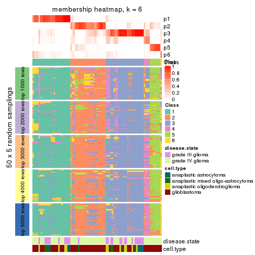</p>

</div>
</div>

As soon as we have had the classes for columns, we can look for signatures
which are significantly different between classes which can be candidate marks
for certain classes. Following are the heatmaps for signatures.


Signature heatmaps where rows are scaled:


<script>
$( function() {
	$( '#tabs-CV-hclust-get-signatures' ).tabs();
} );
</script>
<div id='tabs-CV-hclust-get-signatures'>
<ul>
<li><a href='#tab-CV-hclust-get-signatures-1'>k = 2</a></li>
<li><a href='#tab-CV-hclust-get-signatures-2'>k = 3</a></li>
<li><a href='#tab-CV-hclust-get-signatures-3'>k = 4</a></li>
<li><a href='#tab-CV-hclust-get-signatures-4'>k = 5</a></li>
<li><a href='#tab-CV-hclust-get-signatures-5'>k = 6</a></li>
</ul>
<div id='tab-CV-hclust-get-signatures-1'>
<pre><code class="r">get_signatures(res, k = 2)
</code></pre>

<p>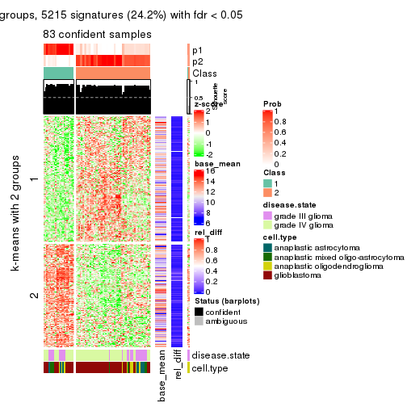</p>

</div>
<div id='tab-CV-hclust-get-signatures-2'>
<pre><code class="r">get_signatures(res, k = 3)
</code></pre>

<p></p>

</div>
<div id='tab-CV-hclust-get-signatures-3'>
<pre><code class="r">get_signatures(res, k = 4)
</code></pre>

<p></p>

</div>
<div id='tab-CV-hclust-get-signatures-4'>
<pre><code class="r">get_signatures(res, k = 5)
</code></pre>

<p></p>

</div>
<div id='tab-CV-hclust-get-signatures-5'>
<pre><code class="r">get_signatures(res, k = 6)
</code></pre>

<p></p>

</div>
</div>


Signature heatmaps where rows are not scaled:


<script>
$( function() {
	$( '#tabs-CV-hclust-get-signatures-no-scale' ).tabs();
} );
</script>
<div id='tabs-CV-hclust-get-signatures-no-scale'>
<ul>
<li><a href='#tab-CV-hclust-get-signatures-no-scale-1'>k = 2</a></li>
<li><a href='#tab-CV-hclust-get-signatures-no-scale-2'>k = 3</a></li>
<li><a href='#tab-CV-hclust-get-signatures-no-scale-3'>k = 4</a></li>
<li><a href='#tab-CV-hclust-get-signatures-no-scale-4'>k = 5</a></li>
<li><a href='#tab-CV-hclust-get-signatures-no-scale-5'>k = 6</a></li>
</ul>
<div id='tab-CV-hclust-get-signatures-no-scale-1'>
<pre><code class="r">get_signatures(res, k = 2, scale_rows = FALSE)
</code></pre>

<p></p>

</div>
<div id='tab-CV-hclust-get-signatures-no-scale-2'>
<pre><code class="r">get_signatures(res, k = 3, scale_rows = FALSE)
</code></pre>

<p></p>

</div>
<div id='tab-CV-hclust-get-signatures-no-scale-3'>
<pre><code class="r">get_signatures(res, k = 4, scale_rows = FALSE)
</code></pre>

<p></p>

</div>
<div id='tab-CV-hclust-get-signatures-no-scale-4'>
<pre><code class="r">get_signatures(res, k = 5, scale_rows = FALSE)
</code></pre>

<p></p>

</div>
<div id='tab-CV-hclust-get-signatures-no-scale-5'>
<pre><code class="r">get_signatures(res, k = 6, scale_rows = FALSE)
</code></pre>

<p>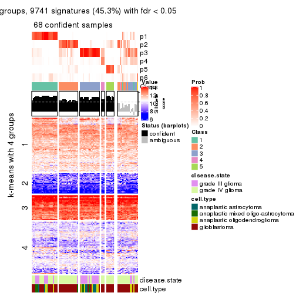</p>

</div>
</div>


Compare the overlap of signatures from different k:

```r
compare_signatures(res)
```


`get_signature()` returns a data frame invisibly. TO get the list of signatures, the function
call should be assigned to a variable explicitly. In following code, if `plot` argument is set
to `FALSE`, no heatmap is plotted while only the differential analysis is performed.

```r
# code only for demonstration
tb = get_signature(res, k = ..., plot = FALSE)
```

An example of the output of `tb` is:

```
#>   which_row         fdr    mean_1    mean_2 scaled_mean_1 scaled_mean_2 km
#> 1        38 0.042760348  8.373488  9.131774    -0.5533452     0.5164555  1
#> 2        40 0.018707592  7.106213  8.469186    -0.6173731     0.5762149  1
#> 3        55 0.019134737 10.221463 11.207825    -0.6159697     0.5749050  1
#> 4        59 0.006059896  5.921854  7.869574    -0.6899429     0.6439467  1
#> 5        60 0.018055526  8.928898 10.211722    -0.6204761     0.5791110  1
#> 6        98 0.009384629 15.714769 14.887706     0.6635654    -0.6193277  2
...
```

The columns in `tb` are:

1. `which_row`: row indices corresponding to the input matrix.
2. `fdr`: FDR for the differential test. 
3. `mean_x`: The mean value in group x.
4. `scaled_mean_x`: The mean value in group x after rows are scaled.
5. `km`: Row groups if k-means clustering is applied to rows.


UMAP plot which shows how samples are separated.


<script>
$( function() {
	$( '#tabs-CV-hclust-dimension-reduction' ).tabs();
} );
</script>
<div id='tabs-CV-hclust-dimension-reduction'>
<ul>
<li><a href='#tab-CV-hclust-dimension-reduction-1'>k = 2</a></li>
<li><a href='#tab-CV-hclust-dimension-reduction-2'>k = 3</a></li>
<li><a href='#tab-CV-hclust-dimension-reduction-3'>k = 4</a></li>
<li><a href='#tab-CV-hclust-dimension-reduction-4'>k = 5</a></li>
<li><a href='#tab-CV-hclust-dimension-reduction-5'>k = 6</a></li>
</ul>
<div id='tab-CV-hclust-dimension-reduction-1'>
<pre><code class="r">dimension_reduction(res, k = 2, method = &quot;UMAP&quot;)
</code></pre>

<p></p>

</div>
<div id='tab-CV-hclust-dimension-reduction-2'>
<pre><code class="r">dimension_reduction(res, k = 3, method = &quot;UMAP&quot;)
</code></pre>

<p></p>

</div>
<div id='tab-CV-hclust-dimension-reduction-3'>
<pre><code class="r">dimension_reduction(res, k = 4, method = &quot;UMAP&quot;)
</code></pre>

<p></p>

</div>
<div id='tab-CV-hclust-dimension-reduction-4'>
<pre><code class="r">dimension_reduction(res, k = 5, method = &quot;UMAP&quot;)
</code></pre>

<p></p>

</div>
<div id='tab-CV-hclust-dimension-reduction-5'>
<pre><code class="r">dimension_reduction(res, k = 6, method = &quot;UMAP&quot;)
</code></pre>

<p></p>

</div>
</div>


Following heatmap shows how subgroups are split when increasing `k`:

```r
collect_classes(res)
```


Test correlation between subgroups and known annotations. If the known
annotation is numeric, one-way ANOVA test is applied, and if the known
annotation is discrete, chi-squared contingency table test is applied.

```r
test_to_known_factors(res)
```

```
#>            n disease.state(p) cell.type(p) k
#> CV:hclust 83         0.404736      0.70924 2
#> CV:hclust 75         0.001850      0.03342 3
#> CV:hclust 65         0.000108      0.00377 4
#> CV:hclust 50         0.014691      0.28742 5
#> CV:hclust 68         0.000116      0.01830 6
```


If matrix rows can be associated to genes, consider to use `GO_Enrichment(res,
...)` to perform function enrichment for the signature genes.


 

---------------------------------------------------


### CV:kmeans**


The object with results only for a single top-value method and a single partition method 
can be extracted as:

```r
res = res_list["CV", "kmeans"]
# you can also extract it by
# res = res_list["CV:kmeans"]
```

A summary of `res` and all the functions that can be applied to it:

```r
res
```

```
#> A 'ConsensusPartition' object with k = 2, 3, 4, 5, 6.
#>   On a matrix with 21512 rows and 85 columns.
#>   Top rows (1000, 2000, 3000, 4000, 5000) are extracted by 'CV' method.
#>   Subgroups are detected by 'kmeans' method.
#>   Performed in total 1250 partitions by row resampling.
#>   Best k for subgroups seems to be 3.
#> 
#> Following methods can be applied to this 'ConsensusPartition' object:
#>  [1] "cola_report"             "collect_classes"         "collect_plots"          
#>  [4] "collect_stats"           "colnames"                "compare_signatures"     
#>  [7] "consensus_heatmap"       "dimension_reduction"     "functional_enrichment"  
#> [10] "get_anno_col"            "get_anno"                "get_classes"            
#> [13] "get_consensus"           "get_matrix"              "get_membership"         
#> [16] "get_param"               "get_signatures"          "get_stats"              
#> [19] "is_best_k"               "is_stable_k"             "membership_heatmap"     
#> [22] "ncol"                    "nrow"                    "plot_ecdf"              
#> [25] "rownames"                "select_partition_number" "show"                   
#> [28] "suggest_best_k"          "test_to_known_factors"
```

`collect_plots()` function collects all the plots made from `res` for all `k` (number of partitions)
into one single page to provide an easy and fast comparison between different `k`.

```r
collect_plots(res)
```


The plots are:

- The first row: a plot of the ECDF (Empirical cumulative distribution
  function) curves of the consensus matrix for each `k` and the heatmap of
  predicted classes for each `k`.
- The second row: heatmaps of the consensus matrix for each `k`.
- The third row: heatmaps of the membership matrix for each `k`.
- The fouth row: heatmaps of the signatures for each `k`.

All the plots in panels can be made by individual functions and they are
plotted later in this section.

`select_partition_number()` produces several plots showing different
statistics for choosing "optimized" `k`. There are following statistics:

- ECDF curves of the consensus matrix for each `k`;
- 1-PAC. [The PAC
  score](https://en.wikipedia.org/wiki/Consensus_clustering#Over-interpretation_potential_of_consensus_clustering)
  measures the proportion of the ambiguous subgrouping.
- Mean silhouette score.
- Concordance. The mean probability of fiting the consensus class ids in all
  partitions.
- Area increased. Denote $A_k$ as the area under the ECDF curve for current
  `k`, the area increased is defined as $A_k - A_{k-1}$.
- Rand index. The percent of pairs of samples that are both in a same cluster
  or both are not in a same cluster in the partition of k and k-1.
- Jaccard index. The ratio of pairs of samples are both in a same cluster in
  the partition of k and k-1 and the pairs of samples are both in a same
  cluster in the partition k or k-1.

The detailed explanations of these statistics can be found in [the cola
vignette](http://bioconductor.org/packages/devel/bioc/vignettes/cola/inst/doc/cola.html#toc_13).

Generally speaking, lower PAC score, higher mean silhouette score or higher
concordance corresponds to better partition. Rand index and Jaccard index
measure how similar the current partition is compared to partition with `k-1`.
If they are too similar, we won't accept `k` is better than `k-1`.

```r
select_partition_number(res)
```


The numeric values for all these statistics can be obtained by `get_stats()`.

```r
get_stats(res)
```

```
#>   k 1-PAC mean_silhouette concordance area_increased  Rand Jaccard
#> 2 2 0.572           0.629       0.849         0.4640 0.519   0.519
#> 3 3 0.977           0.935       0.950         0.4323 0.726   0.511
#> 4 4 0.774           0.684       0.847         0.1026 0.954   0.866
#> 5 5 0.746           0.784       0.840         0.0609 0.900   0.686
#> 6 6 0.793           0.703       0.830         0.0430 0.961   0.833
```

`suggest_best_k()` suggests the best $k$ based on these statistics. The rules are as follows:

- All $k$ with Jaccard index larger than 0.95 are removed because the increase of
  the partition number does not provides enough extra information. If all $k$ are removed,
  the best $k$ is assigned by `NA`.
- For $k$ with 1-PAC larger than 0.9, the maximal $k$ is taken as the "best k". Other $k$ is called "optional k".
- If it does not fit the second rule. The $k$ with the highest vote of highest
  1-PAC, mean silhouette and concordance is taken as the "best k".

```r
suggest_best_k(res)
```

```
#> [1] 3
```


Following shows the table of the partitions (You need to click the **show/hide
code output** link to see it). The membership matrix (columns with name `p*`)
is inferred by
[`clue::cl_consensus()`](https://www.rdocumentation.org/link/cl_consensus?package=clue)
function with the `SE` method. Basically the value in the membership matrix
represents the probability to belong to a certain group. The finall class
label for an item is determined with the group with highest probability it
belongs to.

In `get_classes()` function, the entropy is calculated from the membership
matrix and the silhouette score is calculated from the consensus matrix.


<script>
$( function() {
	$( '#tabs-CV-kmeans-get-classes' ).tabs();
} );
</script>
<div id='tabs-CV-kmeans-get-classes'>
<ul>
<li><a href='#tab-CV-kmeans-get-classes-1'>k = 2</a></li>
<li><a href='#tab-CV-kmeans-get-classes-2'>k = 3</a></li>
<li><a href='#tab-CV-kmeans-get-classes-3'>k = 4</a></li>
<li><a href='#tab-CV-kmeans-get-classes-4'>k = 5</a></li>
<li><a href='#tab-CV-kmeans-get-classes-5'>k = 6</a></li>
</ul>

<div id='tab-CV-kmeans-get-classes-1'>
<p><a id='tab-CV-kmeans-get-classes-1-a' style='color:#0366d6' href='#'>show/hide code output</a></p>
<pre><code class="r">cbind(get_classes(res, k = 2), get_membership(res, k = 2))
</code></pre>

<pre><code>#&gt;          class entropy silhouette    p1    p2
#&gt; GSM99497     2  0.9983      0.274 0.476 0.524
#&gt; GSM99503     1  0.0000      0.887 1.000 0.000
#&gt; GSM99505     1  0.1184      0.871 0.984 0.016
#&gt; GSM99507     2  0.9983      0.274 0.476 0.524
#&gt; GSM99567     2  0.9983      0.274 0.476 0.524
#&gt; GSM99575     1  0.0000      0.887 1.000 0.000
#&gt; GSM99593     2  0.9983      0.274 0.476 0.524
#&gt; GSM99595     2  0.9983      0.274 0.476 0.524
#&gt; GSM99469     1  0.0000      0.887 1.000 0.000
#&gt; GSM99499     1  0.0000      0.887 1.000 0.000
#&gt; GSM99501     1  0.0000      0.887 1.000 0.000
#&gt; GSM99509     2  0.9993      0.254 0.484 0.516
#&gt; GSM99569     2  0.9993      0.254 0.484 0.516
#&gt; GSM99597     2  0.9996      0.241 0.488 0.512
#&gt; GSM99601     2  0.1633      0.754 0.024 0.976
#&gt; GSM99459     1  0.0000      0.887 1.000 0.000
#&gt; GSM99461     1  0.0000      0.887 1.000 0.000
#&gt; GSM99511     2  0.9983      0.274 0.476 0.524
#&gt; GSM99513     2  0.9983      0.274 0.476 0.524
#&gt; GSM99515     2  0.9988      0.264 0.480 0.520
#&gt; GSM99517     1  0.0000      0.887 1.000 0.000
#&gt; GSM99519     1  0.0000      0.887 1.000 0.000
#&gt; GSM99521     2  0.9988      0.264 0.480 0.520
#&gt; GSM99523     1  0.9983     -0.161 0.524 0.476
#&gt; GSM99571     1  0.0000      0.887 1.000 0.000
#&gt; GSM99599     1  0.0000      0.887 1.000 0.000
#&gt; GSM99433     2  0.0000      0.746 0.000 1.000
#&gt; GSM99435     2  0.9983      0.274 0.476 0.524
#&gt; GSM99437     2  0.1633      0.754 0.024 0.976
#&gt; GSM99439     2  0.1633      0.754 0.024 0.976
#&gt; GSM99441     1  0.0000      0.887 1.000 0.000
#&gt; GSM99443     2  0.1633      0.754 0.024 0.976
#&gt; GSM99445     2  0.1633      0.754 0.024 0.976
#&gt; GSM99447     2  0.1633      0.754 0.024 0.976
#&gt; GSM99449     2  0.0000      0.746 0.000 1.000
#&gt; GSM99451     2  0.9993      0.254 0.484 0.516
#&gt; GSM99453     1  0.0000      0.887 1.000 0.000
#&gt; GSM99455     1  0.0000      0.887 1.000 0.000
#&gt; GSM99457     1  0.0000      0.887 1.000 0.000
#&gt; GSM99463     2  0.1633      0.754 0.024 0.976
#&gt; GSM99465     1  0.8713      0.424 0.708 0.292
#&gt; GSM99467     2  0.1633      0.754 0.024 0.976
#&gt; GSM99471     1  0.0000      0.887 1.000 0.000
#&gt; GSM99473     1  0.0000      0.887 1.000 0.000
#&gt; GSM99475     2  0.9993      0.254 0.484 0.516
#&gt; GSM99477     2  0.0000      0.746 0.000 1.000
#&gt; GSM99479     2  0.1633      0.754 0.024 0.976
#&gt; GSM99481     1  0.0000      0.887 1.000 0.000
#&gt; GSM99483     1  0.0000      0.887 1.000 0.000
#&gt; GSM99485     2  0.1633      0.754 0.024 0.976
#&gt; GSM99487     2  0.1633      0.754 0.024 0.976
#&gt; GSM99489     2  0.1633      0.754 0.024 0.976
#&gt; GSM99491     2  0.1633      0.754 0.024 0.976
#&gt; GSM99493     1  0.0000      0.887 1.000 0.000
#&gt; GSM99495     2  0.1633      0.754 0.024 0.976
#&gt; GSM99525     1  0.0000      0.887 1.000 0.000
#&gt; GSM99527     2  0.9998      0.252 0.492 0.508
#&gt; GSM99529     2  0.6531      0.665 0.168 0.832
#&gt; GSM99531     1  0.9996     -0.200 0.512 0.488
#&gt; GSM99533     1  0.9170      0.341 0.668 0.332
#&gt; GSM99535     2  0.6247      0.644 0.156 0.844
#&gt; GSM99537     1  0.0000      0.887 1.000 0.000
#&gt; GSM99539     2  0.0000      0.746 0.000 1.000
#&gt; GSM99541     1  0.0938      0.875 0.988 0.012
#&gt; GSM99543     2  0.2236      0.746 0.036 0.964
#&gt; GSM99545     2  0.0000      0.746 0.000 1.000
#&gt; GSM99547     1  0.9996     -0.257 0.512 0.488
#&gt; GSM99549     2  0.1633      0.754 0.024 0.976
#&gt; GSM99551     1  0.0000      0.887 1.000 0.000
#&gt; GSM99553     2  0.9983      0.274 0.476 0.524
#&gt; GSM99555     2  0.1633      0.754 0.024 0.976
#&gt; GSM99557     2  0.1633      0.754 0.024 0.976
#&gt; GSM99559     2  0.0000      0.746 0.000 1.000
#&gt; GSM99561     2  0.1633      0.754 0.024 0.976
#&gt; GSM99563     2  0.9993      0.254 0.484 0.516
#&gt; GSM99565     2  0.0938      0.750 0.012 0.988
#&gt; GSM99573     2  0.1633      0.754 0.024 0.976
#&gt; GSM99577     1  0.0000      0.887 1.000 0.000
#&gt; GSM99579     2  0.1633      0.754 0.024 0.976
#&gt; GSM99581     2  0.9983      0.274 0.476 0.524
#&gt; GSM99583     1  1.0000     -0.278 0.504 0.496
#&gt; GSM99585     2  0.1633      0.754 0.024 0.976
#&gt; GSM99587     1  0.0000      0.887 1.000 0.000
#&gt; GSM99589     2  0.1633      0.754 0.024 0.976
#&gt; GSM99591     2  0.1633      0.754 0.024 0.976
</code></pre>

<script>
$('#tab-CV-kmeans-get-classes-1-a').parent().next().next().hide();
$('#tab-CV-kmeans-get-classes-1-a').click(function(){
  $('#tab-CV-kmeans-get-classes-1-a').parent().next().next().toggle();
  return(false);
});
</script>
</div>

<div id='tab-CV-kmeans-get-classes-2'>
<p><a id='tab-CV-kmeans-get-classes-2-a' style='color:#0366d6' href='#'>show/hide code output</a></p>
<pre><code class="r">cbind(get_classes(res, k = 3), get_membership(res, k = 3))
</code></pre>

<pre><code>#&gt;          class entropy silhouette    p1    p2    p3
#&gt; GSM99497     3  0.2773     0.9501 0.048 0.024 0.928
#&gt; GSM99503     1  0.0000     0.9937 1.000 0.000 0.000
#&gt; GSM99505     1  0.0000     0.9937 1.000 0.000 0.000
#&gt; GSM99507     3  0.2773     0.9501 0.048 0.024 0.928
#&gt; GSM99567     3  0.2773     0.9501 0.048 0.024 0.928
#&gt; GSM99575     1  0.0000     0.9937 1.000 0.000 0.000
#&gt; GSM99593     3  0.2773     0.9501 0.048 0.024 0.928
#&gt; GSM99595     3  0.2773     0.9501 0.048 0.024 0.928
#&gt; GSM99469     1  0.0000     0.9937 1.000 0.000 0.000
#&gt; GSM99499     1  0.0000     0.9937 1.000 0.000 0.000
#&gt; GSM99501     1  0.0000     0.9937 1.000 0.000 0.000
#&gt; GSM99509     3  0.2773     0.9501 0.048 0.024 0.928
#&gt; GSM99569     3  0.2773     0.9501 0.048 0.024 0.928
#&gt; GSM99597     3  0.2773     0.9501 0.048 0.024 0.928
#&gt; GSM99601     2  0.0424     0.9623 0.000 0.992 0.008
#&gt; GSM99459     1  0.0000     0.9937 1.000 0.000 0.000
#&gt; GSM99461     1  0.0000     0.9937 1.000 0.000 0.000
#&gt; GSM99511     3  0.2773     0.9501 0.048 0.024 0.928
#&gt; GSM99513     3  0.2773     0.9501 0.048 0.024 0.928
#&gt; GSM99515     3  0.2773     0.9501 0.048 0.024 0.928
#&gt; GSM99517     1  0.0000     0.9937 1.000 0.000 0.000
#&gt; GSM99519     1  0.0000     0.9937 1.000 0.000 0.000
#&gt; GSM99521     3  0.2663     0.9487 0.044 0.024 0.932
#&gt; GSM99523     3  0.2584     0.9394 0.064 0.008 0.928
#&gt; GSM99571     1  0.0000     0.9937 1.000 0.000 0.000
#&gt; GSM99599     1  0.0000     0.9937 1.000 0.000 0.000
#&gt; GSM99433     2  0.2066     0.9112 0.000 0.940 0.060
#&gt; GSM99435     3  0.2663     0.9487 0.044 0.024 0.932
#&gt; GSM99437     2  0.0000     0.9633 0.000 1.000 0.000
#&gt; GSM99439     2  0.1529     0.9533 0.000 0.960 0.040
#&gt; GSM99441     1  0.0000     0.9937 1.000 0.000 0.000
#&gt; GSM99443     2  0.0000     0.9633 0.000 1.000 0.000
#&gt; GSM99445     2  0.0000     0.9633 0.000 1.000 0.000
#&gt; GSM99447     2  0.0000     0.9633 0.000 1.000 0.000
#&gt; GSM99449     3  0.2356     0.9127 0.000 0.072 0.928
#&gt; GSM99451     3  0.2527     0.9479 0.044 0.020 0.936
#&gt; GSM99453     1  0.0747     0.9902 0.984 0.000 0.016
#&gt; GSM99455     1  0.0747     0.9902 0.984 0.000 0.016
#&gt; GSM99457     1  0.1031     0.9876 0.976 0.000 0.024
#&gt; GSM99463     2  0.1529     0.9533 0.000 0.960 0.040
#&gt; GSM99465     3  0.5541     0.7267 0.252 0.008 0.740
#&gt; GSM99467     2  0.0237     0.9624 0.000 0.996 0.004
#&gt; GSM99471     1  0.0892     0.9890 0.980 0.000 0.020
#&gt; GSM99473     1  0.0237     0.9918 0.996 0.000 0.004
#&gt; GSM99475     3  0.2527     0.9479 0.044 0.020 0.936
#&gt; GSM99477     3  0.6204     0.3478 0.000 0.424 0.576
#&gt; GSM99479     2  0.1031     0.9500 0.000 0.976 0.024
#&gt; GSM99481     1  0.0000     0.9937 1.000 0.000 0.000
#&gt; GSM99483     1  0.0747     0.9902 0.984 0.000 0.016
#&gt; GSM99485     2  0.0237     0.9624 0.000 0.996 0.004
#&gt; GSM99487     2  0.0000     0.9633 0.000 1.000 0.000
#&gt; GSM99489     2  0.1529     0.9533 0.000 0.960 0.040
#&gt; GSM99491     2  0.0000     0.9633 0.000 1.000 0.000
#&gt; GSM99493     1  0.1031     0.9876 0.976 0.000 0.024
#&gt; GSM99495     2  0.1529     0.9533 0.000 0.960 0.040
#&gt; GSM99525     1  0.0592     0.9915 0.988 0.000 0.012
#&gt; GSM99527     3  0.2773     0.9462 0.048 0.024 0.928
#&gt; GSM99529     2  0.6305    -0.0731 0.000 0.516 0.484
#&gt; GSM99531     3  0.2063     0.9407 0.044 0.008 0.948
#&gt; GSM99533     3  0.2063     0.9407 0.044 0.008 0.948
#&gt; GSM99535     2  0.2998     0.8950 0.068 0.916 0.016
#&gt; GSM99537     1  0.0424     0.9921 0.992 0.000 0.008
#&gt; GSM99539     3  0.4291     0.8107 0.000 0.180 0.820
#&gt; GSM99541     1  0.0424     0.9921 0.992 0.000 0.008
#&gt; GSM99543     2  0.1964     0.9450 0.000 0.944 0.056
#&gt; GSM99545     3  0.5138     0.6650 0.000 0.252 0.748
#&gt; GSM99547     3  0.3722     0.9169 0.088 0.024 0.888
#&gt; GSM99549     2  0.1529     0.9533 0.000 0.960 0.040
#&gt; GSM99551     1  0.1289     0.9834 0.968 0.000 0.032
#&gt; GSM99553     3  0.2773     0.9501 0.048 0.024 0.928
#&gt; GSM99555     2  0.0000     0.9633 0.000 1.000 0.000
#&gt; GSM99557     2  0.0592     0.9616 0.000 0.988 0.012
#&gt; GSM99559     3  0.2356     0.9127 0.000 0.072 0.928
#&gt; GSM99561     2  0.1031     0.9585 0.000 0.976 0.024
#&gt; GSM99563     3  0.2773     0.9501 0.048 0.024 0.928
#&gt; GSM99565     2  0.0000     0.9633 0.000 1.000 0.000
#&gt; GSM99573     2  0.1529     0.9533 0.000 0.960 0.040
#&gt; GSM99577     1  0.0892     0.9889 0.980 0.000 0.020
#&gt; GSM99579     2  0.0237     0.9624 0.000 0.996 0.004
#&gt; GSM99581     3  0.2773     0.9501 0.048 0.024 0.928
#&gt; GSM99583     3  0.5136     0.8513 0.044 0.132 0.824
#&gt; GSM99585     2  0.0000     0.9633 0.000 1.000 0.000
#&gt; GSM99587     1  0.1031     0.9876 0.976 0.000 0.024
#&gt; GSM99589     2  0.0000     0.9633 0.000 1.000 0.000
#&gt; GSM99591     2  0.0000     0.9633 0.000 1.000 0.000
</code></pre>

<script>
$('#tab-CV-kmeans-get-classes-2-a').parent().next().next().hide();
$('#tab-CV-kmeans-get-classes-2-a').click(function(){
  $('#tab-CV-kmeans-get-classes-2-a').parent().next().next().toggle();
  return(false);
});
</script>
</div>

<div id='tab-CV-kmeans-get-classes-3'>
<p><a id='tab-CV-kmeans-get-classes-3-a' style='color:#0366d6' href='#'>show/hide code output</a></p>
<pre><code class="r">cbind(get_classes(res, k = 4), get_membership(res, k = 4))
</code></pre>

<pre><code>#&gt;          class entropy silhouette    p1    p2    p3    p4
#&gt; GSM99497     3  0.0000     0.7659 0.000 0.000 1.000 0.000
#&gt; GSM99503     1  0.0000     0.9245 1.000 0.000 0.000 0.000
#&gt; GSM99505     1  0.1624     0.9073 0.952 0.000 0.028 0.020
#&gt; GSM99507     3  0.0000     0.7659 0.000 0.000 1.000 0.000
#&gt; GSM99567     3  0.0000     0.7659 0.000 0.000 1.000 0.000
#&gt; GSM99575     1  0.0000     0.9245 1.000 0.000 0.000 0.000
#&gt; GSM99593     3  0.0000     0.7659 0.000 0.000 1.000 0.000
#&gt; GSM99595     3  0.0000     0.7659 0.000 0.000 1.000 0.000
#&gt; GSM99469     1  0.0707     0.9219 0.980 0.000 0.000 0.020
#&gt; GSM99499     1  0.0707     0.9219 0.980 0.000 0.000 0.020
#&gt; GSM99501     1  0.0707     0.9219 0.980 0.000 0.000 0.020
#&gt; GSM99509     3  0.0000     0.7659 0.000 0.000 1.000 0.000
#&gt; GSM99569     3  0.0592     0.7489 0.000 0.000 0.984 0.016
#&gt; GSM99597     3  0.0592     0.7493 0.000 0.000 0.984 0.016
#&gt; GSM99601     2  0.2647     0.7921 0.000 0.880 0.000 0.120
#&gt; GSM99459     1  0.0921     0.9200 0.972 0.000 0.000 0.028
#&gt; GSM99461     1  0.0921     0.9200 0.972 0.000 0.000 0.028
#&gt; GSM99511     3  0.0000     0.7659 0.000 0.000 1.000 0.000
#&gt; GSM99513     3  0.0000     0.7659 0.000 0.000 1.000 0.000
#&gt; GSM99515     3  0.0000     0.7659 0.000 0.000 1.000 0.000
#&gt; GSM99517     1  0.0000     0.9245 1.000 0.000 0.000 0.000
#&gt; GSM99519     1  0.0921     0.9200 0.972 0.000 0.000 0.028
#&gt; GSM99521     3  0.0469     0.7560 0.000 0.000 0.988 0.012
#&gt; GSM99523     3  0.0188     0.7620 0.000 0.000 0.996 0.004
#&gt; GSM99571     1  0.1302     0.9187 0.956 0.000 0.000 0.044
#&gt; GSM99599     1  0.0188     0.9245 0.996 0.000 0.000 0.004
#&gt; GSM99433     2  0.4290     0.6625 0.000 0.772 0.016 0.212
#&gt; GSM99435     3  0.4500     0.2214 0.000 0.000 0.684 0.316
#&gt; GSM99437     2  0.0707     0.8010 0.000 0.980 0.000 0.020
#&gt; GSM99439     2  0.4679     0.6787 0.000 0.648 0.000 0.352
#&gt; GSM99441     1  0.0188     0.9245 0.996 0.000 0.000 0.004
#&gt; GSM99443     2  0.1389     0.7999 0.000 0.952 0.000 0.048
#&gt; GSM99445     2  0.2011     0.7957 0.000 0.920 0.000 0.080
#&gt; GSM99447     2  0.1022     0.8016 0.000 0.968 0.000 0.032
#&gt; GSM99449     3  0.0000     0.7659 0.000 0.000 1.000 0.000
#&gt; GSM99451     3  0.4746     0.0750 0.000 0.000 0.632 0.368
#&gt; GSM99453     1  0.2704     0.8924 0.876 0.000 0.000 0.124
#&gt; GSM99455     1  0.2704     0.8924 0.876 0.000 0.000 0.124
#&gt; GSM99457     1  0.3444     0.8592 0.816 0.000 0.000 0.184
#&gt; GSM99463     2  0.4661     0.6791 0.000 0.652 0.000 0.348
#&gt; GSM99465     4  0.8041     0.4320 0.192 0.016 0.368 0.424
#&gt; GSM99467     2  0.1867     0.7820 0.000 0.928 0.000 0.072
#&gt; GSM99471     1  0.2868     0.8887 0.864 0.000 0.000 0.136
#&gt; GSM99473     1  0.0817     0.9211 0.976 0.000 0.000 0.024
#&gt; GSM99475     3  0.4804     0.0240 0.000 0.000 0.616 0.384
#&gt; GSM99477     2  0.5994     0.4897 0.000 0.692 0.152 0.156
#&gt; GSM99479     2  0.3052     0.7366 0.000 0.860 0.004 0.136
#&gt; GSM99481     1  0.0188     0.9245 0.996 0.000 0.000 0.004
#&gt; GSM99483     1  0.2647     0.8941 0.880 0.000 0.000 0.120
#&gt; GSM99485     2  0.1302     0.7960 0.000 0.956 0.000 0.044
#&gt; GSM99487     2  0.0592     0.8008 0.000 0.984 0.000 0.016
#&gt; GSM99489     2  0.4605     0.6820 0.000 0.664 0.000 0.336
#&gt; GSM99491     2  0.1474     0.7995 0.000 0.948 0.000 0.052
#&gt; GSM99493     1  0.3444     0.8592 0.816 0.000 0.000 0.184
#&gt; GSM99495     2  0.4661     0.6791 0.000 0.652 0.000 0.348
#&gt; GSM99525     1  0.2216     0.9041 0.908 0.000 0.000 0.092
#&gt; GSM99527     3  0.6501    -0.4423 0.004 0.060 0.480 0.456
#&gt; GSM99529     2  0.6310     0.2328 0.000 0.576 0.072 0.352
#&gt; GSM99531     3  0.4877    -0.0520 0.000 0.000 0.592 0.408
#&gt; GSM99533     3  0.5172    -0.0804 0.008 0.000 0.588 0.404
#&gt; GSM99535     2  0.3108     0.7576 0.016 0.872 0.000 0.112
#&gt; GSM99537     1  0.0469     0.9253 0.988 0.000 0.000 0.012
#&gt; GSM99539     3  0.7110    -0.5274 0.000 0.128 0.460 0.412
#&gt; GSM99541     1  0.1867     0.9014 0.928 0.000 0.000 0.072
#&gt; GSM99543     2  0.4898     0.6536 0.000 0.584 0.000 0.416
#&gt; GSM99545     4  0.7225     0.4702 0.000 0.160 0.328 0.512
#&gt; GSM99547     3  0.6724    -0.4720 0.004 0.076 0.468 0.452
#&gt; GSM99549     2  0.4713     0.6739 0.000 0.640 0.000 0.360
#&gt; GSM99551     1  0.4998     0.3692 0.512 0.000 0.000 0.488
#&gt; GSM99553     3  0.0000     0.7659 0.000 0.000 1.000 0.000
#&gt; GSM99555     2  0.1211     0.8022 0.000 0.960 0.000 0.040
#&gt; GSM99557     2  0.3486     0.7633 0.000 0.812 0.000 0.188
#&gt; GSM99559     3  0.0000     0.7659 0.000 0.000 1.000 0.000
#&gt; GSM99561     2  0.4134     0.7489 0.000 0.740 0.000 0.260
#&gt; GSM99563     3  0.0000     0.7659 0.000 0.000 1.000 0.000
#&gt; GSM99565     2  0.0817     0.8011 0.000 0.976 0.000 0.024
#&gt; GSM99573     2  0.4713     0.6739 0.000 0.640 0.000 0.360
#&gt; GSM99577     1  0.3569     0.8557 0.804 0.000 0.000 0.196
#&gt; GSM99579     2  0.1637     0.7997 0.000 0.940 0.000 0.060
#&gt; GSM99581     3  0.0000     0.7659 0.000 0.000 1.000 0.000
#&gt; GSM99583     2  0.7953    -0.1872 0.008 0.456 0.268 0.268
#&gt; GSM99585     2  0.3400     0.7069 0.000 0.820 0.000 0.180
#&gt; GSM99587     1  0.3444     0.8592 0.816 0.000 0.000 0.184
#&gt; GSM99589     2  0.1118     0.7952 0.000 0.964 0.000 0.036
#&gt; GSM99591     2  0.2011     0.7957 0.000 0.920 0.000 0.080
</code></pre>

<script>
$('#tab-CV-kmeans-get-classes-3-a').parent().next().next().hide();
$('#tab-CV-kmeans-get-classes-3-a').click(function(){
  $('#tab-CV-kmeans-get-classes-3-a').parent().next().next().toggle();
  return(false);
});
</script>
</div>

<div id='tab-CV-kmeans-get-classes-4'>
<p><a id='tab-CV-kmeans-get-classes-4-a' style='color:#0366d6' href='#'>show/hide code output</a></p>
<pre><code class="r">cbind(get_classes(res, k = 5), get_membership(res, k = 5))
</code></pre>

<pre><code>#&gt;          class entropy silhouette    p1    p2    p3    p4    p5
#&gt; GSM99497     3  0.0000      0.994 0.000 0.000 1.000 0.000 0.000
#&gt; GSM99503     1  0.0000      0.860 1.000 0.000 0.000 0.000 0.000
#&gt; GSM99505     1  0.1484      0.838 0.944 0.000 0.048 0.000 0.008
#&gt; GSM99507     3  0.0000      0.994 0.000 0.000 1.000 0.000 0.000
#&gt; GSM99567     3  0.0000      0.994 0.000 0.000 1.000 0.000 0.000
#&gt; GSM99575     1  0.0000      0.860 1.000 0.000 0.000 0.000 0.000
#&gt; GSM99593     3  0.0000      0.994 0.000 0.000 1.000 0.000 0.000
#&gt; GSM99595     3  0.0000      0.994 0.000 0.000 1.000 0.000 0.000
#&gt; GSM99469     1  0.0510      0.858 0.984 0.000 0.000 0.000 0.016
#&gt; GSM99499     1  0.0290      0.860 0.992 0.000 0.000 0.000 0.008
#&gt; GSM99501     1  0.0510      0.858 0.984 0.000 0.000 0.000 0.016
#&gt; GSM99509     3  0.0162      0.994 0.000 0.000 0.996 0.000 0.004
#&gt; GSM99569     3  0.0324      0.992 0.000 0.000 0.992 0.004 0.004
#&gt; GSM99597     3  0.0162      0.992 0.000 0.000 0.996 0.000 0.004
#&gt; GSM99601     2  0.3912      0.447 0.000 0.752 0.000 0.020 0.228
#&gt; GSM99459     1  0.2782      0.816 0.880 0.000 0.000 0.072 0.048
#&gt; GSM99461     1  0.2782      0.816 0.880 0.000 0.000 0.072 0.048
#&gt; GSM99511     3  0.0451      0.991 0.000 0.000 0.988 0.004 0.008
#&gt; GSM99513     3  0.0451      0.991 0.000 0.000 0.988 0.004 0.008
#&gt; GSM99515     3  0.0000      0.994 0.000 0.000 1.000 0.000 0.000
#&gt; GSM99517     1  0.0000      0.860 1.000 0.000 0.000 0.000 0.000
#&gt; GSM99519     1  0.2654      0.819 0.888 0.000 0.000 0.064 0.048
#&gt; GSM99521     3  0.0510      0.979 0.000 0.000 0.984 0.016 0.000
#&gt; GSM99523     3  0.0486      0.989 0.004 0.000 0.988 0.004 0.004
#&gt; GSM99571     1  0.2770      0.840 0.880 0.000 0.000 0.044 0.076
#&gt; GSM99599     1  0.0290      0.860 0.992 0.000 0.000 0.000 0.008
#&gt; GSM99433     2  0.4589      0.527 0.000 0.704 0.000 0.248 0.048
#&gt; GSM99435     4  0.4418      0.675 0.000 0.000 0.332 0.652 0.016
#&gt; GSM99437     2  0.2388      0.727 0.000 0.900 0.000 0.028 0.072
#&gt; GSM99439     5  0.4150      0.946 0.000 0.388 0.000 0.000 0.612
#&gt; GSM99441     1  0.0404      0.861 0.988 0.000 0.000 0.000 0.012
#&gt; GSM99443     2  0.2017      0.711 0.000 0.912 0.000 0.008 0.080
#&gt; GSM99445     2  0.2806      0.614 0.000 0.844 0.000 0.004 0.152
#&gt; GSM99447     2  0.2325      0.730 0.000 0.904 0.000 0.028 0.068
#&gt; GSM99449     3  0.0290      0.992 0.000 0.000 0.992 0.000 0.008
#&gt; GSM99451     4  0.3521      0.793 0.000 0.000 0.232 0.764 0.004
#&gt; GSM99453     1  0.4909      0.773 0.716 0.000 0.000 0.120 0.164
#&gt; GSM99455     1  0.4909      0.773 0.716 0.000 0.000 0.120 0.164
#&gt; GSM99457     1  0.6000      0.656 0.572 0.000 0.000 0.160 0.268
#&gt; GSM99463     5  0.4182      0.950 0.000 0.400 0.000 0.000 0.600
#&gt; GSM99465     4  0.6277      0.639 0.216 0.008 0.056 0.644 0.076
#&gt; GSM99467     2  0.2077      0.723 0.000 0.920 0.000 0.040 0.040
#&gt; GSM99471     1  0.4944      0.790 0.724 0.004 0.000 0.116 0.156
#&gt; GSM99473     1  0.1626      0.846 0.940 0.000 0.000 0.016 0.044
#&gt; GSM99475     4  0.3421      0.811 0.000 0.000 0.204 0.788 0.008
#&gt; GSM99477     2  0.4372      0.634 0.000 0.804 0.068 0.084 0.044
#&gt; GSM99479     2  0.2370      0.714 0.000 0.904 0.000 0.056 0.040
#&gt; GSM99481     1  0.0404      0.861 0.988 0.000 0.000 0.000 0.012
#&gt; GSM99483     1  0.4827      0.776 0.724 0.000 0.000 0.116 0.160
#&gt; GSM99485     2  0.0898      0.735 0.000 0.972 0.000 0.008 0.020
#&gt; GSM99487     2  0.2193      0.733 0.000 0.912 0.000 0.028 0.060
#&gt; GSM99489     5  0.4350      0.939 0.000 0.408 0.000 0.004 0.588
#&gt; GSM99491     2  0.0798      0.737 0.000 0.976 0.000 0.008 0.016
#&gt; GSM99493     1  0.5929      0.665 0.584 0.000 0.000 0.156 0.260
#&gt; GSM99495     5  0.4182      0.950 0.000 0.400 0.000 0.000 0.600
#&gt; GSM99525     1  0.3682      0.819 0.820 0.000 0.000 0.072 0.108
#&gt; GSM99527     4  0.4311      0.815 0.000 0.024 0.144 0.788 0.044
#&gt; GSM99529     2  0.4918      0.514 0.000 0.716 0.008 0.204 0.072
#&gt; GSM99531     4  0.3513      0.818 0.000 0.000 0.180 0.800 0.020
#&gt; GSM99533     4  0.3209      0.819 0.000 0.000 0.180 0.812 0.008
#&gt; GSM99535     2  0.3223      0.681 0.016 0.868 0.000 0.052 0.064
#&gt; GSM99537     1  0.1725      0.857 0.936 0.000 0.000 0.044 0.020
#&gt; GSM99539     4  0.5242      0.758 0.000 0.112 0.132 0.728 0.028
#&gt; GSM99541     1  0.3477      0.796 0.824 0.000 0.000 0.136 0.040
#&gt; GSM99543     5  0.4604      0.828 0.000 0.428 0.000 0.012 0.560
#&gt; GSM99545     4  0.5561      0.740 0.000 0.068 0.108 0.720 0.104
#&gt; GSM99547     4  0.4800      0.796 0.000 0.036 0.136 0.764 0.064
#&gt; GSM99549     5  0.4299      0.943 0.000 0.388 0.000 0.004 0.608
#&gt; GSM99551     4  0.6517      0.222 0.172 0.008 0.000 0.508 0.312
#&gt; GSM99553     3  0.0000      0.994 0.000 0.000 1.000 0.000 0.000
#&gt; GSM99555     2  0.2351      0.716 0.000 0.896 0.000 0.016 0.088
#&gt; GSM99557     2  0.4288     -0.343 0.000 0.612 0.000 0.004 0.384
#&gt; GSM99559     3  0.0000      0.994 0.000 0.000 1.000 0.000 0.000
#&gt; GSM99561     2  0.4592     -0.198 0.000 0.644 0.000 0.024 0.332
#&gt; GSM99563     3  0.0451      0.991 0.000 0.000 0.988 0.004 0.008
#&gt; GSM99565     2  0.2362      0.725 0.000 0.900 0.000 0.024 0.076
#&gt; GSM99573     5  0.4299      0.943 0.000 0.388 0.000 0.004 0.608
#&gt; GSM99577     1  0.5731      0.722 0.624 0.000 0.000 0.180 0.196
#&gt; GSM99579     2  0.0992      0.736 0.000 0.968 0.000 0.008 0.024
#&gt; GSM99581     3  0.0162      0.994 0.000 0.000 0.996 0.000 0.004
#&gt; GSM99583     2  0.6380      0.471 0.012 0.672 0.104 0.128 0.084
#&gt; GSM99585     2  0.3485      0.680 0.000 0.828 0.000 0.124 0.048
#&gt; GSM99587     1  0.5929      0.665 0.584 0.000 0.000 0.156 0.260
#&gt; GSM99589     2  0.0162      0.740 0.000 0.996 0.000 0.004 0.000
#&gt; GSM99591     2  0.2629      0.644 0.000 0.860 0.000 0.004 0.136
</code></pre>

<script>
$('#tab-CV-kmeans-get-classes-4-a').parent().next().next().hide();
$('#tab-CV-kmeans-get-classes-4-a').click(function(){
  $('#tab-CV-kmeans-get-classes-4-a').parent().next().next().toggle();
  return(false);
});
</script>
</div>

<div id='tab-CV-kmeans-get-classes-5'>
<p><a id='tab-CV-kmeans-get-classes-5-a' style='color:#0366d6' href='#'>show/hide code output</a></p>
<pre><code class="r">cbind(get_classes(res, k = 6), get_membership(res, k = 6))
</code></pre>

<pre><code>#&gt;          class entropy silhouette    p1    p2    p3    p4    p5    p6
#&gt; GSM99497     3  0.0000     0.9817 0.000 0.000 1.000 0.000 0.000 0.000
#&gt; GSM99503     1  0.0363     0.7106 0.988 0.000 0.000 0.000 0.000 0.012
#&gt; GSM99505     1  0.2357     0.6743 0.904 0.000 0.048 0.004 0.012 0.032
#&gt; GSM99507     3  0.0000     0.9817 0.000 0.000 1.000 0.000 0.000 0.000
#&gt; GSM99567     3  0.0000     0.9817 0.000 0.000 1.000 0.000 0.000 0.000
#&gt; GSM99575     1  0.0363     0.7106 0.988 0.000 0.000 0.000 0.000 0.012
#&gt; GSM99593     3  0.0000     0.9817 0.000 0.000 1.000 0.000 0.000 0.000
#&gt; GSM99595     3  0.0000     0.9817 0.000 0.000 1.000 0.000 0.000 0.000
#&gt; GSM99469     1  0.1707     0.6998 0.928 0.000 0.000 0.004 0.012 0.056
#&gt; GSM99499     1  0.1332     0.7071 0.952 0.000 0.000 0.008 0.012 0.028
#&gt; GSM99501     1  0.1707     0.6998 0.928 0.000 0.000 0.004 0.012 0.056
#&gt; GSM99509     3  0.0405     0.9805 0.000 0.000 0.988 0.000 0.004 0.008
#&gt; GSM99569     3  0.0692     0.9776 0.000 0.000 0.976 0.000 0.004 0.020
#&gt; GSM99597     3  0.0260     0.9805 0.000 0.000 0.992 0.000 0.000 0.008
#&gt; GSM99601     2  0.5053     0.3776 0.000 0.564 0.000 0.012 0.368 0.056
#&gt; GSM99459     1  0.3861     0.6096 0.804 0.000 0.000 0.036 0.056 0.104
#&gt; GSM99461     1  0.3861     0.6096 0.804 0.000 0.000 0.036 0.056 0.104
#&gt; GSM99511     3  0.1692     0.9568 0.000 0.000 0.932 0.008 0.012 0.048
#&gt; GSM99513     3  0.1692     0.9568 0.000 0.000 0.932 0.008 0.012 0.048
#&gt; GSM99515     3  0.0000     0.9817 0.000 0.000 1.000 0.000 0.000 0.000
#&gt; GSM99517     1  0.0363     0.7106 0.988 0.000 0.000 0.000 0.000 0.012
#&gt; GSM99519     1  0.3861     0.6096 0.804 0.000 0.000 0.036 0.056 0.104
#&gt; GSM99521     3  0.0458     0.9724 0.000 0.000 0.984 0.016 0.000 0.000
#&gt; GSM99523     3  0.1296     0.9681 0.000 0.000 0.952 0.004 0.012 0.032
#&gt; GSM99571     1  0.2653     0.5453 0.844 0.000 0.000 0.000 0.012 0.144
#&gt; GSM99599     1  0.0458     0.7091 0.984 0.000 0.000 0.000 0.000 0.016
#&gt; GSM99433     2  0.5507     0.5260 0.000 0.636 0.000 0.228 0.052 0.084
#&gt; GSM99435     4  0.4355     0.7507 0.000 0.008 0.164 0.748 0.008 0.072
#&gt; GSM99437     2  0.3433     0.7422 0.000 0.816 0.000 0.012 0.132 0.040
#&gt; GSM99439     5  0.2653     0.8403 0.000 0.100 0.000 0.004 0.868 0.028
#&gt; GSM99441     1  0.0458     0.7091 0.984 0.000 0.000 0.000 0.000 0.016
#&gt; GSM99443     2  0.3878     0.7122 0.000 0.764 0.000 0.004 0.176 0.056
#&gt; GSM99445     2  0.4802     0.5033 0.000 0.620 0.000 0.008 0.316 0.056
#&gt; GSM99447     2  0.4029     0.7402 0.000 0.784 0.000 0.032 0.132 0.052
#&gt; GSM99449     3  0.0881     0.9759 0.000 0.000 0.972 0.008 0.008 0.012
#&gt; GSM99451     4  0.1686     0.8378 0.000 0.000 0.064 0.924 0.000 0.012
#&gt; GSM99453     1  0.4219    -0.1203 0.620 0.000 0.000 0.008 0.012 0.360
#&gt; GSM99455     1  0.4219    -0.1203 0.620 0.000 0.000 0.008 0.012 0.360
#&gt; GSM99457     6  0.4475     0.6984 0.448 0.000 0.000 0.008 0.016 0.528
#&gt; GSM99463     5  0.1910     0.8411 0.000 0.108 0.000 0.000 0.892 0.000
#&gt; GSM99465     4  0.7227     0.4660 0.216 0.036 0.004 0.500 0.056 0.188
#&gt; GSM99467     2  0.1572     0.7508 0.000 0.936 0.000 0.028 0.000 0.036
#&gt; GSM99471     1  0.4537    -0.0233 0.612 0.012 0.000 0.008 0.012 0.356
#&gt; GSM99473     1  0.2499     0.6748 0.880 0.004 0.000 0.004 0.016 0.096
#&gt; GSM99475     4  0.2272     0.8358 0.000 0.000 0.056 0.900 0.004 0.040
#&gt; GSM99477     2  0.2756     0.7376 0.000 0.880 0.012 0.060 0.004 0.044
#&gt; GSM99479     2  0.2000     0.7435 0.000 0.916 0.004 0.032 0.000 0.048
#&gt; GSM99481     1  0.0458     0.7091 0.984 0.000 0.000 0.000 0.000 0.016
#&gt; GSM99483     1  0.4062    -0.0495 0.640 0.000 0.000 0.004 0.012 0.344
#&gt; GSM99485     2  0.2341     0.7557 0.000 0.900 0.000 0.012 0.032 0.056
#&gt; GSM99487     2  0.3307     0.7478 0.000 0.828 0.000 0.012 0.120 0.040
#&gt; GSM99489     5  0.2890     0.8247 0.000 0.128 0.000 0.004 0.844 0.024
#&gt; GSM99491     2  0.2957     0.7218 0.000 0.844 0.000 0.004 0.120 0.032
#&gt; GSM99493     6  0.4486     0.6973 0.464 0.000 0.000 0.008 0.016 0.512
#&gt; GSM99495     5  0.1910     0.8411 0.000 0.108 0.000 0.000 0.892 0.000
#&gt; GSM99525     1  0.3656     0.2871 0.728 0.000 0.000 0.004 0.012 0.256
#&gt; GSM99527     4  0.3947     0.7977 0.000 0.044 0.016 0.804 0.020 0.116
#&gt; GSM99529     2  0.4063     0.6567 0.004 0.768 0.004 0.080 0.000 0.144
#&gt; GSM99531     4  0.2900     0.8284 0.000 0.000 0.044 0.860 0.008 0.088
#&gt; GSM99533     4  0.2452     0.8326 0.000 0.000 0.044 0.892 0.008 0.056
#&gt; GSM99535     2  0.3260     0.7306 0.016 0.848 0.000 0.012 0.028 0.096
#&gt; GSM99537     1  0.1167     0.7073 0.960 0.000 0.000 0.012 0.008 0.020
#&gt; GSM99539     4  0.3222     0.8226 0.000 0.044 0.024 0.864 0.020 0.048
#&gt; GSM99541     1  0.4187     0.5804 0.776 0.000 0.000 0.084 0.028 0.112
#&gt; GSM99543     5  0.4257     0.7394 0.000 0.204 0.000 0.008 0.728 0.060
#&gt; GSM99545     4  0.2723     0.8197 0.000 0.024 0.020 0.892 0.040 0.024
#&gt; GSM99547     4  0.5201     0.7247 0.000 0.128 0.012 0.692 0.020 0.148
#&gt; GSM99549     5  0.3297     0.8342 0.000 0.100 0.000 0.008 0.832 0.060
#&gt; GSM99551     6  0.5381     0.3948 0.136 0.008 0.000 0.184 0.016 0.656
#&gt; GSM99553     3  0.0000     0.9817 0.000 0.000 1.000 0.000 0.000 0.000
#&gt; GSM99555     2  0.3699     0.7309 0.000 0.788 0.000 0.012 0.160 0.040
#&gt; GSM99557     5  0.4441     0.4737 0.000 0.344 0.000 0.004 0.620 0.032
#&gt; GSM99559     3  0.0000     0.9817 0.000 0.000 1.000 0.000 0.000 0.000
#&gt; GSM99561     5  0.5673     0.3406 0.000 0.412 0.000 0.020 0.476 0.092
#&gt; GSM99563     3  0.1692     0.9568 0.000 0.000 0.932 0.008 0.012 0.048
#&gt; GSM99565     2  0.3680     0.7349 0.000 0.796 0.000 0.016 0.148 0.040
#&gt; GSM99573     5  0.3297     0.8342 0.000 0.100 0.000 0.008 0.832 0.060
#&gt; GSM99577     1  0.5031    -0.3060 0.504 0.000 0.000 0.040 0.016 0.440
#&gt; GSM99579     2  0.3017     0.7202 0.000 0.848 0.000 0.004 0.096 0.052
#&gt; GSM99581     3  0.0881     0.9759 0.000 0.000 0.972 0.008 0.008 0.012
#&gt; GSM99583     2  0.3510     0.7004 0.000 0.832 0.028 0.040 0.004 0.096
#&gt; GSM99585     2  0.3721     0.7177 0.000 0.804 0.000 0.100 0.012 0.084
#&gt; GSM99587     6  0.4486     0.6973 0.464 0.000 0.000 0.008 0.016 0.512
#&gt; GSM99589     2  0.2123     0.7621 0.000 0.908 0.000 0.008 0.064 0.020
#&gt; GSM99591     2  0.4686     0.5524 0.000 0.648 0.000 0.008 0.288 0.056
</code></pre>

<script>
$('#tab-CV-kmeans-get-classes-5-a').parent().next().next().hide();
$('#tab-CV-kmeans-get-classes-5-a').click(function(){
  $('#tab-CV-kmeans-get-classes-5-a').parent().next().next().toggle();
  return(false);
});
</script>
</div>
</div>

Heatmaps for the consensus matrix. It visualizes the probability of two
samples to be in a same group.


<script>
$( function() {
	$( '#tabs-CV-kmeans-consensus-heatmap' ).tabs();
} );
</script>
<div id='tabs-CV-kmeans-consensus-heatmap'>
<ul>
<li><a href='#tab-CV-kmeans-consensus-heatmap-1'>k = 2</a></li>
<li><a href='#tab-CV-kmeans-consensus-heatmap-2'>k = 3</a></li>
<li><a href='#tab-CV-kmeans-consensus-heatmap-3'>k = 4</a></li>
<li><a href='#tab-CV-kmeans-consensus-heatmap-4'>k = 5</a></li>
<li><a href='#tab-CV-kmeans-consensus-heatmap-5'>k = 6</a></li>
</ul>
<div id='tab-CV-kmeans-consensus-heatmap-1'>
<pre><code class="r">consensus_heatmap(res, k = 2)
</code></pre>

<p></p>

</div>
<div id='tab-CV-kmeans-consensus-heatmap-2'>
<pre><code class="r">consensus_heatmap(res, k = 3)
</code></pre>

<p>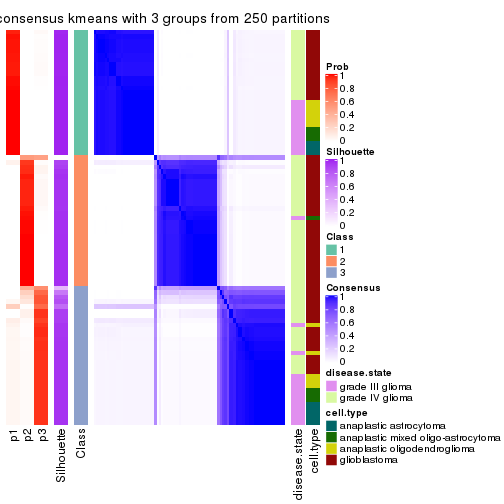</p>

</div>
<div id='tab-CV-kmeans-consensus-heatmap-3'>
<pre><code class="r">consensus_heatmap(res, k = 4)
</code></pre>

<p></p>

</div>
<div id='tab-CV-kmeans-consensus-heatmap-4'>
<pre><code class="r">consensus_heatmap(res, k = 5)
</code></pre>

<p></p>

</div>
<div id='tab-CV-kmeans-consensus-heatmap-5'>
<pre><code class="r">consensus_heatmap(res, k = 6)
</code></pre>

<p></p>

</div>
</div>

Heatmaps for the membership of samples in all partitions to see how consistent they are:


<script>
$( function() {
	$( '#tabs-CV-kmeans-membership-heatmap' ).tabs();
} );
</script>
<div id='tabs-CV-kmeans-membership-heatmap'>
<ul>
<li><a href='#tab-CV-kmeans-membership-heatmap-1'>k = 2</a></li>
<li><a href='#tab-CV-kmeans-membership-heatmap-2'>k = 3</a></li>
<li><a href='#tab-CV-kmeans-membership-heatmap-3'>k = 4</a></li>
<li><a href='#tab-CV-kmeans-membership-heatmap-4'>k = 5</a></li>
<li><a href='#tab-CV-kmeans-membership-heatmap-5'>k = 6</a></li>
</ul>
<div id='tab-CV-kmeans-membership-heatmap-1'>
<pre><code class="r">membership_heatmap(res, k = 2)
</code></pre>

<p></p>

</div>
<div id='tab-CV-kmeans-membership-heatmap-2'>
<pre><code class="r">membership_heatmap(res, k = 3)
</code></pre>

<p></p>

</div>
<div id='tab-CV-kmeans-membership-heatmap-3'>
<pre><code class="r">membership_heatmap(res, k = 4)
</code></pre>

<p></p>

</div>
<div id='tab-CV-kmeans-membership-heatmap-4'>
<pre><code class="r">membership_heatmap(res, k = 5)
</code></pre>

<p></p>

</div>
<div id='tab-CV-kmeans-membership-heatmap-5'>
<pre><code class="r">membership_heatmap(res, k = 6)
</code></pre>

<p></p>

</div>
</div>

As soon as we have had the classes for columns, we can look for signatures
which are significantly different between classes which can be candidate marks
for certain classes. Following are the heatmaps for signatures.


Signature heatmaps where rows are scaled:


<script>
$( function() {
	$( '#tabs-CV-kmeans-get-signatures' ).tabs();
} );
</script>
<div id='tabs-CV-kmeans-get-signatures'>
<ul>
<li><a href='#tab-CV-kmeans-get-signatures-1'>k = 2</a></li>
<li><a href='#tab-CV-kmeans-get-signatures-2'>k = 3</a></li>
<li><a href='#tab-CV-kmeans-get-signatures-3'>k = 4</a></li>
<li><a href='#tab-CV-kmeans-get-signatures-4'>k = 5</a></li>
<li><a href='#tab-CV-kmeans-get-signatures-5'>k = 6</a></li>
</ul>
<div id='tab-CV-kmeans-get-signatures-1'>
<pre><code class="r">get_signatures(res, k = 2)
</code></pre>

<p></p>

</div>
<div id='tab-CV-kmeans-get-signatures-2'>
<pre><code class="r">get_signatures(res, k = 3)
</code></pre>

<p></p>

</div>
<div id='tab-CV-kmeans-get-signatures-3'>
<pre><code class="r">get_signatures(res, k = 4)
</code></pre>

<p></p>

</div>
<div id='tab-CV-kmeans-get-signatures-4'>
<pre><code class="r">get_signatures(res, k = 5)
</code></pre>

<p></p>

</div>
<div id='tab-CV-kmeans-get-signatures-5'>
<pre><code class="r">get_signatures(res, k = 6)
</code></pre>

<p></p>

</div>
</div>


Signature heatmaps where rows are not scaled:


<script>
$( function() {
	$( '#tabs-CV-kmeans-get-signatures-no-scale' ).tabs();
} );
</script>
<div id='tabs-CV-kmeans-get-signatures-no-scale'>
<ul>
<li><a href='#tab-CV-kmeans-get-signatures-no-scale-1'>k = 2</a></li>
<li><a href='#tab-CV-kmeans-get-signatures-no-scale-2'>k = 3</a></li>
<li><a href='#tab-CV-kmeans-get-signatures-no-scale-3'>k = 4</a></li>
<li><a href='#tab-CV-kmeans-get-signatures-no-scale-4'>k = 5</a></li>
<li><a href='#tab-CV-kmeans-get-signatures-no-scale-5'>k = 6</a></li>
</ul>
<div id='tab-CV-kmeans-get-signatures-no-scale-1'>
<pre><code class="r">get_signatures(res, k = 2, scale_rows = FALSE)
</code></pre>

<p></p>

</div>
<div id='tab-CV-kmeans-get-signatures-no-scale-2'>
<pre><code class="r">get_signatures(res, k = 3, scale_rows = FALSE)
</code></pre>

<p></p>

</div>
<div id='tab-CV-kmeans-get-signatures-no-scale-3'>
<pre><code class="r">get_signatures(res, k = 4, scale_rows = FALSE)
</code></pre>

<p></p>

</div>
<div id='tab-CV-kmeans-get-signatures-no-scale-4'>
<pre><code class="r">get_signatures(res, k = 5, scale_rows = FALSE)
</code></pre>

<p></p>

</div>
<div id='tab-CV-kmeans-get-signatures-no-scale-5'>
<pre><code class="r">get_signatures(res, k = 6, scale_rows = FALSE)
</code></pre>

<p></p>

</div>
</div>


Compare the overlap of signatures from different k:

```r
compare_signatures(res)
```


`get_signature()` returns a data frame invisibly. TO get the list of signatures, the function
call should be assigned to a variable explicitly. In following code, if `plot` argument is set
to `FALSE`, no heatmap is plotted while only the differential analysis is performed.

```r
# code only for demonstration
tb = get_signature(res, k = ..., plot = FALSE)
```

An example of the output of `tb` is:

```
#>   which_row         fdr    mean_1    mean_2 scaled_mean_1 scaled_mean_2 km
#> 1        38 0.042760348  8.373488  9.131774    -0.5533452     0.5164555  1
#> 2        40 0.018707592  7.106213  8.469186    -0.6173731     0.5762149  1
#> 3        55 0.019134737 10.221463 11.207825    -0.6159697     0.5749050  1
#> 4        59 0.006059896  5.921854  7.869574    -0.6899429     0.6439467  1
#> 5        60 0.018055526  8.928898 10.211722    -0.6204761     0.5791110  1
#> 6        98 0.009384629 15.714769 14.887706     0.6635654    -0.6193277  2
...
```

The columns in `tb` are:

1. `which_row`: row indices corresponding to the input matrix.
2. `fdr`: FDR for the differential test. 
3. `mean_x`: The mean value in group x.
4. `scaled_mean_x`: The mean value in group x after rows are scaled.
5. `km`: Row groups if k-means clustering is applied to rows.


UMAP plot which shows how samples are separated.


<script>
$( function() {
	$( '#tabs-CV-kmeans-dimension-reduction' ).tabs();
} );
</script>
<div id='tabs-CV-kmeans-dimension-reduction'>
<ul>
<li><a href='#tab-CV-kmeans-dimension-reduction-1'>k = 2</a></li>
<li><a href='#tab-CV-kmeans-dimension-reduction-2'>k = 3</a></li>
<li><a href='#tab-CV-kmeans-dimension-reduction-3'>k = 4</a></li>
<li><a href='#tab-CV-kmeans-dimension-reduction-4'>k = 5</a></li>
<li><a href='#tab-CV-kmeans-dimension-reduction-5'>k = 6</a></li>
</ul>
<div id='tab-CV-kmeans-dimension-reduction-1'>
<pre><code class="r">dimension_reduction(res, k = 2, method = &quot;UMAP&quot;)
</code></pre>

<p></p>

</div>
<div id='tab-CV-kmeans-dimension-reduction-2'>
<pre><code class="r">dimension_reduction(res, k = 3, method = &quot;UMAP&quot;)
</code></pre>

<p></p>

</div>
<div id='tab-CV-kmeans-dimension-reduction-3'>
<pre><code class="r">dimension_reduction(res, k = 4, method = &quot;UMAP&quot;)
</code></pre>

<p></p>

</div>
<div id='tab-CV-kmeans-dimension-reduction-4'>
<pre><code class="r">dimension_reduction(res, k = 5, method = &quot;UMAP&quot;)
</code></pre>

<p></p>

</div>
<div id='tab-CV-kmeans-dimension-reduction-5'>
<pre><code class="r">dimension_reduction(res, k = 6, method = &quot;UMAP&quot;)
</code></pre>

<p></p>

</div>
</div>


Following heatmap shows how subgroups are split when increasing `k`:

```r
collect_classes(res)
```


Test correlation between subgroups and known annotations. If the known
annotation is numeric, one-way ANOVA test is applied, and if the known
annotation is discrete, chi-squared contingency table test is applied.

```r
test_to_known_factors(res)
```

```
#>            n disease.state(p) cell.type(p) k
#> CV:kmeans 60         3.72e-04     0.001303 2
#> CV:kmeans 83         8.28e-04     0.016801 3
#> CV:kmeans 71         8.08e-06     0.000365 4
#> CV:kmeans 80         1.13e-06     0.000638 5
#> CV:kmeans 74         5.67e-08     0.000144 6
```


If matrix rows can be associated to genes, consider to use `GO_Enrichment(res,
...)` to perform function enrichment for the signature genes.


 

---------------------------------------------------


### CV:skmeans**


The object with results only for a single top-value method and a single partition method 
can be extracted as:

```r
res = res_list["CV", "skmeans"]
# you can also extract it by
# res = res_list["CV:skmeans"]
```

A summary of `res` and all the functions that can be applied to it:

```r
res
```

```
#> A 'ConsensusPartition' object with k = 2, 3, 4, 5, 6.
#>   On a matrix with 21512 rows and 85 columns.
#>   Top rows (1000, 2000, 3000, 4000, 5000) are extracted by 'CV' method.
#>   Subgroups are detected by 'skmeans' method.
#>   Performed in total 1250 partitions by row resampling.
#>   Best k for subgroups seems to be 3.
#> 
#> Following methods can be applied to this 'ConsensusPartition' object:
#>  [1] "cola_report"             "collect_classes"         "collect_plots"          
#>  [4] "collect_stats"           "colnames"                "compare_signatures"     
#>  [7] "consensus_heatmap"       "dimension_reduction"     "functional_enrichment"  
#> [10] "get_anno_col"            "get_anno"                "get_classes"            
#> [13] "get_consensus"           "get_matrix"              "get_membership"         
#> [16] "get_param"               "get_signatures"          "get_stats"              
#> [19] "is_best_k"               "is_stable_k"             "membership_heatmap"     
#> [22] "ncol"                    "nrow"                    "plot_ecdf"              
#> [25] "rownames"                "select_partition_number" "show"                   
#> [28] "suggest_best_k"          "test_to_known_factors"
```

`collect_plots()` function collects all the plots made from `res` for all `k` (number of partitions)
into one single page to provide an easy and fast comparison between different `k`.

```r
collect_plots(res)
```


The plots are:

- The first row: a plot of the ECDF (Empirical cumulative distribution
  function) curves of the consensus matrix for each `k` and the heatmap of
  predicted classes for each `k`.
- The second row: heatmaps of the consensus matrix for each `k`.
- The third row: heatmaps of the membership matrix for each `k`.
- The fouth row: heatmaps of the signatures for each `k`.

All the plots in panels can be made by individual functions and they are
plotted later in this section.

`select_partition_number()` produces several plots showing different
statistics for choosing "optimized" `k`. There are following statistics:

- ECDF curves of the consensus matrix for each `k`;
- 1-PAC. [The PAC
  score](https://en.wikipedia.org/wiki/Consensus_clustering#Over-interpretation_potential_of_consensus_clustering)
  measures the proportion of the ambiguous subgrouping.
- Mean silhouette score.
- Concordance. The mean probability of fiting the consensus class ids in all
  partitions.
- Area increased. Denote $A_k$ as the area under the ECDF curve for current
  `k`, the area increased is defined as $A_k - A_{k-1}$.
- Rand index. The percent of pairs of samples that are both in a same cluster
  or both are not in a same cluster in the partition of k and k-1.
- Jaccard index. The ratio of pairs of samples are both in a same cluster in
  the partition of k and k-1 and the pairs of samples are both in a same
  cluster in the partition k or k-1.

The detailed explanations of these statistics can be found in [the cola
vignette](http://bioconductor.org/packages/devel/bioc/vignettes/cola/inst/doc/cola.html#toc_13).

Generally speaking, lower PAC score, higher mean silhouette score or higher
concordance corresponds to better partition. Rand index and Jaccard index
measure how similar the current partition is compared to partition with `k-1`.
If they are too similar, we won't accept `k` is better than `k-1`.

```r
select_partition_number(res)
```


The numeric values for all these statistics can be obtained by `get_stats()`.

```r
get_stats(res)
```

```
#>   k 1-PAC mean_silhouette concordance area_increased  Rand Jaccard
#> 2 2 0.611           0.731       0.898         0.4977 0.497   0.497
#> 3 3 0.951           0.940       0.974         0.3476 0.766   0.559
#> 4 4 0.811           0.818       0.900         0.0938 0.935   0.806
#> 5 5 0.686           0.648       0.796         0.0646 0.977   0.917
#> 6 6 0.658           0.464       0.660         0.0424 0.934   0.756
```

`suggest_best_k()` suggests the best $k$ based on these statistics. The rules are as follows:

- All $k$ with Jaccard index larger than 0.95 are removed because the increase of
  the partition number does not provides enough extra information. If all $k$ are removed,
  the best $k$ is assigned by `NA`.
- For $k$ with 1-PAC larger than 0.9, the maximal $k$ is taken as the "best k". Other $k$ is called "optional k".
- If it does not fit the second rule. The $k$ with the highest vote of highest
  1-PAC, mean silhouette and concordance is taken as the "best k".

```r
suggest_best_k(res)
```

```
#> [1] 3
```


Following shows the table of the partitions (You need to click the **show/hide
code output** link to see it). The membership matrix (columns with name `p*`)
is inferred by
[`clue::cl_consensus()`](https://www.rdocumentation.org/link/cl_consensus?package=clue)
function with the `SE` method. Basically the value in the membership matrix
represents the probability to belong to a certain group. The finall class
label for an item is determined with the group with highest probability it
belongs to.

In `get_classes()` function, the entropy is calculated from the membership
matrix and the silhouette score is calculated from the consensus matrix.


<script>
$( function() {
	$( '#tabs-CV-skmeans-get-classes' ).tabs();
} );
</script>
<div id='tabs-CV-skmeans-get-classes'>
<ul>
<li><a href='#tab-CV-skmeans-get-classes-1'>k = 2</a></li>
<li><a href='#tab-CV-skmeans-get-classes-2'>k = 3</a></li>
<li><a href='#tab-CV-skmeans-get-classes-3'>k = 4</a></li>
<li><a href='#tab-CV-skmeans-get-classes-4'>k = 5</a></li>
<li><a href='#tab-CV-skmeans-get-classes-5'>k = 6</a></li>
</ul>

<div id='tab-CV-skmeans-get-classes-1'>
<p><a id='tab-CV-skmeans-get-classes-1-a' style='color:#0366d6' href='#'>show/hide code output</a></p>
<pre><code class="r">cbind(get_classes(res, k = 2), get_membership(res, k = 2))
</code></pre>

<pre><code>#&gt;          class entropy silhouette    p1    p2
#&gt; GSM99497     1  1.0000     0.1551 0.504 0.496
#&gt; GSM99503     1  0.0000     0.8491 1.000 0.000
#&gt; GSM99505     1  0.0000     0.8491 1.000 0.000
#&gt; GSM99507     1  0.9996     0.1799 0.512 0.488
#&gt; GSM99567     1  1.0000     0.1417 0.500 0.500
#&gt; GSM99575     1  0.0000     0.8491 1.000 0.000
#&gt; GSM99593     2  0.6438     0.7146 0.164 0.836
#&gt; GSM99595     1  1.0000     0.1551 0.504 0.496
#&gt; GSM99469     1  0.0000     0.8491 1.000 0.000
#&gt; GSM99499     1  0.0000     0.8491 1.000 0.000
#&gt; GSM99501     1  0.0000     0.8491 1.000 0.000
#&gt; GSM99509     1  0.9754     0.3756 0.592 0.408
#&gt; GSM99569     1  0.9580     0.4279 0.620 0.380
#&gt; GSM99597     1  0.9323     0.4825 0.652 0.348
#&gt; GSM99601     2  0.0000     0.9021 0.000 1.000
#&gt; GSM99459     1  0.0000     0.8491 1.000 0.000
#&gt; GSM99461     1  0.0000     0.8491 1.000 0.000
#&gt; GSM99511     1  0.9977     0.2266 0.528 0.472
#&gt; GSM99513     2  1.0000    -0.1822 0.500 0.500
#&gt; GSM99515     1  0.9977     0.2265 0.528 0.472
#&gt; GSM99517     1  0.0000     0.8491 1.000 0.000
#&gt; GSM99519     1  0.0000     0.8491 1.000 0.000
#&gt; GSM99521     1  0.9933     0.2783 0.548 0.452
#&gt; GSM99523     1  0.0000     0.8491 1.000 0.000
#&gt; GSM99571     1  0.0000     0.8491 1.000 0.000
#&gt; GSM99599     1  0.0000     0.8491 1.000 0.000
#&gt; GSM99433     2  0.0000     0.9021 0.000 1.000
#&gt; GSM99435     2  0.9427     0.3076 0.360 0.640
#&gt; GSM99437     2  0.0000     0.9021 0.000 1.000
#&gt; GSM99439     2  0.0000     0.9021 0.000 1.000
#&gt; GSM99441     1  0.0000     0.8491 1.000 0.000
#&gt; GSM99443     2  0.0000     0.9021 0.000 1.000
#&gt; GSM99445     2  0.0000     0.9021 0.000 1.000
#&gt; GSM99447     2  0.0000     0.9021 0.000 1.000
#&gt; GSM99449     2  0.0000     0.9021 0.000 1.000
#&gt; GSM99451     1  0.5059     0.7704 0.888 0.112
#&gt; GSM99453     1  0.0000     0.8491 1.000 0.000
#&gt; GSM99455     1  0.0000     0.8491 1.000 0.000
#&gt; GSM99457     1  0.0000     0.8491 1.000 0.000
#&gt; GSM99463     2  0.0000     0.9021 0.000 1.000
#&gt; GSM99465     1  0.0000     0.8491 1.000 0.000
#&gt; GSM99467     2  0.0000     0.9021 0.000 1.000
#&gt; GSM99471     1  0.0000     0.8491 1.000 0.000
#&gt; GSM99473     1  0.0000     0.8491 1.000 0.000
#&gt; GSM99475     1  0.5946     0.7445 0.856 0.144
#&gt; GSM99477     2  0.0000     0.9021 0.000 1.000
#&gt; GSM99479     2  0.0000     0.9021 0.000 1.000
#&gt; GSM99481     1  0.0000     0.8491 1.000 0.000
#&gt; GSM99483     1  0.0000     0.8491 1.000 0.000
#&gt; GSM99485     2  0.0000     0.9021 0.000 1.000
#&gt; GSM99487     2  0.0000     0.9021 0.000 1.000
#&gt; GSM99489     2  0.0000     0.9021 0.000 1.000
#&gt; GSM99491     2  0.0000     0.9021 0.000 1.000
#&gt; GSM99493     1  0.0000     0.8491 1.000 0.000
#&gt; GSM99495     2  0.0000     0.9021 0.000 1.000
#&gt; GSM99525     1  0.0000     0.8491 1.000 0.000
#&gt; GSM99527     1  0.8713     0.5172 0.708 0.292
#&gt; GSM99529     2  0.0672     0.8950 0.008 0.992
#&gt; GSM99531     1  0.0000     0.8491 1.000 0.000
#&gt; GSM99533     1  0.0000     0.8491 1.000 0.000
#&gt; GSM99535     2  0.9732     0.2753 0.404 0.596
#&gt; GSM99537     1  0.0000     0.8491 1.000 0.000
#&gt; GSM99539     2  0.0000     0.9021 0.000 1.000
#&gt; GSM99541     1  0.0000     0.8491 1.000 0.000
#&gt; GSM99543     2  0.9754     0.2663 0.408 0.592
#&gt; GSM99545     2  0.0000     0.9021 0.000 1.000
#&gt; GSM99547     1  0.7950     0.5875 0.760 0.240
#&gt; GSM99549     2  0.0000     0.9021 0.000 1.000
#&gt; GSM99551     1  0.0000     0.8491 1.000 0.000
#&gt; GSM99553     2  0.8813     0.4651 0.300 0.700
#&gt; GSM99555     2  0.0000     0.9021 0.000 1.000
#&gt; GSM99557     2  0.0000     0.9021 0.000 1.000
#&gt; GSM99559     2  0.0000     0.9021 0.000 1.000
#&gt; GSM99561     2  0.0000     0.9021 0.000 1.000
#&gt; GSM99563     1  0.9775     0.3677 0.588 0.412
#&gt; GSM99565     2  0.0000     0.9021 0.000 1.000
#&gt; GSM99573     2  0.0000     0.9021 0.000 1.000
#&gt; GSM99577     1  0.0000     0.8491 1.000 0.000
#&gt; GSM99579     2  0.0000     0.9021 0.000 1.000
#&gt; GSM99581     2  0.9896     0.0403 0.440 0.560
#&gt; GSM99583     2  0.9608     0.3263 0.384 0.616
#&gt; GSM99585     2  0.0000     0.9021 0.000 1.000
#&gt; GSM99587     1  0.0000     0.8491 1.000 0.000
#&gt; GSM99589     2  0.0000     0.9021 0.000 1.000
#&gt; GSM99591     2  0.0000     0.9021 0.000 1.000
</code></pre>

<script>
$('#tab-CV-skmeans-get-classes-1-a').parent().next().next().hide();
$('#tab-CV-skmeans-get-classes-1-a').click(function(){
  $('#tab-CV-skmeans-get-classes-1-a').parent().next().next().toggle();
  return(false);
});
</script>
</div>

<div id='tab-CV-skmeans-get-classes-2'>
<p><a id='tab-CV-skmeans-get-classes-2-a' style='color:#0366d6' href='#'>show/hide code output</a></p>
<pre><code class="r">cbind(get_classes(res, k = 3), get_membership(res, k = 3))
</code></pre>

<pre><code>#&gt;          class entropy silhouette    p1    p2    p3
#&gt; GSM99497     3  0.0000      0.974 0.000 0.000 1.000
#&gt; GSM99503     1  0.0000      0.984 1.000 0.000 0.000
#&gt; GSM99505     1  0.0000      0.984 1.000 0.000 0.000
#&gt; GSM99507     3  0.0000      0.974 0.000 0.000 1.000
#&gt; GSM99567     3  0.0000      0.974 0.000 0.000 1.000
#&gt; GSM99575     1  0.0000      0.984 1.000 0.000 0.000
#&gt; GSM99593     3  0.0000      0.974 0.000 0.000 1.000
#&gt; GSM99595     3  0.0000      0.974 0.000 0.000 1.000
#&gt; GSM99469     1  0.0000      0.984 1.000 0.000 0.000
#&gt; GSM99499     1  0.0000      0.984 1.000 0.000 0.000
#&gt; GSM99501     1  0.0000      0.984 1.000 0.000 0.000
#&gt; GSM99509     3  0.0000      0.974 0.000 0.000 1.000
#&gt; GSM99569     3  0.0000      0.974 0.000 0.000 1.000
#&gt; GSM99597     3  0.0000      0.974 0.000 0.000 1.000
#&gt; GSM99601     2  0.0000      0.960 0.000 1.000 0.000
#&gt; GSM99459     1  0.0000      0.984 1.000 0.000 0.000
#&gt; GSM99461     1  0.0000      0.984 1.000 0.000 0.000
#&gt; GSM99511     3  0.0000      0.974 0.000 0.000 1.000
#&gt; GSM99513     3  0.0000      0.974 0.000 0.000 1.000
#&gt; GSM99515     3  0.0000      0.974 0.000 0.000 1.000
#&gt; GSM99517     1  0.0000      0.984 1.000 0.000 0.000
#&gt; GSM99519     1  0.0000      0.984 1.000 0.000 0.000
#&gt; GSM99521     3  0.0000      0.974 0.000 0.000 1.000
#&gt; GSM99523     3  0.0000      0.974 0.000 0.000 1.000
#&gt; GSM99571     1  0.0000      0.984 1.000 0.000 0.000
#&gt; GSM99599     1  0.0000      0.984 1.000 0.000 0.000
#&gt; GSM99433     2  0.0000      0.960 0.000 1.000 0.000
#&gt; GSM99435     3  0.0000      0.974 0.000 0.000 1.000
#&gt; GSM99437     2  0.0000      0.960 0.000 1.000 0.000
#&gt; GSM99439     2  0.0000      0.960 0.000 1.000 0.000
#&gt; GSM99441     1  0.0000      0.984 1.000 0.000 0.000
#&gt; GSM99443     2  0.0000      0.960 0.000 1.000 0.000
#&gt; GSM99445     2  0.0000      0.960 0.000 1.000 0.000
#&gt; GSM99447     2  0.0000      0.960 0.000 1.000 0.000
#&gt; GSM99449     3  0.0000      0.974 0.000 0.000 1.000
#&gt; GSM99451     3  0.0000      0.974 0.000 0.000 1.000
#&gt; GSM99453     1  0.0000      0.984 1.000 0.000 0.000
#&gt; GSM99455     1  0.0000      0.984 1.000 0.000 0.000
#&gt; GSM99457     1  0.0000      0.984 1.000 0.000 0.000
#&gt; GSM99463     2  0.0000      0.960 0.000 1.000 0.000
#&gt; GSM99465     1  0.4555      0.746 0.800 0.000 0.200
#&gt; GSM99467     2  0.0000      0.960 0.000 1.000 0.000
#&gt; GSM99471     1  0.0000      0.984 1.000 0.000 0.000
#&gt; GSM99473     1  0.0000      0.984 1.000 0.000 0.000
#&gt; GSM99475     3  0.0000      0.974 0.000 0.000 1.000
#&gt; GSM99477     2  0.1289      0.934 0.000 0.968 0.032
#&gt; GSM99479     2  0.0000      0.960 0.000 1.000 0.000
#&gt; GSM99481     1  0.0000      0.984 1.000 0.000 0.000
#&gt; GSM99483     1  0.0000      0.984 1.000 0.000 0.000
#&gt; GSM99485     2  0.0000      0.960 0.000 1.000 0.000
#&gt; GSM99487     2  0.0000      0.960 0.000 1.000 0.000
#&gt; GSM99489     2  0.0000      0.960 0.000 1.000 0.000
#&gt; GSM99491     2  0.0000      0.960 0.000 1.000 0.000
#&gt; GSM99493     1  0.0000      0.984 1.000 0.000 0.000
#&gt; GSM99495     2  0.0000      0.960 0.000 1.000 0.000
#&gt; GSM99525     1  0.0000      0.984 1.000 0.000 0.000
#&gt; GSM99527     3  0.6841      0.683 0.200 0.076 0.724
#&gt; GSM99529     2  0.0592      0.951 0.000 0.988 0.012
#&gt; GSM99531     3  0.0747      0.962 0.016 0.000 0.984
#&gt; GSM99533     3  0.5397      0.613 0.280 0.000 0.720
#&gt; GSM99535     2  0.4291      0.767 0.180 0.820 0.000
#&gt; GSM99537     1  0.0000      0.984 1.000 0.000 0.000
#&gt; GSM99539     2  0.5138      0.662 0.000 0.748 0.252
#&gt; GSM99541     1  0.0000      0.984 1.000 0.000 0.000
#&gt; GSM99543     2  0.0000      0.960 0.000 1.000 0.000
#&gt; GSM99545     2  0.5016      0.680 0.000 0.760 0.240
#&gt; GSM99547     1  0.6388      0.705 0.752 0.064 0.184
#&gt; GSM99549     2  0.0000      0.960 0.000 1.000 0.000
#&gt; GSM99551     1  0.0000      0.984 1.000 0.000 0.000
#&gt; GSM99553     3  0.0000      0.974 0.000 0.000 1.000
#&gt; GSM99555     2  0.0000      0.960 0.000 1.000 0.000
#&gt; GSM99557     2  0.0000      0.960 0.000 1.000 0.000
#&gt; GSM99559     3  0.1163      0.950 0.000 0.028 0.972
#&gt; GSM99561     2  0.0000      0.960 0.000 1.000 0.000
#&gt; GSM99563     3  0.0000      0.974 0.000 0.000 1.000
#&gt; GSM99565     2  0.0000      0.960 0.000 1.000 0.000
#&gt; GSM99573     2  0.0000      0.960 0.000 1.000 0.000
#&gt; GSM99577     1  0.0000      0.984 1.000 0.000 0.000
#&gt; GSM99579     2  0.0000      0.960 0.000 1.000 0.000
#&gt; GSM99581     3  0.0000      0.974 0.000 0.000 1.000
#&gt; GSM99583     2  0.8211      0.204 0.404 0.520 0.076
#&gt; GSM99585     2  0.0000      0.960 0.000 1.000 0.000
#&gt; GSM99587     1  0.0000      0.984 1.000 0.000 0.000
#&gt; GSM99589     2  0.0000      0.960 0.000 1.000 0.000
#&gt; GSM99591     2  0.0000      0.960 0.000 1.000 0.000
</code></pre>

<script>
$('#tab-CV-skmeans-get-classes-2-a').parent().next().next().hide();
$('#tab-CV-skmeans-get-classes-2-a').click(function(){
  $('#tab-CV-skmeans-get-classes-2-a').parent().next().next().toggle();
  return(false);
});
</script>
</div>

<div id='tab-CV-skmeans-get-classes-3'>
<p><a id='tab-CV-skmeans-get-classes-3-a' style='color:#0366d6' href='#'>show/hide code output</a></p>
<pre><code class="r">cbind(get_classes(res, k = 4), get_membership(res, k = 4))
</code></pre>

<pre><code>#&gt;          class entropy silhouette    p1    p2    p3    p4
#&gt; GSM99497     3  0.0000      0.948 0.000 0.000 1.000 0.000
#&gt; GSM99503     1  0.0188      0.936 0.996 0.000 0.000 0.004
#&gt; GSM99505     1  0.2401      0.856 0.904 0.000 0.092 0.004
#&gt; GSM99507     3  0.0000      0.948 0.000 0.000 1.000 0.000
#&gt; GSM99567     3  0.0000      0.948 0.000 0.000 1.000 0.000
#&gt; GSM99575     1  0.0188      0.936 0.996 0.000 0.000 0.004
#&gt; GSM99593     3  0.0336      0.948 0.000 0.000 0.992 0.008
#&gt; GSM99595     3  0.0336      0.948 0.000 0.000 0.992 0.008
#&gt; GSM99469     1  0.0188      0.936 0.996 0.000 0.000 0.004
#&gt; GSM99499     1  0.0188      0.936 0.996 0.000 0.000 0.004
#&gt; GSM99501     1  0.0188      0.936 0.996 0.000 0.000 0.004
#&gt; GSM99509     3  0.0188      0.948 0.000 0.000 0.996 0.004
#&gt; GSM99569     3  0.0376      0.948 0.004 0.000 0.992 0.004
#&gt; GSM99597     3  0.1824      0.907 0.004 0.000 0.936 0.060
#&gt; GSM99601     2  0.0817      0.877 0.000 0.976 0.000 0.024
#&gt; GSM99459     1  0.2149      0.891 0.912 0.000 0.000 0.088
#&gt; GSM99461     1  0.2589      0.867 0.884 0.000 0.000 0.116
#&gt; GSM99511     3  0.1637      0.912 0.000 0.000 0.940 0.060
#&gt; GSM99513     3  0.0469      0.947 0.000 0.000 0.988 0.012
#&gt; GSM99515     3  0.0000      0.948 0.000 0.000 1.000 0.000
#&gt; GSM99517     1  0.0188      0.936 0.996 0.000 0.000 0.004
#&gt; GSM99519     1  0.2149      0.892 0.912 0.000 0.000 0.088
#&gt; GSM99521     3  0.2281      0.869 0.000 0.000 0.904 0.096
#&gt; GSM99523     3  0.0657      0.944 0.004 0.000 0.984 0.012
#&gt; GSM99571     1  0.0336      0.936 0.992 0.000 0.000 0.008
#&gt; GSM99599     1  0.0000      0.936 1.000 0.000 0.000 0.000
#&gt; GSM99433     2  0.4594      0.673 0.000 0.712 0.008 0.280
#&gt; GSM99435     3  0.4907      0.202 0.000 0.000 0.580 0.420
#&gt; GSM99437     2  0.1389      0.873 0.000 0.952 0.000 0.048
#&gt; GSM99439     2  0.1792      0.862 0.000 0.932 0.000 0.068
#&gt; GSM99441     1  0.0000      0.936 1.000 0.000 0.000 0.000
#&gt; GSM99443     2  0.0921      0.876 0.000 0.972 0.000 0.028
#&gt; GSM99445     2  0.0469      0.876 0.000 0.988 0.000 0.012
#&gt; GSM99447     2  0.2081      0.865 0.000 0.916 0.000 0.084
#&gt; GSM99449     3  0.0336      0.948 0.000 0.000 0.992 0.008
#&gt; GSM99451     4  0.4564      0.466 0.000 0.000 0.328 0.672
#&gt; GSM99453     1  0.1118      0.931 0.964 0.000 0.000 0.036
#&gt; GSM99455     1  0.1211      0.930 0.960 0.000 0.000 0.040
#&gt; GSM99457     1  0.1867      0.918 0.928 0.000 0.000 0.072
#&gt; GSM99463     2  0.1474      0.868 0.000 0.948 0.000 0.052
#&gt; GSM99465     4  0.6611      0.357 0.356 0.004 0.080 0.560
#&gt; GSM99467     2  0.1940      0.860 0.000 0.924 0.000 0.076
#&gt; GSM99471     1  0.1302      0.931 0.956 0.000 0.000 0.044
#&gt; GSM99473     1  0.0336      0.935 0.992 0.000 0.000 0.008
#&gt; GSM99475     4  0.3052      0.693 0.004 0.000 0.136 0.860
#&gt; GSM99477     2  0.5770      0.631 0.000 0.712 0.148 0.140
#&gt; GSM99479     2  0.2197      0.857 0.000 0.916 0.004 0.080
#&gt; GSM99481     1  0.0000      0.936 1.000 0.000 0.000 0.000
#&gt; GSM99483     1  0.1022      0.932 0.968 0.000 0.000 0.032
#&gt; GSM99485     2  0.1302      0.870 0.000 0.956 0.000 0.044
#&gt; GSM99487     2  0.1474      0.872 0.000 0.948 0.000 0.052
#&gt; GSM99489     2  0.1118      0.872 0.000 0.964 0.000 0.036
#&gt; GSM99491     2  0.0336      0.876 0.000 0.992 0.000 0.008
#&gt; GSM99493     1  0.1302      0.929 0.956 0.000 0.000 0.044
#&gt; GSM99495     2  0.1389      0.869 0.000 0.952 0.000 0.048
#&gt; GSM99525     1  0.0469      0.935 0.988 0.000 0.000 0.012
#&gt; GSM99527     4  0.2807      0.718 0.020 0.024 0.044 0.912
#&gt; GSM99529     2  0.5879      0.365 0.008 0.596 0.028 0.368
#&gt; GSM99531     4  0.5022      0.634 0.044 0.000 0.220 0.736
#&gt; GSM99533     4  0.3464      0.714 0.056 0.000 0.076 0.868
#&gt; GSM99535     2  0.5495      0.612 0.176 0.728 0.000 0.096
#&gt; GSM99537     1  0.1474      0.928 0.948 0.000 0.000 0.052
#&gt; GSM99539     4  0.5530      0.370 0.000 0.336 0.032 0.632
#&gt; GSM99541     1  0.3873      0.745 0.772 0.000 0.000 0.228
#&gt; GSM99543     2  0.3495      0.809 0.016 0.844 0.000 0.140
#&gt; GSM99545     4  0.5228      0.423 0.000 0.312 0.024 0.664
#&gt; GSM99547     4  0.6933      0.652 0.180 0.072 0.076 0.672
#&gt; GSM99549     2  0.3311      0.796 0.000 0.828 0.000 0.172
#&gt; GSM99551     1  0.5212      0.304 0.572 0.008 0.000 0.420
#&gt; GSM99553     3  0.0779      0.942 0.000 0.004 0.980 0.016
#&gt; GSM99555     2  0.1022      0.877 0.000 0.968 0.000 0.032
#&gt; GSM99557     2  0.0817      0.874 0.000 0.976 0.000 0.024
#&gt; GSM99559     3  0.2124      0.890 0.000 0.028 0.932 0.040
#&gt; GSM99561     2  0.3444      0.787 0.000 0.816 0.000 0.184
#&gt; GSM99563     3  0.0592      0.946 0.000 0.000 0.984 0.016
#&gt; GSM99565     2  0.1474      0.875 0.000 0.948 0.000 0.052
#&gt; GSM99573     2  0.2647      0.841 0.000 0.880 0.000 0.120
#&gt; GSM99577     1  0.3266      0.826 0.832 0.000 0.000 0.168
#&gt; GSM99579     2  0.0921      0.873 0.000 0.972 0.000 0.028
#&gt; GSM99581     3  0.0336      0.948 0.000 0.000 0.992 0.008
#&gt; GSM99583     2  0.9894     -0.279 0.284 0.300 0.200 0.216
#&gt; GSM99585     2  0.3569      0.773 0.000 0.804 0.000 0.196
#&gt; GSM99587     1  0.1389      0.927 0.952 0.000 0.000 0.048
#&gt; GSM99589     2  0.0817      0.877 0.000 0.976 0.000 0.024
#&gt; GSM99591     2  0.0336      0.876 0.000 0.992 0.000 0.008
</code></pre>

<script>
$('#tab-CV-skmeans-get-classes-3-a').parent().next().next().hide();
$('#tab-CV-skmeans-get-classes-3-a').click(function(){
  $('#tab-CV-skmeans-get-classes-3-a').parent().next().next().toggle();
  return(false);
});
</script>
</div>

<div id='tab-CV-skmeans-get-classes-4'>
<p><a id='tab-CV-skmeans-get-classes-4-a' style='color:#0366d6' href='#'>show/hide code output</a></p>
<pre><code class="r">cbind(get_classes(res, k = 5), get_membership(res, k = 5))
</code></pre>

<pre><code>#&gt;          class entropy silhouette    p1    p2    p3    p4    p5
#&gt; GSM99497     3  0.0000     0.9308 0.000 0.000 1.000 0.000 0.000
#&gt; GSM99503     1  0.0162     0.8423 0.996 0.000 0.000 0.000 0.004
#&gt; GSM99505     1  0.3218     0.7565 0.848 0.000 0.124 0.012 0.016
#&gt; GSM99507     3  0.0162     0.9322 0.000 0.000 0.996 0.004 0.000
#&gt; GSM99567     3  0.0324     0.9324 0.000 0.000 0.992 0.004 0.004
#&gt; GSM99575     1  0.0290     0.8418 0.992 0.000 0.000 0.000 0.008
#&gt; GSM99593     3  0.1106     0.9335 0.000 0.000 0.964 0.024 0.012
#&gt; GSM99595     3  0.0451     0.9329 0.000 0.000 0.988 0.008 0.004
#&gt; GSM99469     1  0.1195     0.8391 0.960 0.000 0.000 0.012 0.028
#&gt; GSM99499     1  0.2381     0.8487 0.908 0.000 0.004 0.036 0.052
#&gt; GSM99501     1  0.1483     0.8377 0.952 0.000 0.008 0.012 0.028
#&gt; GSM99509     3  0.0912     0.9339 0.000 0.000 0.972 0.016 0.012
#&gt; GSM99569     3  0.1982     0.9235 0.012 0.000 0.932 0.028 0.028
#&gt; GSM99597     3  0.2784     0.8639 0.004 0.000 0.872 0.108 0.016
#&gt; GSM99601     2  0.1732     0.6456 0.000 0.920 0.000 0.000 0.080
#&gt; GSM99459     1  0.3159     0.7934 0.856 0.000 0.000 0.056 0.088
#&gt; GSM99461     1  0.3697     0.7645 0.820 0.000 0.000 0.080 0.100
#&gt; GSM99511     3  0.2927     0.8775 0.000 0.000 0.868 0.092 0.040
#&gt; GSM99513     3  0.2124     0.9177 0.000 0.000 0.916 0.056 0.028
#&gt; GSM99515     3  0.0162     0.9321 0.000 0.000 0.996 0.004 0.000
#&gt; GSM99517     1  0.0609     0.8412 0.980 0.000 0.000 0.000 0.020
#&gt; GSM99519     1  0.2983     0.7975 0.868 0.000 0.000 0.056 0.076
#&gt; GSM99521     3  0.3081     0.8108 0.000 0.000 0.832 0.156 0.012
#&gt; GSM99523     3  0.2027     0.9128 0.040 0.000 0.928 0.008 0.024
#&gt; GSM99571     1  0.2450     0.8443 0.896 0.000 0.000 0.028 0.076
#&gt; GSM99599     1  0.0162     0.8441 0.996 0.000 0.000 0.000 0.004
#&gt; GSM99433     2  0.6557     0.2334 0.000 0.528 0.012 0.180 0.280
#&gt; GSM99435     4  0.5691     0.0880 0.000 0.000 0.444 0.476 0.080
#&gt; GSM99437     2  0.3395     0.5266 0.000 0.764 0.000 0.000 0.236
#&gt; GSM99439     2  0.3488     0.5963 0.000 0.808 0.000 0.024 0.168
#&gt; GSM99441     1  0.0693     0.8468 0.980 0.000 0.000 0.012 0.008
#&gt; GSM99443     2  0.2773     0.5878 0.000 0.836 0.000 0.000 0.164
#&gt; GSM99445     2  0.1851     0.6284 0.000 0.912 0.000 0.000 0.088
#&gt; GSM99447     2  0.4755     0.5422 0.000 0.696 0.000 0.060 0.244
#&gt; GSM99449     3  0.2370     0.9042 0.000 0.000 0.904 0.040 0.056
#&gt; GSM99451     4  0.4054     0.5344 0.000 0.000 0.224 0.748 0.028
#&gt; GSM99453     1  0.4412     0.8033 0.756 0.000 0.000 0.080 0.164
#&gt; GSM99455     1  0.4457     0.8044 0.756 0.000 0.000 0.092 0.152
#&gt; GSM99457     1  0.5016     0.7724 0.704 0.000 0.000 0.120 0.176
#&gt; GSM99463     2  0.2771     0.6195 0.000 0.860 0.000 0.012 0.128
#&gt; GSM99465     4  0.7822     0.2416 0.336 0.000 0.076 0.376 0.212
#&gt; GSM99467     2  0.4321     0.1981 0.000 0.600 0.000 0.004 0.396
#&gt; GSM99471     1  0.4680     0.8032 0.752 0.008 0.000 0.088 0.152
#&gt; GSM99473     1  0.2017     0.8358 0.912 0.000 0.000 0.008 0.080
#&gt; GSM99475     4  0.1943     0.5998 0.000 0.000 0.056 0.924 0.020
#&gt; GSM99477     5  0.6466    -0.0040 0.000 0.428 0.068 0.044 0.460
#&gt; GSM99479     2  0.4640     0.1042 0.000 0.584 0.000 0.016 0.400
#&gt; GSM99481     1  0.1444     0.8487 0.948 0.000 0.000 0.012 0.040
#&gt; GSM99483     1  0.4317     0.8085 0.764 0.000 0.000 0.076 0.160
#&gt; GSM99485     2  0.3607     0.4980 0.000 0.752 0.000 0.004 0.244
#&gt; GSM99487     2  0.3661     0.4678 0.000 0.724 0.000 0.000 0.276
#&gt; GSM99489     2  0.2124     0.6398 0.000 0.900 0.000 0.004 0.096
#&gt; GSM99491     2  0.2848     0.5993 0.000 0.840 0.000 0.004 0.156
#&gt; GSM99493     1  0.4428     0.8032 0.756 0.000 0.000 0.084 0.160
#&gt; GSM99495     2  0.2886     0.6120 0.000 0.844 0.000 0.008 0.148
#&gt; GSM99525     1  0.2964     0.8362 0.856 0.000 0.000 0.024 0.120
#&gt; GSM99527     4  0.4324     0.5595 0.012 0.016 0.008 0.756 0.208
#&gt; GSM99529     2  0.7524    -0.3361 0.020 0.372 0.012 0.244 0.352
#&gt; GSM99531     4  0.4498     0.5635 0.020 0.000 0.092 0.784 0.104
#&gt; GSM99533     4  0.2149     0.5866 0.028 0.000 0.012 0.924 0.036
#&gt; GSM99535     2  0.6690     0.0759 0.140 0.540 0.000 0.032 0.288
#&gt; GSM99537     1  0.3301     0.8365 0.848 0.000 0.000 0.080 0.072
#&gt; GSM99539     4  0.6883     0.2710 0.000 0.228 0.056 0.564 0.152
#&gt; GSM99541     1  0.5010     0.6701 0.676 0.000 0.000 0.248 0.076
#&gt; GSM99543     2  0.4701     0.4879 0.004 0.700 0.000 0.044 0.252
#&gt; GSM99545     4  0.6271     0.2733 0.000 0.240 0.008 0.572 0.180
#&gt; GSM99547     4  0.7209     0.3708 0.132 0.028 0.020 0.492 0.328
#&gt; GSM99549     2  0.4136     0.5658 0.000 0.764 0.000 0.048 0.188
#&gt; GSM99551     1  0.6964     0.2327 0.388 0.008 0.000 0.352 0.252
#&gt; GSM99553     3  0.1682     0.9187 0.000 0.004 0.940 0.012 0.044
#&gt; GSM99555     2  0.3048     0.6219 0.000 0.820 0.000 0.004 0.176
#&gt; GSM99557     2  0.2020     0.6391 0.000 0.900 0.000 0.000 0.100
#&gt; GSM99559     3  0.3340     0.8336 0.000 0.048 0.860 0.016 0.076
#&gt; GSM99561     2  0.5158     0.5197 0.000 0.676 0.000 0.100 0.224
#&gt; GSM99563     3  0.1725     0.9260 0.000 0.000 0.936 0.044 0.020
#&gt; GSM99565     2  0.3461     0.5617 0.000 0.772 0.000 0.004 0.224
#&gt; GSM99573     2  0.4129     0.5698 0.000 0.756 0.000 0.040 0.204
#&gt; GSM99577     1  0.5904     0.6772 0.600 0.000 0.000 0.196 0.204
#&gt; GSM99579     2  0.3010     0.5637 0.000 0.824 0.000 0.004 0.172
#&gt; GSM99581     3  0.1493     0.9304 0.000 0.000 0.948 0.028 0.024
#&gt; GSM99583     5  0.9474     0.2575 0.168 0.212 0.160 0.104 0.356
#&gt; GSM99585     2  0.5523     0.1397 0.000 0.572 0.000 0.080 0.348
#&gt; GSM99587     1  0.4662     0.7924 0.736 0.000 0.000 0.096 0.168
#&gt; GSM99589     2  0.2536     0.6397 0.000 0.868 0.000 0.004 0.128
#&gt; GSM99591     2  0.2020     0.6263 0.000 0.900 0.000 0.000 0.100
</code></pre>

<script>
$('#tab-CV-skmeans-get-classes-4-a').parent().next().next().hide();
$('#tab-CV-skmeans-get-classes-4-a').click(function(){
  $('#tab-CV-skmeans-get-classes-4-a').parent().next().next().toggle();
  return(false);
});
</script>
</div>

<div id='tab-CV-skmeans-get-classes-5'>
<p><a id='tab-CV-skmeans-get-classes-5-a' style='color:#0366d6' href='#'>show/hide code output</a></p>
<pre><code class="r">cbind(get_classes(res, k = 6), get_membership(res, k = 6))
</code></pre>

<pre><code>#&gt;          class entropy silhouette    p1    p2    p3    p4    p5    p6
#&gt; GSM99497     3  0.0291    0.87152 0.000 0.000 0.992 0.004 0.004 0.000
#&gt; GSM99503     1  0.0458    0.68169 0.984 0.000 0.000 0.000 0.000 0.016
#&gt; GSM99505     1  0.4166    0.50760 0.768 0.000 0.144 0.012 0.004 0.072
#&gt; GSM99507     3  0.0767    0.87224 0.000 0.000 0.976 0.012 0.004 0.008
#&gt; GSM99567     3  0.0551    0.87398 0.000 0.000 0.984 0.004 0.004 0.008
#&gt; GSM99575     1  0.0790    0.67990 0.968 0.000 0.000 0.000 0.000 0.032
#&gt; GSM99593     3  0.1767    0.87519 0.000 0.000 0.932 0.036 0.012 0.020
#&gt; GSM99595     3  0.1148    0.87628 0.000 0.000 0.960 0.020 0.004 0.016
#&gt; GSM99469     1  0.2573    0.65069 0.872 0.000 0.000 0.012 0.012 0.104
#&gt; GSM99499     1  0.3190    0.66107 0.820 0.000 0.004 0.020 0.004 0.152
#&gt; GSM99501     1  0.2400    0.64309 0.872 0.000 0.000 0.008 0.004 0.116
#&gt; GSM99509     3  0.2144    0.87188 0.000 0.000 0.908 0.040 0.004 0.048
#&gt; GSM99569     3  0.3856    0.80866 0.016 0.000 0.796 0.052 0.004 0.132
#&gt; GSM99597     3  0.4002    0.76309 0.004 0.000 0.784 0.104 0.008 0.100
#&gt; GSM99601     2  0.4004   -0.01173 0.000 0.656 0.000 0.004 0.328 0.012
#&gt; GSM99459     1  0.4828    0.44693 0.700 0.000 0.000 0.052 0.044 0.204
#&gt; GSM99461     1  0.5007    0.43482 0.672 0.000 0.000 0.068 0.032 0.228
#&gt; GSM99511     3  0.4157    0.80437 0.000 0.000 0.772 0.124 0.020 0.084
#&gt; GSM99513     3  0.3356    0.85306 0.000 0.000 0.840 0.064 0.024 0.072
#&gt; GSM99515     3  0.0881    0.87312 0.000 0.000 0.972 0.008 0.008 0.012
#&gt; GSM99517     1  0.1364    0.67928 0.944 0.000 0.000 0.004 0.004 0.048
#&gt; GSM99519     1  0.4357    0.52043 0.748 0.000 0.000 0.052 0.032 0.168
#&gt; GSM99521     3  0.4426    0.63365 0.000 0.000 0.696 0.248 0.016 0.040
#&gt; GSM99523     3  0.3709    0.84584 0.032 0.000 0.832 0.048 0.016 0.072
#&gt; GSM99571     1  0.2092    0.68101 0.876 0.000 0.000 0.000 0.000 0.124
#&gt; GSM99599     1  0.0790    0.68872 0.968 0.000 0.000 0.000 0.000 0.032
#&gt; GSM99433     2  0.7056    0.00994 0.000 0.456 0.024 0.160 0.304 0.056
#&gt; GSM99435     4  0.6364    0.02907 0.000 0.016 0.420 0.436 0.048 0.080
#&gt; GSM99437     2  0.2034    0.39396 0.000 0.912 0.000 0.004 0.060 0.024
#&gt; GSM99439     5  0.4015    0.59321 0.000 0.396 0.000 0.004 0.596 0.004
#&gt; GSM99441     1  0.1588    0.69141 0.924 0.000 0.000 0.000 0.004 0.072
#&gt; GSM99443     2  0.2773    0.34006 0.000 0.836 0.000 0.004 0.152 0.008
#&gt; GSM99445     2  0.3875    0.21031 0.000 0.716 0.000 0.008 0.260 0.016
#&gt; GSM99447     2  0.5174   -0.03909 0.000 0.600 0.000 0.048 0.320 0.032
#&gt; GSM99449     3  0.3768    0.84510 0.000 0.024 0.832 0.052 0.032 0.060
#&gt; GSM99451     4  0.4511    0.44752 0.000 0.008 0.208 0.724 0.024 0.036
#&gt; GSM99453     1  0.3827    0.56949 0.680 0.000 0.000 0.008 0.004 0.308
#&gt; GSM99455     1  0.4147    0.55572 0.660 0.000 0.000 0.008 0.016 0.316
#&gt; GSM99457     1  0.4483    0.51877 0.636 0.000 0.000 0.040 0.004 0.320
#&gt; GSM99463     5  0.3966    0.51724 0.000 0.444 0.000 0.004 0.552 0.000
#&gt; GSM99465     6  0.8049    0.02661 0.276 0.028 0.024 0.276 0.064 0.332
#&gt; GSM99467     2  0.4613    0.39166 0.000 0.704 0.000 0.012 0.204 0.080
#&gt; GSM99471     1  0.5848    0.36528 0.552 0.000 0.000 0.052 0.080 0.316
#&gt; GSM99473     1  0.3667    0.59273 0.788 0.000 0.000 0.012 0.036 0.164
#&gt; GSM99475     4  0.3126    0.46748 0.000 0.000 0.072 0.856 0.028 0.044
#&gt; GSM99477     2  0.5780    0.35547 0.000 0.660 0.028 0.036 0.164 0.112
#&gt; GSM99479     2  0.5664    0.36005 0.000 0.604 0.000 0.028 0.232 0.136
#&gt; GSM99481     1  0.1556    0.69087 0.920 0.000 0.000 0.000 0.000 0.080
#&gt; GSM99483     1  0.3575    0.59683 0.708 0.000 0.000 0.000 0.008 0.284
#&gt; GSM99485     2  0.4986    0.31644 0.000 0.620 0.000 0.012 0.300 0.068
#&gt; GSM99487     2  0.1719    0.41145 0.000 0.932 0.000 0.004 0.032 0.032
#&gt; GSM99489     2  0.4386   -0.37786 0.000 0.516 0.000 0.004 0.464 0.016
#&gt; GSM99491     2  0.4358    0.30315 0.000 0.680 0.000 0.012 0.276 0.032
#&gt; GSM99493     1  0.3729    0.56863 0.692 0.000 0.000 0.012 0.000 0.296
#&gt; GSM99495     5  0.4056    0.58220 0.000 0.416 0.000 0.004 0.576 0.004
#&gt; GSM99525     1  0.3650    0.63888 0.756 0.000 0.000 0.004 0.024 0.216
#&gt; GSM99527     4  0.6112    0.30332 0.008 0.052 0.012 0.600 0.076 0.252
#&gt; GSM99529     2  0.7906    0.14649 0.012 0.336 0.004 0.192 0.288 0.168
#&gt; GSM99531     4  0.6277    0.32692 0.024 0.000 0.120 0.608 0.056 0.192
#&gt; GSM99533     4  0.3140    0.37233 0.032 0.000 0.008 0.848 0.008 0.104
#&gt; GSM99535     5  0.8076    0.04302 0.172 0.304 0.000 0.032 0.312 0.180
#&gt; GSM99537     1  0.3974    0.62587 0.752 0.000 0.000 0.056 0.004 0.188
#&gt; GSM99539     4  0.7093    0.32132 0.000 0.204 0.044 0.508 0.196 0.048
#&gt; GSM99541     1  0.5763    0.15094 0.564 0.000 0.000 0.228 0.012 0.196
#&gt; GSM99543     5  0.6410    0.41352 0.008 0.276 0.000 0.056 0.536 0.124
#&gt; GSM99545     4  0.6191    0.18921 0.000 0.164 0.016 0.504 0.308 0.008
#&gt; GSM99547     4  0.8767   -0.03095 0.112 0.064 0.036 0.332 0.180 0.276
#&gt; GSM99549     5  0.4810    0.60900 0.000 0.324 0.000 0.028 0.620 0.028
#&gt; GSM99551     6  0.7036    0.08519 0.280 0.000 0.000 0.208 0.088 0.424
#&gt; GSM99553     3  0.3031    0.84141 0.000 0.008 0.872 0.032 0.044 0.044
#&gt; GSM99555     2  0.3986    0.22513 0.000 0.732 0.000 0.008 0.228 0.032
#&gt; GSM99557     2  0.4432   -0.26768 0.000 0.544 0.000 0.004 0.432 0.020
#&gt; GSM99559     3  0.4744    0.71093 0.000 0.088 0.768 0.040 0.064 0.040
#&gt; GSM99561     5  0.5916    0.36815 0.000 0.404 0.000 0.080 0.472 0.044
#&gt; GSM99563     3  0.3097    0.85794 0.000 0.000 0.852 0.064 0.012 0.072
#&gt; GSM99565     2  0.2838    0.35515 0.000 0.852 0.000 0.004 0.116 0.028
#&gt; GSM99573     5  0.4874    0.59703 0.000 0.344 0.000 0.032 0.600 0.024
#&gt; GSM99577     1  0.6321    0.03154 0.432 0.000 0.000 0.148 0.036 0.384
#&gt; GSM99579     2  0.4608    0.29451 0.000 0.656 0.000 0.012 0.288 0.044
#&gt; GSM99581     3  0.2862    0.86646 0.000 0.000 0.872 0.052 0.020 0.056
#&gt; GSM99583     2  0.9426   -0.08470 0.112 0.280 0.096 0.080 0.196 0.236
#&gt; GSM99585     2  0.6062    0.30624 0.000 0.616 0.000 0.116 0.144 0.124
#&gt; GSM99587     1  0.4008    0.54726 0.672 0.000 0.000 0.016 0.004 0.308
#&gt; GSM99589     2  0.5057   -0.07865 0.000 0.568 0.020 0.008 0.376 0.028
#&gt; GSM99591     2  0.3596    0.25296 0.000 0.748 0.000 0.004 0.232 0.016
</code></pre>

<script>
$('#tab-CV-skmeans-get-classes-5-a').parent().next().next().hide();
$('#tab-CV-skmeans-get-classes-5-a').click(function(){
  $('#tab-CV-skmeans-get-classes-5-a').parent().next().next().toggle();
  return(false);
});
</script>
</div>
</div>

Heatmaps for the consensus matrix. It visualizes the probability of two
samples to be in a same group.


<script>
$( function() {
	$( '#tabs-CV-skmeans-consensus-heatmap' ).tabs();
} );
</script>
<div id='tabs-CV-skmeans-consensus-heatmap'>
<ul>
<li><a href='#tab-CV-skmeans-consensus-heatmap-1'>k = 2</a></li>
<li><a href='#tab-CV-skmeans-consensus-heatmap-2'>k = 3</a></li>
<li><a href='#tab-CV-skmeans-consensus-heatmap-3'>k = 4</a></li>
<li><a href='#tab-CV-skmeans-consensus-heatmap-4'>k = 5</a></li>
<li><a href='#tab-CV-skmeans-consensus-heatmap-5'>k = 6</a></li>
</ul>
<div id='tab-CV-skmeans-consensus-heatmap-1'>
<pre><code class="r">consensus_heatmap(res, k = 2)
</code></pre>

<p></p>

</div>
<div id='tab-CV-skmeans-consensus-heatmap-2'>
<pre><code class="r">consensus_heatmap(res, k = 3)
</code></pre>

<p></p>

</div>
<div id='tab-CV-skmeans-consensus-heatmap-3'>
<pre><code class="r">consensus_heatmap(res, k = 4)
</code></pre>

<p></p>

</div>
<div id='tab-CV-skmeans-consensus-heatmap-4'>
<pre><code class="r">consensus_heatmap(res, k = 5)
</code></pre>

<p></p>

</div>
<div id='tab-CV-skmeans-consensus-heatmap-5'>
<pre><code class="r">consensus_heatmap(res, k = 6)
</code></pre>

<p></p>

</div>
</div>

Heatmaps for the membership of samples in all partitions to see how consistent they are:


<script>
$( function() {
	$( '#tabs-CV-skmeans-membership-heatmap' ).tabs();
} );
</script>
<div id='tabs-CV-skmeans-membership-heatmap'>
<ul>
<li><a href='#tab-CV-skmeans-membership-heatmap-1'>k = 2</a></li>
<li><a href='#tab-CV-skmeans-membership-heatmap-2'>k = 3</a></li>
<li><a href='#tab-CV-skmeans-membership-heatmap-3'>k = 4</a></li>
<li><a href='#tab-CV-skmeans-membership-heatmap-4'>k = 5</a></li>
<li><a href='#tab-CV-skmeans-membership-heatmap-5'>k = 6</a></li>
</ul>
<div id='tab-CV-skmeans-membership-heatmap-1'>
<pre><code class="r">membership_heatmap(res, k = 2)
</code></pre>

<p></p>

</div>
<div id='tab-CV-skmeans-membership-heatmap-2'>
<pre><code class="r">membership_heatmap(res, k = 3)
</code></pre>

<p></p>

</div>
<div id='tab-CV-skmeans-membership-heatmap-3'>
<pre><code class="r">membership_heatmap(res, k = 4)
</code></pre>

<p></p>

</div>
<div id='tab-CV-skmeans-membership-heatmap-4'>
<pre><code class="r">membership_heatmap(res, k = 5)
</code></pre>

<p></p>

</div>
<div id='tab-CV-skmeans-membership-heatmap-5'>
<pre><code class="r">membership_heatmap(res, k = 6)
</code></pre>

<p></p>

</div>
</div>

As soon as we have had the classes for columns, we can look for signatures
which are significantly different between classes which can be candidate marks
for certain classes. Following are the heatmaps for signatures.


Signature heatmaps where rows are scaled:


<script>
$( function() {
	$( '#tabs-CV-skmeans-get-signatures' ).tabs();
} );
</script>
<div id='tabs-CV-skmeans-get-signatures'>
<ul>
<li><a href='#tab-CV-skmeans-get-signatures-1'>k = 2</a></li>
<li><a href='#tab-CV-skmeans-get-signatures-2'>k = 3</a></li>
<li><a href='#tab-CV-skmeans-get-signatures-3'>k = 4</a></li>
<li><a href='#tab-CV-skmeans-get-signatures-4'>k = 5</a></li>
<li><a href='#tab-CV-skmeans-get-signatures-5'>k = 6</a></li>
</ul>
<div id='tab-CV-skmeans-get-signatures-1'>
<pre><code class="r">get_signatures(res, k = 2)
</code></pre>

<p></p>

</div>
<div id='tab-CV-skmeans-get-signatures-2'>
<pre><code class="r">get_signatures(res, k = 3)
</code></pre>

<p></p>

</div>
<div id='tab-CV-skmeans-get-signatures-3'>
<pre><code class="r">get_signatures(res, k = 4)
</code></pre>

<p></p>

</div>
<div id='tab-CV-skmeans-get-signatures-4'>
<pre><code class="r">get_signatures(res, k = 5)
</code></pre>

<p></p>

</div>
<div id='tab-CV-skmeans-get-signatures-5'>
<pre><code class="r">get_signatures(res, k = 6)
</code></pre>

<p></p>

</div>
</div>


Signature heatmaps where rows are not scaled:


<script>
$( function() {
	$( '#tabs-CV-skmeans-get-signatures-no-scale' ).tabs();
} );
</script>
<div id='tabs-CV-skmeans-get-signatures-no-scale'>
<ul>
<li><a href='#tab-CV-skmeans-get-signatures-no-scale-1'>k = 2</a></li>
<li><a href='#tab-CV-skmeans-get-signatures-no-scale-2'>k = 3</a></li>
<li><a href='#tab-CV-skmeans-get-signatures-no-scale-3'>k = 4</a></li>
<li><a href='#tab-CV-skmeans-get-signatures-no-scale-4'>k = 5</a></li>
<li><a href='#tab-CV-skmeans-get-signatures-no-scale-5'>k = 6</a></li>
</ul>
<div id='tab-CV-skmeans-get-signatures-no-scale-1'>
<pre><code class="r">get_signatures(res, k = 2, scale_rows = FALSE)
</code></pre>

<p></p>

</div>
<div id='tab-CV-skmeans-get-signatures-no-scale-2'>
<pre><code class="r">get_signatures(res, k = 3, scale_rows = FALSE)
</code></pre>

<p></p>

</div>
<div id='tab-CV-skmeans-get-signatures-no-scale-3'>
<pre><code class="r">get_signatures(res, k = 4, scale_rows = FALSE)
</code></pre>

<p></p>

</div>
<div id='tab-CV-skmeans-get-signatures-no-scale-4'>
<pre><code class="r">get_signatures(res, k = 5, scale_rows = FALSE)
</code></pre>

<p></p>

</div>
<div id='tab-CV-skmeans-get-signatures-no-scale-5'>
<pre><code class="r">get_signatures(res, k = 6, scale_rows = FALSE)
</code></pre>

<p></p>

</div>
</div>


Compare the overlap of signatures from different k:

```r
compare_signatures(res)
```


`get_signature()` returns a data frame invisibly. TO get the list of signatures, the function
call should be assigned to a variable explicitly. In following code, if `plot` argument is set
to `FALSE`, no heatmap is plotted while only the differential analysis is performed.

```r
# code only for demonstration
tb = get_signature(res, k = ..., plot = FALSE)
```

An example of the output of `tb` is:

```
#>   which_row         fdr    mean_1    mean_2 scaled_mean_1 scaled_mean_2 km
#> 1        38 0.042760348  8.373488  9.131774    -0.5533452     0.5164555  1
#> 2        40 0.018707592  7.106213  8.469186    -0.6173731     0.5762149  1
#> 3        55 0.019134737 10.221463 11.207825    -0.6159697     0.5749050  1
#> 4        59 0.006059896  5.921854  7.869574    -0.6899429     0.6439467  1
#> 5        60 0.018055526  8.928898 10.211722    -0.6204761     0.5791110  1
#> 6        98 0.009384629 15.714769 14.887706     0.6635654    -0.6193277  2
...
```

The columns in `tb` are:

1. `which_row`: row indices corresponding to the input matrix.
2. `fdr`: FDR for the differential test. 
3. `mean_x`: The mean value in group x.
4. `scaled_mean_x`: The mean value in group x after rows are scaled.
5. `km`: Row groups if k-means clustering is applied to rows.


UMAP plot which shows how samples are separated.


<script>
$( function() {
	$( '#tabs-CV-skmeans-dimension-reduction' ).tabs();
} );
</script>
<div id='tabs-CV-skmeans-dimension-reduction'>
<ul>
<li><a href='#tab-CV-skmeans-dimension-reduction-1'>k = 2</a></li>
<li><a href='#tab-CV-skmeans-dimension-reduction-2'>k = 3</a></li>
<li><a href='#tab-CV-skmeans-dimension-reduction-3'>k = 4</a></li>
<li><a href='#tab-CV-skmeans-dimension-reduction-4'>k = 5</a></li>
<li><a href='#tab-CV-skmeans-dimension-reduction-5'>k = 6</a></li>
</ul>
<div id='tab-CV-skmeans-dimension-reduction-1'>
<pre><code class="r">dimension_reduction(res, k = 2, method = &quot;UMAP&quot;)
</code></pre>

<p></p>

</div>
<div id='tab-CV-skmeans-dimension-reduction-2'>
<pre><code class="r">dimension_reduction(res, k = 3, method = &quot;UMAP&quot;)
</code></pre>

<p></p>

</div>
<div id='tab-CV-skmeans-dimension-reduction-3'>
<pre><code class="r">dimension_reduction(res, k = 4, method = &quot;UMAP&quot;)
</code></pre>

<p></p>

</div>
<div id='tab-CV-skmeans-dimension-reduction-4'>
<pre><code class="r">dimension_reduction(res, k = 5, method = &quot;UMAP&quot;)
</code></pre>

<p></p>

</div>
<div id='tab-CV-skmeans-dimension-reduction-5'>
<pre><code class="r">dimension_reduction(res, k = 6, method = &quot;UMAP&quot;)
</code></pre>

<p></p>

</div>
</div>


Following heatmap shows how subgroups are split when increasing `k`:

```r
collect_classes(res)
```


Test correlation between subgroups and known annotations. If the known
annotation is numeric, one-way ANOVA test is applied, and if the known
annotation is discrete, chi-squared contingency table test is applied.

```r
test_to_known_factors(res)
```

```
#>             n disease.state(p) cell.type(p) k
#> CV:skmeans 67         6.21e-03     0.017600 2
#> CV:skmeans 84         8.79e-05     0.002744 3
#> CV:skmeans 77         4.30e-06     0.000611 4
#> CV:skmeans 68         8.96e-05     0.006704 5
#> CV:skmeans 44         1.41e-02     0.186373 6
```


If matrix rows can be associated to genes, consider to use `GO_Enrichment(res,
...)` to perform function enrichment for the signature genes.


 

---------------------------------------------------


### CV:pam**


The object with results only for a single top-value method and a single partition method 
can be extracted as:

```r
res = res_list["CV", "pam"]
# you can also extract it by
# res = res_list["CV:pam"]
```

A summary of `res` and all the functions that can be applied to it:

```r
res
```

```
#> A 'ConsensusPartition' object with k = 2, 3, 4, 5, 6.
#>   On a matrix with 21512 rows and 85 columns.
#>   Top rows (1000, 2000, 3000, 4000, 5000) are extracted by 'CV' method.
#>   Subgroups are detected by 'pam' method.
#>   Performed in total 1250 partitions by row resampling.
#>   Best k for subgroups seems to be 3.
#> 
#> Following methods can be applied to this 'ConsensusPartition' object:
#>  [1] "cola_report"             "collect_classes"         "collect_plots"          
#>  [4] "collect_stats"           "colnames"                "compare_signatures"     
#>  [7] "consensus_heatmap"       "dimension_reduction"     "functional_enrichment"  
#> [10] "get_anno_col"            "get_anno"                "get_classes"            
#> [13] "get_consensus"           "get_matrix"              "get_membership"         
#> [16] "get_param"               "get_signatures"          "get_stats"              
#> [19] "is_best_k"               "is_stable_k"             "membership_heatmap"     
#> [22] "ncol"                    "nrow"                    "plot_ecdf"              
#> [25] "rownames"                "select_partition_number" "show"                   
#> [28] "suggest_best_k"          "test_to_known_factors"
```

`collect_plots()` function collects all the plots made from `res` for all `k` (number of partitions)
into one single page to provide an easy and fast comparison between different `k`.

```r
collect_plots(res)
```

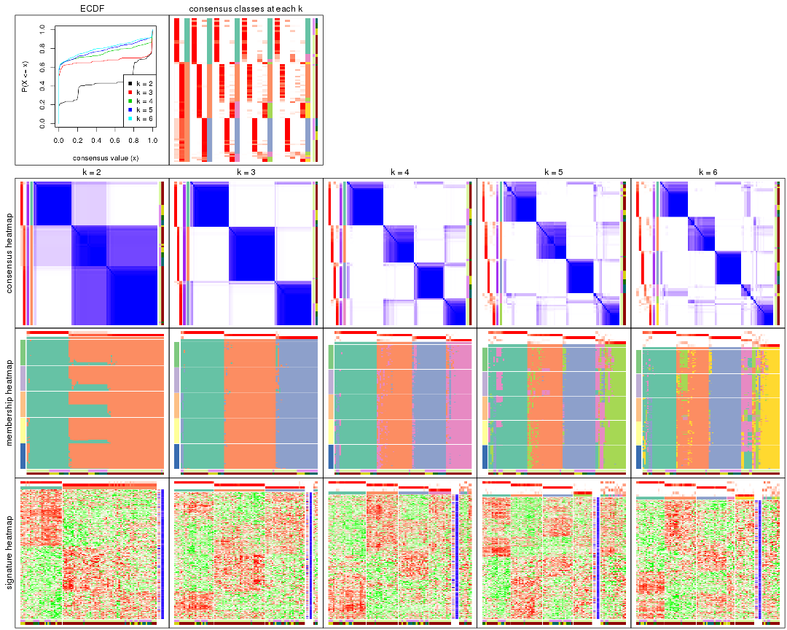

The plots are:

- The first row: a plot of the ECDF (Empirical cumulative distribution
  function) curves of the consensus matrix for each `k` and the heatmap of
  predicted classes for each `k`.
- The second row: heatmaps of the consensus matrix for each `k`.
- The third row: heatmaps of the membership matrix for each `k`.
- The fouth row: heatmaps of the signatures for each `k`.

All the plots in panels can be made by individual functions and they are
plotted later in this section.

`select_partition_number()` produces several plots showing different
statistics for choosing "optimized" `k`. There are following statistics:

- ECDF curves of the consensus matrix for each `k`;
- 1-PAC. [The PAC
  score](https://en.wikipedia.org/wiki/Consensus_clustering#Over-interpretation_potential_of_consensus_clustering)
  measures the proportion of the ambiguous subgrouping.
- Mean silhouette score.
- Concordance. The mean probability of fiting the consensus class ids in all
  partitions.
- Area increased. Denote $A_k$ as the area under the ECDF curve for current
  `k`, the area increased is defined as $A_k - A_{k-1}$.
- Rand index. The percent of pairs of samples that are both in a same cluster
  or both are not in a same cluster in the partition of k and k-1.
- Jaccard index. The ratio of pairs of samples are both in a same cluster in
  the partition of k and k-1 and the pairs of samples are both in a same
  cluster in the partition k or k-1.

The detailed explanations of these statistics can be found in [the cola
vignette](http://bioconductor.org/packages/devel/bioc/vignettes/cola/inst/doc/cola.html#toc_13).

Generally speaking, lower PAC score, higher mean silhouette score or higher
concordance corresponds to better partition. Rand index and Jaccard index
measure how similar the current partition is compared to partition with `k-1`.
If they are too similar, we won't accept `k` is better than `k-1`.

```r
select_partition_number(res)
```


The numeric values for all these statistics can be obtained by `get_stats()`.

```r
get_stats(res)
```

```
#>   k 1-PAC mean_silhouette concordance area_increased  Rand Jaccard
#> 2 2 0.608           0.897       0.933         0.4420 0.570   0.570
#> 3 3 1.000           0.944       0.977         0.5173 0.743   0.556
#> 4 4 0.871           0.840       0.935         0.1241 0.883   0.664
#> 5 5 0.811           0.755       0.890         0.0397 0.967   0.868
#> 6 6 0.803           0.730       0.870         0.0241 0.956   0.809
```

`suggest_best_k()` suggests the best $k$ based on these statistics. The rules are as follows:

- All $k$ with Jaccard index larger than 0.95 are removed because the increase of
  the partition number does not provides enough extra information. If all $k$ are removed,
  the best $k$ is assigned by `NA`.
- For $k$ with 1-PAC larger than 0.9, the maximal $k$ is taken as the "best k". Other $k$ is called "optional k".
- If it does not fit the second rule. The $k$ with the highest vote of highest
  1-PAC, mean silhouette and concordance is taken as the "best k".

```r
suggest_best_k(res)
```

```
#> [1] 3
```


Following shows the table of the partitions (You need to click the **show/hide
code output** link to see it). The membership matrix (columns with name `p*`)
is inferred by
[`clue::cl_consensus()`](https://www.rdocumentation.org/link/cl_consensus?package=clue)
function with the `SE` method. Basically the value in the membership matrix
represents the probability to belong to a certain group. The finall class
label for an item is determined with the group with highest probability it
belongs to.

In `get_classes()` function, the entropy is calculated from the membership
matrix and the silhouette score is calculated from the consensus matrix.


<script>
$( function() {
	$( '#tabs-CV-pam-get-classes' ).tabs();
} );
</script>
<div id='tabs-CV-pam-get-classes'>
<ul>
<li><a href='#tab-CV-pam-get-classes-1'>k = 2</a></li>
<li><a href='#tab-CV-pam-get-classes-2'>k = 3</a></li>
<li><a href='#tab-CV-pam-get-classes-3'>k = 4</a></li>
<li><a href='#tab-CV-pam-get-classes-4'>k = 5</a></li>
<li><a href='#tab-CV-pam-get-classes-5'>k = 6</a></li>
</ul>

<div id='tab-CV-pam-get-classes-1'>
<p><a id='tab-CV-pam-get-classes-1-a' style='color:#0366d6' href='#'>show/hide code output</a></p>
<pre><code class="r">cbind(get_classes(res, k = 2), get_membership(res, k = 2))
</code></pre>

<pre><code>#&gt;          class entropy silhouette    p1    p2
#&gt; GSM99497     2  0.7376      0.835 0.208 0.792
#&gt; GSM99503     1  0.0000      0.982 1.000 0.000
#&gt; GSM99505     1  0.0000      0.982 1.000 0.000
#&gt; GSM99507     2  0.7376      0.835 0.208 0.792
#&gt; GSM99567     2  0.7376      0.835 0.208 0.792
#&gt; GSM99575     1  0.0000      0.982 1.000 0.000
#&gt; GSM99593     2  0.7376      0.835 0.208 0.792
#&gt; GSM99595     2  0.7376      0.835 0.208 0.792
#&gt; GSM99469     1  0.0000      0.982 1.000 0.000
#&gt; GSM99499     1  0.0000      0.982 1.000 0.000
#&gt; GSM99501     1  0.0000      0.982 1.000 0.000
#&gt; GSM99509     2  0.7376      0.835 0.208 0.792
#&gt; GSM99569     2  0.7376      0.835 0.208 0.792
#&gt; GSM99597     2  0.7376      0.835 0.208 0.792
#&gt; GSM99601     2  0.0000      0.899 0.000 1.000
#&gt; GSM99459     1  0.0000      0.982 1.000 0.000
#&gt; GSM99461     1  0.0000      0.982 1.000 0.000
#&gt; GSM99511     2  0.7376      0.835 0.208 0.792
#&gt; GSM99513     2  0.7299      0.838 0.204 0.796
#&gt; GSM99515     2  0.7376      0.835 0.208 0.792
#&gt; GSM99517     1  0.0000      0.982 1.000 0.000
#&gt; GSM99519     1  0.0000      0.982 1.000 0.000
#&gt; GSM99521     2  0.7376      0.835 0.208 0.792
#&gt; GSM99523     2  0.9552      0.582 0.376 0.624
#&gt; GSM99571     1  0.0000      0.982 1.000 0.000
#&gt; GSM99599     1  0.0000      0.982 1.000 0.000
#&gt; GSM99433     2  0.0000      0.899 0.000 1.000
#&gt; GSM99435     2  0.6247      0.857 0.156 0.844
#&gt; GSM99437     2  0.0000      0.899 0.000 1.000
#&gt; GSM99439     2  0.0000      0.899 0.000 1.000
#&gt; GSM99441     1  0.0000      0.982 1.000 0.000
#&gt; GSM99443     2  0.0000      0.899 0.000 1.000
#&gt; GSM99445     2  0.0000      0.899 0.000 1.000
#&gt; GSM99447     2  0.0000      0.899 0.000 1.000
#&gt; GSM99449     2  0.0000      0.899 0.000 1.000
#&gt; GSM99451     2  0.7219      0.840 0.200 0.800
#&gt; GSM99453     1  0.0000      0.982 1.000 0.000
#&gt; GSM99455     1  0.0000      0.982 1.000 0.000
#&gt; GSM99457     1  0.0000      0.982 1.000 0.000
#&gt; GSM99463     2  0.0000      0.899 0.000 1.000
#&gt; GSM99465     2  0.7453      0.831 0.212 0.788
#&gt; GSM99467     2  0.0000      0.899 0.000 1.000
#&gt; GSM99471     1  0.6343      0.781 0.840 0.160
#&gt; GSM99473     1  0.7453      0.698 0.788 0.212
#&gt; GSM99475     2  0.7299      0.838 0.204 0.796
#&gt; GSM99477     2  0.0000      0.899 0.000 1.000
#&gt; GSM99479     2  0.0000      0.899 0.000 1.000
#&gt; GSM99481     1  0.0000      0.982 1.000 0.000
#&gt; GSM99483     1  0.0000      0.982 1.000 0.000
#&gt; GSM99485     2  0.0672      0.898 0.008 0.992
#&gt; GSM99487     2  0.0000      0.899 0.000 1.000
#&gt; GSM99489     2  0.0000      0.899 0.000 1.000
#&gt; GSM99491     2  0.0000      0.899 0.000 1.000
#&gt; GSM99493     1  0.0000      0.982 1.000 0.000
#&gt; GSM99495     2  0.0000      0.899 0.000 1.000
#&gt; GSM99525     1  0.0000      0.982 1.000 0.000
#&gt; GSM99527     2  0.3584      0.885 0.068 0.932
#&gt; GSM99529     2  0.0000      0.899 0.000 1.000
#&gt; GSM99531     2  0.7219      0.840 0.200 0.800
#&gt; GSM99533     2  0.7674      0.819 0.224 0.776
#&gt; GSM99535     2  0.2423      0.878 0.040 0.960
#&gt; GSM99537     1  0.0000      0.982 1.000 0.000
#&gt; GSM99539     2  0.0000      0.899 0.000 1.000
#&gt; GSM99541     1  0.0000      0.982 1.000 0.000
#&gt; GSM99543     2  0.0376      0.898 0.004 0.996
#&gt; GSM99545     2  0.0000      0.899 0.000 1.000
#&gt; GSM99547     2  0.0672      0.898 0.008 0.992
#&gt; GSM99549     2  0.0000      0.899 0.000 1.000
#&gt; GSM99551     2  0.7453      0.832 0.212 0.788
#&gt; GSM99553     2  0.7219      0.840 0.200 0.800
#&gt; GSM99555     2  0.0000      0.899 0.000 1.000
#&gt; GSM99557     2  0.0000      0.899 0.000 1.000
#&gt; GSM99559     2  0.2948      0.889 0.052 0.948
#&gt; GSM99561     2  0.0000      0.899 0.000 1.000
#&gt; GSM99563     2  0.8499      0.756 0.276 0.724
#&gt; GSM99565     2  0.0000      0.899 0.000 1.000
#&gt; GSM99573     2  0.0000      0.899 0.000 1.000
#&gt; GSM99577     1  0.1184      0.966 0.984 0.016
#&gt; GSM99579     2  0.0000      0.899 0.000 1.000
#&gt; GSM99581     2  0.7219      0.840 0.200 0.800
#&gt; GSM99583     2  0.7219      0.840 0.200 0.800
#&gt; GSM99585     2  0.0000      0.899 0.000 1.000
#&gt; GSM99587     1  0.0000      0.982 1.000 0.000
#&gt; GSM99589     2  0.0000      0.899 0.000 1.000
#&gt; GSM99591     2  0.0000      0.899 0.000 1.000
</code></pre>

<script>
$('#tab-CV-pam-get-classes-1-a').parent().next().next().hide();
$('#tab-CV-pam-get-classes-1-a').click(function(){
  $('#tab-CV-pam-get-classes-1-a').parent().next().next().toggle();
  return(false);
});
</script>
</div>

<div id='tab-CV-pam-get-classes-2'>
<p><a id='tab-CV-pam-get-classes-2-a' style='color:#0366d6' href='#'>show/hide code output</a></p>
<pre><code class="r">cbind(get_classes(res, k = 3), get_membership(res, k = 3))
</code></pre>

<pre><code>#&gt;          class entropy silhouette    p1    p2    p3
#&gt; GSM99497     3  0.0000     0.9683 0.000 0.000 1.000
#&gt; GSM99503     1  0.0000     0.9629 1.000 0.000 0.000
#&gt; GSM99505     1  0.6305     0.0562 0.516 0.000 0.484
#&gt; GSM99507     3  0.0000     0.9683 0.000 0.000 1.000
#&gt; GSM99567     3  0.0000     0.9683 0.000 0.000 1.000
#&gt; GSM99575     1  0.0000     0.9629 1.000 0.000 0.000
#&gt; GSM99593     3  0.0000     0.9683 0.000 0.000 1.000
#&gt; GSM99595     3  0.0000     0.9683 0.000 0.000 1.000
#&gt; GSM99469     1  0.0000     0.9629 1.000 0.000 0.000
#&gt; GSM99499     1  0.5948     0.4312 0.640 0.000 0.360
#&gt; GSM99501     1  0.0000     0.9629 1.000 0.000 0.000
#&gt; GSM99509     3  0.0000     0.9683 0.000 0.000 1.000
#&gt; GSM99569     3  0.0000     0.9683 0.000 0.000 1.000
#&gt; GSM99597     3  0.0000     0.9683 0.000 0.000 1.000
#&gt; GSM99601     2  0.0000     0.9921 0.000 1.000 0.000
#&gt; GSM99459     1  0.0000     0.9629 1.000 0.000 0.000
#&gt; GSM99461     1  0.0000     0.9629 1.000 0.000 0.000
#&gt; GSM99511     3  0.0000     0.9683 0.000 0.000 1.000
#&gt; GSM99513     3  0.0000     0.9683 0.000 0.000 1.000
#&gt; GSM99515     3  0.0000     0.9683 0.000 0.000 1.000
#&gt; GSM99517     1  0.0000     0.9629 1.000 0.000 0.000
#&gt; GSM99519     1  0.0000     0.9629 1.000 0.000 0.000
#&gt; GSM99521     3  0.0000     0.9683 0.000 0.000 1.000
#&gt; GSM99523     3  0.0000     0.9683 0.000 0.000 1.000
#&gt; GSM99571     1  0.0000     0.9629 1.000 0.000 0.000
#&gt; GSM99599     1  0.0000     0.9629 1.000 0.000 0.000
#&gt; GSM99433     2  0.0000     0.9921 0.000 1.000 0.000
#&gt; GSM99435     3  0.0000     0.9683 0.000 0.000 1.000
#&gt; GSM99437     2  0.0000     0.9921 0.000 1.000 0.000
#&gt; GSM99439     2  0.0000     0.9921 0.000 1.000 0.000
#&gt; GSM99441     1  0.0000     0.9629 1.000 0.000 0.000
#&gt; GSM99443     2  0.0000     0.9921 0.000 1.000 0.000
#&gt; GSM99445     2  0.0000     0.9921 0.000 1.000 0.000
#&gt; GSM99447     2  0.0000     0.9921 0.000 1.000 0.000
#&gt; GSM99449     3  0.0424     0.9636 0.000 0.008 0.992
#&gt; GSM99451     3  0.0237     0.9661 0.000 0.004 0.996
#&gt; GSM99453     1  0.0000     0.9629 1.000 0.000 0.000
#&gt; GSM99455     1  0.0000     0.9629 1.000 0.000 0.000
#&gt; GSM99457     1  0.0000     0.9629 1.000 0.000 0.000
#&gt; GSM99463     2  0.0000     0.9921 0.000 1.000 0.000
#&gt; GSM99465     3  0.7862     0.6103 0.184 0.148 0.668
#&gt; GSM99467     2  0.0000     0.9921 0.000 1.000 0.000
#&gt; GSM99471     1  0.0237     0.9597 0.996 0.004 0.000
#&gt; GSM99473     1  0.0424     0.9562 0.992 0.008 0.000
#&gt; GSM99475     3  0.1031     0.9505 0.000 0.024 0.976
#&gt; GSM99477     2  0.0000     0.9921 0.000 1.000 0.000
#&gt; GSM99479     2  0.0000     0.9921 0.000 1.000 0.000
#&gt; GSM99481     1  0.0000     0.9629 1.000 0.000 0.000
#&gt; GSM99483     1  0.0000     0.9629 1.000 0.000 0.000
#&gt; GSM99485     2  0.0000     0.9921 0.000 1.000 0.000
#&gt; GSM99487     2  0.0000     0.9921 0.000 1.000 0.000
#&gt; GSM99489     2  0.0000     0.9921 0.000 1.000 0.000
#&gt; GSM99491     2  0.0000     0.9921 0.000 1.000 0.000
#&gt; GSM99493     1  0.0000     0.9629 1.000 0.000 0.000
#&gt; GSM99495     2  0.0000     0.9921 0.000 1.000 0.000
#&gt; GSM99525     1  0.0000     0.9629 1.000 0.000 0.000
#&gt; GSM99527     2  0.0000     0.9921 0.000 1.000 0.000
#&gt; GSM99529     3  0.5859     0.4923 0.000 0.344 0.656
#&gt; GSM99531     3  0.0592     0.9607 0.000 0.012 0.988
#&gt; GSM99533     3  0.1999     0.9326 0.036 0.012 0.952
#&gt; GSM99535     2  0.0747     0.9786 0.016 0.984 0.000
#&gt; GSM99537     1  0.0000     0.9629 1.000 0.000 0.000
#&gt; GSM99539     2  0.1411     0.9609 0.000 0.964 0.036
#&gt; GSM99541     1  0.0000     0.9629 1.000 0.000 0.000
#&gt; GSM99543     2  0.0000     0.9921 0.000 1.000 0.000
#&gt; GSM99545     2  0.2066     0.9363 0.000 0.940 0.060
#&gt; GSM99547     2  0.0747     0.9786 0.016 0.984 0.000
#&gt; GSM99549     2  0.0000     0.9921 0.000 1.000 0.000
#&gt; GSM99551     1  0.2806     0.9031 0.928 0.040 0.032
#&gt; GSM99553     3  0.0000     0.9683 0.000 0.000 1.000
#&gt; GSM99555     2  0.0000     0.9921 0.000 1.000 0.000
#&gt; GSM99557     2  0.0000     0.9921 0.000 1.000 0.000
#&gt; GSM99559     3  0.0000     0.9683 0.000 0.000 1.000
#&gt; GSM99561     2  0.0000     0.9921 0.000 1.000 0.000
#&gt; GSM99563     3  0.0000     0.9683 0.000 0.000 1.000
#&gt; GSM99565     2  0.0000     0.9921 0.000 1.000 0.000
#&gt; GSM99573     2  0.0000     0.9921 0.000 1.000 0.000
#&gt; GSM99577     1  0.0237     0.9599 0.996 0.000 0.004
#&gt; GSM99579     2  0.0000     0.9921 0.000 1.000 0.000
#&gt; GSM99581     3  0.0000     0.9683 0.000 0.000 1.000
#&gt; GSM99583     3  0.0592     0.9607 0.000 0.012 0.988
#&gt; GSM99585     2  0.0000     0.9921 0.000 1.000 0.000
#&gt; GSM99587     1  0.0000     0.9629 1.000 0.000 0.000
#&gt; GSM99589     2  0.3116     0.8762 0.000 0.892 0.108
#&gt; GSM99591     2  0.0000     0.9921 0.000 1.000 0.000
</code></pre>

<script>
$('#tab-CV-pam-get-classes-2-a').parent().next().next().hide();
$('#tab-CV-pam-get-classes-2-a').click(function(){
  $('#tab-CV-pam-get-classes-2-a').parent().next().next().toggle();
  return(false);
});
</script>
</div>

<div id='tab-CV-pam-get-classes-3'>
<p><a id='tab-CV-pam-get-classes-3-a' style='color:#0366d6' href='#'>show/hide code output</a></p>
<pre><code class="r">cbind(get_classes(res, k = 4), get_membership(res, k = 4))
</code></pre>

<pre><code>#&gt;          class entropy silhouette    p1    p2    p3    p4
#&gt; GSM99497     3  0.0000    0.94700 0.000 0.000 1.000 0.000
#&gt; GSM99503     1  0.0000    0.94624 1.000 0.000 0.000 0.000
#&gt; GSM99505     1  0.4996    0.10315 0.516 0.000 0.484 0.000
#&gt; GSM99507     3  0.0000    0.94700 0.000 0.000 1.000 0.000
#&gt; GSM99567     3  0.0000    0.94700 0.000 0.000 1.000 0.000
#&gt; GSM99575     1  0.0000    0.94624 1.000 0.000 0.000 0.000
#&gt; GSM99593     3  0.0000    0.94700 0.000 0.000 1.000 0.000
#&gt; GSM99595     3  0.0000    0.94700 0.000 0.000 1.000 0.000
#&gt; GSM99469     1  0.0000    0.94624 1.000 0.000 0.000 0.000
#&gt; GSM99499     1  0.4713    0.45130 0.640 0.000 0.360 0.000
#&gt; GSM99501     1  0.0000    0.94624 1.000 0.000 0.000 0.000
#&gt; GSM99509     3  0.0000    0.94700 0.000 0.000 1.000 0.000
#&gt; GSM99569     3  0.0000    0.94700 0.000 0.000 1.000 0.000
#&gt; GSM99597     3  0.0000    0.94700 0.000 0.000 1.000 0.000
#&gt; GSM99601     2  0.0000    0.89918 0.000 1.000 0.000 0.000
#&gt; GSM99459     1  0.0000    0.94624 1.000 0.000 0.000 0.000
#&gt; GSM99461     1  0.0000    0.94624 1.000 0.000 0.000 0.000
#&gt; GSM99511     3  0.0000    0.94700 0.000 0.000 1.000 0.000
#&gt; GSM99513     3  0.0000    0.94700 0.000 0.000 1.000 0.000
#&gt; GSM99515     3  0.0000    0.94700 0.000 0.000 1.000 0.000
#&gt; GSM99517     1  0.0000    0.94624 1.000 0.000 0.000 0.000
#&gt; GSM99519     1  0.0000    0.94624 1.000 0.000 0.000 0.000
#&gt; GSM99521     3  0.0000    0.94700 0.000 0.000 1.000 0.000
#&gt; GSM99523     3  0.0000    0.94700 0.000 0.000 1.000 0.000
#&gt; GSM99571     1  0.0000    0.94624 1.000 0.000 0.000 0.000
#&gt; GSM99599     1  0.0000    0.94624 1.000 0.000 0.000 0.000
#&gt; GSM99433     2  0.2469    0.84230 0.000 0.892 0.000 0.108
#&gt; GSM99435     3  0.3172    0.79398 0.000 0.000 0.840 0.160
#&gt; GSM99437     2  0.0000    0.89918 0.000 1.000 0.000 0.000
#&gt; GSM99439     2  0.0000    0.89918 0.000 1.000 0.000 0.000
#&gt; GSM99441     1  0.0000    0.94624 1.000 0.000 0.000 0.000
#&gt; GSM99443     2  0.0000    0.89918 0.000 1.000 0.000 0.000
#&gt; GSM99445     2  0.0000    0.89918 0.000 1.000 0.000 0.000
#&gt; GSM99447     2  0.2149    0.85914 0.000 0.912 0.000 0.088
#&gt; GSM99449     3  0.0336    0.94035 0.000 0.008 0.992 0.000
#&gt; GSM99451     3  0.4661    0.48784 0.000 0.000 0.652 0.348
#&gt; GSM99453     1  0.0000    0.94624 1.000 0.000 0.000 0.000
#&gt; GSM99455     1  0.0000    0.94624 1.000 0.000 0.000 0.000
#&gt; GSM99457     1  0.0000    0.94624 1.000 0.000 0.000 0.000
#&gt; GSM99463     2  0.0336    0.89745 0.000 0.992 0.000 0.008
#&gt; GSM99465     4  0.0336    0.89864 0.008 0.000 0.000 0.992
#&gt; GSM99467     4  0.0000    0.90224 0.000 0.000 0.000 1.000
#&gt; GSM99471     1  0.3356    0.76581 0.824 0.000 0.000 0.176
#&gt; GSM99473     1  0.3726    0.71229 0.788 0.000 0.000 0.212
#&gt; GSM99475     3  0.6071    0.02256 0.000 0.044 0.504 0.452
#&gt; GSM99477     4  0.0000    0.90224 0.000 0.000 0.000 1.000
#&gt; GSM99479     4  0.0000    0.90224 0.000 0.000 0.000 1.000
#&gt; GSM99481     1  0.0000    0.94624 1.000 0.000 0.000 0.000
#&gt; GSM99483     1  0.0000    0.94624 1.000 0.000 0.000 0.000
#&gt; GSM99485     4  0.0000    0.90224 0.000 0.000 0.000 1.000
#&gt; GSM99487     2  0.0000    0.89918 0.000 1.000 0.000 0.000
#&gt; GSM99489     2  0.0000    0.89918 0.000 1.000 0.000 0.000
#&gt; GSM99491     2  0.1302    0.88335 0.000 0.956 0.000 0.044
#&gt; GSM99493     1  0.0000    0.94624 1.000 0.000 0.000 0.000
#&gt; GSM99495     2  0.0000    0.89918 0.000 1.000 0.000 0.000
#&gt; GSM99525     1  0.0000    0.94624 1.000 0.000 0.000 0.000
#&gt; GSM99527     4  0.4907    0.19678 0.000 0.420 0.000 0.580
#&gt; GSM99529     4  0.0000    0.90224 0.000 0.000 0.000 1.000
#&gt; GSM99531     4  0.4996   -0.00918 0.000 0.000 0.484 0.516
#&gt; GSM99533     4  0.0779    0.89158 0.016 0.000 0.004 0.980
#&gt; GSM99535     4  0.3972    0.68953 0.008 0.204 0.000 0.788
#&gt; GSM99537     1  0.0000    0.94624 1.000 0.000 0.000 0.000
#&gt; GSM99539     2  0.4098    0.73678 0.000 0.784 0.012 0.204
#&gt; GSM99541     1  0.0000    0.94624 1.000 0.000 0.000 0.000
#&gt; GSM99543     4  0.0469    0.89785 0.000 0.012 0.000 0.988
#&gt; GSM99545     2  0.1890    0.86392 0.000 0.936 0.056 0.008
#&gt; GSM99547     4  0.1637    0.86408 0.000 0.060 0.000 0.940
#&gt; GSM99549     2  0.4972    0.17593 0.000 0.544 0.000 0.456
#&gt; GSM99551     4  0.0000    0.90224 0.000 0.000 0.000 1.000
#&gt; GSM99553     3  0.0000    0.94700 0.000 0.000 1.000 0.000
#&gt; GSM99555     2  0.0000    0.89918 0.000 1.000 0.000 0.000
#&gt; GSM99557     2  0.2814    0.82872 0.000 0.868 0.000 0.132
#&gt; GSM99559     3  0.0336    0.94092 0.000 0.000 0.992 0.008
#&gt; GSM99561     2  0.2647    0.83669 0.000 0.880 0.000 0.120
#&gt; GSM99563     3  0.0000    0.94700 0.000 0.000 1.000 0.000
#&gt; GSM99565     2  0.0000    0.89918 0.000 1.000 0.000 0.000
#&gt; GSM99573     2  0.4941    0.24772 0.000 0.564 0.000 0.436
#&gt; GSM99577     1  0.0779    0.93132 0.980 0.000 0.004 0.016
#&gt; GSM99579     4  0.0000    0.90224 0.000 0.000 0.000 1.000
#&gt; GSM99581     3  0.0000    0.94700 0.000 0.000 1.000 0.000
#&gt; GSM99583     4  0.0188    0.90055 0.000 0.000 0.004 0.996
#&gt; GSM99585     2  0.4193    0.64572 0.000 0.732 0.000 0.268
#&gt; GSM99587     1  0.0000    0.94624 1.000 0.000 0.000 0.000
#&gt; GSM99589     4  0.1792    0.85769 0.000 0.068 0.000 0.932
#&gt; GSM99591     2  0.0000    0.89918 0.000 1.000 0.000 0.000
</code></pre>

<script>
$('#tab-CV-pam-get-classes-3-a').parent().next().next().hide();
$('#tab-CV-pam-get-classes-3-a').click(function(){
  $('#tab-CV-pam-get-classes-3-a').parent().next().next().toggle();
  return(false);
});
</script>
</div>

<div id='tab-CV-pam-get-classes-4'>
<p><a id='tab-CV-pam-get-classes-4-a' style='color:#0366d6' href='#'>show/hide code output</a></p>
<pre><code class="r">cbind(get_classes(res, k = 5), get_membership(res, k = 5))
</code></pre>

<pre><code>#&gt;          class entropy silhouette    p1    p2    p3    p4    p5
#&gt; GSM99497     3  0.0000     0.9617 0.000 0.000 1.000 0.000 0.000
#&gt; GSM99503     1  0.0000     0.8384 1.000 0.000 0.000 0.000 0.000
#&gt; GSM99505     1  0.4304     0.1032 0.516 0.000 0.484 0.000 0.000
#&gt; GSM99507     3  0.0000     0.9617 0.000 0.000 1.000 0.000 0.000
#&gt; GSM99567     3  0.0000     0.9617 0.000 0.000 1.000 0.000 0.000
#&gt; GSM99575     1  0.0000     0.8384 1.000 0.000 0.000 0.000 0.000
#&gt; GSM99593     3  0.0000     0.9617 0.000 0.000 1.000 0.000 0.000
#&gt; GSM99595     3  0.0000     0.9617 0.000 0.000 1.000 0.000 0.000
#&gt; GSM99469     1  0.0000     0.8384 1.000 0.000 0.000 0.000 0.000
#&gt; GSM99499     1  0.5297     0.2659 0.580 0.000 0.360 0.060 0.000
#&gt; GSM99501     1  0.0000     0.8384 1.000 0.000 0.000 0.000 0.000
#&gt; GSM99509     3  0.0000     0.9617 0.000 0.000 1.000 0.000 0.000
#&gt; GSM99569     3  0.0000     0.9617 0.000 0.000 1.000 0.000 0.000
#&gt; GSM99597     3  0.0000     0.9617 0.000 0.000 1.000 0.000 0.000
#&gt; GSM99601     2  0.0000     0.8770 0.000 1.000 0.000 0.000 0.000
#&gt; GSM99459     1  0.3999     0.4803 0.656 0.000 0.000 0.344 0.000
#&gt; GSM99461     1  0.3999     0.4810 0.656 0.000 0.000 0.344 0.000
#&gt; GSM99511     3  0.0000     0.9617 0.000 0.000 1.000 0.000 0.000
#&gt; GSM99513     3  0.0000     0.9617 0.000 0.000 1.000 0.000 0.000
#&gt; GSM99515     3  0.0000     0.9617 0.000 0.000 1.000 0.000 0.000
#&gt; GSM99517     1  0.0000     0.8384 1.000 0.000 0.000 0.000 0.000
#&gt; GSM99519     1  0.2813     0.7103 0.832 0.000 0.000 0.168 0.000
#&gt; GSM99521     3  0.0000     0.9617 0.000 0.000 1.000 0.000 0.000
#&gt; GSM99523     3  0.0000     0.9617 0.000 0.000 1.000 0.000 0.000
#&gt; GSM99571     1  0.0000     0.8384 1.000 0.000 0.000 0.000 0.000
#&gt; GSM99599     1  0.0000     0.8384 1.000 0.000 0.000 0.000 0.000
#&gt; GSM99433     2  0.2127     0.8302 0.000 0.892 0.000 0.000 0.108
#&gt; GSM99435     3  0.2732     0.7665 0.000 0.000 0.840 0.000 0.160
#&gt; GSM99437     2  0.0000     0.8770 0.000 1.000 0.000 0.000 0.000
#&gt; GSM99439     2  0.1478     0.8662 0.000 0.936 0.000 0.064 0.000
#&gt; GSM99441     1  0.0000     0.8384 1.000 0.000 0.000 0.000 0.000
#&gt; GSM99443     2  0.0000     0.8770 0.000 1.000 0.000 0.000 0.000
#&gt; GSM99445     2  0.0000     0.8770 0.000 1.000 0.000 0.000 0.000
#&gt; GSM99447     2  0.1851     0.8452 0.000 0.912 0.000 0.000 0.088
#&gt; GSM99449     3  0.0290     0.9529 0.000 0.008 0.992 0.000 0.000
#&gt; GSM99451     3  0.6200     0.1504 0.000 0.000 0.540 0.180 0.280
#&gt; GSM99453     1  0.0000     0.8384 1.000 0.000 0.000 0.000 0.000
#&gt; GSM99455     1  0.0000     0.8384 1.000 0.000 0.000 0.000 0.000
#&gt; GSM99457     1  0.4101     0.4359 0.628 0.000 0.000 0.372 0.000
#&gt; GSM99463     2  0.1697     0.8675 0.000 0.932 0.000 0.060 0.008
#&gt; GSM99465     5  0.4299     0.2738 0.004 0.000 0.000 0.388 0.608
#&gt; GSM99467     5  0.0000     0.8878 0.000 0.000 0.000 0.000 1.000
#&gt; GSM99471     1  0.3304     0.6593 0.816 0.000 0.000 0.016 0.168
#&gt; GSM99473     1  0.3210     0.5991 0.788 0.000 0.000 0.000 0.212
#&gt; GSM99475     4  0.5829     0.4138 0.000 0.008 0.200 0.636 0.156
#&gt; GSM99477     5  0.0000     0.8878 0.000 0.000 0.000 0.000 1.000
#&gt; GSM99479     5  0.0000     0.8878 0.000 0.000 0.000 0.000 1.000
#&gt; GSM99481     1  0.0000     0.8384 1.000 0.000 0.000 0.000 0.000
#&gt; GSM99483     1  0.0000     0.8384 1.000 0.000 0.000 0.000 0.000
#&gt; GSM99485     5  0.0000     0.8878 0.000 0.000 0.000 0.000 1.000
#&gt; GSM99487     2  0.0000     0.8770 0.000 1.000 0.000 0.000 0.000
#&gt; GSM99489     2  0.1270     0.8695 0.000 0.948 0.000 0.052 0.000
#&gt; GSM99491     2  0.1121     0.8673 0.000 0.956 0.000 0.000 0.044
#&gt; GSM99493     1  0.0000     0.8384 1.000 0.000 0.000 0.000 0.000
#&gt; GSM99495     2  0.1478     0.8662 0.000 0.936 0.000 0.064 0.000
#&gt; GSM99525     1  0.0000     0.8384 1.000 0.000 0.000 0.000 0.000
#&gt; GSM99527     4  0.6433     0.0504 0.000 0.184 0.000 0.464 0.352
#&gt; GSM99529     5  0.0000     0.8878 0.000 0.000 0.000 0.000 1.000
#&gt; GSM99531     4  0.6813     0.2525 0.000 0.000 0.320 0.364 0.316
#&gt; GSM99533     4  0.4682     0.1468 0.016 0.000 0.000 0.564 0.420
#&gt; GSM99535     5  0.3805     0.6430 0.008 0.192 0.000 0.016 0.784
#&gt; GSM99537     1  0.3857     0.4661 0.688 0.000 0.000 0.312 0.000
#&gt; GSM99539     2  0.3530     0.7241 0.000 0.784 0.012 0.000 0.204
#&gt; GSM99541     4  0.3816     0.3065 0.304 0.000 0.000 0.696 0.000
#&gt; GSM99543     5  0.2136     0.8335 0.000 0.008 0.000 0.088 0.904
#&gt; GSM99545     2  0.2775     0.8447 0.000 0.888 0.036 0.068 0.008
#&gt; GSM99547     5  0.2946     0.7931 0.000 0.044 0.000 0.088 0.868
#&gt; GSM99549     2  0.5505     0.1328 0.000 0.484 0.000 0.064 0.452
#&gt; GSM99551     5  0.1341     0.8554 0.000 0.000 0.000 0.056 0.944
#&gt; GSM99553     3  0.0000     0.9617 0.000 0.000 1.000 0.000 0.000
#&gt; GSM99555     2  0.0000     0.8770 0.000 1.000 0.000 0.000 0.000
#&gt; GSM99557     2  0.2424     0.8149 0.000 0.868 0.000 0.000 0.132
#&gt; GSM99559     3  0.0290     0.9537 0.000 0.000 0.992 0.000 0.008
#&gt; GSM99561     2  0.3012     0.8250 0.000 0.860 0.000 0.036 0.104
#&gt; GSM99563     3  0.0000     0.9617 0.000 0.000 1.000 0.000 0.000
#&gt; GSM99565     2  0.0000     0.8770 0.000 1.000 0.000 0.000 0.000
#&gt; GSM99573     2  0.5478     0.2408 0.000 0.516 0.000 0.064 0.420
#&gt; GSM99577     4  0.4037     0.3339 0.288 0.000 0.004 0.704 0.004
#&gt; GSM99579     5  0.0000     0.8878 0.000 0.000 0.000 0.000 1.000
#&gt; GSM99581     3  0.0000     0.9617 0.000 0.000 1.000 0.000 0.000
#&gt; GSM99583     5  0.0162     0.8845 0.000 0.000 0.004 0.000 0.996
#&gt; GSM99585     2  0.3612     0.6490 0.000 0.732 0.000 0.000 0.268
#&gt; GSM99587     1  0.0703     0.8245 0.976 0.000 0.000 0.024 0.000
#&gt; GSM99589     5  0.1544     0.8354 0.000 0.068 0.000 0.000 0.932
#&gt; GSM99591     2  0.0000     0.8770 0.000 1.000 0.000 0.000 0.000
</code></pre>

<script>
$('#tab-CV-pam-get-classes-4-a').parent().next().next().hide();
$('#tab-CV-pam-get-classes-4-a').click(function(){
  $('#tab-CV-pam-get-classes-4-a').parent().next().next().toggle();
  return(false);
});
</script>
</div>

<div id='tab-CV-pam-get-classes-5'>
<p><a id='tab-CV-pam-get-classes-5-a' style='color:#0366d6' href='#'>show/hide code output</a></p>
<pre><code class="r">cbind(get_classes(res, k = 6), get_membership(res, k = 6))
</code></pre>

<pre><code>#&gt;          class entropy silhouette    p1    p2    p3    p4    p5    p6
#&gt; GSM99497     3  0.0000      0.965 0.000 0.000 1.000 0.000 0.000 0.000
#&gt; GSM99503     1  0.0000      0.859 1.000 0.000 0.000 0.000 0.000 0.000
#&gt; GSM99505     1  0.3866      0.108 0.516 0.000 0.484 0.000 0.000 0.000
#&gt; GSM99507     3  0.0000      0.965 0.000 0.000 1.000 0.000 0.000 0.000
#&gt; GSM99567     3  0.0000      0.965 0.000 0.000 1.000 0.000 0.000 0.000
#&gt; GSM99575     1  0.0000      0.859 1.000 0.000 0.000 0.000 0.000 0.000
#&gt; GSM99593     3  0.0000      0.965 0.000 0.000 1.000 0.000 0.000 0.000
#&gt; GSM99595     3  0.0000      0.965 0.000 0.000 1.000 0.000 0.000 0.000
#&gt; GSM99469     1  0.0000      0.859 1.000 0.000 0.000 0.000 0.000 0.000
#&gt; GSM99499     1  0.5044      0.267 0.576 0.000 0.360 0.040 0.024 0.000
#&gt; GSM99501     1  0.0000      0.859 1.000 0.000 0.000 0.000 0.000 0.000
#&gt; GSM99509     3  0.0000      0.965 0.000 0.000 1.000 0.000 0.000 0.000
#&gt; GSM99569     3  0.0000      0.965 0.000 0.000 1.000 0.000 0.000 0.000
#&gt; GSM99597     3  0.0000      0.965 0.000 0.000 1.000 0.000 0.000 0.000
#&gt; GSM99601     2  0.0000      0.819 0.000 1.000 0.000 0.000 0.000 0.000
#&gt; GSM99459     4  0.3672      0.629 0.368 0.000 0.000 0.632 0.000 0.000
#&gt; GSM99461     4  0.3684      0.624 0.372 0.000 0.000 0.628 0.000 0.000
#&gt; GSM99511     3  0.0000      0.965 0.000 0.000 1.000 0.000 0.000 0.000
#&gt; GSM99513     3  0.0000      0.965 0.000 0.000 1.000 0.000 0.000 0.000
#&gt; GSM99515     3  0.0000      0.965 0.000 0.000 1.000 0.000 0.000 0.000
#&gt; GSM99517     1  0.0000      0.859 1.000 0.000 0.000 0.000 0.000 0.000
#&gt; GSM99519     1  0.3309      0.389 0.720 0.000 0.000 0.280 0.000 0.000
#&gt; GSM99521     3  0.0000      0.965 0.000 0.000 1.000 0.000 0.000 0.000
#&gt; GSM99523     3  0.0000      0.965 0.000 0.000 1.000 0.000 0.000 0.000
#&gt; GSM99571     1  0.0000      0.859 1.000 0.000 0.000 0.000 0.000 0.000
#&gt; GSM99599     1  0.0000      0.859 1.000 0.000 0.000 0.000 0.000 0.000
#&gt; GSM99433     2  0.1910      0.771 0.000 0.892 0.000 0.000 0.000 0.108
#&gt; GSM99435     3  0.2454      0.783 0.000 0.000 0.840 0.000 0.000 0.160
#&gt; GSM99437     2  0.0000      0.819 0.000 1.000 0.000 0.000 0.000 0.000
#&gt; GSM99439     2  0.3706      0.514 0.000 0.620 0.000 0.000 0.380 0.000
#&gt; GSM99441     1  0.0000      0.859 1.000 0.000 0.000 0.000 0.000 0.000
#&gt; GSM99443     2  0.0000      0.819 0.000 1.000 0.000 0.000 0.000 0.000
#&gt; GSM99445     2  0.0000      0.819 0.000 1.000 0.000 0.000 0.000 0.000
#&gt; GSM99447     2  0.1663      0.773 0.000 0.912 0.000 0.000 0.000 0.088
#&gt; GSM99449     3  0.0260      0.957 0.000 0.008 0.992 0.000 0.000 0.000
#&gt; GSM99451     3  0.6226      0.284 0.000 0.000 0.552 0.120 0.068 0.260
#&gt; GSM99453     1  0.0146      0.856 0.996 0.000 0.000 0.004 0.000 0.000
#&gt; GSM99455     1  0.0000      0.859 1.000 0.000 0.000 0.000 0.000 0.000
#&gt; GSM99457     4  0.3890      0.575 0.400 0.000 0.000 0.596 0.004 0.000
#&gt; GSM99463     2  0.3742      0.554 0.000 0.648 0.000 0.000 0.348 0.004
#&gt; GSM99465     4  0.3636      0.342 0.004 0.000 0.000 0.676 0.000 0.320
#&gt; GSM99467     6  0.0000      0.840 0.000 0.000 0.000 0.000 0.000 1.000
#&gt; GSM99471     1  0.3053      0.641 0.812 0.000 0.000 0.020 0.000 0.168
#&gt; GSM99473     1  0.2883      0.588 0.788 0.000 0.000 0.000 0.000 0.212
#&gt; GSM99475     5  0.6367      0.194 0.000 0.000 0.108 0.248 0.548 0.096
#&gt; GSM99477     6  0.0000      0.840 0.000 0.000 0.000 0.000 0.000 1.000
#&gt; GSM99479     6  0.0000      0.840 0.000 0.000 0.000 0.000 0.000 1.000
#&gt; GSM99481     1  0.0000      0.859 1.000 0.000 0.000 0.000 0.000 0.000
#&gt; GSM99483     1  0.0000      0.859 1.000 0.000 0.000 0.000 0.000 0.000
#&gt; GSM99485     6  0.0000      0.840 0.000 0.000 0.000 0.000 0.000 1.000
#&gt; GSM99487     2  0.0000      0.819 0.000 1.000 0.000 0.000 0.000 0.000
#&gt; GSM99489     2  0.2823      0.712 0.000 0.796 0.000 0.000 0.204 0.000
#&gt; GSM99491     2  0.1007      0.809 0.000 0.956 0.000 0.000 0.000 0.044
#&gt; GSM99493     1  0.0000      0.859 1.000 0.000 0.000 0.000 0.000 0.000
#&gt; GSM99495     2  0.3717      0.508 0.000 0.616 0.000 0.000 0.384 0.000
#&gt; GSM99525     1  0.0000      0.859 1.000 0.000 0.000 0.000 0.000 0.000
#&gt; GSM99527     4  0.4300      0.370 0.000 0.080 0.000 0.712 0.000 0.208
#&gt; GSM99529     6  0.0000      0.840 0.000 0.000 0.000 0.000 0.000 1.000
#&gt; GSM99531     6  0.7264     -0.128 0.000 0.000 0.328 0.220 0.104 0.348
#&gt; GSM99533     5  0.6004      0.243 0.016 0.000 0.000 0.188 0.520 0.276
#&gt; GSM99535     6  0.3499      0.588 0.008 0.196 0.000 0.004 0.012 0.780
#&gt; GSM99537     1  0.3746      0.559 0.760 0.000 0.000 0.192 0.048 0.000
#&gt; GSM99539     2  0.3171      0.622 0.000 0.784 0.012 0.000 0.000 0.204
#&gt; GSM99541     4  0.4030      0.589 0.172 0.000 0.000 0.748 0.080 0.000
#&gt; GSM99543     6  0.3455      0.677 0.000 0.000 0.000 0.056 0.144 0.800
#&gt; GSM99545     2  0.4134      0.551 0.000 0.640 0.016 0.000 0.340 0.004
#&gt; GSM99547     6  0.3083      0.702 0.000 0.040 0.000 0.132 0.000 0.828
#&gt; GSM99549     5  0.7130      0.264 0.000 0.228 0.000 0.132 0.452 0.188
#&gt; GSM99551     6  0.1984      0.786 0.000 0.000 0.000 0.056 0.032 0.912
#&gt; GSM99553     3  0.0000      0.965 0.000 0.000 1.000 0.000 0.000 0.000
#&gt; GSM99555     2  0.0146      0.818 0.000 0.996 0.000 0.000 0.004 0.000
#&gt; GSM99557     2  0.2320      0.740 0.000 0.864 0.000 0.000 0.004 0.132
#&gt; GSM99559     3  0.0260      0.957 0.000 0.000 0.992 0.000 0.000 0.008
#&gt; GSM99561     2  0.3200      0.750 0.000 0.840 0.000 0.008 0.060 0.092
#&gt; GSM99563     3  0.0000      0.965 0.000 0.000 1.000 0.000 0.000 0.000
#&gt; GSM99565     2  0.0000      0.819 0.000 1.000 0.000 0.000 0.000 0.000
#&gt; GSM99573     5  0.6100      0.142 0.000 0.304 0.000 0.000 0.384 0.312
#&gt; GSM99577     4  0.3963      0.589 0.164 0.000 0.000 0.756 0.080 0.000
#&gt; GSM99579     6  0.0000      0.840 0.000 0.000 0.000 0.000 0.000 1.000
#&gt; GSM99581     3  0.0000      0.965 0.000 0.000 1.000 0.000 0.000 0.000
#&gt; GSM99583     6  0.0146      0.837 0.000 0.000 0.004 0.000 0.000 0.996
#&gt; GSM99585     2  0.3244      0.508 0.000 0.732 0.000 0.000 0.000 0.268
#&gt; GSM99587     1  0.0820      0.836 0.972 0.000 0.000 0.016 0.012 0.000
#&gt; GSM99589     6  0.1387      0.790 0.000 0.068 0.000 0.000 0.000 0.932
#&gt; GSM99591     2  0.0000      0.819 0.000 1.000 0.000 0.000 0.000 0.000
</code></pre>

<script>
$('#tab-CV-pam-get-classes-5-a').parent().next().next().hide();
$('#tab-CV-pam-get-classes-5-a').click(function(){
  $('#tab-CV-pam-get-classes-5-a').parent().next().next().toggle();
  return(false);
});
</script>
</div>
</div>

Heatmaps for the consensus matrix. It visualizes the probability of two
samples to be in a same group.


<script>
$( function() {
	$( '#tabs-CV-pam-consensus-heatmap' ).tabs();
} );
</script>
<div id='tabs-CV-pam-consensus-heatmap'>
<ul>
<li><a href='#tab-CV-pam-consensus-heatmap-1'>k = 2</a></li>
<li><a href='#tab-CV-pam-consensus-heatmap-2'>k = 3</a></li>
<li><a href='#tab-CV-pam-consensus-heatmap-3'>k = 4</a></li>
<li><a href='#tab-CV-pam-consensus-heatmap-4'>k = 5</a></li>
<li><a href='#tab-CV-pam-consensus-heatmap-5'>k = 6</a></li>
</ul>
<div id='tab-CV-pam-consensus-heatmap-1'>
<pre><code class="r">consensus_heatmap(res, k = 2)
</code></pre>

<p></p>

</div>
<div id='tab-CV-pam-consensus-heatmap-2'>
<pre><code class="r">consensus_heatmap(res, k = 3)
</code></pre>

<p></p>

</div>
<div id='tab-CV-pam-consensus-heatmap-3'>
<pre><code class="r">consensus_heatmap(res, k = 4)
</code></pre>

<p></p>

</div>
<div id='tab-CV-pam-consensus-heatmap-4'>
<pre><code class="r">consensus_heatmap(res, k = 5)
</code></pre>

<p></p>

</div>
<div id='tab-CV-pam-consensus-heatmap-5'>
<pre><code class="r">consensus_heatmap(res, k = 6)
</code></pre>

<p></p>

</div>
</div>

Heatmaps for the membership of samples in all partitions to see how consistent they are:


<script>
$( function() {
	$( '#tabs-CV-pam-membership-heatmap' ).tabs();
} );
</script>
<div id='tabs-CV-pam-membership-heatmap'>
<ul>
<li><a href='#tab-CV-pam-membership-heatmap-1'>k = 2</a></li>
<li><a href='#tab-CV-pam-membership-heatmap-2'>k = 3</a></li>
<li><a href='#tab-CV-pam-membership-heatmap-3'>k = 4</a></li>
<li><a href='#tab-CV-pam-membership-heatmap-4'>k = 5</a></li>
<li><a href='#tab-CV-pam-membership-heatmap-5'>k = 6</a></li>
</ul>
<div id='tab-CV-pam-membership-heatmap-1'>
<pre><code class="r">membership_heatmap(res, k = 2)
</code></pre>

<p></p>

</div>
<div id='tab-CV-pam-membership-heatmap-2'>
<pre><code class="r">membership_heatmap(res, k = 3)
</code></pre>

<p></p>

</div>
<div id='tab-CV-pam-membership-heatmap-3'>
<pre><code class="r">membership_heatmap(res, k = 4)
</code></pre>

<p></p>

</div>
<div id='tab-CV-pam-membership-heatmap-4'>
<pre><code class="r">membership_heatmap(res, k = 5)
</code></pre>

<p></p>

</div>
<div id='tab-CV-pam-membership-heatmap-5'>
<pre><code class="r">membership_heatmap(res, k = 6)
</code></pre>

<p></p>

</div>
</div>

As soon as we have had the classes for columns, we can look for signatures
which are significantly different between classes which can be candidate marks
for certain classes. Following are the heatmaps for signatures.


Signature heatmaps where rows are scaled:


<script>
$( function() {
	$( '#tabs-CV-pam-get-signatures' ).tabs();
} );
</script>
<div id='tabs-CV-pam-get-signatures'>
<ul>
<li><a href='#tab-CV-pam-get-signatures-1'>k = 2</a></li>
<li><a href='#tab-CV-pam-get-signatures-2'>k = 3</a></li>
<li><a href='#tab-CV-pam-get-signatures-3'>k = 4</a></li>
<li><a href='#tab-CV-pam-get-signatures-4'>k = 5</a></li>
<li><a href='#tab-CV-pam-get-signatures-5'>k = 6</a></li>
</ul>
<div id='tab-CV-pam-get-signatures-1'>
<pre><code class="r">get_signatures(res, k = 2)
</code></pre>

<p></p>

</div>
<div id='tab-CV-pam-get-signatures-2'>
<pre><code class="r">get_signatures(res, k = 3)
</code></pre>

<p></p>

</div>
<div id='tab-CV-pam-get-signatures-3'>
<pre><code class="r">get_signatures(res, k = 4)
</code></pre>

<p></p>

</div>
<div id='tab-CV-pam-get-signatures-4'>
<pre><code class="r">get_signatures(res, k = 5)
</code></pre>

<p></p>

</div>
<div id='tab-CV-pam-get-signatures-5'>
<pre><code class="r">get_signatures(res, k = 6)
</code></pre>

<p></p>

</div>
</div>


Signature heatmaps where rows are not scaled:


<script>
$( function() {
	$( '#tabs-CV-pam-get-signatures-no-scale' ).tabs();
} );
</script>
<div id='tabs-CV-pam-get-signatures-no-scale'>
<ul>
<li><a href='#tab-CV-pam-get-signatures-no-scale-1'>k = 2</a></li>
<li><a href='#tab-CV-pam-get-signatures-no-scale-2'>k = 3</a></li>
<li><a href='#tab-CV-pam-get-signatures-no-scale-3'>k = 4</a></li>
<li><a href='#tab-CV-pam-get-signatures-no-scale-4'>k = 5</a></li>
<li><a href='#tab-CV-pam-get-signatures-no-scale-5'>k = 6</a></li>
</ul>
<div id='tab-CV-pam-get-signatures-no-scale-1'>
<pre><code class="r">get_signatures(res, k = 2, scale_rows = FALSE)
</code></pre>

<p></p>

</div>
<div id='tab-CV-pam-get-signatures-no-scale-2'>
<pre><code class="r">get_signatures(res, k = 3, scale_rows = FALSE)
</code></pre>

<p></p>

</div>
<div id='tab-CV-pam-get-signatures-no-scale-3'>
<pre><code class="r">get_signatures(res, k = 4, scale_rows = FALSE)
</code></pre>

<p></p>

</div>
<div id='tab-CV-pam-get-signatures-no-scale-4'>
<pre><code class="r">get_signatures(res, k = 5, scale_rows = FALSE)
</code></pre>

<p></p>

</div>
<div id='tab-CV-pam-get-signatures-no-scale-5'>
<pre><code class="r">get_signatures(res, k = 6, scale_rows = FALSE)
</code></pre>

<p></p>

</div>
</div>


Compare the overlap of signatures from different k:

```r
compare_signatures(res)
```


`get_signature()` returns a data frame invisibly. TO get the list of signatures, the function
call should be assigned to a variable explicitly. In following code, if `plot` argument is set
to `FALSE`, no heatmap is plotted while only the differential analysis is performed.

```r
# code only for demonstration
tb = get_signature(res, k = ..., plot = FALSE)
```

An example of the output of `tb` is:

```
#>   which_row         fdr    mean_1    mean_2 scaled_mean_1 scaled_mean_2 km
#> 1        38 0.042760348  8.373488  9.131774    -0.5533452     0.5164555  1
#> 2        40 0.018707592  7.106213  8.469186    -0.6173731     0.5762149  1
#> 3        55 0.019134737 10.221463 11.207825    -0.6159697     0.5749050  1
#> 4        59 0.006059896  5.921854  7.869574    -0.6899429     0.6439467  1
#> 5        60 0.018055526  8.928898 10.211722    -0.6204761     0.5791110  1
#> 6        98 0.009384629 15.714769 14.887706     0.6635654    -0.6193277  2
...
```

The columns in `tb` are:

1. `which_row`: row indices corresponding to the input matrix.
2. `fdr`: FDR for the differential test. 
3. `mean_x`: The mean value in group x.
4. `scaled_mean_x`: The mean value in group x after rows are scaled.
5. `km`: Row groups if k-means clustering is applied to rows.


UMAP plot which shows how samples are separated.


<script>
$( function() {
	$( '#tabs-CV-pam-dimension-reduction' ).tabs();
} );
</script>
<div id='tabs-CV-pam-dimension-reduction'>
<ul>
<li><a href='#tab-CV-pam-dimension-reduction-1'>k = 2</a></li>
<li><a href='#tab-CV-pam-dimension-reduction-2'>k = 3</a></li>
<li><a href='#tab-CV-pam-dimension-reduction-3'>k = 4</a></li>
<li><a href='#tab-CV-pam-dimension-reduction-4'>k = 5</a></li>
<li><a href='#tab-CV-pam-dimension-reduction-5'>k = 6</a></li>
</ul>
<div id='tab-CV-pam-dimension-reduction-1'>
<pre><code class="r">dimension_reduction(res, k = 2, method = &quot;UMAP&quot;)
</code></pre>

<p></p>

</div>
<div id='tab-CV-pam-dimension-reduction-2'>
<pre><code class="r">dimension_reduction(res, k = 3, method = &quot;UMAP&quot;)
</code></pre>

<p></p>

</div>
<div id='tab-CV-pam-dimension-reduction-3'>
<pre><code class="r">dimension_reduction(res, k = 4, method = &quot;UMAP&quot;)
</code></pre>

<p></p>

</div>
<div id='tab-CV-pam-dimension-reduction-4'>
<pre><code class="r">dimension_reduction(res, k = 5, method = &quot;UMAP&quot;)
</code></pre>

<p></p>

</div>
<div id='tab-CV-pam-dimension-reduction-5'>
<pre><code class="r">dimension_reduction(res, k = 6, method = &quot;UMAP&quot;)
</code></pre>

<p></p>

</div>
</div>


Following heatmap shows how subgroups are split when increasing `k`:

```r
collect_classes(res)
```


Test correlation between subgroups and known annotations. If the known
annotation is numeric, one-way ANOVA test is applied, and if the known
annotation is discrete, chi-squared contingency table test is applied.

```r
test_to_known_factors(res)
```

```
#>         n disease.state(p) cell.type(p) k
#> CV:pam 85         7.00e-02     0.174948 2
#> CV:pam 82         1.12e-04     0.002131 3
#> CV:pam 77         8.47e-06     0.000634 4
#> CV:pam 69         1.36e-05     0.001571 5
#> CV:pam 74         5.45e-05     0.003282 6
```


If matrix rows can be associated to genes, consider to use `GO_Enrichment(res,
...)` to perform function enrichment for the signature genes.


 

---------------------------------------------------


### CV:mclust**


The object with results only for a single top-value method and a single partition method 
can be extracted as:

```r
res = res_list["CV", "mclust"]
# you can also extract it by
# res = res_list["CV:mclust"]
```

A summary of `res` and all the functions that can be applied to it:

```r
res
```

```
#> A 'ConsensusPartition' object with k = 2, 3, 4, 5, 6.
#>   On a matrix with 21512 rows and 85 columns.
#>   Top rows (1000, 2000, 3000, 4000, 5000) are extracted by 'CV' method.
#>   Subgroups are detected by 'mclust' method.
#>   Performed in total 1250 partitions by row resampling.
#>   Best k for subgroups seems to be 2.
#> 
#> Following methods can be applied to this 'ConsensusPartition' object:
#>  [1] "cola_report"             "collect_classes"         "collect_plots"          
#>  [4] "collect_stats"           "colnames"                "compare_signatures"     
#>  [7] "consensus_heatmap"       "dimension_reduction"     "functional_enrichment"  
#> [10] "get_anno_col"            "get_anno"                "get_classes"            
#> [13] "get_consensus"           "get_matrix"              "get_membership"         
#> [16] "get_param"               "get_signatures"          "get_stats"              
#> [19] "is_best_k"               "is_stable_k"             "membership_heatmap"     
#> [22] "ncol"                    "nrow"                    "plot_ecdf"              
#> [25] "rownames"                "select_partition_number" "show"                   
#> [28] "suggest_best_k"          "test_to_known_factors"
```

`collect_plots()` function collects all the plots made from `res` for all `k` (number of partitions)
into one single page to provide an easy and fast comparison between different `k`.

```r
collect_plots(res)
```


The plots are:

- The first row: a plot of the ECDF (Empirical cumulative distribution
  function) curves of the consensus matrix for each `k` and the heatmap of
  predicted classes for each `k`.
- The second row: heatmaps of the consensus matrix for each `k`.
- The third row: heatmaps of the membership matrix for each `k`.
- The fouth row: heatmaps of the signatures for each `k`.

All the plots in panels can be made by individual functions and they are
plotted later in this section.

`select_partition_number()` produces several plots showing different
statistics for choosing "optimized" `k`. There are following statistics:

- ECDF curves of the consensus matrix for each `k`;
- 1-PAC. [The PAC
  score](https://en.wikipedia.org/wiki/Consensus_clustering#Over-interpretation_potential_of_consensus_clustering)
  measures the proportion of the ambiguous subgrouping.
- Mean silhouette score.
- Concordance. The mean probability of fiting the consensus class ids in all
  partitions.
- Area increased. Denote $A_k$ as the area under the ECDF curve for current
  `k`, the area increased is defined as $A_k - A_{k-1}$.
- Rand index. The percent of pairs of samples that are both in a same cluster
  or both are not in a same cluster in the partition of k and k-1.
- Jaccard index. The ratio of pairs of samples are both in a same cluster in
  the partition of k and k-1 and the pairs of samples are both in a same
  cluster in the partition k or k-1.

The detailed explanations of these statistics can be found in [the cola
vignette](http://bioconductor.org/packages/devel/bioc/vignettes/cola/inst/doc/cola.html#toc_13).

Generally speaking, lower PAC score, higher mean silhouette score or higher
concordance corresponds to better partition. Rand index and Jaccard index
measure how similar the current partition is compared to partition with `k-1`.
If they are too similar, we won't accept `k` is better than `k-1`.

```r
select_partition_number(res)
```


The numeric values for all these statistics can be obtained by `get_stats()`.

```r
get_stats(res)
```

```
#>   k 1-PAC mean_silhouette concordance area_increased  Rand Jaccard
#> 2 2 0.974           0.916       0.943         0.3576 0.636   0.636
#> 3 3 0.847           0.894       0.949         0.8659 0.601   0.413
#> 4 4 0.685           0.758       0.863         0.0594 0.936   0.813
#> 5 5 0.899           0.865       0.938         0.0858 0.926   0.754
#> 6 6 0.771           0.719       0.853         0.0523 0.934   0.731
```

`suggest_best_k()` suggests the best $k$ based on these statistics. The rules are as follows:

- All $k$ with Jaccard index larger than 0.95 are removed because the increase of
  the partition number does not provides enough extra information. If all $k$ are removed,
  the best $k$ is assigned by `NA`.
- For $k$ with 1-PAC larger than 0.9, the maximal $k$ is taken as the "best k". Other $k$ is called "optional k".
- If it does not fit the second rule. The $k$ with the highest vote of highest
  1-PAC, mean silhouette and concordance is taken as the "best k".

```r
suggest_best_k(res)
```

```
#> [1] 2
```


Following shows the table of the partitions (You need to click the **show/hide
code output** link to see it). The membership matrix (columns with name `p*`)
is inferred by
[`clue::cl_consensus()`](https://www.rdocumentation.org/link/cl_consensus?package=clue)
function with the `SE` method. Basically the value in the membership matrix
represents the probability to belong to a certain group. The finall class
label for an item is determined with the group with highest probability it
belongs to.

In `get_classes()` function, the entropy is calculated from the membership
matrix and the silhouette score is calculated from the consensus matrix.


<script>
$( function() {
	$( '#tabs-CV-mclust-get-classes' ).tabs();
} );
</script>
<div id='tabs-CV-mclust-get-classes'>
<ul>
<li><a href='#tab-CV-mclust-get-classes-1'>k = 2</a></li>
<li><a href='#tab-CV-mclust-get-classes-2'>k = 3</a></li>
<li><a href='#tab-CV-mclust-get-classes-3'>k = 4</a></li>
<li><a href='#tab-CV-mclust-get-classes-4'>k = 5</a></li>
<li><a href='#tab-CV-mclust-get-classes-5'>k = 6</a></li>
</ul>

<div id='tab-CV-mclust-get-classes-1'>
<p><a id='tab-CV-mclust-get-classes-1-a' style='color:#0366d6' href='#'>show/hide code output</a></p>
<pre><code class="r">cbind(get_classes(res, k = 2), get_membership(res, k = 2))
</code></pre>

<pre><code>#&gt;          class entropy silhouette    p1    p2
#&gt; GSM99497     2  0.0000     0.9182 0.000 1.000
#&gt; GSM99503     1  0.2603     0.9455 0.956 0.044
#&gt; GSM99505     1  0.2603     0.9455 0.956 0.044
#&gt; GSM99507     2  0.0000     0.9182 0.000 1.000
#&gt; GSM99567     2  0.0000     0.9182 0.000 1.000
#&gt; GSM99575     1  0.2603     0.9455 0.956 0.044
#&gt; GSM99593     2  0.0000     0.9182 0.000 1.000
#&gt; GSM99595     2  0.0000     0.9182 0.000 1.000
#&gt; GSM99469     1  0.2603     0.9455 0.956 0.044
#&gt; GSM99499     1  0.2603     0.9455 0.956 0.044
#&gt; GSM99501     1  0.2603     0.9455 0.956 0.044
#&gt; GSM99509     2  0.0000     0.9182 0.000 1.000
#&gt; GSM99569     2  0.0938     0.9125 0.012 0.988
#&gt; GSM99597     2  0.3431     0.8748 0.064 0.936
#&gt; GSM99601     1  0.2948     0.9518 0.948 0.052
#&gt; GSM99459     1  0.2603     0.9455 0.956 0.044
#&gt; GSM99461     1  0.2603     0.9455 0.956 0.044
#&gt; GSM99511     2  0.0000     0.9182 0.000 1.000
#&gt; GSM99513     2  0.0000     0.9182 0.000 1.000
#&gt; GSM99515     2  0.0000     0.9182 0.000 1.000
#&gt; GSM99517     1  0.2603     0.9455 0.956 0.044
#&gt; GSM99519     1  0.2603     0.9455 0.956 0.044
#&gt; GSM99521     2  0.0000     0.9182 0.000 1.000
#&gt; GSM99523     2  0.8813     0.5620 0.300 0.700
#&gt; GSM99571     1  0.2603     0.9455 0.956 0.044
#&gt; GSM99599     1  0.2603     0.9455 0.956 0.044
#&gt; GSM99433     1  0.2948     0.9518 0.948 0.052
#&gt; GSM99435     2  0.0000     0.9182 0.000 1.000
#&gt; GSM99437     1  0.2948     0.9518 0.948 0.052
#&gt; GSM99439     1  0.2948     0.9518 0.948 0.052
#&gt; GSM99441     1  0.2603     0.9455 0.956 0.044
#&gt; GSM99443     1  0.2948     0.9518 0.948 0.052
#&gt; GSM99445     1  0.2948     0.9518 0.948 0.052
#&gt; GSM99447     1  0.2948     0.9518 0.948 0.052
#&gt; GSM99449     2  0.6531     0.7724 0.168 0.832
#&gt; GSM99451     2  0.1184     0.9100 0.016 0.984
#&gt; GSM99453     1  0.2603     0.9455 0.956 0.044
#&gt; GSM99455     1  0.2603     0.9455 0.956 0.044
#&gt; GSM99457     1  0.2603     0.9455 0.956 0.044
#&gt; GSM99463     1  0.2948     0.9518 0.948 0.052
#&gt; GSM99465     1  0.2603     0.9455 0.956 0.044
#&gt; GSM99467     1  0.2948     0.9518 0.948 0.052
#&gt; GSM99471     1  0.2603     0.9455 0.956 0.044
#&gt; GSM99473     1  0.0672     0.9437 0.992 0.008
#&gt; GSM99475     1  0.7139     0.8373 0.804 0.196
#&gt; GSM99477     1  0.2948     0.9518 0.948 0.052
#&gt; GSM99479     1  0.2948     0.9518 0.948 0.052
#&gt; GSM99481     1  0.2603     0.9455 0.956 0.044
#&gt; GSM99483     1  0.2603     0.9455 0.956 0.044
#&gt; GSM99485     1  0.2948     0.9518 0.948 0.052
#&gt; GSM99487     1  0.2948     0.9518 0.948 0.052
#&gt; GSM99489     1  0.2948     0.9518 0.948 0.052
#&gt; GSM99491     1  0.2948     0.9518 0.948 0.052
#&gt; GSM99493     1  0.2603     0.9455 0.956 0.044
#&gt; GSM99495     1  0.2948     0.9518 0.948 0.052
#&gt; GSM99525     1  0.2603     0.9455 0.956 0.044
#&gt; GSM99527     1  0.4431     0.9447 0.908 0.092
#&gt; GSM99529     1  0.2778     0.9518 0.952 0.048
#&gt; GSM99531     1  0.4815     0.9390 0.896 0.104
#&gt; GSM99533     1  0.4298     0.9454 0.912 0.088
#&gt; GSM99535     1  0.2423     0.9515 0.960 0.040
#&gt; GSM99537     1  0.2603     0.9455 0.956 0.044
#&gt; GSM99539     1  0.2948     0.9518 0.948 0.052
#&gt; GSM99541     1  0.2603     0.9455 0.956 0.044
#&gt; GSM99543     1  0.2423     0.9515 0.960 0.040
#&gt; GSM99545     1  0.2948     0.9518 0.948 0.052
#&gt; GSM99547     1  0.3584     0.9505 0.932 0.068
#&gt; GSM99549     1  0.2948     0.9518 0.948 0.052
#&gt; GSM99551     1  0.2603     0.9455 0.956 0.044
#&gt; GSM99553     2  0.9996    -0.0435 0.488 0.512
#&gt; GSM99555     1  0.2948     0.9518 0.948 0.052
#&gt; GSM99557     1  0.2948     0.9518 0.948 0.052
#&gt; GSM99559     2  0.9686     0.4141 0.396 0.604
#&gt; GSM99561     1  0.2948     0.9518 0.948 0.052
#&gt; GSM99563     2  0.0000     0.9182 0.000 1.000
#&gt; GSM99565     1  0.2948     0.9518 0.948 0.052
#&gt; GSM99573     1  0.2948     0.9518 0.948 0.052
#&gt; GSM99577     1  0.2603     0.9455 0.956 0.044
#&gt; GSM99579     1  0.2948     0.9518 0.948 0.052
#&gt; GSM99581     2  0.0000     0.9182 0.000 1.000
#&gt; GSM99583     1  0.2778     0.9524 0.952 0.048
#&gt; GSM99585     1  0.2948     0.9518 0.948 0.052
#&gt; GSM99587     1  0.2603     0.9455 0.956 0.044
#&gt; GSM99589     1  0.2948     0.9518 0.948 0.052
#&gt; GSM99591     1  0.2948     0.9518 0.948 0.052
</code></pre>

<script>
$('#tab-CV-mclust-get-classes-1-a').parent().next().next().hide();
$('#tab-CV-mclust-get-classes-1-a').click(function(){
  $('#tab-CV-mclust-get-classes-1-a').parent().next().next().toggle();
  return(false);
});
</script>
</div>

<div id='tab-CV-mclust-get-classes-2'>
<p><a id='tab-CV-mclust-get-classes-2-a' style='color:#0366d6' href='#'>show/hide code output</a></p>
<pre><code class="r">cbind(get_classes(res, k = 3), get_membership(res, k = 3))
</code></pre>

<pre><code>#&gt;          class entropy silhouette    p1    p2    p3
#&gt; GSM99497     3  0.0000      0.873 0.000 0.000 1.000
#&gt; GSM99503     1  0.0000      0.998 1.000 0.000 0.000
#&gt; GSM99505     1  0.1289      0.962 0.968 0.000 0.032
#&gt; GSM99507     3  0.0000      0.873 0.000 0.000 1.000
#&gt; GSM99567     3  0.0000      0.873 0.000 0.000 1.000
#&gt; GSM99575     1  0.0000      0.998 1.000 0.000 0.000
#&gt; GSM99593     3  0.0000      0.873 0.000 0.000 1.000
#&gt; GSM99595     3  0.0000      0.873 0.000 0.000 1.000
#&gt; GSM99469     1  0.0000      0.998 1.000 0.000 0.000
#&gt; GSM99499     1  0.0000      0.998 1.000 0.000 0.000
#&gt; GSM99501     1  0.0000      0.998 1.000 0.000 0.000
#&gt; GSM99509     3  0.0000      0.873 0.000 0.000 1.000
#&gt; GSM99569     3  0.0000      0.873 0.000 0.000 1.000
#&gt; GSM99597     3  0.0000      0.873 0.000 0.000 1.000
#&gt; GSM99601     2  0.0000      0.967 0.000 1.000 0.000
#&gt; GSM99459     1  0.0000      0.998 1.000 0.000 0.000
#&gt; GSM99461     1  0.0000      0.998 1.000 0.000 0.000
#&gt; GSM99511     3  0.0000      0.873 0.000 0.000 1.000
#&gt; GSM99513     3  0.0000      0.873 0.000 0.000 1.000
#&gt; GSM99515     3  0.0000      0.873 0.000 0.000 1.000
#&gt; GSM99517     1  0.0000      0.998 1.000 0.000 0.000
#&gt; GSM99519     1  0.0000      0.998 1.000 0.000 0.000
#&gt; GSM99521     3  0.0000      0.873 0.000 0.000 1.000
#&gt; GSM99523     3  0.4682      0.747 0.192 0.004 0.804
#&gt; GSM99571     1  0.0000      0.998 1.000 0.000 0.000
#&gt; GSM99599     1  0.0000      0.998 1.000 0.000 0.000
#&gt; GSM99433     2  0.1411      0.933 0.000 0.964 0.036
#&gt; GSM99435     3  0.0000      0.873 0.000 0.000 1.000
#&gt; GSM99437     2  0.0000      0.967 0.000 1.000 0.000
#&gt; GSM99439     2  0.0000      0.967 0.000 1.000 0.000
#&gt; GSM99441     1  0.0000      0.998 1.000 0.000 0.000
#&gt; GSM99443     2  0.0000      0.967 0.000 1.000 0.000
#&gt; GSM99445     2  0.0000      0.967 0.000 1.000 0.000
#&gt; GSM99447     2  0.0000      0.967 0.000 1.000 0.000
#&gt; GSM99449     3  0.5098      0.680 0.000 0.248 0.752
#&gt; GSM99451     3  0.0000      0.873 0.000 0.000 1.000
#&gt; GSM99453     1  0.0000      0.998 1.000 0.000 0.000
#&gt; GSM99455     1  0.0000      0.998 1.000 0.000 0.000
#&gt; GSM99457     1  0.0000      0.998 1.000 0.000 0.000
#&gt; GSM99463     2  0.0000      0.967 0.000 1.000 0.000
#&gt; GSM99465     3  0.6345      0.441 0.400 0.004 0.596
#&gt; GSM99467     2  0.0000      0.967 0.000 1.000 0.000
#&gt; GSM99471     1  0.0000      0.998 1.000 0.000 0.000
#&gt; GSM99473     1  0.0000      0.998 1.000 0.000 0.000
#&gt; GSM99475     3  0.3910      0.812 0.020 0.104 0.876
#&gt; GSM99477     3  0.6286      0.253 0.000 0.464 0.536
#&gt; GSM99479     2  0.0000      0.967 0.000 1.000 0.000
#&gt; GSM99481     1  0.0000      0.998 1.000 0.000 0.000
#&gt; GSM99483     1  0.0000      0.998 1.000 0.000 0.000
#&gt; GSM99485     2  0.0000      0.967 0.000 1.000 0.000
#&gt; GSM99487     2  0.0000      0.967 0.000 1.000 0.000
#&gt; GSM99489     2  0.0000      0.967 0.000 1.000 0.000
#&gt; GSM99491     2  0.0000      0.967 0.000 1.000 0.000
#&gt; GSM99493     1  0.0000      0.998 1.000 0.000 0.000
#&gt; GSM99495     2  0.0000      0.967 0.000 1.000 0.000
#&gt; GSM99525     1  0.0000      0.998 1.000 0.000 0.000
#&gt; GSM99527     3  0.6796      0.520 0.024 0.344 0.632
#&gt; GSM99529     2  0.6168      0.148 0.000 0.588 0.412
#&gt; GSM99531     3  0.5921      0.722 0.212 0.032 0.756
#&gt; GSM99533     3  0.6209      0.506 0.368 0.004 0.628
#&gt; GSM99535     2  0.0592      0.955 0.012 0.988 0.000
#&gt; GSM99537     1  0.0000      0.998 1.000 0.000 0.000
#&gt; GSM99539     2  0.5138      0.617 0.000 0.748 0.252
#&gt; GSM99541     1  0.0000      0.998 1.000 0.000 0.000
#&gt; GSM99543     2  0.0000      0.967 0.000 1.000 0.000
#&gt; GSM99545     2  0.3116      0.850 0.000 0.892 0.108
#&gt; GSM99547     3  0.8631      0.627 0.220 0.180 0.600
#&gt; GSM99549     2  0.0000      0.967 0.000 1.000 0.000
#&gt; GSM99551     1  0.0747      0.979 0.984 0.016 0.000
#&gt; GSM99553     3  0.0000      0.873 0.000 0.000 1.000
#&gt; GSM99555     2  0.0000      0.967 0.000 1.000 0.000
#&gt; GSM99557     2  0.0000      0.967 0.000 1.000 0.000
#&gt; GSM99559     3  0.5216      0.665 0.000 0.260 0.740
#&gt; GSM99561     2  0.0000      0.967 0.000 1.000 0.000
#&gt; GSM99563     3  0.0000      0.873 0.000 0.000 1.000
#&gt; GSM99565     2  0.0000      0.967 0.000 1.000 0.000
#&gt; GSM99573     2  0.0000      0.967 0.000 1.000 0.000
#&gt; GSM99577     1  0.0000      0.998 1.000 0.000 0.000
#&gt; GSM99579     2  0.0000      0.967 0.000 1.000 0.000
#&gt; GSM99581     3  0.0000      0.873 0.000 0.000 1.000
#&gt; GSM99583     3  0.8853      0.574 0.176 0.252 0.572
#&gt; GSM99585     2  0.0000      0.967 0.000 1.000 0.000
#&gt; GSM99587     1  0.0000      0.998 1.000 0.000 0.000
#&gt; GSM99589     2  0.0000      0.967 0.000 1.000 0.000
#&gt; GSM99591     2  0.0000      0.967 0.000 1.000 0.000
</code></pre>

<script>
$('#tab-CV-mclust-get-classes-2-a').parent().next().next().hide();
$('#tab-CV-mclust-get-classes-2-a').click(function(){
  $('#tab-CV-mclust-get-classes-2-a').parent().next().next().toggle();
  return(false);
});
</script>
</div>

<div id='tab-CV-mclust-get-classes-3'>
<p><a id='tab-CV-mclust-get-classes-3-a' style='color:#0366d6' href='#'>show/hide code output</a></p>
<pre><code class="r">cbind(get_classes(res, k = 4), get_membership(res, k = 4))
</code></pre>

<pre><code>#&gt;          class entropy silhouette    p1    p2    p3    p4
#&gt; GSM99497     3  0.0336      0.852 0.000 0.000 0.992 0.008
#&gt; GSM99503     1  0.4866      0.851 0.596 0.000 0.000 0.404
#&gt; GSM99505     1  0.7205      0.731 0.504 0.000 0.152 0.344
#&gt; GSM99507     3  0.0336      0.852 0.000 0.000 0.992 0.008
#&gt; GSM99567     3  0.0336      0.852 0.000 0.000 0.992 0.008
#&gt; GSM99575     1  0.4866      0.851 0.596 0.000 0.000 0.404
#&gt; GSM99593     3  0.0336      0.852 0.000 0.000 0.992 0.008
#&gt; GSM99595     3  0.0336      0.852 0.000 0.000 0.992 0.008
#&gt; GSM99469     1  0.4855      0.851 0.600 0.000 0.000 0.400
#&gt; GSM99499     1  0.4804      0.850 0.616 0.000 0.000 0.384
#&gt; GSM99501     1  0.4866      0.851 0.596 0.000 0.000 0.404
#&gt; GSM99509     3  0.0336      0.852 0.000 0.000 0.992 0.008
#&gt; GSM99569     3  0.0376      0.851 0.000 0.004 0.992 0.004
#&gt; GSM99597     3  0.0469      0.852 0.000 0.000 0.988 0.012
#&gt; GSM99601     2  0.0188      0.861 0.000 0.996 0.000 0.004
#&gt; GSM99459     1  0.4866      0.851 0.596 0.000 0.000 0.404
#&gt; GSM99461     1  0.4877      0.850 0.592 0.000 0.000 0.408
#&gt; GSM99511     3  0.0188      0.852 0.000 0.000 0.996 0.004
#&gt; GSM99513     3  0.0469      0.852 0.000 0.000 0.988 0.012
#&gt; GSM99515     3  0.0336      0.852 0.000 0.000 0.992 0.008
#&gt; GSM99517     1  0.4866      0.851 0.596 0.000 0.000 0.404
#&gt; GSM99519     1  0.4866      0.851 0.596 0.000 0.000 0.404
#&gt; GSM99521     3  0.0336      0.852 0.000 0.000 0.992 0.008
#&gt; GSM99523     3  0.3720      0.795 0.016 0.100 0.860 0.024
#&gt; GSM99571     1  0.4454      0.836 0.692 0.000 0.000 0.308
#&gt; GSM99599     1  0.4843      0.851 0.604 0.000 0.000 0.396
#&gt; GSM99433     2  0.4446      0.374 0.000 0.776 0.196 0.028
#&gt; GSM99435     3  0.0188      0.852 0.000 0.000 0.996 0.004
#&gt; GSM99437     2  0.0000      0.862 0.000 1.000 0.000 0.000
#&gt; GSM99439     4  0.4961      0.988 0.000 0.448 0.000 0.552
#&gt; GSM99441     1  0.4843      0.851 0.604 0.000 0.000 0.396
#&gt; GSM99443     2  0.0188      0.861 0.000 0.996 0.000 0.004
#&gt; GSM99445     2  0.0188      0.861 0.000 0.996 0.000 0.004
#&gt; GSM99447     2  0.0469      0.858 0.000 0.988 0.000 0.012
#&gt; GSM99449     3  0.3836      0.748 0.000 0.168 0.816 0.016
#&gt; GSM99451     3  0.0188      0.852 0.000 0.000 0.996 0.004
#&gt; GSM99453     1  0.0469      0.713 0.988 0.000 0.000 0.012
#&gt; GSM99455     1  0.0000      0.720 1.000 0.000 0.000 0.000
#&gt; GSM99457     1  0.0000      0.720 1.000 0.000 0.000 0.000
#&gt; GSM99463     4  0.4981      0.964 0.000 0.464 0.000 0.536
#&gt; GSM99465     3  0.8860      0.343 0.160 0.208 0.504 0.128
#&gt; GSM99467     2  0.0336      0.860 0.000 0.992 0.000 0.008
#&gt; GSM99471     1  0.5697      0.448 0.656 0.292 0.000 0.052
#&gt; GSM99473     1  0.6618      0.750 0.604 0.124 0.000 0.272
#&gt; GSM99475     3  0.4013      0.784 0.012 0.108 0.844 0.036
#&gt; GSM99477     2  0.2282      0.766 0.000 0.924 0.052 0.024
#&gt; GSM99479     2  0.0895      0.847 0.000 0.976 0.004 0.020
#&gt; GSM99481     1  0.4843      0.851 0.604 0.000 0.000 0.396
#&gt; GSM99483     1  0.0336      0.716 0.992 0.000 0.000 0.008
#&gt; GSM99485     2  0.0336      0.860 0.000 0.992 0.000 0.008
#&gt; GSM99487     2  0.0000      0.862 0.000 1.000 0.000 0.000
#&gt; GSM99489     2  0.1716      0.783 0.000 0.936 0.000 0.064
#&gt; GSM99491     2  0.0000      0.862 0.000 1.000 0.000 0.000
#&gt; GSM99493     1  0.0469      0.713 0.988 0.000 0.000 0.012
#&gt; GSM99495     4  0.4967      0.985 0.000 0.452 0.000 0.548
#&gt; GSM99525     1  0.4543      0.843 0.676 0.000 0.000 0.324
#&gt; GSM99527     3  0.5552      0.627 0.008 0.236 0.708 0.048
#&gt; GSM99529     2  0.1798      0.815 0.000 0.944 0.016 0.040
#&gt; GSM99531     3  0.4357      0.774 0.020 0.116 0.828 0.036
#&gt; GSM99533     3  0.5361      0.747 0.048 0.112 0.784 0.056
#&gt; GSM99535     2  0.2297      0.791 0.024 0.928 0.004 0.044
#&gt; GSM99537     1  0.4804      0.852 0.616 0.000 0.000 0.384
#&gt; GSM99539     3  0.5755      0.146 0.000 0.444 0.528 0.028
#&gt; GSM99541     1  0.6111      0.828 0.616 0.004 0.056 0.324
#&gt; GSM99543     2  0.5152     -0.176 0.020 0.664 0.000 0.316
#&gt; GSM99545     2  0.7614     -0.438 0.000 0.468 0.232 0.300
#&gt; GSM99547     3  0.7230      0.328 0.056 0.344 0.552 0.048
#&gt; GSM99549     4  0.4961      0.988 0.000 0.448 0.000 0.552
#&gt; GSM99551     1  0.3793      0.626 0.844 0.112 0.000 0.044
#&gt; GSM99553     3  0.0895      0.847 0.000 0.020 0.976 0.004
#&gt; GSM99555     2  0.0188      0.861 0.000 0.996 0.000 0.004
#&gt; GSM99557     2  0.0707      0.845 0.000 0.980 0.000 0.020
#&gt; GSM99559     3  0.4204      0.715 0.000 0.192 0.788 0.020
#&gt; GSM99561     2  0.3907      0.307 0.000 0.768 0.000 0.232
#&gt; GSM99563     3  0.0336      0.852 0.000 0.000 0.992 0.008
#&gt; GSM99565     2  0.0000      0.862 0.000 1.000 0.000 0.000
#&gt; GSM99573     4  0.4961      0.988 0.000 0.448 0.000 0.552
#&gt; GSM99577     1  0.3497      0.656 0.860 0.104 0.000 0.036
#&gt; GSM99579     2  0.0000      0.862 0.000 1.000 0.000 0.000
#&gt; GSM99581     3  0.1576      0.836 0.000 0.048 0.948 0.004
#&gt; GSM99583     3  0.6738      0.166 0.024 0.420 0.512 0.044
#&gt; GSM99585     2  0.0779      0.851 0.000 0.980 0.004 0.016
#&gt; GSM99587     1  0.0469      0.713 0.988 0.000 0.000 0.012
#&gt; GSM99589     2  0.0000      0.862 0.000 1.000 0.000 0.000
#&gt; GSM99591     2  0.0000      0.862 0.000 1.000 0.000 0.000
</code></pre>

<script>
$('#tab-CV-mclust-get-classes-3-a').parent().next().next().hide();
$('#tab-CV-mclust-get-classes-3-a').click(function(){
  $('#tab-CV-mclust-get-classes-3-a').parent().next().next().toggle();
  return(false);
});
</script>
</div>

<div id='tab-CV-mclust-get-classes-4'>
<p><a id='tab-CV-mclust-get-classes-4-a' style='color:#0366d6' href='#'>show/hide code output</a></p>
<pre><code class="r">cbind(get_classes(res, k = 5), get_membership(res, k = 5))
</code></pre>

<pre><code>#&gt;          class entropy silhouette    p1    p2    p3    p4    p5
#&gt; GSM99497     3  0.0451     0.9499 0.000 0.000 0.988 0.004 0.008
#&gt; GSM99503     1  0.0000     0.9176 1.000 0.000 0.000 0.000 0.000
#&gt; GSM99505     1  0.0566     0.9113 0.984 0.000 0.012 0.000 0.004
#&gt; GSM99507     3  0.0451     0.9499 0.000 0.000 0.988 0.004 0.008
#&gt; GSM99567     3  0.0162     0.9505 0.000 0.000 0.996 0.000 0.004
#&gt; GSM99575     1  0.0000     0.9176 1.000 0.000 0.000 0.000 0.000
#&gt; GSM99593     3  0.0162     0.9505 0.000 0.000 0.996 0.000 0.004
#&gt; GSM99595     3  0.0162     0.9505 0.000 0.000 0.996 0.000 0.004
#&gt; GSM99469     1  0.0000     0.9176 1.000 0.000 0.000 0.000 0.000
#&gt; GSM99499     1  0.0963     0.9003 0.964 0.000 0.000 0.036 0.000
#&gt; GSM99501     1  0.0000     0.9176 1.000 0.000 0.000 0.000 0.000
#&gt; GSM99509     3  0.0000     0.9509 0.000 0.000 1.000 0.000 0.000
#&gt; GSM99569     3  0.0566     0.9497 0.000 0.000 0.984 0.004 0.012
#&gt; GSM99597     3  0.0290     0.9508 0.000 0.000 0.992 0.000 0.008
#&gt; GSM99601     2  0.0609     0.9137 0.000 0.980 0.000 0.000 0.020
#&gt; GSM99459     1  0.0290     0.9157 0.992 0.000 0.000 0.008 0.000
#&gt; GSM99461     1  0.0290     0.9157 0.992 0.000 0.000 0.008 0.000
#&gt; GSM99511     3  0.0290     0.9500 0.000 0.000 0.992 0.000 0.008
#&gt; GSM99513     3  0.0290     0.9500 0.000 0.000 0.992 0.000 0.008
#&gt; GSM99515     3  0.0451     0.9499 0.000 0.000 0.988 0.004 0.008
#&gt; GSM99517     1  0.0000     0.9176 1.000 0.000 0.000 0.000 0.000
#&gt; GSM99519     1  0.0290     0.9157 0.992 0.000 0.000 0.008 0.000
#&gt; GSM99521     3  0.0162     0.9505 0.000 0.000 0.996 0.000 0.004
#&gt; GSM99523     3  0.1026     0.9449 0.004 0.000 0.968 0.004 0.024
#&gt; GSM99571     1  0.3895     0.5415 0.680 0.000 0.000 0.320 0.000
#&gt; GSM99599     1  0.0162     0.9172 0.996 0.000 0.000 0.004 0.000
#&gt; GSM99433     2  0.4181     0.4929 0.000 0.712 0.268 0.000 0.020
#&gt; GSM99435     3  0.0290     0.9500 0.000 0.000 0.992 0.000 0.008
#&gt; GSM99437     2  0.0000     0.9209 0.000 1.000 0.000 0.000 0.000
#&gt; GSM99439     5  0.0609     0.8200 0.000 0.020 0.000 0.000 0.980
#&gt; GSM99441     1  0.0290     0.9163 0.992 0.000 0.000 0.008 0.000
#&gt; GSM99443     2  0.0404     0.9182 0.000 0.988 0.000 0.000 0.012
#&gt; GSM99445     2  0.0290     0.9196 0.000 0.992 0.000 0.000 0.008
#&gt; GSM99447     2  0.1341     0.8841 0.000 0.944 0.000 0.000 0.056
#&gt; GSM99449     3  0.0740     0.9480 0.000 0.008 0.980 0.004 0.008
#&gt; GSM99451     3  0.0162     0.9507 0.000 0.000 0.996 0.000 0.004
#&gt; GSM99453     4  0.0510     0.9740 0.016 0.000 0.000 0.984 0.000
#&gt; GSM99455     4  0.0880     0.9728 0.032 0.000 0.000 0.968 0.000
#&gt; GSM99457     4  0.0510     0.9740 0.016 0.000 0.000 0.984 0.000
#&gt; GSM99463     5  0.1121     0.8107 0.000 0.044 0.000 0.000 0.956
#&gt; GSM99465     1  0.4667     0.5317 0.696 0.008 0.272 0.012 0.012
#&gt; GSM99467     2  0.0000     0.9209 0.000 1.000 0.000 0.000 0.000
#&gt; GSM99471     4  0.2243     0.9293 0.056 0.012 0.000 0.916 0.016
#&gt; GSM99473     1  0.0613     0.9141 0.984 0.004 0.000 0.008 0.004
#&gt; GSM99475     3  0.1059     0.9428 0.000 0.008 0.968 0.004 0.020
#&gt; GSM99477     2  0.0912     0.9069 0.000 0.972 0.012 0.000 0.016
#&gt; GSM99479     2  0.0404     0.9164 0.000 0.988 0.000 0.000 0.012
#&gt; GSM99481     1  0.0162     0.9172 0.996 0.000 0.000 0.004 0.000
#&gt; GSM99483     4  0.0880     0.9728 0.032 0.000 0.000 0.968 0.000
#&gt; GSM99485     2  0.0000     0.9209 0.000 1.000 0.000 0.000 0.000
#&gt; GSM99487     2  0.0000     0.9209 0.000 1.000 0.000 0.000 0.000
#&gt; GSM99489     2  0.3913     0.4850 0.000 0.676 0.000 0.000 0.324
#&gt; GSM99491     2  0.0000     0.9209 0.000 1.000 0.000 0.000 0.000
#&gt; GSM99493     4  0.0703     0.9751 0.024 0.000 0.000 0.976 0.000
#&gt; GSM99495     5  0.0794     0.8187 0.000 0.028 0.000 0.000 0.972
#&gt; GSM99525     1  0.3424     0.6787 0.760 0.000 0.000 0.240 0.000
#&gt; GSM99527     3  0.3279     0.8258 0.004 0.116 0.852 0.012 0.016
#&gt; GSM99529     2  0.0510     0.9144 0.000 0.984 0.000 0.000 0.016
#&gt; GSM99531     3  0.1220     0.9408 0.004 0.008 0.964 0.004 0.020
#&gt; GSM99533     3  0.1692     0.9317 0.008 0.008 0.948 0.016 0.020
#&gt; GSM99535     2  0.1605     0.8870 0.004 0.944 0.000 0.040 0.012
#&gt; GSM99537     1  0.3395     0.6833 0.764 0.000 0.000 0.236 0.000
#&gt; GSM99539     3  0.3852     0.6882 0.000 0.220 0.760 0.000 0.020
#&gt; GSM99541     1  0.2116     0.8456 0.912 0.000 0.076 0.008 0.004
#&gt; GSM99543     5  0.5329     0.4076 0.000 0.336 0.000 0.068 0.596
#&gt; GSM99545     5  0.6152     0.3642 0.000 0.152 0.324 0.000 0.524
#&gt; GSM99547     3  0.4271     0.7621 0.004 0.148 0.792 0.036 0.020
#&gt; GSM99549     5  0.0609     0.8200 0.000 0.020 0.000 0.000 0.980
#&gt; GSM99551     4  0.1200     0.9604 0.012 0.008 0.000 0.964 0.016
#&gt; GSM99553     3  0.0451     0.9495 0.000 0.008 0.988 0.000 0.004
#&gt; GSM99555     2  0.0290     0.9199 0.000 0.992 0.000 0.000 0.008
#&gt; GSM99557     2  0.2127     0.8318 0.000 0.892 0.000 0.000 0.108
#&gt; GSM99559     3  0.0960     0.9441 0.000 0.008 0.972 0.004 0.016
#&gt; GSM99561     2  0.4304    -0.0333 0.000 0.516 0.000 0.000 0.484
#&gt; GSM99563     3  0.0000     0.9509 0.000 0.000 1.000 0.000 0.000
#&gt; GSM99565     2  0.0000     0.9209 0.000 1.000 0.000 0.000 0.000
#&gt; GSM99573     5  0.0609     0.8200 0.000 0.020 0.000 0.000 0.980
#&gt; GSM99577     4  0.1306     0.9628 0.016 0.008 0.000 0.960 0.016
#&gt; GSM99579     2  0.0162     0.9205 0.000 0.996 0.000 0.000 0.004
#&gt; GSM99581     3  0.0566     0.9497 0.000 0.000 0.984 0.004 0.012
#&gt; GSM99583     3  0.4297     0.6746 0.004 0.220 0.748 0.012 0.016
#&gt; GSM99585     2  0.0404     0.9164 0.000 0.988 0.000 0.000 0.012
#&gt; GSM99587     4  0.0510     0.9740 0.016 0.000 0.000 0.984 0.000
#&gt; GSM99589     2  0.0000     0.9209 0.000 1.000 0.000 0.000 0.000
#&gt; GSM99591     2  0.0290     0.9196 0.000 0.992 0.000 0.000 0.008
</code></pre>

<script>
$('#tab-CV-mclust-get-classes-4-a').parent().next().next().hide();
$('#tab-CV-mclust-get-classes-4-a').click(function(){
  $('#tab-CV-mclust-get-classes-4-a').parent().next().next().toggle();
  return(false);
});
</script>
</div>

<div id='tab-CV-mclust-get-classes-5'>
<p><a id='tab-CV-mclust-get-classes-5-a' style='color:#0366d6' href='#'>show/hide code output</a></p>
<pre><code class="r">cbind(get_classes(res, k = 6), get_membership(res, k = 6))
</code></pre>

<pre><code>#&gt;          class entropy silhouette    p1    p2    p3    p4    p5    p6
#&gt; GSM99497     3  0.0508     0.7148 0.000 0.000 0.984 0.012 0.000 0.004
#&gt; GSM99503     1  0.0000     0.8953 1.000 0.000 0.000 0.000 0.000 0.000
#&gt; GSM99505     1  0.1462     0.8639 0.936 0.000 0.000 0.056 0.000 0.008
#&gt; GSM99507     3  0.0291     0.7256 0.000 0.000 0.992 0.004 0.000 0.004
#&gt; GSM99567     3  0.2520     0.7633 0.000 0.000 0.844 0.152 0.000 0.004
#&gt; GSM99575     1  0.0000     0.8953 1.000 0.000 0.000 0.000 0.000 0.000
#&gt; GSM99593     3  0.2340     0.7641 0.000 0.000 0.852 0.148 0.000 0.000
#&gt; GSM99595     3  0.2902     0.7439 0.000 0.000 0.800 0.196 0.000 0.004
#&gt; GSM99469     1  0.0000     0.8953 1.000 0.000 0.000 0.000 0.000 0.000
#&gt; GSM99499     1  0.1265     0.8789 0.948 0.000 0.000 0.008 0.000 0.044
#&gt; GSM99501     1  0.0000     0.8953 1.000 0.000 0.000 0.000 0.000 0.000
#&gt; GSM99509     3  0.2482     0.7639 0.000 0.000 0.848 0.148 0.000 0.004
#&gt; GSM99569     3  0.1267     0.7066 0.000 0.000 0.940 0.060 0.000 0.000
#&gt; GSM99597     3  0.3175     0.7057 0.000 0.000 0.744 0.256 0.000 0.000
#&gt; GSM99601     2  0.0260     0.8595 0.000 0.992 0.000 0.000 0.008 0.000
#&gt; GSM99459     1  0.0508     0.8931 0.984 0.000 0.000 0.012 0.000 0.004
#&gt; GSM99461     1  0.0508     0.8931 0.984 0.000 0.000 0.012 0.000 0.004
#&gt; GSM99511     3  0.3371     0.6475 0.000 0.000 0.708 0.292 0.000 0.000
#&gt; GSM99513     3  0.3706     0.4862 0.000 0.000 0.620 0.380 0.000 0.000
#&gt; GSM99515     3  0.0291     0.7256 0.000 0.000 0.992 0.004 0.000 0.004
#&gt; GSM99517     1  0.0000     0.8953 1.000 0.000 0.000 0.000 0.000 0.000
#&gt; GSM99519     1  0.0508     0.8931 0.984 0.000 0.000 0.012 0.000 0.004
#&gt; GSM99521     3  0.2597     0.7563 0.000 0.000 0.824 0.176 0.000 0.000
#&gt; GSM99523     3  0.2631     0.6108 0.000 0.000 0.840 0.152 0.000 0.008
#&gt; GSM99571     1  0.3446     0.5717 0.692 0.000 0.000 0.000 0.000 0.308
#&gt; GSM99599     1  0.0146     0.8950 0.996 0.000 0.000 0.000 0.000 0.004
#&gt; GSM99433     4  0.4874    -0.0544 0.000 0.472 0.020 0.484 0.024 0.000
#&gt; GSM99435     3  0.3151     0.6979 0.000 0.000 0.748 0.252 0.000 0.000
#&gt; GSM99437     2  0.0000     0.8597 0.000 1.000 0.000 0.000 0.000 0.000
#&gt; GSM99439     5  0.0000     0.7856 0.000 0.000 0.000 0.000 1.000 0.000
#&gt; GSM99441     1  0.0458     0.8928 0.984 0.000 0.000 0.000 0.000 0.016
#&gt; GSM99443     2  0.0146     0.8590 0.000 0.996 0.000 0.000 0.004 0.000
#&gt; GSM99445     2  0.0146     0.8590 0.000 0.996 0.000 0.000 0.004 0.000
#&gt; GSM99447     2  0.1418     0.8459 0.000 0.944 0.000 0.024 0.032 0.000
#&gt; GSM99449     3  0.2178     0.6384 0.000 0.000 0.868 0.132 0.000 0.000
#&gt; GSM99451     3  0.3843     0.3108 0.000 0.000 0.548 0.452 0.000 0.000
#&gt; GSM99453     6  0.0363     0.8881 0.012 0.000 0.000 0.000 0.000 0.988
#&gt; GSM99455     6  0.0692     0.8864 0.020 0.000 0.000 0.004 0.000 0.976
#&gt; GSM99457     6  0.0363     0.8881 0.012 0.000 0.000 0.000 0.000 0.988
#&gt; GSM99463     5  0.0713     0.7817 0.000 0.028 0.000 0.000 0.972 0.000
#&gt; GSM99465     1  0.6213     0.0835 0.408 0.000 0.372 0.208 0.000 0.012
#&gt; GSM99467     2  0.1204     0.8523 0.000 0.944 0.000 0.056 0.000 0.000
#&gt; GSM99471     6  0.4308     0.6804 0.040 0.000 0.000 0.280 0.004 0.676
#&gt; GSM99473     1  0.2848     0.7541 0.816 0.000 0.000 0.176 0.000 0.008
#&gt; GSM99475     4  0.3448     0.5110 0.000 0.000 0.280 0.716 0.000 0.004
#&gt; GSM99477     2  0.4039     0.6884 0.000 0.732 0.060 0.208 0.000 0.000
#&gt; GSM99479     2  0.2730     0.7517 0.000 0.808 0.000 0.192 0.000 0.000
#&gt; GSM99481     1  0.0260     0.8948 0.992 0.000 0.000 0.000 0.000 0.008
#&gt; GSM99483     6  0.0692     0.8864 0.020 0.000 0.000 0.004 0.000 0.976
#&gt; GSM99485     2  0.1007     0.8559 0.000 0.956 0.000 0.044 0.000 0.000
#&gt; GSM99487     2  0.0146     0.8603 0.000 0.996 0.000 0.004 0.000 0.000
#&gt; GSM99489     2  0.3592     0.3963 0.000 0.656 0.000 0.000 0.344 0.000
#&gt; GSM99491     2  0.0458     0.8601 0.000 0.984 0.000 0.016 0.000 0.000
#&gt; GSM99493     6  0.0363     0.8881 0.012 0.000 0.000 0.000 0.000 0.988
#&gt; GSM99495     5  0.0458     0.7858 0.000 0.016 0.000 0.000 0.984 0.000
#&gt; GSM99525     1  0.2527     0.7775 0.832 0.000 0.000 0.000 0.000 0.168
#&gt; GSM99527     4  0.3279     0.6278 0.000 0.028 0.148 0.816 0.000 0.008
#&gt; GSM99529     2  0.3668     0.6224 0.000 0.668 0.000 0.328 0.000 0.004
#&gt; GSM99531     4  0.3512     0.5262 0.000 0.000 0.272 0.720 0.000 0.008
#&gt; GSM99533     4  0.3490     0.5304 0.000 0.000 0.268 0.724 0.000 0.008
#&gt; GSM99535     2  0.4290     0.5484 0.000 0.612 0.000 0.364 0.004 0.020
#&gt; GSM99537     1  0.3126     0.6481 0.752 0.000 0.000 0.000 0.000 0.248
#&gt; GSM99539     4  0.5617     0.5903 0.000 0.208 0.156 0.612 0.024 0.000
#&gt; GSM99541     1  0.1745     0.8571 0.920 0.000 0.000 0.068 0.000 0.012
#&gt; GSM99543     5  0.6081     0.3640 0.000 0.160 0.000 0.308 0.508 0.024
#&gt; GSM99545     4  0.5474     0.5911 0.000 0.112 0.072 0.672 0.144 0.000
#&gt; GSM99547     4  0.2345     0.6221 0.000 0.028 0.052 0.904 0.004 0.012
#&gt; GSM99549     5  0.0260     0.7854 0.000 0.000 0.000 0.008 0.992 0.000
#&gt; GSM99551     6  0.2994     0.7665 0.000 0.000 0.000 0.208 0.004 0.788
#&gt; GSM99553     3  0.3747     0.5027 0.000 0.000 0.604 0.396 0.000 0.000
#&gt; GSM99555     2  0.0260     0.8577 0.000 0.992 0.000 0.000 0.008 0.000
#&gt; GSM99557     2  0.1863     0.7968 0.000 0.896 0.000 0.000 0.104 0.000
#&gt; GSM99559     3  0.2454     0.6500 0.000 0.000 0.840 0.160 0.000 0.000
#&gt; GSM99561     5  0.5743     0.0124 0.000 0.404 0.000 0.168 0.428 0.000
#&gt; GSM99563     3  0.2135     0.7639 0.000 0.000 0.872 0.128 0.000 0.000
#&gt; GSM99565     2  0.0000     0.8597 0.000 1.000 0.000 0.000 0.000 0.000
#&gt; GSM99573     5  0.0260     0.7854 0.000 0.000 0.000 0.008 0.992 0.000
#&gt; GSM99577     6  0.2871     0.7762 0.000 0.000 0.000 0.192 0.004 0.804
#&gt; GSM99579     2  0.0547     0.8598 0.000 0.980 0.000 0.020 0.000 0.000
#&gt; GSM99581     3  0.2092     0.6533 0.000 0.000 0.876 0.124 0.000 0.000
#&gt; GSM99583     2  0.6019     0.1228 0.000 0.428 0.140 0.416 0.004 0.012
#&gt; GSM99585     2  0.2631     0.7649 0.000 0.820 0.000 0.180 0.000 0.000
#&gt; GSM99587     6  0.0363     0.8881 0.012 0.000 0.000 0.000 0.000 0.988
#&gt; GSM99589     2  0.1387     0.8494 0.000 0.932 0.000 0.068 0.000 0.000
#&gt; GSM99591     2  0.0000     0.8597 0.000 1.000 0.000 0.000 0.000 0.000
</code></pre>

<script>
$('#tab-CV-mclust-get-classes-5-a').parent().next().next().hide();
$('#tab-CV-mclust-get-classes-5-a').click(function(){
  $('#tab-CV-mclust-get-classes-5-a').parent().next().next().toggle();
  return(false);
});
</script>
</div>
</div>

Heatmaps for the consensus matrix. It visualizes the probability of two
samples to be in a same group.


<script>
$( function() {
	$( '#tabs-CV-mclust-consensus-heatmap' ).tabs();
} );
</script>
<div id='tabs-CV-mclust-consensus-heatmap'>
<ul>
<li><a href='#tab-CV-mclust-consensus-heatmap-1'>k = 2</a></li>
<li><a href='#tab-CV-mclust-consensus-heatmap-2'>k = 3</a></li>
<li><a href='#tab-CV-mclust-consensus-heatmap-3'>k = 4</a></li>
<li><a href='#tab-CV-mclust-consensus-heatmap-4'>k = 5</a></li>
<li><a href='#tab-CV-mclust-consensus-heatmap-5'>k = 6</a></li>
</ul>
<div id='tab-CV-mclust-consensus-heatmap-1'>
<pre><code class="r">consensus_heatmap(res, k = 2)
</code></pre>

<p></p>

</div>
<div id='tab-CV-mclust-consensus-heatmap-2'>
<pre><code class="r">consensus_heatmap(res, k = 3)
</code></pre>

<p></p>

</div>
<div id='tab-CV-mclust-consensus-heatmap-3'>
<pre><code class="r">consensus_heatmap(res, k = 4)
</code></pre>

<p></p>

</div>
<div id='tab-CV-mclust-consensus-heatmap-4'>
<pre><code class="r">consensus_heatmap(res, k = 5)
</code></pre>

<p></p>

</div>
<div id='tab-CV-mclust-consensus-heatmap-5'>
<pre><code class="r">consensus_heatmap(res, k = 6)
</code></pre>

<p></p>

</div>
</div>

Heatmaps for the membership of samples in all partitions to see how consistent they are:


<script>
$( function() {
	$( '#tabs-CV-mclust-membership-heatmap' ).tabs();
} );
</script>
<div id='tabs-CV-mclust-membership-heatmap'>
<ul>
<li><a href='#tab-CV-mclust-membership-heatmap-1'>k = 2</a></li>
<li><a href='#tab-CV-mclust-membership-heatmap-2'>k = 3</a></li>
<li><a href='#tab-CV-mclust-membership-heatmap-3'>k = 4</a></li>
<li><a href='#tab-CV-mclust-membership-heatmap-4'>k = 5</a></li>
<li><a href='#tab-CV-mclust-membership-heatmap-5'>k = 6</a></li>
</ul>
<div id='tab-CV-mclust-membership-heatmap-1'>
<pre><code class="r">membership_heatmap(res, k = 2)
</code></pre>

<p></p>

</div>
<div id='tab-CV-mclust-membership-heatmap-2'>
<pre><code class="r">membership_heatmap(res, k = 3)
</code></pre>

<p></p>

</div>
<div id='tab-CV-mclust-membership-heatmap-3'>
<pre><code class="r">membership_heatmap(res, k = 4)
</code></pre>

<p></p>

</div>
<div id='tab-CV-mclust-membership-heatmap-4'>
<pre><code class="r">membership_heatmap(res, k = 5)
</code></pre>

<p></p>

</div>
<div id='tab-CV-mclust-membership-heatmap-5'>
<pre><code class="r">membership_heatmap(res, k = 6)
</code></pre>

<p></p>

</div>
</div>

As soon as we have had the classes for columns, we can look for signatures
which are significantly different between classes which can be candidate marks
for certain classes. Following are the heatmaps for signatures.


Signature heatmaps where rows are scaled:


<script>
$( function() {
	$( '#tabs-CV-mclust-get-signatures' ).tabs();
} );
</script>
<div id='tabs-CV-mclust-get-signatures'>
<ul>
<li><a href='#tab-CV-mclust-get-signatures-1'>k = 2</a></li>
<li><a href='#tab-CV-mclust-get-signatures-2'>k = 3</a></li>
<li><a href='#tab-CV-mclust-get-signatures-3'>k = 4</a></li>
<li><a href='#tab-CV-mclust-get-signatures-4'>k = 5</a></li>
<li><a href='#tab-CV-mclust-get-signatures-5'>k = 6</a></li>
</ul>
<div id='tab-CV-mclust-get-signatures-1'>
<pre><code class="r">get_signatures(res, k = 2)
</code></pre>

<p></p>

</div>
<div id='tab-CV-mclust-get-signatures-2'>
<pre><code class="r">get_signatures(res, k = 3)
</code></pre>

<p></p>

</div>
<div id='tab-CV-mclust-get-signatures-3'>
<pre><code class="r">get_signatures(res, k = 4)
</code></pre>

<p></p>

</div>
<div id='tab-CV-mclust-get-signatures-4'>
<pre><code class="r">get_signatures(res, k = 5)
</code></pre>

<p></p>

</div>
<div id='tab-CV-mclust-get-signatures-5'>
<pre><code class="r">get_signatures(res, k = 6)
</code></pre>

<p></p>

</div>
</div>


Signature heatmaps where rows are not scaled:


<script>
$( function() {
	$( '#tabs-CV-mclust-get-signatures-no-scale' ).tabs();
} );
</script>
<div id='tabs-CV-mclust-get-signatures-no-scale'>
<ul>
<li><a href='#tab-CV-mclust-get-signatures-no-scale-1'>k = 2</a></li>
<li><a href='#tab-CV-mclust-get-signatures-no-scale-2'>k = 3</a></li>
<li><a href='#tab-CV-mclust-get-signatures-no-scale-3'>k = 4</a></li>
<li><a href='#tab-CV-mclust-get-signatures-no-scale-4'>k = 5</a></li>
<li><a href='#tab-CV-mclust-get-signatures-no-scale-5'>k = 6</a></li>
</ul>
<div id='tab-CV-mclust-get-signatures-no-scale-1'>
<pre><code class="r">get_signatures(res, k = 2, scale_rows = FALSE)
</code></pre>

<p></p>

</div>
<div id='tab-CV-mclust-get-signatures-no-scale-2'>
<pre><code class="r">get_signatures(res, k = 3, scale_rows = FALSE)
</code></pre>

<p></p>

</div>
<div id='tab-CV-mclust-get-signatures-no-scale-3'>
<pre><code class="r">get_signatures(res, k = 4, scale_rows = FALSE)
</code></pre>

<p></p>

</div>
<div id='tab-CV-mclust-get-signatures-no-scale-4'>
<pre><code class="r">get_signatures(res, k = 5, scale_rows = FALSE)
</code></pre>

<p></p>

</div>
<div id='tab-CV-mclust-get-signatures-no-scale-5'>
<pre><code class="r">get_signatures(res, k = 6, scale_rows = FALSE)
</code></pre>

<p></p>

</div>
</div>


Compare the overlap of signatures from different k:

```r
compare_signatures(res)
```


`get_signature()` returns a data frame invisibly. TO get the list of signatures, the function
call should be assigned to a variable explicitly. In following code, if `plot` argument is set
to `FALSE`, no heatmap is plotted while only the differential analysis is performed.

```r
# code only for demonstration
tb = get_signature(res, k = ..., plot = FALSE)
```

An example of the output of `tb` is:

```
#>   which_row         fdr    mean_1    mean_2 scaled_mean_1 scaled_mean_2 km
#> 1        38 0.042760348  8.373488  9.131774    -0.5533452     0.5164555  1
#> 2        40 0.018707592  7.106213  8.469186    -0.6173731     0.5762149  1
#> 3        55 0.019134737 10.221463 11.207825    -0.6159697     0.5749050  1
#> 4        59 0.006059896  5.921854  7.869574    -0.6899429     0.6439467  1
#> 5        60 0.018055526  8.928898 10.211722    -0.6204761     0.5791110  1
#> 6        98 0.009384629 15.714769 14.887706     0.6635654    -0.6193277  2
...
```

The columns in `tb` are:

1. `which_row`: row indices corresponding to the input matrix.
2. `fdr`: FDR for the differential test. 
3. `mean_x`: The mean value in group x.
4. `scaled_mean_x`: The mean value in group x after rows are scaled.
5. `km`: Row groups if k-means clustering is applied to rows.


UMAP plot which shows how samples are separated.


<script>
$( function() {
	$( '#tabs-CV-mclust-dimension-reduction' ).tabs();
} );
</script>
<div id='tabs-CV-mclust-dimension-reduction'>
<ul>
<li><a href='#tab-CV-mclust-dimension-reduction-1'>k = 2</a></li>
<li><a href='#tab-CV-mclust-dimension-reduction-2'>k = 3</a></li>
<li><a href='#tab-CV-mclust-dimension-reduction-3'>k = 4</a></li>
<li><a href='#tab-CV-mclust-dimension-reduction-4'>k = 5</a></li>
<li><a href='#tab-CV-mclust-dimension-reduction-5'>k = 6</a></li>
</ul>
<div id='tab-CV-mclust-dimension-reduction-1'>
<pre><code class="r">dimension_reduction(res, k = 2, method = &quot;UMAP&quot;)
</code></pre>

<p></p>

</div>
<div id='tab-CV-mclust-dimension-reduction-2'>
<pre><code class="r">dimension_reduction(res, k = 3, method = &quot;UMAP&quot;)
</code></pre>

<p></p>

</div>
<div id='tab-CV-mclust-dimension-reduction-3'>
<pre><code class="r">dimension_reduction(res, k = 4, method = &quot;UMAP&quot;)
</code></pre>

<p></p>

</div>
<div id='tab-CV-mclust-dimension-reduction-4'>
<pre><code class="r">dimension_reduction(res, k = 5, method = &quot;UMAP&quot;)
</code></pre>

<p></p>

</div>
<div id='tab-CV-mclust-dimension-reduction-5'>
<pre><code class="r">dimension_reduction(res, k = 6, method = &quot;UMAP&quot;)
</code></pre>

<p></p>

</div>
</div>


Following heatmap shows how subgroups are split when increasing `k`:

```r
collect_classes(res)
```


Test correlation between subgroups and known annotations. If the known
annotation is numeric, one-way ANOVA test is applied, and if the known
annotation is discrete, chi-squared contingency table test is applied.

```r
test_to_known_factors(res)
```

```
#>            n disease.state(p) cell.type(p) k
#> CV:mclust 83         8.14e-05     0.000280 2
#> CV:mclust 82         2.32e-04     0.006109 3
#> CV:mclust 76         8.60e-04     0.035540 4
#> CV:mclust 80         5.55e-05     0.009539 5
#> CV:mclust 77         8.74e-07     0.000705 6
```


If matrix rows can be associated to genes, consider to use `GO_Enrichment(res,
...)` to perform function enrichment for the signature genes.


 

---------------------------------------------------


### CV:NMF**


The object with results only for a single top-value method and a single partition method 
can be extracted as:

```r
res = res_list["CV", "NMF"]
# you can also extract it by
# res = res_list["CV:NMF"]
```

A summary of `res` and all the functions that can be applied to it:

```r
res
```

```
#> A 'ConsensusPartition' object with k = 2, 3, 4, 5, 6.
#>   On a matrix with 21512 rows and 85 columns.
#>   Top rows (1000, 2000, 3000, 4000, 5000) are extracted by 'CV' method.
#>   Subgroups are detected by 'NMF' method.
#>   Performed in total 1250 partitions by row resampling.
#>   Best k for subgroups seems to be 3.
#> 
#> Following methods can be applied to this 'ConsensusPartition' object:
#>  [1] "cola_report"             "collect_classes"         "collect_plots"          
#>  [4] "collect_stats"           "colnames"                "compare_signatures"     
#>  [7] "consensus_heatmap"       "dimension_reduction"     "functional_enrichment"  
#> [10] "get_anno_col"            "get_anno"                "get_classes"            
#> [13] "get_consensus"           "get_matrix"              "get_membership"         
#> [16] "get_param"               "get_signatures"          "get_stats"              
#> [19] "is_best_k"               "is_stable_k"             "membership_heatmap"     
#> [22] "ncol"                    "nrow"                    "plot_ecdf"              
#> [25] "rownames"                "select_partition_number" "show"                   
#> [28] "suggest_best_k"          "test_to_known_factors"
```

`collect_plots()` function collects all the plots made from `res` for all `k` (number of partitions)
into one single page to provide an easy and fast comparison between different `k`.

```r
collect_plots(res)
```


The plots are:

- The first row: a plot of the ECDF (Empirical cumulative distribution
  function) curves of the consensus matrix for each `k` and the heatmap of
  predicted classes for each `k`.
- The second row: heatmaps of the consensus matrix for each `k`.
- The third row: heatmaps of the membership matrix for each `k`.
- The fouth row: heatmaps of the signatures for each `k`.

All the plots in panels can be made by individual functions and they are
plotted later in this section.

`select_partition_number()` produces several plots showing different
statistics for choosing "optimized" `k`. There are following statistics:

- ECDF curves of the consensus matrix for each `k`;
- 1-PAC. [The PAC
  score](https://en.wikipedia.org/wiki/Consensus_clustering#Over-interpretation_potential_of_consensus_clustering)
  measures the proportion of the ambiguous subgrouping.
- Mean silhouette score.
- Concordance. The mean probability of fiting the consensus class ids in all
  partitions.
- Area increased. Denote $A_k$ as the area under the ECDF curve for current
  `k`, the area increased is defined as $A_k - A_{k-1}$.
- Rand index. The percent of pairs of samples that are both in a same cluster
  or both are not in a same cluster in the partition of k and k-1.
- Jaccard index. The ratio of pairs of samples are both in a same cluster in
  the partition of k and k-1 and the pairs of samples are both in a same
  cluster in the partition k or k-1.

The detailed explanations of these statistics can be found in [the cola
vignette](http://bioconductor.org/packages/devel/bioc/vignettes/cola/inst/doc/cola.html#toc_13).

Generally speaking, lower PAC score, higher mean silhouette score or higher
concordance corresponds to better partition. Rand index and Jaccard index
measure how similar the current partition is compared to partition with `k-1`.
If they are too similar, we won't accept `k` is better than `k-1`.

```r
select_partition_number(res)
```


The numeric values for all these statistics can be obtained by `get_stats()`.

```r
get_stats(res)
```

```
#>   k 1-PAC mean_silhouette concordance area_increased  Rand Jaccard
#> 2 2 0.830           0.900       0.958         0.5021 0.495   0.495
#> 3 3 0.999           0.944       0.975         0.3414 0.714   0.484
#> 4 4 0.750           0.754       0.867         0.1011 0.901   0.710
#> 5 5 0.715           0.660       0.812         0.0616 0.930   0.745
#> 6 6 0.710           0.596       0.768         0.0398 0.962   0.836
```

`suggest_best_k()` suggests the best $k$ based on these statistics. The rules are as follows:

- All $k$ with Jaccard index larger than 0.95 are removed because the increase of
  the partition number does not provides enough extra information. If all $k$ are removed,
  the best $k$ is assigned by `NA`.
- For $k$ with 1-PAC larger than 0.9, the maximal $k$ is taken as the "best k". Other $k$ is called "optional k".
- If it does not fit the second rule. The $k$ with the highest vote of highest
  1-PAC, mean silhouette and concordance is taken as the "best k".

```r
suggest_best_k(res)
```

```
#> [1] 3
```


Following shows the table of the partitions (You need to click the **show/hide
code output** link to see it). The membership matrix (columns with name `p*`)
is inferred by
[`clue::cl_consensus()`](https://www.rdocumentation.org/link/cl_consensus?package=clue)
function with the `SE` method. Basically the value in the membership matrix
represents the probability to belong to a certain group. The finall class
label for an item is determined with the group with highest probability it
belongs to.

In `get_classes()` function, the entropy is calculated from the membership
matrix and the silhouette score is calculated from the consensus matrix.


<script>
$( function() {
	$( '#tabs-CV-NMF-get-classes' ).tabs();
} );
</script>
<div id='tabs-CV-NMF-get-classes'>
<ul>
<li><a href='#tab-CV-NMF-get-classes-1'>k = 2</a></li>
<li><a href='#tab-CV-NMF-get-classes-2'>k = 3</a></li>
<li><a href='#tab-CV-NMF-get-classes-3'>k = 4</a></li>
<li><a href='#tab-CV-NMF-get-classes-4'>k = 5</a></li>
<li><a href='#tab-CV-NMF-get-classes-5'>k = 6</a></li>
</ul>

<div id='tab-CV-NMF-get-classes-1'>
<p><a id='tab-CV-NMF-get-classes-1-a' style='color:#0366d6' href='#'>show/hide code output</a></p>
<pre><code class="r">cbind(get_classes(res, k = 2), get_membership(res, k = 2))
</code></pre>

<pre><code>#&gt;          class entropy silhouette    p1    p2
#&gt; GSM99497     2  0.9833      0.281 0.424 0.576
#&gt; GSM99503     1  0.0000      0.960 1.000 0.000
#&gt; GSM99505     1  0.0000      0.960 1.000 0.000
#&gt; GSM99507     1  0.8267      0.648 0.740 0.260
#&gt; GSM99567     2  0.4022      0.889 0.080 0.920
#&gt; GSM99575     1  0.0000      0.960 1.000 0.000
#&gt; GSM99593     2  0.0376      0.946 0.004 0.996
#&gt; GSM99595     1  0.9635      0.358 0.612 0.388
#&gt; GSM99469     1  0.0000      0.960 1.000 0.000
#&gt; GSM99499     1  0.0000      0.960 1.000 0.000
#&gt; GSM99501     1  0.0000      0.960 1.000 0.000
#&gt; GSM99509     1  0.1414      0.946 0.980 0.020
#&gt; GSM99569     1  0.1414      0.946 0.980 0.020
#&gt; GSM99597     1  0.0000      0.960 1.000 0.000
#&gt; GSM99601     2  0.0000      0.948 0.000 1.000
#&gt; GSM99459     1  0.0000      0.960 1.000 0.000
#&gt; GSM99461     1  0.0000      0.960 1.000 0.000
#&gt; GSM99511     2  0.8909      0.570 0.308 0.692
#&gt; GSM99513     2  0.4161      0.885 0.084 0.916
#&gt; GSM99515     1  0.2778      0.921 0.952 0.048
#&gt; GSM99517     1  0.0000      0.960 1.000 0.000
#&gt; GSM99519     1  0.0000      0.960 1.000 0.000
#&gt; GSM99521     1  0.8813      0.569 0.700 0.300
#&gt; GSM99523     1  0.0000      0.960 1.000 0.000
#&gt; GSM99571     1  0.0000      0.960 1.000 0.000
#&gt; GSM99599     1  0.0000      0.960 1.000 0.000
#&gt; GSM99433     2  0.0000      0.948 0.000 1.000
#&gt; GSM99435     2  0.1184      0.938 0.016 0.984
#&gt; GSM99437     2  0.0000      0.948 0.000 1.000
#&gt; GSM99439     2  0.0000      0.948 0.000 1.000
#&gt; GSM99441     1  0.0000      0.960 1.000 0.000
#&gt; GSM99443     2  0.0000      0.948 0.000 1.000
#&gt; GSM99445     2  0.0000      0.948 0.000 1.000
#&gt; GSM99447     2  0.0000      0.948 0.000 1.000
#&gt; GSM99449     2  0.0000      0.948 0.000 1.000
#&gt; GSM99451     1  0.0672      0.955 0.992 0.008
#&gt; GSM99453     1  0.0000      0.960 1.000 0.000
#&gt; GSM99455     1  0.0000      0.960 1.000 0.000
#&gt; GSM99457     1  0.0000      0.960 1.000 0.000
#&gt; GSM99463     2  0.0000      0.948 0.000 1.000
#&gt; GSM99465     1  0.0672      0.955 0.992 0.008
#&gt; GSM99467     2  0.0000      0.948 0.000 1.000
#&gt; GSM99471     1  0.0000      0.960 1.000 0.000
#&gt; GSM99473     1  0.0000      0.960 1.000 0.000
#&gt; GSM99475     1  0.8909      0.548 0.692 0.308
#&gt; GSM99477     2  0.0000      0.948 0.000 1.000
#&gt; GSM99479     2  0.0000      0.948 0.000 1.000
#&gt; GSM99481     1  0.0000      0.960 1.000 0.000
#&gt; GSM99483     1  0.0000      0.960 1.000 0.000
#&gt; GSM99485     2  0.0000      0.948 0.000 1.000
#&gt; GSM99487     2  0.0000      0.948 0.000 1.000
#&gt; GSM99489     2  0.0000      0.948 0.000 1.000
#&gt; GSM99491     2  0.0000      0.948 0.000 1.000
#&gt; GSM99493     1  0.0000      0.960 1.000 0.000
#&gt; GSM99495     2  0.0000      0.948 0.000 1.000
#&gt; GSM99525     1  0.0000      0.960 1.000 0.000
#&gt; GSM99527     2  0.6623      0.793 0.172 0.828
#&gt; GSM99529     2  0.0672      0.944 0.008 0.992
#&gt; GSM99531     1  0.0938      0.952 0.988 0.012
#&gt; GSM99533     1  0.0000      0.960 1.000 0.000
#&gt; GSM99535     2  0.0672      0.944 0.008 0.992
#&gt; GSM99537     1  0.0000      0.960 1.000 0.000
#&gt; GSM99539     2  0.0000      0.948 0.000 1.000
#&gt; GSM99541     1  0.0000      0.960 1.000 0.000
#&gt; GSM99543     2  0.0000      0.948 0.000 1.000
#&gt; GSM99545     2  0.0000      0.948 0.000 1.000
#&gt; GSM99547     2  0.9896      0.238 0.440 0.560
#&gt; GSM99549     2  0.0000      0.948 0.000 1.000
#&gt; GSM99551     1  0.0000      0.960 1.000 0.000
#&gt; GSM99553     2  0.5842      0.829 0.140 0.860
#&gt; GSM99555     2  0.0000      0.948 0.000 1.000
#&gt; GSM99557     2  0.0000      0.948 0.000 1.000
#&gt; GSM99559     2  0.0000      0.948 0.000 1.000
#&gt; GSM99561     2  0.0000      0.948 0.000 1.000
#&gt; GSM99563     1  0.5408      0.842 0.876 0.124
#&gt; GSM99565     2  0.0000      0.948 0.000 1.000
#&gt; GSM99573     2  0.0000      0.948 0.000 1.000
#&gt; GSM99577     1  0.0000      0.960 1.000 0.000
#&gt; GSM99579     2  0.0000      0.948 0.000 1.000
#&gt; GSM99581     2  0.5629      0.838 0.132 0.868
#&gt; GSM99583     2  0.8813      0.590 0.300 0.700
#&gt; GSM99585     2  0.0000      0.948 0.000 1.000
#&gt; GSM99587     1  0.0000      0.960 1.000 0.000
#&gt; GSM99589     2  0.0000      0.948 0.000 1.000
#&gt; GSM99591     2  0.0000      0.948 0.000 1.000
</code></pre>

<script>
$('#tab-CV-NMF-get-classes-1-a').parent().next().next().hide();
$('#tab-CV-NMF-get-classes-1-a').click(function(){
  $('#tab-CV-NMF-get-classes-1-a').parent().next().next().toggle();
  return(false);
});
</script>
</div>

<div id='tab-CV-NMF-get-classes-2'>
<p><a id='tab-CV-NMF-get-classes-2-a' style='color:#0366d6' href='#'>show/hide code output</a></p>
<pre><code class="r">cbind(get_classes(res, k = 3), get_membership(res, k = 3))
</code></pre>

<pre><code>#&gt;          class entropy silhouette    p1    p2    p3
#&gt; GSM99497     3  0.0000      0.951 0.000 0.000 1.000
#&gt; GSM99503     1  0.0000      0.998 1.000 0.000 0.000
#&gt; GSM99505     3  0.5431      0.614 0.284 0.000 0.716
#&gt; GSM99507     3  0.0000      0.951 0.000 0.000 1.000
#&gt; GSM99567     3  0.0000      0.951 0.000 0.000 1.000
#&gt; GSM99575     1  0.0000      0.998 1.000 0.000 0.000
#&gt; GSM99593     3  0.0000      0.951 0.000 0.000 1.000
#&gt; GSM99595     3  0.0000      0.951 0.000 0.000 1.000
#&gt; GSM99469     1  0.0000      0.998 1.000 0.000 0.000
#&gt; GSM99499     1  0.0592      0.987 0.988 0.000 0.012
#&gt; GSM99501     1  0.0000      0.998 1.000 0.000 0.000
#&gt; GSM99509     3  0.0000      0.951 0.000 0.000 1.000
#&gt; GSM99569     3  0.0000      0.951 0.000 0.000 1.000
#&gt; GSM99597     3  0.0000      0.951 0.000 0.000 1.000
#&gt; GSM99601     2  0.0000      0.977 0.000 1.000 0.000
#&gt; GSM99459     1  0.0000      0.998 1.000 0.000 0.000
#&gt; GSM99461     1  0.0000      0.998 1.000 0.000 0.000
#&gt; GSM99511     3  0.0000      0.951 0.000 0.000 1.000
#&gt; GSM99513     3  0.0000      0.951 0.000 0.000 1.000
#&gt; GSM99515     3  0.0000      0.951 0.000 0.000 1.000
#&gt; GSM99517     1  0.0000      0.998 1.000 0.000 0.000
#&gt; GSM99519     1  0.0000      0.998 1.000 0.000 0.000
#&gt; GSM99521     3  0.0000      0.951 0.000 0.000 1.000
#&gt; GSM99523     3  0.0000      0.951 0.000 0.000 1.000
#&gt; GSM99571     1  0.0000      0.998 1.000 0.000 0.000
#&gt; GSM99599     1  0.0000      0.998 1.000 0.000 0.000
#&gt; GSM99433     2  0.1860      0.932 0.000 0.948 0.052
#&gt; GSM99435     3  0.0000      0.951 0.000 0.000 1.000
#&gt; GSM99437     2  0.0000      0.977 0.000 1.000 0.000
#&gt; GSM99439     2  0.0000      0.977 0.000 1.000 0.000
#&gt; GSM99441     1  0.0000      0.998 1.000 0.000 0.000
#&gt; GSM99443     2  0.0000      0.977 0.000 1.000 0.000
#&gt; GSM99445     2  0.0000      0.977 0.000 1.000 0.000
#&gt; GSM99447     2  0.0000      0.977 0.000 1.000 0.000
#&gt; GSM99449     3  0.0000      0.951 0.000 0.000 1.000
#&gt; GSM99451     3  0.0000      0.951 0.000 0.000 1.000
#&gt; GSM99453     1  0.0000      0.998 1.000 0.000 0.000
#&gt; GSM99455     1  0.0000      0.998 1.000 0.000 0.000
#&gt; GSM99457     1  0.0000      0.998 1.000 0.000 0.000
#&gt; GSM99463     2  0.0000      0.977 0.000 1.000 0.000
#&gt; GSM99465     3  0.0892      0.937 0.020 0.000 0.980
#&gt; GSM99467     2  0.0000      0.977 0.000 1.000 0.000
#&gt; GSM99471     1  0.0237      0.995 0.996 0.004 0.000
#&gt; GSM99473     1  0.0000      0.998 1.000 0.000 0.000
#&gt; GSM99475     3  0.0000      0.951 0.000 0.000 1.000
#&gt; GSM99477     3  0.1529      0.921 0.000 0.040 0.960
#&gt; GSM99479     2  0.0424      0.971 0.000 0.992 0.008
#&gt; GSM99481     1  0.0000      0.998 1.000 0.000 0.000
#&gt; GSM99483     1  0.0000      0.998 1.000 0.000 0.000
#&gt; GSM99485     2  0.0000      0.977 0.000 1.000 0.000
#&gt; GSM99487     2  0.0000      0.977 0.000 1.000 0.000
#&gt; GSM99489     2  0.0000      0.977 0.000 1.000 0.000
#&gt; GSM99491     2  0.0000      0.977 0.000 1.000 0.000
#&gt; GSM99493     1  0.0000      0.998 1.000 0.000 0.000
#&gt; GSM99495     2  0.0000      0.977 0.000 1.000 0.000
#&gt; GSM99525     1  0.0000      0.998 1.000 0.000 0.000
#&gt; GSM99527     3  0.3183      0.883 0.016 0.076 0.908
#&gt; GSM99529     2  0.0000      0.977 0.000 1.000 0.000
#&gt; GSM99531     3  0.0237      0.948 0.004 0.000 0.996
#&gt; GSM99533     3  0.4842      0.713 0.224 0.000 0.776
#&gt; GSM99535     2  0.0000      0.977 0.000 1.000 0.000
#&gt; GSM99537     1  0.0000      0.998 1.000 0.000 0.000
#&gt; GSM99539     3  0.5058      0.671 0.000 0.244 0.756
#&gt; GSM99541     1  0.1289      0.966 0.968 0.000 0.032
#&gt; GSM99543     2  0.0000      0.977 0.000 1.000 0.000
#&gt; GSM99545     2  0.2448      0.906 0.000 0.924 0.076
#&gt; GSM99547     2  0.8984      0.215 0.368 0.496 0.136
#&gt; GSM99549     2  0.0000      0.977 0.000 1.000 0.000
#&gt; GSM99551     1  0.0237      0.995 0.996 0.004 0.000
#&gt; GSM99553     3  0.0000      0.951 0.000 0.000 1.000
#&gt; GSM99555     2  0.0000      0.977 0.000 1.000 0.000
#&gt; GSM99557     2  0.0000      0.977 0.000 1.000 0.000
#&gt; GSM99559     3  0.0000      0.951 0.000 0.000 1.000
#&gt; GSM99561     2  0.0000      0.977 0.000 1.000 0.000
#&gt; GSM99563     3  0.0000      0.951 0.000 0.000 1.000
#&gt; GSM99565     2  0.0000      0.977 0.000 1.000 0.000
#&gt; GSM99573     2  0.0000      0.977 0.000 1.000 0.000
#&gt; GSM99577     1  0.0000      0.998 1.000 0.000 0.000
#&gt; GSM99579     2  0.0000      0.977 0.000 1.000 0.000
#&gt; GSM99581     3  0.0000      0.951 0.000 0.000 1.000
#&gt; GSM99583     3  0.9471      0.308 0.208 0.308 0.484
#&gt; GSM99585     2  0.1529      0.944 0.000 0.960 0.040
#&gt; GSM99587     1  0.0000      0.998 1.000 0.000 0.000
#&gt; GSM99589     2  0.0000      0.977 0.000 1.000 0.000
#&gt; GSM99591     2  0.0000      0.977 0.000 1.000 0.000
</code></pre>

<script>
$('#tab-CV-NMF-get-classes-2-a').parent().next().next().hide();
$('#tab-CV-NMF-get-classes-2-a').click(function(){
  $('#tab-CV-NMF-get-classes-2-a').parent().next().next().toggle();
  return(false);
});
</script>
</div>

<div id='tab-CV-NMF-get-classes-3'>
<p><a id='tab-CV-NMF-get-classes-3-a' style='color:#0366d6' href='#'>show/hide code output</a></p>
<pre><code class="r">cbind(get_classes(res, k = 4), get_membership(res, k = 4))
</code></pre>

<pre><code>#&gt;          class entropy silhouette    p1    p2    p3    p4
#&gt; GSM99497     3  0.0592     0.8243 0.000 0.000 0.984 0.016
#&gt; GSM99503     1  0.0000     0.9630 1.000 0.000 0.000 0.000
#&gt; GSM99505     3  0.3569     0.6581 0.196 0.000 0.804 0.000
#&gt; GSM99507     3  0.0921     0.8281 0.000 0.000 0.972 0.028
#&gt; GSM99567     3  0.1867     0.8314 0.000 0.000 0.928 0.072
#&gt; GSM99575     1  0.0000     0.9630 1.000 0.000 0.000 0.000
#&gt; GSM99593     3  0.1792     0.8312 0.000 0.000 0.932 0.068
#&gt; GSM99595     3  0.2868     0.8162 0.000 0.000 0.864 0.136
#&gt; GSM99469     1  0.0000     0.9630 1.000 0.000 0.000 0.000
#&gt; GSM99499     1  0.2483     0.9016 0.916 0.000 0.052 0.032
#&gt; GSM99501     1  0.0000     0.9630 1.000 0.000 0.000 0.000
#&gt; GSM99509     3  0.2647     0.8212 0.000 0.000 0.880 0.120
#&gt; GSM99569     3  0.0592     0.8247 0.000 0.000 0.984 0.016
#&gt; GSM99597     3  0.3649     0.7829 0.000 0.000 0.796 0.204
#&gt; GSM99601     2  0.1867     0.8251 0.000 0.928 0.000 0.072
#&gt; GSM99459     1  0.0336     0.9606 0.992 0.000 0.000 0.008
#&gt; GSM99461     1  0.0817     0.9526 0.976 0.000 0.000 0.024
#&gt; GSM99511     3  0.3907     0.7597 0.000 0.000 0.768 0.232
#&gt; GSM99513     3  0.4040     0.7373 0.000 0.000 0.752 0.248
#&gt; GSM99515     3  0.0469     0.8220 0.000 0.000 0.988 0.012
#&gt; GSM99517     1  0.0000     0.9630 1.000 0.000 0.000 0.000
#&gt; GSM99519     1  0.0336     0.9603 0.992 0.000 0.000 0.008
#&gt; GSM99521     3  0.3024     0.8100 0.000 0.000 0.852 0.148
#&gt; GSM99523     3  0.1716     0.8004 0.000 0.000 0.936 0.064
#&gt; GSM99571     1  0.0188     0.9624 0.996 0.000 0.000 0.004
#&gt; GSM99599     1  0.0000     0.9630 1.000 0.000 0.000 0.000
#&gt; GSM99433     4  0.5933     0.0850 0.000 0.464 0.036 0.500
#&gt; GSM99435     3  0.3907     0.7601 0.000 0.000 0.768 0.232
#&gt; GSM99437     2  0.1557     0.8297 0.000 0.944 0.000 0.056
#&gt; GSM99439     2  0.4855     0.3008 0.000 0.600 0.000 0.400
#&gt; GSM99441     1  0.0000     0.9630 1.000 0.000 0.000 0.000
#&gt; GSM99443     2  0.0336     0.8469 0.000 0.992 0.000 0.008
#&gt; GSM99445     2  0.0000     0.8468 0.000 1.000 0.000 0.000
#&gt; GSM99447     2  0.4250     0.6071 0.000 0.724 0.000 0.276
#&gt; GSM99449     3  0.1792     0.8034 0.000 0.000 0.932 0.068
#&gt; GSM99451     3  0.4304     0.7118 0.000 0.000 0.716 0.284
#&gt; GSM99453     1  0.2345     0.9002 0.900 0.000 0.000 0.100
#&gt; GSM99455     1  0.1637     0.9348 0.940 0.000 0.000 0.060
#&gt; GSM99457     1  0.2011     0.9190 0.920 0.000 0.000 0.080
#&gt; GSM99463     2  0.4040     0.6419 0.000 0.752 0.000 0.248
#&gt; GSM99465     3  0.5309     0.6661 0.032 0.052 0.776 0.140
#&gt; GSM99467     2  0.2342     0.8094 0.000 0.912 0.008 0.080
#&gt; GSM99471     1  0.0336     0.9615 0.992 0.000 0.000 0.008
#&gt; GSM99473     1  0.2048     0.9042 0.928 0.064 0.000 0.008
#&gt; GSM99475     4  0.4564     0.2637 0.000 0.000 0.328 0.672
#&gt; GSM99477     3  0.6954     0.3011 0.000 0.280 0.568 0.152
#&gt; GSM99479     2  0.3080     0.7858 0.000 0.880 0.024 0.096
#&gt; GSM99481     1  0.0000     0.9630 1.000 0.000 0.000 0.000
#&gt; GSM99483     1  0.0469     0.9602 0.988 0.000 0.000 0.012
#&gt; GSM99485     2  0.0592     0.8458 0.000 0.984 0.000 0.016
#&gt; GSM99487     2  0.2149     0.8103 0.000 0.912 0.000 0.088
#&gt; GSM99489     2  0.2011     0.8201 0.000 0.920 0.000 0.080
#&gt; GSM99491     2  0.0707     0.8428 0.000 0.980 0.000 0.020
#&gt; GSM99493     1  0.0707     0.9574 0.980 0.000 0.000 0.020
#&gt; GSM99495     2  0.4277     0.5886 0.000 0.720 0.000 0.280
#&gt; GSM99525     1  0.0000     0.9630 1.000 0.000 0.000 0.000
#&gt; GSM99527     3  0.6046     0.4302 0.012 0.024 0.544 0.420
#&gt; GSM99529     2  0.1970     0.8294 0.000 0.932 0.008 0.060
#&gt; GSM99531     4  0.4250     0.3838 0.000 0.000 0.276 0.724
#&gt; GSM99533     4  0.4792     0.2918 0.008 0.000 0.312 0.680
#&gt; GSM99535     2  0.1042     0.8457 0.008 0.972 0.000 0.020
#&gt; GSM99537     1  0.0188     0.9624 0.996 0.000 0.000 0.004
#&gt; GSM99539     3  0.6374     0.4807 0.000 0.084 0.592 0.324
#&gt; GSM99541     1  0.5063     0.6890 0.768 0.000 0.124 0.108
#&gt; GSM99543     2  0.4134     0.6251 0.000 0.740 0.000 0.260
#&gt; GSM99545     4  0.4344     0.6247 0.000 0.108 0.076 0.816
#&gt; GSM99547     4  0.8260     0.5375 0.180 0.188 0.076 0.556
#&gt; GSM99549     4  0.4164     0.5274 0.000 0.264 0.000 0.736
#&gt; GSM99551     4  0.4824     0.6178 0.144 0.076 0.000 0.780
#&gt; GSM99553     3  0.1940     0.8317 0.000 0.000 0.924 0.076
#&gt; GSM99555     2  0.1557     0.8321 0.000 0.944 0.000 0.056
#&gt; GSM99557     2  0.2216     0.8117 0.000 0.908 0.000 0.092
#&gt; GSM99559     3  0.1022     0.8145 0.000 0.000 0.968 0.032
#&gt; GSM99561     4  0.5000    -0.0202 0.000 0.496 0.000 0.504
#&gt; GSM99563     3  0.1940     0.8315 0.000 0.000 0.924 0.076
#&gt; GSM99565     2  0.1211     0.8401 0.000 0.960 0.000 0.040
#&gt; GSM99573     4  0.4500     0.4619 0.000 0.316 0.000 0.684
#&gt; GSM99577     4  0.5317     0.5505 0.200 0.008 0.052 0.740
#&gt; GSM99579     2  0.0336     0.8471 0.000 0.992 0.000 0.008
#&gt; GSM99581     3  0.1302     0.8121 0.000 0.000 0.956 0.044
#&gt; GSM99583     2  0.8596     0.2121 0.136 0.512 0.252 0.100
#&gt; GSM99585     2  0.3606     0.7450 0.000 0.840 0.020 0.140
#&gt; GSM99587     1  0.2216     0.9102 0.908 0.000 0.000 0.092
#&gt; GSM99589     2  0.0817     0.8477 0.000 0.976 0.000 0.024
#&gt; GSM99591     2  0.0336     0.8471 0.000 0.992 0.000 0.008
</code></pre>

<script>
$('#tab-CV-NMF-get-classes-3-a').parent().next().next().hide();
$('#tab-CV-NMF-get-classes-3-a').click(function(){
  $('#tab-CV-NMF-get-classes-3-a').parent().next().next().toggle();
  return(false);
});
</script>
</div>

<div id='tab-CV-NMF-get-classes-4'>
<p><a id='tab-CV-NMF-get-classes-4-a' style='color:#0366d6' href='#'>show/hide code output</a></p>
<pre><code class="r">cbind(get_classes(res, k = 5), get_membership(res, k = 5))
</code></pre>

<pre><code>#&gt;          class entropy silhouette    p1    p2    p3    p4    p5
#&gt; GSM99497     3  0.1282     0.8423 0.000 0.000 0.952 0.044 0.004
#&gt; GSM99503     1  0.0451     0.9250 0.988 0.000 0.004 0.008 0.000
#&gt; GSM99505     3  0.2408     0.7931 0.092 0.000 0.892 0.016 0.000
#&gt; GSM99507     3  0.1121     0.8424 0.000 0.000 0.956 0.044 0.000
#&gt; GSM99567     3  0.1216     0.8456 0.000 0.000 0.960 0.020 0.020
#&gt; GSM99575     1  0.0912     0.9233 0.972 0.000 0.016 0.012 0.000
#&gt; GSM99593     3  0.0992     0.8468 0.000 0.000 0.968 0.024 0.008
#&gt; GSM99595     3  0.1579     0.8434 0.000 0.000 0.944 0.024 0.032
#&gt; GSM99469     1  0.0609     0.9245 0.980 0.000 0.000 0.020 0.000
#&gt; GSM99499     3  0.5785     0.1050 0.452 0.000 0.480 0.052 0.016
#&gt; GSM99501     1  0.0912     0.9219 0.972 0.000 0.012 0.016 0.000
#&gt; GSM99509     3  0.2470     0.8196 0.000 0.000 0.884 0.104 0.012
#&gt; GSM99569     3  0.2488     0.8084 0.000 0.000 0.872 0.124 0.004
#&gt; GSM99597     3  0.4503     0.6404 0.000 0.000 0.704 0.256 0.040
#&gt; GSM99601     2  0.1952     0.7827 0.000 0.912 0.000 0.004 0.084
#&gt; GSM99459     1  0.1205     0.9185 0.956 0.000 0.000 0.040 0.004
#&gt; GSM99461     1  0.2629     0.8525 0.860 0.000 0.000 0.136 0.004
#&gt; GSM99511     3  0.3749     0.7903 0.000 0.000 0.816 0.104 0.080
#&gt; GSM99513     3  0.3169     0.8131 0.000 0.000 0.856 0.060 0.084
#&gt; GSM99515     3  0.0798     0.8454 0.000 0.000 0.976 0.016 0.008
#&gt; GSM99517     1  0.0404     0.9244 0.988 0.000 0.000 0.012 0.000
#&gt; GSM99519     1  0.2338     0.8777 0.884 0.000 0.000 0.112 0.004
#&gt; GSM99521     3  0.4980     0.5794 0.000 0.000 0.676 0.252 0.072
#&gt; GSM99523     3  0.2669     0.8178 0.000 0.000 0.876 0.104 0.020
#&gt; GSM99571     1  0.0693     0.9242 0.980 0.000 0.008 0.012 0.000
#&gt; GSM99599     1  0.0290     0.9244 0.992 0.000 0.000 0.008 0.000
#&gt; GSM99433     5  0.6406     0.2608 0.000 0.168 0.008 0.288 0.536
#&gt; GSM99435     4  0.6388     0.3990 0.000 0.000 0.312 0.496 0.192
#&gt; GSM99437     2  0.2707     0.7569 0.000 0.860 0.000 0.132 0.008
#&gt; GSM99439     5  0.4306    -0.1022 0.000 0.492 0.000 0.000 0.508
#&gt; GSM99441     1  0.0000     0.9242 1.000 0.000 0.000 0.000 0.000
#&gt; GSM99443     2  0.0898     0.7973 0.000 0.972 0.000 0.008 0.020
#&gt; GSM99445     2  0.0579     0.7977 0.000 0.984 0.000 0.008 0.008
#&gt; GSM99447     2  0.5546     0.3085 0.000 0.576 0.000 0.084 0.340
#&gt; GSM99449     3  0.2921     0.7969 0.000 0.004 0.844 0.148 0.004
#&gt; GSM99451     4  0.6059     0.4853 0.000 0.000 0.184 0.572 0.244
#&gt; GSM99453     1  0.3307     0.8380 0.848 0.000 0.024 0.012 0.116
#&gt; GSM99455     1  0.1830     0.9035 0.932 0.000 0.004 0.012 0.052
#&gt; GSM99457     1  0.3409     0.8296 0.836 0.000 0.000 0.052 0.112
#&gt; GSM99463     2  0.3816     0.5431 0.000 0.696 0.000 0.000 0.304
#&gt; GSM99465     4  0.3831     0.4484 0.004 0.036 0.096 0.836 0.028
#&gt; GSM99467     2  0.2911     0.7521 0.000 0.852 0.004 0.136 0.008
#&gt; GSM99471     1  0.0324     0.9250 0.992 0.000 0.000 0.004 0.004
#&gt; GSM99473     1  0.2393     0.8660 0.900 0.080 0.000 0.016 0.004
#&gt; GSM99475     4  0.5302     0.3484 0.000 0.000 0.052 0.536 0.412
#&gt; GSM99477     4  0.6376     0.1118 0.000 0.356 0.152 0.488 0.004
#&gt; GSM99479     2  0.3320     0.7352 0.000 0.828 0.008 0.152 0.012
#&gt; GSM99481     1  0.0290     0.9240 0.992 0.000 0.000 0.008 0.000
#&gt; GSM99483     1  0.0960     0.9223 0.972 0.000 0.004 0.008 0.016
#&gt; GSM99485     2  0.1082     0.7970 0.000 0.964 0.000 0.008 0.028
#&gt; GSM99487     2  0.3183     0.7399 0.000 0.828 0.000 0.156 0.016
#&gt; GSM99489     2  0.2068     0.7774 0.000 0.904 0.000 0.004 0.092
#&gt; GSM99491     2  0.2179     0.7748 0.000 0.896 0.000 0.100 0.004
#&gt; GSM99493     1  0.0798     0.9226 0.976 0.000 0.000 0.008 0.016
#&gt; GSM99495     2  0.4015     0.4558 0.000 0.652 0.000 0.000 0.348
#&gt; GSM99525     1  0.0404     0.9246 0.988 0.000 0.000 0.012 0.000
#&gt; GSM99527     4  0.5287     0.4835 0.000 0.004 0.080 0.656 0.260
#&gt; GSM99529     4  0.5602    -0.1005 0.004 0.452 0.012 0.496 0.036
#&gt; GSM99531     5  0.5744    -0.2085 0.000 0.000 0.092 0.380 0.528
#&gt; GSM99533     4  0.5289     0.4231 0.000 0.000 0.064 0.596 0.340
#&gt; GSM99535     2  0.2766     0.7689 0.056 0.892 0.000 0.012 0.040
#&gt; GSM99537     1  0.2067     0.8978 0.920 0.000 0.000 0.048 0.032
#&gt; GSM99539     4  0.5748     0.4650 0.000 0.016 0.088 0.628 0.268
#&gt; GSM99541     1  0.6905    -0.0571 0.436 0.000 0.036 0.400 0.128
#&gt; GSM99543     2  0.3783     0.6077 0.000 0.740 0.000 0.008 0.252
#&gt; GSM99545     5  0.4015     0.2829 0.000 0.012 0.016 0.204 0.768
#&gt; GSM99547     5  0.7772     0.0512 0.024 0.068 0.120 0.332 0.456
#&gt; GSM99549     5  0.3003     0.5012 0.000 0.188 0.000 0.000 0.812
#&gt; GSM99551     5  0.3639     0.3882 0.056 0.004 0.004 0.100 0.836
#&gt; GSM99553     3  0.2527     0.8249 0.004 0.004 0.900 0.072 0.020
#&gt; GSM99555     2  0.2824     0.7788 0.000 0.880 0.008 0.024 0.088
#&gt; GSM99557     2  0.2179     0.7727 0.000 0.896 0.000 0.004 0.100
#&gt; GSM99559     3  0.1281     0.8447 0.000 0.000 0.956 0.032 0.012
#&gt; GSM99561     5  0.5480     0.3254 0.000 0.368 0.000 0.072 0.560
#&gt; GSM99563     3  0.2193     0.8278 0.000 0.000 0.900 0.092 0.008
#&gt; GSM99565     2  0.2388     0.7861 0.000 0.900 0.000 0.072 0.028
#&gt; GSM99573     5  0.3671     0.4912 0.000 0.236 0.000 0.008 0.756
#&gt; GSM99577     5  0.5325     0.3112 0.168 0.000 0.032 0.084 0.716
#&gt; GSM99579     2  0.2130     0.7843 0.000 0.908 0.000 0.080 0.012
#&gt; GSM99581     3  0.3521     0.7359 0.000 0.000 0.764 0.232 0.004
#&gt; GSM99583     2  0.7570     0.1416 0.044 0.456 0.360 0.104 0.036
#&gt; GSM99585     2  0.4781     0.4319 0.000 0.592 0.008 0.388 0.012
#&gt; GSM99587     1  0.2293     0.8885 0.900 0.000 0.000 0.016 0.084
#&gt; GSM99589     2  0.1571     0.7925 0.000 0.936 0.000 0.004 0.060
#&gt; GSM99591     2  0.1082     0.7959 0.000 0.964 0.000 0.028 0.008
</code></pre>

<script>
$('#tab-CV-NMF-get-classes-4-a').parent().next().next().hide();
$('#tab-CV-NMF-get-classes-4-a').click(function(){
  $('#tab-CV-NMF-get-classes-4-a').parent().next().next().toggle();
  return(false);
});
</script>
</div>

<div id='tab-CV-NMF-get-classes-5'>
<p><a id='tab-CV-NMF-get-classes-5-a' style='color:#0366d6' href='#'>show/hide code output</a></p>
<pre><code class="r">cbind(get_classes(res, k = 6), get_membership(res, k = 6))
</code></pre>

<pre><code>#&gt;          class entropy silhouette    p1    p2    p3    p4    p5    p6
#&gt; GSM99497     3  0.3023     0.6969 0.000 0.000 0.768 0.000 0.000 0.232
#&gt; GSM99503     1  0.0520     0.9047 0.984 0.000 0.008 0.000 0.000 0.008
#&gt; GSM99505     3  0.2542     0.7531 0.044 0.000 0.876 0.000 0.000 0.080
#&gt; GSM99507     3  0.2823     0.7171 0.000 0.000 0.796 0.000 0.000 0.204
#&gt; GSM99567     3  0.1542     0.7601 0.000 0.000 0.936 0.004 0.008 0.052
#&gt; GSM99575     1  0.0717     0.9041 0.976 0.000 0.008 0.000 0.000 0.016
#&gt; GSM99593     3  0.1138     0.7660 0.000 0.000 0.960 0.012 0.004 0.024
#&gt; GSM99595     3  0.2489     0.7548 0.000 0.000 0.860 0.000 0.012 0.128
#&gt; GSM99469     1  0.3194     0.7812 0.808 0.000 0.020 0.000 0.004 0.168
#&gt; GSM99499     3  0.6175     0.2581 0.172 0.000 0.508 0.000 0.028 0.292
#&gt; GSM99501     1  0.4770     0.5476 0.652 0.000 0.080 0.000 0.004 0.264
#&gt; GSM99509     3  0.3969     0.6416 0.000 0.000 0.700 0.012 0.012 0.276
#&gt; GSM99569     3  0.3984     0.5620 0.000 0.000 0.648 0.016 0.000 0.336
#&gt; GSM99597     6  0.4744    -0.0931 0.000 0.000 0.376 0.016 0.028 0.580
#&gt; GSM99601     2  0.2728     0.7395 0.000 0.872 0.000 0.008 0.080 0.040
#&gt; GSM99459     1  0.1528     0.8904 0.936 0.000 0.000 0.048 0.000 0.016
#&gt; GSM99461     1  0.3731     0.7106 0.756 0.000 0.000 0.212 0.008 0.024
#&gt; GSM99511     3  0.3883     0.6650 0.000 0.000 0.804 0.056 0.040 0.100
#&gt; GSM99513     3  0.2774     0.7239 0.000 0.000 0.872 0.012 0.040 0.076
#&gt; GSM99515     3  0.0964     0.7594 0.000 0.000 0.968 0.012 0.004 0.016
#&gt; GSM99517     1  0.0603     0.9039 0.980 0.000 0.004 0.000 0.000 0.016
#&gt; GSM99519     1  0.2527     0.8579 0.876 0.000 0.000 0.084 0.000 0.040
#&gt; GSM99521     3  0.6209     0.0929 0.000 0.000 0.464 0.168 0.024 0.344
#&gt; GSM99523     3  0.2247     0.7436 0.000 0.000 0.904 0.024 0.012 0.060
#&gt; GSM99571     1  0.0748     0.9047 0.976 0.000 0.004 0.000 0.004 0.016
#&gt; GSM99599     1  0.0405     0.9039 0.988 0.000 0.004 0.000 0.000 0.008
#&gt; GSM99433     4  0.4614     0.3435 0.000 0.044 0.000 0.680 0.256 0.020
#&gt; GSM99435     4  0.3872     0.4943 0.000 0.000 0.084 0.808 0.044 0.064
#&gt; GSM99437     2  0.3552     0.7075 0.000 0.832 0.000 0.060 0.048 0.060
#&gt; GSM99439     5  0.4158     0.0217 0.000 0.416 0.000 0.004 0.572 0.008
#&gt; GSM99441     1  0.0508     0.9030 0.984 0.000 0.000 0.000 0.004 0.012
#&gt; GSM99443     2  0.2174     0.7421 0.000 0.912 0.000 0.016 0.036 0.036
#&gt; GSM99445     2  0.0972     0.7432 0.000 0.964 0.000 0.000 0.028 0.008
#&gt; GSM99447     2  0.6734    -0.1025 0.000 0.364 0.000 0.268 0.332 0.036
#&gt; GSM99449     3  0.3666     0.6688 0.000 0.000 0.812 0.080 0.016 0.092
#&gt; GSM99451     4  0.3188     0.5233 0.000 0.000 0.032 0.852 0.076 0.040
#&gt; GSM99453     1  0.3813     0.7661 0.768 0.000 0.016 0.000 0.188 0.028
#&gt; GSM99455     1  0.2449     0.8723 0.884 0.000 0.004 0.004 0.092 0.016
#&gt; GSM99457     1  0.4516     0.7193 0.744 0.000 0.000 0.112 0.120 0.024
#&gt; GSM99463     2  0.4034     0.4441 0.000 0.624 0.000 0.004 0.364 0.008
#&gt; GSM99465     4  0.4911     0.4175 0.004 0.016 0.020 0.704 0.044 0.212
#&gt; GSM99467     2  0.3994     0.6882 0.000 0.796 0.004 0.040 0.040 0.120
#&gt; GSM99471     1  0.0984     0.9041 0.968 0.008 0.000 0.000 0.012 0.012
#&gt; GSM99473     1  0.0692     0.9021 0.976 0.020 0.000 0.000 0.000 0.004
#&gt; GSM99475     4  0.4422     0.4358 0.000 0.000 0.000 0.700 0.212 0.088
#&gt; GSM99477     4  0.7780     0.1096 0.000 0.336 0.088 0.380 0.068 0.128
#&gt; GSM99479     2  0.4171     0.6644 0.000 0.764 0.008 0.028 0.028 0.172
#&gt; GSM99481     1  0.0146     0.9038 0.996 0.000 0.000 0.000 0.000 0.004
#&gt; GSM99483     1  0.0870     0.9029 0.972 0.000 0.004 0.000 0.012 0.012
#&gt; GSM99485     2  0.1720     0.7458 0.000 0.928 0.000 0.000 0.032 0.040
#&gt; GSM99487     2  0.4983     0.6392 0.000 0.728 0.008 0.136 0.064 0.064
#&gt; GSM99489     2  0.3125     0.6991 0.000 0.828 0.000 0.004 0.136 0.032
#&gt; GSM99491     2  0.3036     0.7107 0.000 0.840 0.000 0.008 0.028 0.124
#&gt; GSM99493     1  0.1498     0.8960 0.940 0.000 0.000 0.000 0.032 0.028
#&gt; GSM99495     2  0.4165     0.3188 0.000 0.568 0.000 0.004 0.420 0.008
#&gt; GSM99525     1  0.0862     0.9039 0.972 0.000 0.004 0.000 0.008 0.016
#&gt; GSM99527     4  0.1493     0.5344 0.004 0.000 0.000 0.936 0.056 0.004
#&gt; GSM99529     6  0.4998     0.2773 0.000 0.184 0.032 0.052 0.020 0.712
#&gt; GSM99531     6  0.6550    -0.0821 0.000 0.000 0.028 0.296 0.256 0.420
#&gt; GSM99533     4  0.4937     0.4190 0.000 0.000 0.004 0.668 0.164 0.164
#&gt; GSM99535     2  0.5006     0.6586 0.072 0.732 0.000 0.016 0.132 0.048
#&gt; GSM99537     1  0.2434     0.8702 0.892 0.000 0.000 0.064 0.008 0.036
#&gt; GSM99539     4  0.5247     0.2690 0.000 0.004 0.020 0.588 0.056 0.332
#&gt; GSM99541     4  0.7183     0.0372 0.324 0.000 0.004 0.360 0.072 0.240
#&gt; GSM99543     2  0.4780     0.4424 0.000 0.612 0.000 0.004 0.324 0.060
#&gt; GSM99545     5  0.4536    -0.1162 0.000 0.000 0.004 0.476 0.496 0.024
#&gt; GSM99547     4  0.6707     0.3199 0.000 0.036 0.072 0.568 0.216 0.108
#&gt; GSM99549     5  0.3011     0.5639 0.000 0.100 0.000 0.036 0.852 0.012
#&gt; GSM99551     5  0.5217     0.3222 0.028 0.004 0.000 0.244 0.652 0.072
#&gt; GSM99553     3  0.2805     0.7447 0.000 0.000 0.828 0.000 0.012 0.160
#&gt; GSM99555     2  0.4910     0.6726 0.000 0.724 0.012 0.032 0.160 0.072
#&gt; GSM99557     2  0.3243     0.6841 0.000 0.812 0.000 0.004 0.156 0.028
#&gt; GSM99559     3  0.2288     0.7598 0.000 0.004 0.876 0.000 0.004 0.116
#&gt; GSM99561     5  0.5803     0.4429 0.000 0.208 0.000 0.028 0.592 0.172
#&gt; GSM99563     3  0.3086     0.7049 0.000 0.000 0.852 0.056 0.012 0.080
#&gt; GSM99565     2  0.4742     0.6683 0.000 0.744 0.000 0.084 0.080 0.092
#&gt; GSM99573     5  0.3062     0.5559 0.000 0.160 0.000 0.024 0.816 0.000
#&gt; GSM99577     5  0.6195     0.3190 0.096 0.004 0.024 0.068 0.636 0.172
#&gt; GSM99579     2  0.3161     0.7051 0.000 0.828 0.000 0.008 0.028 0.136
#&gt; GSM99581     3  0.4646     0.6330 0.000 0.000 0.692 0.084 0.008 0.216
#&gt; GSM99583     2  0.7302     0.2967 0.040 0.492 0.184 0.020 0.028 0.236
#&gt; GSM99585     4  0.6961     0.1252 0.000 0.340 0.040 0.464 0.064 0.092
#&gt; GSM99587     1  0.2984     0.8427 0.848 0.000 0.000 0.004 0.104 0.044
#&gt; GSM99589     2  0.2062     0.7308 0.000 0.900 0.004 0.000 0.088 0.008
#&gt; GSM99591     2  0.0935     0.7422 0.000 0.964 0.000 0.004 0.000 0.032
</code></pre>

<script>
$('#tab-CV-NMF-get-classes-5-a').parent().next().next().hide();
$('#tab-CV-NMF-get-classes-5-a').click(function(){
  $('#tab-CV-NMF-get-classes-5-a').parent().next().next().toggle();
  return(false);
});
</script>
</div>
</div>

Heatmaps for the consensus matrix. It visualizes the probability of two
samples to be in a same group.


<script>
$( function() {
	$( '#tabs-CV-NMF-consensus-heatmap' ).tabs();
} );
</script>
<div id='tabs-CV-NMF-consensus-heatmap'>
<ul>
<li><a href='#tab-CV-NMF-consensus-heatmap-1'>k = 2</a></li>
<li><a href='#tab-CV-NMF-consensus-heatmap-2'>k = 3</a></li>
<li><a href='#tab-CV-NMF-consensus-heatmap-3'>k = 4</a></li>
<li><a href='#tab-CV-NMF-consensus-heatmap-4'>k = 5</a></li>
<li><a href='#tab-CV-NMF-consensus-heatmap-5'>k = 6</a></li>
</ul>
<div id='tab-CV-NMF-consensus-heatmap-1'>
<pre><code class="r">consensus_heatmap(res, k = 2)
</code></pre>

<p></p>

</div>
<div id='tab-CV-NMF-consensus-heatmap-2'>
<pre><code class="r">consensus_heatmap(res, k = 3)
</code></pre>

<p></p>

</div>
<div id='tab-CV-NMF-consensus-heatmap-3'>
<pre><code class="r">consensus_heatmap(res, k = 4)
</code></pre>

<p></p>

</div>
<div id='tab-CV-NMF-consensus-heatmap-4'>
<pre><code class="r">consensus_heatmap(res, k = 5)
</code></pre>

<p></p>

</div>
<div id='tab-CV-NMF-consensus-heatmap-5'>
<pre><code class="r">consensus_heatmap(res, k = 6)
</code></pre>

<p></p>

</div>
</div>

Heatmaps for the membership of samples in all partitions to see how consistent they are:


<script>
$( function() {
	$( '#tabs-CV-NMF-membership-heatmap' ).tabs();
} );
</script>
<div id='tabs-CV-NMF-membership-heatmap'>
<ul>
<li><a href='#tab-CV-NMF-membership-heatmap-1'>k = 2</a></li>
<li><a href='#tab-CV-NMF-membership-heatmap-2'>k = 3</a></li>
<li><a href='#tab-CV-NMF-membership-heatmap-3'>k = 4</a></li>
<li><a href='#tab-CV-NMF-membership-heatmap-4'>k = 5</a></li>
<li><a href='#tab-CV-NMF-membership-heatmap-5'>k = 6</a></li>
</ul>
<div id='tab-CV-NMF-membership-heatmap-1'>
<pre><code class="r">membership_heatmap(res, k = 2)
</code></pre>

<p></p>

</div>
<div id='tab-CV-NMF-membership-heatmap-2'>
<pre><code class="r">membership_heatmap(res, k = 3)
</code></pre>

<p></p>

</div>
<div id='tab-CV-NMF-membership-heatmap-3'>
<pre><code class="r">membership_heatmap(res, k = 4)
</code></pre>

<p>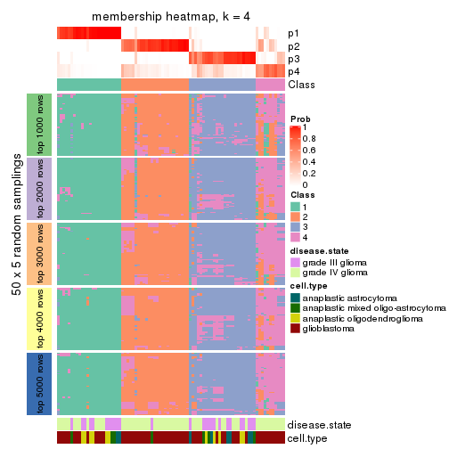</p>

</div>
<div id='tab-CV-NMF-membership-heatmap-4'>
<pre><code class="r">membership_heatmap(res, k = 5)
</code></pre>

<p></p>

</div>
<div id='tab-CV-NMF-membership-heatmap-5'>
<pre><code class="r">membership_heatmap(res, k = 6)
</code></pre>

<p></p>

</div>
</div>

As soon as we have had the classes for columns, we can look for signatures
which are significantly different between classes which can be candidate marks
for certain classes. Following are the heatmaps for signatures.


Signature heatmaps where rows are scaled:


<script>
$( function() {
	$( '#tabs-CV-NMF-get-signatures' ).tabs();
} );
</script>
<div id='tabs-CV-NMF-get-signatures'>
<ul>
<li><a href='#tab-CV-NMF-get-signatures-1'>k = 2</a></li>
<li><a href='#tab-CV-NMF-get-signatures-2'>k = 3</a></li>
<li><a href='#tab-CV-NMF-get-signatures-3'>k = 4</a></li>
<li><a href='#tab-CV-NMF-get-signatures-4'>k = 5</a></li>
<li><a href='#tab-CV-NMF-get-signatures-5'>k = 6</a></li>
</ul>
<div id='tab-CV-NMF-get-signatures-1'>
<pre><code class="r">get_signatures(res, k = 2)
</code></pre>

<p></p>

</div>
<div id='tab-CV-NMF-get-signatures-2'>
<pre><code class="r">get_signatures(res, k = 3)
</code></pre>

<p></p>

</div>
<div id='tab-CV-NMF-get-signatures-3'>
<pre><code class="r">get_signatures(res, k = 4)
</code></pre>

<p></p>

</div>
<div id='tab-CV-NMF-get-signatures-4'>
<pre><code class="r">get_signatures(res, k = 5)
</code></pre>

<p></p>

</div>
<div id='tab-CV-NMF-get-signatures-5'>
<pre><code class="r">get_signatures(res, k = 6)
</code></pre>

<p></p>

</div>
</div>


Signature heatmaps where rows are not scaled:


<script>
$( function() {
	$( '#tabs-CV-NMF-get-signatures-no-scale' ).tabs();
} );
</script>
<div id='tabs-CV-NMF-get-signatures-no-scale'>
<ul>
<li><a href='#tab-CV-NMF-get-signatures-no-scale-1'>k = 2</a></li>
<li><a href='#tab-CV-NMF-get-signatures-no-scale-2'>k = 3</a></li>
<li><a href='#tab-CV-NMF-get-signatures-no-scale-3'>k = 4</a></li>
<li><a href='#tab-CV-NMF-get-signatures-no-scale-4'>k = 5</a></li>
<li><a href='#tab-CV-NMF-get-signatures-no-scale-5'>k = 6</a></li>
</ul>
<div id='tab-CV-NMF-get-signatures-no-scale-1'>
<pre><code class="r">get_signatures(res, k = 2, scale_rows = FALSE)
</code></pre>

<p></p>

</div>
<div id='tab-CV-NMF-get-signatures-no-scale-2'>
<pre><code class="r">get_signatures(res, k = 3, scale_rows = FALSE)
</code></pre>

<p></p>

</div>
<div id='tab-CV-NMF-get-signatures-no-scale-3'>
<pre><code class="r">get_signatures(res, k = 4, scale_rows = FALSE)
</code></pre>

<p></p>

</div>
<div id='tab-CV-NMF-get-signatures-no-scale-4'>
<pre><code class="r">get_signatures(res, k = 5, scale_rows = FALSE)
</code></pre>

<p></p>

</div>
<div id='tab-CV-NMF-get-signatures-no-scale-5'>
<pre><code class="r">get_signatures(res, k = 6, scale_rows = FALSE)
</code></pre>

<p></p>

</div>
</div>


Compare the overlap of signatures from different k:

```r
compare_signatures(res)
```


`get_signature()` returns a data frame invisibly. TO get the list of signatures, the function
call should be assigned to a variable explicitly. In following code, if `plot` argument is set
to `FALSE`, no heatmap is plotted while only the differential analysis is performed.

```r
# code only for demonstration
tb = get_signature(res, k = ..., plot = FALSE)
```

An example of the output of `tb` is:

```
#>   which_row         fdr    mean_1    mean_2 scaled_mean_1 scaled_mean_2 km
#> 1        38 0.042760348  8.373488  9.131774    -0.5533452     0.5164555  1
#> 2        40 0.018707592  7.106213  8.469186    -0.6173731     0.5762149  1
#> 3        55 0.019134737 10.221463 11.207825    -0.6159697     0.5749050  1
#> 4        59 0.006059896  5.921854  7.869574    -0.6899429     0.6439467  1
#> 5        60 0.018055526  8.928898 10.211722    -0.6204761     0.5791110  1
#> 6        98 0.009384629 15.714769 14.887706     0.6635654    -0.6193277  2
...
```

The columns in `tb` are:

1. `which_row`: row indices corresponding to the input matrix.
2. `fdr`: FDR for the differential test. 
3. `mean_x`: The mean value in group x.
4. `scaled_mean_x`: The mean value in group x after rows are scaled.
5. `km`: Row groups if k-means clustering is applied to rows.


UMAP plot which shows how samples are separated.


<script>
$( function() {
	$( '#tabs-CV-NMF-dimension-reduction' ).tabs();
} );
</script>
<div id='tabs-CV-NMF-dimension-reduction'>
<ul>
<li><a href='#tab-CV-NMF-dimension-reduction-1'>k = 2</a></li>
<li><a href='#tab-CV-NMF-dimension-reduction-2'>k = 3</a></li>
<li><a href='#tab-CV-NMF-dimension-reduction-3'>k = 4</a></li>
<li><a href='#tab-CV-NMF-dimension-reduction-4'>k = 5</a></li>
<li><a href='#tab-CV-NMF-dimension-reduction-5'>k = 6</a></li>
</ul>
<div id='tab-CV-NMF-dimension-reduction-1'>
<pre><code class="r">dimension_reduction(res, k = 2, method = &quot;UMAP&quot;)
</code></pre>

<p></p>

</div>
<div id='tab-CV-NMF-dimension-reduction-2'>
<pre><code class="r">dimension_reduction(res, k = 3, method = &quot;UMAP&quot;)
</code></pre>

<p></p>

</div>
<div id='tab-CV-NMF-dimension-reduction-3'>
<pre><code class="r">dimension_reduction(res, k = 4, method = &quot;UMAP&quot;)
</code></pre>

<p></p>

</div>
<div id='tab-CV-NMF-dimension-reduction-4'>
<pre><code class="r">dimension_reduction(res, k = 5, method = &quot;UMAP&quot;)
</code></pre>

<p></p>

</div>
<div id='tab-CV-NMF-dimension-reduction-5'>
<pre><code class="r">dimension_reduction(res, k = 6, method = &quot;UMAP&quot;)
</code></pre>

<p></p>

</div>
</div>


Following heatmap shows how subgroups are split when increasing `k`:

```r
collect_classes(res)
```


Test correlation between subgroups and known annotations. If the known
annotation is numeric, one-way ANOVA test is applied, and if the known
annotation is discrete, chi-squared contingency table test is applied.

```r
test_to_known_factors(res)
```

```
#>         n disease.state(p) cell.type(p) k
#> CV:NMF 82         9.73e-04      0.00450 2
#> CV:NMF 83         2.65e-04      0.00326 3
#> CV:NMF 74         9.03e-05      0.00338 4
#> CV:NMF 61         2.37e-04      0.00794 5
#> CV:NMF 60         1.23e-03      0.03401 6
```


If matrix rows can be associated to genes, consider to use `GO_Enrichment(res,
...)` to perform function enrichment for the signature genes.


 

---------------------------------------------------


### MAD:hclust


The object with results only for a single top-value method and a single partition method 
can be extracted as:

```r
res = res_list["MAD", "hclust"]
# you can also extract it by
# res = res_list["MAD:hclust"]
```

A summary of `res` and all the functions that can be applied to it:

```r
res
```

```
#> A 'ConsensusPartition' object with k = 2, 3, 4, 5, 6.
#>   On a matrix with 21512 rows and 85 columns.
#>   Top rows (1000, 2000, 3000, 4000, 5000) are extracted by 'MAD' method.
#>   Subgroups are detected by 'hclust' method.
#>   Performed in total 1250 partitions by row resampling.
#>   Best k for subgroups seems to be 3.
#> 
#> Following methods can be applied to this 'ConsensusPartition' object:
#>  [1] "cola_report"             "collect_classes"         "collect_plots"          
#>  [4] "collect_stats"           "colnames"                "compare_signatures"     
#>  [7] "consensus_heatmap"       "dimension_reduction"     "functional_enrichment"  
#> [10] "get_anno_col"            "get_anno"                "get_classes"            
#> [13] "get_consensus"           "get_matrix"              "get_membership"         
#> [16] "get_param"               "get_signatures"          "get_stats"              
#> [19] "is_best_k"               "is_stable_k"             "membership_heatmap"     
#> [22] "ncol"                    "nrow"                    "plot_ecdf"              
#> [25] "rownames"                "select_partition_number" "show"                   
#> [28] "suggest_best_k"          "test_to_known_factors"
```

`collect_plots()` function collects all the plots made from `res` for all `k` (number of partitions)
into one single page to provide an easy and fast comparison between different `k`.

```r
collect_plots(res)
```


The plots are:

- The first row: a plot of the ECDF (Empirical cumulative distribution
  function) curves of the consensus matrix for each `k` and the heatmap of
  predicted classes for each `k`.
- The second row: heatmaps of the consensus matrix for each `k`.
- The third row: heatmaps of the membership matrix for each `k`.
- The fouth row: heatmaps of the signatures for each `k`.

All the plots in panels can be made by individual functions and they are
plotted later in this section.

`select_partition_number()` produces several plots showing different
statistics for choosing "optimized" `k`. There are following statistics:

- ECDF curves of the consensus matrix for each `k`;
- 1-PAC. [The PAC
  score](https://en.wikipedia.org/wiki/Consensus_clustering#Over-interpretation_potential_of_consensus_clustering)
  measures the proportion of the ambiguous subgrouping.
- Mean silhouette score.
- Concordance. The mean probability of fiting the consensus class ids in all
  partitions.
- Area increased. Denote $A_k$ as the area under the ECDF curve for current
  `k`, the area increased is defined as $A_k - A_{k-1}$.
- Rand index. The percent of pairs of samples that are both in a same cluster
  or both are not in a same cluster in the partition of k and k-1.
- Jaccard index. The ratio of pairs of samples are both in a same cluster in
  the partition of k and k-1 and the pairs of samples are both in a same
  cluster in the partition k or k-1.

The detailed explanations of these statistics can be found in [the cola
vignette](http://bioconductor.org/packages/devel/bioc/vignettes/cola/inst/doc/cola.html#toc_13).

Generally speaking, lower PAC score, higher mean silhouette score or higher
concordance corresponds to better partition. Rand index and Jaccard index
measure how similar the current partition is compared to partition with `k-1`.
If they are too similar, we won't accept `k` is better than `k-1`.

```r
select_partition_number(res)
```


The numeric values for all these statistics can be obtained by `get_stats()`.

```r
get_stats(res)
```

```
#>   k 1-PAC mean_silhouette concordance area_increased  Rand Jaccard
#> 2 2 0.296           0.330       0.567         0.4327 0.738   0.738
#> 3 3 0.590           0.803       0.890         0.5118 0.466   0.332
#> 4 4 0.567           0.639       0.802         0.1058 0.945   0.834
#> 5 5 0.622           0.626       0.797         0.0605 0.935   0.781
#> 6 6 0.669           0.634       0.779         0.0337 0.954   0.812
```

`suggest_best_k()` suggests the best $k$ based on these statistics. The rules are as follows:

- All $k$ with Jaccard index larger than 0.95 are removed because the increase of
  the partition number does not provides enough extra information. If all $k$ are removed,
  the best $k$ is assigned by `NA`.
- For $k$ with 1-PAC larger than 0.9, the maximal $k$ is taken as the "best k". Other $k$ is called "optional k".
- If it does not fit the second rule. The $k$ with the highest vote of highest
  1-PAC, mean silhouette and concordance is taken as the "best k".

```r
suggest_best_k(res)
```

```
#> [1] 3
```


Following shows the table of the partitions (You need to click the **show/hide
code output** link to see it). The membership matrix (columns with name `p*`)
is inferred by
[`clue::cl_consensus()`](https://www.rdocumentation.org/link/cl_consensus?package=clue)
function with the `SE` method. Basically the value in the membership matrix
represents the probability to belong to a certain group. The finall class
label for an item is determined with the group with highest probability it
belongs to.

In `get_classes()` function, the entropy is calculated from the membership
matrix and the silhouette score is calculated from the consensus matrix.


<script>
$( function() {
	$( '#tabs-MAD-hclust-get-classes' ).tabs();
} );
</script>
<div id='tabs-MAD-hclust-get-classes'>
<ul>
<li><a href='#tab-MAD-hclust-get-classes-1'>k = 2</a></li>
<li><a href='#tab-MAD-hclust-get-classes-2'>k = 3</a></li>
<li><a href='#tab-MAD-hclust-get-classes-3'>k = 4</a></li>
<li><a href='#tab-MAD-hclust-get-classes-4'>k = 5</a></li>
<li><a href='#tab-MAD-hclust-get-classes-5'>k = 6</a></li>
</ul>

<div id='tab-MAD-hclust-get-classes-1'>
<p><a id='tab-MAD-hclust-get-classes-1-a' style='color:#0366d6' href='#'>show/hide code output</a></p>
<pre><code class="r">cbind(get_classes(res, k = 2), get_membership(res, k = 2))
</code></pre>

<pre><code>#&gt;          class entropy silhouette    p1    p2
#&gt; GSM99497     1  0.0000     0.4613 1.000 0.000
#&gt; GSM99503     1  0.9977     0.5370 0.528 0.472
#&gt; GSM99505     1  0.9881     0.5437 0.564 0.436
#&gt; GSM99507     1  0.0000     0.4613 1.000 0.000
#&gt; GSM99567     1  0.0000     0.4613 1.000 0.000
#&gt; GSM99575     1  0.9977     0.5370 0.528 0.472
#&gt; GSM99593     1  0.0672     0.4604 0.992 0.008
#&gt; GSM99595     1  0.0000     0.4613 1.000 0.000
#&gt; GSM99469     1  0.9922     0.5422 0.552 0.448
#&gt; GSM99499     1  0.9881     0.5437 0.564 0.436
#&gt; GSM99501     1  0.9922     0.5422 0.552 0.448
#&gt; GSM99509     1  0.0000     0.4613 1.000 0.000
#&gt; GSM99569     1  0.0938     0.4704 0.988 0.012
#&gt; GSM99597     1  0.0000     0.4613 1.000 0.000
#&gt; GSM99601     2  0.9977     0.9967 0.472 0.528
#&gt; GSM99459     1  0.8713     0.5371 0.708 0.292
#&gt; GSM99461     1  0.5842     0.5138 0.860 0.140
#&gt; GSM99511     1  0.0000     0.4613 1.000 0.000
#&gt; GSM99513     1  0.0000     0.4613 1.000 0.000
#&gt; GSM99515     1  0.0000     0.4613 1.000 0.000
#&gt; GSM99517     1  0.9977     0.5370 0.528 0.472
#&gt; GSM99519     1  0.9000     0.5391 0.684 0.316
#&gt; GSM99521     1  0.0376     0.4644 0.996 0.004
#&gt; GSM99523     1  0.0938     0.4704 0.988 0.012
#&gt; GSM99571     1  0.9977     0.5370 0.528 0.472
#&gt; GSM99599     1  0.9977     0.5370 0.528 0.472
#&gt; GSM99433     1  0.9358    -0.5699 0.648 0.352
#&gt; GSM99435     1  0.1414     0.4553 0.980 0.020
#&gt; GSM99437     1  0.9993    -0.9104 0.516 0.484
#&gt; GSM99439     2  0.9977     0.9967 0.472 0.528
#&gt; GSM99441     1  0.9977     0.5370 0.528 0.472
#&gt; GSM99443     2  0.9977     0.9967 0.472 0.528
#&gt; GSM99445     2  0.9977     0.9967 0.472 0.528
#&gt; GSM99447     1  0.9850    -0.7839 0.572 0.428
#&gt; GSM99449     1  0.5178     0.2593 0.884 0.116
#&gt; GSM99451     1  0.1633     0.4762 0.976 0.024
#&gt; GSM99453     1  0.9977     0.5370 0.528 0.472
#&gt; GSM99455     1  0.9977     0.5370 0.528 0.472
#&gt; GSM99457     1  0.9977     0.5370 0.528 0.472
#&gt; GSM99463     2  0.9977     0.9967 0.472 0.528
#&gt; GSM99465     1  0.5519     0.5111 0.872 0.128
#&gt; GSM99467     1  0.9608    -0.6366 0.616 0.384
#&gt; GSM99471     1  0.9775     0.5434 0.588 0.412
#&gt; GSM99473     1  0.9795     0.5437 0.584 0.416
#&gt; GSM99475     1  0.0938     0.4695 0.988 0.012
#&gt; GSM99477     1  0.9754    -0.7116 0.592 0.408
#&gt; GSM99479     1  0.9661    -0.6575 0.608 0.392
#&gt; GSM99481     1  0.9977     0.5370 0.528 0.472
#&gt; GSM99483     1  0.9977     0.5370 0.528 0.472
#&gt; GSM99485     1  0.9795    -0.6102 0.584 0.416
#&gt; GSM99487     1  0.9993    -0.9104 0.516 0.484
#&gt; GSM99489     2  0.9977     0.9967 0.472 0.528
#&gt; GSM99491     1  0.9988    -0.8637 0.520 0.480
#&gt; GSM99493     1  0.9977     0.5370 0.528 0.472
#&gt; GSM99495     2  0.9977     0.9967 0.472 0.528
#&gt; GSM99525     1  0.9909     0.5428 0.556 0.444
#&gt; GSM99527     1  0.3879     0.4929 0.924 0.076
#&gt; GSM99529     1  0.8861    -0.2666 0.696 0.304
#&gt; GSM99531     1  0.1184     0.4718 0.984 0.016
#&gt; GSM99533     1  0.1843     0.4781 0.972 0.028
#&gt; GSM99535     1  0.9393     0.1188 0.644 0.356
#&gt; GSM99537     1  0.9977     0.5370 0.528 0.472
#&gt; GSM99539     1  0.6973     0.0299 0.812 0.188
#&gt; GSM99541     1  0.9944     0.5407 0.544 0.456
#&gt; GSM99543     1  0.9993    -0.7556 0.516 0.484
#&gt; GSM99545     1  0.6801     0.0590 0.820 0.180
#&gt; GSM99547     1  0.6048     0.5054 0.852 0.148
#&gt; GSM99549     2  0.9977     0.9967 0.472 0.528
#&gt; GSM99551     1  0.9933     0.5399 0.548 0.452
#&gt; GSM99553     1  0.2603     0.3982 0.956 0.044
#&gt; GSM99555     2  0.9977     0.9967 0.472 0.528
#&gt; GSM99557     2  0.9993     0.9773 0.484 0.516
#&gt; GSM99559     1  0.5178     0.2593 0.884 0.116
#&gt; GSM99561     1  0.9993    -0.9025 0.516 0.484
#&gt; GSM99563     1  0.0000     0.4613 1.000 0.000
#&gt; GSM99565     2  0.9977     0.9967 0.472 0.528
#&gt; GSM99573     2  0.9977     0.9967 0.472 0.528
#&gt; GSM99577     1  0.9933     0.5413 0.548 0.452
#&gt; GSM99579     1  0.9983    -0.8318 0.524 0.476
#&gt; GSM99581     1  0.2603     0.3978 0.956 0.044
#&gt; GSM99583     1  0.9393    -0.3866 0.644 0.356
#&gt; GSM99585     1  0.9909    -0.8078 0.556 0.444
#&gt; GSM99587     1  0.9977     0.5370 0.528 0.472
#&gt; GSM99589     1  0.9710    -0.6796 0.600 0.400
#&gt; GSM99591     2  0.9988     0.9840 0.480 0.520
</code></pre>

<script>
$('#tab-MAD-hclust-get-classes-1-a').parent().next().next().hide();
$('#tab-MAD-hclust-get-classes-1-a').click(function(){
  $('#tab-MAD-hclust-get-classes-1-a').parent().next().next().toggle();
  return(false);
});
</script>
</div>

<div id='tab-MAD-hclust-get-classes-2'>
<p><a id='tab-MAD-hclust-get-classes-2-a' style='color:#0366d6' href='#'>show/hide code output</a></p>
<pre><code class="r">cbind(get_classes(res, k = 3), get_membership(res, k = 3))
</code></pre>

<pre><code>#&gt;          class entropy silhouette    p1    p2    p3
#&gt; GSM99497     3  0.0000     0.9032 0.000 0.000 1.000
#&gt; GSM99503     1  0.0000     0.9250 1.000 0.000 0.000
#&gt; GSM99505     1  0.3619     0.8559 0.864 0.000 0.136
#&gt; GSM99507     3  0.0000     0.9032 0.000 0.000 1.000
#&gt; GSM99567     3  0.0000     0.9032 0.000 0.000 1.000
#&gt; GSM99575     1  0.0000     0.9250 1.000 0.000 0.000
#&gt; GSM99593     3  0.0475     0.9030 0.004 0.004 0.992
#&gt; GSM99595     3  0.0000     0.9032 0.000 0.000 1.000
#&gt; GSM99469     1  0.2878     0.8880 0.904 0.000 0.096
#&gt; GSM99499     1  0.3619     0.8559 0.864 0.000 0.136
#&gt; GSM99501     1  0.2878     0.8880 0.904 0.000 0.096
#&gt; GSM99509     3  0.0000     0.9032 0.000 0.000 1.000
#&gt; GSM99569     3  0.0747     0.9019 0.016 0.000 0.984
#&gt; GSM99597     3  0.0000     0.9032 0.000 0.000 1.000
#&gt; GSM99601     2  0.1289     0.8163 0.000 0.968 0.032
#&gt; GSM99459     3  0.6302     0.0274 0.480 0.000 0.520
#&gt; GSM99461     3  0.4452     0.7524 0.192 0.000 0.808
#&gt; GSM99511     3  0.0000     0.9032 0.000 0.000 1.000
#&gt; GSM99513     3  0.0000     0.9032 0.000 0.000 1.000
#&gt; GSM99515     3  0.0000     0.9032 0.000 0.000 1.000
#&gt; GSM99517     1  0.0000     0.9250 1.000 0.000 0.000
#&gt; GSM99519     1  0.6307     0.0248 0.512 0.000 0.488
#&gt; GSM99521     3  0.0424     0.9030 0.008 0.000 0.992
#&gt; GSM99523     3  0.0747     0.9019 0.016 0.000 0.984
#&gt; GSM99571     1  0.0000     0.9250 1.000 0.000 0.000
#&gt; GSM99599     1  0.0000     0.9250 1.000 0.000 0.000
#&gt; GSM99433     2  0.6252     0.4186 0.000 0.556 0.444
#&gt; GSM99435     3  0.1015     0.9006 0.008 0.012 0.980
#&gt; GSM99437     2  0.4291     0.7871 0.000 0.820 0.180
#&gt; GSM99439     2  0.0000     0.8102 0.000 1.000 0.000
#&gt; GSM99441     1  0.0000     0.9250 1.000 0.000 0.000
#&gt; GSM99443     2  0.0000     0.8102 0.000 1.000 0.000
#&gt; GSM99445     2  0.0000     0.8102 0.000 1.000 0.000
#&gt; GSM99447     2  0.5623     0.7128 0.004 0.716 0.280
#&gt; GSM99449     3  0.4062     0.7578 0.000 0.164 0.836
#&gt; GSM99451     3  0.1529     0.8909 0.040 0.000 0.960
#&gt; GSM99453     1  0.0000     0.9250 1.000 0.000 0.000
#&gt; GSM99455     1  0.0000     0.9250 1.000 0.000 0.000
#&gt; GSM99457     1  0.0000     0.9250 1.000 0.000 0.000
#&gt; GSM99463     2  0.0000     0.8102 0.000 1.000 0.000
#&gt; GSM99465     3  0.4121     0.7788 0.168 0.000 0.832
#&gt; GSM99467     2  0.6543     0.6345 0.016 0.640 0.344
#&gt; GSM99471     1  0.4270     0.8508 0.860 0.024 0.116
#&gt; GSM99473     1  0.4099     0.8366 0.852 0.008 0.140
#&gt; GSM99475     3  0.0747     0.9015 0.016 0.000 0.984
#&gt; GSM99477     2  0.6033     0.6470 0.004 0.660 0.336
#&gt; GSM99479     2  0.6448     0.6246 0.012 0.636 0.352
#&gt; GSM99481     1  0.0000     0.9250 1.000 0.000 0.000
#&gt; GSM99483     1  0.0000     0.9250 1.000 0.000 0.000
#&gt; GSM99485     2  0.7076     0.7019 0.060 0.684 0.256
#&gt; GSM99487     2  0.4291     0.7871 0.000 0.820 0.180
#&gt; GSM99489     2  0.0000     0.8102 0.000 1.000 0.000
#&gt; GSM99491     2  0.3610     0.8101 0.016 0.888 0.096
#&gt; GSM99493     1  0.0000     0.9250 1.000 0.000 0.000
#&gt; GSM99495     2  0.0000     0.8102 0.000 1.000 0.000
#&gt; GSM99525     1  0.2682     0.8941 0.920 0.004 0.076
#&gt; GSM99527     3  0.3272     0.8391 0.104 0.004 0.892
#&gt; GSM99529     2  0.7708     0.4406 0.048 0.528 0.424
#&gt; GSM99531     3  0.0892     0.9003 0.020 0.000 0.980
#&gt; GSM99533     3  0.1643     0.8885 0.044 0.000 0.956
#&gt; GSM99535     2  0.9836     0.3259 0.268 0.420 0.312
#&gt; GSM99537     1  0.0592     0.9225 0.988 0.000 0.012
#&gt; GSM99539     3  0.4654     0.6791 0.000 0.208 0.792
#&gt; GSM99541     1  0.2625     0.8948 0.916 0.000 0.084
#&gt; GSM99543     2  0.5093     0.7781 0.076 0.836 0.088
#&gt; GSM99545     3  0.4452     0.7114 0.000 0.192 0.808
#&gt; GSM99547     3  0.5726     0.7109 0.216 0.024 0.760
#&gt; GSM99549     2  0.0237     0.8116 0.000 0.996 0.004
#&gt; GSM99551     1  0.3832     0.8674 0.880 0.020 0.100
#&gt; GSM99553     3  0.2448     0.8508 0.000 0.076 0.924
#&gt; GSM99555     2  0.2796     0.8158 0.000 0.908 0.092
#&gt; GSM99557     2  0.1411     0.8166 0.000 0.964 0.036
#&gt; GSM99559     3  0.4062     0.7578 0.000 0.164 0.836
#&gt; GSM99561     2  0.3272     0.8167 0.004 0.892 0.104
#&gt; GSM99563     3  0.0000     0.9032 0.000 0.000 1.000
#&gt; GSM99565     2  0.2796     0.8158 0.000 0.908 0.092
#&gt; GSM99573     2  0.0237     0.8116 0.000 0.996 0.004
#&gt; GSM99577     1  0.3116     0.8795 0.892 0.000 0.108
#&gt; GSM99579     2  0.4873     0.7949 0.024 0.824 0.152
#&gt; GSM99581     3  0.2448     0.8507 0.000 0.076 0.924
#&gt; GSM99583     2  0.8130     0.4724 0.072 0.528 0.400
#&gt; GSM99585     2  0.5553     0.7230 0.004 0.724 0.272
#&gt; GSM99587     1  0.0000     0.9250 1.000 0.000 0.000
#&gt; GSM99589     2  0.6172     0.6769 0.012 0.680 0.308
#&gt; GSM99591     2  0.0592     0.8116 0.000 0.988 0.012
</code></pre>

<script>
$('#tab-MAD-hclust-get-classes-2-a').parent().next().next().hide();
$('#tab-MAD-hclust-get-classes-2-a').click(function(){
  $('#tab-MAD-hclust-get-classes-2-a').parent().next().next().toggle();
  return(false);
});
</script>
</div>

<div id='tab-MAD-hclust-get-classes-3'>
<p><a id='tab-MAD-hclust-get-classes-3-a' style='color:#0366d6' href='#'>show/hide code output</a></p>
<pre><code class="r">cbind(get_classes(res, k = 4), get_membership(res, k = 4))
</code></pre>

<pre><code>#&gt;          class entropy silhouette    p1    p2    p3    p4
#&gt; GSM99497     3  0.0188     0.8632 0.000 0.004 0.996 0.000
#&gt; GSM99503     1  0.0000     0.9024 1.000 0.000 0.000 0.000
#&gt; GSM99505     1  0.3745     0.8448 0.852 0.000 0.088 0.060
#&gt; GSM99507     3  0.0188     0.8632 0.000 0.004 0.996 0.000
#&gt; GSM99567     3  0.0188     0.8632 0.000 0.004 0.996 0.000
#&gt; GSM99575     1  0.0000     0.9024 1.000 0.000 0.000 0.000
#&gt; GSM99593     3  0.0779     0.8632 0.000 0.016 0.980 0.004
#&gt; GSM99595     3  0.0188     0.8632 0.000 0.004 0.996 0.000
#&gt; GSM99469     1  0.3009     0.8686 0.892 0.000 0.056 0.052
#&gt; GSM99499     1  0.3745     0.8448 0.852 0.000 0.088 0.060
#&gt; GSM99501     1  0.3009     0.8686 0.892 0.000 0.056 0.052
#&gt; GSM99509     3  0.1661     0.8571 0.000 0.004 0.944 0.052
#&gt; GSM99569     3  0.1489     0.8587 0.004 0.000 0.952 0.044
#&gt; GSM99597     3  0.2654     0.8371 0.000 0.004 0.888 0.108
#&gt; GSM99601     2  0.3873     0.0797 0.000 0.772 0.000 0.228
#&gt; GSM99459     1  0.8321     0.0335 0.404 0.028 0.372 0.196
#&gt; GSM99461     3  0.7498     0.6138 0.108 0.052 0.604 0.236
#&gt; GSM99511     3  0.0000     0.8630 0.000 0.000 1.000 0.000
#&gt; GSM99513     3  0.0000     0.8630 0.000 0.000 1.000 0.000
#&gt; GSM99515     3  0.0188     0.8632 0.000 0.004 0.996 0.000
#&gt; GSM99517     1  0.0000     0.9024 1.000 0.000 0.000 0.000
#&gt; GSM99519     1  0.8161     0.1537 0.444 0.024 0.344 0.188
#&gt; GSM99521     3  0.0967     0.8638 0.004 0.004 0.976 0.016
#&gt; GSM99523     3  0.1489     0.8587 0.004 0.000 0.952 0.044
#&gt; GSM99571     1  0.0000     0.9024 1.000 0.000 0.000 0.000
#&gt; GSM99599     1  0.0000     0.9024 1.000 0.000 0.000 0.000
#&gt; GSM99433     2  0.5517     0.3962 0.000 0.648 0.316 0.036
#&gt; GSM99435     3  0.3088     0.8462 0.000 0.052 0.888 0.060
#&gt; GSM99437     2  0.2300     0.4911 0.000 0.920 0.064 0.016
#&gt; GSM99439     2  0.5000    -0.7959 0.000 0.504 0.000 0.496
#&gt; GSM99441     1  0.0000     0.9024 1.000 0.000 0.000 0.000
#&gt; GSM99443     2  0.4697    -0.3721 0.000 0.644 0.000 0.356
#&gt; GSM99445     2  0.4697    -0.3721 0.000 0.644 0.000 0.356
#&gt; GSM99447     2  0.4290     0.5033 0.000 0.800 0.164 0.036
#&gt; GSM99449     3  0.4399     0.7044 0.000 0.224 0.760 0.016
#&gt; GSM99451     3  0.3138     0.8494 0.024 0.020 0.896 0.060
#&gt; GSM99453     1  0.0000     0.9024 1.000 0.000 0.000 0.000
#&gt; GSM99455     1  0.0000     0.9024 1.000 0.000 0.000 0.000
#&gt; GSM99457     1  0.0707     0.8978 0.980 0.000 0.000 0.020
#&gt; GSM99463     4  0.4981     0.8471 0.000 0.464 0.000 0.536
#&gt; GSM99465     3  0.7203     0.6422 0.084 0.052 0.624 0.240
#&gt; GSM99467     2  0.5143     0.5082 0.000 0.752 0.172 0.076
#&gt; GSM99471     1  0.4331     0.8265 0.832 0.020 0.040 0.108
#&gt; GSM99473     1  0.4620     0.8217 0.824 0.024 0.080 0.072
#&gt; GSM99475     3  0.3736     0.8246 0.004 0.024 0.844 0.128
#&gt; GSM99477     2  0.4500     0.5073 0.000 0.776 0.192 0.032
#&gt; GSM99479     2  0.5030     0.5057 0.000 0.752 0.188 0.060
#&gt; GSM99481     1  0.0000     0.9024 1.000 0.000 0.000 0.000
#&gt; GSM99483     1  0.0000     0.9024 1.000 0.000 0.000 0.000
#&gt; GSM99485     2  0.6347     0.4421 0.028 0.688 0.076 0.208
#&gt; GSM99487     2  0.2300     0.4911 0.000 0.920 0.064 0.016
#&gt; GSM99489     4  0.4967     0.8583 0.000 0.452 0.000 0.548
#&gt; GSM99491     2  0.4741     0.0604 0.000 0.668 0.004 0.328
#&gt; GSM99493     1  0.0000     0.9024 1.000 0.000 0.000 0.000
#&gt; GSM99495     4  0.4955     0.8625 0.000 0.444 0.000 0.556
#&gt; GSM99525     1  0.3225     0.8655 0.892 0.016 0.032 0.060
#&gt; GSM99527     3  0.6411     0.7317 0.048 0.080 0.708 0.164
#&gt; GSM99529     2  0.7392     0.3923 0.008 0.560 0.204 0.228
#&gt; GSM99531     3  0.3992     0.7938 0.004 0.008 0.800 0.188
#&gt; GSM99533     3  0.4386     0.8204 0.024 0.028 0.824 0.124
#&gt; GSM99535     2  0.9167     0.2368 0.220 0.452 0.116 0.212
#&gt; GSM99537     1  0.0657     0.8995 0.984 0.000 0.004 0.012
#&gt; GSM99539     3  0.6308     0.5841 0.000 0.232 0.648 0.120
#&gt; GSM99541     1  0.2578     0.8763 0.912 0.000 0.052 0.036
#&gt; GSM99543     4  0.5720     0.5881 0.052 0.296 0.000 0.652
#&gt; GSM99545     3  0.6084     0.6273 0.000 0.204 0.676 0.120
#&gt; GSM99547     3  0.8166     0.5665 0.152 0.112 0.584 0.152
#&gt; GSM99549     4  0.4961     0.8501 0.000 0.448 0.000 0.552
#&gt; GSM99551     1  0.4226     0.8329 0.844 0.028 0.040 0.088
#&gt; GSM99553     3  0.3554     0.7963 0.000 0.136 0.844 0.020
#&gt; GSM99555     2  0.2563     0.4020 0.000 0.908 0.020 0.072
#&gt; GSM99557     2  0.4605    -0.2265 0.000 0.664 0.000 0.336
#&gt; GSM99559     3  0.4399     0.7044 0.000 0.224 0.760 0.016
#&gt; GSM99561     2  0.5069     0.0391 0.000 0.664 0.016 0.320
#&gt; GSM99563     3  0.0000     0.8630 0.000 0.000 1.000 0.000
#&gt; GSM99565     2  0.2563     0.4020 0.000 0.908 0.020 0.072
#&gt; GSM99573     4  0.4961     0.8522 0.000 0.448 0.000 0.552
#&gt; GSM99577     1  0.3071     0.8640 0.888 0.000 0.068 0.044
#&gt; GSM99579     2  0.4194     0.3663 0.000 0.764 0.008 0.228
#&gt; GSM99581     3  0.3280     0.8017 0.000 0.124 0.860 0.016
#&gt; GSM99583     2  0.7323     0.4485 0.040 0.628 0.184 0.148
#&gt; GSM99585     2  0.3695     0.5131 0.000 0.828 0.156 0.016
#&gt; GSM99587     1  0.0000     0.9024 1.000 0.000 0.000 0.000
#&gt; GSM99589     2  0.6621     0.4323 0.000 0.628 0.188 0.184
#&gt; GSM99591     2  0.4661    -0.3013 0.000 0.652 0.000 0.348
</code></pre>

<script>
$('#tab-MAD-hclust-get-classes-3-a').parent().next().next().hide();
$('#tab-MAD-hclust-get-classes-3-a').click(function(){
  $('#tab-MAD-hclust-get-classes-3-a').parent().next().next().toggle();
  return(false);
});
</script>
</div>

<div id='tab-MAD-hclust-get-classes-4'>
<p><a id='tab-MAD-hclust-get-classes-4-a' style='color:#0366d6' href='#'>show/hide code output</a></p>
<pre><code class="r">cbind(get_classes(res, k = 5), get_membership(res, k = 5))
</code></pre>

<pre><code>#&gt;          class entropy silhouette    p1    p2    p3    p4    p5
#&gt; GSM99497     3  0.0324     0.7393 0.000 0.004 0.992 0.004 0.000
#&gt; GSM99503     1  0.0000     0.9156 1.000 0.000 0.000 0.000 0.000
#&gt; GSM99505     1  0.3301     0.7981 0.848 0.000 0.072 0.080 0.000
#&gt; GSM99507     3  0.0324     0.7393 0.000 0.004 0.992 0.004 0.000
#&gt; GSM99567     3  0.0324     0.7393 0.000 0.004 0.992 0.004 0.000
#&gt; GSM99575     1  0.0000     0.9156 1.000 0.000 0.000 0.000 0.000
#&gt; GSM99593     3  0.1117     0.7372 0.000 0.016 0.964 0.020 0.000
#&gt; GSM99595     3  0.0324     0.7393 0.000 0.004 0.992 0.004 0.000
#&gt; GSM99469     1  0.2645     0.8434 0.888 0.000 0.044 0.068 0.000
#&gt; GSM99499     1  0.3301     0.7981 0.848 0.000 0.072 0.080 0.000
#&gt; GSM99501     1  0.2645     0.8434 0.888 0.000 0.044 0.068 0.000
#&gt; GSM99509     3  0.2719     0.6647 0.000 0.004 0.852 0.144 0.000
#&gt; GSM99569     3  0.1410     0.7180 0.000 0.000 0.940 0.060 0.000
#&gt; GSM99597     3  0.3814     0.5235 0.000 0.004 0.720 0.276 0.000
#&gt; GSM99601     2  0.4528     0.0997 0.000 0.548 0.000 0.008 0.444
#&gt; GSM99459     4  0.6806     0.5241 0.356 0.020 0.160 0.464 0.000
#&gt; GSM99461     4  0.5815     0.4973 0.048 0.036 0.316 0.600 0.000
#&gt; GSM99511     3  0.0000     0.7384 0.000 0.000 1.000 0.000 0.000
#&gt; GSM99513     3  0.0000     0.7384 0.000 0.000 1.000 0.000 0.000
#&gt; GSM99515     3  0.0162     0.7385 0.000 0.004 0.996 0.000 0.000
#&gt; GSM99517     1  0.0000     0.9156 1.000 0.000 0.000 0.000 0.000
#&gt; GSM99519     4  0.6917     0.4420 0.404 0.020 0.172 0.404 0.000
#&gt; GSM99521     3  0.1740     0.7300 0.000 0.012 0.932 0.056 0.000
#&gt; GSM99523     3  0.1410     0.7180 0.000 0.000 0.940 0.060 0.000
#&gt; GSM99571     1  0.0000     0.9156 1.000 0.000 0.000 0.000 0.000
#&gt; GSM99599     1  0.0000     0.9156 1.000 0.000 0.000 0.000 0.000
#&gt; GSM99433     2  0.6542     0.5213 0.000 0.592 0.248 0.056 0.104
#&gt; GSM99435     3  0.4226     0.6176 0.000 0.060 0.764 0.176 0.000
#&gt; GSM99437     2  0.4021     0.6283 0.000 0.800 0.036 0.016 0.148
#&gt; GSM99439     5  0.2773     0.6768 0.000 0.112 0.000 0.020 0.868
#&gt; GSM99441     1  0.0000     0.9156 1.000 0.000 0.000 0.000 0.000
#&gt; GSM99443     5  0.4264     0.3824 0.000 0.376 0.000 0.004 0.620
#&gt; GSM99445     5  0.4264     0.3824 0.000 0.376 0.000 0.004 0.620
#&gt; GSM99447     2  0.5291     0.6365 0.000 0.724 0.120 0.028 0.128
#&gt; GSM99449     3  0.5172     0.5570 0.000 0.204 0.712 0.044 0.040
#&gt; GSM99451     3  0.4305     0.6101 0.008 0.040 0.760 0.192 0.000
#&gt; GSM99453     1  0.0000     0.9156 1.000 0.000 0.000 0.000 0.000
#&gt; GSM99455     1  0.0000     0.9156 1.000 0.000 0.000 0.000 0.000
#&gt; GSM99457     1  0.0794     0.9035 0.972 0.000 0.000 0.028 0.000
#&gt; GSM99463     5  0.1877     0.6944 0.000 0.064 0.000 0.012 0.924
#&gt; GSM99465     4  0.5423     0.4536 0.024 0.036 0.324 0.616 0.000
#&gt; GSM99467     2  0.4940     0.6438 0.000 0.764 0.112 0.068 0.056
#&gt; GSM99471     1  0.4445     0.7273 0.792 0.080 0.016 0.108 0.004
#&gt; GSM99473     1  0.4624     0.7163 0.792 0.048 0.056 0.100 0.004
#&gt; GSM99475     3  0.5269     0.5260 0.000 0.072 0.648 0.276 0.004
#&gt; GSM99477     2  0.5695     0.6422 0.000 0.708 0.128 0.072 0.092
#&gt; GSM99479     2  0.5188     0.6421 0.000 0.744 0.128 0.064 0.064
#&gt; GSM99481     1  0.0000     0.9156 1.000 0.000 0.000 0.000 0.000
#&gt; GSM99483     1  0.0000     0.9156 1.000 0.000 0.000 0.000 0.000
#&gt; GSM99485     2  0.4671     0.5693 0.008 0.780 0.016 0.112 0.084
#&gt; GSM99487     2  0.4021     0.6283 0.000 0.800 0.036 0.016 0.148
#&gt; GSM99489     5  0.0992     0.6948 0.000 0.024 0.000 0.008 0.968
#&gt; GSM99491     2  0.4686     0.0713 0.000 0.596 0.000 0.020 0.384
#&gt; GSM99493     1  0.0000     0.9156 1.000 0.000 0.000 0.000 0.000
#&gt; GSM99495     5  0.1106     0.6936 0.000 0.024 0.000 0.012 0.964
#&gt; GSM99525     1  0.3326     0.8131 0.860 0.044 0.016 0.080 0.000
#&gt; GSM99527     3  0.5900    -0.0760 0.008 0.076 0.468 0.448 0.000
#&gt; GSM99529     2  0.6085     0.5073 0.000 0.652 0.104 0.196 0.048
#&gt; GSM99531     3  0.4648     0.2000 0.000 0.012 0.524 0.464 0.000
#&gt; GSM99533     3  0.5542     0.5009 0.008 0.068 0.632 0.288 0.004
#&gt; GSM99535     2  0.7875     0.2911 0.168 0.532 0.056 0.192 0.052
#&gt; GSM99537     1  0.0510     0.9094 0.984 0.000 0.000 0.016 0.000
#&gt; GSM99539     3  0.7308     0.3342 0.000 0.264 0.492 0.188 0.056
#&gt; GSM99541     1  0.2228     0.8638 0.912 0.000 0.040 0.048 0.000
#&gt; GSM99543     5  0.4752     0.5427 0.044 0.124 0.000 0.060 0.772
#&gt; GSM99545     3  0.7220     0.3742 0.000 0.232 0.520 0.188 0.060
#&gt; GSM99547     3  0.7571    -0.2859 0.104 0.116 0.412 0.368 0.000
#&gt; GSM99549     5  0.2504     0.6838 0.000 0.064 0.000 0.040 0.896
#&gt; GSM99551     1  0.3849     0.7460 0.808 0.052 0.004 0.136 0.000
#&gt; GSM99553     3  0.3355     0.6667 0.000 0.132 0.832 0.036 0.000
#&gt; GSM99555     2  0.4074     0.5544 0.000 0.752 0.012 0.012 0.224
#&gt; GSM99557     5  0.4410     0.2207 0.000 0.440 0.000 0.004 0.556
#&gt; GSM99559     3  0.5172     0.5570 0.000 0.204 0.712 0.044 0.040
#&gt; GSM99561     2  0.5443     0.0520 0.000 0.504 0.000 0.060 0.436
#&gt; GSM99563     3  0.0000     0.7384 0.000 0.000 1.000 0.000 0.000
#&gt; GSM99565     2  0.4074     0.5544 0.000 0.752 0.012 0.012 0.224
#&gt; GSM99573     5  0.2569     0.6842 0.000 0.068 0.000 0.040 0.892
#&gt; GSM99577     1  0.2806     0.8414 0.888 0.008 0.052 0.052 0.000
#&gt; GSM99579     2  0.3760     0.5068 0.000 0.784 0.000 0.028 0.188
#&gt; GSM99581     3  0.3051     0.6756 0.000 0.120 0.852 0.028 0.000
#&gt; GSM99583     2  0.5179     0.5892 0.008 0.728 0.116 0.140 0.008
#&gt; GSM99585     2  0.4905     0.6473 0.000 0.760 0.104 0.032 0.104
#&gt; GSM99587     1  0.0000     0.9156 1.000 0.000 0.000 0.000 0.000
#&gt; GSM99589     2  0.6639     0.4951 0.000 0.592 0.136 0.052 0.220
#&gt; GSM99591     5  0.4350     0.3043 0.000 0.408 0.000 0.004 0.588
</code></pre>

<script>
$('#tab-MAD-hclust-get-classes-4-a').parent().next().next().hide();
$('#tab-MAD-hclust-get-classes-4-a').click(function(){
  $('#tab-MAD-hclust-get-classes-4-a').parent().next().next().toggle();
  return(false);
});
</script>
</div>

<div id='tab-MAD-hclust-get-classes-5'>
<p><a id='tab-MAD-hclust-get-classes-5-a' style='color:#0366d6' href='#'>show/hide code output</a></p>
<pre><code class="r">cbind(get_classes(res, k = 6), get_membership(res, k = 6))
</code></pre>

<pre><code>#&gt;          class entropy silhouette    p1    p2    p3    p4    p5    p6
#&gt; GSM99497     3  0.0291     0.7826 0.000 0.004 0.992 0.000 0.000 0.004
#&gt; GSM99503     1  0.0000     0.9086 1.000 0.000 0.000 0.000 0.000 0.000
#&gt; GSM99505     1  0.3233     0.8081 0.832 0.000 0.060 0.104 0.000 0.004
#&gt; GSM99507     3  0.0291     0.7826 0.000 0.004 0.992 0.000 0.000 0.004
#&gt; GSM99567     3  0.0291     0.7826 0.000 0.004 0.992 0.000 0.000 0.004
#&gt; GSM99575     1  0.0000     0.9086 1.000 0.000 0.000 0.000 0.000 0.000
#&gt; GSM99593     3  0.1452     0.7671 0.000 0.020 0.948 0.012 0.000 0.020
#&gt; GSM99595     3  0.0291     0.7826 0.000 0.004 0.992 0.000 0.000 0.004
#&gt; GSM99469     1  0.2651     0.8446 0.872 0.000 0.036 0.088 0.000 0.004
#&gt; GSM99499     1  0.3233     0.8081 0.832 0.000 0.060 0.104 0.000 0.004
#&gt; GSM99501     1  0.2651     0.8446 0.872 0.000 0.036 0.088 0.000 0.004
#&gt; GSM99509     3  0.3535     0.5876 0.000 0.004 0.800 0.144 0.000 0.052
#&gt; GSM99569     3  0.1327     0.7486 0.000 0.000 0.936 0.064 0.000 0.000
#&gt; GSM99597     3  0.5028     0.3072 0.000 0.004 0.636 0.248 0.000 0.112
#&gt; GSM99601     2  0.4348     0.0840 0.000 0.560 0.000 0.000 0.416 0.024
#&gt; GSM99459     4  0.5162     0.3742 0.336 0.008 0.080 0.576 0.000 0.000
#&gt; GSM99461     4  0.3883     0.4885 0.024 0.020 0.196 0.760 0.000 0.000
#&gt; GSM99511     3  0.0000     0.7819 0.000 0.000 1.000 0.000 0.000 0.000
#&gt; GSM99513     3  0.0000     0.7819 0.000 0.000 1.000 0.000 0.000 0.000
#&gt; GSM99515     3  0.0146     0.7820 0.000 0.004 0.996 0.000 0.000 0.000
#&gt; GSM99517     1  0.0000     0.9086 1.000 0.000 0.000 0.000 0.000 0.000
#&gt; GSM99519     4  0.5658     0.2992 0.380 0.012 0.112 0.496 0.000 0.000
#&gt; GSM99521     3  0.2434     0.7256 0.000 0.016 0.896 0.056 0.000 0.032
#&gt; GSM99523     3  0.1327     0.7486 0.000 0.000 0.936 0.064 0.000 0.000
#&gt; GSM99571     1  0.0146     0.9080 0.996 0.000 0.000 0.000 0.000 0.004
#&gt; GSM99599     1  0.0000     0.9086 1.000 0.000 0.000 0.000 0.000 0.000
#&gt; GSM99433     2  0.5646     0.4676 0.000 0.660 0.180 0.020 0.032 0.108
#&gt; GSM99435     3  0.4995     0.3956 0.000 0.044 0.704 0.164 0.000 0.088
#&gt; GSM99437     2  0.2775     0.6517 0.000 0.884 0.016 0.012 0.060 0.028
#&gt; GSM99439     5  0.3249     0.6696 0.000 0.096 0.000 0.008 0.836 0.060
#&gt; GSM99441     1  0.0000     0.9086 1.000 0.000 0.000 0.000 0.000 0.000
#&gt; GSM99443     5  0.3965     0.3914 0.000 0.388 0.000 0.000 0.604 0.008
#&gt; GSM99445     5  0.3965     0.3914 0.000 0.388 0.000 0.000 0.604 0.008
#&gt; GSM99447     2  0.4196     0.6553 0.000 0.796 0.092 0.012 0.060 0.040
#&gt; GSM99449     3  0.4930     0.3885 0.000 0.248 0.676 0.028 0.012 0.036
#&gt; GSM99451     3  0.5000     0.2770 0.000 0.012 0.672 0.192 0.000 0.124
#&gt; GSM99453     1  0.0000     0.9086 1.000 0.000 0.000 0.000 0.000 0.000
#&gt; GSM99455     1  0.0000     0.9086 1.000 0.000 0.000 0.000 0.000 0.000
#&gt; GSM99457     1  0.2074     0.8777 0.912 0.004 0.000 0.036 0.000 0.048
#&gt; GSM99463     5  0.2250     0.6888 0.000 0.064 0.000 0.000 0.896 0.040
#&gt; GSM99465     4  0.3455     0.4720 0.000 0.020 0.200 0.776 0.000 0.004
#&gt; GSM99467     2  0.4087     0.6582 0.000 0.796 0.092 0.036 0.004 0.072
#&gt; GSM99471     1  0.4534     0.7286 0.764 0.028 0.004 0.068 0.008 0.128
#&gt; GSM99473     1  0.4556     0.7327 0.772 0.016 0.040 0.092 0.000 0.080
#&gt; GSM99475     6  0.6152     0.6795 0.000 0.036 0.420 0.120 0.000 0.424
#&gt; GSM99477     2  0.4311     0.6554 0.000 0.788 0.104 0.048 0.016 0.044
#&gt; GSM99479     2  0.4024     0.6541 0.000 0.800 0.100 0.040 0.004 0.056
#&gt; GSM99481     1  0.0000     0.9086 1.000 0.000 0.000 0.000 0.000 0.000
#&gt; GSM99483     1  0.0260     0.9077 0.992 0.000 0.000 0.000 0.000 0.008
#&gt; GSM99485     2  0.5076     0.5836 0.000 0.692 0.000 0.052 0.072 0.184
#&gt; GSM99487     2  0.2775     0.6517 0.000 0.884 0.016 0.012 0.060 0.028
#&gt; GSM99489     5  0.1418     0.6883 0.000 0.032 0.000 0.000 0.944 0.024
#&gt; GSM99491     2  0.5260     0.1424 0.000 0.552 0.000 0.008 0.356 0.084
#&gt; GSM99493     1  0.1010     0.8982 0.960 0.000 0.000 0.004 0.000 0.036
#&gt; GSM99495     5  0.1564     0.6873 0.000 0.024 0.000 0.000 0.936 0.040
#&gt; GSM99525     1  0.3380     0.8112 0.840 0.016 0.004 0.060 0.000 0.080
#&gt; GSM99527     4  0.5856     0.1977 0.000 0.048 0.356 0.520 0.000 0.076
#&gt; GSM99529     2  0.6780     0.5170 0.000 0.564 0.052 0.152 0.044 0.188
#&gt; GSM99531     4  0.5977    -0.0419 0.000 0.004 0.296 0.476 0.000 0.224
#&gt; GSM99533     6  0.6174     0.6636 0.000 0.020 0.408 0.164 0.000 0.408
#&gt; GSM99535     2  0.7756     0.3249 0.140 0.464 0.008 0.148 0.032 0.208
#&gt; GSM99537     1  0.0790     0.9010 0.968 0.000 0.000 0.032 0.000 0.000
#&gt; GSM99539     6  0.6603     0.6887 0.000 0.244 0.288 0.012 0.016 0.440
#&gt; GSM99541     1  0.2070     0.8698 0.896 0.000 0.012 0.092 0.000 0.000
#&gt; GSM99543     5  0.4511     0.5660 0.032 0.048 0.000 0.008 0.748 0.164
#&gt; GSM99545     6  0.6493     0.7255 0.000 0.208 0.320 0.004 0.024 0.444
#&gt; GSM99547     4  0.7452     0.2932 0.072 0.084 0.312 0.444 0.000 0.088
#&gt; GSM99549     5  0.2979     0.6671 0.000 0.032 0.000 0.008 0.848 0.112
#&gt; GSM99551     1  0.4640     0.6876 0.728 0.020 0.000 0.124 0.000 0.128
#&gt; GSM99553     3  0.3621     0.6170 0.000 0.132 0.808 0.024 0.000 0.036
#&gt; GSM99555     2  0.3734     0.5806 0.000 0.784 0.012 0.000 0.164 0.040
#&gt; GSM99557     5  0.4574     0.2186 0.000 0.440 0.000 0.000 0.524 0.036
#&gt; GSM99559     3  0.4930     0.3885 0.000 0.248 0.676 0.028 0.012 0.036
#&gt; GSM99561     2  0.5969     0.0933 0.000 0.476 0.000 0.024 0.376 0.124
#&gt; GSM99563     3  0.0000     0.7819 0.000 0.000 1.000 0.000 0.000 0.000
#&gt; GSM99565     2  0.3663     0.5871 0.000 0.792 0.012 0.000 0.156 0.040
#&gt; GSM99573     5  0.3120     0.6662 0.000 0.040 0.000 0.008 0.840 0.112
#&gt; GSM99577     1  0.2737     0.8494 0.868 0.000 0.024 0.096 0.000 0.012
#&gt; GSM99579     2  0.4606     0.5333 0.000 0.716 0.000 0.012 0.172 0.100
#&gt; GSM99581     3  0.3354     0.6322 0.000 0.128 0.824 0.020 0.000 0.028
#&gt; GSM99583     2  0.5709     0.6053 0.000 0.656 0.088 0.088 0.004 0.164
#&gt; GSM99585     2  0.3356     0.6643 0.000 0.852 0.072 0.036 0.024 0.016
#&gt; GSM99587     1  0.0935     0.8997 0.964 0.000 0.000 0.004 0.000 0.032
#&gt; GSM99589     2  0.6505     0.5038 0.000 0.600 0.104 0.032 0.184 0.080
#&gt; GSM99591     5  0.4212     0.2953 0.000 0.424 0.000 0.000 0.560 0.016
</code></pre>

<script>
$('#tab-MAD-hclust-get-classes-5-a').parent().next().next().hide();
$('#tab-MAD-hclust-get-classes-5-a').click(function(){
  $('#tab-MAD-hclust-get-classes-5-a').parent().next().next().toggle();
  return(false);
});
</script>
</div>
</div>

Heatmaps for the consensus matrix. It visualizes the probability of two
samples to be in a same group.


<script>
$( function() {
	$( '#tabs-MAD-hclust-consensus-heatmap' ).tabs();
} );
</script>
<div id='tabs-MAD-hclust-consensus-heatmap'>
<ul>
<li><a href='#tab-MAD-hclust-consensus-heatmap-1'>k = 2</a></li>
<li><a href='#tab-MAD-hclust-consensus-heatmap-2'>k = 3</a></li>
<li><a href='#tab-MAD-hclust-consensus-heatmap-3'>k = 4</a></li>
<li><a href='#tab-MAD-hclust-consensus-heatmap-4'>k = 5</a></li>
<li><a href='#tab-MAD-hclust-consensus-heatmap-5'>k = 6</a></li>
</ul>
<div id='tab-MAD-hclust-consensus-heatmap-1'>
<pre><code class="r">consensus_heatmap(res, k = 2)
</code></pre>

<p></p>

</div>
<div id='tab-MAD-hclust-consensus-heatmap-2'>
<pre><code class="r">consensus_heatmap(res, k = 3)
</code></pre>

<p>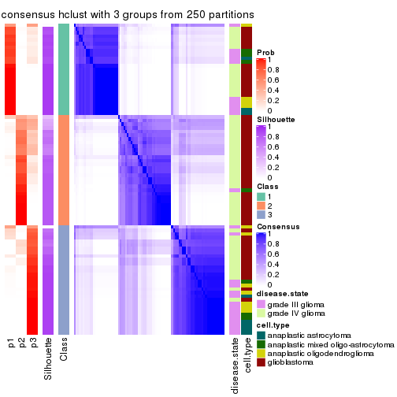</p>

</div>
<div id='tab-MAD-hclust-consensus-heatmap-3'>
<pre><code class="r">consensus_heatmap(res, k = 4)
</code></pre>

<p>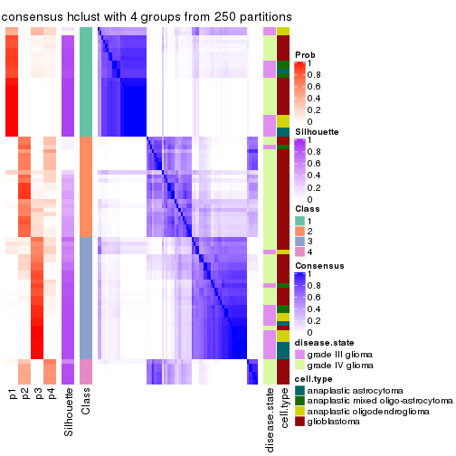</p>

</div>
<div id='tab-MAD-hclust-consensus-heatmap-4'>
<pre><code class="r">consensus_heatmap(res, k = 5)
</code></pre>

<p></p>

</div>
<div id='tab-MAD-hclust-consensus-heatmap-5'>
<pre><code class="r">consensus_heatmap(res, k = 6)
</code></pre>

<p></p>

</div>
</div>

Heatmaps for the membership of samples in all partitions to see how consistent they are:


<script>
$( function() {
	$( '#tabs-MAD-hclust-membership-heatmap' ).tabs();
} );
</script>
<div id='tabs-MAD-hclust-membership-heatmap'>
<ul>
<li><a href='#tab-MAD-hclust-membership-heatmap-1'>k = 2</a></li>
<li><a href='#tab-MAD-hclust-membership-heatmap-2'>k = 3</a></li>
<li><a href='#tab-MAD-hclust-membership-heatmap-3'>k = 4</a></li>
<li><a href='#tab-MAD-hclust-membership-heatmap-4'>k = 5</a></li>
<li><a href='#tab-MAD-hclust-membership-heatmap-5'>k = 6</a></li>
</ul>
<div id='tab-MAD-hclust-membership-heatmap-1'>
<pre><code class="r">membership_heatmap(res, k = 2)
</code></pre>

<p></p>

</div>
<div id='tab-MAD-hclust-membership-heatmap-2'>
<pre><code class="r">membership_heatmap(res, k = 3)
</code></pre>

<p></p>

</div>
<div id='tab-MAD-hclust-membership-heatmap-3'>
<pre><code class="r">membership_heatmap(res, k = 4)
</code></pre>

<p></p>

</div>
<div id='tab-MAD-hclust-membership-heatmap-4'>
<pre><code class="r">membership_heatmap(res, k = 5)
</code></pre>

<p></p>

</div>
<div id='tab-MAD-hclust-membership-heatmap-5'>
<pre><code class="r">membership_heatmap(res, k = 6)
</code></pre>

<p>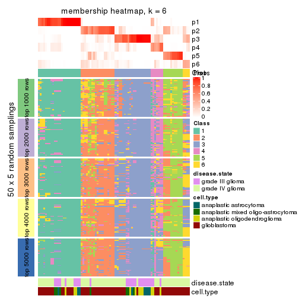</p>

</div>
</div>

As soon as we have had the classes for columns, we can look for signatures
which are significantly different between classes which can be candidate marks
for certain classes. Following are the heatmaps for signatures.


Signature heatmaps where rows are scaled:


<script>
$( function() {
	$( '#tabs-MAD-hclust-get-signatures' ).tabs();
} );
</script>
<div id='tabs-MAD-hclust-get-signatures'>
<ul>
<li><a href='#tab-MAD-hclust-get-signatures-1'>k = 2</a></li>
<li><a href='#tab-MAD-hclust-get-signatures-2'>k = 3</a></li>
<li><a href='#tab-MAD-hclust-get-signatures-3'>k = 4</a></li>
<li><a href='#tab-MAD-hclust-get-signatures-4'>k = 5</a></li>
<li><a href='#tab-MAD-hclust-get-signatures-5'>k = 6</a></li>
</ul>
<div id='tab-MAD-hclust-get-signatures-1'>
<pre><code class="r">get_signatures(res, k = 2)
</code></pre>

<p></p>

</div>
<div id='tab-MAD-hclust-get-signatures-2'>
<pre><code class="r">get_signatures(res, k = 3)
</code></pre>

<p></p>

</div>
<div id='tab-MAD-hclust-get-signatures-3'>
<pre><code class="r">get_signatures(res, k = 4)
</code></pre>

<p></p>

</div>
<div id='tab-MAD-hclust-get-signatures-4'>
<pre><code class="r">get_signatures(res, k = 5)
</code></pre>

<p></p>

</div>
<div id='tab-MAD-hclust-get-signatures-5'>
<pre><code class="r">get_signatures(res, k = 6)
</code></pre>

<p></p>

</div>
</div>


Signature heatmaps where rows are not scaled:


<script>
$( function() {
	$( '#tabs-MAD-hclust-get-signatures-no-scale' ).tabs();
} );
</script>
<div id='tabs-MAD-hclust-get-signatures-no-scale'>
<ul>
<li><a href='#tab-MAD-hclust-get-signatures-no-scale-1'>k = 2</a></li>
<li><a href='#tab-MAD-hclust-get-signatures-no-scale-2'>k = 3</a></li>
<li><a href='#tab-MAD-hclust-get-signatures-no-scale-3'>k = 4</a></li>
<li><a href='#tab-MAD-hclust-get-signatures-no-scale-4'>k = 5</a></li>
<li><a href='#tab-MAD-hclust-get-signatures-no-scale-5'>k = 6</a></li>
</ul>
<div id='tab-MAD-hclust-get-signatures-no-scale-1'>
<pre><code class="r">get_signatures(res, k = 2, scale_rows = FALSE)
</code></pre>

<p></p>

</div>
<div id='tab-MAD-hclust-get-signatures-no-scale-2'>
<pre><code class="r">get_signatures(res, k = 3, scale_rows = FALSE)
</code></pre>

<p></p>

</div>
<div id='tab-MAD-hclust-get-signatures-no-scale-3'>
<pre><code class="r">get_signatures(res, k = 4, scale_rows = FALSE)
</code></pre>

<p></p>

</div>
<div id='tab-MAD-hclust-get-signatures-no-scale-4'>
<pre><code class="r">get_signatures(res, k = 5, scale_rows = FALSE)
</code></pre>

<p></p>

</div>
<div id='tab-MAD-hclust-get-signatures-no-scale-5'>
<pre><code class="r">get_signatures(res, k = 6, scale_rows = FALSE)
</code></pre>

<p></p>

</div>
</div>


Compare the overlap of signatures from different k:

```r
compare_signatures(res)
```


`get_signature()` returns a data frame invisibly. TO get the list of signatures, the function
call should be assigned to a variable explicitly. In following code, if `plot` argument is set
to `FALSE`, no heatmap is plotted while only the differential analysis is performed.

```r
# code only for demonstration
tb = get_signature(res, k = ..., plot = FALSE)
```

An example of the output of `tb` is:

```
#>   which_row         fdr    mean_1    mean_2 scaled_mean_1 scaled_mean_2 km
#> 1        38 0.042760348  8.373488  9.131774    -0.5533452     0.5164555  1
#> 2        40 0.018707592  7.106213  8.469186    -0.6173731     0.5762149  1
#> 3        55 0.019134737 10.221463 11.207825    -0.6159697     0.5749050  1
#> 4        59 0.006059896  5.921854  7.869574    -0.6899429     0.6439467  1
#> 5        60 0.018055526  8.928898 10.211722    -0.6204761     0.5791110  1
#> 6        98 0.009384629 15.714769 14.887706     0.6635654    -0.6193277  2
...
```

The columns in `tb` are:

1. `which_row`: row indices corresponding to the input matrix.
2. `fdr`: FDR for the differential test. 
3. `mean_x`: The mean value in group x.
4. `scaled_mean_x`: The mean value in group x after rows are scaled.
5. `km`: Row groups if k-means clustering is applied to rows.


UMAP plot which shows how samples are separated.


<script>
$( function() {
	$( '#tabs-MAD-hclust-dimension-reduction' ).tabs();
} );
</script>
<div id='tabs-MAD-hclust-dimension-reduction'>
<ul>
<li><a href='#tab-MAD-hclust-dimension-reduction-1'>k = 2</a></li>
<li><a href='#tab-MAD-hclust-dimension-reduction-2'>k = 3</a></li>
<li><a href='#tab-MAD-hclust-dimension-reduction-3'>k = 4</a></li>
<li><a href='#tab-MAD-hclust-dimension-reduction-4'>k = 5</a></li>
<li><a href='#tab-MAD-hclust-dimension-reduction-5'>k = 6</a></li>
</ul>
<div id='tab-MAD-hclust-dimension-reduction-1'>
<pre><code class="r">dimension_reduction(res, k = 2, method = &quot;UMAP&quot;)
</code></pre>

<p></p>

</div>
<div id='tab-MAD-hclust-dimension-reduction-2'>
<pre><code class="r">dimension_reduction(res, k = 3, method = &quot;UMAP&quot;)
</code></pre>

<p></p>

</div>
<div id='tab-MAD-hclust-dimension-reduction-3'>
<pre><code class="r">dimension_reduction(res, k = 4, method = &quot;UMAP&quot;)
</code></pre>

<p>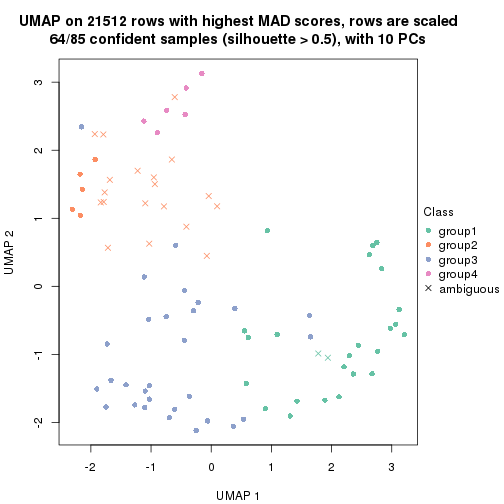</p>

</div>
<div id='tab-MAD-hclust-dimension-reduction-4'>
<pre><code class="r">dimension_reduction(res, k = 5, method = &quot;UMAP&quot;)
</code></pre>

<p></p>

</div>
<div id='tab-MAD-hclust-dimension-reduction-5'>
<pre><code class="r">dimension_reduction(res, k = 6, method = &quot;UMAP&quot;)
</code></pre>

<p></p>

</div>
</div>


Following heatmap shows how subgroups are split when increasing `k`:

```r
collect_classes(res)
```


Test correlation between subgroups and known annotations. If the known
annotation is numeric, one-way ANOVA test is applied, and if the known
annotation is discrete, chi-squared contingency table test is applied.

```r
test_to_known_factors(res)
```

```
#>             n disease.state(p) cell.type(p) k
#> MAD:hclust 42         0.068429      0.13416 2
#> MAD:hclust 79         0.001102      0.02263 3
#> MAD:hclust 64         0.043717      0.47335 4
#> MAD:hclust 68         0.000748      0.01928 5
#> MAD:hclust 64         0.000015      0.00403 6
```


If matrix rows can be associated to genes, consider to use `GO_Enrichment(res,
...)` to perform function enrichment for the signature genes.


 

---------------------------------------------------


### MAD:kmeans**


The object with results only for a single top-value method and a single partition method 
can be extracted as:

```r
res = res_list["MAD", "kmeans"]
# you can also extract it by
# res = res_list["MAD:kmeans"]
```

A summary of `res` and all the functions that can be applied to it:

```r
res
```

```
#> A 'ConsensusPartition' object with k = 2, 3, 4, 5, 6.
#>   On a matrix with 21512 rows and 85 columns.
#>   Top rows (1000, 2000, 3000, 4000, 5000) are extracted by 'MAD' method.
#>   Subgroups are detected by 'kmeans' method.
#>   Performed in total 1250 partitions by row resampling.
#>   Best k for subgroups seems to be 3.
#> 
#> Following methods can be applied to this 'ConsensusPartition' object:
#>  [1] "cola_report"             "collect_classes"         "collect_plots"          
#>  [4] "collect_stats"           "colnames"                "compare_signatures"     
#>  [7] "consensus_heatmap"       "dimension_reduction"     "functional_enrichment"  
#> [10] "get_anno_col"            "get_anno"                "get_classes"            
#> [13] "get_consensus"           "get_matrix"              "get_membership"         
#> [16] "get_param"               "get_signatures"          "get_stats"              
#> [19] "is_best_k"               "is_stable_k"             "membership_heatmap"     
#> [22] "ncol"                    "nrow"                    "plot_ecdf"              
#> [25] "rownames"                "select_partition_number" "show"                   
#> [28] "suggest_best_k"          "test_to_known_factors"
```

`collect_plots()` function collects all the plots made from `res` for all `k` (number of partitions)
into one single page to provide an easy and fast comparison between different `k`.

```r
collect_plots(res)
```


The plots are:

- The first row: a plot of the ECDF (Empirical cumulative distribution
  function) curves of the consensus matrix for each `k` and the heatmap of
  predicted classes for each `k`.
- The second row: heatmaps of the consensus matrix for each `k`.
- The third row: heatmaps of the membership matrix for each `k`.
- The fouth row: heatmaps of the signatures for each `k`.

All the plots in panels can be made by individual functions and they are
plotted later in this section.

`select_partition_number()` produces several plots showing different
statistics for choosing "optimized" `k`. There are following statistics:

- ECDF curves of the consensus matrix for each `k`;
- 1-PAC. [The PAC
  score](https://en.wikipedia.org/wiki/Consensus_clustering#Over-interpretation_potential_of_consensus_clustering)
  measures the proportion of the ambiguous subgrouping.
- Mean silhouette score.
- Concordance. The mean probability of fiting the consensus class ids in all
  partitions.
- Area increased. Denote $A_k$ as the area under the ECDF curve for current
  `k`, the area increased is defined as $A_k - A_{k-1}$.
- Rand index. The percent of pairs of samples that are both in a same cluster
  or both are not in a same cluster in the partition of k and k-1.
- Jaccard index. The ratio of pairs of samples are both in a same cluster in
  the partition of k and k-1 and the pairs of samples are both in a same
  cluster in the partition k or k-1.

The detailed explanations of these statistics can be found in [the cola
vignette](http://bioconductor.org/packages/devel/bioc/vignettes/cola/inst/doc/cola.html#toc_13).

Generally speaking, lower PAC score, higher mean silhouette score or higher
concordance corresponds to better partition. Rand index and Jaccard index
measure how similar the current partition is compared to partition with `k-1`.
If they are too similar, we won't accept `k` is better than `k-1`.

```r
select_partition_number(res)
```


The numeric values for all these statistics can be obtained by `get_stats()`.

```r
get_stats(res)
```

```
#>   k 1-PAC mean_silhouette concordance area_increased  Rand Jaccard
#> 2 2 0.569           0.698       0.861         0.4629 0.531   0.531
#> 3 3 1.000           0.953       0.963         0.4425 0.739   0.533
#> 4 4 0.747           0.700       0.837         0.1092 0.933   0.799
#> 5 5 0.730           0.697       0.776         0.0593 0.908   0.683
#> 6 6 0.715           0.606       0.749         0.0414 0.938   0.730
```

`suggest_best_k()` suggests the best $k$ based on these statistics. The rules are as follows:

- All $k$ with Jaccard index larger than 0.95 are removed because the increase of
  the partition number does not provides enough extra information. If all $k$ are removed,
  the best $k$ is assigned by `NA`.
- For $k$ with 1-PAC larger than 0.9, the maximal $k$ is taken as the "best k". Other $k$ is called "optional k".
- If it does not fit the second rule. The $k$ with the highest vote of highest
  1-PAC, mean silhouette and concordance is taken as the "best k".

```r
suggest_best_k(res)
```

```
#> [1] 3
```


Following shows the table of the partitions (You need to click the **show/hide
code output** link to see it). The membership matrix (columns with name `p*`)
is inferred by
[`clue::cl_consensus()`](https://www.rdocumentation.org/link/cl_consensus?package=clue)
function with the `SE` method. Basically the value in the membership matrix
represents the probability to belong to a certain group. The finall class
label for an item is determined with the group with highest probability it
belongs to.

In `get_classes()` function, the entropy is calculated from the membership
matrix and the silhouette score is calculated from the consensus matrix.


<script>
$( function() {
	$( '#tabs-MAD-kmeans-get-classes' ).tabs();
} );
</script>
<div id='tabs-MAD-kmeans-get-classes'>
<ul>
<li><a href='#tab-MAD-kmeans-get-classes-1'>k = 2</a></li>
<li><a href='#tab-MAD-kmeans-get-classes-2'>k = 3</a></li>
<li><a href='#tab-MAD-kmeans-get-classes-3'>k = 4</a></li>
<li><a href='#tab-MAD-kmeans-get-classes-4'>k = 5</a></li>
<li><a href='#tab-MAD-kmeans-get-classes-5'>k = 6</a></li>
</ul>

<div id='tab-MAD-kmeans-get-classes-1'>
<p><a id='tab-MAD-kmeans-get-classes-1-a' style='color:#0366d6' href='#'>show/hide code output</a></p>
<pre><code class="r">cbind(get_classes(res, k = 2), get_membership(res, k = 2))
</code></pre>

<pre><code>#&gt;          class entropy silhouette    p1    p2
#&gt; GSM99497     2  0.9881      0.450 0.436 0.564
#&gt; GSM99503     1  0.0000      0.923 1.000 0.000
#&gt; GSM99505     1  0.1414      0.902 0.980 0.020
#&gt; GSM99507     2  0.9881      0.450 0.436 0.564
#&gt; GSM99567     2  0.9866      0.454 0.432 0.568
#&gt; GSM99575     1  0.0000      0.923 1.000 0.000
#&gt; GSM99593     2  0.9866      0.454 0.432 0.568
#&gt; GSM99595     2  0.9881      0.450 0.436 0.564
#&gt; GSM99469     1  0.0000      0.923 1.000 0.000
#&gt; GSM99499     1  0.0376      0.920 0.996 0.004
#&gt; GSM99501     1  0.0000      0.923 1.000 0.000
#&gt; GSM99509     2  0.9881      0.450 0.436 0.564
#&gt; GSM99569     2  0.9881      0.450 0.436 0.564
#&gt; GSM99597     2  0.9896      0.441 0.440 0.560
#&gt; GSM99601     2  0.1414      0.768 0.020 0.980
#&gt; GSM99459     1  0.0000      0.923 1.000 0.000
#&gt; GSM99461     1  0.0000      0.923 1.000 0.000
#&gt; GSM99511     2  0.9881      0.450 0.436 0.564
#&gt; GSM99513     2  0.9881      0.450 0.436 0.564
#&gt; GSM99515     2  0.9881      0.450 0.436 0.564
#&gt; GSM99517     1  0.0000      0.923 1.000 0.000
#&gt; GSM99519     1  0.0000      0.923 1.000 0.000
#&gt; GSM99521     2  0.9881      0.450 0.436 0.564
#&gt; GSM99523     1  0.9922     -0.133 0.552 0.448
#&gt; GSM99571     1  0.0000      0.923 1.000 0.000
#&gt; GSM99599     1  0.0000      0.923 1.000 0.000
#&gt; GSM99433     2  0.0000      0.762 0.000 1.000
#&gt; GSM99435     2  0.9881      0.450 0.436 0.564
#&gt; GSM99437     2  0.1414      0.768 0.020 0.980
#&gt; GSM99439     2  0.1414      0.768 0.020 0.980
#&gt; GSM99441     1  0.0000      0.923 1.000 0.000
#&gt; GSM99443     2  0.1414      0.768 0.020 0.980
#&gt; GSM99445     2  0.1414      0.768 0.020 0.980
#&gt; GSM99447     2  0.1414      0.768 0.020 0.980
#&gt; GSM99449     2  0.0000      0.762 0.000 1.000
#&gt; GSM99451     2  0.9881      0.450 0.436 0.564
#&gt; GSM99453     1  0.0000      0.923 1.000 0.000
#&gt; GSM99455     1  0.0000      0.923 1.000 0.000
#&gt; GSM99457     1  0.0000      0.923 1.000 0.000
#&gt; GSM99463     2  0.1414      0.768 0.020 0.980
#&gt; GSM99465     1  0.7883      0.559 0.764 0.236
#&gt; GSM99467     2  0.1414      0.768 0.020 0.980
#&gt; GSM99471     1  0.0000      0.923 1.000 0.000
#&gt; GSM99473     1  0.0000      0.923 1.000 0.000
#&gt; GSM99475     2  0.9881      0.450 0.436 0.564
#&gt; GSM99477     2  0.0000      0.762 0.000 1.000
#&gt; GSM99479     2  0.1414      0.768 0.020 0.980
#&gt; GSM99481     1  0.0000      0.923 1.000 0.000
#&gt; GSM99483     1  0.0000      0.923 1.000 0.000
#&gt; GSM99485     2  0.1414      0.768 0.020 0.980
#&gt; GSM99487     2  0.1414      0.768 0.020 0.980
#&gt; GSM99489     2  0.1414      0.768 0.020 0.980
#&gt; GSM99491     2  0.1414      0.768 0.020 0.980
#&gt; GSM99493     1  0.0000      0.923 1.000 0.000
#&gt; GSM99495     2  0.1414      0.768 0.020 0.980
#&gt; GSM99525     1  0.0000      0.923 1.000 0.000
#&gt; GSM99527     2  0.9881      0.450 0.436 0.564
#&gt; GSM99529     2  0.6438      0.697 0.164 0.836
#&gt; GSM99531     2  0.9896      0.441 0.440 0.560
#&gt; GSM99533     1  0.9970     -0.204 0.532 0.468
#&gt; GSM99535     2  0.6048      0.681 0.148 0.852
#&gt; GSM99537     1  0.0000      0.923 1.000 0.000
#&gt; GSM99539     2  0.0000      0.762 0.000 1.000
#&gt; GSM99541     1  0.0938      0.911 0.988 0.012
#&gt; GSM99543     2  0.3431      0.737 0.064 0.936
#&gt; GSM99545     2  0.0000      0.762 0.000 1.000
#&gt; GSM99547     1  0.9993     -0.309 0.516 0.484
#&gt; GSM99549     2  0.1414      0.768 0.020 0.980
#&gt; GSM99551     1  0.0000      0.923 1.000 0.000
#&gt; GSM99553     2  0.9881      0.450 0.436 0.564
#&gt; GSM99555     2  0.1414      0.768 0.020 0.980
#&gt; GSM99557     2  0.1414      0.768 0.020 0.980
#&gt; GSM99559     2  0.0000      0.762 0.000 1.000
#&gt; GSM99561     2  0.1414      0.768 0.020 0.980
#&gt; GSM99563     2  0.9881      0.450 0.436 0.564
#&gt; GSM99565     2  0.0938      0.766 0.012 0.988
#&gt; GSM99573     2  0.1414      0.768 0.020 0.980
#&gt; GSM99577     1  0.0000      0.923 1.000 0.000
#&gt; GSM99579     2  0.1414      0.768 0.020 0.980
#&gt; GSM99581     2  0.9881      0.450 0.436 0.564
#&gt; GSM99583     2  0.9944      0.435 0.456 0.544
#&gt; GSM99585     2  0.1414      0.768 0.020 0.980
#&gt; GSM99587     1  0.0000      0.923 1.000 0.000
#&gt; GSM99589     2  0.1414      0.768 0.020 0.980
#&gt; GSM99591     2  0.1414      0.768 0.020 0.980
</code></pre>

<script>
$('#tab-MAD-kmeans-get-classes-1-a').parent().next().next().hide();
$('#tab-MAD-kmeans-get-classes-1-a').click(function(){
  $('#tab-MAD-kmeans-get-classes-1-a').parent().next().next().toggle();
  return(false);
});
</script>
</div>

<div id='tab-MAD-kmeans-get-classes-2'>
<p><a id='tab-MAD-kmeans-get-classes-2-a' style='color:#0366d6' href='#'>show/hide code output</a></p>
<pre><code class="r">cbind(get_classes(res, k = 3), get_membership(res, k = 3))
</code></pre>

<pre><code>#&gt;          class entropy silhouette    p1    p2    p3
#&gt; GSM99497     3  0.1711     0.9686 0.032 0.008 0.960
#&gt; GSM99503     1  0.0000     0.9958 1.000 0.000 0.000
#&gt; GSM99505     1  0.0000     0.9958 1.000 0.000 0.000
#&gt; GSM99507     3  0.1711     0.9686 0.032 0.008 0.960
#&gt; GSM99567     3  0.1711     0.9686 0.032 0.008 0.960
#&gt; GSM99575     1  0.0000     0.9958 1.000 0.000 0.000
#&gt; GSM99593     3  0.1711     0.9686 0.032 0.008 0.960
#&gt; GSM99595     3  0.1711     0.9686 0.032 0.008 0.960
#&gt; GSM99469     1  0.0000     0.9958 1.000 0.000 0.000
#&gt; GSM99499     1  0.0000     0.9958 1.000 0.000 0.000
#&gt; GSM99501     1  0.0000     0.9958 1.000 0.000 0.000
#&gt; GSM99509     3  0.1711     0.9686 0.032 0.008 0.960
#&gt; GSM99569     3  0.1711     0.9686 0.032 0.008 0.960
#&gt; GSM99597     3  0.1711     0.9686 0.032 0.008 0.960
#&gt; GSM99601     2  0.0747     0.9693 0.000 0.984 0.016
#&gt; GSM99459     1  0.0000     0.9958 1.000 0.000 0.000
#&gt; GSM99461     1  0.0000     0.9958 1.000 0.000 0.000
#&gt; GSM99511     3  0.1711     0.9686 0.032 0.008 0.960
#&gt; GSM99513     3  0.1711     0.9686 0.032 0.008 0.960
#&gt; GSM99515     3  0.1711     0.9686 0.032 0.008 0.960
#&gt; GSM99517     1  0.0000     0.9958 1.000 0.000 0.000
#&gt; GSM99519     1  0.0000     0.9958 1.000 0.000 0.000
#&gt; GSM99521     3  0.1711     0.9686 0.032 0.008 0.960
#&gt; GSM99523     3  0.1753     0.9538 0.048 0.000 0.952
#&gt; GSM99571     1  0.0661     0.9938 0.988 0.008 0.004
#&gt; GSM99599     1  0.0000     0.9958 1.000 0.000 0.000
#&gt; GSM99433     2  0.1163     0.9588 0.000 0.972 0.028
#&gt; GSM99435     3  0.1711     0.9686 0.032 0.008 0.960
#&gt; GSM99437     2  0.0424     0.9699 0.000 0.992 0.008
#&gt; GSM99439     2  0.1411     0.9652 0.000 0.964 0.036
#&gt; GSM99441     1  0.0000     0.9958 1.000 0.000 0.000
#&gt; GSM99443     2  0.0592     0.9699 0.000 0.988 0.012
#&gt; GSM99445     2  0.0592     0.9699 0.000 0.988 0.012
#&gt; GSM99447     2  0.0424     0.9699 0.000 0.992 0.008
#&gt; GSM99449     3  0.1529     0.9391 0.000 0.040 0.960
#&gt; GSM99451     3  0.1711     0.9686 0.032 0.008 0.960
#&gt; GSM99453     1  0.0661     0.9938 0.988 0.008 0.004
#&gt; GSM99455     1  0.0661     0.9938 0.988 0.008 0.004
#&gt; GSM99457     1  0.0848     0.9923 0.984 0.008 0.008
#&gt; GSM99463     2  0.1411     0.9652 0.000 0.964 0.036
#&gt; GSM99465     3  0.2066     0.9452 0.060 0.000 0.940
#&gt; GSM99467     2  0.0592     0.9699 0.000 0.988 0.012
#&gt; GSM99471     1  0.0661     0.9938 0.988 0.008 0.004
#&gt; GSM99473     1  0.0000     0.9958 1.000 0.000 0.000
#&gt; GSM99475     3  0.1711     0.9686 0.032 0.008 0.960
#&gt; GSM99477     3  0.4887     0.7028 0.000 0.228 0.772
#&gt; GSM99479     2  0.1860     0.9412 0.000 0.948 0.052
#&gt; GSM99481     1  0.0000     0.9958 1.000 0.000 0.000
#&gt; GSM99483     1  0.0661     0.9938 0.988 0.008 0.004
#&gt; GSM99485     2  0.0592     0.9699 0.000 0.988 0.012
#&gt; GSM99487     2  0.0424     0.9699 0.000 0.992 0.008
#&gt; GSM99489     2  0.1529     0.9653 0.000 0.960 0.040
#&gt; GSM99491     2  0.0592     0.9699 0.000 0.988 0.012
#&gt; GSM99493     1  0.0848     0.9923 0.984 0.008 0.008
#&gt; GSM99495     2  0.1411     0.9652 0.000 0.964 0.036
#&gt; GSM99525     1  0.0661     0.9938 0.988 0.008 0.004
#&gt; GSM99527     3  0.1711     0.9686 0.032 0.008 0.960
#&gt; GSM99529     3  0.6307     0.0269 0.000 0.488 0.512
#&gt; GSM99531     3  0.1711     0.9686 0.032 0.008 0.960
#&gt; GSM99533     3  0.1711     0.9686 0.032 0.008 0.960
#&gt; GSM99535     2  0.1765     0.9362 0.040 0.956 0.004
#&gt; GSM99537     1  0.0000     0.9958 1.000 0.000 0.000
#&gt; GSM99539     2  0.5926     0.4309 0.000 0.644 0.356
#&gt; GSM99541     1  0.0000     0.9958 1.000 0.000 0.000
#&gt; GSM99543     2  0.1289     0.9612 0.000 0.968 0.032
#&gt; GSM99545     2  0.3686     0.8680 0.000 0.860 0.140
#&gt; GSM99547     3  0.2063     0.9597 0.044 0.008 0.948
#&gt; GSM99549     2  0.1411     0.9652 0.000 0.964 0.036
#&gt; GSM99551     1  0.0848     0.9923 0.984 0.008 0.008
#&gt; GSM99553     3  0.1711     0.9686 0.032 0.008 0.960
#&gt; GSM99555     2  0.0424     0.9699 0.000 0.992 0.008
#&gt; GSM99557     2  0.1529     0.9653 0.000 0.960 0.040
#&gt; GSM99559     3  0.1411     0.9389 0.000 0.036 0.964
#&gt; GSM99561     2  0.1411     0.9652 0.000 0.964 0.036
#&gt; GSM99563     3  0.1711     0.9686 0.032 0.008 0.960
#&gt; GSM99565     2  0.0424     0.9699 0.000 0.992 0.008
#&gt; GSM99573     2  0.1411     0.9652 0.000 0.964 0.036
#&gt; GSM99577     1  0.0661     0.9938 0.988 0.008 0.004
#&gt; GSM99579     2  0.0592     0.9699 0.000 0.988 0.012
#&gt; GSM99581     3  0.1711     0.9686 0.032 0.008 0.960
#&gt; GSM99583     3  0.1751     0.9654 0.028 0.012 0.960
#&gt; GSM99585     2  0.0592     0.9699 0.000 0.988 0.012
#&gt; GSM99587     1  0.0848     0.9923 0.984 0.008 0.008
#&gt; GSM99589     2  0.0592     0.9699 0.000 0.988 0.012
#&gt; GSM99591     2  0.0592     0.9699 0.000 0.988 0.012
</code></pre>

<script>
$('#tab-MAD-kmeans-get-classes-2-a').parent().next().next().hide();
$('#tab-MAD-kmeans-get-classes-2-a').click(function(){
  $('#tab-MAD-kmeans-get-classes-2-a').parent().next().next().toggle();
  return(false);
});
</script>
</div>

<div id='tab-MAD-kmeans-get-classes-3'>
<p><a id='tab-MAD-kmeans-get-classes-3-a' style='color:#0366d6' href='#'>show/hide code output</a></p>
<pre><code class="r">cbind(get_classes(res, k = 4), get_membership(res, k = 4))
</code></pre>

<pre><code>#&gt;          class entropy silhouette    p1    p2    p3    p4
#&gt; GSM99497     3  0.0336     0.8565 0.000 0.000 0.992 0.008
#&gt; GSM99503     1  0.0000     0.9043 1.000 0.000 0.000 0.000
#&gt; GSM99505     1  0.1474     0.9001 0.948 0.000 0.000 0.052
#&gt; GSM99507     3  0.0336     0.8565 0.000 0.000 0.992 0.008
#&gt; GSM99567     3  0.0188     0.8574 0.000 0.000 0.996 0.004
#&gt; GSM99575     1  0.0000     0.9043 1.000 0.000 0.000 0.000
#&gt; GSM99593     3  0.0188     0.8574 0.000 0.000 0.996 0.004
#&gt; GSM99595     3  0.0188     0.8574 0.000 0.000 0.996 0.004
#&gt; GSM99469     1  0.1474     0.9001 0.948 0.000 0.000 0.052
#&gt; GSM99499     1  0.1474     0.9001 0.948 0.000 0.000 0.052
#&gt; GSM99501     1  0.1474     0.9001 0.948 0.000 0.000 0.052
#&gt; GSM99509     3  0.0188     0.8567 0.000 0.000 0.996 0.004
#&gt; GSM99569     3  0.0469     0.8564 0.000 0.000 0.988 0.012
#&gt; GSM99597     3  0.0469     0.8562 0.000 0.000 0.988 0.012
#&gt; GSM99601     2  0.1716     0.7833 0.000 0.936 0.000 0.064
#&gt; GSM99459     1  0.1867     0.8930 0.928 0.000 0.000 0.072
#&gt; GSM99461     1  0.1867     0.8930 0.928 0.000 0.000 0.072
#&gt; GSM99511     3  0.0336     0.8563 0.000 0.000 0.992 0.008
#&gt; GSM99513     3  0.0336     0.8563 0.000 0.000 0.992 0.008
#&gt; GSM99515     3  0.0188     0.8573 0.000 0.000 0.996 0.004
#&gt; GSM99517     1  0.0000     0.9043 1.000 0.000 0.000 0.000
#&gt; GSM99519     1  0.1716     0.8962 0.936 0.000 0.000 0.064
#&gt; GSM99521     3  0.1022     0.8407 0.000 0.000 0.968 0.032
#&gt; GSM99523     3  0.0469     0.8550 0.000 0.000 0.988 0.012
#&gt; GSM99571     1  0.3074     0.8744 0.848 0.000 0.000 0.152
#&gt; GSM99599     1  0.0469     0.9050 0.988 0.000 0.000 0.012
#&gt; GSM99433     2  0.4977     0.1552 0.000 0.540 0.000 0.460
#&gt; GSM99435     3  0.4746     0.3334 0.000 0.000 0.632 0.368
#&gt; GSM99437     2  0.2530     0.7708 0.000 0.888 0.000 0.112
#&gt; GSM99439     2  0.3266     0.7448 0.000 0.832 0.000 0.168
#&gt; GSM99441     1  0.0469     0.9050 0.988 0.000 0.000 0.012
#&gt; GSM99443     2  0.0336     0.7891 0.000 0.992 0.000 0.008
#&gt; GSM99445     2  0.0707     0.7879 0.000 0.980 0.000 0.020
#&gt; GSM99447     2  0.2704     0.7703 0.000 0.876 0.000 0.124
#&gt; GSM99449     3  0.0336     0.8569 0.000 0.000 0.992 0.008
#&gt; GSM99451     3  0.4898     0.2320 0.000 0.000 0.584 0.416
#&gt; GSM99453     1  0.3172     0.8715 0.840 0.000 0.000 0.160
#&gt; GSM99455     1  0.3172     0.8715 0.840 0.000 0.000 0.160
#&gt; GSM99457     1  0.3356     0.8646 0.824 0.000 0.000 0.176
#&gt; GSM99463     2  0.3172     0.7450 0.000 0.840 0.000 0.160
#&gt; GSM99465     4  0.7005     0.3724 0.172 0.000 0.256 0.572
#&gt; GSM99467     2  0.5050     0.2922 0.000 0.588 0.004 0.408
#&gt; GSM99471     1  0.4356     0.7970 0.708 0.000 0.000 0.292
#&gt; GSM99473     1  0.2081     0.8955 0.916 0.000 0.000 0.084
#&gt; GSM99475     3  0.4967     0.1384 0.000 0.000 0.548 0.452
#&gt; GSM99477     4  0.7495     0.3574 0.000 0.368 0.184 0.448
#&gt; GSM99479     2  0.5105     0.2325 0.000 0.564 0.004 0.432
#&gt; GSM99481     1  0.0469     0.9050 0.988 0.000 0.000 0.012
#&gt; GSM99483     1  0.3172     0.8715 0.840 0.000 0.000 0.160
#&gt; GSM99485     2  0.2647     0.7649 0.000 0.880 0.000 0.120
#&gt; GSM99487     2  0.2530     0.7708 0.000 0.888 0.000 0.112
#&gt; GSM99489     2  0.3123     0.7459 0.000 0.844 0.000 0.156
#&gt; GSM99491     2  0.1940     0.7828 0.000 0.924 0.000 0.076
#&gt; GSM99493     1  0.3356     0.8646 0.824 0.000 0.000 0.176
#&gt; GSM99495     2  0.3172     0.7450 0.000 0.840 0.000 0.160
#&gt; GSM99525     1  0.3172     0.8715 0.840 0.000 0.000 0.160
#&gt; GSM99527     4  0.4925     0.1551 0.000 0.000 0.428 0.572
#&gt; GSM99529     4  0.6058     0.4225 0.000 0.308 0.068 0.624
#&gt; GSM99531     3  0.4994     0.0571 0.000 0.000 0.520 0.480
#&gt; GSM99533     3  0.4998     0.0286 0.000 0.000 0.512 0.488
#&gt; GSM99535     2  0.4647     0.5864 0.008 0.704 0.000 0.288
#&gt; GSM99537     1  0.1389     0.9057 0.952 0.000 0.000 0.048
#&gt; GSM99539     4  0.7227     0.3005 0.000 0.368 0.148 0.484
#&gt; GSM99541     1  0.2589     0.8655 0.884 0.000 0.000 0.116
#&gt; GSM99543     2  0.4382     0.6452 0.000 0.704 0.000 0.296
#&gt; GSM99545     4  0.6532    -0.0733 0.000 0.420 0.076 0.504
#&gt; GSM99547     4  0.4837     0.3304 0.004 0.000 0.348 0.648
#&gt; GSM99549     2  0.3266     0.7448 0.000 0.832 0.000 0.168
#&gt; GSM99551     4  0.4877    -0.2690 0.408 0.000 0.000 0.592
#&gt; GSM99553     3  0.0336     0.8565 0.000 0.000 0.992 0.008
#&gt; GSM99555     2  0.1389     0.7898 0.000 0.952 0.000 0.048
#&gt; GSM99557     2  0.2921     0.7542 0.000 0.860 0.000 0.140
#&gt; GSM99559     3  0.1398     0.8190 0.000 0.004 0.956 0.040
#&gt; GSM99561     2  0.3837     0.7549 0.000 0.776 0.000 0.224
#&gt; GSM99563     3  0.0336     0.8563 0.000 0.000 0.992 0.008
#&gt; GSM99565     2  0.2469     0.7747 0.000 0.892 0.000 0.108
#&gt; GSM99573     2  0.3266     0.7448 0.000 0.832 0.000 0.168
#&gt; GSM99577     1  0.4477     0.7859 0.688 0.000 0.000 0.312
#&gt; GSM99579     2  0.2408     0.7732 0.000 0.896 0.000 0.104
#&gt; GSM99581     3  0.0188     0.8573 0.000 0.000 0.996 0.004
#&gt; GSM99583     4  0.6810     0.5088 0.000 0.156 0.248 0.596
#&gt; GSM99585     2  0.4907     0.2752 0.000 0.580 0.000 0.420
#&gt; GSM99587     1  0.3356     0.8646 0.824 0.000 0.000 0.176
#&gt; GSM99589     2  0.1637     0.7868 0.000 0.940 0.000 0.060
#&gt; GSM99591     2  0.0707     0.7879 0.000 0.980 0.000 0.020
</code></pre>

<script>
$('#tab-MAD-kmeans-get-classes-3-a').parent().next().next().hide();
$('#tab-MAD-kmeans-get-classes-3-a').click(function(){
  $('#tab-MAD-kmeans-get-classes-3-a').parent().next().next().toggle();
  return(false);
});
</script>
</div>

<div id='tab-MAD-kmeans-get-classes-4'>
<p><a id='tab-MAD-kmeans-get-classes-4-a' style='color:#0366d6' href='#'>show/hide code output</a></p>
<pre><code class="r">cbind(get_classes(res, k = 5), get_membership(res, k = 5))
</code></pre>

<pre><code>#&gt;          class entropy silhouette    p1    p2    p3    p4    p5
#&gt; GSM99497     3  0.0000     0.9780 0.000 0.000 1.000 0.000 0.000
#&gt; GSM99503     1  0.0162     0.8524 0.996 0.000 0.000 0.004 0.000
#&gt; GSM99505     1  0.2390     0.8434 0.908 0.000 0.004 0.044 0.044
#&gt; GSM99507     3  0.0000     0.9780 0.000 0.000 1.000 0.000 0.000
#&gt; GSM99567     3  0.0000     0.9780 0.000 0.000 1.000 0.000 0.000
#&gt; GSM99575     1  0.0162     0.8524 0.996 0.000 0.000 0.004 0.000
#&gt; GSM99593     3  0.0000     0.9780 0.000 0.000 1.000 0.000 0.000
#&gt; GSM99595     3  0.0000     0.9780 0.000 0.000 1.000 0.000 0.000
#&gt; GSM99469     1  0.2729     0.8357 0.884 0.000 0.000 0.060 0.056
#&gt; GSM99499     1  0.2304     0.8430 0.908 0.000 0.000 0.048 0.044
#&gt; GSM99501     1  0.2588     0.8380 0.892 0.000 0.000 0.060 0.048
#&gt; GSM99509     3  0.0000     0.9780 0.000 0.000 1.000 0.000 0.000
#&gt; GSM99569     3  0.1216     0.9651 0.000 0.000 0.960 0.020 0.020
#&gt; GSM99597     3  0.0579     0.9716 0.000 0.000 0.984 0.008 0.008
#&gt; GSM99601     2  0.4517    -0.2257 0.000 0.600 0.000 0.012 0.388
#&gt; GSM99459     1  0.3791     0.8027 0.812 0.000 0.000 0.112 0.076
#&gt; GSM99461     1  0.3840     0.7998 0.808 0.000 0.000 0.116 0.076
#&gt; GSM99511     3  0.1216     0.9646 0.000 0.000 0.960 0.020 0.020
#&gt; GSM99513     3  0.1216     0.9646 0.000 0.000 0.960 0.020 0.020
#&gt; GSM99515     3  0.0000     0.9780 0.000 0.000 1.000 0.000 0.000
#&gt; GSM99517     1  0.0324     0.8525 0.992 0.000 0.000 0.004 0.004
#&gt; GSM99519     1  0.3517     0.8140 0.832 0.000 0.000 0.100 0.068
#&gt; GSM99521     3  0.1197     0.9361 0.000 0.000 0.952 0.048 0.000
#&gt; GSM99523     3  0.1117     0.9665 0.000 0.000 0.964 0.020 0.016
#&gt; GSM99571     1  0.3346     0.8277 0.844 0.000 0.000 0.064 0.092
#&gt; GSM99599     1  0.0898     0.8524 0.972 0.000 0.000 0.008 0.020
#&gt; GSM99433     2  0.5539     0.1012 0.000 0.500 0.008 0.444 0.048
#&gt; GSM99435     4  0.4482     0.5469 0.000 0.000 0.376 0.612 0.012
#&gt; GSM99437     2  0.2712     0.5510 0.000 0.880 0.000 0.032 0.088
#&gt; GSM99439     5  0.4356     0.8990 0.000 0.340 0.000 0.012 0.648
#&gt; GSM99441     1  0.0898     0.8524 0.972 0.000 0.000 0.008 0.020
#&gt; GSM99443     2  0.3480     0.2880 0.000 0.752 0.000 0.000 0.248
#&gt; GSM99445     2  0.4066     0.0156 0.000 0.672 0.000 0.004 0.324
#&gt; GSM99447     2  0.3578     0.5136 0.000 0.820 0.000 0.048 0.132
#&gt; GSM99449     3  0.0727     0.9670 0.000 0.012 0.980 0.004 0.004
#&gt; GSM99451     4  0.4401     0.6179 0.000 0.000 0.328 0.656 0.016
#&gt; GSM99453     1  0.4219     0.8021 0.772 0.000 0.000 0.072 0.156
#&gt; GSM99455     1  0.4219     0.8021 0.772 0.000 0.000 0.072 0.156
#&gt; GSM99457     1  0.5059     0.7674 0.700 0.000 0.000 0.124 0.176
#&gt; GSM99463     5  0.3983     0.9001 0.000 0.340 0.000 0.000 0.660
#&gt; GSM99465     4  0.5910     0.6215 0.108 0.008 0.088 0.708 0.088
#&gt; GSM99467     2  0.4042     0.5428 0.000 0.756 0.000 0.212 0.032
#&gt; GSM99471     1  0.6241     0.7012 0.616 0.024 0.000 0.168 0.192
#&gt; GSM99473     1  0.3186     0.8343 0.864 0.008 0.000 0.048 0.080
#&gt; GSM99475     4  0.4063     0.6712 0.000 0.000 0.280 0.708 0.012
#&gt; GSM99477     2  0.5312     0.4123 0.000 0.672 0.064 0.248 0.016
#&gt; GSM99479     2  0.4104     0.5389 0.000 0.748 0.000 0.220 0.032
#&gt; GSM99481     1  0.0898     0.8524 0.972 0.000 0.000 0.008 0.020
#&gt; GSM99483     1  0.4179     0.8026 0.776 0.000 0.000 0.072 0.152
#&gt; GSM99485     2  0.3269     0.5290 0.000 0.848 0.000 0.056 0.096
#&gt; GSM99487     2  0.2654     0.5533 0.000 0.884 0.000 0.032 0.084
#&gt; GSM99489     5  0.4299     0.8638 0.000 0.388 0.000 0.004 0.608
#&gt; GSM99491     2  0.2351     0.5138 0.000 0.896 0.000 0.016 0.088
#&gt; GSM99493     1  0.4819     0.7756 0.724 0.000 0.000 0.112 0.164
#&gt; GSM99495     5  0.3983     0.9001 0.000 0.340 0.000 0.000 0.660
#&gt; GSM99525     1  0.4138     0.8046 0.780 0.000 0.000 0.072 0.148
#&gt; GSM99527     4  0.4741     0.7017 0.000 0.048 0.172 0.752 0.028
#&gt; GSM99529     4  0.5497     0.1799 0.000 0.380 0.008 0.560 0.052
#&gt; GSM99531     4  0.4054     0.6929 0.000 0.000 0.248 0.732 0.020
#&gt; GSM99533     4  0.3700     0.6971 0.000 0.000 0.240 0.752 0.008
#&gt; GSM99535     2  0.3868     0.5356 0.000 0.800 0.000 0.140 0.060
#&gt; GSM99537     1  0.2221     0.8467 0.912 0.000 0.000 0.052 0.036
#&gt; GSM99539     4  0.6131     0.4228 0.000 0.288 0.064 0.600 0.048
#&gt; GSM99541     1  0.3995     0.7838 0.788 0.000 0.000 0.152 0.060
#&gt; GSM99543     5  0.5550     0.5689 0.000 0.400 0.000 0.072 0.528
#&gt; GSM99545     4  0.6919     0.3104 0.000 0.216 0.032 0.528 0.224
#&gt; GSM99547     4  0.5296     0.6320 0.000 0.136 0.100 0.728 0.036
#&gt; GSM99549     5  0.4540     0.8956 0.000 0.340 0.000 0.020 0.640
#&gt; GSM99551     4  0.6194     0.1632 0.208 0.008 0.000 0.588 0.196
#&gt; GSM99553     3  0.0000     0.9780 0.000 0.000 1.000 0.000 0.000
#&gt; GSM99555     2  0.3476     0.4722 0.000 0.804 0.000 0.020 0.176
#&gt; GSM99557     5  0.4367     0.8272 0.000 0.416 0.000 0.004 0.580
#&gt; GSM99559     3  0.1205     0.9331 0.000 0.040 0.956 0.004 0.000
#&gt; GSM99561     2  0.5237     0.2046 0.000 0.664 0.000 0.100 0.236
#&gt; GSM99563     3  0.1117     0.9665 0.000 0.000 0.964 0.020 0.016
#&gt; GSM99565     2  0.3229     0.5237 0.000 0.840 0.000 0.032 0.128
#&gt; GSM99573     5  0.4540     0.8956 0.000 0.340 0.000 0.020 0.640
#&gt; GSM99577     1  0.6038     0.7085 0.576 0.000 0.000 0.240 0.184
#&gt; GSM99579     2  0.3237     0.5128 0.000 0.848 0.000 0.048 0.104
#&gt; GSM99581     3  0.0324     0.9766 0.000 0.000 0.992 0.004 0.004
#&gt; GSM99583     2  0.6726     0.0748 0.000 0.508 0.080 0.352 0.060
#&gt; GSM99585     2  0.3750     0.5351 0.000 0.756 0.000 0.232 0.012
#&gt; GSM99587     1  0.4819     0.7756 0.724 0.000 0.000 0.112 0.164
#&gt; GSM99589     2  0.2519     0.5048 0.000 0.884 0.000 0.016 0.100
#&gt; GSM99591     2  0.4066     0.0156 0.000 0.672 0.000 0.004 0.324
</code></pre>

<script>
$('#tab-MAD-kmeans-get-classes-4-a').parent().next().next().hide();
$('#tab-MAD-kmeans-get-classes-4-a').click(function(){
  $('#tab-MAD-kmeans-get-classes-4-a').parent().next().next().toggle();
  return(false);
});
</script>
</div>

<div id='tab-MAD-kmeans-get-classes-5'>
<p><a id='tab-MAD-kmeans-get-classes-5-a' style='color:#0366d6' href='#'>show/hide code output</a></p>
<pre><code class="r">cbind(get_classes(res, k = 6), get_membership(res, k = 6))
</code></pre>

<pre><code>#&gt;          class entropy silhouette    p1    p2    p3    p4    p5    p6
#&gt; GSM99497     3  0.0146     0.9438 0.000 0.004 0.996 0.000 0.000 0.000
#&gt; GSM99503     1  0.1958     0.6715 0.896 0.000 0.000 0.000 0.004 0.100
#&gt; GSM99505     1  0.0964     0.7234 0.968 0.000 0.000 0.012 0.004 0.016
#&gt; GSM99507     3  0.0146     0.9438 0.000 0.004 0.996 0.000 0.000 0.000
#&gt; GSM99567     3  0.0000     0.9439 0.000 0.000 1.000 0.000 0.000 0.000
#&gt; GSM99575     1  0.1958     0.6715 0.896 0.000 0.000 0.000 0.004 0.100
#&gt; GSM99593     3  0.0260     0.9435 0.000 0.000 0.992 0.008 0.000 0.000
#&gt; GSM99595     3  0.0000     0.9439 0.000 0.000 1.000 0.000 0.000 0.000
#&gt; GSM99469     1  0.1577     0.7185 0.940 0.000 0.000 0.016 0.008 0.036
#&gt; GSM99499     1  0.0964     0.7234 0.968 0.000 0.000 0.012 0.004 0.016
#&gt; GSM99501     1  0.1577     0.7185 0.940 0.000 0.000 0.016 0.008 0.036
#&gt; GSM99509     3  0.0260     0.9434 0.000 0.000 0.992 0.008 0.000 0.000
#&gt; GSM99569     3  0.2775     0.9073 0.000 0.004 0.884 0.032 0.032 0.048
#&gt; GSM99597     3  0.1285     0.9347 0.004 0.008 0.960 0.008 0.008 0.012
#&gt; GSM99601     5  0.5183     0.0565 0.000 0.456 0.000 0.024 0.480 0.040
#&gt; GSM99459     1  0.3260     0.6669 0.848 0.000 0.000 0.056 0.028 0.068
#&gt; GSM99461     1  0.3260     0.6669 0.848 0.000 0.000 0.056 0.028 0.068
#&gt; GSM99511     3  0.2981     0.8967 0.000 0.000 0.868 0.040 0.040 0.052
#&gt; GSM99513     3  0.2981     0.8967 0.000 0.000 0.868 0.040 0.040 0.052
#&gt; GSM99515     3  0.0146     0.9438 0.000 0.004 0.996 0.000 0.000 0.000
#&gt; GSM99517     1  0.2118     0.6649 0.888 0.000 0.000 0.000 0.008 0.104
#&gt; GSM99519     1  0.2897     0.6869 0.872 0.000 0.000 0.048 0.028 0.052
#&gt; GSM99521     3  0.2234     0.8272 0.000 0.004 0.872 0.124 0.000 0.000
#&gt; GSM99523     3  0.2911     0.8986 0.000 0.000 0.872 0.036 0.040 0.052
#&gt; GSM99571     1  0.4067    -0.5291 0.548 0.000 0.000 0.000 0.008 0.444
#&gt; GSM99599     1  0.2593     0.6088 0.844 0.000 0.000 0.000 0.008 0.148
#&gt; GSM99433     2  0.5384     0.0817 0.000 0.516 0.000 0.404 0.044 0.036
#&gt; GSM99435     4  0.4377     0.7091 0.000 0.036 0.228 0.716 0.004 0.016
#&gt; GSM99437     2  0.4282     0.4611 0.000 0.736 0.000 0.036 0.200 0.028
#&gt; GSM99439     5  0.3687     0.7892 0.000 0.164 0.000 0.032 0.788 0.016
#&gt; GSM99441     1  0.2593     0.6088 0.844 0.000 0.000 0.000 0.008 0.148
#&gt; GSM99443     2  0.5006     0.1594 0.000 0.548 0.000 0.008 0.388 0.056
#&gt; GSM99445     2  0.4753    -0.0209 0.000 0.496 0.000 0.000 0.456 0.048
#&gt; GSM99447     2  0.4927     0.4545 0.000 0.700 0.000 0.080 0.184 0.036
#&gt; GSM99449     3  0.1036     0.9309 0.000 0.008 0.964 0.024 0.000 0.004
#&gt; GSM99451     4  0.3262     0.7575 0.000 0.004 0.180 0.800 0.004 0.012
#&gt; GSM99453     6  0.3864     0.6397 0.480 0.000 0.000 0.000 0.000 0.520
#&gt; GSM99455     6  0.3864     0.6397 0.480 0.000 0.000 0.000 0.000 0.520
#&gt; GSM99457     6  0.5253     0.6471 0.388 0.000 0.000 0.020 0.056 0.536
#&gt; GSM99463     5  0.2963     0.7979 0.000 0.152 0.000 0.016 0.828 0.004
#&gt; GSM99465     4  0.7070     0.4072 0.316 0.056 0.016 0.488 0.028 0.096
#&gt; GSM99467     2  0.3407     0.5406 0.000 0.832 0.008 0.088 0.004 0.068
#&gt; GSM99471     6  0.5834     0.5092 0.320 0.064 0.000 0.040 0.012 0.564
#&gt; GSM99473     1  0.3880     0.6228 0.788 0.024 0.000 0.008 0.024 0.156
#&gt; GSM99475     4  0.2655     0.7749 0.008 0.000 0.140 0.848 0.000 0.004
#&gt; GSM99477     2  0.4395     0.5188 0.000 0.760 0.052 0.152 0.008 0.028
#&gt; GSM99479     2  0.3552     0.5367 0.000 0.820 0.008 0.100 0.004 0.068
#&gt; GSM99481     1  0.2593     0.6088 0.844 0.000 0.000 0.000 0.008 0.148
#&gt; GSM99483     6  0.4093     0.6389 0.476 0.000 0.000 0.000 0.008 0.516
#&gt; GSM99485     2  0.4936     0.4759 0.000 0.700 0.000 0.024 0.152 0.124
#&gt; GSM99487     2  0.4161     0.4762 0.000 0.752 0.000 0.036 0.184 0.028
#&gt; GSM99489     5  0.3354     0.7646 0.000 0.168 0.000 0.000 0.796 0.036
#&gt; GSM99491     2  0.4354     0.4318 0.000 0.704 0.000 0.008 0.236 0.052
#&gt; GSM99493     6  0.5110     0.6638 0.380 0.000 0.000 0.016 0.052 0.552
#&gt; GSM99495     5  0.2963     0.7979 0.000 0.152 0.000 0.016 0.828 0.004
#&gt; GSM99525     6  0.4093     0.6282 0.476 0.000 0.000 0.000 0.008 0.516
#&gt; GSM99527     4  0.4223     0.7247 0.004 0.084 0.028 0.804 0.024 0.056
#&gt; GSM99529     2  0.6526     0.0422 0.004 0.460 0.012 0.368 0.032 0.124
#&gt; GSM99531     4  0.3886     0.7717 0.020 0.004 0.132 0.804 0.012 0.028
#&gt; GSM99533     4  0.3167     0.7752 0.016 0.004 0.120 0.840 0.000 0.020
#&gt; GSM99535     2  0.4937     0.4970 0.000 0.712 0.000 0.076 0.052 0.160
#&gt; GSM99537     1  0.1148     0.7213 0.960 0.000 0.000 0.020 0.004 0.016
#&gt; GSM99539     4  0.4744     0.5993 0.000 0.176 0.008 0.728 0.048 0.040
#&gt; GSM99541     1  0.3186     0.6317 0.836 0.000 0.000 0.100 0.004 0.060
#&gt; GSM99543     5  0.5831     0.4421 0.000 0.252 0.000 0.032 0.580 0.136
#&gt; GSM99545     4  0.4927     0.5610 0.000 0.096 0.004 0.716 0.152 0.032
#&gt; GSM99547     4  0.5478     0.6195 0.004 0.188 0.012 0.672 0.028 0.096
#&gt; GSM99549     5  0.4170     0.7733 0.000 0.168 0.000 0.040 0.760 0.032
#&gt; GSM99551     6  0.6496     0.2202 0.100 0.032 0.000 0.240 0.056 0.572
#&gt; GSM99553     3  0.0146     0.9438 0.000 0.004 0.996 0.000 0.000 0.000
#&gt; GSM99555     2  0.4590     0.3456 0.000 0.660 0.000 0.024 0.288 0.028
#&gt; GSM99557     5  0.3658     0.7210 0.000 0.216 0.000 0.000 0.752 0.032
#&gt; GSM99559     3  0.1562     0.9095 0.000 0.024 0.940 0.032 0.000 0.004
#&gt; GSM99561     2  0.6256     0.0563 0.000 0.488 0.000 0.088 0.352 0.072
#&gt; GSM99563     3  0.2911     0.8978 0.000 0.000 0.872 0.036 0.040 0.052
#&gt; GSM99565     2  0.4608     0.4267 0.000 0.700 0.000 0.040 0.228 0.032
#&gt; GSM99573     5  0.4235     0.7713 0.000 0.168 0.000 0.044 0.756 0.032
#&gt; GSM99577     1  0.5885    -0.4471 0.428 0.004 0.000 0.132 0.008 0.428
#&gt; GSM99579     2  0.4406     0.4598 0.000 0.728 0.000 0.008 0.176 0.088
#&gt; GSM99581     3  0.0767     0.9422 0.000 0.000 0.976 0.012 0.004 0.008
#&gt; GSM99583     2  0.5845     0.3763 0.004 0.652 0.056 0.164 0.008 0.116
#&gt; GSM99585     2  0.3492     0.5313 0.000 0.788 0.000 0.176 0.004 0.032
#&gt; GSM99587     6  0.5110     0.6638 0.380 0.000 0.000 0.016 0.052 0.552
#&gt; GSM99589     2  0.4985     0.4429 0.000 0.668 0.000 0.028 0.236 0.068
#&gt; GSM99591     2  0.4753    -0.0209 0.000 0.496 0.000 0.000 0.456 0.048
</code></pre>

<script>
$('#tab-MAD-kmeans-get-classes-5-a').parent().next().next().hide();
$('#tab-MAD-kmeans-get-classes-5-a').click(function(){
  $('#tab-MAD-kmeans-get-classes-5-a').parent().next().next().toggle();
  return(false);
});
</script>
</div>
</div>

Heatmaps for the consensus matrix. It visualizes the probability of two
samples to be in a same group.


<script>
$( function() {
	$( '#tabs-MAD-kmeans-consensus-heatmap' ).tabs();
} );
</script>
<div id='tabs-MAD-kmeans-consensus-heatmap'>
<ul>
<li><a href='#tab-MAD-kmeans-consensus-heatmap-1'>k = 2</a></li>
<li><a href='#tab-MAD-kmeans-consensus-heatmap-2'>k = 3</a></li>
<li><a href='#tab-MAD-kmeans-consensus-heatmap-3'>k = 4</a></li>
<li><a href='#tab-MAD-kmeans-consensus-heatmap-4'>k = 5</a></li>
<li><a href='#tab-MAD-kmeans-consensus-heatmap-5'>k = 6</a></li>
</ul>
<div id='tab-MAD-kmeans-consensus-heatmap-1'>
<pre><code class="r">consensus_heatmap(res, k = 2)
</code></pre>

<p></p>

</div>
<div id='tab-MAD-kmeans-consensus-heatmap-2'>
<pre><code class="r">consensus_heatmap(res, k = 3)
</code></pre>

<p></p>

</div>
<div id='tab-MAD-kmeans-consensus-heatmap-3'>
<pre><code class="r">consensus_heatmap(res, k = 4)
</code></pre>

<p></p>

</div>
<div id='tab-MAD-kmeans-consensus-heatmap-4'>
<pre><code class="r">consensus_heatmap(res, k = 5)
</code></pre>

<p></p>

</div>
<div id='tab-MAD-kmeans-consensus-heatmap-5'>
<pre><code class="r">consensus_heatmap(res, k = 6)
</code></pre>

<p></p>

</div>
</div>

Heatmaps for the membership of samples in all partitions to see how consistent they are:


<script>
$( function() {
	$( '#tabs-MAD-kmeans-membership-heatmap' ).tabs();
} );
</script>
<div id='tabs-MAD-kmeans-membership-heatmap'>
<ul>
<li><a href='#tab-MAD-kmeans-membership-heatmap-1'>k = 2</a></li>
<li><a href='#tab-MAD-kmeans-membership-heatmap-2'>k = 3</a></li>
<li><a href='#tab-MAD-kmeans-membership-heatmap-3'>k = 4</a></li>
<li><a href='#tab-MAD-kmeans-membership-heatmap-4'>k = 5</a></li>
<li><a href='#tab-MAD-kmeans-membership-heatmap-5'>k = 6</a></li>
</ul>
<div id='tab-MAD-kmeans-membership-heatmap-1'>
<pre><code class="r">membership_heatmap(res, k = 2)
</code></pre>

<p></p>

</div>
<div id='tab-MAD-kmeans-membership-heatmap-2'>
<pre><code class="r">membership_heatmap(res, k = 3)
</code></pre>

<p></p>

</div>
<div id='tab-MAD-kmeans-membership-heatmap-3'>
<pre><code class="r">membership_heatmap(res, k = 4)
</code></pre>

<p></p>

</div>
<div id='tab-MAD-kmeans-membership-heatmap-4'>
<pre><code class="r">membership_heatmap(res, k = 5)
</code></pre>

<p></p>

</div>
<div id='tab-MAD-kmeans-membership-heatmap-5'>
<pre><code class="r">membership_heatmap(res, k = 6)
</code></pre>

<p></p>

</div>
</div>

As soon as we have had the classes for columns, we can look for signatures
which are significantly different between classes which can be candidate marks
for certain classes. Following are the heatmaps for signatures.


Signature heatmaps where rows are scaled:


<script>
$( function() {
	$( '#tabs-MAD-kmeans-get-signatures' ).tabs();
} );
</script>
<div id='tabs-MAD-kmeans-get-signatures'>
<ul>
<li><a href='#tab-MAD-kmeans-get-signatures-1'>k = 2</a></li>
<li><a href='#tab-MAD-kmeans-get-signatures-2'>k = 3</a></li>
<li><a href='#tab-MAD-kmeans-get-signatures-3'>k = 4</a></li>
<li><a href='#tab-MAD-kmeans-get-signatures-4'>k = 5</a></li>
<li><a href='#tab-MAD-kmeans-get-signatures-5'>k = 6</a></li>
</ul>
<div id='tab-MAD-kmeans-get-signatures-1'>
<pre><code class="r">get_signatures(res, k = 2)
</code></pre>

<p></p>

</div>
<div id='tab-MAD-kmeans-get-signatures-2'>
<pre><code class="r">get_signatures(res, k = 3)
</code></pre>

<p></p>

</div>
<div id='tab-MAD-kmeans-get-signatures-3'>
<pre><code class="r">get_signatures(res, k = 4)
</code></pre>

<p></p>

</div>
<div id='tab-MAD-kmeans-get-signatures-4'>
<pre><code class="r">get_signatures(res, k = 5)
</code></pre>

<p></p>

</div>
<div id='tab-MAD-kmeans-get-signatures-5'>
<pre><code class="r">get_signatures(res, k = 6)
</code></pre>

<p></p>

</div>
</div>


Signature heatmaps where rows are not scaled:


<script>
$( function() {
	$( '#tabs-MAD-kmeans-get-signatures-no-scale' ).tabs();
} );
</script>
<div id='tabs-MAD-kmeans-get-signatures-no-scale'>
<ul>
<li><a href='#tab-MAD-kmeans-get-signatures-no-scale-1'>k = 2</a></li>
<li><a href='#tab-MAD-kmeans-get-signatures-no-scale-2'>k = 3</a></li>
<li><a href='#tab-MAD-kmeans-get-signatures-no-scale-3'>k = 4</a></li>
<li><a href='#tab-MAD-kmeans-get-signatures-no-scale-4'>k = 5</a></li>
<li><a href='#tab-MAD-kmeans-get-signatures-no-scale-5'>k = 6</a></li>
</ul>
<div id='tab-MAD-kmeans-get-signatures-no-scale-1'>
<pre><code class="r">get_signatures(res, k = 2, scale_rows = FALSE)
</code></pre>

<p>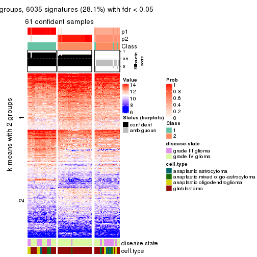</p>

</div>
<div id='tab-MAD-kmeans-get-signatures-no-scale-2'>
<pre><code class="r">get_signatures(res, k = 3, scale_rows = FALSE)
</code></pre>

<p></p>

</div>
<div id='tab-MAD-kmeans-get-signatures-no-scale-3'>
<pre><code class="r">get_signatures(res, k = 4, scale_rows = FALSE)
</code></pre>

<p></p>

</div>
<div id='tab-MAD-kmeans-get-signatures-no-scale-4'>
<pre><code class="r">get_signatures(res, k = 5, scale_rows = FALSE)
</code></pre>

<p>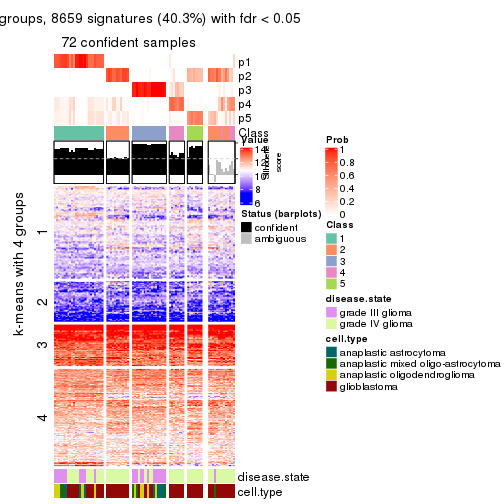</p>

</div>
<div id='tab-MAD-kmeans-get-signatures-no-scale-5'>
<pre><code class="r">get_signatures(res, k = 6, scale_rows = FALSE)
</code></pre>

<p></p>

</div>
</div>


Compare the overlap of signatures from different k:

```r
compare_signatures(res)
```


`get_signature()` returns a data frame invisibly. TO get the list of signatures, the function
call should be assigned to a variable explicitly. In following code, if `plot` argument is set
to `FALSE`, no heatmap is plotted while only the differential analysis is performed.

```r
# code only for demonstration
tb = get_signature(res, k = ..., plot = FALSE)
```

An example of the output of `tb` is:

```
#>   which_row         fdr    mean_1    mean_2 scaled_mean_1 scaled_mean_2 km
#> 1        38 0.042760348  8.373488  9.131774    -0.5533452     0.5164555  1
#> 2        40 0.018707592  7.106213  8.469186    -0.6173731     0.5762149  1
#> 3        55 0.019134737 10.221463 11.207825    -0.6159697     0.5749050  1
#> 4        59 0.006059896  5.921854  7.869574    -0.6899429     0.6439467  1
#> 5        60 0.018055526  8.928898 10.211722    -0.6204761     0.5791110  1
#> 6        98 0.009384629 15.714769 14.887706     0.6635654    -0.6193277  2
...
```

The columns in `tb` are:

1. `which_row`: row indices corresponding to the input matrix.
2. `fdr`: FDR for the differential test. 
3. `mean_x`: The mean value in group x.
4. `scaled_mean_x`: The mean value in group x after rows are scaled.
5. `km`: Row groups if k-means clustering is applied to rows.


UMAP plot which shows how samples are separated.


<script>
$( function() {
	$( '#tabs-MAD-kmeans-dimension-reduction' ).tabs();
} );
</script>
<div id='tabs-MAD-kmeans-dimension-reduction'>
<ul>
<li><a href='#tab-MAD-kmeans-dimension-reduction-1'>k = 2</a></li>
<li><a href='#tab-MAD-kmeans-dimension-reduction-2'>k = 3</a></li>
<li><a href='#tab-MAD-kmeans-dimension-reduction-3'>k = 4</a></li>
<li><a href='#tab-MAD-kmeans-dimension-reduction-4'>k = 5</a></li>
<li><a href='#tab-MAD-kmeans-dimension-reduction-5'>k = 6</a></li>
</ul>
<div id='tab-MAD-kmeans-dimension-reduction-1'>
<pre><code class="r">dimension_reduction(res, k = 2, method = &quot;UMAP&quot;)
</code></pre>

<p></p>

</div>
<div id='tab-MAD-kmeans-dimension-reduction-2'>
<pre><code class="r">dimension_reduction(res, k = 3, method = &quot;UMAP&quot;)
</code></pre>

<p></p>

</div>
<div id='tab-MAD-kmeans-dimension-reduction-3'>
<pre><code class="r">dimension_reduction(res, k = 4, method = &quot;UMAP&quot;)
</code></pre>

<p></p>

</div>
<div id='tab-MAD-kmeans-dimension-reduction-4'>
<pre><code class="r">dimension_reduction(res, k = 5, method = &quot;UMAP&quot;)
</code></pre>

<p></p>

</div>
<div id='tab-MAD-kmeans-dimension-reduction-5'>
<pre><code class="r">dimension_reduction(res, k = 6, method = &quot;UMAP&quot;)
</code></pre>

<p></p>

</div>
</div>


Following heatmap shows how subgroups are split when increasing `k`:

```r
collect_classes(res)
```


Test correlation between subgroups and known annotations. If the known
annotation is numeric, one-way ANOVA test is applied, and if the known
annotation is discrete, chi-squared contingency table test is applied.

```r
test_to_known_factors(res)
```

```
#>             n disease.state(p) cell.type(p) k
#> MAD:kmeans 61         5.18e-04      0.00180 2
#> MAD:kmeans 83         5.12e-04      0.01152 3
#> MAD:kmeans 68         9.13e-05      0.00696 4
#> MAD:kmeans 72         1.53e-05      0.00468 5
#> MAD:kmeans 62         5.20e-06      0.00484 6
```


If matrix rows can be associated to genes, consider to use `GO_Enrichment(res,
...)` to perform function enrichment for the signature genes.


 

---------------------------------------------------


### MAD:skmeans**


The object with results only for a single top-value method and a single partition method 
can be extracted as:

```r
res = res_list["MAD", "skmeans"]
# you can also extract it by
# res = res_list["MAD:skmeans"]
```

A summary of `res` and all the functions that can be applied to it:

```r
res
```

```
#> A 'ConsensusPartition' object with k = 2, 3, 4, 5, 6.
#>   On a matrix with 21512 rows and 85 columns.
#>   Top rows (1000, 2000, 3000, 4000, 5000) are extracted by 'MAD' method.
#>   Subgroups are detected by 'skmeans' method.
#>   Performed in total 1250 partitions by row resampling.
#>   Best k for subgroups seems to be 3.
#> 
#> Following methods can be applied to this 'ConsensusPartition' object:
#>  [1] "cola_report"             "collect_classes"         "collect_plots"          
#>  [4] "collect_stats"           "colnames"                "compare_signatures"     
#>  [7] "consensus_heatmap"       "dimension_reduction"     "functional_enrichment"  
#> [10] "get_anno_col"            "get_anno"                "get_classes"            
#> [13] "get_consensus"           "get_matrix"              "get_membership"         
#> [16] "get_param"               "get_signatures"          "get_stats"              
#> [19] "is_best_k"               "is_stable_k"             "membership_heatmap"     
#> [22] "ncol"                    "nrow"                    "plot_ecdf"              
#> [25] "rownames"                "select_partition_number" "show"                   
#> [28] "suggest_best_k"          "test_to_known_factors"
```

`collect_plots()` function collects all the plots made from `res` for all `k` (number of partitions)
into one single page to provide an easy and fast comparison between different `k`.

```r
collect_plots(res)
```


The plots are:

- The first row: a plot of the ECDF (Empirical cumulative distribution
  function) curves of the consensus matrix for each `k` and the heatmap of
  predicted classes for each `k`.
- The second row: heatmaps of the consensus matrix for each `k`.
- The third row: heatmaps of the membership matrix for each `k`.
- The fouth row: heatmaps of the signatures for each `k`.

All the plots in panels can be made by individual functions and they are
plotted later in this section.

`select_partition_number()` produces several plots showing different
statistics for choosing "optimized" `k`. There are following statistics:

- ECDF curves of the consensus matrix for each `k`;
- 1-PAC. [The PAC
  score](https://en.wikipedia.org/wiki/Consensus_clustering#Over-interpretation_potential_of_consensus_clustering)
  measures the proportion of the ambiguous subgrouping.
- Mean silhouette score.
- Concordance. The mean probability of fiting the consensus class ids in all
  partitions.
- Area increased. Denote $A_k$ as the area under the ECDF curve for current
  `k`, the area increased is defined as $A_k - A_{k-1}$.
- Rand index. The percent of pairs of samples that are both in a same cluster
  or both are not in a same cluster in the partition of k and k-1.
- Jaccard index. The ratio of pairs of samples are both in a same cluster in
  the partition of k and k-1 and the pairs of samples are both in a same
  cluster in the partition k or k-1.

The detailed explanations of these statistics can be found in [the cola
vignette](http://bioconductor.org/packages/devel/bioc/vignettes/cola/inst/doc/cola.html#toc_13).

Generally speaking, lower PAC score, higher mean silhouette score or higher
concordance corresponds to better partition. Rand index and Jaccard index
measure how similar the current partition is compared to partition with `k-1`.
If they are too similar, we won't accept `k` is better than `k-1`.

```r
select_partition_number(res)
```


The numeric values for all these statistics can be obtained by `get_stats()`.

```r
get_stats(res)
```

```
#>   k 1-PAC mean_silhouette concordance area_increased  Rand Jaccard
#> 2 2 0.630           0.776       0.911         0.4983 0.497   0.497
#> 3 3 0.984           0.960       0.982         0.3456 0.754   0.542
#> 4 4 0.777           0.796       0.878         0.0917 0.950   0.850
#> 5 5 0.698           0.656       0.807         0.0625 0.954   0.840
#> 6 6 0.668           0.578       0.736         0.0395 0.991   0.965
```

`suggest_best_k()` suggests the best $k$ based on these statistics. The rules are as follows:

- All $k$ with Jaccard index larger than 0.95 are removed because the increase of
  the partition number does not provides enough extra information. If all $k$ are removed,
  the best $k$ is assigned by `NA`.
- For $k$ with 1-PAC larger than 0.9, the maximal $k$ is taken as the "best k". Other $k$ is called "optional k".
- If it does not fit the second rule. The $k$ with the highest vote of highest
  1-PAC, mean silhouette and concordance is taken as the "best k".

```r
suggest_best_k(res)
```

```
#> [1] 3
```


Following shows the table of the partitions (You need to click the **show/hide
code output** link to see it). The membership matrix (columns with name `p*`)
is inferred by
[`clue::cl_consensus()`](https://www.rdocumentation.org/link/cl_consensus?package=clue)
function with the `SE` method. Basically the value in the membership matrix
represents the probability to belong to a certain group. The finall class
label for an item is determined with the group with highest probability it
belongs to.

In `get_classes()` function, the entropy is calculated from the membership
matrix and the silhouette score is calculated from the consensus matrix.


<script>
$( function() {
	$( '#tabs-MAD-skmeans-get-classes' ).tabs();
} );
</script>
<div id='tabs-MAD-skmeans-get-classes'>
<ul>
<li><a href='#tab-MAD-skmeans-get-classes-1'>k = 2</a></li>
<li><a href='#tab-MAD-skmeans-get-classes-2'>k = 3</a></li>
<li><a href='#tab-MAD-skmeans-get-classes-3'>k = 4</a></li>
<li><a href='#tab-MAD-skmeans-get-classes-4'>k = 5</a></li>
<li><a href='#tab-MAD-skmeans-get-classes-5'>k = 6</a></li>
</ul>

<div id='tab-MAD-skmeans-get-classes-1'>
<p><a id='tab-MAD-skmeans-get-classes-1-a' style='color:#0366d6' href='#'>show/hide code output</a></p>
<pre><code class="r">cbind(get_classes(res, k = 2), get_membership(res, k = 2))
</code></pre>

<pre><code>#&gt;          class entropy silhouette    p1    p2
#&gt; GSM99497     2  0.9608    0.45092 0.384 0.616
#&gt; GSM99503     1  0.0000    0.92781 1.000 0.000
#&gt; GSM99505     1  0.0000    0.92781 1.000 0.000
#&gt; GSM99507     2  0.9635    0.44217 0.388 0.612
#&gt; GSM99567     2  0.9460    0.48913 0.364 0.636
#&gt; GSM99575     1  0.0000    0.92781 1.000 0.000
#&gt; GSM99593     2  0.6801    0.72883 0.180 0.820
#&gt; GSM99595     2  0.9608    0.45092 0.384 0.616
#&gt; GSM99469     1  0.0000    0.92781 1.000 0.000
#&gt; GSM99499     1  0.0000    0.92781 1.000 0.000
#&gt; GSM99501     1  0.0000    0.92781 1.000 0.000
#&gt; GSM99509     1  0.9988   -0.07138 0.520 0.480
#&gt; GSM99569     1  0.9209    0.40535 0.664 0.336
#&gt; GSM99597     1  0.8661    0.52036 0.712 0.288
#&gt; GSM99601     2  0.0000    0.86181 0.000 1.000
#&gt; GSM99459     1  0.0000    0.92781 1.000 0.000
#&gt; GSM99461     1  0.0000    0.92781 1.000 0.000
#&gt; GSM99511     2  0.9580    0.45855 0.380 0.620
#&gt; GSM99513     2  0.9491    0.48122 0.368 0.632
#&gt; GSM99515     2  0.9710    0.41395 0.400 0.600
#&gt; GSM99517     1  0.0000    0.92781 1.000 0.000
#&gt; GSM99519     1  0.0000    0.92781 1.000 0.000
#&gt; GSM99521     2  0.9635    0.44247 0.388 0.612
#&gt; GSM99523     1  0.0000    0.92781 1.000 0.000
#&gt; GSM99571     1  0.0000    0.92781 1.000 0.000
#&gt; GSM99599     1  0.0000    0.92781 1.000 0.000
#&gt; GSM99433     2  0.0000    0.86181 0.000 1.000
#&gt; GSM99435     2  0.9129    0.54614 0.328 0.672
#&gt; GSM99437     2  0.0000    0.86181 0.000 1.000
#&gt; GSM99439     2  0.0000    0.86181 0.000 1.000
#&gt; GSM99441     1  0.0000    0.92781 1.000 0.000
#&gt; GSM99443     2  0.0000    0.86181 0.000 1.000
#&gt; GSM99445     2  0.0000    0.86181 0.000 1.000
#&gt; GSM99447     2  0.0000    0.86181 0.000 1.000
#&gt; GSM99449     2  0.0000    0.86181 0.000 1.000
#&gt; GSM99451     1  0.1843    0.90455 0.972 0.028
#&gt; GSM99453     1  0.0000    0.92781 1.000 0.000
#&gt; GSM99455     1  0.0000    0.92781 1.000 0.000
#&gt; GSM99457     1  0.0000    0.92781 1.000 0.000
#&gt; GSM99463     2  0.0000    0.86181 0.000 1.000
#&gt; GSM99465     1  0.0000    0.92781 1.000 0.000
#&gt; GSM99467     2  0.0000    0.86181 0.000 1.000
#&gt; GSM99471     1  0.0000    0.92781 1.000 0.000
#&gt; GSM99473     1  0.0000    0.92781 1.000 0.000
#&gt; GSM99475     1  0.8608    0.53284 0.716 0.284
#&gt; GSM99477     2  0.0000    0.86181 0.000 1.000
#&gt; GSM99479     2  0.0000    0.86181 0.000 1.000
#&gt; GSM99481     1  0.0000    0.92781 1.000 0.000
#&gt; GSM99483     1  0.0000    0.92781 1.000 0.000
#&gt; GSM99485     2  0.0000    0.86181 0.000 1.000
#&gt; GSM99487     2  0.0000    0.86181 0.000 1.000
#&gt; GSM99489     2  0.0000    0.86181 0.000 1.000
#&gt; GSM99491     2  0.0000    0.86181 0.000 1.000
#&gt; GSM99493     1  0.0000    0.92781 1.000 0.000
#&gt; GSM99495     2  0.0000    0.86181 0.000 1.000
#&gt; GSM99525     1  0.0000    0.92781 1.000 0.000
#&gt; GSM99527     1  0.5737    0.79691 0.864 0.136
#&gt; GSM99529     2  0.0938    0.85420 0.012 0.988
#&gt; GSM99531     1  0.1843    0.90427 0.972 0.028
#&gt; GSM99533     1  0.0000    0.92781 1.000 0.000
#&gt; GSM99535     2  0.9944    0.14882 0.456 0.544
#&gt; GSM99537     1  0.0000    0.92781 1.000 0.000
#&gt; GSM99539     2  0.0000    0.86181 0.000 1.000
#&gt; GSM99541     1  0.0000    0.92781 1.000 0.000
#&gt; GSM99543     2  0.9977    0.10167 0.472 0.528
#&gt; GSM99545     2  0.0000    0.86181 0.000 1.000
#&gt; GSM99547     1  0.7056    0.70420 0.808 0.192
#&gt; GSM99549     2  0.0000    0.86181 0.000 1.000
#&gt; GSM99551     1  0.0000    0.92781 1.000 0.000
#&gt; GSM99553     2  0.5737    0.76893 0.136 0.864
#&gt; GSM99555     2  0.0000    0.86181 0.000 1.000
#&gt; GSM99557     2  0.0000    0.86181 0.000 1.000
#&gt; GSM99559     2  0.0000    0.86181 0.000 1.000
#&gt; GSM99561     2  0.0000    0.86181 0.000 1.000
#&gt; GSM99563     1  0.9963   -0.00877 0.536 0.464
#&gt; GSM99565     2  0.0000    0.86181 0.000 1.000
#&gt; GSM99573     2  0.0000    0.86181 0.000 1.000
#&gt; GSM99577     1  0.0000    0.92781 1.000 0.000
#&gt; GSM99579     2  0.0000    0.86181 0.000 1.000
#&gt; GSM99581     2  0.8443    0.62645 0.272 0.728
#&gt; GSM99583     2  0.9896    0.20667 0.440 0.560
#&gt; GSM99585     2  0.0000    0.86181 0.000 1.000
#&gt; GSM99587     1  0.0000    0.92781 1.000 0.000
#&gt; GSM99589     2  0.0000    0.86181 0.000 1.000
#&gt; GSM99591     2  0.0000    0.86181 0.000 1.000
</code></pre>

<script>
$('#tab-MAD-skmeans-get-classes-1-a').parent().next().next().hide();
$('#tab-MAD-skmeans-get-classes-1-a').click(function(){
  $('#tab-MAD-skmeans-get-classes-1-a').parent().next().next().toggle();
  return(false);
});
</script>
</div>

<div id='tab-MAD-skmeans-get-classes-2'>
<p><a id='tab-MAD-skmeans-get-classes-2-a' style='color:#0366d6' href='#'>show/hide code output</a></p>
<pre><code class="r">cbind(get_classes(res, k = 3), get_membership(res, k = 3))
</code></pre>

<pre><code>#&gt;          class entropy silhouette    p1    p2    p3
#&gt; GSM99497     3  0.0000      0.983 0.000 0.000 1.000
#&gt; GSM99503     1  0.0000      0.987 1.000 0.000 0.000
#&gt; GSM99505     1  0.0000      0.987 1.000 0.000 0.000
#&gt; GSM99507     3  0.0000      0.983 0.000 0.000 1.000
#&gt; GSM99567     3  0.0000      0.983 0.000 0.000 1.000
#&gt; GSM99575     1  0.0000      0.987 1.000 0.000 0.000
#&gt; GSM99593     3  0.0000      0.983 0.000 0.000 1.000
#&gt; GSM99595     3  0.0000      0.983 0.000 0.000 1.000
#&gt; GSM99469     1  0.0000      0.987 1.000 0.000 0.000
#&gt; GSM99499     1  0.0000      0.987 1.000 0.000 0.000
#&gt; GSM99501     1  0.0000      0.987 1.000 0.000 0.000
#&gt; GSM99509     3  0.0000      0.983 0.000 0.000 1.000
#&gt; GSM99569     3  0.0000      0.983 0.000 0.000 1.000
#&gt; GSM99597     3  0.0000      0.983 0.000 0.000 1.000
#&gt; GSM99601     2  0.0000      0.976 0.000 1.000 0.000
#&gt; GSM99459     1  0.0000      0.987 1.000 0.000 0.000
#&gt; GSM99461     1  0.0000      0.987 1.000 0.000 0.000
#&gt; GSM99511     3  0.0000      0.983 0.000 0.000 1.000
#&gt; GSM99513     3  0.0000      0.983 0.000 0.000 1.000
#&gt; GSM99515     3  0.0000      0.983 0.000 0.000 1.000
#&gt; GSM99517     1  0.0000      0.987 1.000 0.000 0.000
#&gt; GSM99519     1  0.0000      0.987 1.000 0.000 0.000
#&gt; GSM99521     3  0.0000      0.983 0.000 0.000 1.000
#&gt; GSM99523     3  0.0000      0.983 0.000 0.000 1.000
#&gt; GSM99571     1  0.0000      0.987 1.000 0.000 0.000
#&gt; GSM99599     1  0.0000      0.987 1.000 0.000 0.000
#&gt; GSM99433     2  0.0000      0.976 0.000 1.000 0.000
#&gt; GSM99435     3  0.0000      0.983 0.000 0.000 1.000
#&gt; GSM99437     2  0.0000      0.976 0.000 1.000 0.000
#&gt; GSM99439     2  0.0000      0.976 0.000 1.000 0.000
#&gt; GSM99441     1  0.0000      0.987 1.000 0.000 0.000
#&gt; GSM99443     2  0.0000      0.976 0.000 1.000 0.000
#&gt; GSM99445     2  0.0000      0.976 0.000 1.000 0.000
#&gt; GSM99447     2  0.0000      0.976 0.000 1.000 0.000
#&gt; GSM99449     3  0.0000      0.983 0.000 0.000 1.000
#&gt; GSM99451     3  0.0000      0.983 0.000 0.000 1.000
#&gt; GSM99453     1  0.0000      0.987 1.000 0.000 0.000
#&gt; GSM99455     1  0.0000      0.987 1.000 0.000 0.000
#&gt; GSM99457     1  0.0000      0.987 1.000 0.000 0.000
#&gt; GSM99463     2  0.0000      0.976 0.000 1.000 0.000
#&gt; GSM99465     1  0.3267      0.865 0.884 0.000 0.116
#&gt; GSM99467     2  0.0000      0.976 0.000 1.000 0.000
#&gt; GSM99471     1  0.0000      0.987 1.000 0.000 0.000
#&gt; GSM99473     1  0.0000      0.987 1.000 0.000 0.000
#&gt; GSM99475     3  0.0000      0.983 0.000 0.000 1.000
#&gt; GSM99477     2  0.1163      0.952 0.000 0.972 0.028
#&gt; GSM99479     2  0.0000      0.976 0.000 1.000 0.000
#&gt; GSM99481     1  0.0000      0.987 1.000 0.000 0.000
#&gt; GSM99483     1  0.0000      0.987 1.000 0.000 0.000
#&gt; GSM99485     2  0.0000      0.976 0.000 1.000 0.000
#&gt; GSM99487     2  0.0000      0.976 0.000 1.000 0.000
#&gt; GSM99489     2  0.0000      0.976 0.000 1.000 0.000
#&gt; GSM99491     2  0.0000      0.976 0.000 1.000 0.000
#&gt; GSM99493     1  0.0000      0.987 1.000 0.000 0.000
#&gt; GSM99495     2  0.0000      0.976 0.000 1.000 0.000
#&gt; GSM99525     1  0.0000      0.987 1.000 0.000 0.000
#&gt; GSM99527     3  0.4575      0.804 0.160 0.012 0.828
#&gt; GSM99529     2  0.0000      0.976 0.000 1.000 0.000
#&gt; GSM99531     3  0.0000      0.983 0.000 0.000 1.000
#&gt; GSM99533     3  0.3752      0.834 0.144 0.000 0.856
#&gt; GSM99535     2  0.4062      0.795 0.164 0.836 0.000
#&gt; GSM99537     1  0.0000      0.987 1.000 0.000 0.000
#&gt; GSM99539     2  0.0892      0.960 0.000 0.980 0.020
#&gt; GSM99541     1  0.0000      0.987 1.000 0.000 0.000
#&gt; GSM99543     2  0.0592      0.966 0.012 0.988 0.000
#&gt; GSM99545     2  0.0424      0.970 0.000 0.992 0.008
#&gt; GSM99547     1  0.6613      0.692 0.740 0.072 0.188
#&gt; GSM99549     2  0.0000      0.976 0.000 1.000 0.000
#&gt; GSM99551     1  0.0000      0.987 1.000 0.000 0.000
#&gt; GSM99553     3  0.0000      0.983 0.000 0.000 1.000
#&gt; GSM99555     2  0.0000      0.976 0.000 1.000 0.000
#&gt; GSM99557     2  0.0000      0.976 0.000 1.000 0.000
#&gt; GSM99559     3  0.2165      0.923 0.000 0.064 0.936
#&gt; GSM99561     2  0.0000      0.976 0.000 1.000 0.000
#&gt; GSM99563     3  0.0000      0.983 0.000 0.000 1.000
#&gt; GSM99565     2  0.0000      0.976 0.000 1.000 0.000
#&gt; GSM99573     2  0.0000      0.976 0.000 1.000 0.000
#&gt; GSM99577     1  0.0000      0.987 1.000 0.000 0.000
#&gt; GSM99579     2  0.0000      0.976 0.000 1.000 0.000
#&gt; GSM99581     3  0.0000      0.983 0.000 0.000 1.000
#&gt; GSM99583     2  0.9273      0.172 0.364 0.472 0.164
#&gt; GSM99585     2  0.0000      0.976 0.000 1.000 0.000
#&gt; GSM99587     1  0.0000      0.987 1.000 0.000 0.000
#&gt; GSM99589     2  0.0000      0.976 0.000 1.000 0.000
#&gt; GSM99591     2  0.0000      0.976 0.000 1.000 0.000
</code></pre>

<script>
$('#tab-MAD-skmeans-get-classes-2-a').parent().next().next().hide();
$('#tab-MAD-skmeans-get-classes-2-a').click(function(){
  $('#tab-MAD-skmeans-get-classes-2-a').parent().next().next().toggle();
  return(false);
});
</script>
</div>

<div id='tab-MAD-skmeans-get-classes-3'>
<p><a id='tab-MAD-skmeans-get-classes-3-a' style='color:#0366d6' href='#'>show/hide code output</a></p>
<pre><code class="r">cbind(get_classes(res, k = 4), get_membership(res, k = 4))
</code></pre>

<pre><code>#&gt;          class entropy silhouette    p1    p2    p3    p4
#&gt; GSM99497     3  0.0000      0.903 0.000 0.000 1.000 0.000
#&gt; GSM99503     1  0.0188      0.955 0.996 0.000 0.000 0.004
#&gt; GSM99505     1  0.1576      0.916 0.948 0.000 0.048 0.004
#&gt; GSM99507     3  0.0000      0.903 0.000 0.000 1.000 0.000
#&gt; GSM99567     3  0.0000      0.903 0.000 0.000 1.000 0.000
#&gt; GSM99575     1  0.0188      0.955 0.996 0.000 0.000 0.004
#&gt; GSM99593     3  0.0469      0.902 0.000 0.000 0.988 0.012
#&gt; GSM99595     3  0.0000      0.903 0.000 0.000 1.000 0.000
#&gt; GSM99469     1  0.0336      0.954 0.992 0.000 0.000 0.008
#&gt; GSM99499     1  0.0188      0.955 0.996 0.000 0.000 0.004
#&gt; GSM99501     1  0.0469      0.954 0.988 0.000 0.000 0.012
#&gt; GSM99509     3  0.0000      0.903 0.000 0.000 1.000 0.000
#&gt; GSM99569     3  0.0707      0.899 0.000 0.000 0.980 0.020
#&gt; GSM99597     3  0.1211      0.883 0.000 0.000 0.960 0.040
#&gt; GSM99601     2  0.1211      0.854 0.000 0.960 0.000 0.040
#&gt; GSM99459     1  0.2216      0.900 0.908 0.000 0.000 0.092
#&gt; GSM99461     1  0.2149      0.904 0.912 0.000 0.000 0.088
#&gt; GSM99511     3  0.1637      0.869 0.000 0.000 0.940 0.060
#&gt; GSM99513     3  0.0921      0.894 0.000 0.000 0.972 0.028
#&gt; GSM99515     3  0.0000      0.903 0.000 0.000 1.000 0.000
#&gt; GSM99517     1  0.0188      0.955 0.996 0.000 0.000 0.004
#&gt; GSM99519     1  0.1557      0.930 0.944 0.000 0.000 0.056
#&gt; GSM99521     3  0.2589      0.799 0.000 0.000 0.884 0.116
#&gt; GSM99523     3  0.0469      0.902 0.000 0.000 0.988 0.012
#&gt; GSM99571     1  0.0592      0.953 0.984 0.000 0.000 0.016
#&gt; GSM99599     1  0.0000      0.955 1.000 0.000 0.000 0.000
#&gt; GSM99433     2  0.4500      0.703 0.000 0.684 0.000 0.316
#&gt; GSM99435     3  0.4877      0.193 0.000 0.000 0.592 0.408
#&gt; GSM99437     2  0.2973      0.834 0.000 0.856 0.000 0.144
#&gt; GSM99439     2  0.1022      0.846 0.000 0.968 0.000 0.032
#&gt; GSM99441     1  0.0188      0.955 0.996 0.000 0.000 0.004
#&gt; GSM99443     2  0.2149      0.850 0.000 0.912 0.000 0.088
#&gt; GSM99445     2  0.1389      0.851 0.000 0.952 0.000 0.048
#&gt; GSM99447     2  0.2760      0.838 0.000 0.872 0.000 0.128
#&gt; GSM99449     3  0.1256      0.883 0.000 0.008 0.964 0.028
#&gt; GSM99451     3  0.5000     -0.148 0.000 0.000 0.500 0.500
#&gt; GSM99453     1  0.0592      0.953 0.984 0.000 0.000 0.016
#&gt; GSM99455     1  0.0592      0.953 0.984 0.000 0.000 0.016
#&gt; GSM99457     1  0.1211      0.946 0.960 0.000 0.000 0.040
#&gt; GSM99463     2  0.0817      0.847 0.000 0.976 0.000 0.024
#&gt; GSM99465     4  0.5980      0.329 0.396 0.000 0.044 0.560
#&gt; GSM99467     2  0.4406      0.754 0.000 0.700 0.000 0.300
#&gt; GSM99471     1  0.2011      0.911 0.920 0.000 0.000 0.080
#&gt; GSM99473     1  0.0592      0.952 0.984 0.000 0.000 0.016
#&gt; GSM99475     4  0.4925      0.221 0.000 0.000 0.428 0.572
#&gt; GSM99477     2  0.7091      0.462 0.000 0.508 0.136 0.356
#&gt; GSM99479     2  0.4632      0.743 0.000 0.688 0.004 0.308
#&gt; GSM99481     1  0.0000      0.955 1.000 0.000 0.000 0.000
#&gt; GSM99483     1  0.0707      0.952 0.980 0.000 0.000 0.020
#&gt; GSM99485     2  0.2647      0.834 0.000 0.880 0.000 0.120
#&gt; GSM99487     2  0.3123      0.829 0.000 0.844 0.000 0.156
#&gt; GSM99489     2  0.0469      0.851 0.000 0.988 0.000 0.012
#&gt; GSM99491     2  0.2216      0.849 0.000 0.908 0.000 0.092
#&gt; GSM99493     1  0.0592      0.953 0.984 0.000 0.000 0.016
#&gt; GSM99495     2  0.1022      0.846 0.000 0.968 0.000 0.032
#&gt; GSM99525     1  0.0592      0.954 0.984 0.000 0.000 0.016
#&gt; GSM99527     4  0.5433      0.571 0.040 0.060 0.124 0.776
#&gt; GSM99529     2  0.5602      0.362 0.000 0.508 0.020 0.472
#&gt; GSM99531     4  0.6148      0.327 0.052 0.000 0.408 0.540
#&gt; GSM99533     4  0.6275      0.582 0.136 0.000 0.204 0.660
#&gt; GSM99535     2  0.5766      0.674 0.104 0.704 0.000 0.192
#&gt; GSM99537     1  0.0592      0.953 0.984 0.000 0.000 0.016
#&gt; GSM99539     2  0.5427      0.398 0.000 0.568 0.016 0.416
#&gt; GSM99541     1  0.2973      0.829 0.856 0.000 0.000 0.144
#&gt; GSM99543     2  0.3372      0.810 0.036 0.868 0.000 0.096
#&gt; GSM99545     2  0.4866      0.470 0.000 0.596 0.000 0.404
#&gt; GSM99547     4  0.6663      0.530 0.268 0.028 0.068 0.636
#&gt; GSM99549     2  0.1302      0.844 0.000 0.956 0.000 0.044
#&gt; GSM99551     1  0.4250      0.622 0.724 0.000 0.000 0.276
#&gt; GSM99553     3  0.0336      0.901 0.000 0.000 0.992 0.008
#&gt; GSM99555     2  0.2281      0.846 0.000 0.904 0.000 0.096
#&gt; GSM99557     2  0.0592      0.851 0.000 0.984 0.000 0.016
#&gt; GSM99559     3  0.4046      0.696 0.000 0.048 0.828 0.124
#&gt; GSM99561     2  0.2281      0.841 0.000 0.904 0.000 0.096
#&gt; GSM99563     3  0.0592      0.900 0.000 0.000 0.984 0.016
#&gt; GSM99565     2  0.2921      0.834 0.000 0.860 0.000 0.140
#&gt; GSM99573     2  0.1302      0.844 0.000 0.956 0.000 0.044
#&gt; GSM99577     1  0.1792      0.926 0.932 0.000 0.000 0.068
#&gt; GSM99579     2  0.2589      0.837 0.000 0.884 0.000 0.116
#&gt; GSM99581     3  0.0000      0.903 0.000 0.000 1.000 0.000
#&gt; GSM99583     4  0.9495      0.319 0.176 0.200 0.204 0.420
#&gt; GSM99585     2  0.4382      0.744 0.000 0.704 0.000 0.296
#&gt; GSM99587     1  0.0592      0.953 0.984 0.000 0.000 0.016
#&gt; GSM99589     2  0.1022      0.854 0.000 0.968 0.000 0.032
#&gt; GSM99591     2  0.1474      0.852 0.000 0.948 0.000 0.052
</code></pre>

<script>
$('#tab-MAD-skmeans-get-classes-3-a').parent().next().next().hide();
$('#tab-MAD-skmeans-get-classes-3-a').click(function(){
  $('#tab-MAD-skmeans-get-classes-3-a').parent().next().next().toggle();
  return(false);
});
</script>
</div>

<div id='tab-MAD-skmeans-get-classes-4'>
<p><a id='tab-MAD-skmeans-get-classes-4-a' style='color:#0366d6' href='#'>show/hide code output</a></p>
<pre><code class="r">cbind(get_classes(res, k = 5), get_membership(res, k = 5))
</code></pre>

<pre><code>#&gt;          class entropy silhouette    p1    p2    p3    p4    p5
#&gt; GSM99497     3  0.0000    0.87859 0.000 0.000 1.000 0.000 0.000
#&gt; GSM99503     1  0.0992    0.88524 0.968 0.000 0.000 0.024 0.008
#&gt; GSM99505     1  0.2919    0.86068 0.888 0.000 0.044 0.044 0.024
#&gt; GSM99507     3  0.0000    0.87859 0.000 0.000 1.000 0.000 0.000
#&gt; GSM99567     3  0.0162    0.87845 0.000 0.000 0.996 0.000 0.004
#&gt; GSM99575     1  0.0992    0.88370 0.968 0.000 0.000 0.024 0.008
#&gt; GSM99593     3  0.1668    0.87706 0.000 0.000 0.940 0.028 0.032
#&gt; GSM99595     3  0.0290    0.87956 0.000 0.000 0.992 0.000 0.008
#&gt; GSM99469     1  0.2304    0.87179 0.908 0.000 0.000 0.048 0.044
#&gt; GSM99499     1  0.1907    0.88581 0.928 0.000 0.000 0.044 0.028
#&gt; GSM99501     1  0.2228    0.87276 0.912 0.000 0.000 0.048 0.040
#&gt; GSM99509     3  0.0794    0.88029 0.000 0.000 0.972 0.028 0.000
#&gt; GSM99569     3  0.2344    0.86363 0.000 0.000 0.904 0.064 0.032
#&gt; GSM99597     3  0.2951    0.80854 0.000 0.000 0.860 0.112 0.028
#&gt; GSM99601     2  0.2329    0.63573 0.000 0.876 0.000 0.000 0.124
#&gt; GSM99459     1  0.3075    0.84742 0.860 0.000 0.000 0.092 0.048
#&gt; GSM99461     1  0.3437    0.83077 0.832 0.000 0.000 0.120 0.048
#&gt; GSM99511     3  0.3012    0.82398 0.000 0.000 0.852 0.124 0.024
#&gt; GSM99513     3  0.2351    0.85847 0.000 0.000 0.896 0.088 0.016
#&gt; GSM99515     3  0.0324    0.87947 0.000 0.000 0.992 0.004 0.004
#&gt; GSM99517     1  0.0912    0.88550 0.972 0.000 0.000 0.016 0.012
#&gt; GSM99519     1  0.3226    0.84388 0.852 0.000 0.000 0.088 0.060
#&gt; GSM99521     3  0.3438    0.73902 0.000 0.000 0.808 0.172 0.020
#&gt; GSM99523     3  0.2162    0.87055 0.008 0.000 0.916 0.064 0.012
#&gt; GSM99571     1  0.1310    0.88476 0.956 0.000 0.000 0.024 0.020
#&gt; GSM99599     1  0.0162    0.88558 0.996 0.000 0.000 0.004 0.000
#&gt; GSM99433     2  0.6040    0.22775 0.000 0.560 0.000 0.156 0.284
#&gt; GSM99435     3  0.5677    0.00605 0.000 0.000 0.496 0.424 0.080
#&gt; GSM99437     2  0.4310    0.32523 0.000 0.604 0.000 0.004 0.392
#&gt; GSM99439     2  0.0865    0.63412 0.000 0.972 0.000 0.004 0.024
#&gt; GSM99441     1  0.0912    0.88836 0.972 0.000 0.000 0.012 0.016
#&gt; GSM99443     2  0.3612    0.54747 0.000 0.732 0.000 0.000 0.268
#&gt; GSM99445     2  0.3231    0.60625 0.000 0.800 0.000 0.004 0.196
#&gt; GSM99447     2  0.3967    0.50461 0.000 0.724 0.000 0.012 0.264
#&gt; GSM99449     3  0.2609    0.85068 0.000 0.008 0.896 0.028 0.068
#&gt; GSM99451     4  0.5221    0.25981 0.000 0.000 0.400 0.552 0.048
#&gt; GSM99453     1  0.2782    0.86367 0.880 0.000 0.000 0.072 0.048
#&gt; GSM99455     1  0.2645    0.86784 0.888 0.000 0.000 0.068 0.044
#&gt; GSM99457     1  0.3075    0.86464 0.860 0.000 0.000 0.092 0.048
#&gt; GSM99463     2  0.0566    0.64063 0.000 0.984 0.000 0.004 0.012
#&gt; GSM99465     4  0.6657    0.44425 0.280 0.000 0.032 0.548 0.140
#&gt; GSM99467     5  0.4067    0.50835 0.000 0.300 0.000 0.008 0.692
#&gt; GSM99471     1  0.4569    0.78956 0.772 0.016 0.000 0.080 0.132
#&gt; GSM99473     1  0.2632    0.87515 0.888 0.000 0.000 0.040 0.072
#&gt; GSM99475     4  0.4024    0.59814 0.000 0.000 0.220 0.752 0.028
#&gt; GSM99477     5  0.5710    0.52024 0.000 0.244 0.076 0.028 0.652
#&gt; GSM99479     5  0.4161    0.52344 0.000 0.280 0.000 0.016 0.704
#&gt; GSM99481     1  0.0510    0.88689 0.984 0.000 0.000 0.000 0.016
#&gt; GSM99483     1  0.2520    0.87170 0.896 0.000 0.000 0.056 0.048
#&gt; GSM99485     2  0.4455    0.22578 0.000 0.588 0.000 0.008 0.404
#&gt; GSM99487     2  0.4367    0.26436 0.000 0.580 0.000 0.004 0.416
#&gt; GSM99489     2  0.1768    0.63869 0.000 0.924 0.000 0.004 0.072
#&gt; GSM99491     2  0.3838    0.53209 0.000 0.716 0.000 0.004 0.280
#&gt; GSM99493     1  0.2554    0.87337 0.892 0.000 0.000 0.072 0.036
#&gt; GSM99495     2  0.0566    0.63816 0.000 0.984 0.000 0.004 0.012
#&gt; GSM99525     1  0.2291    0.87635 0.908 0.000 0.000 0.036 0.056
#&gt; GSM99527     4  0.4908    0.56614 0.032 0.020 0.036 0.768 0.144
#&gt; GSM99529     5  0.6550    0.38256 0.000 0.236 0.004 0.252 0.508
#&gt; GSM99531     4  0.5544    0.55325 0.016 0.004 0.272 0.648 0.060
#&gt; GSM99533     4  0.3018    0.61671 0.024 0.000 0.080 0.876 0.020
#&gt; GSM99535     2  0.6817    0.07757 0.096 0.536 0.000 0.064 0.304
#&gt; GSM99537     1  0.2017    0.88183 0.912 0.000 0.000 0.080 0.008
#&gt; GSM99539     2  0.6916    0.06464 0.000 0.488 0.024 0.304 0.184
#&gt; GSM99541     1  0.4378    0.71556 0.716 0.000 0.000 0.248 0.036
#&gt; GSM99543     2  0.4156    0.49249 0.020 0.792 0.000 0.036 0.152
#&gt; GSM99545     2  0.5769    0.14743 0.000 0.556 0.000 0.340 0.104
#&gt; GSM99547     4  0.7799    0.37463 0.208 0.024 0.044 0.472 0.252
#&gt; GSM99549     2  0.1168    0.63016 0.000 0.960 0.000 0.008 0.032
#&gt; GSM99551     1  0.6162    0.32301 0.520 0.008 0.000 0.360 0.112
#&gt; GSM99553     3  0.1626    0.86934 0.000 0.000 0.940 0.016 0.044
#&gt; GSM99555     2  0.3790    0.52545 0.000 0.724 0.000 0.004 0.272
#&gt; GSM99557     2  0.1952    0.63848 0.000 0.912 0.000 0.004 0.084
#&gt; GSM99559     3  0.4575    0.61842 0.000 0.040 0.736 0.012 0.212
#&gt; GSM99561     2  0.3413    0.59122 0.000 0.832 0.000 0.044 0.124
#&gt; GSM99563     3  0.2006    0.86898 0.000 0.000 0.916 0.072 0.012
#&gt; GSM99565     2  0.4299    0.34448 0.000 0.608 0.000 0.004 0.388
#&gt; GSM99573     2  0.1331    0.62684 0.000 0.952 0.000 0.008 0.040
#&gt; GSM99577     1  0.4987    0.69938 0.684 0.000 0.000 0.236 0.080
#&gt; GSM99579     2  0.4238    0.36461 0.000 0.628 0.000 0.004 0.368
#&gt; GSM99581     3  0.1836    0.87888 0.000 0.000 0.932 0.036 0.032
#&gt; GSM99583     5  0.8008    0.28778 0.092 0.092 0.140 0.116 0.560
#&gt; GSM99585     5  0.5808    0.21249 0.000 0.392 0.000 0.096 0.512
#&gt; GSM99587     1  0.2654    0.86988 0.888 0.000 0.000 0.064 0.048
#&gt; GSM99589     2  0.3398    0.59833 0.000 0.780 0.000 0.004 0.216
#&gt; GSM99591     2  0.3521    0.58571 0.000 0.764 0.000 0.004 0.232
</code></pre>

<script>
$('#tab-MAD-skmeans-get-classes-4-a').parent().next().next().hide();
$('#tab-MAD-skmeans-get-classes-4-a').click(function(){
  $('#tab-MAD-skmeans-get-classes-4-a').parent().next().next().toggle();
  return(false);
});
</script>
</div>

<div id='tab-MAD-skmeans-get-classes-5'>
<p><a id='tab-MAD-skmeans-get-classes-5-a' style='color:#0366d6' href='#'>show/hide code output</a></p>
<pre><code class="r">cbind(get_classes(res, k = 6), get_membership(res, k = 6))
</code></pre>

<pre><code>#&gt;          class entropy silhouette    p1    p2    p3    p4 p5    p6
#&gt; GSM99497     3  0.1226    0.81029 0.000 0.000 0.952 0.004 NA 0.004
#&gt; GSM99503     1  0.0458    0.81576 0.984 0.000 0.000 0.000 NA 0.000
#&gt; GSM99505     1  0.3686    0.76939 0.824 0.000 0.068 0.028 NA 0.004
#&gt; GSM99507     3  0.1074    0.80898 0.000 0.000 0.960 0.000 NA 0.012
#&gt; GSM99567     3  0.0551    0.80813 0.000 0.000 0.984 0.004 NA 0.008
#&gt; GSM99575     1  0.0858    0.81435 0.968 0.000 0.000 0.004 NA 0.000
#&gt; GSM99593     3  0.2426    0.80720 0.000 0.000 0.896 0.044 NA 0.012
#&gt; GSM99595     3  0.1536    0.81206 0.000 0.000 0.944 0.020 NA 0.012
#&gt; GSM99469     1  0.2474    0.80233 0.884 0.000 0.000 0.032 NA 0.004
#&gt; GSM99499     1  0.2545    0.81512 0.884 0.000 0.004 0.020 NA 0.008
#&gt; GSM99501     1  0.2398    0.80005 0.888 0.000 0.000 0.028 NA 0.004
#&gt; GSM99509     3  0.1938    0.81122 0.000 0.000 0.920 0.020 NA 0.008
#&gt; GSM99569     3  0.4795    0.74169 0.004 0.000 0.736 0.092 NA 0.040
#&gt; GSM99597     3  0.4793    0.68353 0.004 0.000 0.728 0.140 NA 0.028
#&gt; GSM99601     2  0.2950    0.58194 0.000 0.828 0.000 0.000 NA 0.148
#&gt; GSM99459     1  0.4518    0.69977 0.736 0.000 0.000 0.124 NA 0.016
#&gt; GSM99461     1  0.4372    0.70398 0.740 0.000 0.000 0.128 NA 0.008
#&gt; GSM99511     3  0.5082    0.68657 0.000 0.000 0.696 0.132 NA 0.036
#&gt; GSM99513     3  0.4064    0.76801 0.000 0.000 0.784 0.068 NA 0.028
#&gt; GSM99515     3  0.1409    0.81048 0.000 0.000 0.948 0.008 NA 0.012
#&gt; GSM99517     1  0.1010    0.81770 0.960 0.000 0.000 0.004 NA 0.000
#&gt; GSM99519     1  0.3673    0.75887 0.804 0.000 0.000 0.100 NA 0.008
#&gt; GSM99521     3  0.4087    0.70424 0.000 0.000 0.768 0.156 NA 0.020
#&gt; GSM99523     3  0.4366    0.76735 0.020 0.000 0.784 0.068 NA 0.028
#&gt; GSM99571     1  0.1863    0.81365 0.896 0.000 0.000 0.000 NA 0.000
#&gt; GSM99599     1  0.0865    0.81930 0.964 0.000 0.000 0.000 NA 0.000
#&gt; GSM99433     2  0.6686    0.08055 0.000 0.464 0.000 0.128 NA 0.320
#&gt; GSM99435     3  0.6753    0.00554 0.000 0.000 0.416 0.364 NA 0.080
#&gt; GSM99437     2  0.4564    0.13107 0.000 0.500 0.000 0.008 NA 0.472
#&gt; GSM99439     2  0.1225    0.59414 0.000 0.952 0.000 0.000 NA 0.012
#&gt; GSM99441     1  0.1003    0.82032 0.964 0.000 0.000 0.004 NA 0.004
#&gt; GSM99443     2  0.4139    0.45545 0.000 0.644 0.000 0.008 NA 0.336
#&gt; GSM99445     2  0.3838    0.54001 0.000 0.732 0.000 0.008 NA 0.240
#&gt; GSM99447     2  0.5293    0.35928 0.000 0.620 0.000 0.036 NA 0.280
#&gt; GSM99449     3  0.4295    0.73382 0.000 0.016 0.784 0.024 NA 0.108
#&gt; GSM99451     4  0.5640    0.30212 0.000 0.000 0.308 0.564 NA 0.024
#&gt; GSM99453     1  0.3445    0.76618 0.744 0.000 0.000 0.012 NA 0.000
#&gt; GSM99455     1  0.3368    0.76936 0.756 0.000 0.000 0.012 NA 0.000
#&gt; GSM99457     1  0.4255    0.76177 0.732 0.000 0.000 0.064 NA 0.008
#&gt; GSM99463     2  0.1605    0.60492 0.000 0.936 0.000 0.004 NA 0.044
#&gt; GSM99465     4  0.7662    0.38573 0.256 0.000 0.024 0.392 NA 0.100
#&gt; GSM99467     6  0.4745    0.50247 0.000 0.180 0.004 0.028 NA 0.720
#&gt; GSM99471     1  0.5433    0.60711 0.588 0.004 0.000 0.048 NA 0.040
#&gt; GSM99473     1  0.3310    0.78291 0.816 0.000 0.000 0.020 NA 0.016
#&gt; GSM99475     4  0.4492    0.54181 0.000 0.000 0.196 0.720 NA 0.016
#&gt; GSM99477     6  0.5581    0.50763 0.000 0.124 0.064 0.036 NA 0.700
#&gt; GSM99479     6  0.4420    0.50456 0.000 0.172 0.004 0.020 NA 0.744
#&gt; GSM99481     1  0.0713    0.81949 0.972 0.000 0.000 0.000 NA 0.000
#&gt; GSM99483     1  0.3076    0.77019 0.760 0.000 0.000 0.000 NA 0.000
#&gt; GSM99485     2  0.5402    0.13745 0.000 0.484 0.000 0.020 NA 0.432
#&gt; GSM99487     6  0.4962   -0.20412 0.000 0.460 0.000 0.012 NA 0.488
#&gt; GSM99489     2  0.2163    0.59798 0.000 0.892 0.000 0.000 NA 0.092
#&gt; GSM99491     2  0.4749    0.38953 0.000 0.592 0.000 0.012 NA 0.360
#&gt; GSM99493     1  0.3109    0.79561 0.812 0.000 0.000 0.016 NA 0.004
#&gt; GSM99495     2  0.1341    0.59947 0.000 0.948 0.000 0.000 NA 0.024
#&gt; GSM99525     1  0.2964    0.78269 0.792 0.000 0.000 0.004 NA 0.000
#&gt; GSM99527     4  0.5816    0.50313 0.008 0.012 0.016 0.632 NA 0.148
#&gt; GSM99529     6  0.7219    0.29626 0.004 0.128 0.004 0.220 NA 0.476
#&gt; GSM99531     4  0.6252    0.54436 0.020 0.000 0.184 0.596 NA 0.040
#&gt; GSM99533     4  0.3656    0.57030 0.036 0.000 0.048 0.840 NA 0.024
#&gt; GSM99535     2  0.7245    0.09862 0.076 0.460 0.000 0.020 NA 0.204
#&gt; GSM99537     1  0.3108    0.81317 0.844 0.000 0.000 0.076 NA 0.004
#&gt; GSM99539     2  0.7214   -0.00365 0.000 0.412 0.024 0.332 NA 0.172
#&gt; GSM99541     1  0.5157    0.61887 0.648 0.000 0.000 0.216 NA 0.012
#&gt; GSM99543     2  0.4973    0.47722 0.008 0.716 0.000 0.028 NA 0.100
#&gt; GSM99545     2  0.6077    0.26094 0.000 0.576 0.004 0.264 NA 0.084
#&gt; GSM99547     4  0.8330    0.34461 0.116 0.040 0.016 0.336 NA 0.200
#&gt; GSM99549     2  0.2113    0.58287 0.000 0.908 0.000 0.004 NA 0.028
#&gt; GSM99551     1  0.6900    0.25704 0.420 0.008 0.000 0.220 NA 0.044
#&gt; GSM99553     3  0.3286    0.77872 0.000 0.000 0.848 0.040 NA 0.044
#&gt; GSM99555     2  0.4327    0.47543 0.000 0.688 0.000 0.004 NA 0.260
#&gt; GSM99557     2  0.2750    0.59204 0.000 0.844 0.000 0.000 NA 0.136
#&gt; GSM99559     3  0.6327    0.43709 0.000 0.076 0.604 0.024 NA 0.204
#&gt; GSM99561     2  0.4472    0.53784 0.000 0.764 0.000 0.064 NA 0.100
#&gt; GSM99563     3  0.3513    0.78609 0.000 0.000 0.824 0.056 NA 0.020
#&gt; GSM99565     2  0.4875    0.23756 0.000 0.544 0.000 0.008 NA 0.404
#&gt; GSM99573     2  0.2065    0.58824 0.000 0.912 0.000 0.004 NA 0.032
#&gt; GSM99577     1  0.5805    0.57420 0.548 0.000 0.000 0.176 NA 0.012
#&gt; GSM99579     2  0.5438    0.21990 0.000 0.500 0.000 0.016 NA 0.408
#&gt; GSM99581     3  0.3083    0.80735 0.000 0.000 0.860 0.052 NA 0.028
#&gt; GSM99583     6  0.8518    0.13277 0.080 0.052 0.104 0.096 NA 0.420
#&gt; GSM99585     6  0.5994    0.23657 0.000 0.288 0.000 0.084 NA 0.560
#&gt; GSM99587     1  0.3221    0.78814 0.792 0.000 0.000 0.020 NA 0.000
#&gt; GSM99589     2  0.4309    0.55015 0.000 0.720 0.004 0.016 NA 0.228
#&gt; GSM99591     2  0.3764    0.53170 0.000 0.724 0.000 0.008 NA 0.256
</code></pre>

<script>
$('#tab-MAD-skmeans-get-classes-5-a').parent().next().next().hide();
$('#tab-MAD-skmeans-get-classes-5-a').click(function(){
  $('#tab-MAD-skmeans-get-classes-5-a').parent().next().next().toggle();
  return(false);
});
</script>
</div>
</div>

Heatmaps for the consensus matrix. It visualizes the probability of two
samples to be in a same group.


<script>
$( function() {
	$( '#tabs-MAD-skmeans-consensus-heatmap' ).tabs();
} );
</script>
<div id='tabs-MAD-skmeans-consensus-heatmap'>
<ul>
<li><a href='#tab-MAD-skmeans-consensus-heatmap-1'>k = 2</a></li>
<li><a href='#tab-MAD-skmeans-consensus-heatmap-2'>k = 3</a></li>
<li><a href='#tab-MAD-skmeans-consensus-heatmap-3'>k = 4</a></li>
<li><a href='#tab-MAD-skmeans-consensus-heatmap-4'>k = 5</a></li>
<li><a href='#tab-MAD-skmeans-consensus-heatmap-5'>k = 6</a></li>
</ul>
<div id='tab-MAD-skmeans-consensus-heatmap-1'>
<pre><code class="r">consensus_heatmap(res, k = 2)
</code></pre>

<p></p>

</div>
<div id='tab-MAD-skmeans-consensus-heatmap-2'>
<pre><code class="r">consensus_heatmap(res, k = 3)
</code></pre>

<p></p>

</div>
<div id='tab-MAD-skmeans-consensus-heatmap-3'>
<pre><code class="r">consensus_heatmap(res, k = 4)
</code></pre>

<p></p>

</div>
<div id='tab-MAD-skmeans-consensus-heatmap-4'>
<pre><code class="r">consensus_heatmap(res, k = 5)
</code></pre>

<p>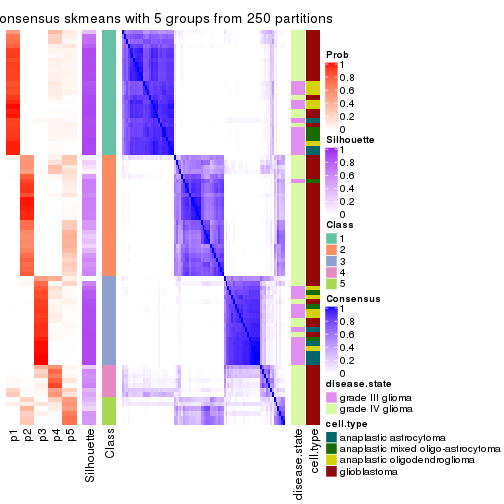</p>

</div>
<div id='tab-MAD-skmeans-consensus-heatmap-5'>
<pre><code class="r">consensus_heatmap(res, k = 6)
</code></pre>

<p></p>

</div>
</div>

Heatmaps for the membership of samples in all partitions to see how consistent they are:


<script>
$( function() {
	$( '#tabs-MAD-skmeans-membership-heatmap' ).tabs();
} );
</script>
<div id='tabs-MAD-skmeans-membership-heatmap'>
<ul>
<li><a href='#tab-MAD-skmeans-membership-heatmap-1'>k = 2</a></li>
<li><a href='#tab-MAD-skmeans-membership-heatmap-2'>k = 3</a></li>
<li><a href='#tab-MAD-skmeans-membership-heatmap-3'>k = 4</a></li>
<li><a href='#tab-MAD-skmeans-membership-heatmap-4'>k = 5</a></li>
<li><a href='#tab-MAD-skmeans-membership-heatmap-5'>k = 6</a></li>
</ul>
<div id='tab-MAD-skmeans-membership-heatmap-1'>
<pre><code class="r">membership_heatmap(res, k = 2)
</code></pre>

<p></p>

</div>
<div id='tab-MAD-skmeans-membership-heatmap-2'>
<pre><code class="r">membership_heatmap(res, k = 3)
</code></pre>

<p></p>

</div>
<div id='tab-MAD-skmeans-membership-heatmap-3'>
<pre><code class="r">membership_heatmap(res, k = 4)
</code></pre>

<p></p>

</div>
<div id='tab-MAD-skmeans-membership-heatmap-4'>
<pre><code class="r">membership_heatmap(res, k = 5)
</code></pre>

<p></p>

</div>
<div id='tab-MAD-skmeans-membership-heatmap-5'>
<pre><code class="r">membership_heatmap(res, k = 6)
</code></pre>

<p></p>

</div>
</div>

As soon as we have had the classes for columns, we can look for signatures
which are significantly different between classes which can be candidate marks
for certain classes. Following are the heatmaps for signatures.


Signature heatmaps where rows are scaled:


<script>
$( function() {
	$( '#tabs-MAD-skmeans-get-signatures' ).tabs();
} );
</script>
<div id='tabs-MAD-skmeans-get-signatures'>
<ul>
<li><a href='#tab-MAD-skmeans-get-signatures-1'>k = 2</a></li>
<li><a href='#tab-MAD-skmeans-get-signatures-2'>k = 3</a></li>
<li><a href='#tab-MAD-skmeans-get-signatures-3'>k = 4</a></li>
<li><a href='#tab-MAD-skmeans-get-signatures-4'>k = 5</a></li>
<li><a href='#tab-MAD-skmeans-get-signatures-5'>k = 6</a></li>
</ul>
<div id='tab-MAD-skmeans-get-signatures-1'>
<pre><code class="r">get_signatures(res, k = 2)
</code></pre>

<p></p>

</div>
<div id='tab-MAD-skmeans-get-signatures-2'>
<pre><code class="r">get_signatures(res, k = 3)
</code></pre>

<p></p>

</div>
<div id='tab-MAD-skmeans-get-signatures-3'>
<pre><code class="r">get_signatures(res, k = 4)
</code></pre>

<p></p>

</div>
<div id='tab-MAD-skmeans-get-signatures-4'>
<pre><code class="r">get_signatures(res, k = 5)
</code></pre>

<p></p>

</div>
<div id='tab-MAD-skmeans-get-signatures-5'>
<pre><code class="r">get_signatures(res, k = 6)
</code></pre>

<p></p>

</div>
</div>


Signature heatmaps where rows are not scaled:


<script>
$( function() {
	$( '#tabs-MAD-skmeans-get-signatures-no-scale' ).tabs();
} );
</script>
<div id='tabs-MAD-skmeans-get-signatures-no-scale'>
<ul>
<li><a href='#tab-MAD-skmeans-get-signatures-no-scale-1'>k = 2</a></li>
<li><a href='#tab-MAD-skmeans-get-signatures-no-scale-2'>k = 3</a></li>
<li><a href='#tab-MAD-skmeans-get-signatures-no-scale-3'>k = 4</a></li>
<li><a href='#tab-MAD-skmeans-get-signatures-no-scale-4'>k = 5</a></li>
<li><a href='#tab-MAD-skmeans-get-signatures-no-scale-5'>k = 6</a></li>
</ul>
<div id='tab-MAD-skmeans-get-signatures-no-scale-1'>
<pre><code class="r">get_signatures(res, k = 2, scale_rows = FALSE)
</code></pre>

<p></p>

</div>
<div id='tab-MAD-skmeans-get-signatures-no-scale-2'>
<pre><code class="r">get_signatures(res, k = 3, scale_rows = FALSE)
</code></pre>

<p></p>

</div>
<div id='tab-MAD-skmeans-get-signatures-no-scale-3'>
<pre><code class="r">get_signatures(res, k = 4, scale_rows = FALSE)
</code></pre>

<p></p>

</div>
<div id='tab-MAD-skmeans-get-signatures-no-scale-4'>
<pre><code class="r">get_signatures(res, k = 5, scale_rows = FALSE)
</code></pre>

<p></p>

</div>
<div id='tab-MAD-skmeans-get-signatures-no-scale-5'>
<pre><code class="r">get_signatures(res, k = 6, scale_rows = FALSE)
</code></pre>

<p></p>

</div>
</div>


Compare the overlap of signatures from different k:

```r
compare_signatures(res)
```


`get_signature()` returns a data frame invisibly. TO get the list of signatures, the function
call should be assigned to a variable explicitly. In following code, if `plot` argument is set
to `FALSE`, no heatmap is plotted while only the differential analysis is performed.

```r
# code only for demonstration
tb = get_signature(res, k = ..., plot = FALSE)
```

An example of the output of `tb` is:

```
#>   which_row         fdr    mean_1    mean_2 scaled_mean_1 scaled_mean_2 km
#> 1        38 0.042760348  8.373488  9.131774    -0.5533452     0.5164555  1
#> 2        40 0.018707592  7.106213  8.469186    -0.6173731     0.5762149  1
#> 3        55 0.019134737 10.221463 11.207825    -0.6159697     0.5749050  1
#> 4        59 0.006059896  5.921854  7.869574    -0.6899429     0.6439467  1
#> 5        60 0.018055526  8.928898 10.211722    -0.6204761     0.5791110  1
#> 6        98 0.009384629 15.714769 14.887706     0.6635654    -0.6193277  2
...
```

The columns in `tb` are:

1. `which_row`: row indices corresponding to the input matrix.
2. `fdr`: FDR for the differential test. 
3. `mean_x`: The mean value in group x.
4. `scaled_mean_x`: The mean value in group x after rows are scaled.
5. `km`: Row groups if k-means clustering is applied to rows.


UMAP plot which shows how samples are separated.


<script>
$( function() {
	$( '#tabs-MAD-skmeans-dimension-reduction' ).tabs();
} );
</script>
<div id='tabs-MAD-skmeans-dimension-reduction'>
<ul>
<li><a href='#tab-MAD-skmeans-dimension-reduction-1'>k = 2</a></li>
<li><a href='#tab-MAD-skmeans-dimension-reduction-2'>k = 3</a></li>
<li><a href='#tab-MAD-skmeans-dimension-reduction-3'>k = 4</a></li>
<li><a href='#tab-MAD-skmeans-dimension-reduction-4'>k = 5</a></li>
<li><a href='#tab-MAD-skmeans-dimension-reduction-5'>k = 6</a></li>
</ul>
<div id='tab-MAD-skmeans-dimension-reduction-1'>
<pre><code class="r">dimension_reduction(res, k = 2, method = &quot;UMAP&quot;)
</code></pre>

<p></p>

</div>
<div id='tab-MAD-skmeans-dimension-reduction-2'>
<pre><code class="r">dimension_reduction(res, k = 3, method = &quot;UMAP&quot;)
</code></pre>

<p></p>

</div>
<div id='tab-MAD-skmeans-dimension-reduction-3'>
<pre><code class="r">dimension_reduction(res, k = 4, method = &quot;UMAP&quot;)
</code></pre>

<p></p>

</div>
<div id='tab-MAD-skmeans-dimension-reduction-4'>
<pre><code class="r">dimension_reduction(res, k = 5, method = &quot;UMAP&quot;)
</code></pre>

<p></p>

</div>
<div id='tab-MAD-skmeans-dimension-reduction-5'>
<pre><code class="r">dimension_reduction(res, k = 6, method = &quot;UMAP&quot;)
</code></pre>

<p></p>

</div>
</div>


Following heatmap shows how subgroups are split when increasing `k`:

```r
collect_classes(res)
```


Test correlation between subgroups and known annotations. If the known
annotation is numeric, one-way ANOVA test is applied, and if the known
annotation is discrete, chi-squared contingency table test is applied.

```r
test_to_known_factors(res)
```

```
#>              n disease.state(p) cell.type(p) k
#> MAD:skmeans 71         2.21e-03      0.00742 2
#> MAD:skmeans 84         8.79e-05      0.00274 3
#> MAD:skmeans 75         1.29e-05      0.00149 4
#> MAD:skmeans 67         3.74e-04      0.03610 5
#> MAD:skmeans 62         7.39e-04      0.05509 6
```


If matrix rows can be associated to genes, consider to use `GO_Enrichment(res,
...)` to perform function enrichment for the signature genes.


 

---------------------------------------------------


### MAD:pam**


The object with results only for a single top-value method and a single partition method 
can be extracted as:

```r
res = res_list["MAD", "pam"]
# you can also extract it by
# res = res_list["MAD:pam"]
```

A summary of `res` and all the functions that can be applied to it:

```r
res
```

```
#> A 'ConsensusPartition' object with k = 2, 3, 4, 5, 6.
#>   On a matrix with 21512 rows and 85 columns.
#>   Top rows (1000, 2000, 3000, 4000, 5000) are extracted by 'MAD' method.
#>   Subgroups are detected by 'pam' method.
#>   Performed in total 1250 partitions by row resampling.
#>   Best k for subgroups seems to be 3.
#> 
#> Following methods can be applied to this 'ConsensusPartition' object:
#>  [1] "cola_report"             "collect_classes"         "collect_plots"          
#>  [4] "collect_stats"           "colnames"                "compare_signatures"     
#>  [7] "consensus_heatmap"       "dimension_reduction"     "functional_enrichment"  
#> [10] "get_anno_col"            "get_anno"                "get_classes"            
#> [13] "get_consensus"           "get_matrix"              "get_membership"         
#> [16] "get_param"               "get_signatures"          "get_stats"              
#> [19] "is_best_k"               "is_stable_k"             "membership_heatmap"     
#> [22] "ncol"                    "nrow"                    "plot_ecdf"              
#> [25] "rownames"                "select_partition_number" "show"                   
#> [28] "suggest_best_k"          "test_to_known_factors"
```

`collect_plots()` function collects all the plots made from `res` for all `k` (number of partitions)
into one single page to provide an easy and fast comparison between different `k`.

```r
collect_plots(res)
```


The plots are:

- The first row: a plot of the ECDF (Empirical cumulative distribution
  function) curves of the consensus matrix for each `k` and the heatmap of
  predicted classes for each `k`.
- The second row: heatmaps of the consensus matrix for each `k`.
- The third row: heatmaps of the membership matrix for each `k`.
- The fouth row: heatmaps of the signatures for each `k`.

All the plots in panels can be made by individual functions and they are
plotted later in this section.

`select_partition_number()` produces several plots showing different
statistics for choosing "optimized" `k`. There are following statistics:

- ECDF curves of the consensus matrix for each `k`;
- 1-PAC. [The PAC
  score](https://en.wikipedia.org/wiki/Consensus_clustering#Over-interpretation_potential_of_consensus_clustering)
  measures the proportion of the ambiguous subgrouping.
- Mean silhouette score.
- Concordance. The mean probability of fiting the consensus class ids in all
  partitions.
- Area increased. Denote $A_k$ as the area under the ECDF curve for current
  `k`, the area increased is defined as $A_k - A_{k-1}$.
- Rand index. The percent of pairs of samples that are both in a same cluster
  or both are not in a same cluster in the partition of k and k-1.
- Jaccard index. The ratio of pairs of samples are both in a same cluster in
  the partition of k and k-1 and the pairs of samples are both in a same
  cluster in the partition k or k-1.

The detailed explanations of these statistics can be found in [the cola
vignette](http://bioconductor.org/packages/devel/bioc/vignettes/cola/inst/doc/cola.html#toc_13).

Generally speaking, lower PAC score, higher mean silhouette score or higher
concordance corresponds to better partition. Rand index and Jaccard index
measure how similar the current partition is compared to partition with `k-1`.
If they are too similar, we won't accept `k` is better than `k-1`.

```r
select_partition_number(res)
```


The numeric values for all these statistics can be obtained by `get_stats()`.

```r
get_stats(res)
```

```
#>   k 1-PAC mean_silhouette concordance area_increased  Rand Jaccard
#> 2 2 1.000           0.955       0.971         0.4296 0.580   0.580
#> 3 3 1.000           0.966       0.985         0.5619 0.720   0.529
#> 4 4 0.887           0.868       0.938         0.1235 0.881   0.656
#> 5 5 0.824           0.784       0.879         0.0503 0.957   0.828
#> 6 6 0.828           0.729       0.855         0.0314 0.951   0.776
```

`suggest_best_k()` suggests the best $k$ based on these statistics. The rules are as follows:

- All $k$ with Jaccard index larger than 0.95 are removed because the increase of
  the partition number does not provides enough extra information. If all $k$ are removed,
  the best $k$ is assigned by `NA`.
- For $k$ with 1-PAC larger than 0.9, the maximal $k$ is taken as the "best k". Other $k$ is called "optional k".
- If it does not fit the second rule. The $k$ with the highest vote of highest
  1-PAC, mean silhouette and concordance is taken as the "best k".

```r
suggest_best_k(res)
```

```
#> [1] 3
#> attr(,"optional")
#> [1] 2
```

There is also optional best $k$ = 2 that is worth to check.

Following shows the table of the partitions (You need to click the **show/hide
code output** link to see it). The membership matrix (columns with name `p*`)
is inferred by
[`clue::cl_consensus()`](https://www.rdocumentation.org/link/cl_consensus?package=clue)
function with the `SE` method. Basically the value in the membership matrix
represents the probability to belong to a certain group. The finall class
label for an item is determined with the group with highest probability it
belongs to.

In `get_classes()` function, the entropy is calculated from the membership
matrix and the silhouette score is calculated from the consensus matrix.


<script>
$( function() {
	$( '#tabs-MAD-pam-get-classes' ).tabs();
} );
</script>
<div id='tabs-MAD-pam-get-classes'>
<ul>
<li><a href='#tab-MAD-pam-get-classes-1'>k = 2</a></li>
<li><a href='#tab-MAD-pam-get-classes-2'>k = 3</a></li>
<li><a href='#tab-MAD-pam-get-classes-3'>k = 4</a></li>
<li><a href='#tab-MAD-pam-get-classes-4'>k = 5</a></li>
<li><a href='#tab-MAD-pam-get-classes-5'>k = 6</a></li>
</ul>

<div id='tab-MAD-pam-get-classes-1'>
<p><a id='tab-MAD-pam-get-classes-1-a' style='color:#0366d6' href='#'>show/hide code output</a></p>
<pre><code class="r">cbind(get_classes(res, k = 2), get_membership(res, k = 2))
</code></pre>

<pre><code>#&gt;          class entropy silhouette    p1    p2
#&gt; GSM99497     2  0.3733      0.945 0.072 0.928
#&gt; GSM99503     1  0.0000      0.995 1.000 0.000
#&gt; GSM99505     1  0.0000      0.995 1.000 0.000
#&gt; GSM99507     2  0.3733      0.945 0.072 0.928
#&gt; GSM99567     2  0.3733      0.945 0.072 0.928
#&gt; GSM99575     1  0.0000      0.995 1.000 0.000
#&gt; GSM99593     2  0.3733      0.945 0.072 0.928
#&gt; GSM99595     2  0.3733      0.945 0.072 0.928
#&gt; GSM99469     1  0.0000      0.995 1.000 0.000
#&gt; GSM99499     1  0.0000      0.995 1.000 0.000
#&gt; GSM99501     1  0.0000      0.995 1.000 0.000
#&gt; GSM99509     2  0.3733      0.945 0.072 0.928
#&gt; GSM99569     2  0.3733      0.945 0.072 0.928
#&gt; GSM99597     2  0.3733      0.945 0.072 0.928
#&gt; GSM99601     2  0.0000      0.960 0.000 1.000
#&gt; GSM99459     1  0.0000      0.995 1.000 0.000
#&gt; GSM99461     1  0.0000      0.995 1.000 0.000
#&gt; GSM99511     2  0.3879      0.942 0.076 0.924
#&gt; GSM99513     2  0.3879      0.942 0.076 0.924
#&gt; GSM99515     2  0.3879      0.942 0.076 0.924
#&gt; GSM99517     1  0.0000      0.995 1.000 0.000
#&gt; GSM99519     1  0.0000      0.995 1.000 0.000
#&gt; GSM99521     2  0.3733      0.945 0.072 0.928
#&gt; GSM99523     2  0.6801      0.833 0.180 0.820
#&gt; GSM99571     1  0.0000      0.995 1.000 0.000
#&gt; GSM99599     1  0.0000      0.995 1.000 0.000
#&gt; GSM99433     2  0.0000      0.960 0.000 1.000
#&gt; GSM99435     2  0.3733      0.945 0.072 0.928
#&gt; GSM99437     2  0.0000      0.960 0.000 1.000
#&gt; GSM99439     2  0.0000      0.960 0.000 1.000
#&gt; GSM99441     1  0.0000      0.995 1.000 0.000
#&gt; GSM99443     2  0.0000      0.960 0.000 1.000
#&gt; GSM99445     2  0.0000      0.960 0.000 1.000
#&gt; GSM99447     2  0.0000      0.960 0.000 1.000
#&gt; GSM99449     2  0.0000      0.960 0.000 1.000
#&gt; GSM99451     2  0.3733      0.945 0.072 0.928
#&gt; GSM99453     1  0.0000      0.995 1.000 0.000
#&gt; GSM99455     1  0.0000      0.995 1.000 0.000
#&gt; GSM99457     1  0.0000      0.995 1.000 0.000
#&gt; GSM99463     2  0.0000      0.960 0.000 1.000
#&gt; GSM99465     2  0.3584      0.946 0.068 0.932
#&gt; GSM99467     2  0.0000      0.960 0.000 1.000
#&gt; GSM99471     2  0.9850      0.338 0.428 0.572
#&gt; GSM99473     1  0.5737      0.850 0.864 0.136
#&gt; GSM99475     2  0.3733      0.945 0.072 0.928
#&gt; GSM99477     2  0.0000      0.960 0.000 1.000
#&gt; GSM99479     2  0.0000      0.960 0.000 1.000
#&gt; GSM99481     1  0.0000      0.995 1.000 0.000
#&gt; GSM99483     1  0.0000      0.995 1.000 0.000
#&gt; GSM99485     2  0.0000      0.960 0.000 1.000
#&gt; GSM99487     2  0.0000      0.960 0.000 1.000
#&gt; GSM99489     2  0.0000      0.960 0.000 1.000
#&gt; GSM99491     2  0.0000      0.960 0.000 1.000
#&gt; GSM99493     1  0.0000      0.995 1.000 0.000
#&gt; GSM99495     2  0.0000      0.960 0.000 1.000
#&gt; GSM99525     1  0.0000      0.995 1.000 0.000
#&gt; GSM99527     2  0.1184      0.957 0.016 0.984
#&gt; GSM99529     2  0.0000      0.960 0.000 1.000
#&gt; GSM99531     2  0.3733      0.945 0.072 0.928
#&gt; GSM99533     2  0.3733      0.945 0.072 0.928
#&gt; GSM99535     2  0.0000      0.960 0.000 1.000
#&gt; GSM99537     1  0.0000      0.995 1.000 0.000
#&gt; GSM99539     2  0.0000      0.960 0.000 1.000
#&gt; GSM99541     1  0.0000      0.995 1.000 0.000
#&gt; GSM99543     2  0.0938      0.957 0.012 0.988
#&gt; GSM99545     2  0.0000      0.960 0.000 1.000
#&gt; GSM99547     2  0.0672      0.959 0.008 0.992
#&gt; GSM99549     2  0.0000      0.960 0.000 1.000
#&gt; GSM99551     2  0.4431      0.930 0.092 0.908
#&gt; GSM99553     2  0.3733      0.945 0.072 0.928
#&gt; GSM99555     2  0.0000      0.960 0.000 1.000
#&gt; GSM99557     2  0.0000      0.960 0.000 1.000
#&gt; GSM99559     2  0.0376      0.959 0.004 0.996
#&gt; GSM99561     2  0.0000      0.960 0.000 1.000
#&gt; GSM99563     2  0.4690      0.923 0.100 0.900
#&gt; GSM99565     2  0.0000      0.960 0.000 1.000
#&gt; GSM99573     2  0.0000      0.960 0.000 1.000
#&gt; GSM99577     1  0.0000      0.995 1.000 0.000
#&gt; GSM99579     2  0.0000      0.960 0.000 1.000
#&gt; GSM99581     2  0.3733      0.945 0.072 0.928
#&gt; GSM99583     2  0.3733      0.945 0.072 0.928
#&gt; GSM99585     2  0.0000      0.960 0.000 1.000
#&gt; GSM99587     1  0.0000      0.995 1.000 0.000
#&gt; GSM99589     2  0.0000      0.960 0.000 1.000
#&gt; GSM99591     2  0.0000      0.960 0.000 1.000
</code></pre>

<script>
$('#tab-MAD-pam-get-classes-1-a').parent().next().next().hide();
$('#tab-MAD-pam-get-classes-1-a').click(function(){
  $('#tab-MAD-pam-get-classes-1-a').parent().next().next().toggle();
  return(false);
});
</script>
</div>

<div id='tab-MAD-pam-get-classes-2'>
<p><a id='tab-MAD-pam-get-classes-2-a' style='color:#0366d6' href='#'>show/hide code output</a></p>
<pre><code class="r">cbind(get_classes(res, k = 3), get_membership(res, k = 3))
</code></pre>

<pre><code>#&gt;          class entropy silhouette    p1    p2    p3
#&gt; GSM99497     3  0.0000      0.979 0.000 0.000 1.000
#&gt; GSM99503     1  0.0000      0.972 1.000 0.000 0.000
#&gt; GSM99505     1  0.6008      0.419 0.628 0.000 0.372
#&gt; GSM99507     3  0.0000      0.979 0.000 0.000 1.000
#&gt; GSM99567     3  0.0000      0.979 0.000 0.000 1.000
#&gt; GSM99575     1  0.0000      0.972 1.000 0.000 0.000
#&gt; GSM99593     3  0.0000      0.979 0.000 0.000 1.000
#&gt; GSM99595     3  0.0000      0.979 0.000 0.000 1.000
#&gt; GSM99469     1  0.0000      0.972 1.000 0.000 0.000
#&gt; GSM99499     1  0.5706      0.535 0.680 0.000 0.320
#&gt; GSM99501     1  0.0000      0.972 1.000 0.000 0.000
#&gt; GSM99509     3  0.0000      0.979 0.000 0.000 1.000
#&gt; GSM99569     3  0.0000      0.979 0.000 0.000 1.000
#&gt; GSM99597     3  0.0000      0.979 0.000 0.000 1.000
#&gt; GSM99601     2  0.0000      0.998 0.000 1.000 0.000
#&gt; GSM99459     1  0.0000      0.972 1.000 0.000 0.000
#&gt; GSM99461     1  0.0000      0.972 1.000 0.000 0.000
#&gt; GSM99511     3  0.0000      0.979 0.000 0.000 1.000
#&gt; GSM99513     3  0.0000      0.979 0.000 0.000 1.000
#&gt; GSM99515     3  0.0000      0.979 0.000 0.000 1.000
#&gt; GSM99517     1  0.0000      0.972 1.000 0.000 0.000
#&gt; GSM99519     1  0.0000      0.972 1.000 0.000 0.000
#&gt; GSM99521     3  0.0000      0.979 0.000 0.000 1.000
#&gt; GSM99523     3  0.0237      0.977 0.004 0.000 0.996
#&gt; GSM99571     1  0.0000      0.972 1.000 0.000 0.000
#&gt; GSM99599     1  0.0000      0.972 1.000 0.000 0.000
#&gt; GSM99433     2  0.0000      0.998 0.000 1.000 0.000
#&gt; GSM99435     3  0.0237      0.977 0.000 0.004 0.996
#&gt; GSM99437     2  0.0000      0.998 0.000 1.000 0.000
#&gt; GSM99439     2  0.0000      0.998 0.000 1.000 0.000
#&gt; GSM99441     1  0.0000      0.972 1.000 0.000 0.000
#&gt; GSM99443     2  0.0000      0.998 0.000 1.000 0.000
#&gt; GSM99445     2  0.0000      0.998 0.000 1.000 0.000
#&gt; GSM99447     2  0.0000      0.998 0.000 1.000 0.000
#&gt; GSM99449     3  0.1964      0.932 0.000 0.056 0.944
#&gt; GSM99451     3  0.0237      0.977 0.000 0.004 0.996
#&gt; GSM99453     1  0.0000      0.972 1.000 0.000 0.000
#&gt; GSM99455     1  0.0000      0.972 1.000 0.000 0.000
#&gt; GSM99457     1  0.0000      0.972 1.000 0.000 0.000
#&gt; GSM99463     2  0.0000      0.998 0.000 1.000 0.000
#&gt; GSM99465     3  0.5610      0.749 0.028 0.196 0.776
#&gt; GSM99467     2  0.0000      0.998 0.000 1.000 0.000
#&gt; GSM99471     1  0.0237      0.968 0.996 0.004 0.000
#&gt; GSM99473     1  0.0000      0.972 1.000 0.000 0.000
#&gt; GSM99475     3  0.0000      0.979 0.000 0.000 1.000
#&gt; GSM99477     2  0.0000      0.998 0.000 1.000 0.000
#&gt; GSM99479     2  0.0000      0.998 0.000 1.000 0.000
#&gt; GSM99481     1  0.0000      0.972 1.000 0.000 0.000
#&gt; GSM99483     1  0.0000      0.972 1.000 0.000 0.000
#&gt; GSM99485     2  0.0000      0.998 0.000 1.000 0.000
#&gt; GSM99487     2  0.0000      0.998 0.000 1.000 0.000
#&gt; GSM99489     2  0.0000      0.998 0.000 1.000 0.000
#&gt; GSM99491     2  0.0000      0.998 0.000 1.000 0.000
#&gt; GSM99493     1  0.0000      0.972 1.000 0.000 0.000
#&gt; GSM99495     2  0.0000      0.998 0.000 1.000 0.000
#&gt; GSM99525     1  0.0000      0.972 1.000 0.000 0.000
#&gt; GSM99527     2  0.1015      0.983 0.008 0.980 0.012
#&gt; GSM99529     3  0.4062      0.813 0.000 0.164 0.836
#&gt; GSM99531     3  0.0237      0.977 0.000 0.004 0.996
#&gt; GSM99533     3  0.1267      0.959 0.024 0.004 0.972
#&gt; GSM99535     2  0.0000      0.998 0.000 1.000 0.000
#&gt; GSM99537     1  0.0000      0.972 1.000 0.000 0.000
#&gt; GSM99539     2  0.0000      0.998 0.000 1.000 0.000
#&gt; GSM99541     1  0.0000      0.972 1.000 0.000 0.000
#&gt; GSM99543     2  0.0747      0.984 0.016 0.984 0.000
#&gt; GSM99545     2  0.0000      0.998 0.000 1.000 0.000
#&gt; GSM99547     2  0.0592      0.988 0.012 0.988 0.000
#&gt; GSM99549     2  0.0000      0.998 0.000 1.000 0.000
#&gt; GSM99551     1  0.0592      0.961 0.988 0.012 0.000
#&gt; GSM99553     3  0.0000      0.979 0.000 0.000 1.000
#&gt; GSM99555     2  0.0000      0.998 0.000 1.000 0.000
#&gt; GSM99557     2  0.0000      0.998 0.000 1.000 0.000
#&gt; GSM99559     3  0.0000      0.979 0.000 0.000 1.000
#&gt; GSM99561     2  0.0000      0.998 0.000 1.000 0.000
#&gt; GSM99563     3  0.0000      0.979 0.000 0.000 1.000
#&gt; GSM99565     2  0.0000      0.998 0.000 1.000 0.000
#&gt; GSM99573     2  0.0000      0.998 0.000 1.000 0.000
#&gt; GSM99577     1  0.0000      0.972 1.000 0.000 0.000
#&gt; GSM99579     2  0.0000      0.998 0.000 1.000 0.000
#&gt; GSM99581     3  0.0000      0.979 0.000 0.000 1.000
#&gt; GSM99583     3  0.0237      0.977 0.000 0.004 0.996
#&gt; GSM99585     2  0.0000      0.998 0.000 1.000 0.000
#&gt; GSM99587     1  0.0000      0.972 1.000 0.000 0.000
#&gt; GSM99589     2  0.0892      0.979 0.000 0.980 0.020
#&gt; GSM99591     2  0.0000      0.998 0.000 1.000 0.000
</code></pre>

<script>
$('#tab-MAD-pam-get-classes-2-a').parent().next().next().hide();
$('#tab-MAD-pam-get-classes-2-a').click(function(){
  $('#tab-MAD-pam-get-classes-2-a').parent().next().next().toggle();
  return(false);
});
</script>
</div>

<div id='tab-MAD-pam-get-classes-3'>
<p><a id='tab-MAD-pam-get-classes-3-a' style='color:#0366d6' href='#'>show/hide code output</a></p>
<pre><code class="r">cbind(get_classes(res, k = 4), get_membership(res, k = 4))
</code></pre>

<pre><code>#&gt;          class entropy silhouette    p1    p2    p3    p4
#&gt; GSM99497     3  0.0000      0.923 0.000 0.000 1.000 0.000
#&gt; GSM99503     1  0.0000      0.951 1.000 0.000 0.000 0.000
#&gt; GSM99505     1  0.4761      0.423 0.628 0.000 0.372 0.000
#&gt; GSM99507     3  0.0000      0.923 0.000 0.000 1.000 0.000
#&gt; GSM99567     3  0.0000      0.923 0.000 0.000 1.000 0.000
#&gt; GSM99575     1  0.0000      0.951 1.000 0.000 0.000 0.000
#&gt; GSM99593     3  0.0000      0.923 0.000 0.000 1.000 0.000
#&gt; GSM99595     3  0.0000      0.923 0.000 0.000 1.000 0.000
#&gt; GSM99469     1  0.0000      0.951 1.000 0.000 0.000 0.000
#&gt; GSM99499     1  0.4522      0.538 0.680 0.000 0.320 0.000
#&gt; GSM99501     1  0.0000      0.951 1.000 0.000 0.000 0.000
#&gt; GSM99509     3  0.0000      0.923 0.000 0.000 1.000 0.000
#&gt; GSM99569     3  0.0000      0.923 0.000 0.000 1.000 0.000
#&gt; GSM99597     3  0.0000      0.923 0.000 0.000 1.000 0.000
#&gt; GSM99601     2  0.0000      0.936 0.000 1.000 0.000 0.000
#&gt; GSM99459     1  0.1302      0.935 0.956 0.000 0.000 0.044
#&gt; GSM99461     1  0.1302      0.935 0.956 0.000 0.000 0.044
#&gt; GSM99511     3  0.0000      0.923 0.000 0.000 1.000 0.000
#&gt; GSM99513     3  0.0000      0.923 0.000 0.000 1.000 0.000
#&gt; GSM99515     3  0.0000      0.923 0.000 0.000 1.000 0.000
#&gt; GSM99517     1  0.0000      0.951 1.000 0.000 0.000 0.000
#&gt; GSM99519     1  0.1302      0.935 0.956 0.000 0.000 0.044
#&gt; GSM99521     3  0.0188      0.922 0.000 0.000 0.996 0.004
#&gt; GSM99523     3  0.0336      0.918 0.008 0.000 0.992 0.000
#&gt; GSM99571     1  0.0000      0.951 1.000 0.000 0.000 0.000
#&gt; GSM99599     1  0.0000      0.951 1.000 0.000 0.000 0.000
#&gt; GSM99433     2  0.0336      0.934 0.000 0.992 0.000 0.008
#&gt; GSM99435     3  0.4304      0.637 0.000 0.000 0.716 0.284
#&gt; GSM99437     2  0.0000      0.936 0.000 1.000 0.000 0.000
#&gt; GSM99439     2  0.0000      0.936 0.000 1.000 0.000 0.000
#&gt; GSM99441     1  0.0000      0.951 1.000 0.000 0.000 0.000
#&gt; GSM99443     2  0.0000      0.936 0.000 1.000 0.000 0.000
#&gt; GSM99445     2  0.0000      0.936 0.000 1.000 0.000 0.000
#&gt; GSM99447     2  0.4624      0.481 0.000 0.660 0.000 0.340
#&gt; GSM99449     3  0.1557      0.881 0.000 0.056 0.944 0.000
#&gt; GSM99451     3  0.4790      0.467 0.000 0.000 0.620 0.380
#&gt; GSM99453     1  0.0000      0.951 1.000 0.000 0.000 0.000
#&gt; GSM99455     1  0.0000      0.951 1.000 0.000 0.000 0.000
#&gt; GSM99457     1  0.1302      0.935 0.956 0.000 0.000 0.044
#&gt; GSM99463     2  0.2011      0.886 0.000 0.920 0.000 0.080
#&gt; GSM99465     4  0.0000      0.896 0.000 0.000 0.000 1.000
#&gt; GSM99467     4  0.1302      0.906 0.000 0.044 0.000 0.956
#&gt; GSM99471     4  0.4855      0.302 0.400 0.000 0.000 0.600
#&gt; GSM99473     1  0.2921      0.822 0.860 0.000 0.000 0.140
#&gt; GSM99475     3  0.4888      0.341 0.000 0.000 0.588 0.412
#&gt; GSM99477     4  0.1302      0.906 0.000 0.044 0.000 0.956
#&gt; GSM99479     4  0.1302      0.906 0.000 0.044 0.000 0.956
#&gt; GSM99481     1  0.0000      0.951 1.000 0.000 0.000 0.000
#&gt; GSM99483     1  0.0000      0.951 1.000 0.000 0.000 0.000
#&gt; GSM99485     4  0.1302      0.906 0.000 0.044 0.000 0.956
#&gt; GSM99487     2  0.0000      0.936 0.000 1.000 0.000 0.000
#&gt; GSM99489     2  0.0000      0.936 0.000 1.000 0.000 0.000
#&gt; GSM99491     2  0.1118      0.920 0.000 0.964 0.000 0.036
#&gt; GSM99493     1  0.0000      0.951 1.000 0.000 0.000 0.000
#&gt; GSM99495     2  0.0000      0.936 0.000 1.000 0.000 0.000
#&gt; GSM99525     1  0.0000      0.951 1.000 0.000 0.000 0.000
#&gt; GSM99527     4  0.3266      0.766 0.000 0.168 0.000 0.832
#&gt; GSM99529     4  0.1398      0.889 0.000 0.004 0.040 0.956
#&gt; GSM99531     3  0.3123      0.803 0.000 0.000 0.844 0.156
#&gt; GSM99533     4  0.0817      0.888 0.000 0.000 0.024 0.976
#&gt; GSM99535     4  0.4624      0.483 0.000 0.340 0.000 0.660
#&gt; GSM99537     1  0.0188      0.950 0.996 0.000 0.000 0.004
#&gt; GSM99539     2  0.3172      0.802 0.000 0.840 0.000 0.160
#&gt; GSM99541     1  0.1302      0.935 0.956 0.000 0.000 0.044
#&gt; GSM99543     4  0.1302      0.906 0.000 0.044 0.000 0.956
#&gt; GSM99545     2  0.0000      0.936 0.000 1.000 0.000 0.000
#&gt; GSM99547     4  0.0000      0.896 0.000 0.000 0.000 1.000
#&gt; GSM99549     2  0.0592      0.931 0.000 0.984 0.000 0.016
#&gt; GSM99551     4  0.0469      0.893 0.012 0.000 0.000 0.988
#&gt; GSM99553     3  0.0188      0.922 0.000 0.000 0.996 0.004
#&gt; GSM99555     2  0.0000      0.936 0.000 1.000 0.000 0.000
#&gt; GSM99557     2  0.4382      0.595 0.000 0.704 0.000 0.296
#&gt; GSM99559     3  0.3873      0.697 0.000 0.000 0.772 0.228
#&gt; GSM99561     2  0.1022      0.923 0.000 0.968 0.000 0.032
#&gt; GSM99563     3  0.0000      0.923 0.000 0.000 1.000 0.000
#&gt; GSM99565     2  0.0000      0.936 0.000 1.000 0.000 0.000
#&gt; GSM99573     2  0.1022      0.923 0.000 0.968 0.000 0.032
#&gt; GSM99577     1  0.1302      0.935 0.956 0.000 0.000 0.044
#&gt; GSM99579     4  0.1302      0.906 0.000 0.044 0.000 0.956
#&gt; GSM99581     3  0.0188      0.922 0.000 0.000 0.996 0.004
#&gt; GSM99583     4  0.1302      0.885 0.000 0.000 0.044 0.956
#&gt; GSM99585     2  0.3907      0.706 0.000 0.768 0.000 0.232
#&gt; GSM99587     1  0.0000      0.951 1.000 0.000 0.000 0.000
#&gt; GSM99589     4  0.2011      0.882 0.000 0.080 0.000 0.920
#&gt; GSM99591     2  0.0000      0.936 0.000 1.000 0.000 0.000
</code></pre>

<script>
$('#tab-MAD-pam-get-classes-3-a').parent().next().next().hide();
$('#tab-MAD-pam-get-classes-3-a').click(function(){
  $('#tab-MAD-pam-get-classes-3-a').parent().next().next().toggle();
  return(false);
});
</script>
</div>

<div id='tab-MAD-pam-get-classes-4'>
<p><a id='tab-MAD-pam-get-classes-4-a' style='color:#0366d6' href='#'>show/hide code output</a></p>
<pre><code class="r">cbind(get_classes(res, k = 5), get_membership(res, k = 5))
</code></pre>

<pre><code>#&gt;          class entropy silhouette    p1    p2    p3    p4    p5
#&gt; GSM99497     3  0.0000      0.908 0.000 0.000 1.000 0.000 0.000
#&gt; GSM99503     1  0.0000      0.903 1.000 0.000 0.000 0.000 0.000
#&gt; GSM99505     1  0.4470      0.322 0.616 0.000 0.372 0.000 0.012
#&gt; GSM99507     3  0.0000      0.908 0.000 0.000 1.000 0.000 0.000
#&gt; GSM99567     3  0.0000      0.908 0.000 0.000 1.000 0.000 0.000
#&gt; GSM99575     1  0.0000      0.903 1.000 0.000 0.000 0.000 0.000
#&gt; GSM99593     3  0.0000      0.908 0.000 0.000 1.000 0.000 0.000
#&gt; GSM99595     3  0.0000      0.908 0.000 0.000 1.000 0.000 0.000
#&gt; GSM99469     1  0.1197      0.859 0.952 0.000 0.000 0.000 0.048
#&gt; GSM99499     1  0.4165      0.416 0.672 0.000 0.320 0.000 0.008
#&gt; GSM99501     1  0.0162      0.900 0.996 0.000 0.000 0.000 0.004
#&gt; GSM99509     3  0.0000      0.908 0.000 0.000 1.000 0.000 0.000
#&gt; GSM99569     3  0.0000      0.908 0.000 0.000 1.000 0.000 0.000
#&gt; GSM99597     3  0.0000      0.908 0.000 0.000 1.000 0.000 0.000
#&gt; GSM99601     2  0.1410      0.855 0.000 0.940 0.000 0.000 0.060
#&gt; GSM99459     5  0.3876      0.798 0.316 0.000 0.000 0.000 0.684
#&gt; GSM99461     5  0.3857      0.801 0.312 0.000 0.000 0.000 0.688
#&gt; GSM99511     3  0.0000      0.908 0.000 0.000 1.000 0.000 0.000
#&gt; GSM99513     3  0.0000      0.908 0.000 0.000 1.000 0.000 0.000
#&gt; GSM99515     3  0.0000      0.908 0.000 0.000 1.000 0.000 0.000
#&gt; GSM99517     1  0.0000      0.903 1.000 0.000 0.000 0.000 0.000
#&gt; GSM99519     5  0.3983      0.776 0.340 0.000 0.000 0.000 0.660
#&gt; GSM99521     3  0.0162      0.907 0.000 0.000 0.996 0.004 0.000
#&gt; GSM99523     3  0.0451      0.901 0.008 0.000 0.988 0.000 0.004
#&gt; GSM99571     1  0.0000      0.903 1.000 0.000 0.000 0.000 0.000
#&gt; GSM99599     1  0.0000      0.903 1.000 0.000 0.000 0.000 0.000
#&gt; GSM99433     2  0.0451      0.856 0.000 0.988 0.000 0.008 0.004
#&gt; GSM99435     3  0.3707      0.625 0.000 0.000 0.716 0.284 0.000
#&gt; GSM99437     2  0.0000      0.855 0.000 1.000 0.000 0.000 0.000
#&gt; GSM99439     2  0.3715      0.815 0.000 0.736 0.000 0.004 0.260
#&gt; GSM99441     1  0.0000      0.903 1.000 0.000 0.000 0.000 0.000
#&gt; GSM99443     2  0.0000      0.855 0.000 1.000 0.000 0.000 0.000
#&gt; GSM99445     2  0.0290      0.856 0.000 0.992 0.000 0.000 0.008
#&gt; GSM99447     2  0.4196      0.402 0.000 0.640 0.000 0.356 0.004
#&gt; GSM99449     3  0.1341      0.868 0.000 0.056 0.944 0.000 0.000
#&gt; GSM99451     3  0.6809     -0.064 0.000 0.000 0.364 0.304 0.332
#&gt; GSM99453     1  0.0162      0.900 0.996 0.000 0.000 0.000 0.004
#&gt; GSM99455     1  0.0000      0.903 1.000 0.000 0.000 0.000 0.000
#&gt; GSM99457     5  0.3983      0.778 0.340 0.000 0.000 0.000 0.660
#&gt; GSM99463     2  0.4301      0.807 0.000 0.712 0.000 0.028 0.260
#&gt; GSM99465     5  0.3857      0.407 0.000 0.000 0.000 0.312 0.688
#&gt; GSM99467     4  0.0162      0.868 0.000 0.004 0.000 0.996 0.000
#&gt; GSM99471     4  0.5626      0.197 0.336 0.000 0.000 0.572 0.092
#&gt; GSM99473     1  0.4334      0.593 0.768 0.000 0.000 0.092 0.140
#&gt; GSM99475     3  0.5396      0.329 0.000 0.000 0.560 0.376 0.064
#&gt; GSM99477     4  0.0162      0.868 0.000 0.004 0.000 0.996 0.000
#&gt; GSM99479     4  0.0162      0.868 0.000 0.004 0.000 0.996 0.000
#&gt; GSM99481     1  0.0000      0.903 1.000 0.000 0.000 0.000 0.000
#&gt; GSM99483     1  0.0162      0.900 0.996 0.000 0.000 0.000 0.004
#&gt; GSM99485     4  0.0000      0.868 0.000 0.000 0.000 1.000 0.000
#&gt; GSM99487     2  0.0000      0.855 0.000 1.000 0.000 0.000 0.000
#&gt; GSM99489     2  0.3491      0.827 0.000 0.768 0.000 0.004 0.228
#&gt; GSM99491     2  0.0963      0.849 0.000 0.964 0.000 0.036 0.000
#&gt; GSM99493     1  0.0000      0.903 1.000 0.000 0.000 0.000 0.000
#&gt; GSM99495     2  0.3715      0.815 0.000 0.736 0.000 0.004 0.260
#&gt; GSM99525     1  0.0000      0.903 1.000 0.000 0.000 0.000 0.000
#&gt; GSM99527     5  0.4693      0.465 0.000 0.056 0.000 0.244 0.700
#&gt; GSM99529     4  0.0000      0.868 0.000 0.000 0.000 1.000 0.000
#&gt; GSM99531     3  0.3846      0.761 0.000 0.000 0.800 0.144 0.056
#&gt; GSM99533     4  0.4403      0.215 0.000 0.000 0.004 0.560 0.436
#&gt; GSM99535     4  0.4118      0.410 0.000 0.336 0.000 0.660 0.004
#&gt; GSM99537     1  0.2773      0.711 0.836 0.000 0.000 0.000 0.164
#&gt; GSM99539     2  0.2690      0.759 0.000 0.844 0.000 0.156 0.000
#&gt; GSM99541     5  0.3636      0.796 0.272 0.000 0.000 0.000 0.728
#&gt; GSM99543     4  0.1908      0.812 0.000 0.000 0.000 0.908 0.092
#&gt; GSM99545     2  0.3561      0.817 0.000 0.740 0.000 0.000 0.260
#&gt; GSM99547     4  0.0703      0.859 0.000 0.000 0.000 0.976 0.024
#&gt; GSM99549     2  0.4040      0.813 0.000 0.724 0.000 0.016 0.260
#&gt; GSM99551     4  0.1502      0.842 0.004 0.000 0.000 0.940 0.056
#&gt; GSM99553     3  0.0162      0.907 0.000 0.000 0.996 0.004 0.000
#&gt; GSM99555     2  0.0000      0.855 0.000 1.000 0.000 0.000 0.000
#&gt; GSM99557     2  0.3774      0.602 0.000 0.704 0.000 0.296 0.000
#&gt; GSM99559     3  0.3366      0.681 0.000 0.000 0.768 0.232 0.000
#&gt; GSM99561     2  0.3496      0.833 0.000 0.788 0.000 0.012 0.200
#&gt; GSM99563     3  0.0000      0.908 0.000 0.000 1.000 0.000 0.000
#&gt; GSM99565     2  0.0000      0.855 0.000 1.000 0.000 0.000 0.000
#&gt; GSM99573     2  0.4132      0.811 0.000 0.720 0.000 0.020 0.260
#&gt; GSM99577     5  0.3774      0.789 0.296 0.000 0.000 0.000 0.704
#&gt; GSM99579     4  0.0162      0.868 0.000 0.004 0.000 0.996 0.000
#&gt; GSM99581     3  0.0162      0.907 0.000 0.000 0.996 0.004 0.000
#&gt; GSM99583     4  0.0162      0.867 0.000 0.000 0.004 0.996 0.000
#&gt; GSM99585     2  0.3480      0.657 0.000 0.752 0.000 0.248 0.000
#&gt; GSM99587     1  0.0000      0.903 1.000 0.000 0.000 0.000 0.000
#&gt; GSM99589     4  0.1043      0.850 0.000 0.040 0.000 0.960 0.000
#&gt; GSM99591     2  0.0000      0.855 0.000 1.000 0.000 0.000 0.000
</code></pre>

<script>
$('#tab-MAD-pam-get-classes-4-a').parent().next().next().hide();
$('#tab-MAD-pam-get-classes-4-a').click(function(){
  $('#tab-MAD-pam-get-classes-4-a').parent().next().next().toggle();
  return(false);
});
</script>
</div>

<div id='tab-MAD-pam-get-classes-5'>
<p><a id='tab-MAD-pam-get-classes-5-a' style='color:#0366d6' href='#'>show/hide code output</a></p>
<pre><code class="r">cbind(get_classes(res, k = 6), get_membership(res, k = 6))
</code></pre>

<pre><code>#&gt;          class entropy silhouette    p1    p2    p3    p4    p5    p6
#&gt; GSM99497     3  0.0000      0.917 0.000 0.000 1.000 0.000 0.000 0.000
#&gt; GSM99503     1  0.0000      0.905 1.000 0.000 0.000 0.000 0.000 0.000
#&gt; GSM99505     1  0.4573      0.392 0.584 0.000 0.372 0.044 0.000 0.000
#&gt; GSM99507     3  0.0000      0.917 0.000 0.000 1.000 0.000 0.000 0.000
#&gt; GSM99567     3  0.0000      0.917 0.000 0.000 1.000 0.000 0.000 0.000
#&gt; GSM99575     1  0.0000      0.905 1.000 0.000 0.000 0.000 0.000 0.000
#&gt; GSM99593     3  0.0000      0.917 0.000 0.000 1.000 0.000 0.000 0.000
#&gt; GSM99595     3  0.0000      0.917 0.000 0.000 1.000 0.000 0.000 0.000
#&gt; GSM99469     1  0.2092      0.808 0.876 0.000 0.000 0.124 0.000 0.000
#&gt; GSM99499     1  0.4078      0.503 0.656 0.000 0.320 0.024 0.000 0.000
#&gt; GSM99501     1  0.0547      0.894 0.980 0.000 0.000 0.020 0.000 0.000
#&gt; GSM99509     3  0.0000      0.917 0.000 0.000 1.000 0.000 0.000 0.000
#&gt; GSM99569     3  0.0000      0.917 0.000 0.000 1.000 0.000 0.000 0.000
#&gt; GSM99597     3  0.0000      0.917 0.000 0.000 1.000 0.000 0.000 0.000
#&gt; GSM99601     2  0.3860      0.424 0.000 0.528 0.000 0.000 0.472 0.000
#&gt; GSM99459     4  0.1663      0.886 0.088 0.000 0.000 0.912 0.000 0.000
#&gt; GSM99461     4  0.1765      0.887 0.096 0.000 0.000 0.904 0.000 0.000
#&gt; GSM99511     3  0.0260      0.915 0.000 0.008 0.992 0.000 0.000 0.000
#&gt; GSM99513     3  0.0260      0.915 0.000 0.008 0.992 0.000 0.000 0.000
#&gt; GSM99515     3  0.0000      0.917 0.000 0.000 1.000 0.000 0.000 0.000
#&gt; GSM99517     1  0.0000      0.905 1.000 0.000 0.000 0.000 0.000 0.000
#&gt; GSM99519     4  0.2730      0.804 0.192 0.000 0.000 0.808 0.000 0.000
#&gt; GSM99521     3  0.0291      0.915 0.000 0.004 0.992 0.000 0.000 0.004
#&gt; GSM99523     3  0.0976      0.902 0.008 0.008 0.968 0.016 0.000 0.000
#&gt; GSM99571     1  0.0000      0.905 1.000 0.000 0.000 0.000 0.000 0.000
#&gt; GSM99599     1  0.0000      0.905 1.000 0.000 0.000 0.000 0.000 0.000
#&gt; GSM99433     2  0.3993      0.561 0.000 0.592 0.000 0.000 0.400 0.008
#&gt; GSM99435     3  0.3690      0.606 0.000 0.012 0.700 0.000 0.000 0.288
#&gt; GSM99437     2  0.3737      0.570 0.000 0.608 0.000 0.000 0.392 0.000
#&gt; GSM99439     5  0.0865      0.841 0.000 0.036 0.000 0.000 0.964 0.000
#&gt; GSM99441     1  0.0000      0.905 1.000 0.000 0.000 0.000 0.000 0.000
#&gt; GSM99443     2  0.3737      0.570 0.000 0.608 0.000 0.000 0.392 0.000
#&gt; GSM99445     2  0.3765      0.557 0.000 0.596 0.000 0.000 0.404 0.000
#&gt; GSM99447     2  0.5697      0.267 0.000 0.476 0.000 0.000 0.168 0.356
#&gt; GSM99449     3  0.1267      0.878 0.000 0.060 0.940 0.000 0.000 0.000
#&gt; GSM99451     3  0.7366     -0.143 0.000 0.108 0.328 0.276 0.000 0.288
#&gt; GSM99453     1  0.0260      0.901 0.992 0.000 0.000 0.008 0.000 0.000
#&gt; GSM99455     1  0.0000      0.905 1.000 0.000 0.000 0.000 0.000 0.000
#&gt; GSM99457     4  0.2135      0.876 0.128 0.000 0.000 0.872 0.000 0.000
#&gt; GSM99463     5  0.0146      0.851 0.000 0.004 0.000 0.000 0.996 0.000
#&gt; GSM99465     4  0.1663      0.844 0.000 0.000 0.000 0.912 0.000 0.088
#&gt; GSM99467     6  0.0000      0.888 0.000 0.000 0.000 0.000 0.000 1.000
#&gt; GSM99471     6  0.5791      0.322 0.252 0.004 0.000 0.216 0.000 0.528
#&gt; GSM99473     1  0.4127      0.647 0.740 0.000 0.000 0.172 0.000 0.088
#&gt; GSM99475     2  0.6881     -0.325 0.000 0.392 0.368 0.084 0.000 0.156
#&gt; GSM99477     6  0.0000      0.888 0.000 0.000 0.000 0.000 0.000 1.000
#&gt; GSM99479     6  0.0000      0.888 0.000 0.000 0.000 0.000 0.000 1.000
#&gt; GSM99481     1  0.0000      0.905 1.000 0.000 0.000 0.000 0.000 0.000
#&gt; GSM99483     1  0.0260      0.901 0.992 0.000 0.000 0.008 0.000 0.000
#&gt; GSM99485     6  0.0000      0.888 0.000 0.000 0.000 0.000 0.000 1.000
#&gt; GSM99487     2  0.3737      0.570 0.000 0.608 0.000 0.000 0.392 0.000
#&gt; GSM99489     5  0.2854      0.574 0.000 0.208 0.000 0.000 0.792 0.000
#&gt; GSM99491     2  0.4500      0.547 0.000 0.572 0.000 0.000 0.392 0.036
#&gt; GSM99493     1  0.0000      0.905 1.000 0.000 0.000 0.000 0.000 0.000
#&gt; GSM99495     5  0.0000      0.850 0.000 0.000 0.000 0.000 1.000 0.000
#&gt; GSM99525     1  0.0146      0.903 0.996 0.000 0.000 0.004 0.000 0.000
#&gt; GSM99527     4  0.1411      0.855 0.000 0.004 0.000 0.936 0.000 0.060
#&gt; GSM99529     6  0.0000      0.888 0.000 0.000 0.000 0.000 0.000 1.000
#&gt; GSM99531     3  0.5561      0.615 0.000 0.128 0.668 0.088 0.000 0.116
#&gt; GSM99533     2  0.6169     -0.450 0.000 0.392 0.004 0.348 0.000 0.256
#&gt; GSM99535     6  0.5065      0.423 0.000 0.196 0.000 0.012 0.128 0.664
#&gt; GSM99537     1  0.4162      0.646 0.744 0.120 0.000 0.136 0.000 0.000
#&gt; GSM99539     2  0.5453      0.454 0.000 0.556 0.000 0.000 0.284 0.160
#&gt; GSM99541     4  0.2815      0.833 0.032 0.120 0.000 0.848 0.000 0.000
#&gt; GSM99543     6  0.4120      0.695 0.000 0.000 0.000 0.068 0.204 0.728
#&gt; GSM99545     5  0.1501      0.824 0.000 0.076 0.000 0.000 0.924 0.000
#&gt; GSM99547     6  0.0713      0.874 0.000 0.000 0.000 0.028 0.000 0.972
#&gt; GSM99549     5  0.0260      0.842 0.000 0.000 0.000 0.000 0.992 0.008
#&gt; GSM99551     6  0.2048      0.822 0.000 0.000 0.000 0.120 0.000 0.880
#&gt; GSM99553     3  0.0146      0.915 0.000 0.000 0.996 0.000 0.000 0.004
#&gt; GSM99555     2  0.3737      0.570 0.000 0.608 0.000 0.000 0.392 0.000
#&gt; GSM99557     2  0.6104      0.245 0.000 0.372 0.000 0.000 0.336 0.292
#&gt; GSM99559     3  0.2996      0.677 0.000 0.000 0.772 0.000 0.000 0.228
#&gt; GSM99561     5  0.3584      0.307 0.000 0.308 0.000 0.000 0.688 0.004
#&gt; GSM99563     3  0.0260      0.915 0.000 0.008 0.992 0.000 0.000 0.000
#&gt; GSM99565     2  0.3737      0.570 0.000 0.608 0.000 0.000 0.392 0.000
#&gt; GSM99573     5  0.0000      0.850 0.000 0.000 0.000 0.000 1.000 0.000
#&gt; GSM99577     4  0.3088      0.830 0.048 0.120 0.000 0.832 0.000 0.000
#&gt; GSM99579     6  0.0000      0.888 0.000 0.000 0.000 0.000 0.000 1.000
#&gt; GSM99581     3  0.0405      0.914 0.000 0.008 0.988 0.000 0.000 0.004
#&gt; GSM99583     6  0.0000      0.888 0.000 0.000 0.000 0.000 0.000 1.000
#&gt; GSM99585     2  0.5919      0.364 0.000 0.464 0.000 0.000 0.288 0.248
#&gt; GSM99587     1  0.0000      0.905 1.000 0.000 0.000 0.000 0.000 0.000
#&gt; GSM99589     6  0.0865      0.869 0.000 0.036 0.000 0.000 0.000 0.964
#&gt; GSM99591     2  0.3737      0.570 0.000 0.608 0.000 0.000 0.392 0.000
</code></pre>

<script>
$('#tab-MAD-pam-get-classes-5-a').parent().next().next().hide();
$('#tab-MAD-pam-get-classes-5-a').click(function(){
  $('#tab-MAD-pam-get-classes-5-a').parent().next().next().toggle();
  return(false);
});
</script>
</div>
</div>

Heatmaps for the consensus matrix. It visualizes the probability of two
samples to be in a same group.


<script>
$( function() {
	$( '#tabs-MAD-pam-consensus-heatmap' ).tabs();
} );
</script>
<div id='tabs-MAD-pam-consensus-heatmap'>
<ul>
<li><a href='#tab-MAD-pam-consensus-heatmap-1'>k = 2</a></li>
<li><a href='#tab-MAD-pam-consensus-heatmap-2'>k = 3</a></li>
<li><a href='#tab-MAD-pam-consensus-heatmap-3'>k = 4</a></li>
<li><a href='#tab-MAD-pam-consensus-heatmap-4'>k = 5</a></li>
<li><a href='#tab-MAD-pam-consensus-heatmap-5'>k = 6</a></li>
</ul>
<div id='tab-MAD-pam-consensus-heatmap-1'>
<pre><code class="r">consensus_heatmap(res, k = 2)
</code></pre>

<p></p>

</div>
<div id='tab-MAD-pam-consensus-heatmap-2'>
<pre><code class="r">consensus_heatmap(res, k = 3)
</code></pre>

<p></p>

</div>
<div id='tab-MAD-pam-consensus-heatmap-3'>
<pre><code class="r">consensus_heatmap(res, k = 4)
</code></pre>

<p></p>

</div>
<div id='tab-MAD-pam-consensus-heatmap-4'>
<pre><code class="r">consensus_heatmap(res, k = 5)
</code></pre>

<p></p>

</div>
<div id='tab-MAD-pam-consensus-heatmap-5'>
<pre><code class="r">consensus_heatmap(res, k = 6)
</code></pre>

<p></p>

</div>
</div>

Heatmaps for the membership of samples in all partitions to see how consistent they are:


<script>
$( function() {
	$( '#tabs-MAD-pam-membership-heatmap' ).tabs();
} );
</script>
<div id='tabs-MAD-pam-membership-heatmap'>
<ul>
<li><a href='#tab-MAD-pam-membership-heatmap-1'>k = 2</a></li>
<li><a href='#tab-MAD-pam-membership-heatmap-2'>k = 3</a></li>
<li><a href='#tab-MAD-pam-membership-heatmap-3'>k = 4</a></li>
<li><a href='#tab-MAD-pam-membership-heatmap-4'>k = 5</a></li>
<li><a href='#tab-MAD-pam-membership-heatmap-5'>k = 6</a></li>
</ul>
<div id='tab-MAD-pam-membership-heatmap-1'>
<pre><code class="r">membership_heatmap(res, k = 2)
</code></pre>

<p></p>

</div>
<div id='tab-MAD-pam-membership-heatmap-2'>
<pre><code class="r">membership_heatmap(res, k = 3)
</code></pre>

<p></p>

</div>
<div id='tab-MAD-pam-membership-heatmap-3'>
<pre><code class="r">membership_heatmap(res, k = 4)
</code></pre>

<p></p>

</div>
<div id='tab-MAD-pam-membership-heatmap-4'>
<pre><code class="r">membership_heatmap(res, k = 5)
</code></pre>

<p></p>

</div>
<div id='tab-MAD-pam-membership-heatmap-5'>
<pre><code class="r">membership_heatmap(res, k = 6)
</code></pre>

<p></p>

</div>
</div>

As soon as we have had the classes for columns, we can look for signatures
which are significantly different between classes which can be candidate marks
for certain classes. Following are the heatmaps for signatures.


Signature heatmaps where rows are scaled:


<script>
$( function() {
	$( '#tabs-MAD-pam-get-signatures' ).tabs();
} );
</script>
<div id='tabs-MAD-pam-get-signatures'>
<ul>
<li><a href='#tab-MAD-pam-get-signatures-1'>k = 2</a></li>
<li><a href='#tab-MAD-pam-get-signatures-2'>k = 3</a></li>
<li><a href='#tab-MAD-pam-get-signatures-3'>k = 4</a></li>
<li><a href='#tab-MAD-pam-get-signatures-4'>k = 5</a></li>
<li><a href='#tab-MAD-pam-get-signatures-5'>k = 6</a></li>
</ul>
<div id='tab-MAD-pam-get-signatures-1'>
<pre><code class="r">get_signatures(res, k = 2)
</code></pre>

<p></p>

</div>
<div id='tab-MAD-pam-get-signatures-2'>
<pre><code class="r">get_signatures(res, k = 3)
</code></pre>

<p></p>

</div>
<div id='tab-MAD-pam-get-signatures-3'>
<pre><code class="r">get_signatures(res, k = 4)
</code></pre>

<p></p>

</div>
<div id='tab-MAD-pam-get-signatures-4'>
<pre><code class="r">get_signatures(res, k = 5)
</code></pre>

<p></p>

</div>
<div id='tab-MAD-pam-get-signatures-5'>
<pre><code class="r">get_signatures(res, k = 6)
</code></pre>

<p></p>

</div>
</div>


Signature heatmaps where rows are not scaled:


<script>
$( function() {
	$( '#tabs-MAD-pam-get-signatures-no-scale' ).tabs();
} );
</script>
<div id='tabs-MAD-pam-get-signatures-no-scale'>
<ul>
<li><a href='#tab-MAD-pam-get-signatures-no-scale-1'>k = 2</a></li>
<li><a href='#tab-MAD-pam-get-signatures-no-scale-2'>k = 3</a></li>
<li><a href='#tab-MAD-pam-get-signatures-no-scale-3'>k = 4</a></li>
<li><a href='#tab-MAD-pam-get-signatures-no-scale-4'>k = 5</a></li>
<li><a href='#tab-MAD-pam-get-signatures-no-scale-5'>k = 6</a></li>
</ul>
<div id='tab-MAD-pam-get-signatures-no-scale-1'>
<pre><code class="r">get_signatures(res, k = 2, scale_rows = FALSE)
</code></pre>

<p></p>

</div>
<div id='tab-MAD-pam-get-signatures-no-scale-2'>
<pre><code class="r">get_signatures(res, k = 3, scale_rows = FALSE)
</code></pre>

<p></p>

</div>
<div id='tab-MAD-pam-get-signatures-no-scale-3'>
<pre><code class="r">get_signatures(res, k = 4, scale_rows = FALSE)
</code></pre>

<p></p>

</div>
<div id='tab-MAD-pam-get-signatures-no-scale-4'>
<pre><code class="r">get_signatures(res, k = 5, scale_rows = FALSE)
</code></pre>

<p></p>

</div>
<div id='tab-MAD-pam-get-signatures-no-scale-5'>
<pre><code class="r">get_signatures(res, k = 6, scale_rows = FALSE)
</code></pre>

<p></p>

</div>
</div>


Compare the overlap of signatures from different k:

```r
compare_signatures(res)
```


`get_signature()` returns a data frame invisibly. TO get the list of signatures, the function
call should be assigned to a variable explicitly. In following code, if `plot` argument is set
to `FALSE`, no heatmap is plotted while only the differential analysis is performed.

```r
# code only for demonstration
tb = get_signature(res, k = ..., plot = FALSE)
```

An example of the output of `tb` is:

```
#>   which_row         fdr    mean_1    mean_2 scaled_mean_1 scaled_mean_2 km
#> 1        38 0.042760348  8.373488  9.131774    -0.5533452     0.5164555  1
#> 2        40 0.018707592  7.106213  8.469186    -0.6173731     0.5762149  1
#> 3        55 0.019134737 10.221463 11.207825    -0.6159697     0.5749050  1
#> 4        59 0.006059896  5.921854  7.869574    -0.6899429     0.6439467  1
#> 5        60 0.018055526  8.928898 10.211722    -0.6204761     0.5791110  1
#> 6        98 0.009384629 15.714769 14.887706     0.6635654    -0.6193277  2
...
```

The columns in `tb` are:

1. `which_row`: row indices corresponding to the input matrix.
2. `fdr`: FDR for the differential test. 
3. `mean_x`: The mean value in group x.
4. `scaled_mean_x`: The mean value in group x after rows are scaled.
5. `km`: Row groups if k-means clustering is applied to rows.


UMAP plot which shows how samples are separated.


<script>
$( function() {
	$( '#tabs-MAD-pam-dimension-reduction' ).tabs();
} );
</script>
<div id='tabs-MAD-pam-dimension-reduction'>
<ul>
<li><a href='#tab-MAD-pam-dimension-reduction-1'>k = 2</a></li>
<li><a href='#tab-MAD-pam-dimension-reduction-2'>k = 3</a></li>
<li><a href='#tab-MAD-pam-dimension-reduction-3'>k = 4</a></li>
<li><a href='#tab-MAD-pam-dimension-reduction-4'>k = 5</a></li>
<li><a href='#tab-MAD-pam-dimension-reduction-5'>k = 6</a></li>
</ul>
<div id='tab-MAD-pam-dimension-reduction-1'>
<pre><code class="r">dimension_reduction(res, k = 2, method = &quot;UMAP&quot;)
</code></pre>

<p></p>

</div>
<div id='tab-MAD-pam-dimension-reduction-2'>
<pre><code class="r">dimension_reduction(res, k = 3, method = &quot;UMAP&quot;)
</code></pre>

<p></p>

</div>
<div id='tab-MAD-pam-dimension-reduction-3'>
<pre><code class="r">dimension_reduction(res, k = 4, method = &quot;UMAP&quot;)
</code></pre>

<p></p>

</div>
<div id='tab-MAD-pam-dimension-reduction-4'>
<pre><code class="r">dimension_reduction(res, k = 5, method = &quot;UMAP&quot;)
</code></pre>

<p></p>

</div>
<div id='tab-MAD-pam-dimension-reduction-5'>
<pre><code class="r">dimension_reduction(res, k = 6, method = &quot;UMAP&quot;)
</code></pre>

<p></p>

</div>
</div>


Following heatmap shows how subgroups are split when increasing `k`:

```r
collect_classes(res)
```


Test correlation between subgroups and known annotations. If the known
annotation is numeric, one-way ANOVA test is applied, and if the known
annotation is discrete, chi-squared contingency table test is applied.

```r
test_to_known_factors(res)
```

```
#>          n disease.state(p) cell.type(p) k
#> MAD:pam 84         5.21e-02     0.136642 2
#> MAD:pam 84         1.29e-04     0.002434 3
#> MAD:pam 79         9.46e-06     0.000695 4
#> MAD:pam 75         8.38e-05     0.001914 5
#> MAD:pam 73         2.43e-04     0.012672 6
```


If matrix rows can be associated to genes, consider to use `GO_Enrichment(res,
...)` to perform function enrichment for the signature genes.


 

---------------------------------------------------


### MAD:mclust*


The object with results only for a single top-value method and a single partition method 
can be extracted as:

```r
res = res_list["MAD", "mclust"]
# you can also extract it by
# res = res_list["MAD:mclust"]
```

A summary of `res` and all the functions that can be applied to it:

```r
res
```

```
#> A 'ConsensusPartition' object with k = 2, 3, 4, 5, 6.
#>   On a matrix with 21512 rows and 85 columns.
#>   Top rows (1000, 2000, 3000, 4000, 5000) are extracted by 'MAD' method.
#>   Subgroups are detected by 'mclust' method.
#>   Performed in total 1250 partitions by row resampling.
#>   Best k for subgroups seems to be 5.
#> 
#> Following methods can be applied to this 'ConsensusPartition' object:
#>  [1] "cola_report"             "collect_classes"         "collect_plots"          
#>  [4] "collect_stats"           "colnames"                "compare_signatures"     
#>  [7] "consensus_heatmap"       "dimension_reduction"     "functional_enrichment"  
#> [10] "get_anno_col"            "get_anno"                "get_classes"            
#> [13] "get_consensus"           "get_matrix"              "get_membership"         
#> [16] "get_param"               "get_signatures"          "get_stats"              
#> [19] "is_best_k"               "is_stable_k"             "membership_heatmap"     
#> [22] "ncol"                    "nrow"                    "plot_ecdf"              
#> [25] "rownames"                "select_partition_number" "show"                   
#> [28] "suggest_best_k"          "test_to_known_factors"
```

`collect_plots()` function collects all the plots made from `res` for all `k` (number of partitions)
into one single page to provide an easy and fast comparison between different `k`.

```r
collect_plots(res)
```


The plots are:

- The first row: a plot of the ECDF (Empirical cumulative distribution
  function) curves of the consensus matrix for each `k` and the heatmap of
  predicted classes for each `k`.
- The second row: heatmaps of the consensus matrix for each `k`.
- The third row: heatmaps of the membership matrix for each `k`.
- The fouth row: heatmaps of the signatures for each `k`.

All the plots in panels can be made by individual functions and they are
plotted later in this section.

`select_partition_number()` produces several plots showing different
statistics for choosing "optimized" `k`. There are following statistics:

- ECDF curves of the consensus matrix for each `k`;
- 1-PAC. [The PAC
  score](https://en.wikipedia.org/wiki/Consensus_clustering#Over-interpretation_potential_of_consensus_clustering)
  measures the proportion of the ambiguous subgrouping.
- Mean silhouette score.
- Concordance. The mean probability of fiting the consensus class ids in all
  partitions.
- Area increased. Denote $A_k$ as the area under the ECDF curve for current
  `k`, the area increased is defined as $A_k - A_{k-1}$.
- Rand index. The percent of pairs of samples that are both in a same cluster
  or both are not in a same cluster in the partition of k and k-1.
- Jaccard index. The ratio of pairs of samples are both in a same cluster in
  the partition of k and k-1 and the pairs of samples are both in a same
  cluster in the partition k or k-1.

The detailed explanations of these statistics can be found in [the cola
vignette](http://bioconductor.org/packages/devel/bioc/vignettes/cola/inst/doc/cola.html#toc_13).

Generally speaking, lower PAC score, higher mean silhouette score or higher
concordance corresponds to better partition. Rand index and Jaccard index
measure how similar the current partition is compared to partition with `k-1`.
If they are too similar, we won't accept `k` is better than `k-1`.

```r
select_partition_number(res)
```


The numeric values for all these statistics can be obtained by `get_stats()`.

```r
get_stats(res)
```

```
#>   k 1-PAC mean_silhouette concordance area_increased  Rand Jaccard
#> 2 2 1.000           0.940       0.969         0.3687 0.624   0.624
#> 3 3 0.969           0.961       0.982         0.8092 0.687   0.507
#> 4 4 0.826           0.857       0.903         0.0650 0.938   0.818
#> 5 5 0.936           0.914       0.952         0.0884 0.888   0.644
#> 6 6 0.898           0.805       0.910         0.0393 0.961   0.836
```

`suggest_best_k()` suggests the best $k$ based on these statistics. The rules are as follows:

- All $k$ with Jaccard index larger than 0.95 are removed because the increase of
  the partition number does not provides enough extra information. If all $k$ are removed,
  the best $k$ is assigned by `NA`.
- For $k$ with 1-PAC larger than 0.9, the maximal $k$ is taken as the "best k". Other $k$ is called "optional k".
- If it does not fit the second rule. The $k$ with the highest vote of highest
  1-PAC, mean silhouette and concordance is taken as the "best k".

```r
suggest_best_k(res)
```

```
#> [1] 5
#> attr(,"optional")
#> [1] 2 3
```

There is also optional best $k$ = 2 3 that is worth to check.

Following shows the table of the partitions (You need to click the **show/hide
code output** link to see it). The membership matrix (columns with name `p*`)
is inferred by
[`clue::cl_consensus()`](https://www.rdocumentation.org/link/cl_consensus?package=clue)
function with the `SE` method. Basically the value in the membership matrix
represents the probability to belong to a certain group. The finall class
label for an item is determined with the group with highest probability it
belongs to.

In `get_classes()` function, the entropy is calculated from the membership
matrix and the silhouette score is calculated from the consensus matrix.


<script>
$( function() {
	$( '#tabs-MAD-mclust-get-classes' ).tabs();
} );
</script>
<div id='tabs-MAD-mclust-get-classes'>
<ul>
<li><a href='#tab-MAD-mclust-get-classes-1'>k = 2</a></li>
<li><a href='#tab-MAD-mclust-get-classes-2'>k = 3</a></li>
<li><a href='#tab-MAD-mclust-get-classes-3'>k = 4</a></li>
<li><a href='#tab-MAD-mclust-get-classes-4'>k = 5</a></li>
<li><a href='#tab-MAD-mclust-get-classes-5'>k = 6</a></li>
</ul>

<div id='tab-MAD-mclust-get-classes-1'>
<p><a id='tab-MAD-mclust-get-classes-1-a' style='color:#0366d6' href='#'>show/hide code output</a></p>
<pre><code class="r">cbind(get_classes(res, k = 2), get_membership(res, k = 2))
</code></pre>

<pre><code>#&gt;          class entropy silhouette    p1    p2
#&gt; GSM99497     1  0.0000      0.935 1.000 0.000
#&gt; GSM99503     2  0.0000      0.976 0.000 1.000
#&gt; GSM99505     2  0.0000      0.976 0.000 1.000
#&gt; GSM99507     1  0.0000      0.935 1.000 0.000
#&gt; GSM99567     1  0.0000      0.935 1.000 0.000
#&gt; GSM99575     2  0.0000      0.976 0.000 1.000
#&gt; GSM99593     1  0.0000      0.935 1.000 0.000
#&gt; GSM99595     1  0.0000      0.935 1.000 0.000
#&gt; GSM99469     2  0.0000      0.976 0.000 1.000
#&gt; GSM99499     2  0.0000      0.976 0.000 1.000
#&gt; GSM99501     2  0.0000      0.976 0.000 1.000
#&gt; GSM99509     1  0.0000      0.935 1.000 0.000
#&gt; GSM99569     1  0.0672      0.932 0.992 0.008
#&gt; GSM99597     1  0.0000      0.935 1.000 0.000
#&gt; GSM99601     2  0.2043      0.976 0.032 0.968
#&gt; GSM99459     2  0.0000      0.976 0.000 1.000
#&gt; GSM99461     2  0.0000      0.976 0.000 1.000
#&gt; GSM99511     1  0.0000      0.935 1.000 0.000
#&gt; GSM99513     1  0.0000      0.935 1.000 0.000
#&gt; GSM99515     1  0.0000      0.935 1.000 0.000
#&gt; GSM99517     2  0.0000      0.976 0.000 1.000
#&gt; GSM99519     2  0.0000      0.976 0.000 1.000
#&gt; GSM99521     1  0.0000      0.935 1.000 0.000
#&gt; GSM99523     1  0.9358      0.481 0.648 0.352
#&gt; GSM99571     2  0.0000      0.976 0.000 1.000
#&gt; GSM99599     2  0.0000      0.976 0.000 1.000
#&gt; GSM99433     2  0.2043      0.976 0.032 0.968
#&gt; GSM99435     1  0.0000      0.935 1.000 0.000
#&gt; GSM99437     2  0.2043      0.976 0.032 0.968
#&gt; GSM99439     2  0.2043      0.976 0.032 0.968
#&gt; GSM99441     2  0.0000      0.976 0.000 1.000
#&gt; GSM99443     2  0.2043      0.976 0.032 0.968
#&gt; GSM99445     2  0.2043      0.976 0.032 0.968
#&gt; GSM99447     2  0.2043      0.976 0.032 0.968
#&gt; GSM99449     1  0.9358      0.479 0.648 0.352
#&gt; GSM99451     1  0.0672      0.932 0.992 0.008
#&gt; GSM99453     2  0.0000      0.976 0.000 1.000
#&gt; GSM99455     2  0.0000      0.976 0.000 1.000
#&gt; GSM99457     2  0.0000      0.976 0.000 1.000
#&gt; GSM99463     2  0.2043      0.976 0.032 0.968
#&gt; GSM99465     2  0.0376      0.976 0.004 0.996
#&gt; GSM99467     2  0.2043      0.976 0.032 0.968
#&gt; GSM99471     2  0.0000      0.976 0.000 1.000
#&gt; GSM99473     2  0.0000      0.976 0.000 1.000
#&gt; GSM99475     1  0.2603      0.906 0.956 0.044
#&gt; GSM99477     2  0.2043      0.976 0.032 0.968
#&gt; GSM99479     2  0.2043      0.976 0.032 0.968
#&gt; GSM99481     2  0.0000      0.976 0.000 1.000
#&gt; GSM99483     2  0.0000      0.976 0.000 1.000
#&gt; GSM99485     2  0.2043      0.976 0.032 0.968
#&gt; GSM99487     2  0.2043      0.976 0.032 0.968
#&gt; GSM99489     2  0.2043      0.976 0.032 0.968
#&gt; GSM99491     2  0.2043      0.976 0.032 0.968
#&gt; GSM99493     2  0.0000      0.976 0.000 1.000
#&gt; GSM99495     2  0.2043      0.976 0.032 0.968
#&gt; GSM99525     2  0.0000      0.976 0.000 1.000
#&gt; GSM99527     2  0.3114      0.957 0.056 0.944
#&gt; GSM99529     2  0.2043      0.976 0.032 0.968
#&gt; GSM99531     1  0.9896      0.233 0.560 0.440
#&gt; GSM99533     2  0.3431      0.937 0.064 0.936
#&gt; GSM99535     2  0.0000      0.976 0.000 1.000
#&gt; GSM99537     2  0.0000      0.976 0.000 1.000
#&gt; GSM99539     2  0.2043      0.976 0.032 0.968
#&gt; GSM99541     2  0.0000      0.976 0.000 1.000
#&gt; GSM99543     2  0.0000      0.976 0.000 1.000
#&gt; GSM99545     2  0.2043      0.976 0.032 0.968
#&gt; GSM99547     2  0.0938      0.976 0.012 0.988
#&gt; GSM99549     2  0.2043      0.976 0.032 0.968
#&gt; GSM99551     2  0.0000      0.976 0.000 1.000
#&gt; GSM99553     1  0.1414      0.925 0.980 0.020
#&gt; GSM99555     2  0.2043      0.976 0.032 0.968
#&gt; GSM99557     2  0.2043      0.976 0.032 0.968
#&gt; GSM99559     2  0.9129      0.505 0.328 0.672
#&gt; GSM99561     2  0.2043      0.976 0.032 0.968
#&gt; GSM99563     1  0.0000      0.935 1.000 0.000
#&gt; GSM99565     2  0.2043      0.976 0.032 0.968
#&gt; GSM99573     2  0.2043      0.976 0.032 0.968
#&gt; GSM99577     2  0.0000      0.976 0.000 1.000
#&gt; GSM99579     2  0.2043      0.976 0.032 0.968
#&gt; GSM99581     1  0.1184      0.928 0.984 0.016
#&gt; GSM99583     2  0.1843      0.976 0.028 0.972
#&gt; GSM99585     2  0.2043      0.976 0.032 0.968
#&gt; GSM99587     2  0.0000      0.976 0.000 1.000
#&gt; GSM99589     2  0.2043      0.976 0.032 0.968
#&gt; GSM99591     2  0.2043      0.976 0.032 0.968
</code></pre>

<script>
$('#tab-MAD-mclust-get-classes-1-a').parent().next().next().hide();
$('#tab-MAD-mclust-get-classes-1-a').click(function(){
  $('#tab-MAD-mclust-get-classes-1-a').parent().next().next().toggle();
  return(false);
});
</script>
</div>

<div id='tab-MAD-mclust-get-classes-2'>
<p><a id='tab-MAD-mclust-get-classes-2-a' style='color:#0366d6' href='#'>show/hide code output</a></p>
<pre><code class="r">cbind(get_classes(res, k = 3), get_membership(res, k = 3))
</code></pre>

<pre><code>#&gt;          class entropy silhouette    p1    p2    p3
#&gt; GSM99497     3  0.0000      0.980 0.000 0.000 1.000
#&gt; GSM99503     1  0.0000      0.994 1.000 0.000 0.000
#&gt; GSM99505     1  0.0000      0.994 1.000 0.000 0.000
#&gt; GSM99507     3  0.0000      0.980 0.000 0.000 1.000
#&gt; GSM99567     3  0.0000      0.980 0.000 0.000 1.000
#&gt; GSM99575     1  0.0000      0.994 1.000 0.000 0.000
#&gt; GSM99593     3  0.0000      0.980 0.000 0.000 1.000
#&gt; GSM99595     3  0.0000      0.980 0.000 0.000 1.000
#&gt; GSM99469     1  0.0000      0.994 1.000 0.000 0.000
#&gt; GSM99499     1  0.0000      0.994 1.000 0.000 0.000
#&gt; GSM99501     1  0.0000      0.994 1.000 0.000 0.000
#&gt; GSM99509     3  0.0000      0.980 0.000 0.000 1.000
#&gt; GSM99569     3  0.0000      0.980 0.000 0.000 1.000
#&gt; GSM99597     3  0.0000      0.980 0.000 0.000 1.000
#&gt; GSM99601     2  0.0000      0.971 0.000 1.000 0.000
#&gt; GSM99459     1  0.0000      0.994 1.000 0.000 0.000
#&gt; GSM99461     1  0.0000      0.994 1.000 0.000 0.000
#&gt; GSM99511     3  0.0000      0.980 0.000 0.000 1.000
#&gt; GSM99513     3  0.0000      0.980 0.000 0.000 1.000
#&gt; GSM99515     3  0.0000      0.980 0.000 0.000 1.000
#&gt; GSM99517     1  0.0000      0.994 1.000 0.000 0.000
#&gt; GSM99519     1  0.0000      0.994 1.000 0.000 0.000
#&gt; GSM99521     3  0.0000      0.980 0.000 0.000 1.000
#&gt; GSM99523     3  0.0237      0.977 0.004 0.000 0.996
#&gt; GSM99571     1  0.0000      0.994 1.000 0.000 0.000
#&gt; GSM99599     1  0.0000      0.994 1.000 0.000 0.000
#&gt; GSM99433     2  0.0000      0.971 0.000 1.000 0.000
#&gt; GSM99435     3  0.0000      0.980 0.000 0.000 1.000
#&gt; GSM99437     2  0.0000      0.971 0.000 1.000 0.000
#&gt; GSM99439     2  0.0000      0.971 0.000 1.000 0.000
#&gt; GSM99441     1  0.0000      0.994 1.000 0.000 0.000
#&gt; GSM99443     2  0.0000      0.971 0.000 1.000 0.000
#&gt; GSM99445     2  0.0000      0.971 0.000 1.000 0.000
#&gt; GSM99447     2  0.0000      0.971 0.000 1.000 0.000
#&gt; GSM99449     3  0.2356      0.914 0.000 0.072 0.928
#&gt; GSM99451     3  0.0000      0.980 0.000 0.000 1.000
#&gt; GSM99453     1  0.0000      0.994 1.000 0.000 0.000
#&gt; GSM99455     1  0.0000      0.994 1.000 0.000 0.000
#&gt; GSM99457     1  0.0000      0.994 1.000 0.000 0.000
#&gt; GSM99463     2  0.0000      0.971 0.000 1.000 0.000
#&gt; GSM99465     1  0.3816      0.816 0.852 0.000 0.148
#&gt; GSM99467     2  0.0000      0.971 0.000 1.000 0.000
#&gt; GSM99471     1  0.0000      0.994 1.000 0.000 0.000
#&gt; GSM99473     1  0.0000      0.994 1.000 0.000 0.000
#&gt; GSM99475     3  0.0000      0.980 0.000 0.000 1.000
#&gt; GSM99477     2  0.3192      0.866 0.000 0.888 0.112
#&gt; GSM99479     2  0.0000      0.971 0.000 1.000 0.000
#&gt; GSM99481     1  0.0000      0.994 1.000 0.000 0.000
#&gt; GSM99483     1  0.0000      0.994 1.000 0.000 0.000
#&gt; GSM99485     2  0.0000      0.971 0.000 1.000 0.000
#&gt; GSM99487     2  0.0000      0.971 0.000 1.000 0.000
#&gt; GSM99489     2  0.0000      0.971 0.000 1.000 0.000
#&gt; GSM99491     2  0.0000      0.971 0.000 1.000 0.000
#&gt; GSM99493     1  0.0000      0.994 1.000 0.000 0.000
#&gt; GSM99495     2  0.0000      0.971 0.000 1.000 0.000
#&gt; GSM99525     1  0.0000      0.994 1.000 0.000 0.000
#&gt; GSM99527     3  0.4796      0.715 0.000 0.220 0.780
#&gt; GSM99529     2  0.0892      0.956 0.000 0.980 0.020
#&gt; GSM99531     3  0.0000      0.980 0.000 0.000 1.000
#&gt; GSM99533     3  0.3619      0.838 0.136 0.000 0.864
#&gt; GSM99535     2  0.0592      0.962 0.012 0.988 0.000
#&gt; GSM99537     1  0.0000      0.994 1.000 0.000 0.000
#&gt; GSM99539     2  0.0592      0.963 0.000 0.988 0.012
#&gt; GSM99541     1  0.0000      0.994 1.000 0.000 0.000
#&gt; GSM99543     2  0.0000      0.971 0.000 1.000 0.000
#&gt; GSM99545     2  0.0237      0.969 0.000 0.996 0.004
#&gt; GSM99547     2  0.8138      0.579 0.204 0.644 0.152
#&gt; GSM99549     2  0.0000      0.971 0.000 1.000 0.000
#&gt; GSM99551     1  0.0000      0.994 1.000 0.000 0.000
#&gt; GSM99553     3  0.0000      0.980 0.000 0.000 1.000
#&gt; GSM99555     2  0.0000      0.971 0.000 1.000 0.000
#&gt; GSM99557     2  0.0000      0.971 0.000 1.000 0.000
#&gt; GSM99559     2  0.5431      0.621 0.000 0.716 0.284
#&gt; GSM99561     2  0.0000      0.971 0.000 1.000 0.000
#&gt; GSM99563     3  0.0000      0.980 0.000 0.000 1.000
#&gt; GSM99565     2  0.0000      0.971 0.000 1.000 0.000
#&gt; GSM99573     2  0.0000      0.971 0.000 1.000 0.000
#&gt; GSM99577     1  0.0000      0.994 1.000 0.000 0.000
#&gt; GSM99579     2  0.0000      0.971 0.000 1.000 0.000
#&gt; GSM99581     3  0.0000      0.980 0.000 0.000 1.000
#&gt; GSM99583     2  0.4390      0.816 0.012 0.840 0.148
#&gt; GSM99585     2  0.0000      0.971 0.000 1.000 0.000
#&gt; GSM99587     1  0.0000      0.994 1.000 0.000 0.000
#&gt; GSM99589     2  0.0000      0.971 0.000 1.000 0.000
#&gt; GSM99591     2  0.0000      0.971 0.000 1.000 0.000
</code></pre>

<script>
$('#tab-MAD-mclust-get-classes-2-a').parent().next().next().hide();
$('#tab-MAD-mclust-get-classes-2-a').click(function(){
  $('#tab-MAD-mclust-get-classes-2-a').parent().next().next().toggle();
  return(false);
});
</script>
</div>

<div id='tab-MAD-mclust-get-classes-3'>
<p><a id='tab-MAD-mclust-get-classes-3-a' style='color:#0366d6' href='#'>show/hide code output</a></p>
<pre><code class="r">cbind(get_classes(res, k = 4), get_membership(res, k = 4))
</code></pre>

<pre><code>#&gt;          class entropy silhouette    p1    p2    p3    p4
#&gt; GSM99497     3  0.0000      0.971 0.000 0.000 1.000 0.000
#&gt; GSM99503     1  0.0000      0.902 1.000 0.000 0.000 0.000
#&gt; GSM99505     1  0.0000      0.902 1.000 0.000 0.000 0.000
#&gt; GSM99507     3  0.0000      0.971 0.000 0.000 1.000 0.000
#&gt; GSM99567     3  0.0000      0.971 0.000 0.000 1.000 0.000
#&gt; GSM99575     1  0.0000      0.902 1.000 0.000 0.000 0.000
#&gt; GSM99593     3  0.0000      0.971 0.000 0.000 1.000 0.000
#&gt; GSM99595     3  0.0000      0.971 0.000 0.000 1.000 0.000
#&gt; GSM99469     1  0.0000      0.902 1.000 0.000 0.000 0.000
#&gt; GSM99499     1  0.0188      0.898 0.996 0.000 0.000 0.004
#&gt; GSM99501     1  0.0000      0.902 1.000 0.000 0.000 0.000
#&gt; GSM99509     3  0.0000      0.971 0.000 0.000 1.000 0.000
#&gt; GSM99569     3  0.0336      0.968 0.000 0.000 0.992 0.008
#&gt; GSM99597     3  0.0000      0.971 0.000 0.000 1.000 0.000
#&gt; GSM99601     2  0.0188      0.901 0.000 0.996 0.000 0.004
#&gt; GSM99459     1  0.0000      0.902 1.000 0.000 0.000 0.000
#&gt; GSM99461     1  0.0000      0.902 1.000 0.000 0.000 0.000
#&gt; GSM99511     3  0.0000      0.971 0.000 0.000 1.000 0.000
#&gt; GSM99513     3  0.0000      0.971 0.000 0.000 1.000 0.000
#&gt; GSM99515     3  0.0000      0.971 0.000 0.000 1.000 0.000
#&gt; GSM99517     1  0.0000      0.902 1.000 0.000 0.000 0.000
#&gt; GSM99519     1  0.0000      0.902 1.000 0.000 0.000 0.000
#&gt; GSM99521     3  0.0000      0.971 0.000 0.000 1.000 0.000
#&gt; GSM99523     3  0.0992      0.958 0.012 0.004 0.976 0.008
#&gt; GSM99571     4  0.4454      0.909 0.308 0.000 0.000 0.692
#&gt; GSM99599     1  0.0000      0.902 1.000 0.000 0.000 0.000
#&gt; GSM99433     2  0.0376      0.902 0.000 0.992 0.004 0.004
#&gt; GSM99435     3  0.0188      0.970 0.000 0.000 0.996 0.004
#&gt; GSM99437     2  0.0336      0.901 0.000 0.992 0.000 0.008
#&gt; GSM99439     2  0.3942      0.801 0.000 0.764 0.000 0.236
#&gt; GSM99441     1  0.0188      0.898 0.996 0.000 0.000 0.004
#&gt; GSM99443     2  0.0188      0.901 0.000 0.996 0.000 0.004
#&gt; GSM99445     2  0.0188      0.901 0.000 0.996 0.000 0.004
#&gt; GSM99447     2  0.0336      0.901 0.000 0.992 0.000 0.008
#&gt; GSM99449     3  0.2976      0.832 0.000 0.120 0.872 0.008
#&gt; GSM99451     3  0.0336      0.968 0.000 0.000 0.992 0.008
#&gt; GSM99453     4  0.4356      0.919 0.292 0.000 0.000 0.708
#&gt; GSM99455     4  0.4356      0.919 0.292 0.000 0.000 0.708
#&gt; GSM99457     4  0.4585      0.889 0.332 0.000 0.000 0.668
#&gt; GSM99463     2  0.3942      0.801 0.000 0.764 0.000 0.236
#&gt; GSM99465     1  0.8401      0.114 0.484 0.272 0.200 0.044
#&gt; GSM99467     2  0.1211      0.895 0.000 0.960 0.000 0.040
#&gt; GSM99471     2  0.6783      0.119 0.388 0.512 0.000 0.100
#&gt; GSM99473     1  0.1302      0.822 0.956 0.044 0.000 0.000
#&gt; GSM99475     3  0.0524      0.966 0.000 0.004 0.988 0.008
#&gt; GSM99477     2  0.1767      0.890 0.000 0.944 0.012 0.044
#&gt; GSM99479     2  0.1302      0.894 0.000 0.956 0.000 0.044
#&gt; GSM99481     1  0.0000      0.902 1.000 0.000 0.000 0.000
#&gt; GSM99483     4  0.4356      0.919 0.292 0.000 0.000 0.708
#&gt; GSM99485     2  0.0469      0.901 0.000 0.988 0.000 0.012
#&gt; GSM99487     2  0.0707      0.900 0.000 0.980 0.000 0.020
#&gt; GSM99489     2  0.1637      0.890 0.000 0.940 0.000 0.060
#&gt; GSM99491     2  0.0817      0.899 0.000 0.976 0.000 0.024
#&gt; GSM99493     4  0.4356      0.919 0.292 0.000 0.000 0.708
#&gt; GSM99495     2  0.3942      0.801 0.000 0.764 0.000 0.236
#&gt; GSM99525     1  0.4907     -0.384 0.580 0.000 0.000 0.420
#&gt; GSM99527     3  0.5130      0.663 0.004 0.212 0.740 0.044
#&gt; GSM99529     2  0.1489      0.893 0.000 0.952 0.004 0.044
#&gt; GSM99531     3  0.0524      0.966 0.000 0.004 0.988 0.008
#&gt; GSM99533     3  0.2933      0.878 0.080 0.012 0.896 0.012
#&gt; GSM99535     2  0.2060      0.887 0.016 0.932 0.000 0.052
#&gt; GSM99537     1  0.0000      0.902 1.000 0.000 0.000 0.000
#&gt; GSM99539     2  0.2596      0.871 0.000 0.908 0.068 0.024
#&gt; GSM99541     1  0.0000      0.902 1.000 0.000 0.000 0.000
#&gt; GSM99543     2  0.3224      0.860 0.016 0.864 0.000 0.120
#&gt; GSM99545     2  0.4008      0.837 0.000 0.820 0.032 0.148
#&gt; GSM99547     2  0.7164      0.624 0.096 0.640 0.212 0.052
#&gt; GSM99549     2  0.3942      0.801 0.000 0.764 0.000 0.236
#&gt; GSM99551     4  0.6859      0.686 0.380 0.108 0.000 0.512
#&gt; GSM99553     3  0.0000      0.971 0.000 0.000 1.000 0.000
#&gt; GSM99555     2  0.0336      0.901 0.000 0.992 0.000 0.008
#&gt; GSM99557     2  0.0921      0.899 0.000 0.972 0.000 0.028
#&gt; GSM99559     2  0.4990      0.522 0.000 0.640 0.352 0.008
#&gt; GSM99561     2  0.1302      0.895 0.000 0.956 0.000 0.044
#&gt; GSM99563     3  0.0000      0.971 0.000 0.000 1.000 0.000
#&gt; GSM99565     2  0.0188      0.901 0.000 0.996 0.000 0.004
#&gt; GSM99573     2  0.3942      0.801 0.000 0.764 0.000 0.236
#&gt; GSM99577     4  0.6443      0.728 0.400 0.072 0.000 0.528
#&gt; GSM99579     2  0.0592      0.900 0.000 0.984 0.000 0.016
#&gt; GSM99581     3  0.0336      0.968 0.000 0.000 0.992 0.008
#&gt; GSM99583     2  0.5903      0.701 0.032 0.712 0.212 0.044
#&gt; GSM99585     2  0.1302      0.894 0.000 0.956 0.000 0.044
#&gt; GSM99587     4  0.4356      0.919 0.292 0.000 0.000 0.708
#&gt; GSM99589     2  0.0188      0.901 0.000 0.996 0.000 0.004
#&gt; GSM99591     2  0.0188      0.901 0.000 0.996 0.000 0.004
</code></pre>

<script>
$('#tab-MAD-mclust-get-classes-3-a').parent().next().next().hide();
$('#tab-MAD-mclust-get-classes-3-a').click(function(){
  $('#tab-MAD-mclust-get-classes-3-a').parent().next().next().toggle();
  return(false);
});
</script>
</div>

<div id='tab-MAD-mclust-get-classes-4'>
<p><a id='tab-MAD-mclust-get-classes-4-a' style='color:#0366d6' href='#'>show/hide code output</a></p>
<pre><code class="r">cbind(get_classes(res, k = 5), get_membership(res, k = 5))
</code></pre>

<pre><code>#&gt;          class entropy silhouette    p1    p2    p3    p4    p5
#&gt; GSM99497     3  0.0000     0.9706 0.000 0.000 1.000 0.000 0.000
#&gt; GSM99503     1  0.0000     0.9756 1.000 0.000 0.000 0.000 0.000
#&gt; GSM99505     1  0.0000     0.9756 1.000 0.000 0.000 0.000 0.000
#&gt; GSM99507     3  0.0000     0.9706 0.000 0.000 1.000 0.000 0.000
#&gt; GSM99567     3  0.0000     0.9706 0.000 0.000 1.000 0.000 0.000
#&gt; GSM99575     1  0.0000     0.9756 1.000 0.000 0.000 0.000 0.000
#&gt; GSM99593     3  0.0000     0.9706 0.000 0.000 1.000 0.000 0.000
#&gt; GSM99595     3  0.0000     0.9706 0.000 0.000 1.000 0.000 0.000
#&gt; GSM99469     1  0.0000     0.9756 1.000 0.000 0.000 0.000 0.000
#&gt; GSM99499     1  0.0000     0.9756 1.000 0.000 0.000 0.000 0.000
#&gt; GSM99501     1  0.0000     0.9756 1.000 0.000 0.000 0.000 0.000
#&gt; GSM99509     3  0.0000     0.9706 0.000 0.000 1.000 0.000 0.000
#&gt; GSM99569     3  0.0451     0.9687 0.000 0.000 0.988 0.004 0.008
#&gt; GSM99597     3  0.0000     0.9706 0.000 0.000 1.000 0.000 0.000
#&gt; GSM99601     2  0.1478     0.9117 0.000 0.936 0.000 0.000 0.064
#&gt; GSM99459     1  0.0000     0.9756 1.000 0.000 0.000 0.000 0.000
#&gt; GSM99461     1  0.0000     0.9756 1.000 0.000 0.000 0.000 0.000
#&gt; GSM99511     3  0.0000     0.9706 0.000 0.000 1.000 0.000 0.000
#&gt; GSM99513     3  0.0000     0.9706 0.000 0.000 1.000 0.000 0.000
#&gt; GSM99515     3  0.0000     0.9706 0.000 0.000 1.000 0.000 0.000
#&gt; GSM99517     1  0.0162     0.9741 0.996 0.000 0.000 0.004 0.000
#&gt; GSM99519     1  0.0000     0.9756 1.000 0.000 0.000 0.000 0.000
#&gt; GSM99521     3  0.0162     0.9700 0.000 0.000 0.996 0.004 0.000
#&gt; GSM99523     3  0.0932     0.9610 0.004 0.000 0.972 0.004 0.020
#&gt; GSM99571     4  0.0404     0.9694 0.012 0.000 0.000 0.988 0.000
#&gt; GSM99599     1  0.1197     0.9473 0.952 0.000 0.000 0.048 0.000
#&gt; GSM99433     2  0.0290     0.9206 0.000 0.992 0.008 0.000 0.000
#&gt; GSM99435     3  0.0324     0.9695 0.000 0.000 0.992 0.004 0.004
#&gt; GSM99437     2  0.0000     0.9208 0.000 1.000 0.000 0.000 0.000
#&gt; GSM99439     5  0.1121     0.8599 0.000 0.044 0.000 0.000 0.956
#&gt; GSM99441     1  0.1121     0.9502 0.956 0.000 0.000 0.044 0.000
#&gt; GSM99443     2  0.1270     0.9158 0.000 0.948 0.000 0.000 0.052
#&gt; GSM99445     2  0.1270     0.9158 0.000 0.948 0.000 0.000 0.052
#&gt; GSM99447     2  0.0510     0.9208 0.000 0.984 0.000 0.000 0.016
#&gt; GSM99449     3  0.0579     0.9662 0.000 0.008 0.984 0.000 0.008
#&gt; GSM99451     3  0.0566     0.9671 0.000 0.000 0.984 0.004 0.012
#&gt; GSM99453     4  0.0404     0.9694 0.012 0.000 0.000 0.988 0.000
#&gt; GSM99455     4  0.0404     0.9694 0.012 0.000 0.000 0.988 0.000
#&gt; GSM99457     4  0.0880     0.9609 0.032 0.000 0.000 0.968 0.000
#&gt; GSM99463     5  0.1121     0.8599 0.000 0.044 0.000 0.000 0.956
#&gt; GSM99465     1  0.3105     0.8283 0.864 0.000 0.088 0.004 0.044
#&gt; GSM99467     2  0.0880     0.9114 0.000 0.968 0.000 0.000 0.032
#&gt; GSM99471     4  0.1753     0.9482 0.032 0.000 0.000 0.936 0.032
#&gt; GSM99473     1  0.1907     0.9321 0.928 0.000 0.000 0.044 0.028
#&gt; GSM99475     3  0.0566     0.9671 0.000 0.000 0.984 0.004 0.012
#&gt; GSM99477     2  0.1043     0.9071 0.000 0.960 0.000 0.000 0.040
#&gt; GSM99479     2  0.1043     0.9071 0.000 0.960 0.000 0.000 0.040
#&gt; GSM99481     1  0.1121     0.9502 0.956 0.000 0.000 0.044 0.000
#&gt; GSM99483     4  0.0404     0.9694 0.012 0.000 0.000 0.988 0.000
#&gt; GSM99485     2  0.1197     0.9190 0.000 0.952 0.000 0.000 0.048
#&gt; GSM99487     2  0.0290     0.9197 0.000 0.992 0.000 0.000 0.008
#&gt; GSM99489     2  0.3774     0.5991 0.000 0.704 0.000 0.000 0.296
#&gt; GSM99491     2  0.0703     0.9223 0.000 0.976 0.000 0.000 0.024
#&gt; GSM99493     4  0.0404     0.9694 0.012 0.000 0.000 0.988 0.000
#&gt; GSM99495     5  0.1121     0.8599 0.000 0.044 0.000 0.000 0.956
#&gt; GSM99525     4  0.1851     0.9089 0.088 0.000 0.000 0.912 0.000
#&gt; GSM99527     3  0.3053     0.8748 0.000 0.076 0.872 0.008 0.044
#&gt; GSM99529     2  0.1282     0.9023 0.000 0.952 0.000 0.004 0.044
#&gt; GSM99531     3  0.0671     0.9652 0.000 0.000 0.980 0.004 0.016
#&gt; GSM99533     3  0.2562     0.9037 0.060 0.000 0.900 0.008 0.032
#&gt; GSM99535     2  0.3056     0.8596 0.000 0.864 0.000 0.068 0.068
#&gt; GSM99537     1  0.0162     0.9739 0.996 0.000 0.000 0.004 0.000
#&gt; GSM99539     2  0.2230     0.7934 0.000 0.884 0.116 0.000 0.000
#&gt; GSM99541     1  0.0000     0.9756 1.000 0.000 0.000 0.000 0.000
#&gt; GSM99543     5  0.6037    -0.0474 0.000 0.440 0.000 0.116 0.444
#&gt; GSM99545     5  0.4558     0.7251 0.000 0.168 0.088 0.000 0.744
#&gt; GSM99547     3  0.4018     0.8540 0.032 0.048 0.844 0.032 0.044
#&gt; GSM99549     5  0.1121     0.8599 0.000 0.044 0.000 0.000 0.956
#&gt; GSM99551     4  0.1753     0.9482 0.032 0.000 0.000 0.936 0.032
#&gt; GSM99553     3  0.0000     0.9706 0.000 0.000 1.000 0.000 0.000
#&gt; GSM99555     2  0.1478     0.9113 0.000 0.936 0.000 0.000 0.064
#&gt; GSM99557     2  0.2852     0.8092 0.000 0.828 0.000 0.000 0.172
#&gt; GSM99559     3  0.1106     0.9514 0.000 0.024 0.964 0.000 0.012
#&gt; GSM99561     2  0.3210     0.7458 0.000 0.788 0.000 0.000 0.212
#&gt; GSM99563     3  0.0000     0.9706 0.000 0.000 1.000 0.000 0.000
#&gt; GSM99565     2  0.0290     0.9218 0.000 0.992 0.000 0.000 0.008
#&gt; GSM99573     5  0.1121     0.8599 0.000 0.044 0.000 0.000 0.956
#&gt; GSM99577     4  0.1753     0.9482 0.032 0.000 0.000 0.936 0.032
#&gt; GSM99579     2  0.1121     0.9180 0.000 0.956 0.000 0.000 0.044
#&gt; GSM99581     3  0.0324     0.9695 0.000 0.000 0.992 0.004 0.004
#&gt; GSM99583     3  0.4077     0.7658 0.004 0.156 0.792 0.004 0.044
#&gt; GSM99585     2  0.1043     0.9071 0.000 0.960 0.000 0.000 0.040
#&gt; GSM99587     4  0.0404     0.9694 0.012 0.000 0.000 0.988 0.000
#&gt; GSM99589     2  0.0162     0.9214 0.000 0.996 0.000 0.000 0.004
#&gt; GSM99591     2  0.1270     0.9158 0.000 0.948 0.000 0.000 0.052
</code></pre>

<script>
$('#tab-MAD-mclust-get-classes-4-a').parent().next().next().hide();
$('#tab-MAD-mclust-get-classes-4-a').click(function(){
  $('#tab-MAD-mclust-get-classes-4-a').parent().next().next().toggle();
  return(false);
});
</script>
</div>

<div id='tab-MAD-mclust-get-classes-5'>
<p><a id='tab-MAD-mclust-get-classes-5-a' style='color:#0366d6' href='#'>show/hide code output</a></p>
<pre><code class="r">cbind(get_classes(res, k = 6), get_membership(res, k = 6))
</code></pre>

<pre><code>#&gt;          class entropy silhouette    p1    p2    p3    p4    p5    p6
#&gt; GSM99497     3  0.0458     0.9483 0.000 0.000 0.984 0.016 0.000 0.000
#&gt; GSM99503     1  0.0000     0.9830 1.000 0.000 0.000 0.000 0.000 0.000
#&gt; GSM99505     1  0.0000     0.9830 1.000 0.000 0.000 0.000 0.000 0.000
#&gt; GSM99507     3  0.0260     0.9494 0.000 0.000 0.992 0.008 0.000 0.000
#&gt; GSM99567     3  0.0363     0.9476 0.000 0.000 0.988 0.012 0.000 0.000
#&gt; GSM99575     1  0.0000     0.9830 1.000 0.000 0.000 0.000 0.000 0.000
#&gt; GSM99593     3  0.0146     0.9493 0.000 0.000 0.996 0.004 0.000 0.000
#&gt; GSM99595     3  0.0260     0.9485 0.000 0.000 0.992 0.008 0.000 0.000
#&gt; GSM99469     1  0.0000     0.9830 1.000 0.000 0.000 0.000 0.000 0.000
#&gt; GSM99499     1  0.0146     0.9812 0.996 0.000 0.000 0.000 0.000 0.004
#&gt; GSM99501     1  0.0000     0.9830 1.000 0.000 0.000 0.000 0.000 0.000
#&gt; GSM99509     3  0.0363     0.9476 0.000 0.000 0.988 0.012 0.000 0.000
#&gt; GSM99569     3  0.1075     0.9407 0.000 0.000 0.952 0.048 0.000 0.000
#&gt; GSM99597     3  0.0260     0.9497 0.000 0.000 0.992 0.008 0.000 0.000
#&gt; GSM99601     2  0.0865     0.7634 0.000 0.964 0.000 0.000 0.036 0.000
#&gt; GSM99459     1  0.0000     0.9830 1.000 0.000 0.000 0.000 0.000 0.000
#&gt; GSM99461     1  0.0000     0.9830 1.000 0.000 0.000 0.000 0.000 0.000
#&gt; GSM99511     3  0.0260     0.9485 0.000 0.000 0.992 0.008 0.000 0.000
#&gt; GSM99513     3  0.0260     0.9485 0.000 0.000 0.992 0.008 0.000 0.000
#&gt; GSM99515     3  0.0363     0.9490 0.000 0.000 0.988 0.012 0.000 0.000
#&gt; GSM99517     1  0.0000     0.9830 1.000 0.000 0.000 0.000 0.000 0.000
#&gt; GSM99519     1  0.0000     0.9830 1.000 0.000 0.000 0.000 0.000 0.000
#&gt; GSM99521     3  0.0146     0.9494 0.000 0.000 0.996 0.004 0.000 0.000
#&gt; GSM99523     3  0.1556     0.9241 0.000 0.000 0.920 0.080 0.000 0.000
#&gt; GSM99571     6  0.0000     0.9355 0.000 0.000 0.000 0.000 0.000 1.000
#&gt; GSM99599     1  0.1267     0.9382 0.940 0.000 0.000 0.000 0.000 0.060
#&gt; GSM99433     2  0.3663     0.6256 0.000 0.776 0.040 0.180 0.004 0.000
#&gt; GSM99435     3  0.0000     0.9494 0.000 0.000 1.000 0.000 0.000 0.000
#&gt; GSM99437     2  0.0000     0.7718 0.000 1.000 0.000 0.000 0.000 0.000
#&gt; GSM99439     5  0.0000     0.9430 0.000 0.000 0.000 0.000 1.000 0.000
#&gt; GSM99441     1  0.1141     0.9460 0.948 0.000 0.000 0.000 0.000 0.052
#&gt; GSM99443     2  0.0260     0.7723 0.000 0.992 0.000 0.000 0.008 0.000
#&gt; GSM99445     2  0.0260     0.7723 0.000 0.992 0.000 0.000 0.008 0.000
#&gt; GSM99447     2  0.2542     0.7370 0.000 0.876 0.000 0.080 0.044 0.000
#&gt; GSM99449     3  0.0937     0.9430 0.000 0.000 0.960 0.040 0.000 0.000
#&gt; GSM99451     3  0.0547     0.9483 0.000 0.000 0.980 0.020 0.000 0.000
#&gt; GSM99453     6  0.0000     0.9355 0.000 0.000 0.000 0.000 0.000 1.000
#&gt; GSM99455     6  0.0000     0.9355 0.000 0.000 0.000 0.000 0.000 1.000
#&gt; GSM99457     6  0.0865     0.9143 0.036 0.000 0.000 0.000 0.000 0.964
#&gt; GSM99463     5  0.0000     0.9430 0.000 0.000 0.000 0.000 1.000 0.000
#&gt; GSM99465     4  0.3905     0.3043 0.316 0.000 0.016 0.668 0.000 0.000
#&gt; GSM99467     2  0.3578     0.3608 0.000 0.660 0.000 0.340 0.000 0.000
#&gt; GSM99471     6  0.3023     0.8010 0.004 0.000 0.000 0.212 0.000 0.784
#&gt; GSM99473     1  0.1757     0.9045 0.916 0.000 0.000 0.076 0.000 0.008
#&gt; GSM99475     3  0.0790     0.9442 0.000 0.000 0.968 0.032 0.000 0.000
#&gt; GSM99477     4  0.3717     0.3897 0.000 0.384 0.000 0.616 0.000 0.000
#&gt; GSM99479     4  0.3847     0.2095 0.000 0.456 0.000 0.544 0.000 0.000
#&gt; GSM99481     1  0.0713     0.9654 0.972 0.000 0.000 0.000 0.000 0.028
#&gt; GSM99483     6  0.0000     0.9355 0.000 0.000 0.000 0.000 0.000 1.000
#&gt; GSM99485     2  0.2278     0.7175 0.000 0.868 0.000 0.128 0.004 0.000
#&gt; GSM99487     2  0.0146     0.7719 0.000 0.996 0.000 0.004 0.000 0.000
#&gt; GSM99489     2  0.2902     0.6128 0.000 0.800 0.000 0.004 0.196 0.000
#&gt; GSM99491     2  0.0146     0.7723 0.000 0.996 0.000 0.000 0.004 0.000
#&gt; GSM99493     6  0.0000     0.9355 0.000 0.000 0.000 0.000 0.000 1.000
#&gt; GSM99495     5  0.0000     0.9430 0.000 0.000 0.000 0.000 1.000 0.000
#&gt; GSM99525     6  0.1663     0.8663 0.088 0.000 0.000 0.000 0.000 0.912
#&gt; GSM99527     3  0.2941     0.7704 0.000 0.000 0.780 0.220 0.000 0.000
#&gt; GSM99529     4  0.3076     0.5242 0.000 0.240 0.000 0.760 0.000 0.000
#&gt; GSM99531     3  0.0937     0.9415 0.000 0.000 0.960 0.040 0.000 0.000
#&gt; GSM99533     3  0.2135     0.8730 0.000 0.000 0.872 0.128 0.000 0.000
#&gt; GSM99535     2  0.4504     0.2324 0.000 0.540 0.000 0.432 0.004 0.024
#&gt; GSM99537     1  0.0146     0.9809 0.996 0.000 0.000 0.000 0.000 0.004
#&gt; GSM99539     2  0.5296     0.2675 0.000 0.600 0.184 0.216 0.000 0.000
#&gt; GSM99541     1  0.0000     0.9830 1.000 0.000 0.000 0.000 0.000 0.000
#&gt; GSM99543     2  0.7366    -0.0878 0.000 0.328 0.000 0.276 0.288 0.108
#&gt; GSM99545     5  0.4274     0.6586 0.000 0.144 0.056 0.036 0.764 0.000
#&gt; GSM99547     3  0.4217     0.2877 0.004 0.000 0.524 0.464 0.000 0.008
#&gt; GSM99549     5  0.0000     0.9430 0.000 0.000 0.000 0.000 1.000 0.000
#&gt; GSM99551     6  0.2772     0.8282 0.004 0.000 0.000 0.180 0.000 0.816
#&gt; GSM99553     3  0.0547     0.9482 0.000 0.000 0.980 0.020 0.000 0.000
#&gt; GSM99555     2  0.1480     0.7657 0.000 0.940 0.000 0.020 0.040 0.000
#&gt; GSM99557     2  0.1644     0.7439 0.000 0.920 0.000 0.004 0.076 0.000
#&gt; GSM99559     3  0.1471     0.9241 0.000 0.004 0.932 0.064 0.000 0.000
#&gt; GSM99561     2  0.4721     0.5352 0.000 0.672 0.000 0.116 0.212 0.000
#&gt; GSM99563     3  0.0458     0.9483 0.000 0.000 0.984 0.016 0.000 0.000
#&gt; GSM99565     2  0.0146     0.7722 0.000 0.996 0.000 0.000 0.004 0.000
#&gt; GSM99573     5  0.0000     0.9430 0.000 0.000 0.000 0.000 1.000 0.000
#&gt; GSM99577     6  0.1858     0.8886 0.004 0.000 0.000 0.092 0.000 0.904
#&gt; GSM99579     2  0.0777     0.7693 0.000 0.972 0.000 0.024 0.004 0.000
#&gt; GSM99581     3  0.0937     0.9422 0.000 0.000 0.960 0.040 0.000 0.000
#&gt; GSM99583     4  0.2445     0.4373 0.004 0.008 0.120 0.868 0.000 0.000
#&gt; GSM99585     2  0.3864    -0.1681 0.000 0.520 0.000 0.480 0.000 0.000
#&gt; GSM99587     6  0.0000     0.9355 0.000 0.000 0.000 0.000 0.000 1.000
#&gt; GSM99589     2  0.2346     0.7176 0.000 0.868 0.000 0.124 0.008 0.000
#&gt; GSM99591     2  0.0260     0.7723 0.000 0.992 0.000 0.000 0.008 0.000
</code></pre>

<script>
$('#tab-MAD-mclust-get-classes-5-a').parent().next().next().hide();
$('#tab-MAD-mclust-get-classes-5-a').click(function(){
  $('#tab-MAD-mclust-get-classes-5-a').parent().next().next().toggle();
  return(false);
});
</script>
</div>
</div>

Heatmaps for the consensus matrix. It visualizes the probability of two
samples to be in a same group.


<script>
$( function() {
	$( '#tabs-MAD-mclust-consensus-heatmap' ).tabs();
} );
</script>
<div id='tabs-MAD-mclust-consensus-heatmap'>
<ul>
<li><a href='#tab-MAD-mclust-consensus-heatmap-1'>k = 2</a></li>
<li><a href='#tab-MAD-mclust-consensus-heatmap-2'>k = 3</a></li>
<li><a href='#tab-MAD-mclust-consensus-heatmap-3'>k = 4</a></li>
<li><a href='#tab-MAD-mclust-consensus-heatmap-4'>k = 5</a></li>
<li><a href='#tab-MAD-mclust-consensus-heatmap-5'>k = 6</a></li>
</ul>
<div id='tab-MAD-mclust-consensus-heatmap-1'>
<pre><code class="r">consensus_heatmap(res, k = 2)
</code></pre>

<p></p>

</div>
<div id='tab-MAD-mclust-consensus-heatmap-2'>
<pre><code class="r">consensus_heatmap(res, k = 3)
</code></pre>

<p></p>

</div>
<div id='tab-MAD-mclust-consensus-heatmap-3'>
<pre><code class="r">consensus_heatmap(res, k = 4)
</code></pre>

<p></p>

</div>
<div id='tab-MAD-mclust-consensus-heatmap-4'>
<pre><code class="r">consensus_heatmap(res, k = 5)
</code></pre>

<p></p>

</div>
<div id='tab-MAD-mclust-consensus-heatmap-5'>
<pre><code class="r">consensus_heatmap(res, k = 6)
</code></pre>

<p>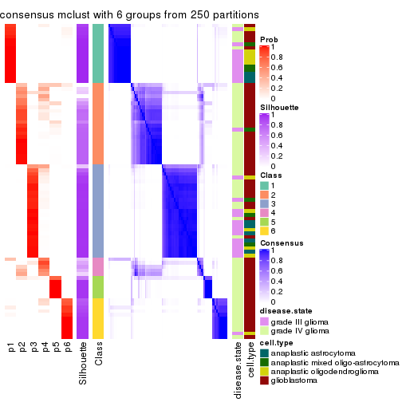</p>

</div>
</div>

Heatmaps for the membership of samples in all partitions to see how consistent they are:


<script>
$( function() {
	$( '#tabs-MAD-mclust-membership-heatmap' ).tabs();
} );
</script>
<div id='tabs-MAD-mclust-membership-heatmap'>
<ul>
<li><a href='#tab-MAD-mclust-membership-heatmap-1'>k = 2</a></li>
<li><a href='#tab-MAD-mclust-membership-heatmap-2'>k = 3</a></li>
<li><a href='#tab-MAD-mclust-membership-heatmap-3'>k = 4</a></li>
<li><a href='#tab-MAD-mclust-membership-heatmap-4'>k = 5</a></li>
<li><a href='#tab-MAD-mclust-membership-heatmap-5'>k = 6</a></li>
</ul>
<div id='tab-MAD-mclust-membership-heatmap-1'>
<pre><code class="r">membership_heatmap(res, k = 2)
</code></pre>

<p></p>

</div>
<div id='tab-MAD-mclust-membership-heatmap-2'>
<pre><code class="r">membership_heatmap(res, k = 3)
</code></pre>

<p></p>

</div>
<div id='tab-MAD-mclust-membership-heatmap-3'>
<pre><code class="r">membership_heatmap(res, k = 4)
</code></pre>

<p></p>

</div>
<div id='tab-MAD-mclust-membership-heatmap-4'>
<pre><code class="r">membership_heatmap(res, k = 5)
</code></pre>

<p></p>

</div>
<div id='tab-MAD-mclust-membership-heatmap-5'>
<pre><code class="r">membership_heatmap(res, k = 6)
</code></pre>

<p></p>

</div>
</div>

As soon as we have had the classes for columns, we can look for signatures
which are significantly different between classes which can be candidate marks
for certain classes. Following are the heatmaps for signatures.


Signature heatmaps where rows are scaled:


<script>
$( function() {
	$( '#tabs-MAD-mclust-get-signatures' ).tabs();
} );
</script>
<div id='tabs-MAD-mclust-get-signatures'>
<ul>
<li><a href='#tab-MAD-mclust-get-signatures-1'>k = 2</a></li>
<li><a href='#tab-MAD-mclust-get-signatures-2'>k = 3</a></li>
<li><a href='#tab-MAD-mclust-get-signatures-3'>k = 4</a></li>
<li><a href='#tab-MAD-mclust-get-signatures-4'>k = 5</a></li>
<li><a href='#tab-MAD-mclust-get-signatures-5'>k = 6</a></li>
</ul>
<div id='tab-MAD-mclust-get-signatures-1'>
<pre><code class="r">get_signatures(res, k = 2)
</code></pre>

<p></p>

</div>
<div id='tab-MAD-mclust-get-signatures-2'>
<pre><code class="r">get_signatures(res, k = 3)
</code></pre>

<p></p>

</div>
<div id='tab-MAD-mclust-get-signatures-3'>
<pre><code class="r">get_signatures(res, k = 4)
</code></pre>

<p></p>

</div>
<div id='tab-MAD-mclust-get-signatures-4'>
<pre><code class="r">get_signatures(res, k = 5)
</code></pre>

<p></p>

</div>
<div id='tab-MAD-mclust-get-signatures-5'>
<pre><code class="r">get_signatures(res, k = 6)
</code></pre>

<p></p>

</div>
</div>


Signature heatmaps where rows are not scaled:


<script>
$( function() {
	$( '#tabs-MAD-mclust-get-signatures-no-scale' ).tabs();
} );
</script>
<div id='tabs-MAD-mclust-get-signatures-no-scale'>
<ul>
<li><a href='#tab-MAD-mclust-get-signatures-no-scale-1'>k = 2</a></li>
<li><a href='#tab-MAD-mclust-get-signatures-no-scale-2'>k = 3</a></li>
<li><a href='#tab-MAD-mclust-get-signatures-no-scale-3'>k = 4</a></li>
<li><a href='#tab-MAD-mclust-get-signatures-no-scale-4'>k = 5</a></li>
<li><a href='#tab-MAD-mclust-get-signatures-no-scale-5'>k = 6</a></li>
</ul>
<div id='tab-MAD-mclust-get-signatures-no-scale-1'>
<pre><code class="r">get_signatures(res, k = 2, scale_rows = FALSE)
</code></pre>

<p></p>

</div>
<div id='tab-MAD-mclust-get-signatures-no-scale-2'>
<pre><code class="r">get_signatures(res, k = 3, scale_rows = FALSE)
</code></pre>

<p></p>

</div>
<div id='tab-MAD-mclust-get-signatures-no-scale-3'>
<pre><code class="r">get_signatures(res, k = 4, scale_rows = FALSE)
</code></pre>

<p></p>

</div>
<div id='tab-MAD-mclust-get-signatures-no-scale-4'>
<pre><code class="r">get_signatures(res, k = 5, scale_rows = FALSE)
</code></pre>

<p></p>

</div>
<div id='tab-MAD-mclust-get-signatures-no-scale-5'>
<pre><code class="r">get_signatures(res, k = 6, scale_rows = FALSE)
</code></pre>

<p></p>

</div>
</div>


Compare the overlap of signatures from different k:

```r
compare_signatures(res)
```


`get_signature()` returns a data frame invisibly. TO get the list of signatures, the function
call should be assigned to a variable explicitly. In following code, if `plot` argument is set
to `FALSE`, no heatmap is plotted while only the differential analysis is performed.

```r
# code only for demonstration
tb = get_signature(res, k = ..., plot = FALSE)
```

An example of the output of `tb` is:

```
#>   which_row         fdr    mean_1    mean_2 scaled_mean_1 scaled_mean_2 km
#> 1        38 0.042760348  8.373488  9.131774    -0.5533452     0.5164555  1
#> 2        40 0.018707592  7.106213  8.469186    -0.6173731     0.5762149  1
#> 3        55 0.019134737 10.221463 11.207825    -0.6159697     0.5749050  1
#> 4        59 0.006059896  5.921854  7.869574    -0.6899429     0.6439467  1
#> 5        60 0.018055526  8.928898 10.211722    -0.6204761     0.5791110  1
#> 6        98 0.009384629 15.714769 14.887706     0.6635654    -0.6193277  2
...
```

The columns in `tb` are:

1. `which_row`: row indices corresponding to the input matrix.
2. `fdr`: FDR for the differential test. 
3. `mean_x`: The mean value in group x.
4. `scaled_mean_x`: The mean value in group x after rows are scaled.
5. `km`: Row groups if k-means clustering is applied to rows.


UMAP plot which shows how samples are separated.


<script>
$( function() {
	$( '#tabs-MAD-mclust-dimension-reduction' ).tabs();
} );
</script>
<div id='tabs-MAD-mclust-dimension-reduction'>
<ul>
<li><a href='#tab-MAD-mclust-dimension-reduction-1'>k = 2</a></li>
<li><a href='#tab-MAD-mclust-dimension-reduction-2'>k = 3</a></li>
<li><a href='#tab-MAD-mclust-dimension-reduction-3'>k = 4</a></li>
<li><a href='#tab-MAD-mclust-dimension-reduction-4'>k = 5</a></li>
<li><a href='#tab-MAD-mclust-dimension-reduction-5'>k = 6</a></li>
</ul>
<div id='tab-MAD-mclust-dimension-reduction-1'>
<pre><code class="r">dimension_reduction(res, k = 2, method = &quot;UMAP&quot;)
</code></pre>

<p>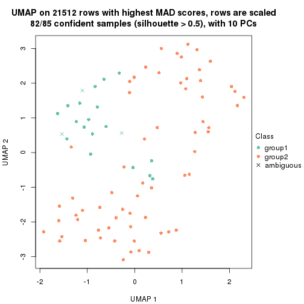</p>

</div>
<div id='tab-MAD-mclust-dimension-reduction-2'>
<pre><code class="r">dimension_reduction(res, k = 3, method = &quot;UMAP&quot;)
</code></pre>

<p></p>

</div>
<div id='tab-MAD-mclust-dimension-reduction-3'>
<pre><code class="r">dimension_reduction(res, k = 4, method = &quot;UMAP&quot;)
</code></pre>

<p></p>

</div>
<div id='tab-MAD-mclust-dimension-reduction-4'>
<pre><code class="r">dimension_reduction(res, k = 5, method = &quot;UMAP&quot;)
</code></pre>

<p></p>

</div>
<div id='tab-MAD-mclust-dimension-reduction-5'>
<pre><code class="r">dimension_reduction(res, k = 6, method = &quot;UMAP&quot;)
</code></pre>

<p></p>

</div>
</div>


Following heatmap shows how subgroups are split when increasing `k`:

```r
collect_classes(res)
```


Test correlation between subgroups and known annotations. If the known
annotation is numeric, one-way ANOVA test is applied, and if the known
annotation is discrete, chi-squared contingency table test is applied.

```r
test_to_known_factors(res)
```

```
#>             n disease.state(p) cell.type(p) k
#> MAD:mclust 82         4.93e-04     0.001302 2
#> MAD:mclust 85         2.13e-05     0.000834 3
#> MAD:mclust 82         6.88e-07     0.000135 4
#> MAD:mclust 84         2.30e-05     0.005193 5
#> MAD:mclust 75         1.19e-04     0.029763 6
```


If matrix rows can be associated to genes, consider to use `GO_Enrichment(res,
...)` to perform function enrichment for the signature genes.


 

---------------------------------------------------


### MAD:NMF**


The object with results only for a single top-value method and a single partition method 
can be extracted as:

```r
res = res_list["MAD", "NMF"]
# you can also extract it by
# res = res_list["MAD:NMF"]
```

A summary of `res` and all the functions that can be applied to it:

```r
res
```

```
#> A 'ConsensusPartition' object with k = 2, 3, 4, 5, 6.
#>   On a matrix with 21512 rows and 85 columns.
#>   Top rows (1000, 2000, 3000, 4000, 5000) are extracted by 'MAD' method.
#>   Subgroups are detected by 'NMF' method.
#>   Performed in total 1250 partitions by row resampling.
#>   Best k for subgroups seems to be 3.
#> 
#> Following methods can be applied to this 'ConsensusPartition' object:
#>  [1] "cola_report"             "collect_classes"         "collect_plots"          
#>  [4] "collect_stats"           "colnames"                "compare_signatures"     
#>  [7] "consensus_heatmap"       "dimension_reduction"     "functional_enrichment"  
#> [10] "get_anno_col"            "get_anno"                "get_classes"            
#> [13] "get_consensus"           "get_matrix"              "get_membership"         
#> [16] "get_param"               "get_signatures"          "get_stats"              
#> [19] "is_best_k"               "is_stable_k"             "membership_heatmap"     
#> [22] "ncol"                    "nrow"                    "plot_ecdf"              
#> [25] "rownames"                "select_partition_number" "show"                   
#> [28] "suggest_best_k"          "test_to_known_factors"
```

`collect_plots()` function collects all the plots made from `res` for all `k` (number of partitions)
into one single page to provide an easy and fast comparison between different `k`.

```r
collect_plots(res)
```


The plots are:

- The first row: a plot of the ECDF (Empirical cumulative distribution
  function) curves of the consensus matrix for each `k` and the heatmap of
  predicted classes for each `k`.
- The second row: heatmaps of the consensus matrix for each `k`.
- The third row: heatmaps of the membership matrix for each `k`.
- The fouth row: heatmaps of the signatures for each `k`.

All the plots in panels can be made by individual functions and they are
plotted later in this section.

`select_partition_number()` produces several plots showing different
statistics for choosing "optimized" `k`. There are following statistics:

- ECDF curves of the consensus matrix for each `k`;
- 1-PAC. [The PAC
  score](https://en.wikipedia.org/wiki/Consensus_clustering#Over-interpretation_potential_of_consensus_clustering)
  measures the proportion of the ambiguous subgrouping.
- Mean silhouette score.
- Concordance. The mean probability of fiting the consensus class ids in all
  partitions.
- Area increased. Denote $A_k$ as the area under the ECDF curve for current
  `k`, the area increased is defined as $A_k - A_{k-1}$.
- Rand index. The percent of pairs of samples that are both in a same cluster
  or both are not in a same cluster in the partition of k and k-1.
- Jaccard index. The ratio of pairs of samples are both in a same cluster in
  the partition of k and k-1 and the pairs of samples are both in a same
  cluster in the partition k or k-1.

The detailed explanations of these statistics can be found in [the cola
vignette](http://bioconductor.org/packages/devel/bioc/vignettes/cola/inst/doc/cola.html#toc_13).

Generally speaking, lower PAC score, higher mean silhouette score or higher
concordance corresponds to better partition. Rand index and Jaccard index
measure how similar the current partition is compared to partition with `k-1`.
If they are too similar, we won't accept `k` is better than `k-1`.

```r
select_partition_number(res)
```


The numeric values for all these statistics can be obtained by `get_stats()`.

```r
get_stats(res)
```

```
#>   k 1-PAC mean_silhouette concordance area_increased  Rand Jaccard
#> 2 2 0.745           0.859       0.944         0.5003 0.494   0.494
#> 3 3 1.000           0.948       0.978         0.3464 0.714   0.483
#> 4 4 0.748           0.732       0.845         0.0938 0.940   0.822
#> 5 5 0.691           0.647       0.795         0.0648 0.915   0.711
#> 6 6 0.724           0.611       0.780         0.0406 0.951   0.791
```

`suggest_best_k()` suggests the best $k$ based on these statistics. The rules are as follows:

- All $k$ with Jaccard index larger than 0.95 are removed because the increase of
  the partition number does not provides enough extra information. If all $k$ are removed,
  the best $k$ is assigned by `NA`.
- For $k$ with 1-PAC larger than 0.9, the maximal $k$ is taken as the "best k". Other $k$ is called "optional k".
- If it does not fit the second rule. The $k$ with the highest vote of highest
  1-PAC, mean silhouette and concordance is taken as the "best k".

```r
suggest_best_k(res)
```

```
#> [1] 3
```


Following shows the table of the partitions (You need to click the **show/hide
code output** link to see it). The membership matrix (columns with name `p*`)
is inferred by
[`clue::cl_consensus()`](https://www.rdocumentation.org/link/cl_consensus?package=clue)
function with the `SE` method. Basically the value in the membership matrix
represents the probability to belong to a certain group. The finall class
label for an item is determined with the group with highest probability it
belongs to.

In `get_classes()` function, the entropy is calculated from the membership
matrix and the silhouette score is calculated from the consensus matrix.


<script>
$( function() {
	$( '#tabs-MAD-NMF-get-classes' ).tabs();
} );
</script>
<div id='tabs-MAD-NMF-get-classes'>
<ul>
<li><a href='#tab-MAD-NMF-get-classes-1'>k = 2</a></li>
<li><a href='#tab-MAD-NMF-get-classes-2'>k = 3</a></li>
<li><a href='#tab-MAD-NMF-get-classes-3'>k = 4</a></li>
<li><a href='#tab-MAD-NMF-get-classes-4'>k = 5</a></li>
<li><a href='#tab-MAD-NMF-get-classes-5'>k = 6</a></li>
</ul>

<div id='tab-MAD-NMF-get-classes-1'>
<p><a id='tab-MAD-NMF-get-classes-1-a' style='color:#0366d6' href='#'>show/hide code output</a></p>
<pre><code class="r">cbind(get_classes(res, k = 2), get_membership(res, k = 2))
</code></pre>

<pre><code>#&gt;          class entropy silhouette    p1    p2
#&gt; GSM99497     2   0.999     0.0379 0.484 0.516
#&gt; GSM99503     1   0.000     0.9365 1.000 0.000
#&gt; GSM99505     1   0.000     0.9365 1.000 0.000
#&gt; GSM99507     1   0.904     0.5319 0.680 0.320
#&gt; GSM99567     2   0.595     0.8111 0.144 0.856
#&gt; GSM99575     1   0.000     0.9365 1.000 0.000
#&gt; GSM99593     2   0.118     0.9271 0.016 0.984
#&gt; GSM99595     1   0.975     0.3159 0.592 0.408
#&gt; GSM99469     1   0.000     0.9365 1.000 0.000
#&gt; GSM99499     1   0.000     0.9365 1.000 0.000
#&gt; GSM99501     1   0.000     0.9365 1.000 0.000
#&gt; GSM99509     1   0.574     0.8186 0.864 0.136
#&gt; GSM99569     1   0.278     0.9015 0.952 0.048
#&gt; GSM99597     1   0.000     0.9365 1.000 0.000
#&gt; GSM99601     2   0.000     0.9379 0.000 1.000
#&gt; GSM99459     1   0.000     0.9365 1.000 0.000
#&gt; GSM99461     1   0.000     0.9365 1.000 0.000
#&gt; GSM99511     2   0.943     0.4338 0.360 0.640
#&gt; GSM99513     2   0.662     0.7754 0.172 0.828
#&gt; GSM99515     1   0.605     0.8044 0.852 0.148
#&gt; GSM99517     1   0.000     0.9365 1.000 0.000
#&gt; GSM99519     1   0.000     0.9365 1.000 0.000
#&gt; GSM99521     1   0.988     0.2205 0.564 0.436
#&gt; GSM99523     1   0.000     0.9365 1.000 0.000
#&gt; GSM99571     1   0.000     0.9365 1.000 0.000
#&gt; GSM99599     1   0.000     0.9365 1.000 0.000
#&gt; GSM99433     2   0.000     0.9379 0.000 1.000
#&gt; GSM99435     2   0.295     0.8994 0.052 0.948
#&gt; GSM99437     2   0.000     0.9379 0.000 1.000
#&gt; GSM99439     2   0.000     0.9379 0.000 1.000
#&gt; GSM99441     1   0.000     0.9365 1.000 0.000
#&gt; GSM99443     2   0.000     0.9379 0.000 1.000
#&gt; GSM99445     2   0.000     0.9379 0.000 1.000
#&gt; GSM99447     2   0.000     0.9379 0.000 1.000
#&gt; GSM99449     2   0.000     0.9379 0.000 1.000
#&gt; GSM99451     1   0.000     0.9365 1.000 0.000
#&gt; GSM99453     1   0.000     0.9365 1.000 0.000
#&gt; GSM99455     1   0.000     0.9365 1.000 0.000
#&gt; GSM99457     1   0.000     0.9365 1.000 0.000
#&gt; GSM99463     2   0.000     0.9379 0.000 1.000
#&gt; GSM99465     1   0.000     0.9365 1.000 0.000
#&gt; GSM99467     2   0.000     0.9379 0.000 1.000
#&gt; GSM99471     1   0.000     0.9365 1.000 0.000
#&gt; GSM99473     1   0.000     0.9365 1.000 0.000
#&gt; GSM99475     1   0.991     0.2037 0.556 0.444
#&gt; GSM99477     2   0.000     0.9379 0.000 1.000
#&gt; GSM99479     2   0.000     0.9379 0.000 1.000
#&gt; GSM99481     1   0.000     0.9365 1.000 0.000
#&gt; GSM99483     1   0.000     0.9365 1.000 0.000
#&gt; GSM99485     2   0.000     0.9379 0.000 1.000
#&gt; GSM99487     2   0.000     0.9379 0.000 1.000
#&gt; GSM99489     2   0.000     0.9379 0.000 1.000
#&gt; GSM99491     2   0.000     0.9379 0.000 1.000
#&gt; GSM99493     1   0.000     0.9365 1.000 0.000
#&gt; GSM99495     2   0.000     0.9379 0.000 1.000
#&gt; GSM99525     1   0.000     0.9365 1.000 0.000
#&gt; GSM99527     2   0.996     0.1225 0.464 0.536
#&gt; GSM99529     2   0.000     0.9379 0.000 1.000
#&gt; GSM99531     1   0.224     0.9109 0.964 0.036
#&gt; GSM99533     1   0.000     0.9365 1.000 0.000
#&gt; GSM99535     2   0.184     0.9183 0.028 0.972
#&gt; GSM99537     1   0.000     0.9365 1.000 0.000
#&gt; GSM99539     2   0.000     0.9379 0.000 1.000
#&gt; GSM99541     1   0.000     0.9365 1.000 0.000
#&gt; GSM99543     2   0.000     0.9379 0.000 1.000
#&gt; GSM99545     2   0.000     0.9379 0.000 1.000
#&gt; GSM99547     1   0.866     0.5804 0.712 0.288
#&gt; GSM99549     2   0.000     0.9379 0.000 1.000
#&gt; GSM99551     1   0.000     0.9365 1.000 0.000
#&gt; GSM99553     2   0.574     0.8196 0.136 0.864
#&gt; GSM99555     2   0.000     0.9379 0.000 1.000
#&gt; GSM99557     2   0.000     0.9379 0.000 1.000
#&gt; GSM99559     2   0.000     0.9379 0.000 1.000
#&gt; GSM99561     2   0.000     0.9379 0.000 1.000
#&gt; GSM99563     1   0.518     0.8393 0.884 0.116
#&gt; GSM99565     2   0.000     0.9379 0.000 1.000
#&gt; GSM99573     2   0.000     0.9379 0.000 1.000
#&gt; GSM99577     1   0.000     0.9365 1.000 0.000
#&gt; GSM99579     2   0.000     0.9379 0.000 1.000
#&gt; GSM99581     2   0.634     0.7914 0.160 0.840
#&gt; GSM99583     2   0.952     0.4121 0.372 0.628
#&gt; GSM99585     2   0.000     0.9379 0.000 1.000
#&gt; GSM99587     1   0.000     0.9365 1.000 0.000
#&gt; GSM99589     2   0.000     0.9379 0.000 1.000
#&gt; GSM99591     2   0.000     0.9379 0.000 1.000
</code></pre>

<script>
$('#tab-MAD-NMF-get-classes-1-a').parent().next().next().hide();
$('#tab-MAD-NMF-get-classes-1-a').click(function(){
  $('#tab-MAD-NMF-get-classes-1-a').parent().next().next().toggle();
  return(false);
});
</script>
</div>

<div id='tab-MAD-NMF-get-classes-2'>
<p><a id='tab-MAD-NMF-get-classes-2-a' style='color:#0366d6' href='#'>show/hide code output</a></p>
<pre><code class="r">cbind(get_classes(res, k = 3), get_membership(res, k = 3))
</code></pre>

<pre><code>#&gt;          class entropy silhouette    p1    p2    p3
#&gt; GSM99497     3  0.0000      0.956 0.000 0.000 1.000
#&gt; GSM99503     1  0.0237      0.978 0.996 0.000 0.004
#&gt; GSM99505     3  0.5882      0.457 0.348 0.000 0.652
#&gt; GSM99507     3  0.0000      0.956 0.000 0.000 1.000
#&gt; GSM99567     3  0.0000      0.956 0.000 0.000 1.000
#&gt; GSM99575     1  0.0237      0.978 0.996 0.000 0.004
#&gt; GSM99593     3  0.0000      0.956 0.000 0.000 1.000
#&gt; GSM99595     3  0.0000      0.956 0.000 0.000 1.000
#&gt; GSM99469     1  0.0237      0.978 0.996 0.000 0.004
#&gt; GSM99499     1  0.0747      0.968 0.984 0.000 0.016
#&gt; GSM99501     1  0.0424      0.975 0.992 0.000 0.008
#&gt; GSM99509     3  0.0000      0.956 0.000 0.000 1.000
#&gt; GSM99569     3  0.0000      0.956 0.000 0.000 1.000
#&gt; GSM99597     3  0.0000      0.956 0.000 0.000 1.000
#&gt; GSM99601     2  0.0000      0.997 0.000 1.000 0.000
#&gt; GSM99459     1  0.0237      0.978 0.996 0.000 0.004
#&gt; GSM99461     1  0.0237      0.978 0.996 0.000 0.004
#&gt; GSM99511     3  0.0000      0.956 0.000 0.000 1.000
#&gt; GSM99513     3  0.0000      0.956 0.000 0.000 1.000
#&gt; GSM99515     3  0.0000      0.956 0.000 0.000 1.000
#&gt; GSM99517     1  0.0000      0.979 1.000 0.000 0.000
#&gt; GSM99519     1  0.0237      0.978 0.996 0.000 0.004
#&gt; GSM99521     3  0.0000      0.956 0.000 0.000 1.000
#&gt; GSM99523     3  0.0000      0.956 0.000 0.000 1.000
#&gt; GSM99571     1  0.0000      0.979 1.000 0.000 0.000
#&gt; GSM99599     1  0.0000      0.979 1.000 0.000 0.000
#&gt; GSM99433     2  0.1860      0.944 0.000 0.948 0.052
#&gt; GSM99435     3  0.0000      0.956 0.000 0.000 1.000
#&gt; GSM99437     2  0.0000      0.997 0.000 1.000 0.000
#&gt; GSM99439     2  0.0000      0.997 0.000 1.000 0.000
#&gt; GSM99441     1  0.0000      0.979 1.000 0.000 0.000
#&gt; GSM99443     2  0.0000      0.997 0.000 1.000 0.000
#&gt; GSM99445     2  0.0000      0.997 0.000 1.000 0.000
#&gt; GSM99447     2  0.0000      0.997 0.000 1.000 0.000
#&gt; GSM99449     3  0.0000      0.956 0.000 0.000 1.000
#&gt; GSM99451     3  0.0000      0.956 0.000 0.000 1.000
#&gt; GSM99453     1  0.0000      0.979 1.000 0.000 0.000
#&gt; GSM99455     1  0.0000      0.979 1.000 0.000 0.000
#&gt; GSM99457     1  0.0000      0.979 1.000 0.000 0.000
#&gt; GSM99463     2  0.0000      0.997 0.000 1.000 0.000
#&gt; GSM99465     3  0.0000      0.956 0.000 0.000 1.000
#&gt; GSM99467     2  0.0000      0.997 0.000 1.000 0.000
#&gt; GSM99471     1  0.0000      0.979 1.000 0.000 0.000
#&gt; GSM99473     1  0.0000      0.979 1.000 0.000 0.000
#&gt; GSM99475     3  0.0000      0.956 0.000 0.000 1.000
#&gt; GSM99477     3  0.1163      0.934 0.000 0.028 0.972
#&gt; GSM99479     2  0.0000      0.997 0.000 1.000 0.000
#&gt; GSM99481     1  0.0000      0.979 1.000 0.000 0.000
#&gt; GSM99483     1  0.0000      0.979 1.000 0.000 0.000
#&gt; GSM99485     2  0.0000      0.997 0.000 1.000 0.000
#&gt; GSM99487     2  0.0000      0.997 0.000 1.000 0.000
#&gt; GSM99489     2  0.0000      0.997 0.000 1.000 0.000
#&gt; GSM99491     2  0.0000      0.997 0.000 1.000 0.000
#&gt; GSM99493     1  0.0000      0.979 1.000 0.000 0.000
#&gt; GSM99495     2  0.0000      0.997 0.000 1.000 0.000
#&gt; GSM99525     1  0.0000      0.979 1.000 0.000 0.000
#&gt; GSM99527     3  0.0000      0.956 0.000 0.000 1.000
#&gt; GSM99529     2  0.0237      0.993 0.000 0.996 0.004
#&gt; GSM99531     3  0.0000      0.956 0.000 0.000 1.000
#&gt; GSM99533     3  0.1163      0.933 0.028 0.000 0.972
#&gt; GSM99535     2  0.0592      0.986 0.012 0.988 0.000
#&gt; GSM99537     1  0.0000      0.979 1.000 0.000 0.000
#&gt; GSM99539     3  0.6274      0.171 0.000 0.456 0.544
#&gt; GSM99541     1  0.1753      0.936 0.952 0.000 0.048
#&gt; GSM99543     2  0.0000      0.997 0.000 1.000 0.000
#&gt; GSM99545     2  0.0892      0.979 0.000 0.980 0.020
#&gt; GSM99547     1  0.8754      0.317 0.532 0.344 0.124
#&gt; GSM99549     2  0.0000      0.997 0.000 1.000 0.000
#&gt; GSM99551     1  0.0000      0.979 1.000 0.000 0.000
#&gt; GSM99553     3  0.0000      0.956 0.000 0.000 1.000
#&gt; GSM99555     2  0.0000      0.997 0.000 1.000 0.000
#&gt; GSM99557     2  0.0000      0.997 0.000 1.000 0.000
#&gt; GSM99559     3  0.0237      0.953 0.000 0.004 0.996
#&gt; GSM99561     2  0.0000      0.997 0.000 1.000 0.000
#&gt; GSM99563     3  0.0000      0.956 0.000 0.000 1.000
#&gt; GSM99565     2  0.0000      0.997 0.000 1.000 0.000
#&gt; GSM99573     2  0.0000      0.997 0.000 1.000 0.000
#&gt; GSM99577     1  0.0000      0.979 1.000 0.000 0.000
#&gt; GSM99579     2  0.0000      0.997 0.000 1.000 0.000
#&gt; GSM99581     3  0.0000      0.956 0.000 0.000 1.000
#&gt; GSM99583     3  0.8148      0.593 0.156 0.200 0.644
#&gt; GSM99585     2  0.0000      0.997 0.000 1.000 0.000
#&gt; GSM99587     1  0.0000      0.979 1.000 0.000 0.000
#&gt; GSM99589     2  0.0000      0.997 0.000 1.000 0.000
#&gt; GSM99591     2  0.0000      0.997 0.000 1.000 0.000
</code></pre>

<script>
$('#tab-MAD-NMF-get-classes-2-a').parent().next().next().hide();
$('#tab-MAD-NMF-get-classes-2-a').click(function(){
  $('#tab-MAD-NMF-get-classes-2-a').parent().next().next().toggle();
  return(false);
});
</script>
</div>

<div id='tab-MAD-NMF-get-classes-3'>
<p><a id='tab-MAD-NMF-get-classes-3-a' style='color:#0366d6' href='#'>show/hide code output</a></p>
<pre><code class="r">cbind(get_classes(res, k = 4), get_membership(res, k = 4))
</code></pre>

<pre><code>#&gt;          class entropy silhouette    p1    p2    p3    p4
#&gt; GSM99497     3  0.2530      0.818 0.000 0.000 0.888 0.112
#&gt; GSM99503     1  0.0000      0.972 1.000 0.000 0.000 0.000
#&gt; GSM99505     3  0.4539      0.559 0.272 0.000 0.720 0.008
#&gt; GSM99507     3  0.1792      0.827 0.000 0.000 0.932 0.068
#&gt; GSM99567     3  0.0817      0.833 0.000 0.000 0.976 0.024
#&gt; GSM99575     1  0.0000      0.972 1.000 0.000 0.000 0.000
#&gt; GSM99593     3  0.0592      0.833 0.000 0.000 0.984 0.016
#&gt; GSM99595     3  0.1867      0.819 0.000 0.000 0.928 0.072
#&gt; GSM99469     1  0.0336      0.970 0.992 0.000 0.000 0.008
#&gt; GSM99499     1  0.2021      0.907 0.932 0.000 0.056 0.012
#&gt; GSM99501     1  0.0469      0.969 0.988 0.000 0.000 0.012
#&gt; GSM99509     3  0.0469      0.833 0.000 0.000 0.988 0.012
#&gt; GSM99569     3  0.2647      0.816 0.000 0.000 0.880 0.120
#&gt; GSM99597     3  0.1389      0.828 0.000 0.000 0.952 0.048
#&gt; GSM99601     2  0.2814      0.719 0.000 0.868 0.000 0.132
#&gt; GSM99459     1  0.0707      0.964 0.980 0.000 0.000 0.020
#&gt; GSM99461     1  0.0469      0.969 0.988 0.000 0.000 0.012
#&gt; GSM99511     3  0.2921      0.785 0.000 0.000 0.860 0.140
#&gt; GSM99513     3  0.3610      0.737 0.000 0.000 0.800 0.200
#&gt; GSM99515     3  0.2469      0.819 0.000 0.000 0.892 0.108
#&gt; GSM99517     1  0.0000      0.972 1.000 0.000 0.000 0.000
#&gt; GSM99519     1  0.0817      0.961 0.976 0.000 0.000 0.024
#&gt; GSM99521     3  0.0817      0.832 0.000 0.000 0.976 0.024
#&gt; GSM99523     3  0.3266      0.794 0.000 0.000 0.832 0.168
#&gt; GSM99571     1  0.0000      0.972 1.000 0.000 0.000 0.000
#&gt; GSM99599     1  0.0000      0.972 1.000 0.000 0.000 0.000
#&gt; GSM99433     2  0.5766      0.342 0.000 0.564 0.032 0.404
#&gt; GSM99435     3  0.1557      0.831 0.000 0.000 0.944 0.056
#&gt; GSM99437     2  0.2216      0.699 0.000 0.908 0.000 0.092
#&gt; GSM99439     2  0.4996      0.192 0.000 0.516 0.000 0.484
#&gt; GSM99441     1  0.0000      0.972 1.000 0.000 0.000 0.000
#&gt; GSM99443     2  0.1118      0.735 0.000 0.964 0.000 0.036
#&gt; GSM99445     2  0.1022      0.735 0.000 0.968 0.000 0.032
#&gt; GSM99447     2  0.4477      0.554 0.000 0.688 0.000 0.312
#&gt; GSM99449     3  0.2868      0.810 0.000 0.000 0.864 0.136
#&gt; GSM99451     3  0.1792      0.824 0.000 0.000 0.932 0.068
#&gt; GSM99453     1  0.2918      0.845 0.876 0.000 0.008 0.116
#&gt; GSM99455     1  0.1305      0.945 0.960 0.000 0.004 0.036
#&gt; GSM99457     1  0.0592      0.967 0.984 0.000 0.000 0.016
#&gt; GSM99463     2  0.4697      0.495 0.000 0.644 0.000 0.356
#&gt; GSM99465     3  0.7234      0.515 0.012 0.132 0.564 0.292
#&gt; GSM99467     2  0.3311      0.642 0.000 0.828 0.000 0.172
#&gt; GSM99471     1  0.0000      0.972 1.000 0.000 0.000 0.000
#&gt; GSM99473     1  0.2670      0.881 0.908 0.052 0.000 0.040
#&gt; GSM99475     3  0.4164      0.677 0.000 0.000 0.736 0.264
#&gt; GSM99477     3  0.7875      0.187 0.000 0.328 0.384 0.288
#&gt; GSM99479     2  0.3569      0.618 0.000 0.804 0.000 0.196
#&gt; GSM99481     1  0.0188      0.971 0.996 0.000 0.000 0.004
#&gt; GSM99483     1  0.0188      0.971 0.996 0.000 0.000 0.004
#&gt; GSM99485     2  0.2589      0.724 0.000 0.884 0.000 0.116
#&gt; GSM99487     2  0.2589      0.685 0.000 0.884 0.000 0.116
#&gt; GSM99489     2  0.3074      0.710 0.000 0.848 0.000 0.152
#&gt; GSM99491     2  0.1716      0.712 0.000 0.936 0.000 0.064
#&gt; GSM99493     1  0.0000      0.972 1.000 0.000 0.000 0.000
#&gt; GSM99495     2  0.4804      0.446 0.000 0.616 0.000 0.384
#&gt; GSM99525     1  0.0000      0.972 1.000 0.000 0.000 0.000
#&gt; GSM99527     3  0.3855      0.788 0.004 0.012 0.820 0.164
#&gt; GSM99529     2  0.2958      0.687 0.004 0.876 0.004 0.116
#&gt; GSM99531     3  0.4804      0.491 0.000 0.000 0.616 0.384
#&gt; GSM99533     3  0.4164      0.677 0.000 0.000 0.736 0.264
#&gt; GSM99535     2  0.3320      0.707 0.056 0.876 0.000 0.068
#&gt; GSM99537     1  0.0188      0.971 0.996 0.000 0.000 0.004
#&gt; GSM99539     3  0.6415      0.397 0.000 0.288 0.612 0.100
#&gt; GSM99541     1  0.2635      0.871 0.904 0.000 0.076 0.020
#&gt; GSM99543     2  0.4781      0.521 0.004 0.660 0.000 0.336
#&gt; GSM99545     4  0.5911      0.457 0.000 0.196 0.112 0.692
#&gt; GSM99547     4  0.9203      0.494 0.336 0.184 0.100 0.380
#&gt; GSM99549     4  0.4624      0.300 0.000 0.340 0.000 0.660
#&gt; GSM99551     4  0.6389      0.393 0.404 0.032 0.020 0.544
#&gt; GSM99553     3  0.1211      0.833 0.000 0.000 0.960 0.040
#&gt; GSM99555     2  0.2868      0.717 0.000 0.864 0.000 0.136
#&gt; GSM99557     2  0.3266      0.700 0.000 0.832 0.000 0.168
#&gt; GSM99559     3  0.2589      0.816 0.000 0.000 0.884 0.116
#&gt; GSM99561     2  0.4933      0.339 0.000 0.568 0.000 0.432
#&gt; GSM99563     3  0.0921      0.833 0.000 0.000 0.972 0.028
#&gt; GSM99565     2  0.1389      0.730 0.000 0.952 0.000 0.048
#&gt; GSM99573     4  0.4877      0.328 0.000 0.328 0.008 0.664
#&gt; GSM99577     4  0.6909      0.379 0.364 0.000 0.116 0.520
#&gt; GSM99579     2  0.1302      0.726 0.000 0.956 0.000 0.044
#&gt; GSM99581     3  0.3024      0.805 0.000 0.000 0.852 0.148
#&gt; GSM99583     2  0.8805      0.122 0.072 0.468 0.236 0.224
#&gt; GSM99585     2  0.3356      0.639 0.000 0.824 0.000 0.176
#&gt; GSM99587     1  0.0592      0.965 0.984 0.000 0.000 0.016
#&gt; GSM99589     2  0.3074      0.710 0.000 0.848 0.000 0.152
#&gt; GSM99591     2  0.0336      0.731 0.000 0.992 0.000 0.008
</code></pre>

<script>
$('#tab-MAD-NMF-get-classes-3-a').parent().next().next().hide();
$('#tab-MAD-NMF-get-classes-3-a').click(function(){
  $('#tab-MAD-NMF-get-classes-3-a').parent().next().next().toggle();
  return(false);
});
</script>
</div>

<div id='tab-MAD-NMF-get-classes-4'>
<p><a id='tab-MAD-NMF-get-classes-4-a' style='color:#0366d6' href='#'>show/hide code output</a></p>
<pre><code class="r">cbind(get_classes(res, k = 5), get_membership(res, k = 5))
</code></pre>

<pre><code>#&gt;          class entropy silhouette    p1    p2    p3    p4    p5
#&gt; GSM99497     3  0.2344     0.8185 0.000 0.000 0.904 0.064 0.032
#&gt; GSM99503     1  0.0486     0.9110 0.988 0.000 0.004 0.004 0.004
#&gt; GSM99505     3  0.3080     0.7047 0.140 0.000 0.844 0.008 0.008
#&gt; GSM99507     3  0.2171     0.8192 0.000 0.000 0.912 0.064 0.024
#&gt; GSM99567     3  0.1281     0.8257 0.000 0.000 0.956 0.012 0.032
#&gt; GSM99575     1  0.0451     0.9115 0.988 0.000 0.008 0.004 0.000
#&gt; GSM99593     3  0.1893     0.8208 0.000 0.000 0.928 0.048 0.024
#&gt; GSM99595     3  0.2782     0.8136 0.000 0.000 0.880 0.048 0.072
#&gt; GSM99469     1  0.1412     0.9009 0.952 0.000 0.008 0.036 0.004
#&gt; GSM99499     1  0.6169     0.2470 0.536 0.000 0.352 0.096 0.016
#&gt; GSM99501     1  0.2971     0.8518 0.880 0.000 0.032 0.072 0.016
#&gt; GSM99509     3  0.3427     0.7858 0.000 0.000 0.836 0.108 0.056
#&gt; GSM99569     3  0.3690     0.7181 0.000 0.000 0.780 0.200 0.020
#&gt; GSM99597     3  0.5793     0.3494 0.000 0.000 0.548 0.348 0.104
#&gt; GSM99601     2  0.1732     0.7473 0.000 0.920 0.000 0.000 0.080
#&gt; GSM99459     1  0.1270     0.8993 0.948 0.000 0.000 0.052 0.000
#&gt; GSM99461     1  0.2329     0.8438 0.876 0.000 0.000 0.124 0.000
#&gt; GSM99511     3  0.4237     0.7041 0.000 0.000 0.772 0.076 0.152
#&gt; GSM99513     3  0.3841     0.7205 0.000 0.000 0.780 0.032 0.188
#&gt; GSM99515     3  0.0912     0.8235 0.000 0.000 0.972 0.012 0.016
#&gt; GSM99517     1  0.0324     0.9112 0.992 0.000 0.004 0.004 0.000
#&gt; GSM99519     1  0.1671     0.8878 0.924 0.000 0.000 0.076 0.000
#&gt; GSM99521     3  0.5630     0.3784 0.000 0.000 0.580 0.324 0.096
#&gt; GSM99523     3  0.2325     0.8100 0.000 0.000 0.904 0.068 0.028
#&gt; GSM99571     1  0.0162     0.9116 0.996 0.000 0.004 0.000 0.000
#&gt; GSM99599     1  0.0000     0.9111 1.000 0.000 0.000 0.000 0.000
#&gt; GSM99433     5  0.7176     0.1491 0.000 0.248 0.020 0.324 0.408
#&gt; GSM99435     4  0.6523     0.4241 0.000 0.000 0.332 0.460 0.208
#&gt; GSM99437     2  0.2921     0.7143 0.000 0.856 0.000 0.124 0.020
#&gt; GSM99439     5  0.4305     0.0929 0.000 0.488 0.000 0.000 0.512
#&gt; GSM99441     1  0.0000     0.9111 1.000 0.000 0.000 0.000 0.000
#&gt; GSM99443     2  0.1082     0.7587 0.000 0.964 0.000 0.008 0.028
#&gt; GSM99445     2  0.0290     0.7585 0.000 0.992 0.000 0.000 0.008
#&gt; GSM99447     2  0.5724     0.2501 0.000 0.584 0.000 0.112 0.304
#&gt; GSM99449     3  0.2653     0.7931 0.000 0.000 0.880 0.096 0.024
#&gt; GSM99451     4  0.6454     0.4741 0.000 0.000 0.304 0.488 0.208
#&gt; GSM99453     1  0.2629     0.8549 0.880 0.000 0.004 0.012 0.104
#&gt; GSM99455     1  0.1285     0.9043 0.956 0.000 0.004 0.004 0.036
#&gt; GSM99457     1  0.2233     0.8653 0.904 0.000 0.000 0.016 0.080
#&gt; GSM99463     2  0.3983     0.3840 0.000 0.660 0.000 0.000 0.340
#&gt; GSM99465     4  0.3265     0.4890 0.004 0.032 0.096 0.860 0.008
#&gt; GSM99467     2  0.3669     0.6835 0.000 0.816 0.000 0.128 0.056
#&gt; GSM99471     1  0.0324     0.9113 0.992 0.004 0.000 0.004 0.000
#&gt; GSM99473     1  0.2142     0.8703 0.920 0.048 0.000 0.028 0.004
#&gt; GSM99475     4  0.6458     0.5130 0.004 0.000 0.160 0.464 0.372
#&gt; GSM99477     4  0.6789     0.0055 0.000 0.380 0.116 0.468 0.036
#&gt; GSM99479     2  0.4096     0.6413 0.000 0.772 0.000 0.176 0.052
#&gt; GSM99481     1  0.0162     0.9107 0.996 0.000 0.000 0.004 0.000
#&gt; GSM99483     1  0.0693     0.9106 0.980 0.000 0.000 0.008 0.012
#&gt; GSM99485     2  0.1877     0.7494 0.000 0.924 0.000 0.012 0.064
#&gt; GSM99487     2  0.3399     0.6899 0.000 0.812 0.000 0.168 0.020
#&gt; GSM99489     2  0.2358     0.7329 0.000 0.888 0.000 0.008 0.104
#&gt; GSM99491     2  0.1557     0.7490 0.000 0.940 0.000 0.052 0.008
#&gt; GSM99493     1  0.0290     0.9110 0.992 0.000 0.000 0.000 0.008
#&gt; GSM99495     2  0.4182     0.2046 0.000 0.600 0.000 0.000 0.400
#&gt; GSM99525     1  0.0162     0.9115 0.996 0.000 0.000 0.000 0.004
#&gt; GSM99527     4  0.5844     0.5439 0.000 0.000 0.184 0.608 0.208
#&gt; GSM99529     4  0.6282     0.1318 0.004 0.360 0.036 0.540 0.060
#&gt; GSM99531     4  0.6309     0.4663 0.000 0.000 0.160 0.472 0.368
#&gt; GSM99533     4  0.6069     0.5318 0.004 0.000 0.136 0.564 0.296
#&gt; GSM99535     2  0.3120     0.7288 0.052 0.872 0.000 0.012 0.064
#&gt; GSM99537     1  0.1800     0.8935 0.932 0.000 0.000 0.048 0.020
#&gt; GSM99539     4  0.6386     0.4743 0.000 0.092 0.072 0.628 0.208
#&gt; GSM99541     1  0.6959    -0.0917 0.436 0.000 0.036 0.392 0.136
#&gt; GSM99543     2  0.4401     0.4361 0.004 0.684 0.000 0.016 0.296
#&gt; GSM99545     5  0.4375     0.3328 0.000 0.084 0.024 0.096 0.796
#&gt; GSM99547     4  0.9081     0.1830 0.136 0.044 0.212 0.308 0.300
#&gt; GSM99549     5  0.3884     0.5328 0.000 0.288 0.000 0.004 0.708
#&gt; GSM99551     5  0.5185     0.2300 0.220 0.004 0.000 0.092 0.684
#&gt; GSM99553     3  0.2446     0.8159 0.000 0.000 0.900 0.056 0.044
#&gt; GSM99555     2  0.3122     0.7244 0.000 0.852 0.004 0.024 0.120
#&gt; GSM99557     2  0.2612     0.7191 0.000 0.868 0.000 0.008 0.124
#&gt; GSM99559     3  0.1743     0.8241 0.000 0.004 0.940 0.028 0.028
#&gt; GSM99561     5  0.5281     0.3678 0.000 0.400 0.000 0.052 0.548
#&gt; GSM99563     3  0.2248     0.7993 0.000 0.000 0.900 0.088 0.012
#&gt; GSM99565     2  0.2653     0.7366 0.000 0.880 0.000 0.096 0.024
#&gt; GSM99573     5  0.3990     0.5094 0.000 0.308 0.000 0.004 0.688
#&gt; GSM99577     5  0.5960     0.1292 0.256 0.000 0.032 0.084 0.628
#&gt; GSM99579     2  0.2359     0.7455 0.000 0.904 0.000 0.060 0.036
#&gt; GSM99581     3  0.2964     0.8036 0.000 0.000 0.856 0.120 0.024
#&gt; GSM99583     2  0.7766     0.3203 0.040 0.540 0.208 0.144 0.068
#&gt; GSM99585     2  0.5048     0.4660 0.000 0.612 0.016 0.352 0.020
#&gt; GSM99587     1  0.0955     0.9070 0.968 0.000 0.000 0.004 0.028
#&gt; GSM99589     2  0.2445     0.7306 0.000 0.884 0.004 0.004 0.108
#&gt; GSM99591     2  0.0865     0.7569 0.000 0.972 0.000 0.024 0.004
</code></pre>

<script>
$('#tab-MAD-NMF-get-classes-4-a').parent().next().next().hide();
$('#tab-MAD-NMF-get-classes-4-a').click(function(){
  $('#tab-MAD-NMF-get-classes-4-a').parent().next().next().toggle();
  return(false);
});
</script>
</div>

<div id='tab-MAD-NMF-get-classes-5'>
<p><a id='tab-MAD-NMF-get-classes-5-a' style='color:#0366d6' href='#'>show/hide code output</a></p>
<pre><code class="r">cbind(get_classes(res, k = 6), get_membership(res, k = 6))
</code></pre>

<pre><code>#&gt;          class entropy silhouette    p1    p2    p3    p4    p5    p6
#&gt; GSM99497     3  0.2454     0.7311 0.000 0.000 0.840 0.000 0.000 0.160
#&gt; GSM99503     1  0.0260     0.8779 0.992 0.000 0.000 0.000 0.000 0.008
#&gt; GSM99505     3  0.1785     0.7815 0.048 0.000 0.928 0.000 0.008 0.016
#&gt; GSM99507     3  0.2146     0.7658 0.000 0.000 0.880 0.000 0.004 0.116
#&gt; GSM99567     3  0.1321     0.7952 0.000 0.000 0.952 0.004 0.024 0.020
#&gt; GSM99575     1  0.0551     0.8780 0.984 0.000 0.008 0.004 0.000 0.004
#&gt; GSM99593     3  0.2259     0.7887 0.000 0.000 0.908 0.032 0.020 0.040
#&gt; GSM99595     3  0.2320     0.7845 0.000 0.000 0.892 0.004 0.024 0.080
#&gt; GSM99469     1  0.4117     0.6285 0.716 0.000 0.056 0.000 0.000 0.228
#&gt; GSM99499     3  0.6590    -0.2188 0.304 0.000 0.368 0.004 0.016 0.308
#&gt; GSM99501     1  0.5334     0.1984 0.512 0.000 0.112 0.000 0.000 0.376
#&gt; GSM99509     3  0.2882     0.7099 0.000 0.000 0.812 0.000 0.008 0.180
#&gt; GSM99569     3  0.4052     0.3299 0.000 0.000 0.628 0.016 0.000 0.356
#&gt; GSM99597     6  0.4267     0.5633 0.000 0.000 0.272 0.012 0.028 0.688
#&gt; GSM99601     2  0.1442     0.7576 0.000 0.944 0.000 0.004 0.040 0.012
#&gt; GSM99459     1  0.2112     0.8377 0.896 0.000 0.000 0.088 0.000 0.016
#&gt; GSM99461     1  0.4275     0.3957 0.592 0.000 0.000 0.388 0.004 0.016
#&gt; GSM99511     3  0.4085     0.7042 0.000 0.000 0.792 0.044 0.088 0.076
#&gt; GSM99513     3  0.3344     0.7398 0.000 0.000 0.828 0.008 0.104 0.060
#&gt; GSM99515     3  0.0862     0.7944 0.000 0.000 0.972 0.004 0.008 0.016
#&gt; GSM99517     1  0.0405     0.8778 0.988 0.000 0.000 0.004 0.000 0.008
#&gt; GSM99519     1  0.2619     0.8347 0.880 0.000 0.000 0.072 0.008 0.040
#&gt; GSM99521     6  0.5981     0.4149 0.000 0.000 0.368 0.076 0.056 0.500
#&gt; GSM99523     3  0.2898     0.7672 0.000 0.000 0.868 0.056 0.016 0.060
#&gt; GSM99571     1  0.0508     0.8783 0.984 0.000 0.004 0.000 0.000 0.012
#&gt; GSM99599     1  0.0000     0.8776 1.000 0.000 0.000 0.000 0.000 0.000
#&gt; GSM99433     4  0.4215     0.5226 0.000 0.016 0.008 0.704 0.260 0.012
#&gt; GSM99435     4  0.5084     0.5561 0.000 0.000 0.056 0.676 0.216 0.052
#&gt; GSM99437     2  0.3755     0.6837 0.000 0.768 0.000 0.192 0.012 0.028
#&gt; GSM99439     5  0.4325     0.0700 0.000 0.480 0.000 0.008 0.504 0.008
#&gt; GSM99441     1  0.0260     0.8775 0.992 0.000 0.000 0.000 0.000 0.008
#&gt; GSM99443     2  0.1605     0.7614 0.000 0.940 0.000 0.032 0.016 0.012
#&gt; GSM99445     2  0.0767     0.7641 0.000 0.976 0.000 0.012 0.008 0.004
#&gt; GSM99447     4  0.6500    -0.0148 0.000 0.244 0.000 0.408 0.324 0.024
#&gt; GSM99449     3  0.3486     0.7221 0.000 0.000 0.820 0.048 0.016 0.116
#&gt; GSM99451     4  0.5577     0.5354 0.000 0.000 0.080 0.640 0.212 0.068
#&gt; GSM99453     1  0.2704     0.8236 0.868 0.000 0.012 0.000 0.100 0.020
#&gt; GSM99455     1  0.0935     0.8740 0.964 0.000 0.000 0.000 0.032 0.004
#&gt; GSM99457     1  0.3343     0.7713 0.824 0.000 0.000 0.032 0.128 0.016
#&gt; GSM99463     2  0.4093     0.3860 0.000 0.656 0.000 0.012 0.324 0.008
#&gt; GSM99465     4  0.3415     0.4883 0.004 0.000 0.024 0.820 0.016 0.136
#&gt; GSM99467     2  0.4258     0.6804 0.000 0.756 0.004 0.148 0.008 0.084
#&gt; GSM99471     1  0.0405     0.8786 0.988 0.000 0.000 0.000 0.008 0.004
#&gt; GSM99473     1  0.1065     0.8717 0.964 0.020 0.000 0.008 0.000 0.008
#&gt; GSM99475     4  0.6119     0.4373 0.000 0.000 0.028 0.476 0.356 0.140
#&gt; GSM99477     4  0.5744     0.3295 0.000 0.220 0.056 0.640 0.016 0.068
#&gt; GSM99479     2  0.4278     0.6745 0.000 0.748 0.000 0.140 0.008 0.104
#&gt; GSM99481     1  0.0260     0.8775 0.992 0.000 0.000 0.000 0.000 0.008
#&gt; GSM99483     1  0.0725     0.8776 0.976 0.000 0.000 0.000 0.012 0.012
#&gt; GSM99485     2  0.1485     0.7617 0.000 0.944 0.000 0.004 0.028 0.024
#&gt; GSM99487     2  0.4759     0.5958 0.000 0.668 0.000 0.252 0.012 0.068
#&gt; GSM99489     2  0.2207     0.7334 0.000 0.900 0.000 0.008 0.076 0.016
#&gt; GSM99491     2  0.2414     0.7526 0.000 0.896 0.000 0.036 0.012 0.056
#&gt; GSM99493     1  0.0622     0.8772 0.980 0.000 0.000 0.000 0.008 0.012
#&gt; GSM99495     2  0.4371     0.3040 0.000 0.620 0.000 0.016 0.352 0.012
#&gt; GSM99525     1  0.0146     0.8779 0.996 0.000 0.000 0.000 0.000 0.004
#&gt; GSM99527     4  0.3559     0.5640 0.004 0.000 0.008 0.792 0.172 0.024
#&gt; GSM99529     6  0.4470     0.4742 0.000 0.140 0.052 0.016 0.028 0.764
#&gt; GSM99531     6  0.6031     0.3570 0.000 0.000 0.064 0.116 0.236 0.584
#&gt; GSM99533     4  0.6145     0.4035 0.000 0.000 0.012 0.476 0.284 0.228
#&gt; GSM99535     2  0.3960     0.7147 0.068 0.820 0.000 0.040 0.048 0.024
#&gt; GSM99537     1  0.2115     0.8541 0.916 0.000 0.000 0.020 0.032 0.032
#&gt; GSM99539     4  0.6712     0.1253 0.000 0.020 0.020 0.388 0.184 0.388
#&gt; GSM99541     1  0.7650    -0.2021 0.348 0.000 0.008 0.264 0.132 0.248
#&gt; GSM99543     2  0.4266     0.4771 0.000 0.700 0.000 0.008 0.252 0.040
#&gt; GSM99545     5  0.4599     0.1358 0.000 0.040 0.008 0.236 0.700 0.016
#&gt; GSM99547     4  0.6996     0.3841 0.024 0.016 0.064 0.536 0.252 0.108
#&gt; GSM99549     5  0.3398     0.5654 0.000 0.252 0.000 0.008 0.740 0.000
#&gt; GSM99551     5  0.4799     0.2360 0.104 0.004 0.000 0.144 0.724 0.024
#&gt; GSM99553     3  0.2612     0.7755 0.000 0.000 0.868 0.008 0.016 0.108
#&gt; GSM99555     2  0.4323     0.7085 0.000 0.776 0.000 0.060 0.092 0.072
#&gt; GSM99557     2  0.2315     0.7284 0.000 0.892 0.000 0.008 0.084 0.016
#&gt; GSM99559     3  0.2053     0.7872 0.000 0.024 0.916 0.004 0.004 0.052
#&gt; GSM99561     5  0.5046     0.5151 0.000 0.256 0.000 0.020 0.648 0.076
#&gt; GSM99563     3  0.3008     0.7584 0.000 0.000 0.864 0.036 0.032 0.068
#&gt; GSM99565     2  0.4429     0.6587 0.000 0.732 0.000 0.188 0.024 0.056
#&gt; GSM99573     5  0.3946     0.5343 0.000 0.284 0.004 0.012 0.696 0.004
#&gt; GSM99577     5  0.5608     0.1904 0.152 0.000 0.016 0.016 0.644 0.172
#&gt; GSM99579     2  0.3062     0.7321 0.000 0.844 0.000 0.024 0.016 0.116
#&gt; GSM99581     3  0.2984     0.7561 0.000 0.000 0.848 0.044 0.004 0.104
#&gt; GSM99583     2  0.7670     0.2452 0.024 0.468 0.200 0.092 0.016 0.200
#&gt; GSM99585     4  0.5293     0.2338 0.000 0.296 0.008 0.612 0.016 0.068
#&gt; GSM99587     1  0.1297     0.8695 0.948 0.000 0.000 0.000 0.040 0.012
#&gt; GSM99589     2  0.2239     0.7380 0.000 0.900 0.000 0.008 0.072 0.020
#&gt; GSM99591     2  0.0603     0.7649 0.000 0.980 0.000 0.016 0.004 0.000
</code></pre>

<script>
$('#tab-MAD-NMF-get-classes-5-a').parent().next().next().hide();
$('#tab-MAD-NMF-get-classes-5-a').click(function(){
  $('#tab-MAD-NMF-get-classes-5-a').parent().next().next().toggle();
  return(false);
});
</script>
</div>
</div>

Heatmaps for the consensus matrix. It visualizes the probability of two
samples to be in a same group.


<script>
$( function() {
	$( '#tabs-MAD-NMF-consensus-heatmap' ).tabs();
} );
</script>
<div id='tabs-MAD-NMF-consensus-heatmap'>
<ul>
<li><a href='#tab-MAD-NMF-consensus-heatmap-1'>k = 2</a></li>
<li><a href='#tab-MAD-NMF-consensus-heatmap-2'>k = 3</a></li>
<li><a href='#tab-MAD-NMF-consensus-heatmap-3'>k = 4</a></li>
<li><a href='#tab-MAD-NMF-consensus-heatmap-4'>k = 5</a></li>
<li><a href='#tab-MAD-NMF-consensus-heatmap-5'>k = 6</a></li>
</ul>
<div id='tab-MAD-NMF-consensus-heatmap-1'>
<pre><code class="r">consensus_heatmap(res, k = 2)
</code></pre>

<p></p>

</div>
<div id='tab-MAD-NMF-consensus-heatmap-2'>
<pre><code class="r">consensus_heatmap(res, k = 3)
</code></pre>

<p></p>

</div>
<div id='tab-MAD-NMF-consensus-heatmap-3'>
<pre><code class="r">consensus_heatmap(res, k = 4)
</code></pre>

<p></p>

</div>
<div id='tab-MAD-NMF-consensus-heatmap-4'>
<pre><code class="r">consensus_heatmap(res, k = 5)
</code></pre>

<p></p>

</div>
<div id='tab-MAD-NMF-consensus-heatmap-5'>
<pre><code class="r">consensus_heatmap(res, k = 6)
</code></pre>

<p></p>

</div>
</div>

Heatmaps for the membership of samples in all partitions to see how consistent they are:


<script>
$( function() {
	$( '#tabs-MAD-NMF-membership-heatmap' ).tabs();
} );
</script>
<div id='tabs-MAD-NMF-membership-heatmap'>
<ul>
<li><a href='#tab-MAD-NMF-membership-heatmap-1'>k = 2</a></li>
<li><a href='#tab-MAD-NMF-membership-heatmap-2'>k = 3</a></li>
<li><a href='#tab-MAD-NMF-membership-heatmap-3'>k = 4</a></li>
<li><a href='#tab-MAD-NMF-membership-heatmap-4'>k = 5</a></li>
<li><a href='#tab-MAD-NMF-membership-heatmap-5'>k = 6</a></li>
</ul>
<div id='tab-MAD-NMF-membership-heatmap-1'>
<pre><code class="r">membership_heatmap(res, k = 2)
</code></pre>

<p></p>

</div>
<div id='tab-MAD-NMF-membership-heatmap-2'>
<pre><code class="r">membership_heatmap(res, k = 3)
</code></pre>

<p></p>

</div>
<div id='tab-MAD-NMF-membership-heatmap-3'>
<pre><code class="r">membership_heatmap(res, k = 4)
</code></pre>

<p></p>

</div>
<div id='tab-MAD-NMF-membership-heatmap-4'>
<pre><code class="r">membership_heatmap(res, k = 5)
</code></pre>

<p></p>

</div>
<div id='tab-MAD-NMF-membership-heatmap-5'>
<pre><code class="r">membership_heatmap(res, k = 6)
</code></pre>

<p></p>

</div>
</div>

As soon as we have had the classes for columns, we can look for signatures
which are significantly different between classes which can be candidate marks
for certain classes. Following are the heatmaps for signatures.


Signature heatmaps where rows are scaled:


<script>
$( function() {
	$( '#tabs-MAD-NMF-get-signatures' ).tabs();
} );
</script>
<div id='tabs-MAD-NMF-get-signatures'>
<ul>
<li><a href='#tab-MAD-NMF-get-signatures-1'>k = 2</a></li>
<li><a href='#tab-MAD-NMF-get-signatures-2'>k = 3</a></li>
<li><a href='#tab-MAD-NMF-get-signatures-3'>k = 4</a></li>
<li><a href='#tab-MAD-NMF-get-signatures-4'>k = 5</a></li>
<li><a href='#tab-MAD-NMF-get-signatures-5'>k = 6</a></li>
</ul>
<div id='tab-MAD-NMF-get-signatures-1'>
<pre><code class="r">get_signatures(res, k = 2)
</code></pre>

<p></p>

</div>
<div id='tab-MAD-NMF-get-signatures-2'>
<pre><code class="r">get_signatures(res, k = 3)
</code></pre>

<p></p>

</div>
<div id='tab-MAD-NMF-get-signatures-3'>
<pre><code class="r">get_signatures(res, k = 4)
</code></pre>

<p></p>

</div>
<div id='tab-MAD-NMF-get-signatures-4'>
<pre><code class="r">get_signatures(res, k = 5)
</code></pre>

<p></p>

</div>
<div id='tab-MAD-NMF-get-signatures-5'>
<pre><code class="r">get_signatures(res, k = 6)
</code></pre>

<p></p>

</div>
</div>


Signature heatmaps where rows are not scaled:


<script>
$( function() {
	$( '#tabs-MAD-NMF-get-signatures-no-scale' ).tabs();
} );
</script>
<div id='tabs-MAD-NMF-get-signatures-no-scale'>
<ul>
<li><a href='#tab-MAD-NMF-get-signatures-no-scale-1'>k = 2</a></li>
<li><a href='#tab-MAD-NMF-get-signatures-no-scale-2'>k = 3</a></li>
<li><a href='#tab-MAD-NMF-get-signatures-no-scale-3'>k = 4</a></li>
<li><a href='#tab-MAD-NMF-get-signatures-no-scale-4'>k = 5</a></li>
<li><a href='#tab-MAD-NMF-get-signatures-no-scale-5'>k = 6</a></li>
</ul>
<div id='tab-MAD-NMF-get-signatures-no-scale-1'>
<pre><code class="r">get_signatures(res, k = 2, scale_rows = FALSE)
</code></pre>

<p></p>

</div>
<div id='tab-MAD-NMF-get-signatures-no-scale-2'>
<pre><code class="r">get_signatures(res, k = 3, scale_rows = FALSE)
</code></pre>

<p></p>

</div>
<div id='tab-MAD-NMF-get-signatures-no-scale-3'>
<pre><code class="r">get_signatures(res, k = 4, scale_rows = FALSE)
</code></pre>

<p></p>

</div>
<div id='tab-MAD-NMF-get-signatures-no-scale-4'>
<pre><code class="r">get_signatures(res, k = 5, scale_rows = FALSE)
</code></pre>

<p></p>

</div>
<div id='tab-MAD-NMF-get-signatures-no-scale-5'>
<pre><code class="r">get_signatures(res, k = 6, scale_rows = FALSE)
</code></pre>

<p></p>

</div>
</div>


Compare the overlap of signatures from different k:

```r
compare_signatures(res)
```


`get_signature()` returns a data frame invisibly. TO get the list of signatures, the function
call should be assigned to a variable explicitly. In following code, if `plot` argument is set
to `FALSE`, no heatmap is plotted while only the differential analysis is performed.

```r
# code only for demonstration
tb = get_signature(res, k = ..., plot = FALSE)
```

An example of the output of `tb` is:

```
#>   which_row         fdr    mean_1    mean_2 scaled_mean_1 scaled_mean_2 km
#> 1        38 0.042760348  8.373488  9.131774    -0.5533452     0.5164555  1
#> 2        40 0.018707592  7.106213  8.469186    -0.6173731     0.5762149  1
#> 3        55 0.019134737 10.221463 11.207825    -0.6159697     0.5749050  1
#> 4        59 0.006059896  5.921854  7.869574    -0.6899429     0.6439467  1
#> 5        60 0.018055526  8.928898 10.211722    -0.6204761     0.5791110  1
#> 6        98 0.009384629 15.714769 14.887706     0.6635654    -0.6193277  2
...
```

The columns in `tb` are:

1. `which_row`: row indices corresponding to the input matrix.
2. `fdr`: FDR for the differential test. 
3. `mean_x`: The mean value in group x.
4. `scaled_mean_x`: The mean value in group x after rows are scaled.
5. `km`: Row groups if k-means clustering is applied to rows.


UMAP plot which shows how samples are separated.


<script>
$( function() {
	$( '#tabs-MAD-NMF-dimension-reduction' ).tabs();
} );
</script>
<div id='tabs-MAD-NMF-dimension-reduction'>
<ul>
<li><a href='#tab-MAD-NMF-dimension-reduction-1'>k = 2</a></li>
<li><a href='#tab-MAD-NMF-dimension-reduction-2'>k = 3</a></li>
<li><a href='#tab-MAD-NMF-dimension-reduction-3'>k = 4</a></li>
<li><a href='#tab-MAD-NMF-dimension-reduction-4'>k = 5</a></li>
<li><a href='#tab-MAD-NMF-dimension-reduction-5'>k = 6</a></li>
</ul>
<div id='tab-MAD-NMF-dimension-reduction-1'>
<pre><code class="r">dimension_reduction(res, k = 2, method = &quot;UMAP&quot;)
</code></pre>

<p></p>

</div>
<div id='tab-MAD-NMF-dimension-reduction-2'>
<pre><code class="r">dimension_reduction(res, k = 3, method = &quot;UMAP&quot;)
</code></pre>

<p></p>

</div>
<div id='tab-MAD-NMF-dimension-reduction-3'>
<pre><code class="r">dimension_reduction(res, k = 4, method = &quot;UMAP&quot;)
</code></pre>

<p></p>

</div>
<div id='tab-MAD-NMF-dimension-reduction-4'>
<pre><code class="r">dimension_reduction(res, k = 5, method = &quot;UMAP&quot;)
</code></pre>

<p></p>

</div>
<div id='tab-MAD-NMF-dimension-reduction-5'>
<pre><code class="r">dimension_reduction(res, k = 6, method = &quot;UMAP&quot;)
</code></pre>

<p>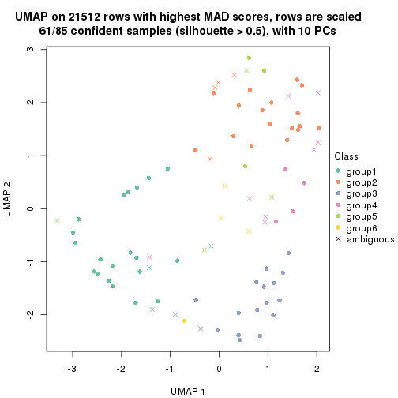</p>

</div>
</div>


Following heatmap shows how subgroups are split when increasing `k`:

```r
collect_classes(res)
```


Test correlation between subgroups and known annotations. If the known
annotation is numeric, one-way ANOVA test is applied, and if the known
annotation is discrete, chi-squared contingency table test is applied.

```r
test_to_known_factors(res)
```

```
#>          n disease.state(p) cell.type(p) k
#> MAD:NMF 78         0.001072     0.004258 2
#> MAD:NMF 82         0.000391     0.006181 3
#> MAD:NMF 70         0.000905     0.009286 4
#> MAD:NMF 61         0.000882     0.026639 5
#> MAD:NMF 61         0.001078     0.000967 6
```


If matrix rows can be associated to genes, consider to use `GO_Enrichment(res,
...)` to perform function enrichment for the signature genes.


 

---------------------------------------------------


### ATC:hclust


The object with results only for a single top-value method and a single partition method 
can be extracted as:

```r
res = res_list["ATC", "hclust"]
# you can also extract it by
# res = res_list["ATC:hclust"]
```

A summary of `res` and all the functions that can be applied to it:

```r
res
```

```
#> A 'ConsensusPartition' object with k = 2, 3, 4, 5, 6.
#>   On a matrix with 21512 rows and 85 columns.
#>   Top rows (1000, 2000, 3000, 4000, 5000) are extracted by 'ATC' method.
#>   Subgroups are detected by 'hclust' method.
#>   Performed in total 1250 partitions by row resampling.
#>   Best k for subgroups seems to be 3.
#> 
#> Following methods can be applied to this 'ConsensusPartition' object:
#>  [1] "cola_report"             "collect_classes"         "collect_plots"          
#>  [4] "collect_stats"           "colnames"                "compare_signatures"     
#>  [7] "consensus_heatmap"       "dimension_reduction"     "functional_enrichment"  
#> [10] "get_anno_col"            "get_anno"                "get_classes"            
#> [13] "get_consensus"           "get_matrix"              "get_membership"         
#> [16] "get_param"               "get_signatures"          "get_stats"              
#> [19] "is_best_k"               "is_stable_k"             "membership_heatmap"     
#> [22] "ncol"                    "nrow"                    "plot_ecdf"              
#> [25] "rownames"                "select_partition_number" "show"                   
#> [28] "suggest_best_k"          "test_to_known_factors"
```

`collect_plots()` function collects all the plots made from `res` for all `k` (number of partitions)
into one single page to provide an easy and fast comparison between different `k`.

```r
collect_plots(res)
```


The plots are:

- The first row: a plot of the ECDF (Empirical cumulative distribution
  function) curves of the consensus matrix for each `k` and the heatmap of
  predicted classes for each `k`.
- The second row: heatmaps of the consensus matrix for each `k`.
- The third row: heatmaps of the membership matrix for each `k`.
- The fouth row: heatmaps of the signatures for each `k`.

All the plots in panels can be made by individual functions and they are
plotted later in this section.

`select_partition_number()` produces several plots showing different
statistics for choosing "optimized" `k`. There are following statistics:

- ECDF curves of the consensus matrix for each `k`;
- 1-PAC. [The PAC
  score](https://en.wikipedia.org/wiki/Consensus_clustering#Over-interpretation_potential_of_consensus_clustering)
  measures the proportion of the ambiguous subgrouping.
- Mean silhouette score.
- Concordance. The mean probability of fiting the consensus class ids in all
  partitions.
- Area increased. Denote $A_k$ as the area under the ECDF curve for current
  `k`, the area increased is defined as $A_k - A_{k-1}$.
- Rand index. The percent of pairs of samples that are both in a same cluster
  or both are not in a same cluster in the partition of k and k-1.
- Jaccard index. The ratio of pairs of samples are both in a same cluster in
  the partition of k and k-1 and the pairs of samples are both in a same
  cluster in the partition k or k-1.

The detailed explanations of these statistics can be found in [the cola
vignette](http://bioconductor.org/packages/devel/bioc/vignettes/cola/inst/doc/cola.html#toc_13).

Generally speaking, lower PAC score, higher mean silhouette score or higher
concordance corresponds to better partition. Rand index and Jaccard index
measure how similar the current partition is compared to partition with `k-1`.
If they are too similar, we won't accept `k` is better than `k-1`.

```r
select_partition_number(res)
```


The numeric values for all these statistics can be obtained by `get_stats()`.

```r
get_stats(res)
```

```
#>   k 1-PAC mean_silhouette concordance area_increased  Rand Jaccard
#> 2 2 0.330           0.630       0.813         0.4219 0.510   0.510
#> 3 3 0.531           0.725       0.859         0.4498 0.691   0.469
#> 4 4 0.581           0.656       0.797         0.1741 0.845   0.588
#> 5 5 0.639           0.639       0.775         0.0711 0.949   0.809
#> 6 6 0.673           0.599       0.767         0.0420 0.966   0.852
```

`suggest_best_k()` suggests the best $k$ based on these statistics. The rules are as follows:

- All $k$ with Jaccard index larger than 0.95 are removed because the increase of
  the partition number does not provides enough extra information. If all $k$ are removed,
  the best $k$ is assigned by `NA`.
- For $k$ with 1-PAC larger than 0.9, the maximal $k$ is taken as the "best k". Other $k$ is called "optional k".
- If it does not fit the second rule. The $k$ with the highest vote of highest
  1-PAC, mean silhouette and concordance is taken as the "best k".

```r
suggest_best_k(res)
```

```
#> [1] 3
```


Following shows the table of the partitions (You need to click the **show/hide
code output** link to see it). The membership matrix (columns with name `p*`)
is inferred by
[`clue::cl_consensus()`](https://www.rdocumentation.org/link/cl_consensus?package=clue)
function with the `SE` method. Basically the value in the membership matrix
represents the probability to belong to a certain group. The finall class
label for an item is determined with the group with highest probability it
belongs to.

In `get_classes()` function, the entropy is calculated from the membership
matrix and the silhouette score is calculated from the consensus matrix.


<script>
$( function() {
	$( '#tabs-ATC-hclust-get-classes' ).tabs();
} );
</script>
<div id='tabs-ATC-hclust-get-classes'>
<ul>
<li><a href='#tab-ATC-hclust-get-classes-1'>k = 2</a></li>
<li><a href='#tab-ATC-hclust-get-classes-2'>k = 3</a></li>
<li><a href='#tab-ATC-hclust-get-classes-3'>k = 4</a></li>
<li><a href='#tab-ATC-hclust-get-classes-4'>k = 5</a></li>
<li><a href='#tab-ATC-hclust-get-classes-5'>k = 6</a></li>
</ul>

<div id='tab-ATC-hclust-get-classes-1'>
<p><a id='tab-ATC-hclust-get-classes-1-a' style='color:#0366d6' href='#'>show/hide code output</a></p>
<pre><code class="r">cbind(get_classes(res, k = 2), get_membership(res, k = 2))
</code></pre>

<pre><code>#&gt;          class entropy silhouette    p1    p2
#&gt; GSM99497     1  0.9170     0.6806 0.668 0.332
#&gt; GSM99503     1  0.0000     0.7005 1.000 0.000
#&gt; GSM99505     1  0.0672     0.7032 0.992 0.008
#&gt; GSM99507     1  0.9170     0.6806 0.668 0.332
#&gt; GSM99567     1  0.9170     0.6806 0.668 0.332
#&gt; GSM99575     1  0.0000     0.7005 1.000 0.000
#&gt; GSM99593     1  0.9209     0.6750 0.664 0.336
#&gt; GSM99595     1  0.9170     0.6806 0.668 0.332
#&gt; GSM99469     1  0.0672     0.7032 0.992 0.008
#&gt; GSM99499     1  0.0672     0.7032 0.992 0.008
#&gt; GSM99501     1  0.0672     0.7032 0.992 0.008
#&gt; GSM99509     1  0.9170     0.6806 0.668 0.332
#&gt; GSM99569     1  0.9170     0.6806 0.668 0.332
#&gt; GSM99597     1  0.9170     0.6806 0.668 0.332
#&gt; GSM99601     2  0.0376     0.7876 0.004 0.996
#&gt; GSM99459     1  0.9044     0.6861 0.680 0.320
#&gt; GSM99461     1  0.9044     0.6861 0.680 0.320
#&gt; GSM99511     1  0.9170     0.6806 0.668 0.332
#&gt; GSM99513     1  0.9170     0.6806 0.668 0.332
#&gt; GSM99515     1  0.9170     0.6806 0.668 0.332
#&gt; GSM99517     1  0.0000     0.7005 1.000 0.000
#&gt; GSM99519     1  0.9044     0.6861 0.680 0.320
#&gt; GSM99521     1  0.9170     0.6806 0.668 0.332
#&gt; GSM99523     1  0.9170     0.6806 0.668 0.332
#&gt; GSM99571     1  0.0000     0.7005 1.000 0.000
#&gt; GSM99599     1  0.0000     0.7005 1.000 0.000
#&gt; GSM99433     2  0.4815     0.7629 0.104 0.896
#&gt; GSM99435     1  0.9286     0.6624 0.656 0.344
#&gt; GSM99437     2  0.1414     0.7904 0.020 0.980
#&gt; GSM99439     2  0.0000     0.7860 0.000 1.000
#&gt; GSM99441     1  0.0000     0.7005 1.000 0.000
#&gt; GSM99443     2  0.0000     0.7860 0.000 1.000
#&gt; GSM99445     2  0.0000     0.7860 0.000 1.000
#&gt; GSM99447     2  0.2778     0.7844 0.048 0.952
#&gt; GSM99449     2  0.9933    -0.0474 0.452 0.548
#&gt; GSM99451     1  0.9286     0.6622 0.656 0.344
#&gt; GSM99453     1  0.0000     0.7005 1.000 0.000
#&gt; GSM99455     1  0.0000     0.7005 1.000 0.000
#&gt; GSM99457     1  0.0000     0.7005 1.000 0.000
#&gt; GSM99463     2  0.0000     0.7860 0.000 1.000
#&gt; GSM99465     1  0.9087     0.6847 0.676 0.324
#&gt; GSM99467     2  0.9954    -0.0783 0.460 0.540
#&gt; GSM99471     1  0.9209     0.5310 0.664 0.336
#&gt; GSM99473     1  0.9209     0.5310 0.664 0.336
#&gt; GSM99475     1  0.9170     0.6806 0.668 0.332
#&gt; GSM99477     2  0.9954    -0.0783 0.460 0.540
#&gt; GSM99479     2  0.9963    -0.0984 0.464 0.536
#&gt; GSM99481     1  0.0000     0.7005 1.000 0.000
#&gt; GSM99483     1  0.0000     0.7005 1.000 0.000
#&gt; GSM99485     2  0.5178     0.7540 0.116 0.884
#&gt; GSM99487     2  0.1414     0.7904 0.020 0.980
#&gt; GSM99489     2  0.0000     0.7860 0.000 1.000
#&gt; GSM99491     2  0.5294     0.7506 0.120 0.880
#&gt; GSM99493     1  0.0000     0.7005 1.000 0.000
#&gt; GSM99495     2  0.0000     0.7860 0.000 1.000
#&gt; GSM99525     1  0.6712     0.6824 0.824 0.176
#&gt; GSM99527     1  0.9552     0.6010 0.624 0.376
#&gt; GSM99529     2  0.9963    -0.1029 0.464 0.536
#&gt; GSM99531     1  0.9087     0.6847 0.676 0.324
#&gt; GSM99533     1  0.9170     0.6806 0.668 0.332
#&gt; GSM99535     2  0.8386     0.5333 0.268 0.732
#&gt; GSM99537     1  0.0672     0.7032 0.992 0.008
#&gt; GSM99539     2  0.4690     0.7650 0.100 0.900
#&gt; GSM99541     1  0.0938     0.7037 0.988 0.012
#&gt; GSM99543     2  0.1633     0.7877 0.024 0.976
#&gt; GSM99545     2  0.1414     0.7899 0.020 0.980
#&gt; GSM99547     2  0.9954    -0.0663 0.460 0.540
#&gt; GSM99549     2  0.0000     0.7860 0.000 1.000
#&gt; GSM99551     1  0.8144     0.5693 0.748 0.252
#&gt; GSM99553     1  0.9977     0.3217 0.528 0.472
#&gt; GSM99555     2  0.0938     0.7894 0.012 0.988
#&gt; GSM99557     2  0.0376     0.7876 0.004 0.996
#&gt; GSM99559     2  0.9909    -0.0114 0.444 0.556
#&gt; GSM99561     2  0.5178     0.7540 0.116 0.884
#&gt; GSM99563     1  0.9170     0.6806 0.668 0.332
#&gt; GSM99565     2  0.1414     0.7904 0.020 0.980
#&gt; GSM99573     2  0.0000     0.7860 0.000 1.000
#&gt; GSM99577     1  0.0938     0.7037 0.988 0.012
#&gt; GSM99579     2  0.5294     0.7506 0.120 0.880
#&gt; GSM99581     1  0.9881     0.4449 0.564 0.436
#&gt; GSM99583     2  0.9944    -0.0570 0.456 0.544
#&gt; GSM99585     2  0.4815     0.7629 0.104 0.896
#&gt; GSM99587     1  0.0000     0.7005 1.000 0.000
#&gt; GSM99589     2  0.5408     0.7466 0.124 0.876
#&gt; GSM99591     2  0.0000     0.7860 0.000 1.000
</code></pre>

<script>
$('#tab-ATC-hclust-get-classes-1-a').parent().next().next().hide();
$('#tab-ATC-hclust-get-classes-1-a').click(function(){
  $('#tab-ATC-hclust-get-classes-1-a').parent().next().next().toggle();
  return(false);
});
</script>
</div>

<div id='tab-ATC-hclust-get-classes-2'>
<p><a id='tab-ATC-hclust-get-classes-2-a' style='color:#0366d6' href='#'>show/hide code output</a></p>
<pre><code class="r">cbind(get_classes(res, k = 3), get_membership(res, k = 3))
</code></pre>

<pre><code>#&gt;          class entropy silhouette    p1    p2    p3
#&gt; GSM99497     3  0.0747     0.8651 0.016 0.000 0.984
#&gt; GSM99503     1  0.0000     0.8528 1.000 0.000 0.000
#&gt; GSM99505     1  0.5835     0.6209 0.660 0.000 0.340
#&gt; GSM99507     3  0.0747     0.8651 0.016 0.000 0.984
#&gt; GSM99567     3  0.0747     0.8651 0.016 0.000 0.984
#&gt; GSM99575     1  0.0000     0.8528 1.000 0.000 0.000
#&gt; GSM99593     3  0.0592     0.8637 0.012 0.000 0.988
#&gt; GSM99595     3  0.0747     0.8651 0.016 0.000 0.984
#&gt; GSM99469     1  0.5835     0.6209 0.660 0.000 0.340
#&gt; GSM99499     1  0.5835     0.6209 0.660 0.000 0.340
#&gt; GSM99501     1  0.5835     0.6209 0.660 0.000 0.340
#&gt; GSM99509     3  0.0747     0.8651 0.016 0.000 0.984
#&gt; GSM99569     3  0.0747     0.8651 0.016 0.000 0.984
#&gt; GSM99597     3  0.0747     0.8651 0.016 0.000 0.984
#&gt; GSM99601     2  0.1643     0.7442 0.000 0.956 0.044
#&gt; GSM99459     3  0.1753     0.8461 0.048 0.000 0.952
#&gt; GSM99461     3  0.1753     0.8461 0.048 0.000 0.952
#&gt; GSM99511     3  0.0747     0.8651 0.016 0.000 0.984
#&gt; GSM99513     3  0.0747     0.8651 0.016 0.000 0.984
#&gt; GSM99515     3  0.0747     0.8651 0.016 0.000 0.984
#&gt; GSM99517     1  0.0000     0.8528 1.000 0.000 0.000
#&gt; GSM99519     3  0.1860     0.8430 0.052 0.000 0.948
#&gt; GSM99521     3  0.0747     0.8651 0.016 0.000 0.984
#&gt; GSM99523     3  0.0747     0.8651 0.016 0.000 0.984
#&gt; GSM99571     1  0.0000     0.8528 1.000 0.000 0.000
#&gt; GSM99599     1  0.0000     0.8528 1.000 0.000 0.000
#&gt; GSM99433     2  0.6267     0.4588 0.000 0.548 0.452
#&gt; GSM99435     3  0.0237     0.8602 0.004 0.000 0.996
#&gt; GSM99437     2  0.5968     0.5978 0.000 0.636 0.364
#&gt; GSM99439     2  0.0000     0.7353 0.000 1.000 0.000
#&gt; GSM99441     1  0.0000     0.8528 1.000 0.000 0.000
#&gt; GSM99443     2  0.0000     0.7353 0.000 1.000 0.000
#&gt; GSM99445     2  0.0000     0.7353 0.000 1.000 0.000
#&gt; GSM99447     2  0.4750     0.7025 0.000 0.784 0.216
#&gt; GSM99449     3  0.4555     0.6840 0.000 0.200 0.800
#&gt; GSM99451     3  0.0237     0.8601 0.004 0.000 0.996
#&gt; GSM99453     1  0.0000     0.8528 1.000 0.000 0.000
#&gt; GSM99455     1  0.0000     0.8528 1.000 0.000 0.000
#&gt; GSM99457     1  0.0000     0.8528 1.000 0.000 0.000
#&gt; GSM99463     2  0.0000     0.7353 0.000 1.000 0.000
#&gt; GSM99465     3  0.1163     0.8588 0.028 0.000 0.972
#&gt; GSM99467     3  0.4452     0.6983 0.000 0.192 0.808
#&gt; GSM99471     3  0.8278     0.5117 0.248 0.132 0.620
#&gt; GSM99473     3  0.8278     0.5117 0.248 0.132 0.620
#&gt; GSM99475     3  0.0747     0.8651 0.016 0.000 0.984
#&gt; GSM99477     3  0.4452     0.6983 0.000 0.192 0.808
#&gt; GSM99479     3  0.4733     0.6996 0.004 0.196 0.800
#&gt; GSM99481     1  0.0000     0.8528 1.000 0.000 0.000
#&gt; GSM99483     1  0.0000     0.8528 1.000 0.000 0.000
#&gt; GSM99485     2  0.6225     0.4841 0.000 0.568 0.432
#&gt; GSM99487     2  0.5968     0.5978 0.000 0.636 0.364
#&gt; GSM99489     2  0.0000     0.7353 0.000 1.000 0.000
#&gt; GSM99491     2  0.6260     0.4527 0.000 0.552 0.448
#&gt; GSM99493     1  0.0000     0.8528 1.000 0.000 0.000
#&gt; GSM99495     2  0.0000     0.7353 0.000 1.000 0.000
#&gt; GSM99525     1  0.6523     0.6225 0.724 0.048 0.228
#&gt; GSM99527     3  0.1163     0.8456 0.000 0.028 0.972
#&gt; GSM99529     3  0.5171     0.6960 0.012 0.204 0.784
#&gt; GSM99531     3  0.1031     0.8607 0.024 0.000 0.976
#&gt; GSM99533     3  0.0747     0.8651 0.016 0.000 0.984
#&gt; GSM99535     3  0.6553     0.0503 0.008 0.412 0.580
#&gt; GSM99537     1  0.3941     0.7862 0.844 0.000 0.156
#&gt; GSM99539     2  0.6140     0.5423 0.000 0.596 0.404
#&gt; GSM99541     1  0.5968     0.5848 0.636 0.000 0.364
#&gt; GSM99543     2  0.1289     0.7371 0.000 0.968 0.032
#&gt; GSM99545     2  0.4346     0.7186 0.000 0.816 0.184
#&gt; GSM99547     3  0.4963     0.6821 0.008 0.200 0.792
#&gt; GSM99549     2  0.0000     0.7353 0.000 1.000 0.000
#&gt; GSM99551     3  0.9489     0.0920 0.352 0.192 0.456
#&gt; GSM99553     3  0.4411     0.7684 0.016 0.140 0.844
#&gt; GSM99555     2  0.4002     0.7250 0.000 0.840 0.160
#&gt; GSM99557     2  0.1289     0.7431 0.000 0.968 0.032
#&gt; GSM99559     3  0.4654     0.6722 0.000 0.208 0.792
#&gt; GSM99561     2  0.6274     0.4414 0.000 0.544 0.456
#&gt; GSM99563     3  0.0747     0.8651 0.016 0.000 0.984
#&gt; GSM99565     2  0.5968     0.5978 0.000 0.636 0.364
#&gt; GSM99573     2  0.0000     0.7353 0.000 1.000 0.000
#&gt; GSM99577     1  0.5948     0.5914 0.640 0.000 0.360
#&gt; GSM99579     2  0.6260     0.4527 0.000 0.552 0.448
#&gt; GSM99581     3  0.3539     0.8020 0.012 0.100 0.888
#&gt; GSM99583     3  0.4834     0.6801 0.004 0.204 0.792
#&gt; GSM99585     2  0.6267     0.4588 0.000 0.548 0.452
#&gt; GSM99587     1  0.0000     0.8528 1.000 0.000 0.000
#&gt; GSM99589     2  0.6204     0.4989 0.000 0.576 0.424
#&gt; GSM99591     2  0.0000     0.7353 0.000 1.000 0.000
</code></pre>

<script>
$('#tab-ATC-hclust-get-classes-2-a').parent().next().next().hide();
$('#tab-ATC-hclust-get-classes-2-a').click(function(){
  $('#tab-ATC-hclust-get-classes-2-a').parent().next().next().toggle();
  return(false);
});
</script>
</div>

<div id='tab-ATC-hclust-get-classes-3'>
<p><a id='tab-ATC-hclust-get-classes-3-a' style='color:#0366d6' href='#'>show/hide code output</a></p>
<pre><code class="r">cbind(get_classes(res, k = 4), get_membership(res, k = 4))
</code></pre>

<pre><code>#&gt;          class entropy silhouette    p1    p2    p3    p4
#&gt; GSM99497     3  0.0336     0.8444 0.000 0.000 0.992 0.008
#&gt; GSM99503     1  0.0000     0.8462 1.000 0.000 0.000 0.000
#&gt; GSM99505     1  0.5807     0.6083 0.636 0.000 0.312 0.052
#&gt; GSM99507     3  0.0336     0.8444 0.000 0.000 0.992 0.008
#&gt; GSM99567     3  0.0336     0.8444 0.000 0.000 0.992 0.008
#&gt; GSM99575     1  0.0000     0.8462 1.000 0.000 0.000 0.000
#&gt; GSM99593     3  0.1022     0.8400 0.000 0.000 0.968 0.032
#&gt; GSM99595     3  0.0592     0.8443 0.000 0.000 0.984 0.016
#&gt; GSM99469     1  0.5807     0.6083 0.636 0.000 0.312 0.052
#&gt; GSM99499     1  0.5807     0.6083 0.636 0.000 0.312 0.052
#&gt; GSM99501     1  0.5807     0.6083 0.636 0.000 0.312 0.052
#&gt; GSM99509     3  0.0469     0.8440 0.000 0.000 0.988 0.012
#&gt; GSM99569     3  0.0000     0.8438 0.000 0.000 1.000 0.000
#&gt; GSM99597     3  0.1302     0.8365 0.000 0.000 0.956 0.044
#&gt; GSM99601     2  0.3157     0.7562 0.000 0.852 0.004 0.144
#&gt; GSM99459     3  0.3806     0.7631 0.020 0.000 0.824 0.156
#&gt; GSM99461     3  0.3806     0.7631 0.020 0.000 0.824 0.156
#&gt; GSM99511     3  0.0592     0.8420 0.000 0.000 0.984 0.016
#&gt; GSM99513     3  0.0592     0.8420 0.000 0.000 0.984 0.016
#&gt; GSM99515     3  0.0336     0.8444 0.000 0.000 0.992 0.008
#&gt; GSM99517     1  0.0000     0.8462 1.000 0.000 0.000 0.000
#&gt; GSM99519     3  0.3862     0.7623 0.024 0.000 0.824 0.152
#&gt; GSM99521     3  0.1940     0.8340 0.000 0.000 0.924 0.076
#&gt; GSM99523     3  0.0000     0.8438 0.000 0.000 1.000 0.000
#&gt; GSM99571     1  0.0000     0.8462 1.000 0.000 0.000 0.000
#&gt; GSM99599     1  0.0000     0.8462 1.000 0.000 0.000 0.000
#&gt; GSM99433     4  0.6820     0.5365 0.000 0.364 0.108 0.528
#&gt; GSM99435     3  0.2345     0.7936 0.000 0.000 0.900 0.100
#&gt; GSM99437     4  0.6755     0.3991 0.000 0.448 0.092 0.460
#&gt; GSM99439     2  0.0592     0.8551 0.000 0.984 0.000 0.016
#&gt; GSM99441     1  0.0000     0.8462 1.000 0.000 0.000 0.000
#&gt; GSM99443     2  0.0000     0.8577 0.000 1.000 0.000 0.000
#&gt; GSM99445     2  0.0000     0.8577 0.000 1.000 0.000 0.000
#&gt; GSM99447     2  0.5423     0.3499 0.000 0.640 0.028 0.332
#&gt; GSM99449     3  0.6371    -0.1354 0.000 0.064 0.508 0.428
#&gt; GSM99451     3  0.2647     0.7998 0.000 0.000 0.880 0.120
#&gt; GSM99453     1  0.0000     0.8462 1.000 0.000 0.000 0.000
#&gt; GSM99455     1  0.0000     0.8462 1.000 0.000 0.000 0.000
#&gt; GSM99457     1  0.0000     0.8462 1.000 0.000 0.000 0.000
#&gt; GSM99463     2  0.0000     0.8577 0.000 1.000 0.000 0.000
#&gt; GSM99465     3  0.3172     0.7765 0.000 0.000 0.840 0.160
#&gt; GSM99467     4  0.5865     0.3503 0.000 0.036 0.412 0.552
#&gt; GSM99471     4  0.6676     0.3241 0.244 0.012 0.108 0.636
#&gt; GSM99473     4  0.6676     0.3241 0.244 0.012 0.108 0.636
#&gt; GSM99475     3  0.2814     0.8134 0.000 0.000 0.868 0.132
#&gt; GSM99477     4  0.5865     0.3503 0.000 0.036 0.412 0.552
#&gt; GSM99479     4  0.5924     0.3629 0.000 0.040 0.404 0.556
#&gt; GSM99481     1  0.0000     0.8462 1.000 0.000 0.000 0.000
#&gt; GSM99483     1  0.0000     0.8462 1.000 0.000 0.000 0.000
#&gt; GSM99485     4  0.6617     0.5218 0.000 0.380 0.088 0.532
#&gt; GSM99487     4  0.6755     0.3991 0.000 0.448 0.092 0.460
#&gt; GSM99489     2  0.0000     0.8577 0.000 1.000 0.000 0.000
#&gt; GSM99491     4  0.6637     0.5380 0.000 0.368 0.092 0.540
#&gt; GSM99493     1  0.0000     0.8462 1.000 0.000 0.000 0.000
#&gt; GSM99495     2  0.0000     0.8577 0.000 1.000 0.000 0.000
#&gt; GSM99525     1  0.5606     0.5554 0.724 0.008 0.068 0.200
#&gt; GSM99527     3  0.3710     0.6815 0.000 0.004 0.804 0.192
#&gt; GSM99529     4  0.5883     0.4707 0.000 0.060 0.300 0.640
#&gt; GSM99531     3  0.3123     0.7830 0.000 0.000 0.844 0.156
#&gt; GSM99533     3  0.2814     0.8134 0.000 0.000 0.868 0.132
#&gt; GSM99535     4  0.6393     0.5561 0.008 0.236 0.100 0.656
#&gt; GSM99537     1  0.3760     0.7749 0.836 0.000 0.136 0.028
#&gt; GSM99539     4  0.6745     0.4378 0.000 0.428 0.092 0.480
#&gt; GSM99541     1  0.5973     0.5729 0.612 0.000 0.332 0.056
#&gt; GSM99543     2  0.1474     0.8344 0.000 0.948 0.000 0.052
#&gt; GSM99545     2  0.5085     0.4503 0.000 0.676 0.020 0.304
#&gt; GSM99547     4  0.5868     0.4876 0.008 0.040 0.308 0.644
#&gt; GSM99549     2  0.2345     0.7865 0.000 0.900 0.000 0.100
#&gt; GSM99551     4  0.5823    -0.0803 0.348 0.000 0.044 0.608
#&gt; GSM99553     3  0.6178    -0.0575 0.004 0.040 0.484 0.472
#&gt; GSM99555     2  0.4910     0.5016 0.000 0.704 0.020 0.276
#&gt; GSM99557     2  0.2760     0.7767 0.000 0.872 0.000 0.128
#&gt; GSM99559     3  0.6384    -0.1717 0.000 0.064 0.496 0.440
#&gt; GSM99561     4  0.6575     0.5451 0.000 0.348 0.092 0.560
#&gt; GSM99563     3  0.0000     0.8438 0.000 0.000 1.000 0.000
#&gt; GSM99565     4  0.6755     0.3991 0.000 0.448 0.092 0.460
#&gt; GSM99573     2  0.0592     0.8551 0.000 0.984 0.000 0.016
#&gt; GSM99577     1  0.5955     0.5802 0.616 0.000 0.328 0.056
#&gt; GSM99579     4  0.6637     0.5380 0.000 0.368 0.092 0.540
#&gt; GSM99581     3  0.5213     0.3856 0.000 0.020 0.652 0.328
#&gt; GSM99583     4  0.4810     0.5337 0.004 0.036 0.196 0.764
#&gt; GSM99585     4  0.6773     0.5356 0.000 0.364 0.104 0.532
#&gt; GSM99587     1  0.0000     0.8462 1.000 0.000 0.000 0.000
#&gt; GSM99589     4  0.6785     0.4777 0.000 0.420 0.096 0.484
#&gt; GSM99591     2  0.0000     0.8577 0.000 1.000 0.000 0.000
</code></pre>

<script>
$('#tab-ATC-hclust-get-classes-3-a').parent().next().next().hide();
$('#tab-ATC-hclust-get-classes-3-a').click(function(){
  $('#tab-ATC-hclust-get-classes-3-a').parent().next().next().toggle();
  return(false);
});
</script>
</div>

<div id='tab-ATC-hclust-get-classes-4'>
<p><a id='tab-ATC-hclust-get-classes-4-a' style='color:#0366d6' href='#'>show/hide code output</a></p>
<pre><code class="r">cbind(get_classes(res, k = 5), get_membership(res, k = 5))
</code></pre>

<pre><code>#&gt;          class entropy silhouette    p1    p2    p3    p4    p5
#&gt; GSM99497     3  0.0693      0.819 0.000 0.012 0.980 0.008 0.000
#&gt; GSM99503     1  0.0162      0.781 0.996 0.000 0.000 0.004 0.000
#&gt; GSM99505     1  0.5659      0.495 0.632 0.000 0.204 0.164 0.000
#&gt; GSM99507     3  0.0693      0.819 0.000 0.012 0.980 0.008 0.000
#&gt; GSM99567     3  0.0609      0.817 0.000 0.020 0.980 0.000 0.000
#&gt; GSM99575     1  0.0162      0.781 0.996 0.000 0.000 0.004 0.000
#&gt; GSM99593     3  0.2068      0.804 0.000 0.092 0.904 0.004 0.000
#&gt; GSM99595     3  0.1211      0.820 0.000 0.024 0.960 0.016 0.000
#&gt; GSM99469     1  0.5659      0.495 0.632 0.000 0.204 0.164 0.000
#&gt; GSM99499     1  0.5659      0.495 0.632 0.000 0.204 0.164 0.000
#&gt; GSM99501     1  0.5659      0.495 0.632 0.000 0.204 0.164 0.000
#&gt; GSM99509     3  0.1012      0.819 0.000 0.012 0.968 0.020 0.000
#&gt; GSM99569     3  0.0000      0.819 0.000 0.000 1.000 0.000 0.000
#&gt; GSM99597     3  0.2074      0.798 0.000 0.000 0.896 0.104 0.000
#&gt; GSM99601     5  0.3242      0.700 0.000 0.216 0.000 0.000 0.784
#&gt; GSM99459     3  0.4697      0.586 0.020 0.000 0.592 0.388 0.000
#&gt; GSM99461     3  0.4697      0.586 0.020 0.000 0.592 0.388 0.000
#&gt; GSM99511     3  0.1549      0.814 0.000 0.040 0.944 0.016 0.000
#&gt; GSM99513     3  0.1549      0.814 0.000 0.040 0.944 0.016 0.000
#&gt; GSM99515     3  0.0693      0.819 0.000 0.012 0.980 0.008 0.000
#&gt; GSM99517     1  0.0162      0.781 0.996 0.000 0.000 0.004 0.000
#&gt; GSM99519     3  0.4768      0.585 0.024 0.000 0.592 0.384 0.000
#&gt; GSM99521     3  0.3051      0.802 0.000 0.076 0.864 0.060 0.000
#&gt; GSM99523     3  0.0000      0.819 0.000 0.000 1.000 0.000 0.000
#&gt; GSM99571     1  0.0000      0.782 1.000 0.000 0.000 0.000 0.000
#&gt; GSM99599     1  0.0162      0.781 0.996 0.000 0.000 0.004 0.000
#&gt; GSM99433     2  0.4193      0.570 0.000 0.720 0.024 0.000 0.256
#&gt; GSM99435     3  0.3639      0.755 0.000 0.144 0.812 0.044 0.000
#&gt; GSM99437     2  0.4451      0.466 0.000 0.644 0.016 0.000 0.340
#&gt; GSM99439     5  0.1216      0.829 0.000 0.020 0.000 0.020 0.960
#&gt; GSM99441     1  0.0000      0.782 1.000 0.000 0.000 0.000 0.000
#&gt; GSM99443     5  0.0290      0.835 0.000 0.008 0.000 0.000 0.992
#&gt; GSM99445     5  0.0290      0.835 0.000 0.008 0.000 0.000 0.992
#&gt; GSM99447     5  0.4730      0.296 0.000 0.416 0.012 0.004 0.568
#&gt; GSM99449     2  0.4517      0.357 0.000 0.616 0.372 0.008 0.004
#&gt; GSM99451     3  0.3888      0.762 0.000 0.120 0.804 0.076 0.000
#&gt; GSM99453     1  0.0000      0.782 1.000 0.000 0.000 0.000 0.000
#&gt; GSM99455     1  0.0000      0.782 1.000 0.000 0.000 0.000 0.000
#&gt; GSM99457     1  0.0000      0.782 1.000 0.000 0.000 0.000 0.000
#&gt; GSM99463     5  0.0162      0.834 0.000 0.004 0.000 0.000 0.996
#&gt; GSM99465     3  0.4161      0.602 0.000 0.000 0.608 0.392 0.000
#&gt; GSM99467     2  0.3635      0.503 0.000 0.748 0.248 0.004 0.000
#&gt; GSM99471     4  0.6642      0.835 0.232 0.252 0.008 0.508 0.000
#&gt; GSM99473     4  0.6642      0.835 0.232 0.252 0.008 0.508 0.000
#&gt; GSM99475     3  0.4965      0.675 0.000 0.052 0.644 0.304 0.000
#&gt; GSM99477     2  0.3635      0.503 0.000 0.748 0.248 0.004 0.000
#&gt; GSM99479     2  0.4114      0.490 0.000 0.732 0.244 0.024 0.000
#&gt; GSM99481     1  0.0000      0.782 1.000 0.000 0.000 0.000 0.000
#&gt; GSM99483     1  0.0000      0.782 1.000 0.000 0.000 0.000 0.000
#&gt; GSM99485     2  0.4818      0.554 0.000 0.676 0.012 0.028 0.284
#&gt; GSM99487     2  0.4451      0.466 0.000 0.644 0.016 0.000 0.340
#&gt; GSM99489     5  0.0162      0.834 0.000 0.004 0.000 0.000 0.996
#&gt; GSM99491     2  0.4382      0.580 0.000 0.736 0.012 0.024 0.228
#&gt; GSM99493     1  0.0000      0.782 1.000 0.000 0.000 0.000 0.000
#&gt; GSM99495     5  0.0162      0.834 0.000 0.004 0.000 0.000 0.996
#&gt; GSM99525     1  0.5083      0.246 0.712 0.136 0.004 0.148 0.000
#&gt; GSM99527     3  0.4693      0.623 0.000 0.244 0.700 0.056 0.000
#&gt; GSM99529     2  0.5033      0.419 0.000 0.716 0.156 0.124 0.004
#&gt; GSM99531     3  0.4302      0.511 0.000 0.000 0.520 0.480 0.000
#&gt; GSM99533     3  0.4965      0.675 0.000 0.052 0.644 0.304 0.000
#&gt; GSM99535     2  0.6339      0.202 0.000 0.544 0.016 0.316 0.124
#&gt; GSM99537     1  0.3535      0.672 0.832 0.000 0.080 0.088 0.000
#&gt; GSM99539     2  0.4941      0.476 0.000 0.640 0.016 0.020 0.324
#&gt; GSM99541     1  0.5847      0.467 0.608 0.000 0.204 0.188 0.000
#&gt; GSM99543     5  0.2795      0.751 0.000 0.064 0.000 0.056 0.880
#&gt; GSM99545     5  0.5126      0.430 0.000 0.356 0.004 0.040 0.600
#&gt; GSM99547     2  0.6056      0.168 0.000 0.552 0.152 0.296 0.000
#&gt; GSM99549     5  0.2424      0.769 0.000 0.000 0.000 0.132 0.868
#&gt; GSM99551     4  0.5710      0.635 0.340 0.076 0.008 0.576 0.000
#&gt; GSM99553     2  0.5953      0.248 0.000 0.540 0.336 0.124 0.000
#&gt; GSM99555     5  0.4639      0.450 0.000 0.344 0.012 0.008 0.636
#&gt; GSM99557     5  0.2966      0.728 0.000 0.184 0.000 0.000 0.816
#&gt; GSM99559     2  0.4419      0.416 0.000 0.644 0.344 0.008 0.004
#&gt; GSM99561     2  0.4110      0.574 0.000 0.736 0.012 0.008 0.244
#&gt; GSM99563     3  0.0000      0.819 0.000 0.000 1.000 0.000 0.000
#&gt; GSM99565     2  0.4451      0.466 0.000 0.644 0.016 0.000 0.340
#&gt; GSM99573     5  0.1216      0.829 0.000 0.020 0.000 0.020 0.960
#&gt; GSM99577     1  0.5819      0.474 0.612 0.000 0.200 0.188 0.000
#&gt; GSM99579     2  0.4382      0.580 0.000 0.736 0.012 0.024 0.228
#&gt; GSM99581     3  0.5065      0.121 0.000 0.420 0.544 0.036 0.000
#&gt; GSM99583     2  0.5509      0.163 0.000 0.564 0.076 0.360 0.000
#&gt; GSM99585     2  0.4260      0.568 0.000 0.720 0.020 0.004 0.256
#&gt; GSM99587     1  0.0000      0.782 1.000 0.000 0.000 0.000 0.000
#&gt; GSM99589     2  0.4669      0.535 0.000 0.692 0.012 0.024 0.272
#&gt; GSM99591     5  0.0290      0.835 0.000 0.008 0.000 0.000 0.992
</code></pre>

<script>
$('#tab-ATC-hclust-get-classes-4-a').parent().next().next().hide();
$('#tab-ATC-hclust-get-classes-4-a').click(function(){
  $('#tab-ATC-hclust-get-classes-4-a').parent().next().next().toggle();
  return(false);
});
</script>
</div>

<div id='tab-ATC-hclust-get-classes-5'>
<p><a id='tab-ATC-hclust-get-classes-5-a' style='color:#0366d6' href='#'>show/hide code output</a></p>
<pre><code class="r">cbind(get_classes(res, k = 6), get_membership(res, k = 6))
</code></pre>

<pre><code>#&gt;          class entropy silhouette    p1    p2    p3    p4    p5    p6
#&gt; GSM99497     3  0.0508     0.7526 0.000 0.004 0.984 0.012 0.000 0.000
#&gt; GSM99503     1  0.0146     0.8180 0.996 0.000 0.000 0.004 0.000 0.000
#&gt; GSM99505     1  0.4628     0.5790 0.632 0.000 0.052 0.312 0.000 0.004
#&gt; GSM99507     3  0.0508     0.7526 0.000 0.004 0.984 0.012 0.000 0.000
#&gt; GSM99567     3  0.0405     0.7538 0.000 0.008 0.988 0.004 0.000 0.000
#&gt; GSM99575     1  0.0146     0.8180 0.996 0.000 0.000 0.004 0.000 0.000
#&gt; GSM99593     3  0.2450     0.7183 0.000 0.116 0.868 0.016 0.000 0.000
#&gt; GSM99595     3  0.1074     0.7522 0.000 0.012 0.960 0.028 0.000 0.000
#&gt; GSM99469     1  0.4628     0.5790 0.632 0.000 0.052 0.312 0.000 0.004
#&gt; GSM99499     1  0.4628     0.5790 0.632 0.000 0.052 0.312 0.000 0.004
#&gt; GSM99501     1  0.4628     0.5790 0.632 0.000 0.052 0.312 0.000 0.004
#&gt; GSM99509     3  0.1082     0.7408 0.000 0.004 0.956 0.040 0.000 0.000
#&gt; GSM99569     3  0.0622     0.7510 0.000 0.000 0.980 0.012 0.000 0.008
#&gt; GSM99597     3  0.3230     0.5184 0.000 0.000 0.776 0.212 0.000 0.012
#&gt; GSM99601     5  0.3468     0.5887 0.000 0.284 0.000 0.004 0.712 0.000
#&gt; GSM99459     4  0.4064     0.9156 0.020 0.000 0.336 0.644 0.000 0.000
#&gt; GSM99461     4  0.4064     0.9156 0.020 0.000 0.336 0.644 0.000 0.000
#&gt; GSM99511     3  0.2265     0.7420 0.000 0.056 0.904 0.028 0.000 0.012
#&gt; GSM99513     3  0.2265     0.7420 0.000 0.056 0.904 0.028 0.000 0.012
#&gt; GSM99515     3  0.0508     0.7526 0.000 0.004 0.984 0.012 0.000 0.000
#&gt; GSM99517     1  0.0146     0.8180 0.996 0.000 0.000 0.004 0.000 0.000
#&gt; GSM99519     4  0.4139     0.9117 0.024 0.000 0.336 0.640 0.000 0.000
#&gt; GSM99521     3  0.3175     0.7015 0.000 0.088 0.832 0.080 0.000 0.000
#&gt; GSM99523     3  0.0622     0.7510 0.000 0.000 0.980 0.012 0.000 0.008
#&gt; GSM99571     1  0.0000     0.8187 1.000 0.000 0.000 0.000 0.000 0.000
#&gt; GSM99599     1  0.0146     0.8180 0.996 0.000 0.000 0.004 0.000 0.000
#&gt; GSM99433     2  0.3053     0.5920 0.000 0.812 0.012 0.004 0.172 0.000
#&gt; GSM99435     3  0.4590     0.6272 0.000 0.168 0.728 0.080 0.000 0.024
#&gt; GSM99437     2  0.3536     0.5084 0.000 0.736 0.004 0.008 0.252 0.000
#&gt; GSM99439     5  0.3961     0.7024 0.000 0.028 0.000 0.036 0.776 0.160
#&gt; GSM99441     1  0.0000     0.8187 1.000 0.000 0.000 0.000 0.000 0.000
#&gt; GSM99443     5  0.0363     0.7538 0.000 0.012 0.000 0.000 0.988 0.000
#&gt; GSM99445     5  0.0260     0.7537 0.000 0.008 0.000 0.000 0.992 0.000
#&gt; GSM99447     5  0.4227     0.1977 0.000 0.492 0.000 0.004 0.496 0.008
#&gt; GSM99449     2  0.4339     0.3746 0.000 0.648 0.316 0.032 0.000 0.004
#&gt; GSM99451     3  0.4754     0.6182 0.000 0.136 0.720 0.120 0.000 0.024
#&gt; GSM99453     1  0.0000     0.8187 1.000 0.000 0.000 0.000 0.000 0.000
#&gt; GSM99455     1  0.0000     0.8187 1.000 0.000 0.000 0.000 0.000 0.000
#&gt; GSM99457     1  0.0000     0.8187 1.000 0.000 0.000 0.000 0.000 0.000
#&gt; GSM99463     5  0.0405     0.7532 0.000 0.004 0.000 0.000 0.988 0.008
#&gt; GSM99465     4  0.3592     0.8927 0.000 0.000 0.344 0.656 0.000 0.000
#&gt; GSM99467     2  0.3739     0.5128 0.000 0.776 0.176 0.040 0.000 0.008
#&gt; GSM99471     6  0.7084     0.7036 0.232 0.132 0.000 0.176 0.000 0.460
#&gt; GSM99473     6  0.7084     0.7036 0.232 0.132 0.000 0.176 0.000 0.460
#&gt; GSM99475     3  0.5581    -0.2607 0.000 0.044 0.464 0.444 0.000 0.048
#&gt; GSM99477     2  0.3739     0.5128 0.000 0.776 0.176 0.040 0.000 0.008
#&gt; GSM99479     2  0.4206     0.5028 0.000 0.756 0.172 0.036 0.000 0.036
#&gt; GSM99481     1  0.0000     0.8187 1.000 0.000 0.000 0.000 0.000 0.000
#&gt; GSM99483     1  0.0000     0.8187 1.000 0.000 0.000 0.000 0.000 0.000
#&gt; GSM99485     2  0.3858     0.5556 0.000 0.732 0.000 0.004 0.236 0.028
#&gt; GSM99487     2  0.3536     0.5084 0.000 0.736 0.004 0.008 0.252 0.000
#&gt; GSM99489     5  0.0405     0.7532 0.000 0.004 0.000 0.000 0.988 0.008
#&gt; GSM99491     2  0.4180     0.5701 0.000 0.752 0.000 0.004 0.112 0.132
#&gt; GSM99493     1  0.0000     0.8187 1.000 0.000 0.000 0.000 0.000 0.000
#&gt; GSM99495     5  0.0405     0.7532 0.000 0.004 0.000 0.000 0.988 0.008
#&gt; GSM99525     1  0.4411     0.3945 0.712 0.080 0.000 0.004 0.000 0.204
#&gt; GSM99527     3  0.5649     0.4487 0.000 0.264 0.588 0.124 0.000 0.024
#&gt; GSM99529     2  0.5351     0.4189 0.000 0.688 0.084 0.100 0.000 0.128
#&gt; GSM99531     4  0.3073     0.7381 0.000 0.000 0.204 0.788 0.000 0.008
#&gt; GSM99533     3  0.5581    -0.2607 0.000 0.044 0.464 0.444 0.000 0.048
#&gt; GSM99535     6  0.4486    -0.0282 0.000 0.384 0.000 0.004 0.028 0.584
#&gt; GSM99537     1  0.2821     0.7309 0.832 0.000 0.016 0.152 0.000 0.000
#&gt; GSM99539     2  0.3934     0.5006 0.000 0.728 0.000 0.012 0.240 0.020
#&gt; GSM99541     1  0.4594     0.5518 0.608 0.000 0.052 0.340 0.000 0.000
#&gt; GSM99543     5  0.4743     0.4786 0.000 0.008 0.000 0.044 0.600 0.348
#&gt; GSM99545     5  0.5285     0.3175 0.000 0.416 0.000 0.036 0.512 0.036
#&gt; GSM99547     2  0.5766    -0.0645 0.000 0.476 0.088 0.028 0.000 0.408
#&gt; GSM99549     5  0.5000     0.5296 0.000 0.000 0.000 0.088 0.580 0.332
#&gt; GSM99551     6  0.6049     0.4898 0.340 0.004 0.000 0.220 0.000 0.436
#&gt; GSM99553     2  0.6701     0.2440 0.000 0.492 0.276 0.096 0.000 0.136
#&gt; GSM99555     5  0.4178     0.3440 0.000 0.428 0.000 0.004 0.560 0.008
#&gt; GSM99557     5  0.3488     0.6230 0.000 0.244 0.000 0.004 0.744 0.008
#&gt; GSM99559     2  0.4216     0.4236 0.000 0.676 0.288 0.032 0.000 0.004
#&gt; GSM99561     2  0.2810     0.5939 0.000 0.832 0.000 0.004 0.156 0.008
#&gt; GSM99563     3  0.0622     0.7510 0.000 0.000 0.980 0.012 0.000 0.008
#&gt; GSM99565     2  0.3536     0.5084 0.000 0.736 0.004 0.008 0.252 0.000
#&gt; GSM99573     5  0.3961     0.7024 0.000 0.028 0.000 0.036 0.776 0.160
#&gt; GSM99577     1  0.4580     0.5573 0.612 0.000 0.052 0.336 0.000 0.000
#&gt; GSM99579     2  0.4180     0.5701 0.000 0.752 0.000 0.004 0.112 0.132
#&gt; GSM99581     3  0.5011     0.0899 0.000 0.420 0.508 0.072 0.000 0.000
#&gt; GSM99583     2  0.6256     0.1019 0.000 0.516 0.040 0.160 0.000 0.284
#&gt; GSM99585     2  0.3096     0.5903 0.000 0.812 0.008 0.004 0.172 0.004
#&gt; GSM99587     1  0.0000     0.8187 1.000 0.000 0.000 0.000 0.000 0.000
#&gt; GSM99589     2  0.4771     0.5261 0.000 0.688 0.000 0.004 0.144 0.164
#&gt; GSM99591     5  0.0363     0.7537 0.000 0.012 0.000 0.000 0.988 0.000
</code></pre>

<script>
$('#tab-ATC-hclust-get-classes-5-a').parent().next().next().hide();
$('#tab-ATC-hclust-get-classes-5-a').click(function(){
  $('#tab-ATC-hclust-get-classes-5-a').parent().next().next().toggle();
  return(false);
});
</script>
</div>
</div>

Heatmaps for the consensus matrix. It visualizes the probability of two
samples to be in a same group.


<script>
$( function() {
	$( '#tabs-ATC-hclust-consensus-heatmap' ).tabs();
} );
</script>
<div id='tabs-ATC-hclust-consensus-heatmap'>
<ul>
<li><a href='#tab-ATC-hclust-consensus-heatmap-1'>k = 2</a></li>
<li><a href='#tab-ATC-hclust-consensus-heatmap-2'>k = 3</a></li>
<li><a href='#tab-ATC-hclust-consensus-heatmap-3'>k = 4</a></li>
<li><a href='#tab-ATC-hclust-consensus-heatmap-4'>k = 5</a></li>
<li><a href='#tab-ATC-hclust-consensus-heatmap-5'>k = 6</a></li>
</ul>
<div id='tab-ATC-hclust-consensus-heatmap-1'>
<pre><code class="r">consensus_heatmap(res, k = 2)
</code></pre>

<p></p>

</div>
<div id='tab-ATC-hclust-consensus-heatmap-2'>
<pre><code class="r">consensus_heatmap(res, k = 3)
</code></pre>

<p></p>

</div>
<div id='tab-ATC-hclust-consensus-heatmap-3'>
<pre><code class="r">consensus_heatmap(res, k = 4)
</code></pre>

<p></p>

</div>
<div id='tab-ATC-hclust-consensus-heatmap-4'>
<pre><code class="r">consensus_heatmap(res, k = 5)
</code></pre>

<p></p>

</div>
<div id='tab-ATC-hclust-consensus-heatmap-5'>
<pre><code class="r">consensus_heatmap(res, k = 6)
</code></pre>

<p></p>

</div>
</div>

Heatmaps for the membership of samples in all partitions to see how consistent they are:


<script>
$( function() {
	$( '#tabs-ATC-hclust-membership-heatmap' ).tabs();
} );
</script>
<div id='tabs-ATC-hclust-membership-heatmap'>
<ul>
<li><a href='#tab-ATC-hclust-membership-heatmap-1'>k = 2</a></li>
<li><a href='#tab-ATC-hclust-membership-heatmap-2'>k = 3</a></li>
<li><a href='#tab-ATC-hclust-membership-heatmap-3'>k = 4</a></li>
<li><a href='#tab-ATC-hclust-membership-heatmap-4'>k = 5</a></li>
<li><a href='#tab-ATC-hclust-membership-heatmap-5'>k = 6</a></li>
</ul>
<div id='tab-ATC-hclust-membership-heatmap-1'>
<pre><code class="r">membership_heatmap(res, k = 2)
</code></pre>

<p></p>

</div>
<div id='tab-ATC-hclust-membership-heatmap-2'>
<pre><code class="r">membership_heatmap(res, k = 3)
</code></pre>

<p></p>

</div>
<div id='tab-ATC-hclust-membership-heatmap-3'>
<pre><code class="r">membership_heatmap(res, k = 4)
</code></pre>

<p></p>

</div>
<div id='tab-ATC-hclust-membership-heatmap-4'>
<pre><code class="r">membership_heatmap(res, k = 5)
</code></pre>

<p></p>

</div>
<div id='tab-ATC-hclust-membership-heatmap-5'>
<pre><code class="r">membership_heatmap(res, k = 6)
</code></pre>

<p></p>

</div>
</div>

As soon as we have had the classes for columns, we can look for signatures
which are significantly different between classes which can be candidate marks
for certain classes. Following are the heatmaps for signatures.


Signature heatmaps where rows are scaled:


<script>
$( function() {
	$( '#tabs-ATC-hclust-get-signatures' ).tabs();
} );
</script>
<div id='tabs-ATC-hclust-get-signatures'>
<ul>
<li><a href='#tab-ATC-hclust-get-signatures-1'>k = 2</a></li>
<li><a href='#tab-ATC-hclust-get-signatures-2'>k = 3</a></li>
<li><a href='#tab-ATC-hclust-get-signatures-3'>k = 4</a></li>
<li><a href='#tab-ATC-hclust-get-signatures-4'>k = 5</a></li>
<li><a href='#tab-ATC-hclust-get-signatures-5'>k = 6</a></li>
</ul>
<div id='tab-ATC-hclust-get-signatures-1'>
<pre><code class="r">get_signatures(res, k = 2)
</code></pre>

<p></p>

</div>
<div id='tab-ATC-hclust-get-signatures-2'>
<pre><code class="r">get_signatures(res, k = 3)
</code></pre>

<p></p>

</div>
<div id='tab-ATC-hclust-get-signatures-3'>
<pre><code class="r">get_signatures(res, k = 4)
</code></pre>

<p></p>

</div>
<div id='tab-ATC-hclust-get-signatures-4'>
<pre><code class="r">get_signatures(res, k = 5)
</code></pre>

<p></p>

</div>
<div id='tab-ATC-hclust-get-signatures-5'>
<pre><code class="r">get_signatures(res, k = 6)
</code></pre>

<p></p>

</div>
</div>


Signature heatmaps where rows are not scaled:


<script>
$( function() {
	$( '#tabs-ATC-hclust-get-signatures-no-scale' ).tabs();
} );
</script>
<div id='tabs-ATC-hclust-get-signatures-no-scale'>
<ul>
<li><a href='#tab-ATC-hclust-get-signatures-no-scale-1'>k = 2</a></li>
<li><a href='#tab-ATC-hclust-get-signatures-no-scale-2'>k = 3</a></li>
<li><a href='#tab-ATC-hclust-get-signatures-no-scale-3'>k = 4</a></li>
<li><a href='#tab-ATC-hclust-get-signatures-no-scale-4'>k = 5</a></li>
<li><a href='#tab-ATC-hclust-get-signatures-no-scale-5'>k = 6</a></li>
</ul>
<div id='tab-ATC-hclust-get-signatures-no-scale-1'>
<pre><code class="r">get_signatures(res, k = 2, scale_rows = FALSE)
</code></pre>

<p></p>

</div>
<div id='tab-ATC-hclust-get-signatures-no-scale-2'>
<pre><code class="r">get_signatures(res, k = 3, scale_rows = FALSE)
</code></pre>

<p></p>

</div>
<div id='tab-ATC-hclust-get-signatures-no-scale-3'>
<pre><code class="r">get_signatures(res, k = 4, scale_rows = FALSE)
</code></pre>

<p></p>

</div>
<div id='tab-ATC-hclust-get-signatures-no-scale-4'>
<pre><code class="r">get_signatures(res, k = 5, scale_rows = FALSE)
</code></pre>

<p></p>

</div>
<div id='tab-ATC-hclust-get-signatures-no-scale-5'>
<pre><code class="r">get_signatures(res, k = 6, scale_rows = FALSE)
</code></pre>

<p></p>

</div>
</div>


Compare the overlap of signatures from different k:

```r
compare_signatures(res)
```


`get_signature()` returns a data frame invisibly. TO get the list of signatures, the function
call should be assigned to a variable explicitly. In following code, if `plot` argument is set
to `FALSE`, no heatmap is plotted while only the differential analysis is performed.

```r
# code only for demonstration
tb = get_signature(res, k = ..., plot = FALSE)
```

An example of the output of `tb` is:

```
#>   which_row         fdr    mean_1    mean_2 scaled_mean_1 scaled_mean_2 km
#> 1        38 0.042760348  8.373488  9.131774    -0.5533452     0.5164555  1
#> 2        40 0.018707592  7.106213  8.469186    -0.6173731     0.5762149  1
#> 3        55 0.019134737 10.221463 11.207825    -0.6159697     0.5749050  1
#> 4        59 0.006059896  5.921854  7.869574    -0.6899429     0.6439467  1
#> 5        60 0.018055526  8.928898 10.211722    -0.6204761     0.5791110  1
#> 6        98 0.009384629 15.714769 14.887706     0.6635654    -0.6193277  2
...
```

The columns in `tb` are:

1. `which_row`: row indices corresponding to the input matrix.
2. `fdr`: FDR for the differential test. 
3. `mean_x`: The mean value in group x.
4. `scaled_mean_x`: The mean value in group x after rows are scaled.
5. `km`: Row groups if k-means clustering is applied to rows.


UMAP plot which shows how samples are separated.


<script>
$( function() {
	$( '#tabs-ATC-hclust-dimension-reduction' ).tabs();
} );
</script>
<div id='tabs-ATC-hclust-dimension-reduction'>
<ul>
<li><a href='#tab-ATC-hclust-dimension-reduction-1'>k = 2</a></li>
<li><a href='#tab-ATC-hclust-dimension-reduction-2'>k = 3</a></li>
<li><a href='#tab-ATC-hclust-dimension-reduction-3'>k = 4</a></li>
<li><a href='#tab-ATC-hclust-dimension-reduction-4'>k = 5</a></li>
<li><a href='#tab-ATC-hclust-dimension-reduction-5'>k = 6</a></li>
</ul>
<div id='tab-ATC-hclust-dimension-reduction-1'>
<pre><code class="r">dimension_reduction(res, k = 2, method = &quot;UMAP&quot;)
</code></pre>

<p></p>

</div>
<div id='tab-ATC-hclust-dimension-reduction-2'>
<pre><code class="r">dimension_reduction(res, k = 3, method = &quot;UMAP&quot;)
</code></pre>

<p></p>

</div>
<div id='tab-ATC-hclust-dimension-reduction-3'>
<pre><code class="r">dimension_reduction(res, k = 4, method = &quot;UMAP&quot;)
</code></pre>

<p>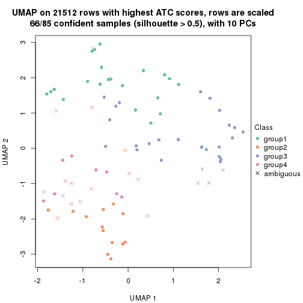</p>

</div>
<div id='tab-ATC-hclust-dimension-reduction-4'>
<pre><code class="r">dimension_reduction(res, k = 5, method = &quot;UMAP&quot;)
</code></pre>

<p></p>

</div>
<div id='tab-ATC-hclust-dimension-reduction-5'>
<pre><code class="r">dimension_reduction(res, k = 6, method = &quot;UMAP&quot;)
</code></pre>

<p></p>

</div>
</div>


Following heatmap shows how subgroups are split when increasing `k`:

```r
collect_classes(res)
```


Test correlation between subgroups and known annotations. If the known
annotation is numeric, one-way ANOVA test is applied, and if the known
annotation is discrete, chi-squared contingency table test is applied.

```r
test_to_known_factors(res)
```

```
#>             n disease.state(p) cell.type(p) k
#> ATC:hclust 75         7.09e-05     0.000379 2
#> ATC:hclust 76         8.89e-03     0.085844 3
#> ATC:hclust 66         3.90e-04     0.016753 4
#> ATC:hclust 62         3.70e-04     0.029071 5
#> ATC:hclust 68         4.01e-05     0.001757 6
```


If matrix rows can be associated to genes, consider to use `GO_Enrichment(res,
...)` to perform function enrichment for the signature genes.


 

---------------------------------------------------


### ATC:kmeans**


The object with results only for a single top-value method and a single partition method 
can be extracted as:

```r
res = res_list["ATC", "kmeans"]
# you can also extract it by
# res = res_list["ATC:kmeans"]
```

A summary of `res` and all the functions that can be applied to it:

```r
res
```

```
#> A 'ConsensusPartition' object with k = 2, 3, 4, 5, 6.
#>   On a matrix with 21512 rows and 85 columns.
#>   Top rows (1000, 2000, 3000, 4000, 5000) are extracted by 'ATC' method.
#>   Subgroups are detected by 'kmeans' method.
#>   Performed in total 1250 partitions by row resampling.
#>   Best k for subgroups seems to be 3.
#> 
#> Following methods can be applied to this 'ConsensusPartition' object:
#>  [1] "cola_report"             "collect_classes"         "collect_plots"          
#>  [4] "collect_stats"           "colnames"                "compare_signatures"     
#>  [7] "consensus_heatmap"       "dimension_reduction"     "functional_enrichment"  
#> [10] "get_anno_col"            "get_anno"                "get_classes"            
#> [13] "get_consensus"           "get_matrix"              "get_membership"         
#> [16] "get_param"               "get_signatures"          "get_stats"              
#> [19] "is_best_k"               "is_stable_k"             "membership_heatmap"     
#> [22] "ncol"                    "nrow"                    "plot_ecdf"              
#> [25] "rownames"                "select_partition_number" "show"                   
#> [28] "suggest_best_k"          "test_to_known_factors"
```

`collect_plots()` function collects all the plots made from `res` for all `k` (number of partitions)
into one single page to provide an easy and fast comparison between different `k`.

```r
collect_plots(res)
```


The plots are:

- The first row: a plot of the ECDF (Empirical cumulative distribution
  function) curves of the consensus matrix for each `k` and the heatmap of
  predicted classes for each `k`.
- The second row: heatmaps of the consensus matrix for each `k`.
- The third row: heatmaps of the membership matrix for each `k`.
- The fouth row: heatmaps of the signatures for each `k`.

All the plots in panels can be made by individual functions and they are
plotted later in this section.

`select_partition_number()` produces several plots showing different
statistics for choosing "optimized" `k`. There are following statistics:

- ECDF curves of the consensus matrix for each `k`;
- 1-PAC. [The PAC
  score](https://en.wikipedia.org/wiki/Consensus_clustering#Over-interpretation_potential_of_consensus_clustering)
  measures the proportion of the ambiguous subgrouping.
- Mean silhouette score.
- Concordance. The mean probability of fiting the consensus class ids in all
  partitions.
- Area increased. Denote $A_k$ as the area under the ECDF curve for current
  `k`, the area increased is defined as $A_k - A_{k-1}$.
- Rand index. The percent of pairs of samples that are both in a same cluster
  or both are not in a same cluster in the partition of k and k-1.
- Jaccard index. The ratio of pairs of samples are both in a same cluster in
  the partition of k and k-1 and the pairs of samples are both in a same
  cluster in the partition k or k-1.

The detailed explanations of these statistics can be found in [the cola
vignette](http://bioconductor.org/packages/devel/bioc/vignettes/cola/inst/doc/cola.html#toc_13).

Generally speaking, lower PAC score, higher mean silhouette score or higher
concordance corresponds to better partition. Rand index and Jaccard index
measure how similar the current partition is compared to partition with `k-1`.
If they are too similar, we won't accept `k` is better than `k-1`.

```r
select_partition_number(res)
```


The numeric values for all these statistics can be obtained by `get_stats()`.

```r
get_stats(res)
```

```
#>   k 1-PAC mean_silhouette concordance area_increased  Rand Jaccard
#> 2 2 0.644           0.936       0.951         0.4732 0.525   0.525
#> 3 3 1.000           0.989       0.994         0.4243 0.757   0.556
#> 4 4 0.757           0.756       0.824         0.0951 0.876   0.654
#> 5 5 0.703           0.650       0.770         0.0623 0.936   0.765
#> 6 6 0.720           0.520       0.716         0.0461 0.919   0.681
```

`suggest_best_k()` suggests the best $k$ based on these statistics. The rules are as follows:

- All $k$ with Jaccard index larger than 0.95 are removed because the increase of
  the partition number does not provides enough extra information. If all $k$ are removed,
  the best $k$ is assigned by `NA`.
- For $k$ with 1-PAC larger than 0.9, the maximal $k$ is taken as the "best k". Other $k$ is called "optional k".
- If it does not fit the second rule. The $k$ with the highest vote of highest
  1-PAC, mean silhouette and concordance is taken as the "best k".

```r
suggest_best_k(res)
```

```
#> [1] 3
```


Following shows the table of the partitions (You need to click the **show/hide
code output** link to see it). The membership matrix (columns with name `p*`)
is inferred by
[`clue::cl_consensus()`](https://www.rdocumentation.org/link/cl_consensus?package=clue)
function with the `SE` method. Basically the value in the membership matrix
represents the probability to belong to a certain group. The finall class
label for an item is determined with the group with highest probability it
belongs to.

In `get_classes()` function, the entropy is calculated from the membership
matrix and the silhouette score is calculated from the consensus matrix.


<script>
$( function() {
	$( '#tabs-ATC-kmeans-get-classes' ).tabs();
} );
</script>
<div id='tabs-ATC-kmeans-get-classes'>
<ul>
<li><a href='#tab-ATC-kmeans-get-classes-1'>k = 2</a></li>
<li><a href='#tab-ATC-kmeans-get-classes-2'>k = 3</a></li>
<li><a href='#tab-ATC-kmeans-get-classes-3'>k = 4</a></li>
<li><a href='#tab-ATC-kmeans-get-classes-4'>k = 5</a></li>
<li><a href='#tab-ATC-kmeans-get-classes-5'>k = 6</a></li>
</ul>

<div id='tab-ATC-kmeans-get-classes-1'>
<p><a id='tab-ATC-kmeans-get-classes-1-a' style='color:#0366d6' href='#'>show/hide code output</a></p>
<pre><code class="r">cbind(get_classes(res, k = 2), get_membership(res, k = 2))
</code></pre>

<pre><code>#&gt;          class entropy silhouette    p1    p2
#&gt; GSM99497     1   0.644      0.888 0.836 0.164
#&gt; GSM99503     1   0.000      0.916 1.000 0.000
#&gt; GSM99505     1   0.000      0.916 1.000 0.000
#&gt; GSM99507     1   0.644      0.888 0.836 0.164
#&gt; GSM99567     1   0.644      0.888 0.836 0.164
#&gt; GSM99575     1   0.000      0.916 1.000 0.000
#&gt; GSM99593     1   0.662      0.882 0.828 0.172
#&gt; GSM99595     1   0.644      0.888 0.836 0.164
#&gt; GSM99469     1   0.000      0.916 1.000 0.000
#&gt; GSM99499     1   0.000      0.916 1.000 0.000
#&gt; GSM99501     1   0.000      0.916 1.000 0.000
#&gt; GSM99509     1   0.584      0.898 0.860 0.140
#&gt; GSM99569     1   0.584      0.898 0.860 0.140
#&gt; GSM99597     1   0.184      0.914 0.972 0.028
#&gt; GSM99601     2   0.000      1.000 0.000 1.000
#&gt; GSM99459     1   0.000      0.916 1.000 0.000
#&gt; GSM99461     1   0.000      0.916 1.000 0.000
#&gt; GSM99511     1   0.644      0.888 0.836 0.164
#&gt; GSM99513     1   0.644      0.888 0.836 0.164
#&gt; GSM99515     1   0.644      0.888 0.836 0.164
#&gt; GSM99517     1   0.000      0.916 1.000 0.000
#&gt; GSM99519     1   0.000      0.916 1.000 0.000
#&gt; GSM99521     1   0.644      0.888 0.836 0.164
#&gt; GSM99523     1   0.402      0.909 0.920 0.080
#&gt; GSM99571     1   0.000      0.916 1.000 0.000
#&gt; GSM99599     1   0.000      0.916 1.000 0.000
#&gt; GSM99433     2   0.000      1.000 0.000 1.000
#&gt; GSM99435     1   0.689      0.871 0.816 0.184
#&gt; GSM99437     2   0.000      1.000 0.000 1.000
#&gt; GSM99439     2   0.000      1.000 0.000 1.000
#&gt; GSM99441     1   0.000      0.916 1.000 0.000
#&gt; GSM99443     2   0.000      1.000 0.000 1.000
#&gt; GSM99445     2   0.000      1.000 0.000 1.000
#&gt; GSM99447     2   0.000      1.000 0.000 1.000
#&gt; GSM99449     2   0.000      1.000 0.000 1.000
#&gt; GSM99451     1   0.644      0.888 0.836 0.164
#&gt; GSM99453     1   0.000      0.916 1.000 0.000
#&gt; GSM99455     1   0.000      0.916 1.000 0.000
#&gt; GSM99457     1   0.000      0.916 1.000 0.000
#&gt; GSM99463     2   0.000      1.000 0.000 1.000
#&gt; GSM99465     1   0.584      0.898 0.860 0.140
#&gt; GSM99467     2   0.000      1.000 0.000 1.000
#&gt; GSM99471     1   0.388      0.910 0.924 0.076
#&gt; GSM99473     1   0.000      0.916 1.000 0.000
#&gt; GSM99475     1   0.644      0.888 0.836 0.164
#&gt; GSM99477     2   0.000      1.000 0.000 1.000
#&gt; GSM99479     2   0.000      1.000 0.000 1.000
#&gt; GSM99481     1   0.000      0.916 1.000 0.000
#&gt; GSM99483     1   0.000      0.916 1.000 0.000
#&gt; GSM99485     2   0.000      1.000 0.000 1.000
#&gt; GSM99487     2   0.000      1.000 0.000 1.000
#&gt; GSM99489     2   0.000      1.000 0.000 1.000
#&gt; GSM99491     2   0.000      1.000 0.000 1.000
#&gt; GSM99493     1   0.000      0.916 1.000 0.000
#&gt; GSM99495     2   0.000      1.000 0.000 1.000
#&gt; GSM99525     1   0.000      0.916 1.000 0.000
#&gt; GSM99527     1   0.671      0.878 0.824 0.176
#&gt; GSM99529     1   0.671      0.878 0.824 0.176
#&gt; GSM99531     1   0.494      0.905 0.892 0.108
#&gt; GSM99533     1   0.605      0.895 0.852 0.148
#&gt; GSM99535     2   0.000      1.000 0.000 1.000
#&gt; GSM99537     1   0.000      0.916 1.000 0.000
#&gt; GSM99539     2   0.000      1.000 0.000 1.000
#&gt; GSM99541     1   0.000      0.916 1.000 0.000
#&gt; GSM99543     2   0.000      1.000 0.000 1.000
#&gt; GSM99545     2   0.000      1.000 0.000 1.000
#&gt; GSM99547     1   0.939      0.611 0.644 0.356
#&gt; GSM99549     2   0.000      1.000 0.000 1.000
#&gt; GSM99551     1   0.000      0.916 1.000 0.000
#&gt; GSM99553     1   0.644      0.888 0.836 0.164
#&gt; GSM99555     2   0.000      1.000 0.000 1.000
#&gt; GSM99557     2   0.000      1.000 0.000 1.000
#&gt; GSM99559     2   0.000      1.000 0.000 1.000
#&gt; GSM99561     2   0.000      1.000 0.000 1.000
#&gt; GSM99563     1   0.584      0.898 0.860 0.140
#&gt; GSM99565     2   0.000      1.000 0.000 1.000
#&gt; GSM99573     2   0.000      1.000 0.000 1.000
#&gt; GSM99577     1   0.000      0.916 1.000 0.000
#&gt; GSM99579     2   0.000      1.000 0.000 1.000
#&gt; GSM99581     1   0.644      0.888 0.836 0.164
#&gt; GSM99583     1   0.653      0.885 0.832 0.168
#&gt; GSM99585     2   0.000      1.000 0.000 1.000
#&gt; GSM99587     1   0.000      0.916 1.000 0.000
#&gt; GSM99589     2   0.000      1.000 0.000 1.000
#&gt; GSM99591     2   0.000      1.000 0.000 1.000
</code></pre>

<script>
$('#tab-ATC-kmeans-get-classes-1-a').parent().next().next().hide();
$('#tab-ATC-kmeans-get-classes-1-a').click(function(){
  $('#tab-ATC-kmeans-get-classes-1-a').parent().next().next().toggle();
  return(false);
});
</script>
</div>

<div id='tab-ATC-kmeans-get-classes-2'>
<p><a id='tab-ATC-kmeans-get-classes-2-a' style='color:#0366d6' href='#'>show/hide code output</a></p>
<pre><code class="r">cbind(get_classes(res, k = 3), get_membership(res, k = 3))
</code></pre>

<pre><code>#&gt;          class entropy silhouette    p1    p2    p3
#&gt; GSM99497     3  0.0000      1.000 0.000 0.000 1.000
#&gt; GSM99503     1  0.0000      0.986 1.000 0.000 0.000
#&gt; GSM99505     1  0.1289      0.966 0.968 0.000 0.032
#&gt; GSM99507     3  0.0000      1.000 0.000 0.000 1.000
#&gt; GSM99567     3  0.0000      1.000 0.000 0.000 1.000
#&gt; GSM99575     1  0.0000      0.986 1.000 0.000 0.000
#&gt; GSM99593     3  0.0000      1.000 0.000 0.000 1.000
#&gt; GSM99595     3  0.0000      1.000 0.000 0.000 1.000
#&gt; GSM99469     1  0.0000      0.986 1.000 0.000 0.000
#&gt; GSM99499     1  0.0000      0.986 1.000 0.000 0.000
#&gt; GSM99501     1  0.0000      0.986 1.000 0.000 0.000
#&gt; GSM99509     3  0.0000      1.000 0.000 0.000 1.000
#&gt; GSM99569     3  0.0000      1.000 0.000 0.000 1.000
#&gt; GSM99597     3  0.0000      1.000 0.000 0.000 1.000
#&gt; GSM99601     2  0.0000      0.996 0.000 1.000 0.000
#&gt; GSM99459     1  0.1289      0.966 0.968 0.000 0.032
#&gt; GSM99461     1  0.1289      0.966 0.968 0.000 0.032
#&gt; GSM99511     3  0.0000      1.000 0.000 0.000 1.000
#&gt; GSM99513     3  0.0000      1.000 0.000 0.000 1.000
#&gt; GSM99515     3  0.0000      1.000 0.000 0.000 1.000
#&gt; GSM99517     1  0.0000      0.986 1.000 0.000 0.000
#&gt; GSM99519     1  0.1289      0.966 0.968 0.000 0.032
#&gt; GSM99521     3  0.0000      1.000 0.000 0.000 1.000
#&gt; GSM99523     3  0.0000      1.000 0.000 0.000 1.000
#&gt; GSM99571     1  0.0000      0.986 1.000 0.000 0.000
#&gt; GSM99599     1  0.0000      0.986 1.000 0.000 0.000
#&gt; GSM99433     2  0.0000      0.996 0.000 1.000 0.000
#&gt; GSM99435     3  0.0000      1.000 0.000 0.000 1.000
#&gt; GSM99437     2  0.0000      0.996 0.000 1.000 0.000
#&gt; GSM99439     2  0.0000      0.996 0.000 1.000 0.000
#&gt; GSM99441     1  0.0000      0.986 1.000 0.000 0.000
#&gt; GSM99443     2  0.0000      0.996 0.000 1.000 0.000
#&gt; GSM99445     2  0.0000      0.996 0.000 1.000 0.000
#&gt; GSM99447     2  0.0000      0.996 0.000 1.000 0.000
#&gt; GSM99449     3  0.0000      1.000 0.000 0.000 1.000
#&gt; GSM99451     3  0.0000      1.000 0.000 0.000 1.000
#&gt; GSM99453     1  0.0000      0.986 1.000 0.000 0.000
#&gt; GSM99455     1  0.0000      0.986 1.000 0.000 0.000
#&gt; GSM99457     1  0.0000      0.986 1.000 0.000 0.000
#&gt; GSM99463     2  0.0000      0.996 0.000 1.000 0.000
#&gt; GSM99465     3  0.0000      1.000 0.000 0.000 1.000
#&gt; GSM99467     2  0.1163      0.969 0.000 0.972 0.028
#&gt; GSM99471     1  0.4555      0.754 0.800 0.000 0.200
#&gt; GSM99473     1  0.0000      0.986 1.000 0.000 0.000
#&gt; GSM99475     3  0.0000      1.000 0.000 0.000 1.000
#&gt; GSM99477     3  0.0000      1.000 0.000 0.000 1.000
#&gt; GSM99479     2  0.2796      0.900 0.000 0.908 0.092
#&gt; GSM99481     1  0.0000      0.986 1.000 0.000 0.000
#&gt; GSM99483     1  0.0000      0.986 1.000 0.000 0.000
#&gt; GSM99485     2  0.0000      0.996 0.000 1.000 0.000
#&gt; GSM99487     2  0.0000      0.996 0.000 1.000 0.000
#&gt; GSM99489     2  0.0000      0.996 0.000 1.000 0.000
#&gt; GSM99491     2  0.0000      0.996 0.000 1.000 0.000
#&gt; GSM99493     1  0.0000      0.986 1.000 0.000 0.000
#&gt; GSM99495     2  0.0000      0.996 0.000 1.000 0.000
#&gt; GSM99525     1  0.0000      0.986 1.000 0.000 0.000
#&gt; GSM99527     3  0.0000      1.000 0.000 0.000 1.000
#&gt; GSM99529     3  0.0000      1.000 0.000 0.000 1.000
#&gt; GSM99531     3  0.0000      1.000 0.000 0.000 1.000
#&gt; GSM99533     3  0.0000      1.000 0.000 0.000 1.000
#&gt; GSM99535     2  0.0000      0.996 0.000 1.000 0.000
#&gt; GSM99537     1  0.0000      0.986 1.000 0.000 0.000
#&gt; GSM99539     2  0.0000      0.996 0.000 1.000 0.000
#&gt; GSM99541     1  0.1289      0.966 0.968 0.000 0.032
#&gt; GSM99543     2  0.0000      0.996 0.000 1.000 0.000
#&gt; GSM99545     2  0.0000      0.996 0.000 1.000 0.000
#&gt; GSM99547     3  0.0237      0.996 0.000 0.004 0.996
#&gt; GSM99549     2  0.0000      0.996 0.000 1.000 0.000
#&gt; GSM99551     1  0.0000      0.986 1.000 0.000 0.000
#&gt; GSM99553     3  0.0000      1.000 0.000 0.000 1.000
#&gt; GSM99555     2  0.0000      0.996 0.000 1.000 0.000
#&gt; GSM99557     2  0.0000      0.996 0.000 1.000 0.000
#&gt; GSM99559     3  0.0000      1.000 0.000 0.000 1.000
#&gt; GSM99561     2  0.0000      0.996 0.000 1.000 0.000
#&gt; GSM99563     3  0.0000      1.000 0.000 0.000 1.000
#&gt; GSM99565     2  0.0000      0.996 0.000 1.000 0.000
#&gt; GSM99573     2  0.0000      0.996 0.000 1.000 0.000
#&gt; GSM99577     1  0.0000      0.986 1.000 0.000 0.000
#&gt; GSM99579     2  0.0000      0.996 0.000 1.000 0.000
#&gt; GSM99581     3  0.0000      1.000 0.000 0.000 1.000
#&gt; GSM99583     3  0.0000      1.000 0.000 0.000 1.000
#&gt; GSM99585     2  0.0000      0.996 0.000 1.000 0.000
#&gt; GSM99587     1  0.0000      0.986 1.000 0.000 0.000
#&gt; GSM99589     2  0.0000      0.996 0.000 1.000 0.000
#&gt; GSM99591     2  0.0000      0.996 0.000 1.000 0.000
</code></pre>

<script>
$('#tab-ATC-kmeans-get-classes-2-a').parent().next().next().hide();
$('#tab-ATC-kmeans-get-classes-2-a').click(function(){
  $('#tab-ATC-kmeans-get-classes-2-a').parent().next().next().toggle();
  return(false);
});
</script>
</div>

<div id='tab-ATC-kmeans-get-classes-3'>
<p><a id='tab-ATC-kmeans-get-classes-3-a' style='color:#0366d6' href='#'>show/hide code output</a></p>
<pre><code class="r">cbind(get_classes(res, k = 4), get_membership(res, k = 4))
</code></pre>

<pre><code>#&gt;          class entropy silhouette    p1    p2    p3    p4
#&gt; GSM99497     3  0.0188     0.9495 0.000 0.000 0.996 0.004
#&gt; GSM99503     1  0.0921     0.8879 0.972 0.000 0.000 0.028
#&gt; GSM99505     1  0.3398     0.8564 0.872 0.000 0.068 0.060
#&gt; GSM99507     3  0.0188     0.9495 0.000 0.000 0.996 0.004
#&gt; GSM99567     3  0.0000     0.9495 0.000 0.000 1.000 0.000
#&gt; GSM99575     1  0.0921     0.8879 0.972 0.000 0.000 0.028
#&gt; GSM99593     3  0.0336     0.9483 0.000 0.000 0.992 0.008
#&gt; GSM99595     3  0.0000     0.9495 0.000 0.000 1.000 0.000
#&gt; GSM99469     1  0.1716     0.8801 0.936 0.000 0.000 0.064
#&gt; GSM99499     1  0.1637     0.8805 0.940 0.000 0.000 0.060
#&gt; GSM99501     1  0.1824     0.8800 0.936 0.000 0.004 0.060
#&gt; GSM99509     3  0.0188     0.9495 0.000 0.000 0.996 0.004
#&gt; GSM99569     3  0.0336     0.9496 0.000 0.000 0.992 0.008
#&gt; GSM99597     3  0.1389     0.9255 0.000 0.000 0.952 0.048
#&gt; GSM99601     2  0.4977    -0.7389 0.000 0.540 0.000 0.460
#&gt; GSM99459     1  0.4139     0.8356 0.816 0.000 0.040 0.144
#&gt; GSM99461     1  0.4174     0.8348 0.816 0.000 0.044 0.140
#&gt; GSM99511     3  0.0469     0.9483 0.000 0.000 0.988 0.012
#&gt; GSM99513     3  0.0469     0.9483 0.000 0.000 0.988 0.012
#&gt; GSM99515     3  0.0188     0.9495 0.000 0.000 0.996 0.004
#&gt; GSM99517     1  0.0921     0.8879 0.972 0.000 0.000 0.028
#&gt; GSM99519     1  0.4123     0.8370 0.820 0.000 0.044 0.136
#&gt; GSM99521     3  0.0336     0.9489 0.000 0.000 0.992 0.008
#&gt; GSM99523     3  0.0469     0.9491 0.000 0.000 0.988 0.012
#&gt; GSM99571     1  0.3444     0.8642 0.816 0.000 0.000 0.184
#&gt; GSM99599     1  0.1302     0.8878 0.956 0.000 0.000 0.044
#&gt; GSM99433     2  0.1661     0.6436 0.000 0.944 0.004 0.052
#&gt; GSM99435     3  0.1970     0.9250 0.000 0.008 0.932 0.060
#&gt; GSM99437     2  0.2704     0.4638 0.000 0.876 0.000 0.124
#&gt; GSM99439     4  0.4855     0.9726 0.000 0.400 0.000 0.600
#&gt; GSM99441     1  0.1302     0.8878 0.956 0.000 0.000 0.044
#&gt; GSM99443     4  0.4999     0.8264 0.000 0.492 0.000 0.508
#&gt; GSM99445     4  0.4916     0.9518 0.000 0.424 0.000 0.576
#&gt; GSM99447     2  0.0336     0.6347 0.000 0.992 0.000 0.008
#&gt; GSM99449     2  0.6336     0.0803 0.000 0.480 0.460 0.060
#&gt; GSM99451     3  0.1635     0.9337 0.000 0.008 0.948 0.044
#&gt; GSM99453     1  0.3486     0.8630 0.812 0.000 0.000 0.188
#&gt; GSM99455     1  0.3172     0.8667 0.840 0.000 0.000 0.160
#&gt; GSM99457     1  0.3444     0.8642 0.816 0.000 0.000 0.184
#&gt; GSM99463     4  0.4855     0.9726 0.000 0.400 0.000 0.600
#&gt; GSM99465     3  0.3636     0.8540 0.000 0.008 0.820 0.172
#&gt; GSM99467     2  0.1978     0.6392 0.000 0.928 0.004 0.068
#&gt; GSM99471     1  0.8301     0.4731 0.480 0.240 0.032 0.248
#&gt; GSM99473     1  0.4418     0.8308 0.784 0.032 0.000 0.184
#&gt; GSM99475     3  0.1890     0.9275 0.000 0.008 0.936 0.056
#&gt; GSM99477     2  0.6299     0.4179 0.000 0.600 0.320 0.080
#&gt; GSM99479     2  0.2255     0.6365 0.000 0.920 0.012 0.068
#&gt; GSM99481     1  0.1716     0.8859 0.936 0.000 0.000 0.064
#&gt; GSM99483     1  0.3172     0.8667 0.840 0.000 0.000 0.160
#&gt; GSM99485     2  0.0469     0.6368 0.000 0.988 0.000 0.012
#&gt; GSM99487     2  0.0469     0.6319 0.000 0.988 0.000 0.012
#&gt; GSM99489     4  0.4855     0.9726 0.000 0.400 0.000 0.600
#&gt; GSM99491     2  0.0336     0.6347 0.000 0.992 0.000 0.008
#&gt; GSM99493     1  0.3444     0.8642 0.816 0.000 0.000 0.184
#&gt; GSM99495     4  0.4855     0.9726 0.000 0.400 0.000 0.600
#&gt; GSM99525     1  0.2973     0.8744 0.856 0.000 0.000 0.144
#&gt; GSM99527     3  0.6506     0.5174 0.000 0.240 0.628 0.132
#&gt; GSM99529     2  0.7126     0.3891 0.000 0.552 0.272 0.176
#&gt; GSM99531     3  0.2704     0.8809 0.000 0.000 0.876 0.124
#&gt; GSM99533     3  0.3351     0.8680 0.000 0.008 0.844 0.148
#&gt; GSM99535     2  0.1211     0.6341 0.000 0.960 0.000 0.040
#&gt; GSM99537     1  0.1637     0.8857 0.940 0.000 0.000 0.060
#&gt; GSM99539     2  0.1398     0.6441 0.000 0.956 0.004 0.040
#&gt; GSM99541     1  0.4181     0.8362 0.820 0.000 0.052 0.128
#&gt; GSM99543     2  0.4972    -0.7139 0.000 0.544 0.000 0.456
#&gt; GSM99545     2  0.2466     0.5397 0.000 0.900 0.004 0.096
#&gt; GSM99547     2  0.6685     0.3848 0.000 0.568 0.324 0.108
#&gt; GSM99549     4  0.4855     0.9726 0.000 0.400 0.000 0.600
#&gt; GSM99551     1  0.3726     0.8576 0.788 0.000 0.000 0.212
#&gt; GSM99553     3  0.2032     0.9154 0.000 0.028 0.936 0.036
#&gt; GSM99555     2  0.3266     0.3523 0.000 0.832 0.000 0.168
#&gt; GSM99557     4  0.4855     0.9726 0.000 0.400 0.000 0.600
#&gt; GSM99559     2  0.5985     0.3905 0.000 0.596 0.352 0.052
#&gt; GSM99561     2  0.0000     0.6384 0.000 1.000 0.000 0.000
#&gt; GSM99563     3  0.0469     0.9491 0.000 0.000 0.988 0.012
#&gt; GSM99565     2  0.2704     0.4638 0.000 0.876 0.000 0.124
#&gt; GSM99573     4  0.4855     0.9726 0.000 0.400 0.000 0.600
#&gt; GSM99577     1  0.2704     0.8750 0.876 0.000 0.000 0.124
#&gt; GSM99579     2  0.0336     0.6347 0.000 0.992 0.000 0.008
#&gt; GSM99581     3  0.0469     0.9493 0.000 0.000 0.988 0.012
#&gt; GSM99583     2  0.6619     0.3825 0.000 0.568 0.332 0.100
#&gt; GSM99585     2  0.1637     0.6426 0.000 0.940 0.000 0.060
#&gt; GSM99587     1  0.3444     0.8642 0.816 0.000 0.000 0.184
#&gt; GSM99589     2  0.0707     0.6242 0.000 0.980 0.000 0.020
#&gt; GSM99591     4  0.4916     0.9518 0.000 0.424 0.000 0.576
</code></pre>

<script>
$('#tab-ATC-kmeans-get-classes-3-a').parent().next().next().hide();
$('#tab-ATC-kmeans-get-classes-3-a').click(function(){
  $('#tab-ATC-kmeans-get-classes-3-a').parent().next().next().toggle();
  return(false);
});
</script>
</div>

<div id='tab-ATC-kmeans-get-classes-4'>
<p><a id='tab-ATC-kmeans-get-classes-4-a' style='color:#0366d6' href='#'>show/hide code output</a></p>
<pre><code class="r">cbind(get_classes(res, k = 5), get_membership(res, k = 5))
</code></pre>

<pre><code>#&gt;          class entropy silhouette    p1    p2    p3    p4    p5
#&gt; GSM99497     3  0.0162    0.89697 0.000 0.000 0.996 0.004 0.000
#&gt; GSM99503     1  0.4298    0.27518 0.640 0.000 0.000 0.352 0.008
#&gt; GSM99505     1  0.3586    0.48119 0.828 0.000 0.076 0.096 0.000
#&gt; GSM99507     3  0.0162    0.89697 0.000 0.000 0.996 0.004 0.000
#&gt; GSM99567     3  0.0162    0.89697 0.000 0.000 0.996 0.004 0.000
#&gt; GSM99575     1  0.4298    0.27518 0.640 0.000 0.000 0.352 0.008
#&gt; GSM99593     3  0.0992    0.89485 0.000 0.008 0.968 0.024 0.000
#&gt; GSM99595     3  0.0290    0.89702 0.000 0.000 0.992 0.008 0.000
#&gt; GSM99469     1  0.2605    0.50001 0.852 0.000 0.000 0.148 0.000
#&gt; GSM99499     1  0.2648    0.49729 0.848 0.000 0.000 0.152 0.000
#&gt; GSM99501     1  0.2605    0.50001 0.852 0.000 0.000 0.148 0.000
#&gt; GSM99509     3  0.0162    0.89697 0.000 0.000 0.996 0.004 0.000
#&gt; GSM99569     3  0.0451    0.89662 0.000 0.000 0.988 0.008 0.004
#&gt; GSM99597     3  0.0960    0.89229 0.016 0.000 0.972 0.004 0.008
#&gt; GSM99601     5  0.5028    0.46497 0.000 0.400 0.000 0.036 0.564
#&gt; GSM99459     1  0.2073    0.46028 0.932 0.004 0.020 0.020 0.024
#&gt; GSM99461     1  0.1871    0.46631 0.940 0.004 0.020 0.012 0.024
#&gt; GSM99511     3  0.1116    0.89379 0.000 0.004 0.964 0.028 0.004
#&gt; GSM99513     3  0.1116    0.89379 0.000 0.004 0.964 0.028 0.004
#&gt; GSM99515     3  0.0162    0.89697 0.000 0.000 0.996 0.004 0.000
#&gt; GSM99517     1  0.4298    0.27518 0.640 0.000 0.000 0.352 0.008
#&gt; GSM99519     1  0.1758    0.46857 0.944 0.004 0.020 0.008 0.024
#&gt; GSM99521     3  0.1043    0.89067 0.000 0.000 0.960 0.040 0.000
#&gt; GSM99523     3  0.1074    0.89232 0.016 0.000 0.968 0.012 0.004
#&gt; GSM99571     4  0.4446    0.57465 0.400 0.000 0.000 0.592 0.008
#&gt; GSM99599     1  0.4504    0.00108 0.564 0.000 0.000 0.428 0.008
#&gt; GSM99433     2  0.1018    0.81333 0.000 0.968 0.000 0.016 0.016
#&gt; GSM99435     3  0.3705    0.84256 0.004 0.044 0.832 0.112 0.008
#&gt; GSM99437     2  0.3449    0.71045 0.000 0.812 0.000 0.024 0.164
#&gt; GSM99439     5  0.2470    0.89418 0.000 0.104 0.000 0.012 0.884
#&gt; GSM99441     1  0.4504    0.00108 0.564 0.000 0.000 0.428 0.008
#&gt; GSM99443     5  0.4249    0.70441 0.000 0.296 0.000 0.016 0.688
#&gt; GSM99445     5  0.3141    0.87727 0.000 0.152 0.000 0.016 0.832
#&gt; GSM99447     2  0.2079    0.80460 0.000 0.916 0.000 0.020 0.064
#&gt; GSM99449     2  0.4925    0.40722 0.004 0.628 0.340 0.024 0.004
#&gt; GSM99451     3  0.3391    0.85040 0.004 0.028 0.848 0.112 0.008
#&gt; GSM99453     4  0.4538    0.60011 0.364 0.000 0.000 0.620 0.016
#&gt; GSM99455     4  0.4787    0.53770 0.432 0.000 0.000 0.548 0.020
#&gt; GSM99457     4  0.4630    0.59360 0.396 0.000 0.000 0.588 0.016
#&gt; GSM99463     5  0.2074    0.89457 0.000 0.104 0.000 0.000 0.896
#&gt; GSM99465     3  0.6709    0.60968 0.268 0.012 0.584 0.088 0.048
#&gt; GSM99467     2  0.1518    0.80532 0.004 0.944 0.000 0.048 0.004
#&gt; GSM99471     4  0.6605    0.06508 0.300 0.152 0.000 0.528 0.020
#&gt; GSM99473     1  0.4857    0.19860 0.684 0.024 0.000 0.272 0.020
#&gt; GSM99475     3  0.4189    0.83080 0.008 0.028 0.808 0.128 0.028
#&gt; GSM99477     2  0.3423    0.74218 0.004 0.852 0.096 0.040 0.008
#&gt; GSM99479     2  0.1518    0.80532 0.004 0.944 0.000 0.048 0.004
#&gt; GSM99481     1  0.4811   -0.15137 0.528 0.000 0.000 0.452 0.020
#&gt; GSM99483     4  0.4787    0.53770 0.432 0.000 0.000 0.548 0.020
#&gt; GSM99485     2  0.2863    0.80619 0.000 0.876 0.000 0.064 0.060
#&gt; GSM99487     2  0.2104    0.80346 0.000 0.916 0.000 0.024 0.060
#&gt; GSM99489     5  0.2074    0.89457 0.000 0.104 0.000 0.000 0.896
#&gt; GSM99491     2  0.2726    0.80454 0.000 0.884 0.000 0.052 0.064
#&gt; GSM99493     4  0.4630    0.59360 0.396 0.000 0.000 0.588 0.016
#&gt; GSM99495     5  0.2074    0.89457 0.000 0.104 0.000 0.000 0.896
#&gt; GSM99525     1  0.4826   -0.42693 0.508 0.000 0.000 0.472 0.020
#&gt; GSM99527     3  0.9014    0.19536 0.148 0.284 0.348 0.176 0.044
#&gt; GSM99529     2  0.8013    0.42837 0.160 0.488 0.080 0.244 0.028
#&gt; GSM99531     3  0.6084    0.64684 0.248 0.000 0.624 0.092 0.036
#&gt; GSM99533     3  0.6680    0.67971 0.196 0.020 0.624 0.120 0.040
#&gt; GSM99535     2  0.4276    0.73917 0.000 0.764 0.000 0.168 0.068
#&gt; GSM99537     1  0.3910    0.40570 0.720 0.000 0.000 0.272 0.008
#&gt; GSM99539     2  0.1579    0.81104 0.000 0.944 0.000 0.032 0.024
#&gt; GSM99541     1  0.2591    0.42997 0.904 0.000 0.044 0.032 0.020
#&gt; GSM99543     5  0.5434    0.68120 0.000 0.232 0.000 0.120 0.648
#&gt; GSM99545     2  0.2446    0.80610 0.000 0.900 0.000 0.044 0.056
#&gt; GSM99547     2  0.5029    0.67879 0.004 0.736 0.076 0.168 0.016
#&gt; GSM99549     5  0.2905    0.88618 0.000 0.096 0.000 0.036 0.868
#&gt; GSM99551     4  0.5085    0.32452 0.300 0.008 0.000 0.648 0.044
#&gt; GSM99553     3  0.2664    0.85217 0.004 0.040 0.892 0.064 0.000
#&gt; GSM99555     2  0.3954    0.66260 0.000 0.772 0.000 0.036 0.192
#&gt; GSM99557     5  0.2873    0.89202 0.000 0.120 0.000 0.020 0.860
#&gt; GSM99559     2  0.3396    0.72372 0.004 0.832 0.136 0.028 0.000
#&gt; GSM99561     2  0.2446    0.81287 0.000 0.900 0.000 0.056 0.044
#&gt; GSM99563     3  0.0566    0.89622 0.000 0.000 0.984 0.012 0.004
#&gt; GSM99565     2  0.3602    0.69146 0.000 0.796 0.000 0.024 0.180
#&gt; GSM99573     5  0.2824    0.88729 0.000 0.096 0.000 0.032 0.872
#&gt; GSM99577     1  0.3278    0.43917 0.824 0.000 0.000 0.156 0.020
#&gt; GSM99579     2  0.2928    0.80261 0.000 0.872 0.000 0.064 0.064
#&gt; GSM99581     3  0.0162    0.89749 0.004 0.000 0.996 0.000 0.000
#&gt; GSM99583     2  0.5410    0.64496 0.008 0.672 0.080 0.236 0.004
#&gt; GSM99585     2  0.0566    0.81388 0.000 0.984 0.000 0.004 0.012
#&gt; GSM99587     4  0.4630    0.59360 0.396 0.000 0.000 0.588 0.016
#&gt; GSM99589     2  0.3043    0.79885 0.000 0.864 0.000 0.056 0.080
#&gt; GSM99591     5  0.3141    0.87727 0.000 0.152 0.000 0.016 0.832
</code></pre>

<script>
$('#tab-ATC-kmeans-get-classes-4-a').parent().next().next().hide();
$('#tab-ATC-kmeans-get-classes-4-a').click(function(){
  $('#tab-ATC-kmeans-get-classes-4-a').parent().next().next().toggle();
  return(false);
});
</script>
</div>

<div id='tab-ATC-kmeans-get-classes-5'>
<p><a id='tab-ATC-kmeans-get-classes-5-a' style='color:#0366d6' href='#'>show/hide code output</a></p>
<pre><code class="r">cbind(get_classes(res, k = 6), get_membership(res, k = 6))
</code></pre>

<pre><code>#&gt;          class entropy silhouette    p1    p2    p3    p4    p5    p6
#&gt; GSM99497     3  0.0000     0.8206 0.000 0.000 1.000 0.000 0.000 0.000
#&gt; GSM99503     1  0.0000     0.5121 1.000 0.000 0.000 0.000 0.000 0.000
#&gt; GSM99505     1  0.4152     0.3119 0.664 0.000 0.032 0.000 0.000 0.304
#&gt; GSM99507     3  0.0000     0.8206 0.000 0.000 1.000 0.000 0.000 0.000
#&gt; GSM99567     3  0.0000     0.8206 0.000 0.000 1.000 0.000 0.000 0.000
#&gt; GSM99575     1  0.0000     0.5121 1.000 0.000 0.000 0.000 0.000 0.000
#&gt; GSM99593     3  0.1838     0.8031 0.000 0.000 0.916 0.068 0.000 0.016
#&gt; GSM99595     3  0.0146     0.8208 0.000 0.000 0.996 0.004 0.000 0.000
#&gt; GSM99469     1  0.3428     0.3529 0.696 0.000 0.000 0.000 0.000 0.304
#&gt; GSM99499     1  0.3428     0.3529 0.696 0.000 0.000 0.000 0.000 0.304
#&gt; GSM99501     1  0.3428     0.3529 0.696 0.000 0.000 0.000 0.000 0.304
#&gt; GSM99509     3  0.0436     0.8202 0.000 0.000 0.988 0.004 0.004 0.004
#&gt; GSM99569     3  0.1401     0.8147 0.000 0.000 0.948 0.028 0.004 0.020
#&gt; GSM99597     3  0.0520     0.8189 0.000 0.000 0.984 0.008 0.000 0.008
#&gt; GSM99601     2  0.4848    -0.1237 0.000 0.488 0.000 0.012 0.468 0.032
#&gt; GSM99459     1  0.4953     0.0175 0.504 0.000 0.004 0.044 0.004 0.444
#&gt; GSM99461     1  0.4953     0.0175 0.504 0.000 0.004 0.044 0.004 0.444
#&gt; GSM99511     3  0.2380     0.8043 0.000 0.000 0.892 0.068 0.004 0.036
#&gt; GSM99513     3  0.2380     0.8043 0.000 0.000 0.892 0.068 0.004 0.036
#&gt; GSM99515     3  0.0000     0.8206 0.000 0.000 1.000 0.000 0.000 0.000
#&gt; GSM99517     1  0.0000     0.5121 1.000 0.000 0.000 0.000 0.000 0.000
#&gt; GSM99519     1  0.4897     0.0264 0.508 0.000 0.004 0.040 0.004 0.444
#&gt; GSM99521     3  0.2793     0.7264 0.000 0.000 0.800 0.200 0.000 0.000
#&gt; GSM99523     3  0.2113     0.7940 0.000 0.000 0.908 0.028 0.004 0.060
#&gt; GSM99571     1  0.3634     0.4530 0.644 0.000 0.000 0.000 0.000 0.356
#&gt; GSM99599     1  0.2378     0.5203 0.848 0.000 0.000 0.000 0.000 0.152
#&gt; GSM99433     2  0.1779     0.6987 0.000 0.920 0.000 0.064 0.000 0.016
#&gt; GSM99435     3  0.5063     0.4951 0.000 0.024 0.544 0.396 0.000 0.036
#&gt; GSM99437     2  0.3102     0.6433 0.000 0.816 0.000 0.000 0.156 0.028
#&gt; GSM99439     5  0.1313     0.8654 0.000 0.028 0.000 0.016 0.952 0.004
#&gt; GSM99441     1  0.2378     0.5203 0.848 0.000 0.000 0.000 0.000 0.152
#&gt; GSM99443     5  0.4177     0.5792 0.000 0.304 0.000 0.008 0.668 0.020
#&gt; GSM99445     5  0.3196     0.8103 0.000 0.156 0.000 0.008 0.816 0.020
#&gt; GSM99447     2  0.2351     0.7154 0.000 0.900 0.000 0.052 0.036 0.012
#&gt; GSM99449     2  0.5717     0.2237 0.000 0.572 0.256 0.156 0.000 0.016
#&gt; GSM99451     3  0.4713     0.5584 0.000 0.016 0.592 0.364 0.000 0.028
#&gt; GSM99453     1  0.5210     0.4093 0.544 0.000 0.000 0.076 0.008 0.372
#&gt; GSM99455     1  0.5333     0.3935 0.480 0.000 0.000 0.080 0.008 0.432
#&gt; GSM99457     1  0.4776     0.4380 0.600 0.000 0.000 0.040 0.012 0.348
#&gt; GSM99463     5  0.0713     0.8674 0.000 0.028 0.000 0.000 0.972 0.000
#&gt; GSM99465     6  0.6551    -0.1357 0.008 0.000 0.316 0.328 0.008 0.340
#&gt; GSM99467     2  0.3303     0.6305 0.000 0.776 0.004 0.212 0.004 0.004
#&gt; GSM99471     4  0.6345     0.1136 0.096 0.056 0.000 0.504 0.008 0.336
#&gt; GSM99473     4  0.6629    -0.1601 0.320 0.012 0.000 0.340 0.008 0.320
#&gt; GSM99475     3  0.4970     0.4845 0.000 0.012 0.536 0.408 0.000 0.044
#&gt; GSM99477     2  0.3834     0.5886 0.000 0.748 0.028 0.216 0.000 0.008
#&gt; GSM99479     2  0.3303     0.6305 0.000 0.776 0.004 0.212 0.004 0.004
#&gt; GSM99481     1  0.3301     0.5034 0.788 0.000 0.000 0.024 0.000 0.188
#&gt; GSM99483     1  0.5333     0.3935 0.480 0.000 0.000 0.080 0.008 0.432
#&gt; GSM99485     2  0.3696     0.6872 0.000 0.796 0.000 0.148 0.036 0.020
#&gt; GSM99487     2  0.1498     0.7113 0.000 0.940 0.000 0.000 0.032 0.028
#&gt; GSM99489     5  0.0713     0.8674 0.000 0.028 0.000 0.000 0.972 0.000
#&gt; GSM99491     2  0.3019     0.7085 0.000 0.856 0.000 0.092 0.032 0.020
#&gt; GSM99493     1  0.4454     0.4420 0.616 0.000 0.000 0.032 0.004 0.348
#&gt; GSM99495     5  0.0713     0.8674 0.000 0.028 0.000 0.000 0.972 0.000
#&gt; GSM99525     1  0.5333     0.3860 0.480 0.000 0.000 0.080 0.008 0.432
#&gt; GSM99527     4  0.6851     0.1596 0.000 0.172 0.148 0.528 0.004 0.148
#&gt; GSM99529     4  0.5468     0.3392 0.000 0.252 0.032 0.628 0.004 0.084
#&gt; GSM99531     3  0.6077     0.1410 0.000 0.000 0.448 0.300 0.004 0.248
#&gt; GSM99533     3  0.6249     0.2117 0.000 0.012 0.400 0.400 0.004 0.184
#&gt; GSM99535     2  0.5350     0.4782 0.000 0.600 0.000 0.304 0.040 0.056
#&gt; GSM99537     1  0.1863     0.4566 0.896 0.000 0.000 0.000 0.000 0.104
#&gt; GSM99539     2  0.2636     0.6694 0.000 0.860 0.000 0.120 0.004 0.016
#&gt; GSM99541     6  0.5455    -0.2422 0.436 0.000 0.004 0.104 0.000 0.456
#&gt; GSM99543     5  0.5518     0.5681 0.000 0.156 0.000 0.128 0.660 0.056
#&gt; GSM99545     2  0.3904     0.6734 0.000 0.792 0.000 0.132 0.044 0.032
#&gt; GSM99547     2  0.4888     0.1151 0.000 0.496 0.008 0.460 0.004 0.032
#&gt; GSM99549     5  0.2841     0.8406 0.000 0.028 0.000 0.072 0.872 0.028
#&gt; GSM99551     6  0.6180    -0.2443 0.208 0.000 0.000 0.300 0.016 0.476
#&gt; GSM99553     3  0.3494     0.5794 0.000 0.012 0.736 0.252 0.000 0.000
#&gt; GSM99555     2  0.4324     0.5907 0.000 0.736 0.000 0.036 0.196 0.032
#&gt; GSM99557     5  0.2114     0.8576 0.000 0.076 0.000 0.012 0.904 0.008
#&gt; GSM99559     2  0.4366     0.5562 0.000 0.720 0.068 0.204 0.000 0.008
#&gt; GSM99561     2  0.2432     0.7128 0.000 0.892 0.000 0.072 0.020 0.016
#&gt; GSM99563     3  0.1552     0.8137 0.000 0.000 0.940 0.036 0.004 0.020
#&gt; GSM99565     2  0.3245     0.6298 0.000 0.800 0.000 0.000 0.172 0.028
#&gt; GSM99573     5  0.2681     0.8442 0.000 0.028 0.000 0.072 0.880 0.020
#&gt; GSM99577     1  0.5103     0.1883 0.532 0.000 0.000 0.072 0.004 0.392
#&gt; GSM99579     2  0.3327     0.7013 0.000 0.832 0.000 0.112 0.036 0.020
#&gt; GSM99581     3  0.0458     0.8216 0.000 0.000 0.984 0.016 0.000 0.000
#&gt; GSM99583     4  0.5120    -0.1575 0.000 0.444 0.024 0.496 0.000 0.036
#&gt; GSM99585     2  0.1524     0.7031 0.000 0.932 0.000 0.060 0.000 0.008
#&gt; GSM99587     1  0.4776     0.4380 0.600 0.000 0.000 0.040 0.012 0.348
#&gt; GSM99589     2  0.3997     0.6856 0.000 0.756 0.000 0.188 0.044 0.012
#&gt; GSM99591     5  0.3196     0.8103 0.000 0.156 0.000 0.008 0.816 0.020
</code></pre>

<script>
$('#tab-ATC-kmeans-get-classes-5-a').parent().next().next().hide();
$('#tab-ATC-kmeans-get-classes-5-a').click(function(){
  $('#tab-ATC-kmeans-get-classes-5-a').parent().next().next().toggle();
  return(false);
});
</script>
</div>
</div>

Heatmaps for the consensus matrix. It visualizes the probability of two
samples to be in a same group.


<script>
$( function() {
	$( '#tabs-ATC-kmeans-consensus-heatmap' ).tabs();
} );
</script>
<div id='tabs-ATC-kmeans-consensus-heatmap'>
<ul>
<li><a href='#tab-ATC-kmeans-consensus-heatmap-1'>k = 2</a></li>
<li><a href='#tab-ATC-kmeans-consensus-heatmap-2'>k = 3</a></li>
<li><a href='#tab-ATC-kmeans-consensus-heatmap-3'>k = 4</a></li>
<li><a href='#tab-ATC-kmeans-consensus-heatmap-4'>k = 5</a></li>
<li><a href='#tab-ATC-kmeans-consensus-heatmap-5'>k = 6</a></li>
</ul>
<div id='tab-ATC-kmeans-consensus-heatmap-1'>
<pre><code class="r">consensus_heatmap(res, k = 2)
</code></pre>

<p></p>

</div>
<div id='tab-ATC-kmeans-consensus-heatmap-2'>
<pre><code class="r">consensus_heatmap(res, k = 3)
</code></pre>

<p></p>

</div>
<div id='tab-ATC-kmeans-consensus-heatmap-3'>
<pre><code class="r">consensus_heatmap(res, k = 4)
</code></pre>

<p>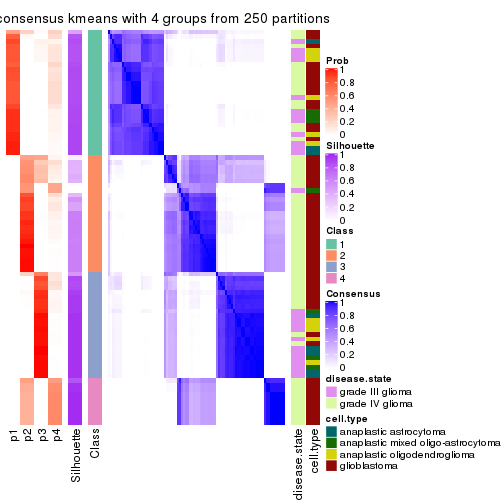</p>

</div>
<div id='tab-ATC-kmeans-consensus-heatmap-4'>
<pre><code class="r">consensus_heatmap(res, k = 5)
</code></pre>

<p></p>

</div>
<div id='tab-ATC-kmeans-consensus-heatmap-5'>
<pre><code class="r">consensus_heatmap(res, k = 6)
</code></pre>

<p></p>

</div>
</div>

Heatmaps for the membership of samples in all partitions to see how consistent they are:


<script>
$( function() {
	$( '#tabs-ATC-kmeans-membership-heatmap' ).tabs();
} );
</script>
<div id='tabs-ATC-kmeans-membership-heatmap'>
<ul>
<li><a href='#tab-ATC-kmeans-membership-heatmap-1'>k = 2</a></li>
<li><a href='#tab-ATC-kmeans-membership-heatmap-2'>k = 3</a></li>
<li><a href='#tab-ATC-kmeans-membership-heatmap-3'>k = 4</a></li>
<li><a href='#tab-ATC-kmeans-membership-heatmap-4'>k = 5</a></li>
<li><a href='#tab-ATC-kmeans-membership-heatmap-5'>k = 6</a></li>
</ul>
<div id='tab-ATC-kmeans-membership-heatmap-1'>
<pre><code class="r">membership_heatmap(res, k = 2)
</code></pre>

<p></p>

</div>
<div id='tab-ATC-kmeans-membership-heatmap-2'>
<pre><code class="r">membership_heatmap(res, k = 3)
</code></pre>

<p></p>

</div>
<div id='tab-ATC-kmeans-membership-heatmap-3'>
<pre><code class="r">membership_heatmap(res, k = 4)
</code></pre>

<p></p>

</div>
<div id='tab-ATC-kmeans-membership-heatmap-4'>
<pre><code class="r">membership_heatmap(res, k = 5)
</code></pre>

<p></p>

</div>
<div id='tab-ATC-kmeans-membership-heatmap-5'>
<pre><code class="r">membership_heatmap(res, k = 6)
</code></pre>

<p></p>

</div>
</div>

As soon as we have had the classes for columns, we can look for signatures
which are significantly different between classes which can be candidate marks
for certain classes. Following are the heatmaps for signatures.


Signature heatmaps where rows are scaled:


<script>
$( function() {
	$( '#tabs-ATC-kmeans-get-signatures' ).tabs();
} );
</script>
<div id='tabs-ATC-kmeans-get-signatures'>
<ul>
<li><a href='#tab-ATC-kmeans-get-signatures-1'>k = 2</a></li>
<li><a href='#tab-ATC-kmeans-get-signatures-2'>k = 3</a></li>
<li><a href='#tab-ATC-kmeans-get-signatures-3'>k = 4</a></li>
<li><a href='#tab-ATC-kmeans-get-signatures-4'>k = 5</a></li>
<li><a href='#tab-ATC-kmeans-get-signatures-5'>k = 6</a></li>
</ul>
<div id='tab-ATC-kmeans-get-signatures-1'>
<pre><code class="r">get_signatures(res, k = 2)
</code></pre>

<p>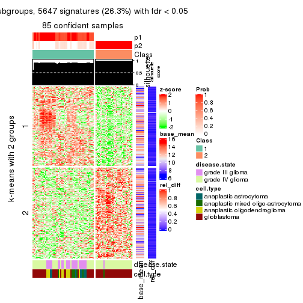</p>

</div>
<div id='tab-ATC-kmeans-get-signatures-2'>
<pre><code class="r">get_signatures(res, k = 3)
</code></pre>

<p></p>

</div>
<div id='tab-ATC-kmeans-get-signatures-3'>
<pre><code class="r">get_signatures(res, k = 4)
</code></pre>

<p></p>

</div>
<div id='tab-ATC-kmeans-get-signatures-4'>
<pre><code class="r">get_signatures(res, k = 5)
</code></pre>

<p></p>

</div>
<div id='tab-ATC-kmeans-get-signatures-5'>
<pre><code class="r">get_signatures(res, k = 6)
</code></pre>

<p></p>

</div>
</div>


Signature heatmaps where rows are not scaled:


<script>
$( function() {
	$( '#tabs-ATC-kmeans-get-signatures-no-scale' ).tabs();
} );
</script>
<div id='tabs-ATC-kmeans-get-signatures-no-scale'>
<ul>
<li><a href='#tab-ATC-kmeans-get-signatures-no-scale-1'>k = 2</a></li>
<li><a href='#tab-ATC-kmeans-get-signatures-no-scale-2'>k = 3</a></li>
<li><a href='#tab-ATC-kmeans-get-signatures-no-scale-3'>k = 4</a></li>
<li><a href='#tab-ATC-kmeans-get-signatures-no-scale-4'>k = 5</a></li>
<li><a href='#tab-ATC-kmeans-get-signatures-no-scale-5'>k = 6</a></li>
</ul>
<div id='tab-ATC-kmeans-get-signatures-no-scale-1'>
<pre><code class="r">get_signatures(res, k = 2, scale_rows = FALSE)
</code></pre>

<p></p>

</div>
<div id='tab-ATC-kmeans-get-signatures-no-scale-2'>
<pre><code class="r">get_signatures(res, k = 3, scale_rows = FALSE)
</code></pre>

<p></p>

</div>
<div id='tab-ATC-kmeans-get-signatures-no-scale-3'>
<pre><code class="r">get_signatures(res, k = 4, scale_rows = FALSE)
</code></pre>

<p></p>

</div>
<div id='tab-ATC-kmeans-get-signatures-no-scale-4'>
<pre><code class="r">get_signatures(res, k = 5, scale_rows = FALSE)
</code></pre>

<p></p>

</div>
<div id='tab-ATC-kmeans-get-signatures-no-scale-5'>
<pre><code class="r">get_signatures(res, k = 6, scale_rows = FALSE)
</code></pre>

<p></p>

</div>
</div>


Compare the overlap of signatures from different k:

```r
compare_signatures(res)
```


`get_signature()` returns a data frame invisibly. TO get the list of signatures, the function
call should be assigned to a variable explicitly. In following code, if `plot` argument is set
to `FALSE`, no heatmap is plotted while only the differential analysis is performed.

```r
# code only for demonstration
tb = get_signature(res, k = ..., plot = FALSE)
```

An example of the output of `tb` is:

```
#>   which_row         fdr    mean_1    mean_2 scaled_mean_1 scaled_mean_2 km
#> 1        38 0.042760348  8.373488  9.131774    -0.5533452     0.5164555  1
#> 2        40 0.018707592  7.106213  8.469186    -0.6173731     0.5762149  1
#> 3        55 0.019134737 10.221463 11.207825    -0.6159697     0.5749050  1
#> 4        59 0.006059896  5.921854  7.869574    -0.6899429     0.6439467  1
#> 5        60 0.018055526  8.928898 10.211722    -0.6204761     0.5791110  1
#> 6        98 0.009384629 15.714769 14.887706     0.6635654    -0.6193277  2
...
```

The columns in `tb` are:

1. `which_row`: row indices corresponding to the input matrix.
2. `fdr`: FDR for the differential test. 
3. `mean_x`: The mean value in group x.
4. `scaled_mean_x`: The mean value in group x after rows are scaled.
5. `km`: Row groups if k-means clustering is applied to rows.


UMAP plot which shows how samples are separated.


<script>
$( function() {
	$( '#tabs-ATC-kmeans-dimension-reduction' ).tabs();
} );
</script>
<div id='tabs-ATC-kmeans-dimension-reduction'>
<ul>
<li><a href='#tab-ATC-kmeans-dimension-reduction-1'>k = 2</a></li>
<li><a href='#tab-ATC-kmeans-dimension-reduction-2'>k = 3</a></li>
<li><a href='#tab-ATC-kmeans-dimension-reduction-3'>k = 4</a></li>
<li><a href='#tab-ATC-kmeans-dimension-reduction-4'>k = 5</a></li>
<li><a href='#tab-ATC-kmeans-dimension-reduction-5'>k = 6</a></li>
</ul>
<div id='tab-ATC-kmeans-dimension-reduction-1'>
<pre><code class="r">dimension_reduction(res, k = 2, method = &quot;UMAP&quot;)
</code></pre>

<p></p>

</div>
<div id='tab-ATC-kmeans-dimension-reduction-2'>
<pre><code class="r">dimension_reduction(res, k = 3, method = &quot;UMAP&quot;)
</code></pre>

<p></p>

</div>
<div id='tab-ATC-kmeans-dimension-reduction-3'>
<pre><code class="r">dimension_reduction(res, k = 4, method = &quot;UMAP&quot;)
</code></pre>

<p></p>

</div>
<div id='tab-ATC-kmeans-dimension-reduction-4'>
<pre><code class="r">dimension_reduction(res, k = 5, method = &quot;UMAP&quot;)
</code></pre>

<p></p>

</div>
<div id='tab-ATC-kmeans-dimension-reduction-5'>
<pre><code class="r">dimension_reduction(res, k = 6, method = &quot;UMAP&quot;)
</code></pre>

<p></p>

</div>
</div>


Following heatmap shows how subgroups are split when increasing `k`:

```r
collect_classes(res)
```


Test correlation between subgroups and known annotations. If the known
annotation is numeric, one-way ANOVA test is applied, and if the known
annotation is discrete, chi-squared contingency table test is applied.

```r
test_to_known_factors(res)
```

```
#>             n disease.state(p) cell.type(p) k
#> ATC:kmeans 85         5.65e-05     3.19e-04 2
#> ATC:kmeans 85         4.83e-04     1.10e-02 3
#> ATC:kmeans 73         2.48e-04     1.77e-02 4
#> ATC:kmeans 63         4.04e-06     1.50e-06 5
#> ATC:kmeans 52         5.13e-07     7.59e-05 6
```


If matrix rows can be associated to genes, consider to use `GO_Enrichment(res,
...)` to perform function enrichment for the signature genes.


 

---------------------------------------------------


### ATC:skmeans**


The object with results only for a single top-value method and a single partition method 
can be extracted as:

```r
res = res_list["ATC", "skmeans"]
# you can also extract it by
# res = res_list["ATC:skmeans"]
```

A summary of `res` and all the functions that can be applied to it:

```r
res
```

```
#> A 'ConsensusPartition' object with k = 2, 3, 4, 5, 6.
#>   On a matrix with 21512 rows and 85 columns.
#>   Top rows (1000, 2000, 3000, 4000, 5000) are extracted by 'ATC' method.
#>   Subgroups are detected by 'skmeans' method.
#>   Performed in total 1250 partitions by row resampling.
#>   Best k for subgroups seems to be 3.
#> 
#> Following methods can be applied to this 'ConsensusPartition' object:
#>  [1] "cola_report"             "collect_classes"         "collect_plots"          
#>  [4] "collect_stats"           "colnames"                "compare_signatures"     
#>  [7] "consensus_heatmap"       "dimension_reduction"     "functional_enrichment"  
#> [10] "get_anno_col"            "get_anno"                "get_classes"            
#> [13] "get_consensus"           "get_matrix"              "get_membership"         
#> [16] "get_param"               "get_signatures"          "get_stats"              
#> [19] "is_best_k"               "is_stable_k"             "membership_heatmap"     
#> [22] "ncol"                    "nrow"                    "plot_ecdf"              
#> [25] "rownames"                "select_partition_number" "show"                   
#> [28] "suggest_best_k"          "test_to_known_factors"
```

`collect_plots()` function collects all the plots made from `res` for all `k` (number of partitions)
into one single page to provide an easy and fast comparison between different `k`.

```r
collect_plots(res)
```


The plots are:

- The first row: a plot of the ECDF (Empirical cumulative distribution
  function) curves of the consensus matrix for each `k` and the heatmap of
  predicted classes for each `k`.
- The second row: heatmaps of the consensus matrix for each `k`.
- The third row: heatmaps of the membership matrix for each `k`.
- The fouth row: heatmaps of the signatures for each `k`.

All the plots in panels can be made by individual functions and they are
plotted later in this section.

`select_partition_number()` produces several plots showing different
statistics for choosing "optimized" `k`. There are following statistics:

- ECDF curves of the consensus matrix for each `k`;
- 1-PAC. [The PAC
  score](https://en.wikipedia.org/wiki/Consensus_clustering#Over-interpretation_potential_of_consensus_clustering)
  measures the proportion of the ambiguous subgrouping.
- Mean silhouette score.
- Concordance. The mean probability of fiting the consensus class ids in all
  partitions.
- Area increased. Denote $A_k$ as the area under the ECDF curve for current
  `k`, the area increased is defined as $A_k - A_{k-1}$.
- Rand index. The percent of pairs of samples that are both in a same cluster
  or both are not in a same cluster in the partition of k and k-1.
- Jaccard index. The ratio of pairs of samples are both in a same cluster in
  the partition of k and k-1 and the pairs of samples are both in a same
  cluster in the partition k or k-1.

The detailed explanations of these statistics can be found in [the cola
vignette](http://bioconductor.org/packages/devel/bioc/vignettes/cola/inst/doc/cola.html#toc_13).

Generally speaking, lower PAC score, higher mean silhouette score or higher
concordance corresponds to better partition. Rand index and Jaccard index
measure how similar the current partition is compared to partition with `k-1`.
If they are too similar, we won't accept `k` is better than `k-1`.

```r
select_partition_number(res)
```

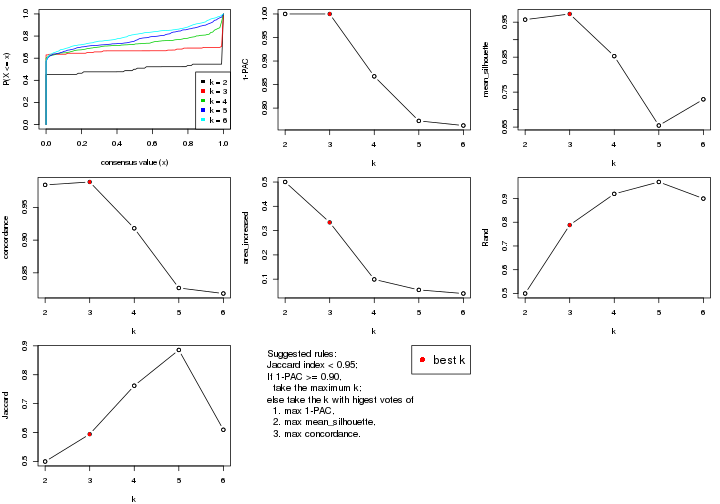

The numeric values for all these statistics can be obtained by `get_stats()`.

```r
get_stats(res)
```

```
#>   k 1-PAC mean_silhouette concordance area_increased  Rand Jaccard
#> 2 2 1.000           0.957       0.984         0.5003 0.500   0.500
#> 3 3 1.000           0.973       0.989         0.3338 0.788   0.594
#> 4 4 0.867           0.853       0.918         0.0990 0.920   0.762
#> 5 5 0.773           0.655       0.827         0.0558 0.970   0.886
#> 6 6 0.763           0.729       0.818         0.0410 0.900   0.610
```

`suggest_best_k()` suggests the best $k$ based on these statistics. The rules are as follows:

- All $k$ with Jaccard index larger than 0.95 are removed because the increase of
  the partition number does not provides enough extra information. If all $k$ are removed,
  the best $k$ is assigned by `NA`.
- For $k$ with 1-PAC larger than 0.9, the maximal $k$ is taken as the "best k". Other $k$ is called "optional k".
- If it does not fit the second rule. The $k$ with the highest vote of highest
  1-PAC, mean silhouette and concordance is taken as the "best k".

```r
suggest_best_k(res)
```

```
#> [1] 3
#> attr(,"optional")
#> [1] 2
```

There is also optional best $k$ = 2 that is worth to check.

Following shows the table of the partitions (You need to click the **show/hide
code output** link to see it). The membership matrix (columns with name `p*`)
is inferred by
[`clue::cl_consensus()`](https://www.rdocumentation.org/link/cl_consensus?package=clue)
function with the `SE` method. Basically the value in the membership matrix
represents the probability to belong to a certain group. The finall class
label for an item is determined with the group with highest probability it
belongs to.

In `get_classes()` function, the entropy is calculated from the membership
matrix and the silhouette score is calculated from the consensus matrix.


<script>
$( function() {
	$( '#tabs-ATC-skmeans-get-classes' ).tabs();
} );
</script>
<div id='tabs-ATC-skmeans-get-classes'>
<ul>
<li><a href='#tab-ATC-skmeans-get-classes-1'>k = 2</a></li>
<li><a href='#tab-ATC-skmeans-get-classes-2'>k = 3</a></li>
<li><a href='#tab-ATC-skmeans-get-classes-3'>k = 4</a></li>
<li><a href='#tab-ATC-skmeans-get-classes-4'>k = 5</a></li>
<li><a href='#tab-ATC-skmeans-get-classes-5'>k = 6</a></li>
</ul>

<div id='tab-ATC-skmeans-get-classes-1'>
<p><a id='tab-ATC-skmeans-get-classes-1-a' style='color:#0366d6' href='#'>show/hide code output</a></p>
<pre><code class="r">cbind(get_classes(res, k = 2), get_membership(res, k = 2))
</code></pre>

<pre><code>#&gt;          class entropy silhouette    p1    p2
#&gt; GSM99497     1   0.000     0.9861 1.000 0.000
#&gt; GSM99503     1   0.000     0.9861 1.000 0.000
#&gt; GSM99505     1   0.000     0.9861 1.000 0.000
#&gt; GSM99507     1   0.000     0.9861 1.000 0.000
#&gt; GSM99567     1   0.000     0.9861 1.000 0.000
#&gt; GSM99575     1   0.000     0.9861 1.000 0.000
#&gt; GSM99593     1   0.991     0.1710 0.556 0.444
#&gt; GSM99595     1   0.000     0.9861 1.000 0.000
#&gt; GSM99469     1   0.000     0.9861 1.000 0.000
#&gt; GSM99499     1   0.000     0.9861 1.000 0.000
#&gt; GSM99501     1   0.000     0.9861 1.000 0.000
#&gt; GSM99509     1   0.000     0.9861 1.000 0.000
#&gt; GSM99569     1   0.000     0.9861 1.000 0.000
#&gt; GSM99597     1   0.000     0.9861 1.000 0.000
#&gt; GSM99601     2   0.000     0.9806 0.000 1.000
#&gt; GSM99459     1   0.000     0.9861 1.000 0.000
#&gt; GSM99461     1   0.000     0.9861 1.000 0.000
#&gt; GSM99511     1   0.000     0.9861 1.000 0.000
#&gt; GSM99513     1   0.000     0.9861 1.000 0.000
#&gt; GSM99515     1   0.000     0.9861 1.000 0.000
#&gt; GSM99517     1   0.000     0.9861 1.000 0.000
#&gt; GSM99519     1   0.000     0.9861 1.000 0.000
#&gt; GSM99521     1   0.000     0.9861 1.000 0.000
#&gt; GSM99523     1   0.000     0.9861 1.000 0.000
#&gt; GSM99571     1   0.000     0.9861 1.000 0.000
#&gt; GSM99599     1   0.000     0.9861 1.000 0.000
#&gt; GSM99433     2   0.000     0.9806 0.000 1.000
#&gt; GSM99435     2   0.745     0.7228 0.212 0.788
#&gt; GSM99437     2   0.000     0.9806 0.000 1.000
#&gt; GSM99439     2   0.000     0.9806 0.000 1.000
#&gt; GSM99441     1   0.000     0.9861 1.000 0.000
#&gt; GSM99443     2   0.000     0.9806 0.000 1.000
#&gt; GSM99445     2   0.000     0.9806 0.000 1.000
#&gt; GSM99447     2   0.000     0.9806 0.000 1.000
#&gt; GSM99449     2   0.000     0.9806 0.000 1.000
#&gt; GSM99451     1   0.000     0.9861 1.000 0.000
#&gt; GSM99453     1   0.000     0.9861 1.000 0.000
#&gt; GSM99455     1   0.000     0.9861 1.000 0.000
#&gt; GSM99457     1   0.000     0.9861 1.000 0.000
#&gt; GSM99463     2   0.000     0.9806 0.000 1.000
#&gt; GSM99465     1   0.000     0.9861 1.000 0.000
#&gt; GSM99467     2   0.000     0.9806 0.000 1.000
#&gt; GSM99471     1   0.671     0.7774 0.824 0.176
#&gt; GSM99473     1   0.000     0.9861 1.000 0.000
#&gt; GSM99475     1   0.000     0.9861 1.000 0.000
#&gt; GSM99477     2   0.000     0.9806 0.000 1.000
#&gt; GSM99479     2   0.000     0.9806 0.000 1.000
#&gt; GSM99481     1   0.000     0.9861 1.000 0.000
#&gt; GSM99483     1   0.000     0.9861 1.000 0.000
#&gt; GSM99485     2   0.000     0.9806 0.000 1.000
#&gt; GSM99487     2   0.000     0.9806 0.000 1.000
#&gt; GSM99489     2   0.000     0.9806 0.000 1.000
#&gt; GSM99491     2   0.000     0.9806 0.000 1.000
#&gt; GSM99493     1   0.000     0.9861 1.000 0.000
#&gt; GSM99495     2   0.000     0.9806 0.000 1.000
#&gt; GSM99525     1   0.000     0.9861 1.000 0.000
#&gt; GSM99527     2   0.000     0.9806 0.000 1.000
#&gt; GSM99529     2   0.000     0.9806 0.000 1.000
#&gt; GSM99531     1   0.000     0.9861 1.000 0.000
#&gt; GSM99533     1   0.000     0.9861 1.000 0.000
#&gt; GSM99535     2   0.000     0.9806 0.000 1.000
#&gt; GSM99537     1   0.000     0.9861 1.000 0.000
#&gt; GSM99539     2   0.000     0.9806 0.000 1.000
#&gt; GSM99541     1   0.000     0.9861 1.000 0.000
#&gt; GSM99543     2   0.000     0.9806 0.000 1.000
#&gt; GSM99545     2   0.000     0.9806 0.000 1.000
#&gt; GSM99547     2   0.000     0.9806 0.000 1.000
#&gt; GSM99549     2   0.000     0.9806 0.000 1.000
#&gt; GSM99551     1   0.000     0.9861 1.000 0.000
#&gt; GSM99553     2   1.000     0.0234 0.492 0.508
#&gt; GSM99555     2   0.000     0.9806 0.000 1.000
#&gt; GSM99557     2   0.000     0.9806 0.000 1.000
#&gt; GSM99559     2   0.000     0.9806 0.000 1.000
#&gt; GSM99561     2   0.000     0.9806 0.000 1.000
#&gt; GSM99563     1   0.000     0.9861 1.000 0.000
#&gt; GSM99565     2   0.000     0.9806 0.000 1.000
#&gt; GSM99573     2   0.000     0.9806 0.000 1.000
#&gt; GSM99577     1   0.000     0.9861 1.000 0.000
#&gt; GSM99579     2   0.000     0.9806 0.000 1.000
#&gt; GSM99581     1   0.000     0.9861 1.000 0.000
#&gt; GSM99583     2   0.000     0.9806 0.000 1.000
#&gt; GSM99585     2   0.000     0.9806 0.000 1.000
#&gt; GSM99587     1   0.000     0.9861 1.000 0.000
#&gt; GSM99589     2   0.000     0.9806 0.000 1.000
#&gt; GSM99591     2   0.000     0.9806 0.000 1.000
</code></pre>

<script>
$('#tab-ATC-skmeans-get-classes-1-a').parent().next().next().hide();
$('#tab-ATC-skmeans-get-classes-1-a').click(function(){
  $('#tab-ATC-skmeans-get-classes-1-a').parent().next().next().toggle();
  return(false);
});
</script>
</div>

<div id='tab-ATC-skmeans-get-classes-2'>
<p><a id='tab-ATC-skmeans-get-classes-2-a' style='color:#0366d6' href='#'>show/hide code output</a></p>
<pre><code class="r">cbind(get_classes(res, k = 3), get_membership(res, k = 3))
</code></pre>

<pre><code>#&gt;          class entropy silhouette p1    p2    p3
#&gt; GSM99497     3  0.0000      0.980  0 0.000 1.000
#&gt; GSM99503     1  0.0000      1.000  1 0.000 0.000
#&gt; GSM99505     1  0.0000      1.000  1 0.000 0.000
#&gt; GSM99507     3  0.0000      0.980  0 0.000 1.000
#&gt; GSM99567     3  0.0000      0.980  0 0.000 1.000
#&gt; GSM99575     1  0.0000      1.000  1 0.000 0.000
#&gt; GSM99593     3  0.0000      0.980  0 0.000 1.000
#&gt; GSM99595     3  0.0000      0.980  0 0.000 1.000
#&gt; GSM99469     1  0.0000      1.000  1 0.000 0.000
#&gt; GSM99499     1  0.0000      1.000  1 0.000 0.000
#&gt; GSM99501     1  0.0000      1.000  1 0.000 0.000
#&gt; GSM99509     3  0.0000      0.980  0 0.000 1.000
#&gt; GSM99569     3  0.0000      0.980  0 0.000 1.000
#&gt; GSM99597     3  0.0000      0.980  0 0.000 1.000
#&gt; GSM99601     2  0.0000      0.984  0 1.000 0.000
#&gt; GSM99459     1  0.0000      1.000  1 0.000 0.000
#&gt; GSM99461     1  0.0000      1.000  1 0.000 0.000
#&gt; GSM99511     3  0.0000      0.980  0 0.000 1.000
#&gt; GSM99513     3  0.0000      0.980  0 0.000 1.000
#&gt; GSM99515     3  0.0000      0.980  0 0.000 1.000
#&gt; GSM99517     1  0.0000      1.000  1 0.000 0.000
#&gt; GSM99519     1  0.0000      1.000  1 0.000 0.000
#&gt; GSM99521     3  0.0000      0.980  0 0.000 1.000
#&gt; GSM99523     3  0.0000      0.980  0 0.000 1.000
#&gt; GSM99571     1  0.0000      1.000  1 0.000 0.000
#&gt; GSM99599     1  0.0000      1.000  1 0.000 0.000
#&gt; GSM99433     2  0.0000      0.984  0 1.000 0.000
#&gt; GSM99435     3  0.0000      0.980  0 0.000 1.000
#&gt; GSM99437     2  0.0000      0.984  0 1.000 0.000
#&gt; GSM99439     2  0.0000      0.984  0 1.000 0.000
#&gt; GSM99441     1  0.0000      1.000  1 0.000 0.000
#&gt; GSM99443     2  0.0000      0.984  0 1.000 0.000
#&gt; GSM99445     2  0.0000      0.984  0 1.000 0.000
#&gt; GSM99447     2  0.0000      0.984  0 1.000 0.000
#&gt; GSM99449     3  0.5706      0.523  0 0.320 0.680
#&gt; GSM99451     3  0.0000      0.980  0 0.000 1.000
#&gt; GSM99453     1  0.0000      1.000  1 0.000 0.000
#&gt; GSM99455     1  0.0000      1.000  1 0.000 0.000
#&gt; GSM99457     1  0.0000      1.000  1 0.000 0.000
#&gt; GSM99463     2  0.0000      0.984  0 1.000 0.000
#&gt; GSM99465     3  0.0000      0.980  0 0.000 1.000
#&gt; GSM99467     2  0.0000      0.984  0 1.000 0.000
#&gt; GSM99471     1  0.0000      1.000  1 0.000 0.000
#&gt; GSM99473     1  0.0000      1.000  1 0.000 0.000
#&gt; GSM99475     3  0.0000      0.980  0 0.000 1.000
#&gt; GSM99477     2  0.5327      0.624  0 0.728 0.272
#&gt; GSM99479     2  0.0000      0.984  0 1.000 0.000
#&gt; GSM99481     1  0.0000      1.000  1 0.000 0.000
#&gt; GSM99483     1  0.0000      1.000  1 0.000 0.000
#&gt; GSM99485     2  0.0000      0.984  0 1.000 0.000
#&gt; GSM99487     2  0.0000      0.984  0 1.000 0.000
#&gt; GSM99489     2  0.0000      0.984  0 1.000 0.000
#&gt; GSM99491     2  0.0000      0.984  0 1.000 0.000
#&gt; GSM99493     1  0.0000      1.000  1 0.000 0.000
#&gt; GSM99495     2  0.0000      0.984  0 1.000 0.000
#&gt; GSM99525     1  0.0000      1.000  1 0.000 0.000
#&gt; GSM99527     3  0.3267      0.860  0 0.116 0.884
#&gt; GSM99529     2  0.0592      0.973  0 0.988 0.012
#&gt; GSM99531     3  0.0000      0.980  0 0.000 1.000
#&gt; GSM99533     3  0.0000      0.980  0 0.000 1.000
#&gt; GSM99535     2  0.0000      0.984  0 1.000 0.000
#&gt; GSM99537     1  0.0000      1.000  1 0.000 0.000
#&gt; GSM99539     2  0.0000      0.984  0 1.000 0.000
#&gt; GSM99541     1  0.0000      1.000  1 0.000 0.000
#&gt; GSM99543     2  0.0000      0.984  0 1.000 0.000
#&gt; GSM99545     2  0.0000      0.984  0 1.000 0.000
#&gt; GSM99547     2  0.0000      0.984  0 1.000 0.000
#&gt; GSM99549     2  0.0000      0.984  0 1.000 0.000
#&gt; GSM99551     1  0.0000      1.000  1 0.000 0.000
#&gt; GSM99553     3  0.0000      0.980  0 0.000 1.000
#&gt; GSM99555     2  0.0000      0.984  0 1.000 0.000
#&gt; GSM99557     2  0.0000      0.984  0 1.000 0.000
#&gt; GSM99559     2  0.4842      0.708  0 0.776 0.224
#&gt; GSM99561     2  0.0000      0.984  0 1.000 0.000
#&gt; GSM99563     3  0.0000      0.980  0 0.000 1.000
#&gt; GSM99565     2  0.0000      0.984  0 1.000 0.000
#&gt; GSM99573     2  0.0000      0.984  0 1.000 0.000
#&gt; GSM99577     1  0.0000      1.000  1 0.000 0.000
#&gt; GSM99579     2  0.0000      0.984  0 1.000 0.000
#&gt; GSM99581     3  0.0000      0.980  0 0.000 1.000
#&gt; GSM99583     2  0.0000      0.984  0 1.000 0.000
#&gt; GSM99585     2  0.0000      0.984  0 1.000 0.000
#&gt; GSM99587     1  0.0000      1.000  1 0.000 0.000
#&gt; GSM99589     2  0.0000      0.984  0 1.000 0.000
#&gt; GSM99591     2  0.0000      0.984  0 1.000 0.000
</code></pre>

<script>
$('#tab-ATC-skmeans-get-classes-2-a').parent().next().next().hide();
$('#tab-ATC-skmeans-get-classes-2-a').click(function(){
  $('#tab-ATC-skmeans-get-classes-2-a').parent().next().next().toggle();
  return(false);
});
</script>
</div>

<div id='tab-ATC-skmeans-get-classes-3'>
<p><a id='tab-ATC-skmeans-get-classes-3-a' style='color:#0366d6' href='#'>show/hide code output</a></p>
<pre><code class="r">cbind(get_classes(res, k = 4), get_membership(res, k = 4))
</code></pre>

<pre><code>#&gt;          class entropy silhouette    p1    p2    p3    p4
#&gt; GSM99497     3  0.0000   0.934364 0.000 0.000 1.000 0.000
#&gt; GSM99503     1  0.0000   0.983424 1.000 0.000 0.000 0.000
#&gt; GSM99505     1  0.0000   0.983424 1.000 0.000 0.000 0.000
#&gt; GSM99507     3  0.0000   0.934364 0.000 0.000 1.000 0.000
#&gt; GSM99567     3  0.0000   0.934364 0.000 0.000 1.000 0.000
#&gt; GSM99575     1  0.0000   0.983424 1.000 0.000 0.000 0.000
#&gt; GSM99593     3  0.1022   0.925997 0.000 0.000 0.968 0.032
#&gt; GSM99595     3  0.0000   0.934364 0.000 0.000 1.000 0.000
#&gt; GSM99469     1  0.0000   0.983424 1.000 0.000 0.000 0.000
#&gt; GSM99499     1  0.0000   0.983424 1.000 0.000 0.000 0.000
#&gt; GSM99501     1  0.0000   0.983424 1.000 0.000 0.000 0.000
#&gt; GSM99509     3  0.0000   0.934364 0.000 0.000 1.000 0.000
#&gt; GSM99569     3  0.0000   0.934364 0.000 0.000 1.000 0.000
#&gt; GSM99597     3  0.0000   0.934364 0.000 0.000 1.000 0.000
#&gt; GSM99601     2  0.0469   0.895333 0.000 0.988 0.000 0.012
#&gt; GSM99459     1  0.1637   0.945825 0.940 0.000 0.000 0.060
#&gt; GSM99461     1  0.1637   0.945825 0.940 0.000 0.000 0.060
#&gt; GSM99511     3  0.0592   0.930958 0.000 0.000 0.984 0.016
#&gt; GSM99513     3  0.0188   0.933708 0.000 0.000 0.996 0.004
#&gt; GSM99515     3  0.0000   0.934364 0.000 0.000 1.000 0.000
#&gt; GSM99517     1  0.0000   0.983424 1.000 0.000 0.000 0.000
#&gt; GSM99519     1  0.1637   0.945825 0.940 0.000 0.000 0.060
#&gt; GSM99521     3  0.1022   0.925905 0.000 0.000 0.968 0.032
#&gt; GSM99523     3  0.0000   0.934364 0.000 0.000 1.000 0.000
#&gt; GSM99571     1  0.0707   0.981914 0.980 0.000 0.000 0.020
#&gt; GSM99599     1  0.0000   0.983424 1.000 0.000 0.000 0.000
#&gt; GSM99433     4  0.5000   0.285241 0.000 0.500 0.000 0.500
#&gt; GSM99435     3  0.4250   0.755971 0.000 0.000 0.724 0.276
#&gt; GSM99437     2  0.4877   0.019373 0.000 0.592 0.000 0.408
#&gt; GSM99439     2  0.0000   0.896566 0.000 1.000 0.000 0.000
#&gt; GSM99441     1  0.0000   0.983424 1.000 0.000 0.000 0.000
#&gt; GSM99443     2  0.0707   0.893021 0.000 0.980 0.000 0.020
#&gt; GSM99445     2  0.0707   0.893021 0.000 0.980 0.000 0.020
#&gt; GSM99447     2  0.1557   0.857539 0.000 0.944 0.000 0.056
#&gt; GSM99449     4  0.5807   0.707054 0.000 0.132 0.160 0.708
#&gt; GSM99451     3  0.3610   0.834551 0.000 0.000 0.800 0.200
#&gt; GSM99453     1  0.0707   0.981914 0.980 0.000 0.000 0.020
#&gt; GSM99455     1  0.0707   0.981914 0.980 0.000 0.000 0.020
#&gt; GSM99457     1  0.0707   0.981914 0.980 0.000 0.000 0.020
#&gt; GSM99463     2  0.0000   0.896566 0.000 1.000 0.000 0.000
#&gt; GSM99465     3  0.3975   0.800406 0.000 0.000 0.760 0.240
#&gt; GSM99467     4  0.4431   0.707632 0.000 0.304 0.000 0.696
#&gt; GSM99471     1  0.1004   0.978134 0.972 0.004 0.000 0.024
#&gt; GSM99473     1  0.0000   0.983424 1.000 0.000 0.000 0.000
#&gt; GSM99475     3  0.3444   0.847521 0.000 0.000 0.816 0.184
#&gt; GSM99477     4  0.3934   0.740312 0.000 0.116 0.048 0.836
#&gt; GSM99479     4  0.4431   0.707632 0.000 0.304 0.000 0.696
#&gt; GSM99481     1  0.0000   0.983424 1.000 0.000 0.000 0.000
#&gt; GSM99483     1  0.0707   0.981914 0.980 0.000 0.000 0.020
#&gt; GSM99485     2  0.0592   0.894112 0.000 0.984 0.000 0.016
#&gt; GSM99487     2  0.4888  -0.000567 0.000 0.588 0.000 0.412
#&gt; GSM99489     2  0.0000   0.896566 0.000 1.000 0.000 0.000
#&gt; GSM99491     2  0.1940   0.848498 0.000 0.924 0.000 0.076
#&gt; GSM99493     1  0.0707   0.981914 0.980 0.000 0.000 0.020
#&gt; GSM99495     2  0.0000   0.896566 0.000 1.000 0.000 0.000
#&gt; GSM99525     1  0.0707   0.981914 0.980 0.000 0.000 0.020
#&gt; GSM99527     4  0.4248   0.409290 0.000 0.012 0.220 0.768
#&gt; GSM99529     4  0.4776   0.673151 0.000 0.272 0.016 0.712
#&gt; GSM99531     3  0.2921   0.870215 0.000 0.000 0.860 0.140
#&gt; GSM99533     3  0.3907   0.814073 0.000 0.000 0.768 0.232
#&gt; GSM99535     2  0.0188   0.894186 0.000 0.996 0.000 0.004
#&gt; GSM99537     1  0.0000   0.983424 1.000 0.000 0.000 0.000
#&gt; GSM99539     2  0.3074   0.747301 0.000 0.848 0.000 0.152
#&gt; GSM99541     1  0.1867   0.935830 0.928 0.000 0.000 0.072
#&gt; GSM99543     2  0.0188   0.894186 0.000 0.996 0.000 0.004
#&gt; GSM99545     2  0.0000   0.896566 0.000 1.000 0.000 0.000
#&gt; GSM99547     4  0.3837   0.738610 0.000 0.224 0.000 0.776
#&gt; GSM99549     2  0.0000   0.896566 0.000 1.000 0.000 0.000
#&gt; GSM99551     1  0.0707   0.981914 0.980 0.000 0.000 0.020
#&gt; GSM99553     3  0.3172   0.793235 0.000 0.000 0.840 0.160
#&gt; GSM99555     2  0.1389   0.862366 0.000 0.952 0.000 0.048
#&gt; GSM99557     2  0.0000   0.896566 0.000 1.000 0.000 0.000
#&gt; GSM99559     4  0.5787   0.741843 0.000 0.244 0.076 0.680
#&gt; GSM99561     2  0.1302   0.877285 0.000 0.956 0.000 0.044
#&gt; GSM99563     3  0.0000   0.934364 0.000 0.000 1.000 0.000
#&gt; GSM99565     2  0.4866   0.036811 0.000 0.596 0.000 0.404
#&gt; GSM99573     2  0.0000   0.896566 0.000 1.000 0.000 0.000
#&gt; GSM99577     1  0.0707   0.981914 0.980 0.000 0.000 0.020
#&gt; GSM99579     2  0.1637   0.863985 0.000 0.940 0.000 0.060
#&gt; GSM99581     3  0.0469   0.932284 0.000 0.000 0.988 0.012
#&gt; GSM99583     4  0.3208   0.746909 0.000 0.148 0.004 0.848
#&gt; GSM99585     4  0.4907   0.519557 0.000 0.420 0.000 0.580
#&gt; GSM99587     1  0.0707   0.981914 0.980 0.000 0.000 0.020
#&gt; GSM99589     2  0.0000   0.896566 0.000 1.000 0.000 0.000
#&gt; GSM99591     2  0.0707   0.893021 0.000 0.980 0.000 0.020
</code></pre>

<script>
$('#tab-ATC-skmeans-get-classes-3-a').parent().next().next().hide();
$('#tab-ATC-skmeans-get-classes-3-a').click(function(){
  $('#tab-ATC-skmeans-get-classes-3-a').parent().next().next().toggle();
  return(false);
});
</script>
</div>

<div id='tab-ATC-skmeans-get-classes-4'>
<p><a id='tab-ATC-skmeans-get-classes-4-a' style='color:#0366d6' href='#'>show/hide code output</a></p>
<pre><code class="r">cbind(get_classes(res, k = 5), get_membership(res, k = 5))
</code></pre>

<pre><code>#&gt;          class entropy silhouette    p1    p2    p3    p4    p5
#&gt; GSM99497     3  0.0000     0.8471 0.000 0.000 1.000 0.000 0.000
#&gt; GSM99503     1  0.3774     0.7488 0.704 0.000 0.000 0.296 0.000
#&gt; GSM99505     1  0.4183     0.7237 0.668 0.000 0.008 0.324 0.000
#&gt; GSM99507     3  0.0000     0.8471 0.000 0.000 1.000 0.000 0.000
#&gt; GSM99567     3  0.0000     0.8471 0.000 0.000 1.000 0.000 0.000
#&gt; GSM99575     1  0.3796     0.7470 0.700 0.000 0.000 0.300 0.000
#&gt; GSM99593     3  0.2685     0.8056 0.000 0.000 0.880 0.092 0.028
#&gt; GSM99595     3  0.0162     0.8473 0.000 0.000 0.996 0.004 0.000
#&gt; GSM99469     1  0.3895     0.7330 0.680 0.000 0.000 0.320 0.000
#&gt; GSM99499     1  0.3796     0.7467 0.700 0.000 0.000 0.300 0.000
#&gt; GSM99501     1  0.3913     0.7298 0.676 0.000 0.000 0.324 0.000
#&gt; GSM99509     3  0.0000     0.8471 0.000 0.000 1.000 0.000 0.000
#&gt; GSM99569     3  0.0609     0.8464 0.000 0.000 0.980 0.020 0.000
#&gt; GSM99597     3  0.0510     0.8446 0.000 0.000 0.984 0.016 0.000
#&gt; GSM99601     2  0.0880     0.8595 0.000 0.968 0.000 0.000 0.032
#&gt; GSM99459     1  0.4307     0.4237 0.504 0.000 0.000 0.496 0.000
#&gt; GSM99461     4  0.4307    -0.5406 0.496 0.000 0.000 0.504 0.000
#&gt; GSM99511     3  0.2824     0.7999 0.000 0.000 0.864 0.116 0.020
#&gt; GSM99513     3  0.1894     0.8286 0.000 0.000 0.920 0.072 0.008
#&gt; GSM99515     3  0.0000     0.8471 0.000 0.000 1.000 0.000 0.000
#&gt; GSM99517     1  0.3774     0.7488 0.704 0.000 0.000 0.296 0.000
#&gt; GSM99519     1  0.4307     0.4132 0.500 0.000 0.000 0.500 0.000
#&gt; GSM99521     3  0.2873     0.7737 0.000 0.000 0.856 0.128 0.016
#&gt; GSM99523     3  0.0771     0.8460 0.000 0.000 0.976 0.020 0.004
#&gt; GSM99571     1  0.0162     0.7568 0.996 0.000 0.000 0.004 0.000
#&gt; GSM99599     1  0.3424     0.7667 0.760 0.000 0.000 0.240 0.000
#&gt; GSM99433     5  0.4738     0.1215 0.000 0.464 0.000 0.016 0.520
#&gt; GSM99435     3  0.6194     0.3285 0.000 0.000 0.472 0.388 0.140
#&gt; GSM99437     2  0.4557    -0.0342 0.000 0.516 0.000 0.008 0.476
#&gt; GSM99439     2  0.0000     0.8612 0.000 1.000 0.000 0.000 0.000
#&gt; GSM99441     1  0.3395     0.7676 0.764 0.000 0.000 0.236 0.000
#&gt; GSM99443     2  0.1544     0.8508 0.000 0.932 0.000 0.000 0.068
#&gt; GSM99445     2  0.1410     0.8520 0.000 0.940 0.000 0.000 0.060
#&gt; GSM99447     2  0.1478     0.8344 0.000 0.936 0.000 0.000 0.064
#&gt; GSM99449     5  0.5030     0.6312 0.000 0.064 0.144 0.044 0.748
#&gt; GSM99451     3  0.5770     0.4288 0.000 0.000 0.532 0.372 0.096
#&gt; GSM99453     1  0.0000     0.7557 1.000 0.000 0.000 0.000 0.000
#&gt; GSM99455     1  0.0000     0.7557 1.000 0.000 0.000 0.000 0.000
#&gt; GSM99457     1  0.0000     0.7557 1.000 0.000 0.000 0.000 0.000
#&gt; GSM99463     2  0.0000     0.8612 0.000 1.000 0.000 0.000 0.000
#&gt; GSM99465     4  0.4946     0.0495 0.000 0.000 0.300 0.648 0.052
#&gt; GSM99467     5  0.3053     0.7401 0.000 0.164 0.000 0.008 0.828
#&gt; GSM99471     1  0.1579     0.7053 0.944 0.000 0.000 0.024 0.032
#&gt; GSM99473     1  0.4026     0.7579 0.736 0.000 0.000 0.244 0.020
#&gt; GSM99475     3  0.5524     0.3914 0.000 0.000 0.516 0.416 0.068
#&gt; GSM99477     5  0.1949     0.7131 0.000 0.040 0.012 0.016 0.932
#&gt; GSM99479     5  0.3053     0.7401 0.000 0.164 0.000 0.008 0.828
#&gt; GSM99481     1  0.3395     0.7676 0.764 0.000 0.000 0.236 0.000
#&gt; GSM99483     1  0.0000     0.7557 1.000 0.000 0.000 0.000 0.000
#&gt; GSM99485     2  0.1704     0.8478 0.000 0.928 0.000 0.004 0.068
#&gt; GSM99487     2  0.4560    -0.0691 0.000 0.508 0.000 0.008 0.484
#&gt; GSM99489     2  0.0000     0.8612 0.000 1.000 0.000 0.000 0.000
#&gt; GSM99491     2  0.2763     0.7788 0.000 0.848 0.000 0.004 0.148
#&gt; GSM99493     1  0.0000     0.7557 1.000 0.000 0.000 0.000 0.000
#&gt; GSM99495     2  0.0000     0.8612 0.000 1.000 0.000 0.000 0.000
#&gt; GSM99525     1  0.0000     0.7557 1.000 0.000 0.000 0.000 0.000
#&gt; GSM99527     4  0.5887    -0.0847 0.000 0.004 0.100 0.552 0.344
#&gt; GSM99529     5  0.6313     0.4670 0.000 0.120 0.020 0.296 0.564
#&gt; GSM99531     3  0.5047     0.1849 0.000 0.000 0.496 0.472 0.032
#&gt; GSM99533     4  0.5066    -0.1303 0.000 0.000 0.344 0.608 0.048
#&gt; GSM99535     2  0.1444     0.8328 0.000 0.948 0.000 0.012 0.040
#&gt; GSM99537     1  0.3913     0.7298 0.676 0.000 0.000 0.324 0.000
#&gt; GSM99539     2  0.4163     0.6433 0.000 0.740 0.000 0.032 0.228
#&gt; GSM99541     4  0.4294    -0.4844 0.468 0.000 0.000 0.532 0.000
#&gt; GSM99543     2  0.0992     0.8435 0.000 0.968 0.000 0.008 0.024
#&gt; GSM99545     2  0.1106     0.8514 0.000 0.964 0.000 0.012 0.024
#&gt; GSM99547     5  0.4981     0.6481 0.000 0.172 0.000 0.120 0.708
#&gt; GSM99549     2  0.0000     0.8612 0.000 1.000 0.000 0.000 0.000
#&gt; GSM99551     1  0.0162     0.7528 0.996 0.000 0.000 0.000 0.004
#&gt; GSM99553     3  0.3286     0.7150 0.004 0.004 0.828 0.008 0.156
#&gt; GSM99555     2  0.1341     0.8388 0.000 0.944 0.000 0.000 0.056
#&gt; GSM99557     2  0.0000     0.8612 0.000 1.000 0.000 0.000 0.000
#&gt; GSM99559     5  0.4010     0.7315 0.000 0.116 0.088 0.000 0.796
#&gt; GSM99561     2  0.1952     0.8374 0.000 0.912 0.000 0.004 0.084
#&gt; GSM99563     3  0.0771     0.8460 0.000 0.000 0.976 0.020 0.004
#&gt; GSM99565     2  0.4555    -0.0188 0.000 0.520 0.000 0.008 0.472
#&gt; GSM99573     2  0.0000     0.8612 0.000 1.000 0.000 0.000 0.000
#&gt; GSM99577     1  0.1197     0.7554 0.952 0.000 0.000 0.048 0.000
#&gt; GSM99579     2  0.2536     0.7997 0.000 0.868 0.000 0.004 0.128
#&gt; GSM99581     3  0.1195     0.8425 0.000 0.000 0.960 0.028 0.012
#&gt; GSM99583     5  0.2654     0.7074 0.000 0.040 0.008 0.056 0.896
#&gt; GSM99585     5  0.4651     0.4063 0.000 0.372 0.000 0.020 0.608
#&gt; GSM99587     1  0.0000     0.7557 1.000 0.000 0.000 0.000 0.000
#&gt; GSM99589     2  0.0000     0.8612 0.000 1.000 0.000 0.000 0.000
#&gt; GSM99591     2  0.1410     0.8520 0.000 0.940 0.000 0.000 0.060
</code></pre>

<script>
$('#tab-ATC-skmeans-get-classes-4-a').parent().next().next().hide();
$('#tab-ATC-skmeans-get-classes-4-a').click(function(){
  $('#tab-ATC-skmeans-get-classes-4-a').parent().next().next().toggle();
  return(false);
});
</script>
</div>

<div id='tab-ATC-skmeans-get-classes-5'>
<p><a id='tab-ATC-skmeans-get-classes-5-a' style='color:#0366d6' href='#'>show/hide code output</a></p>
<pre><code class="r">cbind(get_classes(res, k = 6), get_membership(res, k = 6))
</code></pre>

<pre><code>#&gt;          class entropy silhouette    p1    p2    p3    p4    p5    p6
#&gt; GSM99497     3  0.0146     0.9018 0.000 0.000 0.996 0.000 0.000 0.004
#&gt; GSM99503     1  0.0363     0.8147 0.988 0.000 0.000 0.000 0.000 0.012
#&gt; GSM99505     1  0.0837     0.8032 0.972 0.000 0.020 0.004 0.000 0.004
#&gt; GSM99507     3  0.0291     0.9010 0.000 0.000 0.992 0.004 0.000 0.004
#&gt; GSM99567     3  0.0146     0.9018 0.000 0.000 0.996 0.000 0.000 0.004
#&gt; GSM99575     1  0.0363     0.8147 0.988 0.000 0.000 0.000 0.000 0.012
#&gt; GSM99593     3  0.3232     0.7728 0.000 0.016 0.824 0.140 0.000 0.020
#&gt; GSM99595     3  0.0692     0.9001 0.000 0.000 0.976 0.020 0.000 0.004
#&gt; GSM99469     1  0.0000     0.8162 1.000 0.000 0.000 0.000 0.000 0.000
#&gt; GSM99499     1  0.0260     0.8156 0.992 0.000 0.000 0.000 0.000 0.008
#&gt; GSM99501     1  0.0146     0.8157 0.996 0.000 0.000 0.000 0.000 0.004
#&gt; GSM99509     3  0.0405     0.9017 0.000 0.000 0.988 0.008 0.000 0.004
#&gt; GSM99569     3  0.1092     0.8970 0.000 0.000 0.960 0.020 0.000 0.020
#&gt; GSM99597     3  0.0935     0.8965 0.000 0.000 0.964 0.032 0.000 0.004
#&gt; GSM99601     5  0.1605     0.8846 0.000 0.032 0.000 0.012 0.940 0.016
#&gt; GSM99459     1  0.3466     0.6935 0.816 0.004 0.000 0.084 0.000 0.096
#&gt; GSM99461     1  0.3516     0.6901 0.812 0.004 0.000 0.088 0.000 0.096
#&gt; GSM99511     3  0.3819     0.7386 0.000 0.016 0.784 0.156 0.000 0.044
#&gt; GSM99513     3  0.2776     0.8286 0.000 0.004 0.860 0.104 0.000 0.032
#&gt; GSM99515     3  0.0146     0.9018 0.000 0.000 0.996 0.000 0.000 0.004
#&gt; GSM99517     1  0.0363     0.8147 0.988 0.000 0.000 0.000 0.000 0.012
#&gt; GSM99519     1  0.3325     0.6961 0.820 0.000 0.000 0.084 0.000 0.096
#&gt; GSM99521     3  0.3341     0.6491 0.000 0.004 0.776 0.208 0.000 0.012
#&gt; GSM99523     3  0.1636     0.8877 0.004 0.000 0.936 0.024 0.000 0.036
#&gt; GSM99571     6  0.3857     0.8555 0.468 0.000 0.000 0.000 0.000 0.532
#&gt; GSM99599     1  0.1141     0.7789 0.948 0.000 0.000 0.000 0.000 0.052
#&gt; GSM99433     2  0.5043     0.3154 0.000 0.520 0.000 0.024 0.424 0.032
#&gt; GSM99435     4  0.5465     0.6287 0.000 0.076 0.272 0.612 0.000 0.040
#&gt; GSM99437     2  0.4795     0.2273 0.000 0.504 0.000 0.016 0.456 0.024
#&gt; GSM99439     5  0.0146     0.8900 0.000 0.000 0.000 0.000 0.996 0.004
#&gt; GSM99441     1  0.1663     0.7337 0.912 0.000 0.000 0.000 0.000 0.088
#&gt; GSM99443     5  0.2058     0.8731 0.000 0.072 0.000 0.008 0.908 0.012
#&gt; GSM99445     5  0.2036     0.8724 0.000 0.064 0.000 0.008 0.912 0.016
#&gt; GSM99447     5  0.2804     0.8109 0.000 0.108 0.000 0.016 0.860 0.016
#&gt; GSM99449     2  0.5225     0.3754 0.000 0.712 0.140 0.092 0.024 0.032
#&gt; GSM99451     4  0.4863     0.5848 0.000 0.032 0.320 0.620 0.000 0.028
#&gt; GSM99453     6  0.3727     0.9043 0.388 0.000 0.000 0.000 0.000 0.612
#&gt; GSM99455     6  0.3727     0.9043 0.388 0.000 0.000 0.000 0.000 0.612
#&gt; GSM99457     6  0.4083     0.8645 0.460 0.000 0.000 0.008 0.000 0.532
#&gt; GSM99463     5  0.0146     0.8900 0.000 0.000 0.000 0.000 0.996 0.004
#&gt; GSM99465     4  0.6176     0.6727 0.056 0.044 0.112 0.644 0.000 0.144
#&gt; GSM99467     2  0.2532     0.5975 0.000 0.884 0.000 0.008 0.076 0.032
#&gt; GSM99471     6  0.3448     0.7737 0.280 0.000 0.000 0.004 0.000 0.716
#&gt; GSM99473     1  0.3494     0.4833 0.736 0.000 0.000 0.012 0.000 0.252
#&gt; GSM99475     4  0.3329     0.7174 0.000 0.004 0.220 0.768 0.000 0.008
#&gt; GSM99477     2  0.1232     0.5341 0.000 0.956 0.000 0.024 0.004 0.016
#&gt; GSM99479     2  0.2828     0.5939 0.000 0.872 0.000 0.020 0.072 0.036
#&gt; GSM99481     1  0.1714     0.7275 0.908 0.000 0.000 0.000 0.000 0.092
#&gt; GSM99483     6  0.3672     0.8931 0.368 0.000 0.000 0.000 0.000 0.632
#&gt; GSM99485     5  0.2532     0.8580 0.000 0.080 0.000 0.012 0.884 0.024
#&gt; GSM99487     2  0.4775     0.2953 0.000 0.528 0.000 0.016 0.432 0.024
#&gt; GSM99489     5  0.0000     0.8899 0.000 0.000 0.000 0.000 1.000 0.000
#&gt; GSM99491     5  0.3934     0.6884 0.000 0.204 0.000 0.016 0.752 0.028
#&gt; GSM99493     6  0.4086     0.8588 0.464 0.000 0.000 0.008 0.000 0.528
#&gt; GSM99495     5  0.0146     0.8900 0.000 0.000 0.000 0.000 0.996 0.004
#&gt; GSM99525     6  0.3659     0.8892 0.364 0.000 0.000 0.000 0.000 0.636
#&gt; GSM99527     4  0.4493     0.5876 0.000 0.176 0.016 0.728 0.000 0.080
#&gt; GSM99529     2  0.6681    -0.0664 0.008 0.452 0.012 0.372 0.040 0.116
#&gt; GSM99531     4  0.5341     0.6471 0.016 0.004 0.268 0.620 0.000 0.092
#&gt; GSM99533     4  0.3017     0.7379 0.000 0.000 0.108 0.840 0.000 0.052
#&gt; GSM99535     5  0.1801     0.8590 0.000 0.016 0.000 0.004 0.924 0.056
#&gt; GSM99537     1  0.0000     0.8162 1.000 0.000 0.000 0.000 0.000 0.000
#&gt; GSM99539     5  0.5485     0.4910 0.000 0.208 0.000 0.104 0.644 0.044
#&gt; GSM99541     1  0.3468     0.6780 0.804 0.000 0.000 0.128 0.000 0.068
#&gt; GSM99543     5  0.0865     0.8733 0.000 0.000 0.000 0.000 0.964 0.036
#&gt; GSM99545     5  0.2328     0.8591 0.000 0.044 0.000 0.032 0.904 0.020
#&gt; GSM99547     2  0.5794     0.4515 0.000 0.640 0.000 0.144 0.136 0.080
#&gt; GSM99549     5  0.0363     0.8888 0.000 0.000 0.000 0.000 0.988 0.012
#&gt; GSM99551     6  0.3965     0.9019 0.388 0.000 0.000 0.008 0.000 0.604
#&gt; GSM99553     3  0.3562     0.7420 0.000 0.100 0.824 0.036 0.000 0.040
#&gt; GSM99555     5  0.2182     0.8433 0.000 0.076 0.000 0.004 0.900 0.020
#&gt; GSM99557     5  0.0146     0.8900 0.000 0.000 0.000 0.000 0.996 0.004
#&gt; GSM99559     2  0.4240     0.5656 0.000 0.800 0.060 0.028 0.080 0.032
#&gt; GSM99561     5  0.3210     0.8184 0.000 0.108 0.000 0.020 0.840 0.032
#&gt; GSM99563     3  0.1176     0.8961 0.000 0.000 0.956 0.024 0.000 0.020
#&gt; GSM99565     2  0.4798     0.2045 0.000 0.496 0.000 0.016 0.464 0.024
#&gt; GSM99573     5  0.0508     0.8877 0.000 0.000 0.000 0.004 0.984 0.012
#&gt; GSM99577     1  0.3975    -0.5265 0.600 0.000 0.000 0.008 0.000 0.392
#&gt; GSM99579     5  0.3542     0.7651 0.000 0.156 0.000 0.016 0.800 0.028
#&gt; GSM99581     3  0.1693     0.8818 0.000 0.004 0.932 0.044 0.000 0.020
#&gt; GSM99583     2  0.3473     0.5164 0.000 0.824 0.000 0.076 0.012 0.088
#&gt; GSM99585     2  0.4721     0.5458 0.000 0.664 0.000 0.028 0.272 0.036
#&gt; GSM99587     6  0.4076     0.8734 0.452 0.000 0.000 0.008 0.000 0.540
#&gt; GSM99589     5  0.0405     0.8896 0.000 0.000 0.000 0.008 0.988 0.004
#&gt; GSM99591     5  0.2036     0.8724 0.000 0.064 0.000 0.008 0.912 0.016
</code></pre>

<script>
$('#tab-ATC-skmeans-get-classes-5-a').parent().next().next().hide();
$('#tab-ATC-skmeans-get-classes-5-a').click(function(){
  $('#tab-ATC-skmeans-get-classes-5-a').parent().next().next().toggle();
  return(false);
});
</script>
</div>
</div>

Heatmaps for the consensus matrix. It visualizes the probability of two
samples to be in a same group.


<script>
$( function() {
	$( '#tabs-ATC-skmeans-consensus-heatmap' ).tabs();
} );
</script>
<div id='tabs-ATC-skmeans-consensus-heatmap'>
<ul>
<li><a href='#tab-ATC-skmeans-consensus-heatmap-1'>k = 2</a></li>
<li><a href='#tab-ATC-skmeans-consensus-heatmap-2'>k = 3</a></li>
<li><a href='#tab-ATC-skmeans-consensus-heatmap-3'>k = 4</a></li>
<li><a href='#tab-ATC-skmeans-consensus-heatmap-4'>k = 5</a></li>
<li><a href='#tab-ATC-skmeans-consensus-heatmap-5'>k = 6</a></li>
</ul>
<div id='tab-ATC-skmeans-consensus-heatmap-1'>
<pre><code class="r">consensus_heatmap(res, k = 2)
</code></pre>

<p></p>

</div>
<div id='tab-ATC-skmeans-consensus-heatmap-2'>
<pre><code class="r">consensus_heatmap(res, k = 3)
</code></pre>

<p></p>

</div>
<div id='tab-ATC-skmeans-consensus-heatmap-3'>
<pre><code class="r">consensus_heatmap(res, k = 4)
</code></pre>

<p></p>

</div>
<div id='tab-ATC-skmeans-consensus-heatmap-4'>
<pre><code class="r">consensus_heatmap(res, k = 5)
</code></pre>

<p></p>

</div>
<div id='tab-ATC-skmeans-consensus-heatmap-5'>
<pre><code class="r">consensus_heatmap(res, k = 6)
</code></pre>

<p></p>

</div>
</div>

Heatmaps for the membership of samples in all partitions to see how consistent they are:


<script>
$( function() {
	$( '#tabs-ATC-skmeans-membership-heatmap' ).tabs();
} );
</script>
<div id='tabs-ATC-skmeans-membership-heatmap'>
<ul>
<li><a href='#tab-ATC-skmeans-membership-heatmap-1'>k = 2</a></li>
<li><a href='#tab-ATC-skmeans-membership-heatmap-2'>k = 3</a></li>
<li><a href='#tab-ATC-skmeans-membership-heatmap-3'>k = 4</a></li>
<li><a href='#tab-ATC-skmeans-membership-heatmap-4'>k = 5</a></li>
<li><a href='#tab-ATC-skmeans-membership-heatmap-5'>k = 6</a></li>
</ul>
<div id='tab-ATC-skmeans-membership-heatmap-1'>
<pre><code class="r">membership_heatmap(res, k = 2)
</code></pre>

<p></p>

</div>
<div id='tab-ATC-skmeans-membership-heatmap-2'>
<pre><code class="r">membership_heatmap(res, k = 3)
</code></pre>

<p></p>

</div>
<div id='tab-ATC-skmeans-membership-heatmap-3'>
<pre><code class="r">membership_heatmap(res, k = 4)
</code></pre>

<p></p>

</div>
<div id='tab-ATC-skmeans-membership-heatmap-4'>
<pre><code class="r">membership_heatmap(res, k = 5)
</code></pre>

<p></p>

</div>
<div id='tab-ATC-skmeans-membership-heatmap-5'>
<pre><code class="r">membership_heatmap(res, k = 6)
</code></pre>

<p></p>

</div>
</div>

As soon as we have had the classes for columns, we can look for signatures
which are significantly different between classes which can be candidate marks
for certain classes. Following are the heatmaps for signatures.


Signature heatmaps where rows are scaled:


<script>
$( function() {
	$( '#tabs-ATC-skmeans-get-signatures' ).tabs();
} );
</script>
<div id='tabs-ATC-skmeans-get-signatures'>
<ul>
<li><a href='#tab-ATC-skmeans-get-signatures-1'>k = 2</a></li>
<li><a href='#tab-ATC-skmeans-get-signatures-2'>k = 3</a></li>
<li><a href='#tab-ATC-skmeans-get-signatures-3'>k = 4</a></li>
<li><a href='#tab-ATC-skmeans-get-signatures-4'>k = 5</a></li>
<li><a href='#tab-ATC-skmeans-get-signatures-5'>k = 6</a></li>
</ul>
<div id='tab-ATC-skmeans-get-signatures-1'>
<pre><code class="r">get_signatures(res, k = 2)
</code></pre>

<p></p>

</div>
<div id='tab-ATC-skmeans-get-signatures-2'>
<pre><code class="r">get_signatures(res, k = 3)
</code></pre>

<p></p>

</div>
<div id='tab-ATC-skmeans-get-signatures-3'>
<pre><code class="r">get_signatures(res, k = 4)
</code></pre>

<p></p>

</div>
<div id='tab-ATC-skmeans-get-signatures-4'>
<pre><code class="r">get_signatures(res, k = 5)
</code></pre>

<p></p>

</div>
<div id='tab-ATC-skmeans-get-signatures-5'>
<pre><code class="r">get_signatures(res, k = 6)
</code></pre>

<p></p>

</div>
</div>


Signature heatmaps where rows are not scaled:


<script>
$( function() {
	$( '#tabs-ATC-skmeans-get-signatures-no-scale' ).tabs();
} );
</script>
<div id='tabs-ATC-skmeans-get-signatures-no-scale'>
<ul>
<li><a href='#tab-ATC-skmeans-get-signatures-no-scale-1'>k = 2</a></li>
<li><a href='#tab-ATC-skmeans-get-signatures-no-scale-2'>k = 3</a></li>
<li><a href='#tab-ATC-skmeans-get-signatures-no-scale-3'>k = 4</a></li>
<li><a href='#tab-ATC-skmeans-get-signatures-no-scale-4'>k = 5</a></li>
<li><a href='#tab-ATC-skmeans-get-signatures-no-scale-5'>k = 6</a></li>
</ul>
<div id='tab-ATC-skmeans-get-signatures-no-scale-1'>
<pre><code class="r">get_signatures(res, k = 2, scale_rows = FALSE)
</code></pre>

<p></p>

</div>
<div id='tab-ATC-skmeans-get-signatures-no-scale-2'>
<pre><code class="r">get_signatures(res, k = 3, scale_rows = FALSE)
</code></pre>

<p></p>

</div>
<div id='tab-ATC-skmeans-get-signatures-no-scale-3'>
<pre><code class="r">get_signatures(res, k = 4, scale_rows = FALSE)
</code></pre>

<p></p>

</div>
<div id='tab-ATC-skmeans-get-signatures-no-scale-4'>
<pre><code class="r">get_signatures(res, k = 5, scale_rows = FALSE)
</code></pre>

<p></p>

</div>
<div id='tab-ATC-skmeans-get-signatures-no-scale-5'>
<pre><code class="r">get_signatures(res, k = 6, scale_rows = FALSE)
</code></pre>

<p></p>

</div>
</div>


Compare the overlap of signatures from different k:

```r
compare_signatures(res)
```


`get_signature()` returns a data frame invisibly. TO get the list of signatures, the function
call should be assigned to a variable explicitly. In following code, if `plot` argument is set
to `FALSE`, no heatmap is plotted while only the differential analysis is performed.

```r
# code only for demonstration
tb = get_signature(res, k = ..., plot = FALSE)
```

An example of the output of `tb` is:

```
#>   which_row         fdr    mean_1    mean_2 scaled_mean_1 scaled_mean_2 km
#> 1        38 0.042760348  8.373488  9.131774    -0.5533452     0.5164555  1
#> 2        40 0.018707592  7.106213  8.469186    -0.6173731     0.5762149  1
#> 3        55 0.019134737 10.221463 11.207825    -0.6159697     0.5749050  1
#> 4        59 0.006059896  5.921854  7.869574    -0.6899429     0.6439467  1
#> 5        60 0.018055526  8.928898 10.211722    -0.6204761     0.5791110  1
#> 6        98 0.009384629 15.714769 14.887706     0.6635654    -0.6193277  2
...
```

The columns in `tb` are:

1. `which_row`: row indices corresponding to the input matrix.
2. `fdr`: FDR for the differential test. 
3. `mean_x`: The mean value in group x.
4. `scaled_mean_x`: The mean value in group x after rows are scaled.
5. `km`: Row groups if k-means clustering is applied to rows.


UMAP plot which shows how samples are separated.


<script>
$( function() {
	$( '#tabs-ATC-skmeans-dimension-reduction' ).tabs();
} );
</script>
<div id='tabs-ATC-skmeans-dimension-reduction'>
<ul>
<li><a href='#tab-ATC-skmeans-dimension-reduction-1'>k = 2</a></li>
<li><a href='#tab-ATC-skmeans-dimension-reduction-2'>k = 3</a></li>
<li><a href='#tab-ATC-skmeans-dimension-reduction-3'>k = 4</a></li>
<li><a href='#tab-ATC-skmeans-dimension-reduction-4'>k = 5</a></li>
<li><a href='#tab-ATC-skmeans-dimension-reduction-5'>k = 6</a></li>
</ul>
<div id='tab-ATC-skmeans-dimension-reduction-1'>
<pre><code class="r">dimension_reduction(res, k = 2, method = &quot;UMAP&quot;)
</code></pre>

<p></p>

</div>
<div id='tab-ATC-skmeans-dimension-reduction-2'>
<pre><code class="r">dimension_reduction(res, k = 3, method = &quot;UMAP&quot;)
</code></pre>

<p></p>

</div>
<div id='tab-ATC-skmeans-dimension-reduction-3'>
<pre><code class="r">dimension_reduction(res, k = 4, method = &quot;UMAP&quot;)
</code></pre>

<p></p>

</div>
<div id='tab-ATC-skmeans-dimension-reduction-4'>
<pre><code class="r">dimension_reduction(res, k = 5, method = &quot;UMAP&quot;)
</code></pre>

<p></p>

</div>
<div id='tab-ATC-skmeans-dimension-reduction-5'>
<pre><code class="r">dimension_reduction(res, k = 6, method = &quot;UMAP&quot;)
</code></pre>

<p></p>

</div>
</div>


Following heatmap shows how subgroups are split when increasing `k`:

```r
collect_classes(res)
```


Test correlation between subgroups and known annotations. If the known
annotation is numeric, one-way ANOVA test is applied, and if the known
annotation is discrete, chi-squared contingency table test is applied.

```r
test_to_known_factors(res)
```

```
#>              n disease.state(p) cell.type(p) k
#> ATC:skmeans 83         3.44e-06     2.20e-05 2
#> ATC:skmeans 85         2.80e-05     1.05e-03 3
#> ATC:skmeans 80         1.04e-04     7.44e-03 4
#> ATC:skmeans 68         3.04e-06     5.30e-04 5
#> ATC:skmeans 75         3.51e-08     7.99e-05 6
```


If matrix rows can be associated to genes, consider to use `GO_Enrichment(res,
...)` to perform function enrichment for the signature genes.


 

---------------------------------------------------


### ATC:pam*


The object with results only for a single top-value method and a single partition method 
can be extracted as:

```r
res = res_list["ATC", "pam"]
# you can also extract it by
# res = res_list["ATC:pam"]
```

A summary of `res` and all the functions that can be applied to it:

```r
res
```

```
#> A 'ConsensusPartition' object with k = 2, 3, 4, 5, 6.
#>   On a matrix with 21512 rows and 85 columns.
#>   Top rows (1000, 2000, 3000, 4000, 5000) are extracted by 'ATC' method.
#>   Subgroups are detected by 'pam' method.
#>   Performed in total 1250 partitions by row resampling.
#>   Best k for subgroups seems to be 4.
#> 
#> Following methods can be applied to this 'ConsensusPartition' object:
#>  [1] "cola_report"             "collect_classes"         "collect_plots"          
#>  [4] "collect_stats"           "colnames"                "compare_signatures"     
#>  [7] "consensus_heatmap"       "dimension_reduction"     "functional_enrichment"  
#> [10] "get_anno_col"            "get_anno"                "get_classes"            
#> [13] "get_consensus"           "get_matrix"              "get_membership"         
#> [16] "get_param"               "get_signatures"          "get_stats"              
#> [19] "is_best_k"               "is_stable_k"             "membership_heatmap"     
#> [22] "ncol"                    "nrow"                    "plot_ecdf"              
#> [25] "rownames"                "select_partition_number" "show"                   
#> [28] "suggest_best_k"          "test_to_known_factors"
```

`collect_plots()` function collects all the plots made from `res` for all `k` (number of partitions)
into one single page to provide an easy and fast comparison between different `k`.

```r
collect_plots(res)
```


The plots are:

- The first row: a plot of the ECDF (Empirical cumulative distribution
  function) curves of the consensus matrix for each `k` and the heatmap of
  predicted classes for each `k`.
- The second row: heatmaps of the consensus matrix for each `k`.
- The third row: heatmaps of the membership matrix for each `k`.
- The fouth row: heatmaps of the signatures for each `k`.

All the plots in panels can be made by individual functions and they are
plotted later in this section.

`select_partition_number()` produces several plots showing different
statistics for choosing "optimized" `k`. There are following statistics:

- ECDF curves of the consensus matrix for each `k`;
- 1-PAC. [The PAC
  score](https://en.wikipedia.org/wiki/Consensus_clustering#Over-interpretation_potential_of_consensus_clustering)
  measures the proportion of the ambiguous subgrouping.
- Mean silhouette score.
- Concordance. The mean probability of fiting the consensus class ids in all
  partitions.
- Area increased. Denote $A_k$ as the area under the ECDF curve for current
  `k`, the area increased is defined as $A_k - A_{k-1}$.
- Rand index. The percent of pairs of samples that are both in a same cluster
  or both are not in a same cluster in the partition of k and k-1.
- Jaccard index. The ratio of pairs of samples are both in a same cluster in
  the partition of k and k-1 and the pairs of samples are both in a same
  cluster in the partition k or k-1.

The detailed explanations of these statistics can be found in [the cola
vignette](http://bioconductor.org/packages/devel/bioc/vignettes/cola/inst/doc/cola.html#toc_13).

Generally speaking, lower PAC score, higher mean silhouette score or higher
concordance corresponds to better partition. Rand index and Jaccard index
measure how similar the current partition is compared to partition with `k-1`.
If they are too similar, we won't accept `k` is better than `k-1`.

```r
select_partition_number(res)
```


The numeric values for all these statistics can be obtained by `get_stats()`.

```r
get_stats(res)
```

```
#>   k 1-PAC mean_silhouette concordance area_increased  Rand Jaccard
#> 2 2 0.817           0.908       0.959         0.4880 0.503   0.503
#> 3 3 1.000           0.963       0.981         0.3791 0.681   0.444
#> 4 4 0.937           0.924       0.967         0.1173 0.840   0.563
#> 5 5 0.899           0.869       0.932         0.0450 0.964   0.857
#> 6 6 0.858           0.806       0.902         0.0336 0.962   0.829
```

`suggest_best_k()` suggests the best $k$ based on these statistics. The rules are as follows:

- All $k$ with Jaccard index larger than 0.95 are removed because the increase of
  the partition number does not provides enough extra information. If all $k$ are removed,
  the best $k$ is assigned by `NA`.
- For $k$ with 1-PAC larger than 0.9, the maximal $k$ is taken as the "best k". Other $k$ is called "optional k".
- If it does not fit the second rule. The $k$ with the highest vote of highest
  1-PAC, mean silhouette and concordance is taken as the "best k".

```r
suggest_best_k(res)
```

```
#> [1] 4
#> attr(,"optional")
#> [1] 3
```

There is also optional best $k$ = 3 that is worth to check.

Following shows the table of the partitions (You need to click the **show/hide
code output** link to see it). The membership matrix (columns with name `p*`)
is inferred by
[`clue::cl_consensus()`](https://www.rdocumentation.org/link/cl_consensus?package=clue)
function with the `SE` method. Basically the value in the membership matrix
represents the probability to belong to a certain group. The finall class
label for an item is determined with the group with highest probability it
belongs to.

In `get_classes()` function, the entropy is calculated from the membership
matrix and the silhouette score is calculated from the consensus matrix.


<script>
$( function() {
	$( '#tabs-ATC-pam-get-classes' ).tabs();
} );
</script>
<div id='tabs-ATC-pam-get-classes'>
<ul>
<li><a href='#tab-ATC-pam-get-classes-1'>k = 2</a></li>
<li><a href='#tab-ATC-pam-get-classes-2'>k = 3</a></li>
<li><a href='#tab-ATC-pam-get-classes-3'>k = 4</a></li>
<li><a href='#tab-ATC-pam-get-classes-4'>k = 5</a></li>
<li><a href='#tab-ATC-pam-get-classes-5'>k = 6</a></li>
</ul>

<div id='tab-ATC-pam-get-classes-1'>
<p><a id='tab-ATC-pam-get-classes-1-a' style='color:#0366d6' href='#'>show/hide code output</a></p>
<pre><code class="r">cbind(get_classes(res, k = 2), get_membership(res, k = 2))
</code></pre>

<pre><code>#&gt;          class entropy silhouette    p1    p2
#&gt; GSM99497     1  0.7453     0.7731 0.788 0.212
#&gt; GSM99503     1  0.0000     0.9281 1.000 0.000
#&gt; GSM99505     1  0.0000     0.9281 1.000 0.000
#&gt; GSM99507     1  0.7815     0.7475 0.768 0.232
#&gt; GSM99567     1  0.7745     0.7530 0.772 0.228
#&gt; GSM99575     1  0.0000     0.9281 1.000 0.000
#&gt; GSM99593     2  0.0000     0.9759 0.000 1.000
#&gt; GSM99595     2  0.9909     0.0839 0.444 0.556
#&gt; GSM99469     1  0.0000     0.9281 1.000 0.000
#&gt; GSM99499     1  0.0000     0.9281 1.000 0.000
#&gt; GSM99501     1  0.0000     0.9281 1.000 0.000
#&gt; GSM99509     1  0.6623     0.8168 0.828 0.172
#&gt; GSM99569     1  0.6623     0.8168 0.828 0.172
#&gt; GSM99597     1  0.6623     0.8168 0.828 0.172
#&gt; GSM99601     2  0.0000     0.9759 0.000 1.000
#&gt; GSM99459     1  0.0000     0.9281 1.000 0.000
#&gt; GSM99461     1  0.0000     0.9281 1.000 0.000
#&gt; GSM99511     2  0.0376     0.9719 0.004 0.996
#&gt; GSM99513     2  0.6887     0.7406 0.184 0.816
#&gt; GSM99515     1  0.9460     0.5093 0.636 0.364
#&gt; GSM99517     1  0.0000     0.9281 1.000 0.000
#&gt; GSM99519     1  0.0000     0.9281 1.000 0.000
#&gt; GSM99521     2  0.0000     0.9759 0.000 1.000
#&gt; GSM99523     1  0.0000     0.9281 1.000 0.000
#&gt; GSM99571     1  0.0000     0.9281 1.000 0.000
#&gt; GSM99599     1  0.0000     0.9281 1.000 0.000
#&gt; GSM99433     2  0.0000     0.9759 0.000 1.000
#&gt; GSM99435     2  0.0000     0.9759 0.000 1.000
#&gt; GSM99437     2  0.0000     0.9759 0.000 1.000
#&gt; GSM99439     2  0.0000     0.9759 0.000 1.000
#&gt; GSM99441     1  0.0000     0.9281 1.000 0.000
#&gt; GSM99443     2  0.0000     0.9759 0.000 1.000
#&gt; GSM99445     2  0.0000     0.9759 0.000 1.000
#&gt; GSM99447     2  0.0000     0.9759 0.000 1.000
#&gt; GSM99449     2  0.0000     0.9759 0.000 1.000
#&gt; GSM99451     2  0.0000     0.9759 0.000 1.000
#&gt; GSM99453     1  0.0000     0.9281 1.000 0.000
#&gt; GSM99455     1  0.0000     0.9281 1.000 0.000
#&gt; GSM99457     1  0.0000     0.9281 1.000 0.000
#&gt; GSM99463     2  0.0000     0.9759 0.000 1.000
#&gt; GSM99465     1  0.9944     0.2613 0.544 0.456
#&gt; GSM99467     2  0.0000     0.9759 0.000 1.000
#&gt; GSM99471     2  0.0000     0.9759 0.000 1.000
#&gt; GSM99473     1  0.3114     0.8940 0.944 0.056
#&gt; GSM99475     2  0.0000     0.9759 0.000 1.000
#&gt; GSM99477     2  0.0000     0.9759 0.000 1.000
#&gt; GSM99479     2  0.0000     0.9759 0.000 1.000
#&gt; GSM99481     1  0.0000     0.9281 1.000 0.000
#&gt; GSM99483     1  0.0000     0.9281 1.000 0.000
#&gt; GSM99485     2  0.0000     0.9759 0.000 1.000
#&gt; GSM99487     2  0.0000     0.9759 0.000 1.000
#&gt; GSM99489     2  0.0000     0.9759 0.000 1.000
#&gt; GSM99491     2  0.0000     0.9759 0.000 1.000
#&gt; GSM99493     1  0.0000     0.9281 1.000 0.000
#&gt; GSM99495     2  0.0000     0.9759 0.000 1.000
#&gt; GSM99525     1  0.0000     0.9281 1.000 0.000
#&gt; GSM99527     2  0.0000     0.9759 0.000 1.000
#&gt; GSM99529     2  0.0000     0.9759 0.000 1.000
#&gt; GSM99531     1  0.6623     0.8168 0.828 0.172
#&gt; GSM99533     1  0.6623     0.8168 0.828 0.172
#&gt; GSM99535     2  0.0000     0.9759 0.000 1.000
#&gt; GSM99537     1  0.0000     0.9281 1.000 0.000
#&gt; GSM99539     2  0.0000     0.9759 0.000 1.000
#&gt; GSM99541     1  0.0000     0.9281 1.000 0.000
#&gt; GSM99543     2  0.0000     0.9759 0.000 1.000
#&gt; GSM99545     2  0.0000     0.9759 0.000 1.000
#&gt; GSM99547     2  0.0000     0.9759 0.000 1.000
#&gt; GSM99549     2  0.0000     0.9759 0.000 1.000
#&gt; GSM99551     2  0.9635     0.2804 0.388 0.612
#&gt; GSM99553     2  0.0000     0.9759 0.000 1.000
#&gt; GSM99555     2  0.0000     0.9759 0.000 1.000
#&gt; GSM99557     2  0.0000     0.9759 0.000 1.000
#&gt; GSM99559     2  0.0000     0.9759 0.000 1.000
#&gt; GSM99561     2  0.0000     0.9759 0.000 1.000
#&gt; GSM99563     1  0.3114     0.8992 0.944 0.056
#&gt; GSM99565     2  0.0000     0.9759 0.000 1.000
#&gt; GSM99573     2  0.0000     0.9759 0.000 1.000
#&gt; GSM99577     1  0.0000     0.9281 1.000 0.000
#&gt; GSM99579     2  0.0000     0.9759 0.000 1.000
#&gt; GSM99581     2  0.0000     0.9759 0.000 1.000
#&gt; GSM99583     2  0.0000     0.9759 0.000 1.000
#&gt; GSM99585     2  0.0000     0.9759 0.000 1.000
#&gt; GSM99587     1  0.0000     0.9281 1.000 0.000
#&gt; GSM99589     2  0.0000     0.9759 0.000 1.000
#&gt; GSM99591     2  0.0000     0.9759 0.000 1.000
</code></pre>

<script>
$('#tab-ATC-pam-get-classes-1-a').parent().next().next().hide();
$('#tab-ATC-pam-get-classes-1-a').click(function(){
  $('#tab-ATC-pam-get-classes-1-a').parent().next().next().toggle();
  return(false);
});
</script>
</div>

<div id='tab-ATC-pam-get-classes-2'>
<p><a id='tab-ATC-pam-get-classes-2-a' style='color:#0366d6' href='#'>show/hide code output</a></p>
<pre><code class="r">cbind(get_classes(res, k = 3), get_membership(res, k = 3))
</code></pre>

<pre><code>#&gt;          class entropy silhouette    p1    p2    p3
#&gt; GSM99497     3  0.0000      0.965 0.000 0.000 1.000
#&gt; GSM99503     1  0.0000      0.981 1.000 0.000 0.000
#&gt; GSM99505     1  0.0000      0.981 1.000 0.000 0.000
#&gt; GSM99507     3  0.0000      0.965 0.000 0.000 1.000
#&gt; GSM99567     3  0.0000      0.965 0.000 0.000 1.000
#&gt; GSM99575     1  0.0000      0.981 1.000 0.000 0.000
#&gt; GSM99593     3  0.0000      0.965 0.000 0.000 1.000
#&gt; GSM99595     3  0.0000      0.965 0.000 0.000 1.000
#&gt; GSM99469     1  0.0000      0.981 1.000 0.000 0.000
#&gt; GSM99499     1  0.0000      0.981 1.000 0.000 0.000
#&gt; GSM99501     1  0.0000      0.981 1.000 0.000 0.000
#&gt; GSM99509     3  0.0424      0.963 0.008 0.000 0.992
#&gt; GSM99569     3  0.0424      0.963 0.008 0.000 0.992
#&gt; GSM99597     3  0.0424      0.963 0.008 0.000 0.992
#&gt; GSM99601     2  0.0000      0.997 0.000 1.000 0.000
#&gt; GSM99459     1  0.0000      0.981 1.000 0.000 0.000
#&gt; GSM99461     1  0.0000      0.981 1.000 0.000 0.000
#&gt; GSM99511     3  0.0000      0.965 0.000 0.000 1.000
#&gt; GSM99513     3  0.0000      0.965 0.000 0.000 1.000
#&gt; GSM99515     3  0.0000      0.965 0.000 0.000 1.000
#&gt; GSM99517     1  0.0000      0.981 1.000 0.000 0.000
#&gt; GSM99519     1  0.0000      0.981 1.000 0.000 0.000
#&gt; GSM99521     3  0.0000      0.965 0.000 0.000 1.000
#&gt; GSM99523     3  0.0424      0.963 0.008 0.000 0.992
#&gt; GSM99571     1  0.0000      0.981 1.000 0.000 0.000
#&gt; GSM99599     1  0.0000      0.981 1.000 0.000 0.000
#&gt; GSM99433     2  0.0424      0.995 0.000 0.992 0.008
#&gt; GSM99435     3  0.0000      0.965 0.000 0.000 1.000
#&gt; GSM99437     2  0.0000      0.997 0.000 1.000 0.000
#&gt; GSM99439     2  0.0000      0.997 0.000 1.000 0.000
#&gt; GSM99441     1  0.0000      0.981 1.000 0.000 0.000
#&gt; GSM99443     2  0.0000      0.997 0.000 1.000 0.000
#&gt; GSM99445     2  0.0000      0.997 0.000 1.000 0.000
#&gt; GSM99447     2  0.0237      0.996 0.000 0.996 0.004
#&gt; GSM99449     3  0.1289      0.952 0.000 0.032 0.968
#&gt; GSM99451     3  0.0000      0.965 0.000 0.000 1.000
#&gt; GSM99453     1  0.0000      0.981 1.000 0.000 0.000
#&gt; GSM99455     1  0.0000      0.981 1.000 0.000 0.000
#&gt; GSM99457     1  0.0000      0.981 1.000 0.000 0.000
#&gt; GSM99463     2  0.0000      0.997 0.000 1.000 0.000
#&gt; GSM99465     3  0.0424      0.963 0.008 0.000 0.992
#&gt; GSM99467     2  0.0424      0.995 0.000 0.992 0.008
#&gt; GSM99471     1  0.6402      0.704 0.744 0.056 0.200
#&gt; GSM99473     1  0.0592      0.970 0.988 0.012 0.000
#&gt; GSM99475     3  0.0000      0.965 0.000 0.000 1.000
#&gt; GSM99477     3  0.1289      0.952 0.000 0.032 0.968
#&gt; GSM99479     2  0.0424      0.995 0.000 0.992 0.008
#&gt; GSM99481     1  0.0000      0.981 1.000 0.000 0.000
#&gt; GSM99483     1  0.0000      0.981 1.000 0.000 0.000
#&gt; GSM99485     2  0.0424      0.995 0.000 0.992 0.008
#&gt; GSM99487     2  0.0237      0.996 0.000 0.996 0.004
#&gt; GSM99489     2  0.0000      0.997 0.000 1.000 0.000
#&gt; GSM99491     2  0.0424      0.995 0.000 0.992 0.008
#&gt; GSM99493     1  0.0000      0.981 1.000 0.000 0.000
#&gt; GSM99495     2  0.0000      0.997 0.000 1.000 0.000
#&gt; GSM99525     1  0.0000      0.981 1.000 0.000 0.000
#&gt; GSM99527     3  0.1289      0.952 0.000 0.032 0.968
#&gt; GSM99529     3  0.1289      0.952 0.000 0.032 0.968
#&gt; GSM99531     3  0.0424      0.963 0.008 0.000 0.992
#&gt; GSM99533     3  0.0424      0.963 0.008 0.000 0.992
#&gt; GSM99535     2  0.0424      0.995 0.000 0.992 0.008
#&gt; GSM99537     1  0.0000      0.981 1.000 0.000 0.000
#&gt; GSM99539     2  0.0237      0.996 0.000 0.996 0.004
#&gt; GSM99541     1  0.0592      0.972 0.988 0.000 0.012
#&gt; GSM99543     2  0.0424      0.995 0.000 0.992 0.008
#&gt; GSM99545     2  0.0000      0.997 0.000 1.000 0.000
#&gt; GSM99547     3  0.9438      0.348 0.244 0.252 0.504
#&gt; GSM99549     2  0.0000      0.997 0.000 1.000 0.000
#&gt; GSM99551     1  0.5901      0.725 0.768 0.040 0.192
#&gt; GSM99553     3  0.1289      0.952 0.000 0.032 0.968
#&gt; GSM99555     2  0.0000      0.997 0.000 1.000 0.000
#&gt; GSM99557     2  0.0000      0.997 0.000 1.000 0.000
#&gt; GSM99559     3  0.4654      0.743 0.000 0.208 0.792
#&gt; GSM99561     2  0.0424      0.995 0.000 0.992 0.008
#&gt; GSM99563     3  0.0424      0.963 0.008 0.000 0.992
#&gt; GSM99565     2  0.0000      0.997 0.000 1.000 0.000
#&gt; GSM99573     2  0.0000      0.997 0.000 1.000 0.000
#&gt; GSM99577     1  0.0000      0.981 1.000 0.000 0.000
#&gt; GSM99579     2  0.0424      0.995 0.000 0.992 0.008
#&gt; GSM99581     3  0.1031      0.956 0.000 0.024 0.976
#&gt; GSM99583     3  0.1289      0.952 0.000 0.032 0.968
#&gt; GSM99585     2  0.0424      0.995 0.000 0.992 0.008
#&gt; GSM99587     1  0.0000      0.981 1.000 0.000 0.000
#&gt; GSM99589     2  0.0424      0.995 0.000 0.992 0.008
#&gt; GSM99591     2  0.0000      0.997 0.000 1.000 0.000
</code></pre>

<script>
$('#tab-ATC-pam-get-classes-2-a').parent().next().next().hide();
$('#tab-ATC-pam-get-classes-2-a').click(function(){
  $('#tab-ATC-pam-get-classes-2-a').parent().next().next().toggle();
  return(false);
});
</script>
</div>

<div id='tab-ATC-pam-get-classes-3'>
<p><a id='tab-ATC-pam-get-classes-3-a' style='color:#0366d6' href='#'>show/hide code output</a></p>
<pre><code class="r">cbind(get_classes(res, k = 4), get_membership(res, k = 4))
</code></pre>

<pre><code>#&gt;          class entropy silhouette    p1    p2    p3    p4
#&gt; GSM99497     3  0.0000      0.975 0.000 0.000 1.000 0.000
#&gt; GSM99503     1  0.0000      0.991 1.000 0.000 0.000 0.000
#&gt; GSM99505     1  0.0000      0.991 1.000 0.000 0.000 0.000
#&gt; GSM99507     3  0.0000      0.975 0.000 0.000 1.000 0.000
#&gt; GSM99567     3  0.0000      0.975 0.000 0.000 1.000 0.000
#&gt; GSM99575     1  0.0000      0.991 1.000 0.000 0.000 0.000
#&gt; GSM99593     3  0.0000      0.975 0.000 0.000 1.000 0.000
#&gt; GSM99595     3  0.0000      0.975 0.000 0.000 1.000 0.000
#&gt; GSM99469     1  0.0000      0.991 1.000 0.000 0.000 0.000
#&gt; GSM99499     1  0.0000      0.991 1.000 0.000 0.000 0.000
#&gt; GSM99501     1  0.0000      0.991 1.000 0.000 0.000 0.000
#&gt; GSM99509     3  0.0000      0.975 0.000 0.000 1.000 0.000
#&gt; GSM99569     3  0.0000      0.975 0.000 0.000 1.000 0.000
#&gt; GSM99597     3  0.0000      0.975 0.000 0.000 1.000 0.000
#&gt; GSM99601     2  0.0000      0.937 0.000 1.000 0.000 0.000
#&gt; GSM99459     1  0.0000      0.991 1.000 0.000 0.000 0.000
#&gt; GSM99461     1  0.0000      0.991 1.000 0.000 0.000 0.000
#&gt; GSM99511     3  0.0000      0.975 0.000 0.000 1.000 0.000
#&gt; GSM99513     3  0.0000      0.975 0.000 0.000 1.000 0.000
#&gt; GSM99515     3  0.0000      0.975 0.000 0.000 1.000 0.000
#&gt; GSM99517     1  0.0000      0.991 1.000 0.000 0.000 0.000
#&gt; GSM99519     1  0.0000      0.991 1.000 0.000 0.000 0.000
#&gt; GSM99521     3  0.0000      0.975 0.000 0.000 1.000 0.000
#&gt; GSM99523     3  0.0000      0.975 0.000 0.000 1.000 0.000
#&gt; GSM99571     1  0.0000      0.991 1.000 0.000 0.000 0.000
#&gt; GSM99599     1  0.0000      0.991 1.000 0.000 0.000 0.000
#&gt; GSM99433     4  0.0000      0.935 0.000 0.000 0.000 1.000
#&gt; GSM99435     3  0.3528      0.768 0.000 0.000 0.808 0.192
#&gt; GSM99437     4  0.4040      0.660 0.000 0.248 0.000 0.752
#&gt; GSM99439     2  0.0000      0.937 0.000 1.000 0.000 0.000
#&gt; GSM99441     1  0.0000      0.991 1.000 0.000 0.000 0.000
#&gt; GSM99443     2  0.0000      0.937 0.000 1.000 0.000 0.000
#&gt; GSM99445     2  0.0000      0.937 0.000 1.000 0.000 0.000
#&gt; GSM99447     4  0.0592      0.928 0.000 0.016 0.000 0.984
#&gt; GSM99449     4  0.0000      0.935 0.000 0.000 0.000 1.000
#&gt; GSM99451     3  0.0000      0.975 0.000 0.000 1.000 0.000
#&gt; GSM99453     1  0.0000      0.991 1.000 0.000 0.000 0.000
#&gt; GSM99455     1  0.0000      0.991 1.000 0.000 0.000 0.000
#&gt; GSM99457     1  0.0000      0.991 1.000 0.000 0.000 0.000
#&gt; GSM99463     2  0.0000      0.937 0.000 1.000 0.000 0.000
#&gt; GSM99465     3  0.0707      0.960 0.000 0.000 0.980 0.020
#&gt; GSM99467     4  0.0000      0.935 0.000 0.000 0.000 1.000
#&gt; GSM99471     4  0.4193      0.627 0.268 0.000 0.000 0.732
#&gt; GSM99473     1  0.3024      0.820 0.852 0.000 0.000 0.148
#&gt; GSM99475     3  0.1637      0.922 0.000 0.000 0.940 0.060
#&gt; GSM99477     4  0.0000      0.935 0.000 0.000 0.000 1.000
#&gt; GSM99479     4  0.0000      0.935 0.000 0.000 0.000 1.000
#&gt; GSM99481     1  0.0000      0.991 1.000 0.000 0.000 0.000
#&gt; GSM99483     1  0.0000      0.991 1.000 0.000 0.000 0.000
#&gt; GSM99485     2  0.4916      0.277 0.000 0.576 0.000 0.424
#&gt; GSM99487     4  0.2216      0.866 0.000 0.092 0.000 0.908
#&gt; GSM99489     2  0.0000      0.937 0.000 1.000 0.000 0.000
#&gt; GSM99491     4  0.0000      0.935 0.000 0.000 0.000 1.000
#&gt; GSM99493     1  0.0000      0.991 1.000 0.000 0.000 0.000
#&gt; GSM99495     2  0.0000      0.937 0.000 1.000 0.000 0.000
#&gt; GSM99525     1  0.0000      0.991 1.000 0.000 0.000 0.000
#&gt; GSM99527     4  0.2081      0.870 0.000 0.000 0.084 0.916
#&gt; GSM99529     4  0.0000      0.935 0.000 0.000 0.000 1.000
#&gt; GSM99531     3  0.0000      0.975 0.000 0.000 1.000 0.000
#&gt; GSM99533     3  0.0000      0.975 0.000 0.000 1.000 0.000
#&gt; GSM99535     4  0.0000      0.935 0.000 0.000 0.000 1.000
#&gt; GSM99537     1  0.0000      0.991 1.000 0.000 0.000 0.000
#&gt; GSM99539     4  0.0707      0.926 0.000 0.020 0.000 0.980
#&gt; GSM99541     1  0.1211      0.952 0.960 0.000 0.040 0.000
#&gt; GSM99543     2  0.3400      0.761 0.000 0.820 0.000 0.180
#&gt; GSM99545     2  0.0000      0.937 0.000 1.000 0.000 0.000
#&gt; GSM99547     4  0.0000      0.935 0.000 0.000 0.000 1.000
#&gt; GSM99549     2  0.0000      0.937 0.000 1.000 0.000 0.000
#&gt; GSM99551     4  0.3219      0.830 0.020 0.000 0.112 0.868
#&gt; GSM99553     4  0.0000      0.935 0.000 0.000 0.000 1.000
#&gt; GSM99555     2  0.0336      0.932 0.000 0.992 0.000 0.008
#&gt; GSM99557     2  0.0000      0.937 0.000 1.000 0.000 0.000
#&gt; GSM99559     4  0.0000      0.935 0.000 0.000 0.000 1.000
#&gt; GSM99561     4  0.4643      0.435 0.000 0.344 0.000 0.656
#&gt; GSM99563     3  0.0000      0.975 0.000 0.000 1.000 0.000
#&gt; GSM99565     2  0.4164      0.616 0.000 0.736 0.000 0.264
#&gt; GSM99573     2  0.0000      0.937 0.000 1.000 0.000 0.000
#&gt; GSM99577     1  0.0000      0.991 1.000 0.000 0.000 0.000
#&gt; GSM99579     4  0.1302      0.908 0.000 0.044 0.000 0.956
#&gt; GSM99581     3  0.3400      0.779 0.000 0.000 0.820 0.180
#&gt; GSM99583     4  0.0000      0.935 0.000 0.000 0.000 1.000
#&gt; GSM99585     4  0.0000      0.935 0.000 0.000 0.000 1.000
#&gt; GSM99587     1  0.0000      0.991 1.000 0.000 0.000 0.000
#&gt; GSM99589     4  0.0000      0.935 0.000 0.000 0.000 1.000
#&gt; GSM99591     2  0.0000      0.937 0.000 1.000 0.000 0.000
</code></pre>

<script>
$('#tab-ATC-pam-get-classes-3-a').parent().next().next().hide();
$('#tab-ATC-pam-get-classes-3-a').click(function(){
  $('#tab-ATC-pam-get-classes-3-a').parent().next().next().toggle();
  return(false);
});
</script>
</div>

<div id='tab-ATC-pam-get-classes-4'>
<p><a id='tab-ATC-pam-get-classes-4-a' style='color:#0366d6' href='#'>show/hide code output</a></p>
<pre><code class="r">cbind(get_classes(res, k = 5), get_membership(res, k = 5))
</code></pre>

<pre><code>#&gt;          class entropy silhouette    p1    p2    p3    p4    p5
#&gt; GSM99497     3  0.0510      0.963 0.000 0.000 0.984 0.016 0.000
#&gt; GSM99503     1  0.2471      0.875 0.864 0.000 0.000 0.136 0.000
#&gt; GSM99505     1  0.2179      0.881 0.888 0.000 0.000 0.112 0.000
#&gt; GSM99507     3  0.0510      0.963 0.000 0.000 0.984 0.016 0.000
#&gt; GSM99567     3  0.0510      0.963 0.000 0.000 0.984 0.016 0.000
#&gt; GSM99575     1  0.2471      0.875 0.864 0.000 0.000 0.136 0.000
#&gt; GSM99593     3  0.0510      0.963 0.000 0.000 0.984 0.016 0.000
#&gt; GSM99595     3  0.0510      0.963 0.000 0.000 0.984 0.016 0.000
#&gt; GSM99469     1  0.0000      0.897 1.000 0.000 0.000 0.000 0.000
#&gt; GSM99499     1  0.0000      0.897 1.000 0.000 0.000 0.000 0.000
#&gt; GSM99501     1  0.0000      0.897 1.000 0.000 0.000 0.000 0.000
#&gt; GSM99509     3  0.0000      0.962 0.000 0.000 1.000 0.000 0.000
#&gt; GSM99569     3  0.0162      0.961 0.004 0.000 0.996 0.000 0.000
#&gt; GSM99597     3  0.0324      0.962 0.004 0.000 0.992 0.004 0.000
#&gt; GSM99601     5  0.0162      0.921 0.000 0.000 0.000 0.004 0.996
#&gt; GSM99459     1  0.0510      0.892 0.984 0.000 0.000 0.016 0.000
#&gt; GSM99461     1  0.0000      0.897 1.000 0.000 0.000 0.000 0.000
#&gt; GSM99511     3  0.0000      0.962 0.000 0.000 1.000 0.000 0.000
#&gt; GSM99513     3  0.0000      0.962 0.000 0.000 1.000 0.000 0.000
#&gt; GSM99515     3  0.0510      0.963 0.000 0.000 0.984 0.016 0.000
#&gt; GSM99517     1  0.2471      0.875 0.864 0.000 0.000 0.136 0.000
#&gt; GSM99519     1  0.0000      0.897 1.000 0.000 0.000 0.000 0.000
#&gt; GSM99521     3  0.0510      0.963 0.000 0.000 0.984 0.016 0.000
#&gt; GSM99523     3  0.0000      0.962 0.000 0.000 1.000 0.000 0.000
#&gt; GSM99571     1  0.2516      0.872 0.860 0.000 0.000 0.140 0.000
#&gt; GSM99599     1  0.2471      0.875 0.864 0.000 0.000 0.136 0.000
#&gt; GSM99433     2  0.0000      0.933 0.000 1.000 0.000 0.000 0.000
#&gt; GSM99435     3  0.3003      0.752 0.000 0.188 0.812 0.000 0.000
#&gt; GSM99437     2  0.3607      0.654 0.000 0.752 0.000 0.004 0.244
#&gt; GSM99439     5  0.0000      0.922 0.000 0.000 0.000 0.000 1.000
#&gt; GSM99441     1  0.2471      0.875 0.864 0.000 0.000 0.136 0.000
#&gt; GSM99443     5  0.0000      0.922 0.000 0.000 0.000 0.000 1.000
#&gt; GSM99445     5  0.0000      0.922 0.000 0.000 0.000 0.000 1.000
#&gt; GSM99447     2  0.0510      0.924 0.000 0.984 0.000 0.000 0.016
#&gt; GSM99449     2  0.0000      0.933 0.000 1.000 0.000 0.000 0.000
#&gt; GSM99451     3  0.0000      0.962 0.000 0.000 1.000 0.000 0.000
#&gt; GSM99453     4  0.0609      0.823 0.020 0.000 0.000 0.980 0.000
#&gt; GSM99455     1  0.3210      0.834 0.788 0.000 0.000 0.212 0.000
#&gt; GSM99457     4  0.2020      0.832 0.100 0.000 0.000 0.900 0.000
#&gt; GSM99463     5  0.0000      0.922 0.000 0.000 0.000 0.000 1.000
#&gt; GSM99465     3  0.0771      0.949 0.004 0.020 0.976 0.000 0.000
#&gt; GSM99467     2  0.0000      0.933 0.000 1.000 0.000 0.000 0.000
#&gt; GSM99471     2  0.4973      0.402 0.320 0.632 0.000 0.048 0.000
#&gt; GSM99473     1  0.2450      0.826 0.900 0.052 0.000 0.048 0.000
#&gt; GSM99475     3  0.1732      0.888 0.000 0.080 0.920 0.000 0.000
#&gt; GSM99477     2  0.0000      0.933 0.000 1.000 0.000 0.000 0.000
#&gt; GSM99479     2  0.0000      0.933 0.000 1.000 0.000 0.000 0.000
#&gt; GSM99481     4  0.4304     -0.037 0.484 0.000 0.000 0.516 0.000
#&gt; GSM99483     1  0.1732      0.857 0.920 0.000 0.000 0.080 0.000
#&gt; GSM99485     5  0.4235      0.274 0.000 0.424 0.000 0.000 0.576
#&gt; GSM99487     2  0.2068      0.854 0.000 0.904 0.000 0.004 0.092
#&gt; GSM99489     5  0.0000      0.922 0.000 0.000 0.000 0.000 1.000
#&gt; GSM99491     2  0.0000      0.933 0.000 1.000 0.000 0.000 0.000
#&gt; GSM99493     4  0.1544      0.835 0.068 0.000 0.000 0.932 0.000
#&gt; GSM99495     5  0.0000      0.922 0.000 0.000 0.000 0.000 1.000
#&gt; GSM99525     1  0.1197      0.875 0.952 0.000 0.000 0.048 0.000
#&gt; GSM99527     2  0.1270      0.888 0.000 0.948 0.052 0.000 0.000
#&gt; GSM99529     2  0.0000      0.933 0.000 1.000 0.000 0.000 0.000
#&gt; GSM99531     3  0.0510      0.963 0.000 0.000 0.984 0.016 0.000
#&gt; GSM99533     3  0.1106      0.948 0.024 0.000 0.964 0.012 0.000
#&gt; GSM99535     2  0.0000      0.933 0.000 1.000 0.000 0.000 0.000
#&gt; GSM99537     1  0.2424      0.876 0.868 0.000 0.000 0.132 0.000
#&gt; GSM99539     2  0.0609      0.922 0.000 0.980 0.000 0.000 0.020
#&gt; GSM99541     1  0.0671      0.892 0.980 0.000 0.004 0.016 0.000
#&gt; GSM99543     5  0.2929      0.734 0.000 0.180 0.000 0.000 0.820
#&gt; GSM99545     5  0.0162      0.921 0.000 0.000 0.000 0.004 0.996
#&gt; GSM99547     2  0.0000      0.933 0.000 1.000 0.000 0.000 0.000
#&gt; GSM99549     5  0.0000      0.922 0.000 0.000 0.000 0.000 1.000
#&gt; GSM99551     4  0.3124      0.735 0.136 0.004 0.016 0.844 0.000
#&gt; GSM99553     2  0.0000      0.933 0.000 1.000 0.000 0.000 0.000
#&gt; GSM99555     5  0.0451      0.915 0.000 0.008 0.000 0.004 0.988
#&gt; GSM99557     5  0.0000      0.922 0.000 0.000 0.000 0.000 1.000
#&gt; GSM99559     2  0.0000      0.933 0.000 1.000 0.000 0.000 0.000
#&gt; GSM99561     2  0.4151      0.429 0.000 0.652 0.000 0.004 0.344
#&gt; GSM99563     3  0.0000      0.962 0.000 0.000 1.000 0.000 0.000
#&gt; GSM99565     5  0.3741      0.609 0.000 0.264 0.000 0.004 0.732
#&gt; GSM99573     5  0.0000      0.922 0.000 0.000 0.000 0.000 1.000
#&gt; GSM99577     1  0.1410      0.870 0.940 0.000 0.000 0.060 0.000
#&gt; GSM99579     2  0.1121      0.903 0.000 0.956 0.000 0.000 0.044
#&gt; GSM99581     3  0.2929      0.752 0.000 0.180 0.820 0.000 0.000
#&gt; GSM99583     2  0.0000      0.933 0.000 1.000 0.000 0.000 0.000
#&gt; GSM99585     2  0.0000      0.933 0.000 1.000 0.000 0.000 0.000
#&gt; GSM99587     4  0.1544      0.835 0.068 0.000 0.000 0.932 0.000
#&gt; GSM99589     2  0.0000      0.933 0.000 1.000 0.000 0.000 0.000
#&gt; GSM99591     5  0.0162      0.921 0.000 0.000 0.000 0.004 0.996
</code></pre>

<script>
$('#tab-ATC-pam-get-classes-4-a').parent().next().next().hide();
$('#tab-ATC-pam-get-classes-4-a').click(function(){
  $('#tab-ATC-pam-get-classes-4-a').parent().next().next().toggle();
  return(false);
});
</script>
</div>

<div id='tab-ATC-pam-get-classes-5'>
<p><a id='tab-ATC-pam-get-classes-5-a' style='color:#0366d6' href='#'>show/hide code output</a></p>
<pre><code class="r">cbind(get_classes(res, k = 6), get_membership(res, k = 6))
</code></pre>

<pre><code>#&gt;          class entropy silhouette    p1    p2    p3    p4    p5    p6
#&gt; GSM99497     3  0.2197      0.896 0.000 0.000 0.900 0.056 0.000 0.044
#&gt; GSM99503     1  0.3440      0.758 0.776 0.000 0.000 0.028 0.000 0.196
#&gt; GSM99505     1  0.1141      0.816 0.948 0.000 0.000 0.000 0.000 0.052
#&gt; GSM99507     3  0.2197      0.896 0.000 0.000 0.900 0.056 0.000 0.044
#&gt; GSM99567     3  0.2197      0.896 0.000 0.000 0.900 0.056 0.000 0.044
#&gt; GSM99575     1  0.3440      0.758 0.776 0.000 0.000 0.028 0.000 0.196
#&gt; GSM99593     3  0.2197      0.896 0.000 0.000 0.900 0.056 0.000 0.044
#&gt; GSM99595     3  0.2197      0.896 0.000 0.000 0.900 0.056 0.000 0.044
#&gt; GSM99469     1  0.0000      0.826 1.000 0.000 0.000 0.000 0.000 0.000
#&gt; GSM99499     1  0.0000      0.826 1.000 0.000 0.000 0.000 0.000 0.000
#&gt; GSM99501     1  0.0000      0.826 1.000 0.000 0.000 0.000 0.000 0.000
#&gt; GSM99509     3  0.0260      0.891 0.000 0.000 0.992 0.008 0.000 0.000
#&gt; GSM99569     3  0.3986     -0.052 0.464 0.000 0.532 0.004 0.000 0.000
#&gt; GSM99597     1  0.4570      0.394 0.600 0.000 0.364 0.020 0.000 0.016
#&gt; GSM99601     5  0.1265      0.896 0.000 0.000 0.000 0.044 0.948 0.008
#&gt; GSM99459     1  0.0146      0.824 0.996 0.000 0.000 0.004 0.000 0.000
#&gt; GSM99461     1  0.0000      0.826 1.000 0.000 0.000 0.000 0.000 0.000
#&gt; GSM99511     3  0.0146      0.890 0.000 0.000 0.996 0.004 0.000 0.000
#&gt; GSM99513     3  0.0146      0.890 0.000 0.000 0.996 0.004 0.000 0.000
#&gt; GSM99515     3  0.2197      0.896 0.000 0.000 0.900 0.056 0.000 0.044
#&gt; GSM99517     1  0.3440      0.758 0.776 0.000 0.000 0.028 0.000 0.196
#&gt; GSM99519     1  0.0000      0.826 1.000 0.000 0.000 0.000 0.000 0.000
#&gt; GSM99521     3  0.2197      0.896 0.000 0.000 0.900 0.056 0.000 0.044
#&gt; GSM99523     3  0.1531      0.855 0.068 0.000 0.928 0.004 0.000 0.000
#&gt; GSM99571     4  0.5440      0.318 0.224 0.000 0.000 0.576 0.000 0.200
#&gt; GSM99599     1  0.3440      0.758 0.776 0.000 0.000 0.028 0.000 0.196
#&gt; GSM99433     2  0.0935      0.919 0.000 0.964 0.000 0.032 0.000 0.004
#&gt; GSM99435     3  0.2946      0.741 0.000 0.184 0.808 0.004 0.000 0.004
#&gt; GSM99437     2  0.4245      0.627 0.000 0.716 0.000 0.048 0.228 0.008
#&gt; GSM99439     5  0.0000      0.903 0.000 0.000 0.000 0.000 1.000 0.000
#&gt; GSM99441     1  0.3440      0.758 0.776 0.000 0.000 0.028 0.000 0.196
#&gt; GSM99443     5  0.0865      0.900 0.000 0.000 0.000 0.036 0.964 0.000
#&gt; GSM99445     5  0.0937      0.900 0.000 0.000 0.000 0.040 0.960 0.000
#&gt; GSM99447     2  0.0458      0.932 0.000 0.984 0.000 0.000 0.016 0.000
#&gt; GSM99449     2  0.0000      0.940 0.000 1.000 0.000 0.000 0.000 0.000
#&gt; GSM99451     3  0.0000      0.891 0.000 0.000 1.000 0.000 0.000 0.000
#&gt; GSM99453     4  0.3190      0.651 0.008 0.000 0.000 0.772 0.000 0.220
#&gt; GSM99455     4  0.2568      0.760 0.056 0.000 0.000 0.876 0.000 0.068
#&gt; GSM99457     6  0.1387      0.835 0.068 0.000 0.000 0.000 0.000 0.932
#&gt; GSM99463     5  0.0000      0.903 0.000 0.000 0.000 0.000 1.000 0.000
#&gt; GSM99465     3  0.0692      0.884 0.000 0.020 0.976 0.004 0.000 0.000
#&gt; GSM99467     2  0.0000      0.940 0.000 1.000 0.000 0.000 0.000 0.000
#&gt; GSM99471     4  0.2320      0.658 0.004 0.132 0.000 0.864 0.000 0.000
#&gt; GSM99473     1  0.4563      0.411 0.628 0.056 0.000 0.316 0.000 0.000
#&gt; GSM99475     3  0.1152      0.870 0.000 0.044 0.952 0.004 0.000 0.000
#&gt; GSM99477     2  0.0000      0.940 0.000 1.000 0.000 0.000 0.000 0.000
#&gt; GSM99479     2  0.0000      0.940 0.000 1.000 0.000 0.000 0.000 0.000
#&gt; GSM99481     6  0.3312      0.679 0.180 0.000 0.000 0.028 0.000 0.792
#&gt; GSM99483     4  0.1910      0.764 0.108 0.000 0.000 0.892 0.000 0.000
#&gt; GSM99485     5  0.3810      0.290 0.000 0.428 0.000 0.000 0.572 0.000
#&gt; GSM99487     2  0.3016      0.816 0.000 0.852 0.000 0.048 0.092 0.008
#&gt; GSM99489     5  0.0000      0.903 0.000 0.000 0.000 0.000 1.000 0.000
#&gt; GSM99491     2  0.0000      0.940 0.000 1.000 0.000 0.000 0.000 0.000
#&gt; GSM99493     6  0.1141      0.839 0.052 0.000 0.000 0.000 0.000 0.948
#&gt; GSM99495     5  0.0000      0.903 0.000 0.000 0.000 0.000 1.000 0.000
#&gt; GSM99525     4  0.2178      0.753 0.132 0.000 0.000 0.868 0.000 0.000
#&gt; GSM99527     2  0.1858      0.853 0.000 0.904 0.092 0.004 0.000 0.000
#&gt; GSM99529     2  0.0000      0.940 0.000 1.000 0.000 0.000 0.000 0.000
#&gt; GSM99531     3  0.2197      0.896 0.000 0.000 0.900 0.056 0.000 0.044
#&gt; GSM99533     3  0.1787      0.895 0.016 0.000 0.932 0.020 0.000 0.032
#&gt; GSM99535     2  0.0000      0.940 0.000 1.000 0.000 0.000 0.000 0.000
#&gt; GSM99537     1  0.2300      0.791 0.856 0.000 0.000 0.000 0.000 0.144
#&gt; GSM99539     2  0.0547      0.929 0.000 0.980 0.000 0.000 0.020 0.000
#&gt; GSM99541     1  0.0146      0.824 0.996 0.000 0.000 0.004 0.000 0.000
#&gt; GSM99543     5  0.2664      0.723 0.000 0.184 0.000 0.000 0.816 0.000
#&gt; GSM99545     5  0.1333      0.894 0.000 0.000 0.000 0.048 0.944 0.008
#&gt; GSM99547     2  0.0000      0.940 0.000 1.000 0.000 0.000 0.000 0.000
#&gt; GSM99549     5  0.0000      0.903 0.000 0.000 0.000 0.000 1.000 0.000
#&gt; GSM99551     6  0.4077      0.524 0.060 0.000 0.008 0.180 0.000 0.752
#&gt; GSM99553     2  0.0000      0.940 0.000 1.000 0.000 0.000 0.000 0.000
#&gt; GSM99555     5  0.1523      0.893 0.000 0.008 0.000 0.044 0.940 0.008
#&gt; GSM99557     5  0.0000      0.903 0.000 0.000 0.000 0.000 1.000 0.000
#&gt; GSM99559     2  0.0000      0.940 0.000 1.000 0.000 0.000 0.000 0.000
#&gt; GSM99561     2  0.4788      0.329 0.000 0.600 0.000 0.048 0.344 0.008
#&gt; GSM99563     3  0.0146      0.890 0.000 0.000 0.996 0.004 0.000 0.000
#&gt; GSM99565     5  0.4455      0.578 0.000 0.264 0.000 0.048 0.680 0.008
#&gt; GSM99573     5  0.0000      0.903 0.000 0.000 0.000 0.000 1.000 0.000
#&gt; GSM99577     1  0.3076      0.601 0.760 0.000 0.000 0.240 0.000 0.000
#&gt; GSM99579     2  0.0937      0.913 0.000 0.960 0.000 0.000 0.040 0.000
#&gt; GSM99581     3  0.2772      0.705 0.000 0.180 0.816 0.004 0.000 0.000
#&gt; GSM99583     2  0.0000      0.940 0.000 1.000 0.000 0.000 0.000 0.000
#&gt; GSM99585     2  0.0000      0.940 0.000 1.000 0.000 0.000 0.000 0.000
#&gt; GSM99587     6  0.1141      0.839 0.052 0.000 0.000 0.000 0.000 0.948
#&gt; GSM99589     2  0.0000      0.940 0.000 1.000 0.000 0.000 0.000 0.000
#&gt; GSM99591     5  0.1010      0.900 0.000 0.000 0.000 0.036 0.960 0.004
</code></pre>

<script>
$('#tab-ATC-pam-get-classes-5-a').parent().next().next().hide();
$('#tab-ATC-pam-get-classes-5-a').click(function(){
  $('#tab-ATC-pam-get-classes-5-a').parent().next().next().toggle();
  return(false);
});
</script>
</div>
</div>

Heatmaps for the consensus matrix. It visualizes the probability of two
samples to be in a same group.


<script>
$( function() {
	$( '#tabs-ATC-pam-consensus-heatmap' ).tabs();
} );
</script>
<div id='tabs-ATC-pam-consensus-heatmap'>
<ul>
<li><a href='#tab-ATC-pam-consensus-heatmap-1'>k = 2</a></li>
<li><a href='#tab-ATC-pam-consensus-heatmap-2'>k = 3</a></li>
<li><a href='#tab-ATC-pam-consensus-heatmap-3'>k = 4</a></li>
<li><a href='#tab-ATC-pam-consensus-heatmap-4'>k = 5</a></li>
<li><a href='#tab-ATC-pam-consensus-heatmap-5'>k = 6</a></li>
</ul>
<div id='tab-ATC-pam-consensus-heatmap-1'>
<pre><code class="r">consensus_heatmap(res, k = 2)
</code></pre>

<p></p>

</div>
<div id='tab-ATC-pam-consensus-heatmap-2'>
<pre><code class="r">consensus_heatmap(res, k = 3)
</code></pre>

<p></p>

</div>
<div id='tab-ATC-pam-consensus-heatmap-3'>
<pre><code class="r">consensus_heatmap(res, k = 4)
</code></pre>

<p></p>

</div>
<div id='tab-ATC-pam-consensus-heatmap-4'>
<pre><code class="r">consensus_heatmap(res, k = 5)
</code></pre>

<p></p>

</div>
<div id='tab-ATC-pam-consensus-heatmap-5'>
<pre><code class="r">consensus_heatmap(res, k = 6)
</code></pre>

<p></p>

</div>
</div>

Heatmaps for the membership of samples in all partitions to see how consistent they are:


<script>
$( function() {
	$( '#tabs-ATC-pam-membership-heatmap' ).tabs();
} );
</script>
<div id='tabs-ATC-pam-membership-heatmap'>
<ul>
<li><a href='#tab-ATC-pam-membership-heatmap-1'>k = 2</a></li>
<li><a href='#tab-ATC-pam-membership-heatmap-2'>k = 3</a></li>
<li><a href='#tab-ATC-pam-membership-heatmap-3'>k = 4</a></li>
<li><a href='#tab-ATC-pam-membership-heatmap-4'>k = 5</a></li>
<li><a href='#tab-ATC-pam-membership-heatmap-5'>k = 6</a></li>
</ul>
<div id='tab-ATC-pam-membership-heatmap-1'>
<pre><code class="r">membership_heatmap(res, k = 2)
</code></pre>

<p></p>

</div>
<div id='tab-ATC-pam-membership-heatmap-2'>
<pre><code class="r">membership_heatmap(res, k = 3)
</code></pre>

<p></p>

</div>
<div id='tab-ATC-pam-membership-heatmap-3'>
<pre><code class="r">membership_heatmap(res, k = 4)
</code></pre>

<p></p>

</div>
<div id='tab-ATC-pam-membership-heatmap-4'>
<pre><code class="r">membership_heatmap(res, k = 5)
</code></pre>

<p></p>

</div>
<div id='tab-ATC-pam-membership-heatmap-5'>
<pre><code class="r">membership_heatmap(res, k = 6)
</code></pre>

<p></p>

</div>
</div>

As soon as we have had the classes for columns, we can look for signatures
which are significantly different between classes which can be candidate marks
for certain classes. Following are the heatmaps for signatures.


Signature heatmaps where rows are scaled:


<script>
$( function() {
	$( '#tabs-ATC-pam-get-signatures' ).tabs();
} );
</script>
<div id='tabs-ATC-pam-get-signatures'>
<ul>
<li><a href='#tab-ATC-pam-get-signatures-1'>k = 2</a></li>
<li><a href='#tab-ATC-pam-get-signatures-2'>k = 3</a></li>
<li><a href='#tab-ATC-pam-get-signatures-3'>k = 4</a></li>
<li><a href='#tab-ATC-pam-get-signatures-4'>k = 5</a></li>
<li><a href='#tab-ATC-pam-get-signatures-5'>k = 6</a></li>
</ul>
<div id='tab-ATC-pam-get-signatures-1'>
<pre><code class="r">get_signatures(res, k = 2)
</code></pre>

<p></p>

</div>
<div id='tab-ATC-pam-get-signatures-2'>
<pre><code class="r">get_signatures(res, k = 3)
</code></pre>

<p></p>

</div>
<div id='tab-ATC-pam-get-signatures-3'>
<pre><code class="r">get_signatures(res, k = 4)
</code></pre>

<p></p>

</div>
<div id='tab-ATC-pam-get-signatures-4'>
<pre><code class="r">get_signatures(res, k = 5)
</code></pre>

<p></p>

</div>
<div id='tab-ATC-pam-get-signatures-5'>
<pre><code class="r">get_signatures(res, k = 6)
</code></pre>

<p></p>

</div>
</div>


Signature heatmaps where rows are not scaled:


<script>
$( function() {
	$( '#tabs-ATC-pam-get-signatures-no-scale' ).tabs();
} );
</script>
<div id='tabs-ATC-pam-get-signatures-no-scale'>
<ul>
<li><a href='#tab-ATC-pam-get-signatures-no-scale-1'>k = 2</a></li>
<li><a href='#tab-ATC-pam-get-signatures-no-scale-2'>k = 3</a></li>
<li><a href='#tab-ATC-pam-get-signatures-no-scale-3'>k = 4</a></li>
<li><a href='#tab-ATC-pam-get-signatures-no-scale-4'>k = 5</a></li>
<li><a href='#tab-ATC-pam-get-signatures-no-scale-5'>k = 6</a></li>
</ul>
<div id='tab-ATC-pam-get-signatures-no-scale-1'>
<pre><code class="r">get_signatures(res, k = 2, scale_rows = FALSE)
</code></pre>

<p></p>

</div>
<div id='tab-ATC-pam-get-signatures-no-scale-2'>
<pre><code class="r">get_signatures(res, k = 3, scale_rows = FALSE)
</code></pre>

<p></p>

</div>
<div id='tab-ATC-pam-get-signatures-no-scale-3'>
<pre><code class="r">get_signatures(res, k = 4, scale_rows = FALSE)
</code></pre>

<p></p>

</div>
<div id='tab-ATC-pam-get-signatures-no-scale-4'>
<pre><code class="r">get_signatures(res, k = 5, scale_rows = FALSE)
</code></pre>

<p></p>

</div>
<div id='tab-ATC-pam-get-signatures-no-scale-5'>
<pre><code class="r">get_signatures(res, k = 6, scale_rows = FALSE)
</code></pre>

<p></p>

</div>
</div>


Compare the overlap of signatures from different k:

```r
compare_signatures(res)
```


`get_signature()` returns a data frame invisibly. TO get the list of signatures, the function
call should be assigned to a variable explicitly. In following code, if `plot` argument is set
to `FALSE`, no heatmap is plotted while only the differential analysis is performed.

```r
# code only for demonstration
tb = get_signature(res, k = ..., plot = FALSE)
```

An example of the output of `tb` is:

```
#>   which_row         fdr    mean_1    mean_2 scaled_mean_1 scaled_mean_2 km
#> 1        38 0.042760348  8.373488  9.131774    -0.5533452     0.5164555  1
#> 2        40 0.018707592  7.106213  8.469186    -0.6173731     0.5762149  1
#> 3        55 0.019134737 10.221463 11.207825    -0.6159697     0.5749050  1
#> 4        59 0.006059896  5.921854  7.869574    -0.6899429     0.6439467  1
#> 5        60 0.018055526  8.928898 10.211722    -0.6204761     0.5791110  1
#> 6        98 0.009384629 15.714769 14.887706     0.6635654    -0.6193277  2
...
```

The columns in `tb` are:

1. `which_row`: row indices corresponding to the input matrix.
2. `fdr`: FDR for the differential test. 
3. `mean_x`: The mean value in group x.
4. `scaled_mean_x`: The mean value in group x after rows are scaled.
5. `km`: Row groups if k-means clustering is applied to rows.


UMAP plot which shows how samples are separated.


<script>
$( function() {
	$( '#tabs-ATC-pam-dimension-reduction' ).tabs();
} );
</script>
<div id='tabs-ATC-pam-dimension-reduction'>
<ul>
<li><a href='#tab-ATC-pam-dimension-reduction-1'>k = 2</a></li>
<li><a href='#tab-ATC-pam-dimension-reduction-2'>k = 3</a></li>
<li><a href='#tab-ATC-pam-dimension-reduction-3'>k = 4</a></li>
<li><a href='#tab-ATC-pam-dimension-reduction-4'>k = 5</a></li>
<li><a href='#tab-ATC-pam-dimension-reduction-5'>k = 6</a></li>
</ul>
<div id='tab-ATC-pam-dimension-reduction-1'>
<pre><code class="r">dimension_reduction(res, k = 2, method = &quot;UMAP&quot;)
</code></pre>

<p></p>

</div>
<div id='tab-ATC-pam-dimension-reduction-2'>
<pre><code class="r">dimension_reduction(res, k = 3, method = &quot;UMAP&quot;)
</code></pre>

<p></p>

</div>
<div id='tab-ATC-pam-dimension-reduction-3'>
<pre><code class="r">dimension_reduction(res, k = 4, method = &quot;UMAP&quot;)
</code></pre>

<p></p>

</div>
<div id='tab-ATC-pam-dimension-reduction-4'>
<pre><code class="r">dimension_reduction(res, k = 5, method = &quot;UMAP&quot;)
</code></pre>

<p></p>

</div>
<div id='tab-ATC-pam-dimension-reduction-5'>
<pre><code class="r">dimension_reduction(res, k = 6, method = &quot;UMAP&quot;)
</code></pre>

<p></p>

</div>
</div>


Following heatmap shows how subgroups are split when increasing `k`:

```r
collect_classes(res)
```


Test correlation between subgroups and known annotations. If the known
annotation is numeric, one-way ANOVA test is applied, and if the known
annotation is discrete, chi-squared contingency table test is applied.

```r
test_to_known_factors(res)
```

```
#>          n disease.state(p) cell.type(p) k
#> ATC:pam 82         3.78e-05     0.000221 2
#> ATC:pam 84         3.89e-04     0.009260 3
#> ATC:pam 83         7.02e-06     0.000812 4
#> ATC:pam 81         1.94e-06     0.000717 5
#> ATC:pam 79         4.10e-07     0.000236 6
```


If matrix rows can be associated to genes, consider to use `GO_Enrichment(res,
...)` to perform function enrichment for the signature genes.


 

---------------------------------------------------


### ATC:mclust


The object with results only for a single top-value method and a single partition method 
can be extracted as:

```r
res = res_list["ATC", "mclust"]
# you can also extract it by
# res = res_list["ATC:mclust"]
```

A summary of `res` and all the functions that can be applied to it:

```r
res
```

```
#> A 'ConsensusPartition' object with k = 2, 3, 4, 5, 6.
#>   On a matrix with 21512 rows and 85 columns.
#>   Top rows (1000, 2000, 3000, 4000, 5000) are extracted by 'ATC' method.
#>   Subgroups are detected by 'mclust' method.
#>   Performed in total 1250 partitions by row resampling.
#>   Best k for subgroups seems to be 3.
#> 
#> Following methods can be applied to this 'ConsensusPartition' object:
#>  [1] "cola_report"             "collect_classes"         "collect_plots"          
#>  [4] "collect_stats"           "colnames"                "compare_signatures"     
#>  [7] "consensus_heatmap"       "dimension_reduction"     "functional_enrichment"  
#> [10] "get_anno_col"            "get_anno"                "get_classes"            
#> [13] "get_consensus"           "get_matrix"              "get_membership"         
#> [16] "get_param"               "get_signatures"          "get_stats"              
#> [19] "is_best_k"               "is_stable_k"             "membership_heatmap"     
#> [22] "ncol"                    "nrow"                    "plot_ecdf"              
#> [25] "rownames"                "select_partition_number" "show"                   
#> [28] "suggest_best_k"          "test_to_known_factors"
```

`collect_plots()` function collects all the plots made from `res` for all `k` (number of partitions)
into one single page to provide an easy and fast comparison between different `k`.

```r
collect_plots(res)
```


The plots are:

- The first row: a plot of the ECDF (Empirical cumulative distribution
  function) curves of the consensus matrix for each `k` and the heatmap of
  predicted classes for each `k`.
- The second row: heatmaps of the consensus matrix for each `k`.
- The third row: heatmaps of the membership matrix for each `k`.
- The fouth row: heatmaps of the signatures for each `k`.

All the plots in panels can be made by individual functions and they are
plotted later in this section.

`select_partition_number()` produces several plots showing different
statistics for choosing "optimized" `k`. There are following statistics:

- ECDF curves of the consensus matrix for each `k`;
- 1-PAC. [The PAC
  score](https://en.wikipedia.org/wiki/Consensus_clustering#Over-interpretation_potential_of_consensus_clustering)
  measures the proportion of the ambiguous subgrouping.
- Mean silhouette score.
- Concordance. The mean probability of fiting the consensus class ids in all
  partitions.
- Area increased. Denote $A_k$ as the area under the ECDF curve for current
  `k`, the area increased is defined as $A_k - A_{k-1}$.
- Rand index. The percent of pairs of samples that are both in a same cluster
  or both are not in a same cluster in the partition of k and k-1.
- Jaccard index. The ratio of pairs of samples are both in a same cluster in
  the partition of k and k-1 and the pairs of samples are both in a same
  cluster in the partition k or k-1.

The detailed explanations of these statistics can be found in [the cola
vignette](http://bioconductor.org/packages/devel/bioc/vignettes/cola/inst/doc/cola.html#toc_13).

Generally speaking, lower PAC score, higher mean silhouette score or higher
concordance corresponds to better partition. Rand index and Jaccard index
measure how similar the current partition is compared to partition with `k-1`.
If they are too similar, we won't accept `k` is better than `k-1`.

```r
select_partition_number(res)
```


The numeric values for all these statistics can be obtained by `get_stats()`.

```r
get_stats(res)
```

```
#>   k 1-PAC mean_silhouette concordance area_increased  Rand Jaccard
#> 2 2 0.449           0.771       0.822         0.3950 0.662   0.662
#> 3 3 0.860           0.875       0.946         0.6761 0.651   0.485
#> 4 4 0.736           0.738       0.857         0.0988 0.901   0.726
#> 5 5 0.808           0.795       0.891         0.0663 0.913   0.705
#> 6 6 0.792           0.691       0.839         0.0390 0.967   0.858
```

`suggest_best_k()` suggests the best $k$ based on these statistics. The rules are as follows:

- All $k$ with Jaccard index larger than 0.95 are removed because the increase of
  the partition number does not provides enough extra information. If all $k$ are removed,
  the best $k$ is assigned by `NA`.
- For $k$ with 1-PAC larger than 0.9, the maximal $k$ is taken as the "best k". Other $k$ is called "optional k".
- If it does not fit the second rule. The $k$ with the highest vote of highest
  1-PAC, mean silhouette and concordance is taken as the "best k".

```r
suggest_best_k(res)
```

```
#> [1] 3
```


Following shows the table of the partitions (You need to click the **show/hide
code output** link to see it). The membership matrix (columns with name `p*`)
is inferred by
[`clue::cl_consensus()`](https://www.rdocumentation.org/link/cl_consensus?package=clue)
function with the `SE` method. Basically the value in the membership matrix
represents the probability to belong to a certain group. The finall class
label for an item is determined with the group with highest probability it
belongs to.

In `get_classes()` function, the entropy is calculated from the membership
matrix and the silhouette score is calculated from the consensus matrix.


<script>
$( function() {
	$( '#tabs-ATC-mclust-get-classes' ).tabs();
} );
</script>
<div id='tabs-ATC-mclust-get-classes'>
<ul>
<li><a href='#tab-ATC-mclust-get-classes-1'>k = 2</a></li>
<li><a href='#tab-ATC-mclust-get-classes-2'>k = 3</a></li>
<li><a href='#tab-ATC-mclust-get-classes-3'>k = 4</a></li>
<li><a href='#tab-ATC-mclust-get-classes-4'>k = 5</a></li>
<li><a href='#tab-ATC-mclust-get-classes-5'>k = 6</a></li>
</ul>

<div id='tab-ATC-mclust-get-classes-1'>
<p><a id='tab-ATC-mclust-get-classes-1-a' style='color:#0366d6' href='#'>show/hide code output</a></p>
<pre><code class="r">cbind(get_classes(res, k = 2), get_membership(res, k = 2))
</code></pre>

<pre><code>#&gt;          class entropy silhouette    p1    p2
#&gt; GSM99497     1  0.9129      0.997 0.672 0.328
#&gt; GSM99503     2  0.9522      0.732 0.372 0.628
#&gt; GSM99505     2  0.9522      0.732 0.372 0.628
#&gt; GSM99507     1  0.9129      0.997 0.672 0.328
#&gt; GSM99567     1  0.9129      0.997 0.672 0.328
#&gt; GSM99575     2  0.9522      0.732 0.372 0.628
#&gt; GSM99593     1  0.9129      0.997 0.672 0.328
#&gt; GSM99595     1  0.9129      0.997 0.672 0.328
#&gt; GSM99469     2  0.9522      0.732 0.372 0.628
#&gt; GSM99499     2  0.9522      0.732 0.372 0.628
#&gt; GSM99501     2  0.9522      0.732 0.372 0.628
#&gt; GSM99509     1  0.9129      0.997 0.672 0.328
#&gt; GSM99569     1  0.9129      0.997 0.672 0.328
#&gt; GSM99597     1  0.9129      0.997 0.672 0.328
#&gt; GSM99601     2  0.0000      0.743 0.000 1.000
#&gt; GSM99459     2  0.9491      0.732 0.368 0.632
#&gt; GSM99461     2  0.9491      0.732 0.368 0.632
#&gt; GSM99511     1  0.9129      0.997 0.672 0.328
#&gt; GSM99513     1  0.9129      0.997 0.672 0.328
#&gt; GSM99515     1  0.9129      0.997 0.672 0.328
#&gt; GSM99517     2  0.9522      0.732 0.372 0.628
#&gt; GSM99519     2  0.9491      0.732 0.368 0.632
#&gt; GSM99521     1  0.9129      0.997 0.672 0.328
#&gt; GSM99523     2  0.4431      0.665 0.092 0.908
#&gt; GSM99571     2  0.9522      0.732 0.372 0.628
#&gt; GSM99599     2  0.9522      0.732 0.372 0.628
#&gt; GSM99433     2  0.0000      0.743 0.000 1.000
#&gt; GSM99435     1  0.9170      0.992 0.668 0.332
#&gt; GSM99437     2  0.0000      0.743 0.000 1.000
#&gt; GSM99439     2  0.0000      0.743 0.000 1.000
#&gt; GSM99441     2  0.9522      0.732 0.372 0.628
#&gt; GSM99443     2  0.0000      0.743 0.000 1.000
#&gt; GSM99445     2  0.0000      0.743 0.000 1.000
#&gt; GSM99447     2  0.0000      0.743 0.000 1.000
#&gt; GSM99449     2  0.0000      0.743 0.000 1.000
#&gt; GSM99451     1  0.9170      0.992 0.668 0.332
#&gt; GSM99453     2  0.9522      0.732 0.372 0.628
#&gt; GSM99455     2  0.9522      0.732 0.372 0.628
#&gt; GSM99457     2  0.9522      0.732 0.372 0.628
#&gt; GSM99463     2  0.0000      0.743 0.000 1.000
#&gt; GSM99465     2  0.5737      0.743 0.136 0.864
#&gt; GSM99467     2  0.0000      0.743 0.000 1.000
#&gt; GSM99471     2  0.9427      0.732 0.360 0.640
#&gt; GSM99473     2  0.9427      0.732 0.360 0.640
#&gt; GSM99475     1  0.9129      0.997 0.672 0.328
#&gt; GSM99477     2  0.0000      0.743 0.000 1.000
#&gt; GSM99479     2  0.0000      0.743 0.000 1.000
#&gt; GSM99481     2  0.9522      0.732 0.372 0.628
#&gt; GSM99483     2  0.9522      0.732 0.372 0.628
#&gt; GSM99485     2  0.0000      0.743 0.000 1.000
#&gt; GSM99487     2  0.0000      0.743 0.000 1.000
#&gt; GSM99489     2  0.0000      0.743 0.000 1.000
#&gt; GSM99491     2  0.0000      0.743 0.000 1.000
#&gt; GSM99493     2  0.9522      0.732 0.372 0.628
#&gt; GSM99495     2  0.0000      0.743 0.000 1.000
#&gt; GSM99525     2  0.9522      0.732 0.372 0.628
#&gt; GSM99527     2  0.1184      0.744 0.016 0.984
#&gt; GSM99529     2  0.0000      0.743 0.000 1.000
#&gt; GSM99531     1  0.9129      0.997 0.672 0.328
#&gt; GSM99533     1  0.8813      0.953 0.700 0.300
#&gt; GSM99535     2  0.7453      0.745 0.212 0.788
#&gt; GSM99537     2  0.9522      0.732 0.372 0.628
#&gt; GSM99539     2  0.0000      0.743 0.000 1.000
#&gt; GSM99541     2  0.9522      0.732 0.372 0.628
#&gt; GSM99543     2  0.7453      0.745 0.212 0.788
#&gt; GSM99545     2  0.0000      0.743 0.000 1.000
#&gt; GSM99547     2  0.7219      0.746 0.200 0.800
#&gt; GSM99549     2  0.0000      0.743 0.000 1.000
#&gt; GSM99551     2  0.9491      0.732 0.368 0.632
#&gt; GSM99553     2  0.7815      0.335 0.232 0.768
#&gt; GSM99555     2  0.0000      0.743 0.000 1.000
#&gt; GSM99557     2  0.0000      0.743 0.000 1.000
#&gt; GSM99559     2  0.0376      0.741 0.004 0.996
#&gt; GSM99561     2  0.0000      0.743 0.000 1.000
#&gt; GSM99563     1  0.9129      0.997 0.672 0.328
#&gt; GSM99565     2  0.0000      0.743 0.000 1.000
#&gt; GSM99573     2  0.0000      0.743 0.000 1.000
#&gt; GSM99577     2  0.9522      0.732 0.372 0.628
#&gt; GSM99579     2  0.0000      0.743 0.000 1.000
#&gt; GSM99581     2  0.9933     -0.607 0.452 0.548
#&gt; GSM99583     2  0.5946      0.747 0.144 0.856
#&gt; GSM99585     2  0.0000      0.743 0.000 1.000
#&gt; GSM99587     2  0.9522      0.732 0.372 0.628
#&gt; GSM99589     2  0.0000      0.743 0.000 1.000
#&gt; GSM99591     2  0.0000      0.743 0.000 1.000
</code></pre>

<script>
$('#tab-ATC-mclust-get-classes-1-a').parent().next().next().hide();
$('#tab-ATC-mclust-get-classes-1-a').click(function(){
  $('#tab-ATC-mclust-get-classes-1-a').parent().next().next().toggle();
  return(false);
});
</script>
</div>

<div id='tab-ATC-mclust-get-classes-2'>
<p><a id='tab-ATC-mclust-get-classes-2-a' style='color:#0366d6' href='#'>show/hide code output</a></p>
<pre><code class="r">cbind(get_classes(res, k = 3), get_membership(res, k = 3))
</code></pre>

<pre><code>#&gt;          class entropy silhouette    p1    p2    p3
#&gt; GSM99497     3  0.0000      0.985 0.000 0.000 1.000
#&gt; GSM99503     1  0.0000      0.960 1.000 0.000 0.000
#&gt; GSM99505     1  0.4750      0.737 0.784 0.000 0.216
#&gt; GSM99507     3  0.0000      0.985 0.000 0.000 1.000
#&gt; GSM99567     3  0.0000      0.985 0.000 0.000 1.000
#&gt; GSM99575     1  0.0000      0.960 1.000 0.000 0.000
#&gt; GSM99593     3  0.0000      0.985 0.000 0.000 1.000
#&gt; GSM99595     3  0.0000      0.985 0.000 0.000 1.000
#&gt; GSM99469     1  0.0000      0.960 1.000 0.000 0.000
#&gt; GSM99499     1  0.0000      0.960 1.000 0.000 0.000
#&gt; GSM99501     1  0.0000      0.960 1.000 0.000 0.000
#&gt; GSM99509     3  0.0000      0.985 0.000 0.000 1.000
#&gt; GSM99569     3  0.0000      0.985 0.000 0.000 1.000
#&gt; GSM99597     3  0.0000      0.985 0.000 0.000 1.000
#&gt; GSM99601     2  0.0000      0.898 0.000 1.000 0.000
#&gt; GSM99459     1  0.2878      0.882 0.904 0.000 0.096
#&gt; GSM99461     1  0.4796      0.731 0.780 0.000 0.220
#&gt; GSM99511     3  0.0000      0.985 0.000 0.000 1.000
#&gt; GSM99513     3  0.0000      0.985 0.000 0.000 1.000
#&gt; GSM99515     3  0.0000      0.985 0.000 0.000 1.000
#&gt; GSM99517     1  0.0000      0.960 1.000 0.000 0.000
#&gt; GSM99519     1  0.3267      0.862 0.884 0.000 0.116
#&gt; GSM99521     3  0.0000      0.985 0.000 0.000 1.000
#&gt; GSM99523     3  0.0000      0.985 0.000 0.000 1.000
#&gt; GSM99571     1  0.0000      0.960 1.000 0.000 0.000
#&gt; GSM99599     1  0.0000      0.960 1.000 0.000 0.000
#&gt; GSM99433     2  0.0000      0.898 0.000 1.000 0.000
#&gt; GSM99435     3  0.0237      0.981 0.000 0.004 0.996
#&gt; GSM99437     2  0.0000      0.898 0.000 1.000 0.000
#&gt; GSM99439     2  0.0000      0.898 0.000 1.000 0.000
#&gt; GSM99441     1  0.0000      0.960 1.000 0.000 0.000
#&gt; GSM99443     2  0.0000      0.898 0.000 1.000 0.000
#&gt; GSM99445     2  0.0000      0.898 0.000 1.000 0.000
#&gt; GSM99447     2  0.0000      0.898 0.000 1.000 0.000
#&gt; GSM99449     2  0.6126      0.418 0.000 0.600 0.400
#&gt; GSM99451     3  0.0000      0.985 0.000 0.000 1.000
#&gt; GSM99453     1  0.0000      0.960 1.000 0.000 0.000
#&gt; GSM99455     1  0.0000      0.960 1.000 0.000 0.000
#&gt; GSM99457     1  0.0000      0.960 1.000 0.000 0.000
#&gt; GSM99463     2  0.0000      0.898 0.000 1.000 0.000
#&gt; GSM99465     2  0.7063      0.238 0.020 0.516 0.464
#&gt; GSM99467     2  0.0000      0.898 0.000 1.000 0.000
#&gt; GSM99471     1  0.0000      0.960 1.000 0.000 0.000
#&gt; GSM99473     1  0.1289      0.932 0.968 0.032 0.000
#&gt; GSM99475     3  0.0000      0.985 0.000 0.000 1.000
#&gt; GSM99477     2  0.5431      0.613 0.000 0.716 0.284
#&gt; GSM99479     2  0.0000      0.898 0.000 1.000 0.000
#&gt; GSM99481     1  0.0000      0.960 1.000 0.000 0.000
#&gt; GSM99483     1  0.0000      0.960 1.000 0.000 0.000
#&gt; GSM99485     2  0.0000      0.898 0.000 1.000 0.000
#&gt; GSM99487     2  0.0000      0.898 0.000 1.000 0.000
#&gt; GSM99489     2  0.0000      0.898 0.000 1.000 0.000
#&gt; GSM99491     2  0.0000      0.898 0.000 1.000 0.000
#&gt; GSM99493     1  0.0000      0.960 1.000 0.000 0.000
#&gt; GSM99495     2  0.0000      0.898 0.000 1.000 0.000
#&gt; GSM99525     1  0.0000      0.960 1.000 0.000 0.000
#&gt; GSM99527     2  0.6489      0.286 0.004 0.540 0.456
#&gt; GSM99529     2  0.6295      0.248 0.000 0.528 0.472
#&gt; GSM99531     3  0.0000      0.985 0.000 0.000 1.000
#&gt; GSM99533     3  0.0000      0.985 0.000 0.000 1.000
#&gt; GSM99535     2  0.2680      0.844 0.068 0.924 0.008
#&gt; GSM99537     1  0.0000      0.960 1.000 0.000 0.000
#&gt; GSM99539     2  0.0000      0.898 0.000 1.000 0.000
#&gt; GSM99541     1  0.5254      0.657 0.736 0.000 0.264
#&gt; GSM99543     2  0.2680      0.844 0.068 0.924 0.008
#&gt; GSM99545     2  0.0000      0.898 0.000 1.000 0.000
#&gt; GSM99547     2  0.5982      0.549 0.004 0.668 0.328
#&gt; GSM99549     2  0.0000      0.898 0.000 1.000 0.000
#&gt; GSM99551     1  0.0000      0.960 1.000 0.000 0.000
#&gt; GSM99553     3  0.3482      0.834 0.000 0.128 0.872
#&gt; GSM99555     2  0.0000      0.898 0.000 1.000 0.000
#&gt; GSM99557     2  0.0000      0.898 0.000 1.000 0.000
#&gt; GSM99559     2  0.6295      0.246 0.000 0.528 0.472
#&gt; GSM99561     2  0.0000      0.898 0.000 1.000 0.000
#&gt; GSM99563     3  0.0000      0.985 0.000 0.000 1.000
#&gt; GSM99565     2  0.0000      0.898 0.000 1.000 0.000
#&gt; GSM99573     2  0.0000      0.898 0.000 1.000 0.000
#&gt; GSM99577     1  0.0000      0.960 1.000 0.000 0.000
#&gt; GSM99579     2  0.0000      0.898 0.000 1.000 0.000
#&gt; GSM99581     3  0.3340      0.845 0.000 0.120 0.880
#&gt; GSM99583     2  0.6209      0.481 0.004 0.628 0.368
#&gt; GSM99585     2  0.0237      0.895 0.004 0.996 0.000
#&gt; GSM99587     1  0.0000      0.960 1.000 0.000 0.000
#&gt; GSM99589     2  0.0000      0.898 0.000 1.000 0.000
#&gt; GSM99591     2  0.0000      0.898 0.000 1.000 0.000
</code></pre>

<script>
$('#tab-ATC-mclust-get-classes-2-a').parent().next().next().hide();
$('#tab-ATC-mclust-get-classes-2-a').click(function(){
  $('#tab-ATC-mclust-get-classes-2-a').parent().next().next().toggle();
  return(false);
});
</script>
</div>

<div id='tab-ATC-mclust-get-classes-3'>
<p><a id='tab-ATC-mclust-get-classes-3-a' style='color:#0366d6' href='#'>show/hide code output</a></p>
<pre><code class="r">cbind(get_classes(res, k = 4), get_membership(res, k = 4))
</code></pre>

<pre><code>#&gt;          class entropy silhouette    p1    p2    p3    p4
#&gt; GSM99497     3  0.0000      0.951 0.000 0.000 1.000 0.000
#&gt; GSM99503     1  0.0188      0.878 0.996 0.000 0.000 0.004
#&gt; GSM99505     1  0.3048      0.813 0.876 0.000 0.108 0.016
#&gt; GSM99507     3  0.0000      0.951 0.000 0.000 1.000 0.000
#&gt; GSM99567     3  0.0000      0.951 0.000 0.000 1.000 0.000
#&gt; GSM99575     1  0.0000      0.878 1.000 0.000 0.000 0.000
#&gt; GSM99593     3  0.0000      0.951 0.000 0.000 1.000 0.000
#&gt; GSM99595     3  0.0000      0.951 0.000 0.000 1.000 0.000
#&gt; GSM99469     1  0.0469      0.876 0.988 0.000 0.000 0.012
#&gt; GSM99499     1  0.0592      0.876 0.984 0.000 0.000 0.016
#&gt; GSM99501     1  0.0592      0.876 0.984 0.000 0.000 0.016
#&gt; GSM99509     3  0.0000      0.951 0.000 0.000 1.000 0.000
#&gt; GSM99569     3  0.0000      0.951 0.000 0.000 1.000 0.000
#&gt; GSM99597     3  0.0000      0.951 0.000 0.000 1.000 0.000
#&gt; GSM99601     2  0.4134      0.165 0.000 0.740 0.000 0.260
#&gt; GSM99459     1  0.2530      0.849 0.896 0.004 0.000 0.100
#&gt; GSM99461     1  0.4475      0.796 0.816 0.004 0.080 0.100
#&gt; GSM99511     3  0.0000      0.951 0.000 0.000 1.000 0.000
#&gt; GSM99513     3  0.0000      0.951 0.000 0.000 1.000 0.000
#&gt; GSM99515     3  0.0000      0.951 0.000 0.000 1.000 0.000
#&gt; GSM99517     1  0.0188      0.878 0.996 0.000 0.000 0.004
#&gt; GSM99519     1  0.2861      0.848 0.892 0.004 0.012 0.092
#&gt; GSM99521     3  0.0000      0.951 0.000 0.000 1.000 0.000
#&gt; GSM99523     3  0.0336      0.948 0.000 0.008 0.992 0.000
#&gt; GSM99571     1  0.4008      0.852 0.756 0.000 0.000 0.244
#&gt; GSM99599     1  0.2011      0.873 0.920 0.000 0.000 0.080
#&gt; GSM99433     2  0.0000      0.717 0.000 1.000 0.000 0.000
#&gt; GSM99435     3  0.0779      0.943 0.000 0.016 0.980 0.004
#&gt; GSM99437     2  0.0000      0.717 0.000 1.000 0.000 0.000
#&gt; GSM99439     4  0.4790      0.950 0.000 0.380 0.000 0.620
#&gt; GSM99441     1  0.2345      0.874 0.900 0.000 0.000 0.100
#&gt; GSM99443     2  0.4925     -0.512 0.000 0.572 0.000 0.428
#&gt; GSM99445     2  0.4967     -0.583 0.000 0.548 0.000 0.452
#&gt; GSM99447     2  0.0000      0.717 0.000 1.000 0.000 0.000
#&gt; GSM99449     2  0.5126      0.158 0.000 0.552 0.444 0.004
#&gt; GSM99451     3  0.0804      0.944 0.000 0.012 0.980 0.008
#&gt; GSM99453     1  0.4008      0.852 0.756 0.000 0.000 0.244
#&gt; GSM99455     1  0.4008      0.852 0.756 0.000 0.000 0.244
#&gt; GSM99457     1  0.4008      0.852 0.756 0.000 0.000 0.244
#&gt; GSM99463     4  0.4790      0.950 0.000 0.380 0.000 0.620
#&gt; GSM99465     3  0.4830      0.778 0.036 0.136 0.800 0.028
#&gt; GSM99467     2  0.0188      0.716 0.000 0.996 0.000 0.004
#&gt; GSM99471     1  0.5491      0.799 0.688 0.052 0.000 0.260
#&gt; GSM99473     1  0.2888      0.838 0.872 0.004 0.000 0.124
#&gt; GSM99475     3  0.0927      0.942 0.000 0.016 0.976 0.008
#&gt; GSM99477     2  0.3768      0.523 0.000 0.808 0.184 0.008
#&gt; GSM99479     2  0.0188      0.716 0.000 0.996 0.000 0.004
#&gt; GSM99481     1  0.2011      0.873 0.920 0.000 0.000 0.080
#&gt; GSM99483     1  0.4008      0.852 0.756 0.000 0.000 0.244
#&gt; GSM99485     2  0.0592      0.706 0.000 0.984 0.000 0.016
#&gt; GSM99487     2  0.0000      0.717 0.000 1.000 0.000 0.000
#&gt; GSM99489     4  0.4790      0.950 0.000 0.380 0.000 0.620
#&gt; GSM99491     2  0.0000      0.717 0.000 1.000 0.000 0.000
#&gt; GSM99493     1  0.4008      0.852 0.756 0.000 0.000 0.244
#&gt; GSM99495     4  0.4790      0.950 0.000 0.380 0.000 0.620
#&gt; GSM99525     1  0.3356      0.865 0.824 0.000 0.000 0.176
#&gt; GSM99527     3  0.4900      0.666 0.000 0.236 0.732 0.032
#&gt; GSM99529     2  0.4857      0.379 0.000 0.668 0.324 0.008
#&gt; GSM99531     3  0.0188      0.950 0.000 0.004 0.996 0.000
#&gt; GSM99533     3  0.1297      0.935 0.000 0.020 0.964 0.016
#&gt; GSM99535     2  0.3142      0.590 0.008 0.860 0.000 0.132
#&gt; GSM99537     1  0.0188      0.878 0.996 0.000 0.000 0.004
#&gt; GSM99539     2  0.0000      0.717 0.000 1.000 0.000 0.000
#&gt; GSM99541     1  0.4542      0.690 0.752 0.000 0.228 0.020
#&gt; GSM99543     4  0.4973      0.756 0.008 0.348 0.000 0.644
#&gt; GSM99545     2  0.0524      0.713 0.000 0.988 0.004 0.008
#&gt; GSM99547     2  0.4459      0.505 0.000 0.780 0.188 0.032
#&gt; GSM99549     4  0.4730      0.928 0.000 0.364 0.000 0.636
#&gt; GSM99551     1  0.4277      0.831 0.720 0.000 0.000 0.280
#&gt; GSM99553     3  0.2281      0.863 0.000 0.096 0.904 0.000
#&gt; GSM99555     2  0.1302      0.676 0.000 0.956 0.000 0.044
#&gt; GSM99557     2  0.4998     -0.685 0.000 0.512 0.000 0.488
#&gt; GSM99559     2  0.4866      0.307 0.000 0.596 0.404 0.000
#&gt; GSM99561     2  0.0000      0.717 0.000 1.000 0.000 0.000
#&gt; GSM99563     3  0.0000      0.951 0.000 0.000 1.000 0.000
#&gt; GSM99565     2  0.0000      0.717 0.000 1.000 0.000 0.000
#&gt; GSM99573     4  0.4817      0.939 0.000 0.388 0.000 0.612
#&gt; GSM99577     1  0.3356      0.866 0.824 0.000 0.000 0.176
#&gt; GSM99579     2  0.0336      0.712 0.000 0.992 0.000 0.008
#&gt; GSM99581     3  0.0336      0.947 0.000 0.008 0.992 0.000
#&gt; GSM99583     3  0.5237      0.438 0.000 0.356 0.628 0.016
#&gt; GSM99585     2  0.0469      0.711 0.000 0.988 0.000 0.012
#&gt; GSM99587     1  0.4008      0.852 0.756 0.000 0.000 0.244
#&gt; GSM99589     2  0.0707      0.702 0.000 0.980 0.000 0.020
#&gt; GSM99591     2  0.4933     -0.524 0.000 0.568 0.000 0.432
</code></pre>

<script>
$('#tab-ATC-mclust-get-classes-3-a').parent().next().next().hide();
$('#tab-ATC-mclust-get-classes-3-a').click(function(){
  $('#tab-ATC-mclust-get-classes-3-a').parent().next().next().toggle();
  return(false);
});
</script>
</div>

<div id='tab-ATC-mclust-get-classes-4'>
<p><a id='tab-ATC-mclust-get-classes-4-a' style='color:#0366d6' href='#'>show/hide code output</a></p>
<pre><code class="r">cbind(get_classes(res, k = 5), get_membership(res, k = 5))
</code></pre>

<pre><code>#&gt;          class entropy silhouette    p1    p2    p3    p4    p5
#&gt; GSM99497     3  0.0000      0.954 0.000 0.000 1.000 0.000 0.000
#&gt; GSM99503     1  0.3816      0.796 0.696 0.000 0.000 0.304 0.000
#&gt; GSM99505     1  0.3489      0.848 0.784 0.000 0.004 0.208 0.004
#&gt; GSM99507     3  0.0000      0.954 0.000 0.000 1.000 0.000 0.000
#&gt; GSM99567     3  0.0000      0.954 0.000 0.000 1.000 0.000 0.000
#&gt; GSM99575     1  0.3730      0.816 0.712 0.000 0.000 0.288 0.000
#&gt; GSM99593     3  0.0000      0.954 0.000 0.000 1.000 0.000 0.000
#&gt; GSM99595     3  0.0000      0.954 0.000 0.000 1.000 0.000 0.000
#&gt; GSM99469     1  0.3242      0.848 0.784 0.000 0.000 0.216 0.000
#&gt; GSM99499     1  0.3242      0.848 0.784 0.000 0.000 0.216 0.000
#&gt; GSM99501     1  0.3242      0.848 0.784 0.000 0.000 0.216 0.000
#&gt; GSM99509     3  0.0000      0.954 0.000 0.000 1.000 0.000 0.000
#&gt; GSM99569     3  0.0451      0.952 0.000 0.008 0.988 0.000 0.004
#&gt; GSM99597     3  0.0000      0.954 0.000 0.000 1.000 0.000 0.000
#&gt; GSM99601     2  0.3109      0.712 0.000 0.800 0.000 0.000 0.200
#&gt; GSM99459     1  0.1478      0.787 0.936 0.000 0.000 0.064 0.000
#&gt; GSM99461     1  0.1478      0.787 0.936 0.000 0.000 0.064 0.000
#&gt; GSM99511     3  0.0000      0.954 0.000 0.000 1.000 0.000 0.000
#&gt; GSM99513     3  0.0000      0.954 0.000 0.000 1.000 0.000 0.000
#&gt; GSM99515     3  0.0000      0.954 0.000 0.000 1.000 0.000 0.000
#&gt; GSM99517     1  0.3730      0.816 0.712 0.000 0.000 0.288 0.000
#&gt; GSM99519     1  0.1478      0.787 0.936 0.000 0.000 0.064 0.000
#&gt; GSM99521     3  0.0324      0.953 0.000 0.004 0.992 0.000 0.004
#&gt; GSM99523     3  0.1618      0.937 0.008 0.008 0.944 0.000 0.040
#&gt; GSM99571     4  0.0000      0.794 0.000 0.000 0.000 1.000 0.000
#&gt; GSM99599     4  0.4297     -0.280 0.472 0.000 0.000 0.528 0.000
#&gt; GSM99433     2  0.0000      0.877 0.000 1.000 0.000 0.000 0.000
#&gt; GSM99435     3  0.0579      0.952 0.000 0.008 0.984 0.000 0.008
#&gt; GSM99437     2  0.0290      0.874 0.000 0.992 0.000 0.000 0.008
#&gt; GSM99439     5  0.1270      0.931 0.000 0.052 0.000 0.000 0.948
#&gt; GSM99441     4  0.4283     -0.227 0.456 0.000 0.000 0.544 0.000
#&gt; GSM99443     2  0.3796      0.567 0.000 0.700 0.000 0.000 0.300
#&gt; GSM99445     2  0.4045      0.458 0.000 0.644 0.000 0.000 0.356
#&gt; GSM99447     2  0.0162      0.876 0.004 0.996 0.000 0.000 0.000
#&gt; GSM99449     3  0.3835      0.655 0.000 0.260 0.732 0.000 0.008
#&gt; GSM99451     3  0.1538      0.939 0.008 0.008 0.948 0.000 0.036
#&gt; GSM99453     4  0.0000      0.794 0.000 0.000 0.000 1.000 0.000
#&gt; GSM99455     4  0.0000      0.794 0.000 0.000 0.000 1.000 0.000
#&gt; GSM99457     4  0.0000      0.794 0.000 0.000 0.000 1.000 0.000
#&gt; GSM99463     5  0.1121      0.931 0.000 0.044 0.000 0.000 0.956
#&gt; GSM99465     3  0.3997      0.832 0.136 0.024 0.808 0.000 0.032
#&gt; GSM99467     2  0.0000      0.877 0.000 1.000 0.000 0.000 0.000
#&gt; GSM99471     4  0.3953      0.660 0.148 0.060 0.000 0.792 0.000
#&gt; GSM99473     1  0.2771      0.785 0.860 0.012 0.000 0.128 0.000
#&gt; GSM99475     3  0.1251      0.942 0.000 0.008 0.956 0.000 0.036
#&gt; GSM99477     2  0.4100      0.646 0.044 0.764 0.192 0.000 0.000
#&gt; GSM99479     2  0.0000      0.877 0.000 1.000 0.000 0.000 0.000
#&gt; GSM99481     4  0.4297     -0.280 0.472 0.000 0.000 0.528 0.000
#&gt; GSM99483     4  0.0000      0.794 0.000 0.000 0.000 1.000 0.000
#&gt; GSM99485     2  0.0324      0.875 0.004 0.992 0.000 0.000 0.004
#&gt; GSM99487     2  0.0000      0.877 0.000 1.000 0.000 0.000 0.000
#&gt; GSM99489     5  0.1121      0.931 0.000 0.044 0.000 0.000 0.956
#&gt; GSM99491     2  0.0000      0.877 0.000 1.000 0.000 0.000 0.000
#&gt; GSM99493     4  0.0000      0.794 0.000 0.000 0.000 1.000 0.000
#&gt; GSM99495     5  0.1121      0.931 0.000 0.044 0.000 0.000 0.956
#&gt; GSM99525     4  0.1608      0.757 0.072 0.000 0.000 0.928 0.000
#&gt; GSM99527     3  0.4850      0.779 0.092 0.112 0.764 0.000 0.032
#&gt; GSM99529     2  0.3064      0.782 0.000 0.856 0.108 0.000 0.036
#&gt; GSM99531     3  0.1251      0.942 0.000 0.008 0.956 0.000 0.036
#&gt; GSM99533     3  0.3018      0.885 0.084 0.008 0.872 0.000 0.036
#&gt; GSM99535     2  0.3906      0.748 0.112 0.804 0.000 0.000 0.084
#&gt; GSM99537     1  0.3707      0.819 0.716 0.000 0.000 0.284 0.000
#&gt; GSM99539     2  0.0000      0.877 0.000 1.000 0.000 0.000 0.000
#&gt; GSM99541     1  0.5163      0.633 0.692 0.000 0.156 0.152 0.000
#&gt; GSM99543     5  0.2773      0.844 0.112 0.020 0.000 0.000 0.868
#&gt; GSM99545     2  0.0162      0.876 0.000 0.996 0.000 0.000 0.004
#&gt; GSM99547     2  0.2308      0.834 0.048 0.912 0.004 0.000 0.036
#&gt; GSM99549     5  0.1341      0.928 0.000 0.056 0.000 0.000 0.944
#&gt; GSM99551     4  0.2648      0.713 0.152 0.000 0.000 0.848 0.000
#&gt; GSM99553     3  0.1357      0.922 0.000 0.048 0.948 0.000 0.004
#&gt; GSM99555     2  0.0510      0.871 0.000 0.984 0.000 0.000 0.016
#&gt; GSM99557     5  0.3636      0.632 0.000 0.272 0.000 0.000 0.728
#&gt; GSM99559     2  0.4211      0.459 0.000 0.636 0.360 0.000 0.004
#&gt; GSM99561     2  0.0000      0.877 0.000 1.000 0.000 0.000 0.000
#&gt; GSM99563     3  0.0000      0.954 0.000 0.000 1.000 0.000 0.000
#&gt; GSM99565     2  0.0162      0.876 0.000 0.996 0.000 0.000 0.004
#&gt; GSM99573     5  0.1341      0.928 0.000 0.056 0.000 0.000 0.944
#&gt; GSM99577     4  0.2020      0.739 0.100 0.000 0.000 0.900 0.000
#&gt; GSM99579     2  0.0290      0.874 0.000 0.992 0.000 0.000 0.008
#&gt; GSM99581     3  0.0451      0.952 0.000 0.008 0.988 0.000 0.004
#&gt; GSM99583     2  0.5332      0.522 0.032 0.660 0.272 0.000 0.036
#&gt; GSM99585     2  0.0000      0.877 0.000 1.000 0.000 0.000 0.000
#&gt; GSM99587     4  0.0000      0.794 0.000 0.000 0.000 1.000 0.000
#&gt; GSM99589     2  0.0771      0.871 0.004 0.976 0.000 0.000 0.020
#&gt; GSM99591     2  0.3837      0.554 0.000 0.692 0.000 0.000 0.308
</code></pre>

<script>
$('#tab-ATC-mclust-get-classes-4-a').parent().next().next().hide();
$('#tab-ATC-mclust-get-classes-4-a').click(function(){
  $('#tab-ATC-mclust-get-classes-4-a').parent().next().next().toggle();
  return(false);
});
</script>
</div>

<div id='tab-ATC-mclust-get-classes-5'>
<p><a id='tab-ATC-mclust-get-classes-5-a' style='color:#0366d6' href='#'>show/hide code output</a></p>
<pre><code class="r">cbind(get_classes(res, k = 6), get_membership(res, k = 6))
</code></pre>

<pre><code>#&gt;          class entropy silhouette    p1    p2    p3    p4    p5    p6
#&gt; GSM99497     3  0.0146     0.9293 0.000 0.000 0.996 0.004 0.000 0.000
#&gt; GSM99503     1  0.2793     0.8837 0.800 0.000 0.000 0.000 0.000 0.200
#&gt; GSM99505     1  0.2491     0.8958 0.836 0.000 0.000 0.000 0.000 0.164
#&gt; GSM99507     3  0.0146     0.9293 0.000 0.000 0.996 0.004 0.000 0.000
#&gt; GSM99567     3  0.0146     0.9293 0.000 0.000 0.996 0.004 0.000 0.000
#&gt; GSM99575     1  0.2762     0.8855 0.804 0.000 0.000 0.000 0.000 0.196
#&gt; GSM99593     3  0.0000     0.9299 0.000 0.000 1.000 0.000 0.000 0.000
#&gt; GSM99595     3  0.0146     0.9293 0.000 0.000 0.996 0.004 0.000 0.000
#&gt; GSM99469     1  0.2491     0.8958 0.836 0.000 0.000 0.000 0.000 0.164
#&gt; GSM99499     1  0.2491     0.8958 0.836 0.000 0.000 0.000 0.000 0.164
#&gt; GSM99501     1  0.2491     0.8958 0.836 0.000 0.000 0.000 0.000 0.164
#&gt; GSM99509     3  0.0000     0.9299 0.000 0.000 1.000 0.000 0.000 0.000
#&gt; GSM99569     3  0.0713     0.9224 0.000 0.000 0.972 0.028 0.000 0.000
#&gt; GSM99597     3  0.0000     0.9299 0.000 0.000 1.000 0.000 0.000 0.000
#&gt; GSM99601     2  0.5238     0.4429 0.000 0.592 0.000 0.140 0.268 0.000
#&gt; GSM99459     1  0.3066     0.8676 0.832 0.000 0.000 0.044 0.000 0.124
#&gt; GSM99461     1  0.3041     0.8705 0.832 0.000 0.000 0.040 0.000 0.128
#&gt; GSM99511     3  0.0000     0.9299 0.000 0.000 1.000 0.000 0.000 0.000
#&gt; GSM99513     3  0.0000     0.9299 0.000 0.000 1.000 0.000 0.000 0.000
#&gt; GSM99515     3  0.0146     0.9293 0.000 0.000 0.996 0.004 0.000 0.000
#&gt; GSM99517     1  0.2793     0.8837 0.800 0.000 0.000 0.000 0.000 0.200
#&gt; GSM99519     1  0.3041     0.8705 0.832 0.000 0.000 0.040 0.000 0.128
#&gt; GSM99521     3  0.0713     0.9218 0.000 0.000 0.972 0.028 0.000 0.000
#&gt; GSM99523     3  0.1285     0.9080 0.004 0.000 0.944 0.052 0.000 0.000
#&gt; GSM99571     6  0.0000     0.7851 0.000 0.000 0.000 0.000 0.000 1.000
#&gt; GSM99599     6  0.3847    -0.1044 0.456 0.000 0.000 0.000 0.000 0.544
#&gt; GSM99433     2  0.0458     0.7376 0.000 0.984 0.000 0.016 0.000 0.000
#&gt; GSM99435     3  0.2838     0.7467 0.000 0.004 0.808 0.188 0.000 0.000
#&gt; GSM99437     2  0.1765     0.7232 0.000 0.904 0.000 0.096 0.000 0.000
#&gt; GSM99439     5  0.0000     0.8857 0.000 0.000 0.000 0.000 1.000 0.000
#&gt; GSM99441     6  0.3804     0.0130 0.424 0.000 0.000 0.000 0.000 0.576
#&gt; GSM99443     2  0.5571     0.3331 0.004 0.532 0.000 0.140 0.324 0.000
#&gt; GSM99445     2  0.5621     0.2897 0.004 0.512 0.000 0.140 0.344 0.000
#&gt; GSM99447     2  0.0363     0.7418 0.000 0.988 0.000 0.012 0.000 0.000
#&gt; GSM99449     2  0.6044    -0.4541 0.000 0.376 0.372 0.252 0.000 0.000
#&gt; GSM99451     3  0.2668     0.7777 0.004 0.000 0.828 0.168 0.000 0.000
#&gt; GSM99453     6  0.0405     0.7855 0.008 0.000 0.000 0.004 0.000 0.988
#&gt; GSM99455     6  0.0405     0.7855 0.008 0.000 0.000 0.004 0.000 0.988
#&gt; GSM99457     6  0.0000     0.7851 0.000 0.000 0.000 0.000 0.000 1.000
#&gt; GSM99463     5  0.0000     0.8857 0.000 0.000 0.000 0.000 1.000 0.000
#&gt; GSM99465     4  0.4727     0.3740 0.056 0.000 0.368 0.576 0.000 0.000
#&gt; GSM99467     2  0.1556     0.7013 0.000 0.920 0.000 0.080 0.000 0.000
#&gt; GSM99471     6  0.5240     0.5714 0.160 0.020 0.000 0.160 0.000 0.660
#&gt; GSM99473     1  0.4131     0.4744 0.688 0.000 0.000 0.272 0.000 0.040
#&gt; GSM99475     3  0.2697     0.7531 0.000 0.000 0.812 0.188 0.000 0.000
#&gt; GSM99477     4  0.4344     0.2332 0.000 0.336 0.036 0.628 0.000 0.000
#&gt; GSM99479     2  0.1663     0.6960 0.000 0.912 0.000 0.088 0.000 0.000
#&gt; GSM99481     6  0.3847    -0.1044 0.456 0.000 0.000 0.000 0.000 0.544
#&gt; GSM99483     6  0.0405     0.7855 0.008 0.000 0.000 0.004 0.000 0.988
#&gt; GSM99485     2  0.0790     0.7409 0.000 0.968 0.000 0.032 0.000 0.000
#&gt; GSM99487     2  0.1267     0.7362 0.000 0.940 0.000 0.060 0.000 0.000
#&gt; GSM99489     5  0.0146     0.8844 0.000 0.000 0.000 0.004 0.996 0.000
#&gt; GSM99491     2  0.1007     0.7408 0.000 0.956 0.000 0.044 0.000 0.000
#&gt; GSM99493     6  0.0000     0.7851 0.000 0.000 0.000 0.000 0.000 1.000
#&gt; GSM99495     5  0.0000     0.8857 0.000 0.000 0.000 0.000 1.000 0.000
#&gt; GSM99525     6  0.1492     0.7659 0.036 0.000 0.000 0.024 0.000 0.940
#&gt; GSM99527     4  0.6316     0.4999 0.032 0.160 0.364 0.444 0.000 0.000
#&gt; GSM99529     2  0.4453     0.1644 0.000 0.568 0.032 0.400 0.000 0.000
#&gt; GSM99531     3  0.0937     0.9162 0.000 0.000 0.960 0.040 0.000 0.000
#&gt; GSM99533     3  0.2945     0.7671 0.020 0.000 0.824 0.156 0.000 0.000
#&gt; GSM99535     2  0.4401     0.5842 0.144 0.736 0.000 0.112 0.008 0.000
#&gt; GSM99537     1  0.2793     0.8837 0.800 0.000 0.000 0.000 0.000 0.200
#&gt; GSM99539     2  0.0547     0.7366 0.000 0.980 0.000 0.020 0.000 0.000
#&gt; GSM99541     1  0.4356     0.7100 0.724 0.000 0.140 0.000 0.000 0.136
#&gt; GSM99543     5  0.5220     0.6378 0.144 0.076 0.000 0.084 0.696 0.000
#&gt; GSM99545     2  0.0000     0.7404 0.000 1.000 0.000 0.000 0.000 0.000
#&gt; GSM99547     2  0.4049     0.3735 0.020 0.648 0.000 0.332 0.000 0.000
#&gt; GSM99549     5  0.0291     0.8842 0.000 0.004 0.000 0.004 0.992 0.000
#&gt; GSM99551     6  0.4737     0.5891 0.160 0.000 0.000 0.160 0.000 0.680
#&gt; GSM99553     3  0.1265     0.8790 0.000 0.044 0.948 0.008 0.000 0.000
#&gt; GSM99555     2  0.2146     0.7173 0.000 0.880 0.000 0.116 0.004 0.000
#&gt; GSM99557     5  0.4837     0.4036 0.000 0.288 0.000 0.088 0.624 0.000
#&gt; GSM99559     2  0.5398     0.0546 0.000 0.580 0.240 0.180 0.000 0.000
#&gt; GSM99561     2  0.0547     0.7366 0.000 0.980 0.000 0.020 0.000 0.000
#&gt; GSM99563     3  0.0146     0.9294 0.000 0.000 0.996 0.004 0.000 0.000
#&gt; GSM99565     2  0.1814     0.7215 0.000 0.900 0.000 0.100 0.000 0.000
#&gt; GSM99573     5  0.0291     0.8842 0.000 0.004 0.000 0.004 0.992 0.000
#&gt; GSM99577     6  0.3274     0.6969 0.096 0.000 0.000 0.080 0.000 0.824
#&gt; GSM99579     2  0.1327     0.7378 0.000 0.936 0.000 0.064 0.000 0.000
#&gt; GSM99581     3  0.1863     0.8593 0.000 0.000 0.896 0.104 0.000 0.000
#&gt; GSM99583     2  0.5608    -0.0577 0.020 0.504 0.088 0.388 0.000 0.000
#&gt; GSM99585     2  0.0858     0.7326 0.004 0.968 0.000 0.028 0.000 0.000
#&gt; GSM99587     6  0.0000     0.7851 0.000 0.000 0.000 0.000 0.000 1.000
#&gt; GSM99589     2  0.0547     0.7420 0.000 0.980 0.000 0.020 0.000 0.000
#&gt; GSM99591     2  0.5571     0.3331 0.004 0.532 0.000 0.140 0.324 0.000
</code></pre>

<script>
$('#tab-ATC-mclust-get-classes-5-a').parent().next().next().hide();
$('#tab-ATC-mclust-get-classes-5-a').click(function(){
  $('#tab-ATC-mclust-get-classes-5-a').parent().next().next().toggle();
  return(false);
});
</script>
</div>
</div>

Heatmaps for the consensus matrix. It visualizes the probability of two
samples to be in a same group.


<script>
$( function() {
	$( '#tabs-ATC-mclust-consensus-heatmap' ).tabs();
} );
</script>
<div id='tabs-ATC-mclust-consensus-heatmap'>
<ul>
<li><a href='#tab-ATC-mclust-consensus-heatmap-1'>k = 2</a></li>
<li><a href='#tab-ATC-mclust-consensus-heatmap-2'>k = 3</a></li>
<li><a href='#tab-ATC-mclust-consensus-heatmap-3'>k = 4</a></li>
<li><a href='#tab-ATC-mclust-consensus-heatmap-4'>k = 5</a></li>
<li><a href='#tab-ATC-mclust-consensus-heatmap-5'>k = 6</a></li>
</ul>
<div id='tab-ATC-mclust-consensus-heatmap-1'>
<pre><code class="r">consensus_heatmap(res, k = 2)
</code></pre>

<p></p>

</div>
<div id='tab-ATC-mclust-consensus-heatmap-2'>
<pre><code class="r">consensus_heatmap(res, k = 3)
</code></pre>

<p></p>

</div>
<div id='tab-ATC-mclust-consensus-heatmap-3'>
<pre><code class="r">consensus_heatmap(res, k = 4)
</code></pre>

<p></p>

</div>
<div id='tab-ATC-mclust-consensus-heatmap-4'>
<pre><code class="r">consensus_heatmap(res, k = 5)
</code></pre>

<p></p>

</div>
<div id='tab-ATC-mclust-consensus-heatmap-5'>
<pre><code class="r">consensus_heatmap(res, k = 6)
</code></pre>

<p></p>

</div>
</div>

Heatmaps for the membership of samples in all partitions to see how consistent they are:


<script>
$( function() {
	$( '#tabs-ATC-mclust-membership-heatmap' ).tabs();
} );
</script>
<div id='tabs-ATC-mclust-membership-heatmap'>
<ul>
<li><a href='#tab-ATC-mclust-membership-heatmap-1'>k = 2</a></li>
<li><a href='#tab-ATC-mclust-membership-heatmap-2'>k = 3</a></li>
<li><a href='#tab-ATC-mclust-membership-heatmap-3'>k = 4</a></li>
<li><a href='#tab-ATC-mclust-membership-heatmap-4'>k = 5</a></li>
<li><a href='#tab-ATC-mclust-membership-heatmap-5'>k = 6</a></li>
</ul>
<div id='tab-ATC-mclust-membership-heatmap-1'>
<pre><code class="r">membership_heatmap(res, k = 2)
</code></pre>

<p></p>

</div>
<div id='tab-ATC-mclust-membership-heatmap-2'>
<pre><code class="r">membership_heatmap(res, k = 3)
</code></pre>

<p></p>

</div>
<div id='tab-ATC-mclust-membership-heatmap-3'>
<pre><code class="r">membership_heatmap(res, k = 4)
</code></pre>

<p></p>

</div>
<div id='tab-ATC-mclust-membership-heatmap-4'>
<pre><code class="r">membership_heatmap(res, k = 5)
</code></pre>

<p></p>

</div>
<div id='tab-ATC-mclust-membership-heatmap-5'>
<pre><code class="r">membership_heatmap(res, k = 6)
</code></pre>

<p></p>

</div>
</div>

As soon as we have had the classes for columns, we can look for signatures
which are significantly different between classes which can be candidate marks
for certain classes. Following are the heatmaps for signatures.


Signature heatmaps where rows are scaled:


<script>
$( function() {
	$( '#tabs-ATC-mclust-get-signatures' ).tabs();
} );
</script>
<div id='tabs-ATC-mclust-get-signatures'>
<ul>
<li><a href='#tab-ATC-mclust-get-signatures-1'>k = 2</a></li>
<li><a href='#tab-ATC-mclust-get-signatures-2'>k = 3</a></li>
<li><a href='#tab-ATC-mclust-get-signatures-3'>k = 4</a></li>
<li><a href='#tab-ATC-mclust-get-signatures-4'>k = 5</a></li>
<li><a href='#tab-ATC-mclust-get-signatures-5'>k = 6</a></li>
</ul>
<div id='tab-ATC-mclust-get-signatures-1'>
<pre><code class="r">get_signatures(res, k = 2)
</code></pre>

<p></p>

</div>
<div id='tab-ATC-mclust-get-signatures-2'>
<pre><code class="r">get_signatures(res, k = 3)
</code></pre>

<p>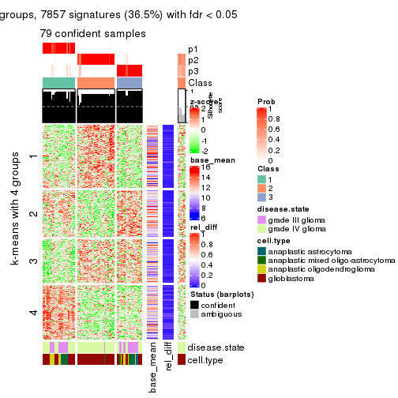</p>

</div>
<div id='tab-ATC-mclust-get-signatures-3'>
<pre><code class="r">get_signatures(res, k = 4)
</code></pre>

<p></p>

</div>
<div id='tab-ATC-mclust-get-signatures-4'>
<pre><code class="r">get_signatures(res, k = 5)
</code></pre>

<p></p>

</div>
<div id='tab-ATC-mclust-get-signatures-5'>
<pre><code class="r">get_signatures(res, k = 6)
</code></pre>

<p></p>

</div>
</div>


Signature heatmaps where rows are not scaled:


<script>
$( function() {
	$( '#tabs-ATC-mclust-get-signatures-no-scale' ).tabs();
} );
</script>
<div id='tabs-ATC-mclust-get-signatures-no-scale'>
<ul>
<li><a href='#tab-ATC-mclust-get-signatures-no-scale-1'>k = 2</a></li>
<li><a href='#tab-ATC-mclust-get-signatures-no-scale-2'>k = 3</a></li>
<li><a href='#tab-ATC-mclust-get-signatures-no-scale-3'>k = 4</a></li>
<li><a href='#tab-ATC-mclust-get-signatures-no-scale-4'>k = 5</a></li>
<li><a href='#tab-ATC-mclust-get-signatures-no-scale-5'>k = 6</a></li>
</ul>
<div id='tab-ATC-mclust-get-signatures-no-scale-1'>
<pre><code class="r">get_signatures(res, k = 2, scale_rows = FALSE)
</code></pre>

<p></p>

</div>
<div id='tab-ATC-mclust-get-signatures-no-scale-2'>
<pre><code class="r">get_signatures(res, k = 3, scale_rows = FALSE)
</code></pre>

<p>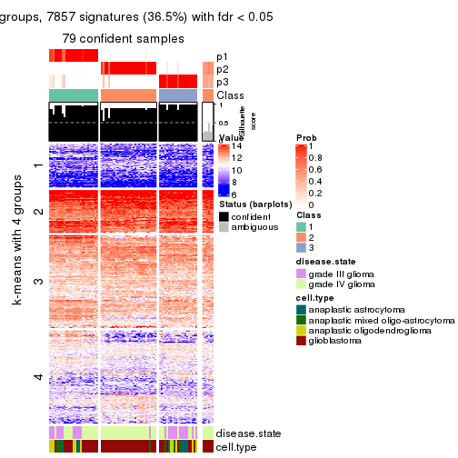</p>

</div>
<div id='tab-ATC-mclust-get-signatures-no-scale-3'>
<pre><code class="r">get_signatures(res, k = 4, scale_rows = FALSE)
</code></pre>

<p></p>

</div>
<div id='tab-ATC-mclust-get-signatures-no-scale-4'>
<pre><code class="r">get_signatures(res, k = 5, scale_rows = FALSE)
</code></pre>

<p></p>

</div>
<div id='tab-ATC-mclust-get-signatures-no-scale-5'>
<pre><code class="r">get_signatures(res, k = 6, scale_rows = FALSE)
</code></pre>

<p></p>

</div>
</div>


Compare the overlap of signatures from different k:

```r
compare_signatures(res)
```


`get_signature()` returns a data frame invisibly. TO get the list of signatures, the function
call should be assigned to a variable explicitly. In following code, if `plot` argument is set
to `FALSE`, no heatmap is plotted while only the differential analysis is performed.

```r
# code only for demonstration
tb = get_signature(res, k = ..., plot = FALSE)
```

An example of the output of `tb` is:

```
#>   which_row         fdr    mean_1    mean_2 scaled_mean_1 scaled_mean_2 km
#> 1        38 0.042760348  8.373488  9.131774    -0.5533452     0.5164555  1
#> 2        40 0.018707592  7.106213  8.469186    -0.6173731     0.5762149  1
#> 3        55 0.019134737 10.221463 11.207825    -0.6159697     0.5749050  1
#> 4        59 0.006059896  5.921854  7.869574    -0.6899429     0.6439467  1
#> 5        60 0.018055526  8.928898 10.211722    -0.6204761     0.5791110  1
#> 6        98 0.009384629 15.714769 14.887706     0.6635654    -0.6193277  2
...
```

The columns in `tb` are:

1. `which_row`: row indices corresponding to the input matrix.
2. `fdr`: FDR for the differential test. 
3. `mean_x`: The mean value in group x.
4. `scaled_mean_x`: The mean value in group x after rows are scaled.
5. `km`: Row groups if k-means clustering is applied to rows.


UMAP plot which shows how samples are separated.


<script>
$( function() {
	$( '#tabs-ATC-mclust-dimension-reduction' ).tabs();
} );
</script>
<div id='tabs-ATC-mclust-dimension-reduction'>
<ul>
<li><a href='#tab-ATC-mclust-dimension-reduction-1'>k = 2</a></li>
<li><a href='#tab-ATC-mclust-dimension-reduction-2'>k = 3</a></li>
<li><a href='#tab-ATC-mclust-dimension-reduction-3'>k = 4</a></li>
<li><a href='#tab-ATC-mclust-dimension-reduction-4'>k = 5</a></li>
<li><a href='#tab-ATC-mclust-dimension-reduction-5'>k = 6</a></li>
</ul>
<div id='tab-ATC-mclust-dimension-reduction-1'>
<pre><code class="r">dimension_reduction(res, k = 2, method = &quot;UMAP&quot;)
</code></pre>

<p></p>

</div>
<div id='tab-ATC-mclust-dimension-reduction-2'>
<pre><code class="r">dimension_reduction(res, k = 3, method = &quot;UMAP&quot;)
</code></pre>

<p></p>

</div>
<div id='tab-ATC-mclust-dimension-reduction-3'>
<pre><code class="r">dimension_reduction(res, k = 4, method = &quot;UMAP&quot;)
</code></pre>

<p></p>

</div>
<div id='tab-ATC-mclust-dimension-reduction-4'>
<pre><code class="r">dimension_reduction(res, k = 5, method = &quot;UMAP&quot;)
</code></pre>

<p></p>

</div>
<div id='tab-ATC-mclust-dimension-reduction-5'>
<pre><code class="r">dimension_reduction(res, k = 6, method = &quot;UMAP&quot;)
</code></pre>

<p></p>

</div>
</div>


Following heatmap shows how subgroups are split when increasing `k`:

```r
collect_classes(res)
```


Test correlation between subgroups and known annotations. If the known
annotation is numeric, one-way ANOVA test is applied, and if the known
annotation is discrete, chi-squared contingency table test is applied.

```r
test_to_known_factors(res)
```

```
#>             n disease.state(p) cell.type(p) k
#> ATC:mclust 83         7.63e-04     0.001601 2
#> ATC:mclust 79         1.68e-05     0.000680 3
#> ATC:mclust 76         1.55e-04     0.012491 4
#> ATC:mclust 80         1.29e-06     0.000632 5
#> ATC:mclust 68         4.57e-07     0.000324 6
```


If matrix rows can be associated to genes, consider to use `GO_Enrichment(res,
...)` to perform function enrichment for the signature genes.


 

---------------------------------------------------


### ATC:NMF**


The object with results only for a single top-value method and a single partition method 
can be extracted as:

```r
res = res_list["ATC", "NMF"]
# you can also extract it by
# res = res_list["ATC:NMF"]
```

A summary of `res` and all the functions that can be applied to it:

```r
res
```

```
#> A 'ConsensusPartition' object with k = 2, 3, 4, 5, 6.
#>   On a matrix with 21512 rows and 85 columns.
#>   Top rows (1000, 2000, 3000, 4000, 5000) are extracted by 'ATC' method.
#>   Subgroups are detected by 'NMF' method.
#>   Performed in total 1250 partitions by row resampling.
#>   Best k for subgroups seems to be 3.
#> 
#> Following methods can be applied to this 'ConsensusPartition' object:
#>  [1] "cola_report"             "collect_classes"         "collect_plots"          
#>  [4] "collect_stats"           "colnames"                "compare_signatures"     
#>  [7] "consensus_heatmap"       "dimension_reduction"     "functional_enrichment"  
#> [10] "get_anno_col"            "get_anno"                "get_classes"            
#> [13] "get_consensus"           "get_matrix"              "get_membership"         
#> [16] "get_param"               "get_signatures"          "get_stats"              
#> [19] "is_best_k"               "is_stable_k"             "membership_heatmap"     
#> [22] "ncol"                    "nrow"                    "plot_ecdf"              
#> [25] "rownames"                "select_partition_number" "show"                   
#> [28] "suggest_best_k"          "test_to_known_factors"
```

`collect_plots()` function collects all the plots made from `res` for all `k` (number of partitions)
into one single page to provide an easy and fast comparison between different `k`.

```r
collect_plots(res)
```


The plots are:

- The first row: a plot of the ECDF (Empirical cumulative distribution
  function) curves of the consensus matrix for each `k` and the heatmap of
  predicted classes for each `k`.
- The second row: heatmaps of the consensus matrix for each `k`.
- The third row: heatmaps of the membership matrix for each `k`.
- The fouth row: heatmaps of the signatures for each `k`.

All the plots in panels can be made by individual functions and they are
plotted later in this section.

`select_partition_number()` produces several plots showing different
statistics for choosing "optimized" `k`. There are following statistics:

- ECDF curves of the consensus matrix for each `k`;
- 1-PAC. [The PAC
  score](https://en.wikipedia.org/wiki/Consensus_clustering#Over-interpretation_potential_of_consensus_clustering)
  measures the proportion of the ambiguous subgrouping.
- Mean silhouette score.
- Concordance. The mean probability of fiting the consensus class ids in all
  partitions.
- Area increased. Denote $A_k$ as the area under the ECDF curve for current
  `k`, the area increased is defined as $A_k - A_{k-1}$.
- Rand index. The percent of pairs of samples that are both in a same cluster
  or both are not in a same cluster in the partition of k and k-1.
- Jaccard index. The ratio of pairs of samples are both in a same cluster in
  the partition of k and k-1 and the pairs of samples are both in a same
  cluster in the partition k or k-1.

The detailed explanations of these statistics can be found in [the cola
vignette](http://bioconductor.org/packages/devel/bioc/vignettes/cola/inst/doc/cola.html#toc_13).

Generally speaking, lower PAC score, higher mean silhouette score or higher
concordance corresponds to better partition. Rand index and Jaccard index
measure how similar the current partition is compared to partition with `k-1`.
If they are too similar, we won't accept `k` is better than `k-1`.

```r
select_partition_number(res)
```


The numeric values for all these statistics can be obtained by `get_stats()`.

```r
get_stats(res)
```

```
#>   k 1-PAC mean_silhouette concordance area_increased  Rand Jaccard
#> 2 2 0.927           0.942       0.976         0.4955 0.503   0.503
#> 3 3 0.982           0.951       0.977         0.3569 0.741   0.524
#> 4 4 0.758           0.670       0.857         0.0771 0.978   0.933
#> 5 5 0.715           0.648       0.814         0.0586 0.904   0.714
#> 6 6 0.728           0.664       0.800         0.0441 0.916   0.693
```

`suggest_best_k()` suggests the best $k$ based on these statistics. The rules are as follows:

- All $k$ with Jaccard index larger than 0.95 are removed because the increase of
  the partition number does not provides enough extra information. If all $k$ are removed,
  the best $k$ is assigned by `NA`.
- For $k$ with 1-PAC larger than 0.9, the maximal $k$ is taken as the "best k". Other $k$ is called "optional k".
- If it does not fit the second rule. The $k$ with the highest vote of highest
  1-PAC, mean silhouette and concordance is taken as the "best k".

```r
suggest_best_k(res)
```

```
#> [1] 3
#> attr(,"optional")
#> [1] 2
```

There is also optional best $k$ = 2 that is worth to check.

Following shows the table of the partitions (You need to click the **show/hide
code output** link to see it). The membership matrix (columns with name `p*`)
is inferred by
[`clue::cl_consensus()`](https://www.rdocumentation.org/link/cl_consensus?package=clue)
function with the `SE` method. Basically the value in the membership matrix
represents the probability to belong to a certain group. The finall class
label for an item is determined with the group with highest probability it
belongs to.

In `get_classes()` function, the entropy is calculated from the membership
matrix and the silhouette score is calculated from the consensus matrix.


<script>
$( function() {
	$( '#tabs-ATC-NMF-get-classes' ).tabs();
} );
</script>
<div id='tabs-ATC-NMF-get-classes'>
<ul>
<li><a href='#tab-ATC-NMF-get-classes-1'>k = 2</a></li>
<li><a href='#tab-ATC-NMF-get-classes-2'>k = 3</a></li>
<li><a href='#tab-ATC-NMF-get-classes-3'>k = 4</a></li>
<li><a href='#tab-ATC-NMF-get-classes-4'>k = 5</a></li>
<li><a href='#tab-ATC-NMF-get-classes-5'>k = 6</a></li>
</ul>

<div id='tab-ATC-NMF-get-classes-1'>
<p><a id='tab-ATC-NMF-get-classes-1-a' style='color:#0366d6' href='#'>show/hide code output</a></p>
<pre><code class="r">cbind(get_classes(res, k = 2), get_membership(res, k = 2))
</code></pre>

<pre><code>#&gt;          class entropy silhouette    p1    p2
#&gt; GSM99497     1  0.0000     0.9800 1.000 0.000
#&gt; GSM99503     1  0.0000     0.9800 1.000 0.000
#&gt; GSM99505     1  0.0000     0.9800 1.000 0.000
#&gt; GSM99507     1  0.0000     0.9800 1.000 0.000
#&gt; GSM99567     1  0.0000     0.9800 1.000 0.000
#&gt; GSM99575     1  0.0000     0.9800 1.000 0.000
#&gt; GSM99593     1  0.9963     0.0918 0.536 0.464
#&gt; GSM99595     1  0.0000     0.9800 1.000 0.000
#&gt; GSM99469     1  0.0000     0.9800 1.000 0.000
#&gt; GSM99499     1  0.0000     0.9800 1.000 0.000
#&gt; GSM99501     1  0.0000     0.9800 1.000 0.000
#&gt; GSM99509     1  0.0000     0.9800 1.000 0.000
#&gt; GSM99569     1  0.0000     0.9800 1.000 0.000
#&gt; GSM99597     1  0.0000     0.9800 1.000 0.000
#&gt; GSM99601     2  0.0000     0.9678 0.000 1.000
#&gt; GSM99459     1  0.0000     0.9800 1.000 0.000
#&gt; GSM99461     1  0.0000     0.9800 1.000 0.000
#&gt; GSM99511     1  0.0000     0.9800 1.000 0.000
#&gt; GSM99513     1  0.0000     0.9800 1.000 0.000
#&gt; GSM99515     1  0.0000     0.9800 1.000 0.000
#&gt; GSM99517     1  0.0000     0.9800 1.000 0.000
#&gt; GSM99519     1  0.0000     0.9800 1.000 0.000
#&gt; GSM99521     1  0.0376     0.9767 0.996 0.004
#&gt; GSM99523     1  0.0000     0.9800 1.000 0.000
#&gt; GSM99571     1  0.0000     0.9800 1.000 0.000
#&gt; GSM99599     1  0.0000     0.9800 1.000 0.000
#&gt; GSM99433     2  0.0000     0.9678 0.000 1.000
#&gt; GSM99435     2  0.7528     0.7336 0.216 0.784
#&gt; GSM99437     2  0.0000     0.9678 0.000 1.000
#&gt; GSM99439     2  0.0000     0.9678 0.000 1.000
#&gt; GSM99441     1  0.0000     0.9800 1.000 0.000
#&gt; GSM99443     2  0.0000     0.9678 0.000 1.000
#&gt; GSM99445     2  0.0000     0.9678 0.000 1.000
#&gt; GSM99447     2  0.0000     0.9678 0.000 1.000
#&gt; GSM99449     2  0.0000     0.9678 0.000 1.000
#&gt; GSM99451     1  0.0000     0.9800 1.000 0.000
#&gt; GSM99453     1  0.0000     0.9800 1.000 0.000
#&gt; GSM99455     1  0.0000     0.9800 1.000 0.000
#&gt; GSM99457     1  0.0000     0.9800 1.000 0.000
#&gt; GSM99463     2  0.0000     0.9678 0.000 1.000
#&gt; GSM99465     1  0.0000     0.9800 1.000 0.000
#&gt; GSM99467     2  0.0000     0.9678 0.000 1.000
#&gt; GSM99471     1  0.1414     0.9624 0.980 0.020
#&gt; GSM99473     1  0.0000     0.9800 1.000 0.000
#&gt; GSM99475     1  0.4690     0.8781 0.900 0.100
#&gt; GSM99477     2  0.0000     0.9678 0.000 1.000
#&gt; GSM99479     2  0.0000     0.9678 0.000 1.000
#&gt; GSM99481     1  0.0000     0.9800 1.000 0.000
#&gt; GSM99483     1  0.0000     0.9800 1.000 0.000
#&gt; GSM99485     2  0.0000     0.9678 0.000 1.000
#&gt; GSM99487     2  0.0000     0.9678 0.000 1.000
#&gt; GSM99489     2  0.0000     0.9678 0.000 1.000
#&gt; GSM99491     2  0.0000     0.9678 0.000 1.000
#&gt; GSM99493     1  0.0000     0.9800 1.000 0.000
#&gt; GSM99495     2  0.0000     0.9678 0.000 1.000
#&gt; GSM99525     1  0.0000     0.9800 1.000 0.000
#&gt; GSM99527     2  0.6343     0.8116 0.160 0.840
#&gt; GSM99529     2  0.6973     0.7749 0.188 0.812
#&gt; GSM99531     1  0.0000     0.9800 1.000 0.000
#&gt; GSM99533     1  0.0000     0.9800 1.000 0.000
#&gt; GSM99535     2  0.0000     0.9678 0.000 1.000
#&gt; GSM99537     1  0.0000     0.9800 1.000 0.000
#&gt; GSM99539     2  0.0000     0.9678 0.000 1.000
#&gt; GSM99541     1  0.0000     0.9800 1.000 0.000
#&gt; GSM99543     2  0.0000     0.9678 0.000 1.000
#&gt; GSM99545     2  0.0000     0.9678 0.000 1.000
#&gt; GSM99547     2  0.5629     0.8439 0.132 0.868
#&gt; GSM99549     2  0.0000     0.9678 0.000 1.000
#&gt; GSM99551     1  0.0000     0.9800 1.000 0.000
#&gt; GSM99553     1  0.7745     0.6940 0.772 0.228
#&gt; GSM99555     2  0.0000     0.9678 0.000 1.000
#&gt; GSM99557     2  0.0000     0.9678 0.000 1.000
#&gt; GSM99559     2  0.0000     0.9678 0.000 1.000
#&gt; GSM99561     2  0.0000     0.9678 0.000 1.000
#&gt; GSM99563     1  0.0000     0.9800 1.000 0.000
#&gt; GSM99565     2  0.0000     0.9678 0.000 1.000
#&gt; GSM99573     2  0.0000     0.9678 0.000 1.000
#&gt; GSM99577     1  0.0000     0.9800 1.000 0.000
#&gt; GSM99579     2  0.0000     0.9678 0.000 1.000
#&gt; GSM99581     1  0.3879     0.9054 0.924 0.076
#&gt; GSM99583     2  0.9815     0.2906 0.420 0.580
#&gt; GSM99585     2  0.0000     0.9678 0.000 1.000
#&gt; GSM99587     1  0.0000     0.9800 1.000 0.000
#&gt; GSM99589     2  0.0000     0.9678 0.000 1.000
#&gt; GSM99591     2  0.0000     0.9678 0.000 1.000
</code></pre>

<script>
$('#tab-ATC-NMF-get-classes-1-a').parent().next().next().hide();
$('#tab-ATC-NMF-get-classes-1-a').click(function(){
  $('#tab-ATC-NMF-get-classes-1-a').parent().next().next().toggle();
  return(false);
});
</script>
</div>

<div id='tab-ATC-NMF-get-classes-2'>
<p><a id='tab-ATC-NMF-get-classes-2-a' style='color:#0366d6' href='#'>show/hide code output</a></p>
<pre><code class="r">cbind(get_classes(res, k = 3), get_membership(res, k = 3))
</code></pre>

<pre><code>#&gt;          class entropy silhouette    p1    p2    p3
#&gt; GSM99497     3  0.0000      0.989 0.000 0.000 1.000
#&gt; GSM99503     1  0.0000      0.947 1.000 0.000 0.000
#&gt; GSM99505     1  0.6192      0.346 0.580 0.000 0.420
#&gt; GSM99507     3  0.0000      0.989 0.000 0.000 1.000
#&gt; GSM99567     3  0.0000      0.989 0.000 0.000 1.000
#&gt; GSM99575     1  0.0237      0.945 0.996 0.000 0.004
#&gt; GSM99593     3  0.0000      0.989 0.000 0.000 1.000
#&gt; GSM99595     3  0.0000      0.989 0.000 0.000 1.000
#&gt; GSM99469     1  0.0000      0.947 1.000 0.000 0.000
#&gt; GSM99499     1  0.0000      0.947 1.000 0.000 0.000
#&gt; GSM99501     1  0.0747      0.937 0.984 0.000 0.016
#&gt; GSM99509     3  0.0000      0.989 0.000 0.000 1.000
#&gt; GSM99569     3  0.0000      0.989 0.000 0.000 1.000
#&gt; GSM99597     3  0.0000      0.989 0.000 0.000 1.000
#&gt; GSM99601     2  0.0000      0.991 0.000 1.000 0.000
#&gt; GSM99459     1  0.2261      0.896 0.932 0.000 0.068
#&gt; GSM99461     1  0.5431      0.642 0.716 0.000 0.284
#&gt; GSM99511     3  0.0000      0.989 0.000 0.000 1.000
#&gt; GSM99513     3  0.0000      0.989 0.000 0.000 1.000
#&gt; GSM99515     3  0.0000      0.989 0.000 0.000 1.000
#&gt; GSM99517     1  0.0000      0.947 1.000 0.000 0.000
#&gt; GSM99519     1  0.5497      0.629 0.708 0.000 0.292
#&gt; GSM99521     3  0.0000      0.989 0.000 0.000 1.000
#&gt; GSM99523     3  0.0000      0.989 0.000 0.000 1.000
#&gt; GSM99571     1  0.0000      0.947 1.000 0.000 0.000
#&gt; GSM99599     1  0.0000      0.947 1.000 0.000 0.000
#&gt; GSM99433     2  0.0237      0.988 0.000 0.996 0.004
#&gt; GSM99435     3  0.0000      0.989 0.000 0.000 1.000
#&gt; GSM99437     2  0.0000      0.991 0.000 1.000 0.000
#&gt; GSM99439     2  0.0000      0.991 0.000 1.000 0.000
#&gt; GSM99441     1  0.0000      0.947 1.000 0.000 0.000
#&gt; GSM99443     2  0.0000      0.991 0.000 1.000 0.000
#&gt; GSM99445     2  0.0000      0.991 0.000 1.000 0.000
#&gt; GSM99447     2  0.0000      0.991 0.000 1.000 0.000
#&gt; GSM99449     3  0.0000      0.989 0.000 0.000 1.000
#&gt; GSM99451     3  0.0000      0.989 0.000 0.000 1.000
#&gt; GSM99453     1  0.0000      0.947 1.000 0.000 0.000
#&gt; GSM99455     1  0.0000      0.947 1.000 0.000 0.000
#&gt; GSM99457     1  0.0000      0.947 1.000 0.000 0.000
#&gt; GSM99463     2  0.0000      0.991 0.000 1.000 0.000
#&gt; GSM99465     3  0.0000      0.989 0.000 0.000 1.000
#&gt; GSM99467     2  0.1289      0.965 0.000 0.968 0.032
#&gt; GSM99471     1  0.0592      0.938 0.988 0.012 0.000
#&gt; GSM99473     1  0.0000      0.947 1.000 0.000 0.000
#&gt; GSM99475     3  0.0000      0.989 0.000 0.000 1.000
#&gt; GSM99477     3  0.0000      0.989 0.000 0.000 1.000
#&gt; GSM99479     2  0.3412      0.864 0.000 0.876 0.124
#&gt; GSM99481     1  0.0000      0.947 1.000 0.000 0.000
#&gt; GSM99483     1  0.0000      0.947 1.000 0.000 0.000
#&gt; GSM99485     2  0.0000      0.991 0.000 1.000 0.000
#&gt; GSM99487     2  0.0000      0.991 0.000 1.000 0.000
#&gt; GSM99489     2  0.0000      0.991 0.000 1.000 0.000
#&gt; GSM99491     2  0.0000      0.991 0.000 1.000 0.000
#&gt; GSM99493     1  0.0000      0.947 1.000 0.000 0.000
#&gt; GSM99495     2  0.0000      0.991 0.000 1.000 0.000
#&gt; GSM99525     1  0.0000      0.947 1.000 0.000 0.000
#&gt; GSM99527     3  0.0000      0.989 0.000 0.000 1.000
#&gt; GSM99529     3  0.2356      0.913 0.000 0.072 0.928
#&gt; GSM99531     3  0.0237      0.985 0.004 0.000 0.996
#&gt; GSM99533     3  0.0000      0.989 0.000 0.000 1.000
#&gt; GSM99535     2  0.0000      0.991 0.000 1.000 0.000
#&gt; GSM99537     1  0.0000      0.947 1.000 0.000 0.000
#&gt; GSM99539     2  0.2261      0.929 0.000 0.932 0.068
#&gt; GSM99541     1  0.5098      0.697 0.752 0.000 0.248
#&gt; GSM99543     2  0.0000      0.991 0.000 1.000 0.000
#&gt; GSM99545     2  0.0000      0.991 0.000 1.000 0.000
#&gt; GSM99547     2  0.1015      0.977 0.012 0.980 0.008
#&gt; GSM99549     2  0.0000      0.991 0.000 1.000 0.000
#&gt; GSM99551     1  0.0000      0.947 1.000 0.000 0.000
#&gt; GSM99553     3  0.0000      0.989 0.000 0.000 1.000
#&gt; GSM99555     2  0.0000      0.991 0.000 1.000 0.000
#&gt; GSM99557     2  0.0000      0.991 0.000 1.000 0.000
#&gt; GSM99559     3  0.0000      0.989 0.000 0.000 1.000
#&gt; GSM99561     2  0.0000      0.991 0.000 1.000 0.000
#&gt; GSM99563     3  0.0000      0.989 0.000 0.000 1.000
#&gt; GSM99565     2  0.0000      0.991 0.000 1.000 0.000
#&gt; GSM99573     2  0.0000      0.991 0.000 1.000 0.000
#&gt; GSM99577     1  0.0000      0.947 1.000 0.000 0.000
#&gt; GSM99579     2  0.0000      0.991 0.000 1.000 0.000
#&gt; GSM99581     3  0.0000      0.989 0.000 0.000 1.000
#&gt; GSM99583     3  0.6383      0.739 0.104 0.128 0.768
#&gt; GSM99585     2  0.0747      0.979 0.000 0.984 0.016
#&gt; GSM99587     1  0.0000      0.947 1.000 0.000 0.000
#&gt; GSM99589     2  0.0000      0.991 0.000 1.000 0.000
#&gt; GSM99591     2  0.0000      0.991 0.000 1.000 0.000
</code></pre>

<script>
$('#tab-ATC-NMF-get-classes-2-a').parent().next().next().hide();
$('#tab-ATC-NMF-get-classes-2-a').click(function(){
  $('#tab-ATC-NMF-get-classes-2-a').parent().next().next().toggle();
  return(false);
});
</script>
</div>

<div id='tab-ATC-NMF-get-classes-3'>
<p><a id='tab-ATC-NMF-get-classes-3-a' style='color:#0366d6' href='#'>show/hide code output</a></p>
<pre><code class="r">cbind(get_classes(res, k = 4), get_membership(res, k = 4))
</code></pre>

<pre><code>#&gt;          class entropy silhouette    p1    p2    p3    p4
#&gt; GSM99497     3  0.1389     0.7869 0.000 0.000 0.952 0.048
#&gt; GSM99503     1  0.0000     0.9318 1.000 0.000 0.000 0.000
#&gt; GSM99505     3  0.5057     0.3085 0.340 0.000 0.648 0.012
#&gt; GSM99507     3  0.0469     0.7892 0.000 0.000 0.988 0.012
#&gt; GSM99567     3  0.0707     0.7853 0.000 0.000 0.980 0.020
#&gt; GSM99575     1  0.0000     0.9318 1.000 0.000 0.000 0.000
#&gt; GSM99593     3  0.0336     0.7882 0.000 0.000 0.992 0.008
#&gt; GSM99595     3  0.1867     0.7632 0.000 0.000 0.928 0.072
#&gt; GSM99469     1  0.0000     0.9318 1.000 0.000 0.000 0.000
#&gt; GSM99499     1  0.0000     0.9318 1.000 0.000 0.000 0.000
#&gt; GSM99501     1  0.0188     0.9302 0.996 0.000 0.000 0.004
#&gt; GSM99509     3  0.0000     0.7872 0.000 0.000 1.000 0.000
#&gt; GSM99569     3  0.2011     0.7765 0.000 0.000 0.920 0.080
#&gt; GSM99597     3  0.0592     0.7861 0.000 0.000 0.984 0.016
#&gt; GSM99601     2  0.0000     0.7600 0.000 1.000 0.000 0.000
#&gt; GSM99459     1  0.4571     0.6699 0.736 0.004 0.008 0.252
#&gt; GSM99461     1  0.4631     0.6573 0.728 0.004 0.008 0.260
#&gt; GSM99511     3  0.1302     0.7816 0.000 0.000 0.956 0.044
#&gt; GSM99513     3  0.2081     0.7553 0.000 0.000 0.916 0.084
#&gt; GSM99515     3  0.1211     0.7892 0.000 0.000 0.960 0.040
#&gt; GSM99517     1  0.0000     0.9318 1.000 0.000 0.000 0.000
#&gt; GSM99519     1  0.4049     0.7311 0.780 0.000 0.008 0.212
#&gt; GSM99521     3  0.0921     0.7896 0.000 0.000 0.972 0.028
#&gt; GSM99523     3  0.3219     0.7126 0.000 0.000 0.836 0.164
#&gt; GSM99571     1  0.0000     0.9318 1.000 0.000 0.000 0.000
#&gt; GSM99599     1  0.0000     0.9318 1.000 0.000 0.000 0.000
#&gt; GSM99433     2  0.4679     0.6142 0.000 0.772 0.044 0.184
#&gt; GSM99435     3  0.2149     0.7618 0.000 0.000 0.912 0.088
#&gt; GSM99437     2  0.4730     0.3642 0.000 0.636 0.000 0.364
#&gt; GSM99439     2  0.2281     0.7237 0.000 0.904 0.000 0.096
#&gt; GSM99441     1  0.0000     0.9318 1.000 0.000 0.000 0.000
#&gt; GSM99443     2  0.0592     0.7575 0.000 0.984 0.000 0.016
#&gt; GSM99445     2  0.0188     0.7599 0.000 0.996 0.000 0.004
#&gt; GSM99447     2  0.0921     0.7569 0.000 0.972 0.000 0.028
#&gt; GSM99449     3  0.3486     0.6835 0.000 0.000 0.812 0.188
#&gt; GSM99451     3  0.3311     0.6677 0.000 0.000 0.828 0.172
#&gt; GSM99453     1  0.1118     0.9174 0.964 0.000 0.000 0.036
#&gt; GSM99455     1  0.0592     0.9260 0.984 0.000 0.000 0.016
#&gt; GSM99457     1  0.0000     0.9318 1.000 0.000 0.000 0.000
#&gt; GSM99463     2  0.1557     0.7479 0.000 0.944 0.000 0.056
#&gt; GSM99465     3  0.5147    -0.0714 0.000 0.004 0.536 0.460
#&gt; GSM99467     2  0.4933     0.1542 0.000 0.568 0.000 0.432
#&gt; GSM99471     1  0.2124     0.8774 0.924 0.068 0.000 0.008
#&gt; GSM99473     1  0.3370     0.8350 0.872 0.048 0.000 0.080
#&gt; GSM99475     3  0.2408     0.7667 0.000 0.000 0.896 0.104
#&gt; GSM99477     3  0.6337    -0.3471 0.000 0.060 0.476 0.464
#&gt; GSM99479     2  0.4917     0.3672 0.000 0.656 0.008 0.336
#&gt; GSM99481     1  0.0000     0.9318 1.000 0.000 0.000 0.000
#&gt; GSM99483     1  0.0188     0.9306 0.996 0.000 0.000 0.004
#&gt; GSM99485     2  0.0000     0.7600 0.000 1.000 0.000 0.000
#&gt; GSM99487     2  0.4866     0.2565 0.000 0.596 0.000 0.404
#&gt; GSM99489     2  0.1118     0.7551 0.000 0.964 0.000 0.036
#&gt; GSM99491     2  0.4382     0.4872 0.000 0.704 0.000 0.296
#&gt; GSM99493     1  0.0000     0.9318 1.000 0.000 0.000 0.000
#&gt; GSM99495     2  0.1474     0.7498 0.000 0.948 0.000 0.052
#&gt; GSM99525     1  0.0000     0.9318 1.000 0.000 0.000 0.000
#&gt; GSM99527     3  0.5768    -0.1696 0.000 0.028 0.516 0.456
#&gt; GSM99529     3  0.7751    -0.6114 0.000 0.344 0.416 0.240
#&gt; GSM99531     3  0.2662     0.7737 0.016 0.000 0.900 0.084
#&gt; GSM99533     3  0.4755     0.6085 0.040 0.000 0.760 0.200
#&gt; GSM99535     2  0.0188     0.7599 0.000 0.996 0.000 0.004
#&gt; GSM99537     1  0.0000     0.9318 1.000 0.000 0.000 0.000
#&gt; GSM99539     2  0.3323     0.6948 0.000 0.876 0.060 0.064
#&gt; GSM99541     1  0.4889     0.3889 0.636 0.000 0.360 0.004
#&gt; GSM99543     2  0.1474     0.7498 0.000 0.948 0.000 0.052
#&gt; GSM99545     2  0.5827     0.3439 0.000 0.568 0.036 0.396
#&gt; GSM99547     2  0.5143     0.3466 0.012 0.628 0.000 0.360
#&gt; GSM99549     2  0.4977     0.3198 0.000 0.540 0.000 0.460
#&gt; GSM99551     1  0.3172     0.8201 0.840 0.000 0.000 0.160
#&gt; GSM99553     3  0.2704     0.7255 0.000 0.000 0.876 0.124
#&gt; GSM99555     2  0.0336     0.7593 0.000 0.992 0.000 0.008
#&gt; GSM99557     2  0.0592     0.7588 0.000 0.984 0.000 0.016
#&gt; GSM99559     3  0.1211     0.7893 0.000 0.000 0.960 0.040
#&gt; GSM99561     2  0.3486     0.6435 0.000 0.812 0.000 0.188
#&gt; GSM99563     3  0.1389     0.7896 0.000 0.000 0.952 0.048
#&gt; GSM99565     2  0.3528     0.6421 0.000 0.808 0.000 0.192
#&gt; GSM99573     2  0.4406     0.5241 0.000 0.700 0.000 0.300
#&gt; GSM99577     1  0.1305     0.9151 0.960 0.000 0.004 0.036
#&gt; GSM99579     2  0.3024     0.6703 0.000 0.852 0.000 0.148
#&gt; GSM99581     3  0.2760     0.7380 0.000 0.000 0.872 0.128
#&gt; GSM99583     4  0.8238     0.0000 0.020 0.256 0.276 0.448
#&gt; GSM99585     2  0.5126     0.0946 0.000 0.552 0.004 0.444
#&gt; GSM99587     1  0.0000     0.9318 1.000 0.000 0.000 0.000
#&gt; GSM99589     2  0.1022     0.7569 0.000 0.968 0.000 0.032
#&gt; GSM99591     2  0.0188     0.7599 0.000 0.996 0.000 0.004
</code></pre>

<script>
$('#tab-ATC-NMF-get-classes-3-a').parent().next().next().hide();
$('#tab-ATC-NMF-get-classes-3-a').click(function(){
  $('#tab-ATC-NMF-get-classes-3-a').parent().next().next().toggle();
  return(false);
});
</script>
</div>

<div id='tab-ATC-NMF-get-classes-4'>
<p><a id='tab-ATC-NMF-get-classes-4-a' style='color:#0366d6' href='#'>show/hide code output</a></p>
<pre><code class="r">cbind(get_classes(res, k = 5), get_membership(res, k = 5))
</code></pre>

<pre><code>#&gt;          class entropy silhouette    p1    p2    p3    p4    p5
#&gt; GSM99497     3  0.2616    0.71582 0.000 0.000 0.888 0.076 0.036
#&gt; GSM99503     1  0.0162    0.94267 0.996 0.000 0.000 0.004 0.000
#&gt; GSM99505     3  0.4047    0.32904 0.320 0.000 0.676 0.000 0.004
#&gt; GSM99507     3  0.2735    0.71263 0.000 0.000 0.880 0.084 0.036
#&gt; GSM99567     3  0.1981    0.71066 0.000 0.000 0.924 0.028 0.048
#&gt; GSM99575     1  0.0162    0.94267 0.996 0.000 0.000 0.004 0.000
#&gt; GSM99593     3  0.3289    0.70258 0.000 0.000 0.844 0.108 0.048
#&gt; GSM99595     3  0.3710    0.65758 0.000 0.000 0.808 0.048 0.144
#&gt; GSM99469     1  0.0162    0.94299 0.996 0.000 0.000 0.004 0.000
#&gt; GSM99499     1  0.0162    0.94280 0.996 0.000 0.004 0.000 0.000
#&gt; GSM99501     1  0.0000    0.94274 1.000 0.000 0.000 0.000 0.000
#&gt; GSM99509     3  0.2351    0.71594 0.000 0.000 0.896 0.088 0.016
#&gt; GSM99569     3  0.2873    0.70171 0.000 0.000 0.860 0.120 0.020
#&gt; GSM99597     3  0.6326    0.02040 0.000 0.000 0.460 0.380 0.160
#&gt; GSM99601     2  0.0162    0.71135 0.000 0.996 0.000 0.000 0.004
#&gt; GSM99459     1  0.2395    0.88249 0.904 0.000 0.008 0.016 0.072
#&gt; GSM99461     1  0.3316    0.84771 0.860 0.000 0.012 0.072 0.056
#&gt; GSM99511     3  0.3033    0.69603 0.000 0.000 0.864 0.052 0.084
#&gt; GSM99513     3  0.2871    0.69725 0.000 0.000 0.872 0.040 0.088
#&gt; GSM99515     3  0.1117    0.71452 0.000 0.000 0.964 0.020 0.016
#&gt; GSM99517     1  0.0000    0.94274 1.000 0.000 0.000 0.000 0.000
#&gt; GSM99519     1  0.4095    0.68612 0.748 0.000 0.008 0.228 0.016
#&gt; GSM99521     3  0.5927    0.00659 0.000 0.000 0.468 0.428 0.104
#&gt; GSM99523     3  0.3354    0.68328 0.000 0.000 0.844 0.088 0.068
#&gt; GSM99571     1  0.0324    0.94247 0.992 0.000 0.000 0.004 0.004
#&gt; GSM99599     1  0.0000    0.94274 1.000 0.000 0.000 0.000 0.000
#&gt; GSM99433     2  0.5687    0.45484 0.000 0.620 0.008 0.276 0.096
#&gt; GSM99435     3  0.5535    0.28793 0.000 0.000 0.536 0.392 0.072
#&gt; GSM99437     2  0.4757    0.63231 0.000 0.732 0.000 0.148 0.120
#&gt; GSM99439     2  0.2230    0.61750 0.000 0.884 0.000 0.000 0.116
#&gt; GSM99441     1  0.0000    0.94274 1.000 0.000 0.000 0.000 0.000
#&gt; GSM99443     2  0.1661    0.71550 0.000 0.940 0.000 0.036 0.024
#&gt; GSM99445     2  0.0324    0.71316 0.000 0.992 0.000 0.004 0.004
#&gt; GSM99447     2  0.3410    0.65795 0.000 0.840 0.000 0.092 0.068
#&gt; GSM99449     3  0.4347    0.61898 0.000 0.008 0.780 0.136 0.076
#&gt; GSM99451     3  0.5285    0.38061 0.000 0.000 0.584 0.356 0.060
#&gt; GSM99453     1  0.0798    0.93932 0.976 0.000 0.000 0.008 0.016
#&gt; GSM99455     1  0.0932    0.93768 0.972 0.000 0.004 0.004 0.020
#&gt; GSM99457     1  0.1106    0.93473 0.964 0.000 0.000 0.024 0.012
#&gt; GSM99463     2  0.1205    0.69145 0.000 0.956 0.000 0.004 0.040
#&gt; GSM99465     4  0.4214    0.57175 0.004 0.000 0.152 0.780 0.064
#&gt; GSM99467     2  0.6525    0.50597 0.000 0.604 0.044 0.200 0.152
#&gt; GSM99471     1  0.2333    0.89566 0.916 0.052 0.004 0.016 0.012
#&gt; GSM99473     1  0.1461    0.92007 0.952 0.028 0.000 0.004 0.016
#&gt; GSM99475     4  0.6408    0.34442 0.000 0.000 0.272 0.508 0.220
#&gt; GSM99477     4  0.7745    0.08804 0.000 0.100 0.348 0.404 0.148
#&gt; GSM99479     2  0.4961    0.63628 0.000 0.748 0.028 0.080 0.144
#&gt; GSM99481     1  0.0162    0.94267 0.996 0.000 0.000 0.004 0.000
#&gt; GSM99483     1  0.0613    0.94101 0.984 0.000 0.004 0.004 0.008
#&gt; GSM99485     2  0.1310    0.70349 0.000 0.956 0.000 0.024 0.020
#&gt; GSM99487     2  0.5278    0.60479 0.000 0.700 0.008 0.156 0.136
#&gt; GSM99489     2  0.1117    0.70120 0.000 0.964 0.000 0.016 0.020
#&gt; GSM99491     2  0.3810    0.67357 0.000 0.812 0.000 0.100 0.088
#&gt; GSM99493     1  0.0579    0.94160 0.984 0.000 0.000 0.008 0.008
#&gt; GSM99495     2  0.1124    0.69387 0.000 0.960 0.000 0.004 0.036
#&gt; GSM99525     1  0.0324    0.94229 0.992 0.000 0.004 0.004 0.000
#&gt; GSM99527     4  0.4888    0.51454 0.000 0.004 0.160 0.728 0.108
#&gt; GSM99529     4  0.6471    0.48223 0.008 0.148 0.084 0.656 0.104
#&gt; GSM99531     4  0.5301    0.52361 0.008 0.000 0.200 0.688 0.104
#&gt; GSM99533     4  0.4407    0.56407 0.016 0.000 0.180 0.764 0.040
#&gt; GSM99535     2  0.1442    0.71564 0.004 0.952 0.000 0.032 0.012
#&gt; GSM99537     1  0.0404    0.94105 0.988 0.000 0.000 0.012 0.000
#&gt; GSM99539     4  0.3969    0.25549 0.000 0.304 0.004 0.692 0.000
#&gt; GSM99541     4  0.6142    0.39501 0.304 0.000 0.128 0.560 0.008
#&gt; GSM99543     2  0.2353    0.65282 0.004 0.908 0.000 0.028 0.060
#&gt; GSM99545     5  0.5605    0.79541 0.000 0.316 0.028 0.044 0.612
#&gt; GSM99547     3  0.9163   -0.23222 0.040 0.288 0.296 0.204 0.172
#&gt; GSM99549     5  0.4425    0.77752 0.000 0.392 0.000 0.008 0.600
#&gt; GSM99551     1  0.4956    0.55441 0.644 0.004 0.000 0.040 0.312
#&gt; GSM99553     3  0.2984    0.67873 0.000 0.000 0.860 0.032 0.108
#&gt; GSM99555     2  0.3420    0.67606 0.000 0.840 0.000 0.076 0.084
#&gt; GSM99557     2  0.0566    0.70694 0.000 0.984 0.000 0.004 0.012
#&gt; GSM99559     3  0.2917    0.71103 0.000 0.028 0.888 0.052 0.032
#&gt; GSM99561     2  0.5232    0.11885 0.000 0.500 0.000 0.456 0.044
#&gt; GSM99563     3  0.1965    0.71216 0.000 0.000 0.924 0.052 0.024
#&gt; GSM99565     2  0.4365    0.65206 0.000 0.768 0.000 0.116 0.116
#&gt; GSM99573     2  0.4510   -0.46234 0.000 0.560 0.000 0.008 0.432
#&gt; GSM99577     1  0.4487    0.73845 0.756 0.000 0.000 0.104 0.140
#&gt; GSM99579     2  0.4284    0.54208 0.000 0.736 0.000 0.224 0.040
#&gt; GSM99581     3  0.4024    0.59979 0.000 0.000 0.752 0.220 0.028
#&gt; GSM99583     2  0.8713    0.18479 0.040 0.420 0.156 0.244 0.140
#&gt; GSM99585     2  0.6108    0.51777 0.000 0.620 0.020 0.220 0.140
#&gt; GSM99587     1  0.0798    0.93973 0.976 0.000 0.000 0.008 0.016
#&gt; GSM99589     2  0.1095    0.70784 0.000 0.968 0.008 0.012 0.012
#&gt; GSM99591     2  0.0290    0.71336 0.000 0.992 0.000 0.008 0.000
</code></pre>

<script>
$('#tab-ATC-NMF-get-classes-4-a').parent().next().next().hide();
$('#tab-ATC-NMF-get-classes-4-a').click(function(){
  $('#tab-ATC-NMF-get-classes-4-a').parent().next().next().toggle();
  return(false);
});
</script>
</div>

<div id='tab-ATC-NMF-get-classes-5'>
<p><a id='tab-ATC-NMF-get-classes-5-a' style='color:#0366d6' href='#'>show/hide code output</a></p>
<pre><code class="r">cbind(get_classes(res, k = 6), get_membership(res, k = 6))
</code></pre>

<pre><code>#&gt;          class entropy silhouette    p1    p2    p3    p4    p5    p6
#&gt; GSM99497     3  0.2724    0.84541 0.000 0.000 0.880 0.064 0.024 0.032
#&gt; GSM99503     1  0.0146    0.91986 0.996 0.000 0.000 0.000 0.000 0.004
#&gt; GSM99505     3  0.3479    0.62976 0.212 0.000 0.768 0.012 0.000 0.008
#&gt; GSM99507     3  0.2333    0.84972 0.000 0.000 0.884 0.092 0.024 0.000
#&gt; GSM99567     3  0.2103    0.85406 0.000 0.000 0.916 0.024 0.040 0.020
#&gt; GSM99575     1  0.0146    0.91986 0.996 0.000 0.000 0.000 0.000 0.004
#&gt; GSM99593     3  0.3872    0.81042 0.000 0.000 0.808 0.084 0.044 0.064
#&gt; GSM99595     3  0.3628    0.82097 0.000 0.000 0.824 0.052 0.084 0.040
#&gt; GSM99469     1  0.0146    0.92027 0.996 0.000 0.000 0.000 0.000 0.004
#&gt; GSM99499     1  0.1010    0.90556 0.960 0.000 0.036 0.000 0.000 0.004
#&gt; GSM99501     1  0.0405    0.91955 0.988 0.000 0.008 0.004 0.000 0.000
#&gt; GSM99509     3  0.2257    0.85653 0.000 0.000 0.904 0.060 0.020 0.016
#&gt; GSM99569     3  0.3005    0.83464 0.000 0.000 0.848 0.108 0.008 0.036
#&gt; GSM99597     4  0.6111    0.00994 0.000 0.000 0.404 0.448 0.108 0.040
#&gt; GSM99601     2  0.1434    0.77629 0.000 0.940 0.000 0.000 0.012 0.048
#&gt; GSM99459     1  0.2501    0.85341 0.872 0.000 0.004 0.016 0.000 0.108
#&gt; GSM99461     1  0.3455    0.74732 0.784 0.000 0.000 0.036 0.000 0.180
#&gt; GSM99511     3  0.3856    0.78763 0.000 0.000 0.804 0.028 0.076 0.092
#&gt; GSM99513     3  0.3033    0.83173 0.000 0.000 0.856 0.012 0.076 0.056
#&gt; GSM99515     3  0.1180    0.85495 0.000 0.000 0.960 0.012 0.012 0.016
#&gt; GSM99517     1  0.0146    0.91972 0.996 0.000 0.000 0.004 0.000 0.000
#&gt; GSM99519     1  0.3630    0.70883 0.756 0.000 0.000 0.212 0.000 0.032
#&gt; GSM99521     4  0.4805    0.39378 0.000 0.000 0.300 0.636 0.048 0.016
#&gt; GSM99523     3  0.2456    0.85315 0.000 0.000 0.892 0.048 0.008 0.052
#&gt; GSM99571     1  0.0291    0.92018 0.992 0.000 0.000 0.004 0.000 0.004
#&gt; GSM99599     1  0.0146    0.91972 0.996 0.000 0.000 0.004 0.000 0.000
#&gt; GSM99433     6  0.6101    0.42952 0.000 0.164 0.008 0.088 0.116 0.624
#&gt; GSM99435     4  0.7285    0.31621 0.000 0.000 0.204 0.396 0.124 0.276
#&gt; GSM99437     2  0.3727    0.41494 0.000 0.612 0.000 0.000 0.000 0.388
#&gt; GSM99439     2  0.2350    0.72530 0.000 0.880 0.000 0.000 0.100 0.020
#&gt; GSM99441     1  0.0000    0.91969 1.000 0.000 0.000 0.000 0.000 0.000
#&gt; GSM99443     2  0.1967    0.76440 0.000 0.904 0.000 0.000 0.012 0.084
#&gt; GSM99445     2  0.0692    0.77796 0.000 0.976 0.000 0.004 0.000 0.020
#&gt; GSM99447     2  0.5278    0.04476 0.000 0.488 0.000 0.000 0.100 0.412
#&gt; GSM99449     3  0.3352    0.78317 0.000 0.000 0.812 0.032 0.008 0.148
#&gt; GSM99451     4  0.7045    0.29762 0.000 0.000 0.244 0.384 0.072 0.300
#&gt; GSM99453     1  0.1078    0.91490 0.964 0.000 0.000 0.016 0.012 0.008
#&gt; GSM99455     1  0.1520    0.90918 0.948 0.000 0.008 0.020 0.016 0.008
#&gt; GSM99457     1  0.2554    0.86117 0.876 0.000 0.000 0.000 0.048 0.076
#&gt; GSM99463     2  0.0935    0.77283 0.000 0.964 0.000 0.004 0.032 0.000
#&gt; GSM99465     4  0.4347    0.44205 0.000 0.000 0.040 0.668 0.004 0.288
#&gt; GSM99467     2  0.5332    0.13644 0.000 0.496 0.040 0.020 0.008 0.436
#&gt; GSM99471     1  0.5682    0.60131 0.696 0.140 0.004 0.056 0.056 0.048
#&gt; GSM99473     1  0.0935    0.90852 0.964 0.032 0.000 0.004 0.000 0.000
#&gt; GSM99475     4  0.4781    0.55386 0.000 0.000 0.052 0.724 0.160 0.064
#&gt; GSM99477     6  0.4615    0.47837 0.000 0.044 0.168 0.056 0.000 0.732
#&gt; GSM99479     2  0.4352    0.63331 0.000 0.732 0.020 0.020 0.016 0.212
#&gt; GSM99481     1  0.0632    0.91620 0.976 0.000 0.000 0.000 0.000 0.024
#&gt; GSM99483     1  0.1086    0.91523 0.964 0.000 0.000 0.012 0.012 0.012
#&gt; GSM99485     2  0.2078    0.75753 0.000 0.916 0.000 0.032 0.012 0.040
#&gt; GSM99487     2  0.3976    0.42491 0.000 0.612 0.004 0.004 0.000 0.380
#&gt; GSM99489     2  0.0837    0.77147 0.000 0.972 0.000 0.004 0.004 0.020
#&gt; GSM99491     2  0.2547    0.74216 0.000 0.868 0.000 0.016 0.004 0.112
#&gt; GSM99493     1  0.1196    0.91012 0.952 0.000 0.000 0.000 0.008 0.040
#&gt; GSM99495     2  0.1218    0.77160 0.000 0.956 0.000 0.004 0.028 0.012
#&gt; GSM99525     1  0.1332    0.90948 0.952 0.000 0.000 0.028 0.008 0.012
#&gt; GSM99527     6  0.5294    0.07611 0.000 0.004 0.048 0.336 0.028 0.584
#&gt; GSM99529     4  0.5047    0.47873 0.000 0.092 0.028 0.744 0.076 0.060
#&gt; GSM99531     4  0.2562    0.56557 0.008 0.000 0.032 0.896 0.048 0.016
#&gt; GSM99533     4  0.2918    0.56155 0.000 0.000 0.032 0.864 0.020 0.084
#&gt; GSM99535     2  0.2126    0.76444 0.004 0.904 0.000 0.000 0.020 0.072
#&gt; GSM99537     1  0.0622    0.91887 0.980 0.000 0.000 0.008 0.000 0.012
#&gt; GSM99539     4  0.4183    0.49776 0.000 0.104 0.000 0.768 0.016 0.112
#&gt; GSM99541     4  0.3545    0.39134 0.236 0.000 0.008 0.748 0.000 0.008
#&gt; GSM99543     2  0.1901    0.74594 0.000 0.924 0.000 0.008 0.040 0.028
#&gt; GSM99545     5  0.4870    0.45868 0.000 0.136 0.004 0.056 0.732 0.072
#&gt; GSM99547     6  0.6131    0.46066 0.032 0.120 0.104 0.012 0.064 0.668
#&gt; GSM99549     5  0.4251    0.55152 0.000 0.208 0.000 0.000 0.716 0.076
#&gt; GSM99551     5  0.6441    0.23868 0.300 0.012 0.004 0.000 0.416 0.268
#&gt; GSM99553     3  0.3049    0.82091 0.000 0.000 0.864 0.044 0.052 0.040
#&gt; GSM99555     2  0.4424    0.46840 0.000 0.632 0.000 0.000 0.044 0.324
#&gt; GSM99557     2  0.0603    0.77800 0.000 0.980 0.000 0.000 0.016 0.004
#&gt; GSM99559     3  0.2965    0.83990 0.000 0.016 0.864 0.092 0.012 0.016
#&gt; GSM99561     4  0.6267   -0.19109 0.000 0.388 0.000 0.408 0.020 0.184
#&gt; GSM99563     3  0.1624    0.85466 0.000 0.000 0.936 0.012 0.008 0.044
#&gt; GSM99565     2  0.3975    0.25591 0.000 0.544 0.000 0.000 0.004 0.452
#&gt; GSM99573     5  0.4787    0.44743 0.000 0.336 0.000 0.000 0.596 0.068
#&gt; GSM99577     1  0.4795    0.65811 0.712 0.004 0.000 0.128 0.144 0.012
#&gt; GSM99579     2  0.3526    0.69405 0.000 0.828 0.000 0.088 0.028 0.056
#&gt; GSM99581     3  0.3678    0.68424 0.000 0.000 0.752 0.220 0.004 0.024
#&gt; GSM99583     6  0.6656    0.22363 0.048 0.356 0.072 0.044 0.000 0.480
#&gt; GSM99585     6  0.5109    0.29499 0.000 0.376 0.008 0.048 0.008 0.560
#&gt; GSM99587     1  0.1863    0.89417 0.920 0.000 0.000 0.000 0.036 0.044
#&gt; GSM99589     2  0.0870    0.77301 0.000 0.972 0.012 0.000 0.012 0.004
#&gt; GSM99591     2  0.0508    0.77815 0.000 0.984 0.000 0.000 0.004 0.012
</code></pre>

<script>
$('#tab-ATC-NMF-get-classes-5-a').parent().next().next().hide();
$('#tab-ATC-NMF-get-classes-5-a').click(function(){
  $('#tab-ATC-NMF-get-classes-5-a').parent().next().next().toggle();
  return(false);
});
</script>
</div>
</div>

Heatmaps for the consensus matrix. It visualizes the probability of two
samples to be in a same group.


<script>
$( function() {
	$( '#tabs-ATC-NMF-consensus-heatmap' ).tabs();
} );
</script>
<div id='tabs-ATC-NMF-consensus-heatmap'>
<ul>
<li><a href='#tab-ATC-NMF-consensus-heatmap-1'>k = 2</a></li>
<li><a href='#tab-ATC-NMF-consensus-heatmap-2'>k = 3</a></li>
<li><a href='#tab-ATC-NMF-consensus-heatmap-3'>k = 4</a></li>
<li><a href='#tab-ATC-NMF-consensus-heatmap-4'>k = 5</a></li>
<li><a href='#tab-ATC-NMF-consensus-heatmap-5'>k = 6</a></li>
</ul>
<div id='tab-ATC-NMF-consensus-heatmap-1'>
<pre><code class="r">consensus_heatmap(res, k = 2)
</code></pre>

<p></p>

</div>
<div id='tab-ATC-NMF-consensus-heatmap-2'>
<pre><code class="r">consensus_heatmap(res, k = 3)
</code></pre>

<p></p>

</div>
<div id='tab-ATC-NMF-consensus-heatmap-3'>
<pre><code class="r">consensus_heatmap(res, k = 4)
</code></pre>

<p></p>

</div>
<div id='tab-ATC-NMF-consensus-heatmap-4'>
<pre><code class="r">consensus_heatmap(res, k = 5)
</code></pre>

<p></p>

</div>
<div id='tab-ATC-NMF-consensus-heatmap-5'>
<pre><code class="r">consensus_heatmap(res, k = 6)
</code></pre>

<p></p>

</div>
</div>

Heatmaps for the membership of samples in all partitions to see how consistent they are:


<script>
$( function() {
	$( '#tabs-ATC-NMF-membership-heatmap' ).tabs();
} );
</script>
<div id='tabs-ATC-NMF-membership-heatmap'>
<ul>
<li><a href='#tab-ATC-NMF-membership-heatmap-1'>k = 2</a></li>
<li><a href='#tab-ATC-NMF-membership-heatmap-2'>k = 3</a></li>
<li><a href='#tab-ATC-NMF-membership-heatmap-3'>k = 4</a></li>
<li><a href='#tab-ATC-NMF-membership-heatmap-4'>k = 5</a></li>
<li><a href='#tab-ATC-NMF-membership-heatmap-5'>k = 6</a></li>
</ul>
<div id='tab-ATC-NMF-membership-heatmap-1'>
<pre><code class="r">membership_heatmap(res, k = 2)
</code></pre>

<p></p>

</div>
<div id='tab-ATC-NMF-membership-heatmap-2'>
<pre><code class="r">membership_heatmap(res, k = 3)
</code></pre>

<p></p>

</div>
<div id='tab-ATC-NMF-membership-heatmap-3'>
<pre><code class="r">membership_heatmap(res, k = 4)
</code></pre>

<p></p>

</div>
<div id='tab-ATC-NMF-membership-heatmap-4'>
<pre><code class="r">membership_heatmap(res, k = 5)
</code></pre>

<p></p>

</div>
<div id='tab-ATC-NMF-membership-heatmap-5'>
<pre><code class="r">membership_heatmap(res, k = 6)
</code></pre>

<p></p>

</div>
</div>

As soon as we have had the classes for columns, we can look for signatures
which are significantly different between classes which can be candidate marks
for certain classes. Following are the heatmaps for signatures.


Signature heatmaps where rows are scaled:


<script>
$( function() {
	$( '#tabs-ATC-NMF-get-signatures' ).tabs();
} );
</script>
<div id='tabs-ATC-NMF-get-signatures'>
<ul>
<li><a href='#tab-ATC-NMF-get-signatures-1'>k = 2</a></li>
<li><a href='#tab-ATC-NMF-get-signatures-2'>k = 3</a></li>
<li><a href='#tab-ATC-NMF-get-signatures-3'>k = 4</a></li>
<li><a href='#tab-ATC-NMF-get-signatures-4'>k = 5</a></li>
<li><a href='#tab-ATC-NMF-get-signatures-5'>k = 6</a></li>
</ul>
<div id='tab-ATC-NMF-get-signatures-1'>
<pre><code class="r">get_signatures(res, k = 2)
</code></pre>

<p></p>

</div>
<div id='tab-ATC-NMF-get-signatures-2'>
<pre><code class="r">get_signatures(res, k = 3)
</code></pre>

<p></p>

</div>
<div id='tab-ATC-NMF-get-signatures-3'>
<pre><code class="r">get_signatures(res, k = 4)
</code></pre>

<p>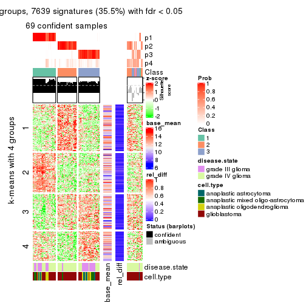</p>

</div>
<div id='tab-ATC-NMF-get-signatures-4'>
<pre><code class="r">get_signatures(res, k = 5)
</code></pre>

<p></p>

</div>
<div id='tab-ATC-NMF-get-signatures-5'>
<pre><code class="r">get_signatures(res, k = 6)
</code></pre>

<p></p>

</div>
</div>


Signature heatmaps where rows are not scaled:


<script>
$( function() {
	$( '#tabs-ATC-NMF-get-signatures-no-scale' ).tabs();
} );
</script>
<div id='tabs-ATC-NMF-get-signatures-no-scale'>
<ul>
<li><a href='#tab-ATC-NMF-get-signatures-no-scale-1'>k = 2</a></li>
<li><a href='#tab-ATC-NMF-get-signatures-no-scale-2'>k = 3</a></li>
<li><a href='#tab-ATC-NMF-get-signatures-no-scale-3'>k = 4</a></li>
<li><a href='#tab-ATC-NMF-get-signatures-no-scale-4'>k = 5</a></li>
<li><a href='#tab-ATC-NMF-get-signatures-no-scale-5'>k = 6</a></li>
</ul>
<div id='tab-ATC-NMF-get-signatures-no-scale-1'>
<pre><code class="r">get_signatures(res, k = 2, scale_rows = FALSE)
</code></pre>

<p></p>

</div>
<div id='tab-ATC-NMF-get-signatures-no-scale-2'>
<pre><code class="r">get_signatures(res, k = 3, scale_rows = FALSE)
</code></pre>

<p></p>

</div>
<div id='tab-ATC-NMF-get-signatures-no-scale-3'>
<pre><code class="r">get_signatures(res, k = 4, scale_rows = FALSE)
</code></pre>

<p></p>

</div>
<div id='tab-ATC-NMF-get-signatures-no-scale-4'>
<pre><code class="r">get_signatures(res, k = 5, scale_rows = FALSE)
</code></pre>

<p></p>

</div>
<div id='tab-ATC-NMF-get-signatures-no-scale-5'>
<pre><code class="r">get_signatures(res, k = 6, scale_rows = FALSE)
</code></pre>

<p></p>

</div>
</div>


Compare the overlap of signatures from different k:

```r
compare_signatures(res)
```

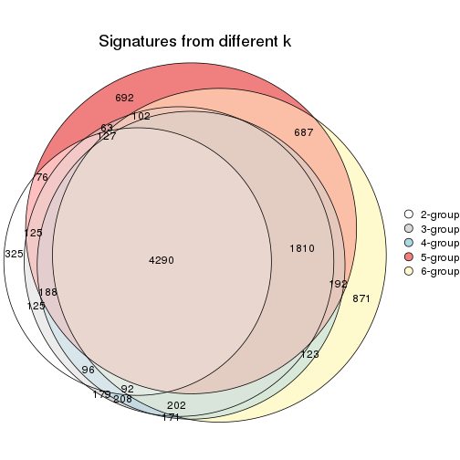

`get_signature()` returns a data frame invisibly. TO get the list of signatures, the function
call should be assigned to a variable explicitly. In following code, if `plot` argument is set
to `FALSE`, no heatmap is plotted while only the differential analysis is performed.

```r
# code only for demonstration
tb = get_signature(res, k = ..., plot = FALSE)
```

An example of the output of `tb` is:

```
#>   which_row         fdr    mean_1    mean_2 scaled_mean_1 scaled_mean_2 km
#> 1        38 0.042760348  8.373488  9.131774    -0.5533452     0.5164555  1
#> 2        40 0.018707592  7.106213  8.469186    -0.6173731     0.5762149  1
#> 3        55 0.019134737 10.221463 11.207825    -0.6159697     0.5749050  1
#> 4        59 0.006059896  5.921854  7.869574    -0.6899429     0.6439467  1
#> 5        60 0.018055526  8.928898 10.211722    -0.6204761     0.5791110  1
#> 6        98 0.009384629 15.714769 14.887706     0.6635654    -0.6193277  2
...
```

The columns in `tb` are:

1. `which_row`: row indices corresponding to the input matrix.
2. `fdr`: FDR for the differential test. 
3. `mean_x`: The mean value in group x.
4. `scaled_mean_x`: The mean value in group x after rows are scaled.
5. `km`: Row groups if k-means clustering is applied to rows.


UMAP plot which shows how samples are separated.


<script>
$( function() {
	$( '#tabs-ATC-NMF-dimension-reduction' ).tabs();
} );
</script>
<div id='tabs-ATC-NMF-dimension-reduction'>
<ul>
<li><a href='#tab-ATC-NMF-dimension-reduction-1'>k = 2</a></li>
<li><a href='#tab-ATC-NMF-dimension-reduction-2'>k = 3</a></li>
<li><a href='#tab-ATC-NMF-dimension-reduction-3'>k = 4</a></li>
<li><a href='#tab-ATC-NMF-dimension-reduction-4'>k = 5</a></li>
<li><a href='#tab-ATC-NMF-dimension-reduction-5'>k = 6</a></li>
</ul>
<div id='tab-ATC-NMF-dimension-reduction-1'>
<pre><code class="r">dimension_reduction(res, k = 2, method = &quot;UMAP&quot;)
</code></pre>

<p></p>

</div>
<div id='tab-ATC-NMF-dimension-reduction-2'>
<pre><code class="r">dimension_reduction(res, k = 3, method = &quot;UMAP&quot;)
</code></pre>

<p></p>

</div>
<div id='tab-ATC-NMF-dimension-reduction-3'>
<pre><code class="r">dimension_reduction(res, k = 4, method = &quot;UMAP&quot;)
</code></pre>

<p></p>

</div>
<div id='tab-ATC-NMF-dimension-reduction-4'>
<pre><code class="r">dimension_reduction(res, k = 5, method = &quot;UMAP&quot;)
</code></pre>

<p></p>

</div>
<div id='tab-ATC-NMF-dimension-reduction-5'>
<pre><code class="r">dimension_reduction(res, k = 6, method = &quot;UMAP&quot;)
</code></pre>

<p></p>

</div>
</div>


Following heatmap shows how subgroups are split when increasing `k`:

```r
collect_classes(res)
```


Test correlation between subgroups and known annotations. If the known
annotation is numeric, one-way ANOVA test is applied, and if the known
annotation is discrete, chi-squared contingency table test is applied.

```r
test_to_known_factors(res)
```

```
#>          n disease.state(p) cell.type(p) k
#> ATC:NMF 83         6.46e-06     4.04e-05 2
#> ATC:NMF 84         3.89e-04     6.14e-03 3
#> ATC:NMF 69         1.03e-03     1.38e-02 4
#> ATC:NMF 70         1.86e-04     1.00e-02 5
#> ATC:NMF 61         1.68e-03     3.80e-02 6
```


If matrix rows can be associated to genes, consider to use `GO_Enrichment(res,
...)` to perform function enrichment for the signature genes.


 

## Session info


```r
sessionInfo()
```

```
#> R version 3.6.0 (2019-04-26)
#> Platform: x86_64-pc-linux-gnu (64-bit)
#> Running under: CentOS Linux 7 (Core)
#> 
#> Matrix products: default
#> BLAS:   /usr/lib64/libblas.so.3.4.2
#> LAPACK: /usr/lib64/liblapack.so.3.4.2
#> 
#> locale:
#>  [1] LC_CTYPE=en_GB.UTF-8       LC_NUMERIC=C               LC_TIME=en_GB.UTF-8       
#>  [4] LC_COLLATE=en_GB.UTF-8     LC_MONETARY=en_GB.UTF-8    LC_MESSAGES=en_GB.UTF-8   
#>  [7] LC_PAPER=en_GB.UTF-8       LC_NAME=C                  LC_ADDRESS=C              
#> [10] LC_TELEPHONE=C             LC_MEASUREMENT=en_GB.UTF-8 LC_IDENTIFICATION=C       
#> 
#> attached base packages:
#> [1] grid      parallel  stats     graphics  grDevices utils     datasets  methods   base     
#> 
#> other attached packages:
#>  [1] genefilter_1.66.0     ComplexHeatmap_2.1.1  markdown_1.1          knitr_1.26           
#>  [5] preprocessCore_1.46.0 cola_1.3.2            GEOquery_2.52.0       Biobase_2.44.0       
#>  [9] BiocGenerics_0.30.0   GetoptLong_0.1.7     
#> 
#> loaded via a namespace (and not attached):
#>  [1] bitops_1.0-6         matrixStats_0.55.0   bit64_0.9-7          doParallel_1.0.15   
#>  [5] RColorBrewer_1.1-2   httr_1.4.1           tools_3.6.0          backports_1.1.5     
#>  [9] R6_2.4.1             DBI_1.0.0            lazyeval_0.2.2       colorspace_1.4-1    
#> [13] withr_2.1.2          tidyselect_0.2.5     gridExtra_2.3        bit_1.1-14          
#> [17] compiler_3.6.0       xml2_1.2.2           microbenchmark_1.4-7 pkgmaker_0.28       
#> [21] slam_0.1-46          scales_1.1.0         readr_1.3.1          NMF_0.23.6          
#> [25] stringr_1.4.0        digest_0.6.23        pkgconfig_2.0.3      bibtex_0.4.2        
#> [29] highr_0.8            limma_3.40.6         rlang_0.4.2          GlobalOptions_0.1.1 
#> [33] RSQLite_2.1.2        impute_1.58.0        shape_1.4.4          mclust_5.4.5        
#> [37] dendextend_1.12.0    dplyr_0.8.3          RCurl_1.95-4.12      magrittr_1.5        
#> [41] Matrix_1.2-17        Rcpp_1.0.3           munsell_0.5.0        S4Vectors_0.22.1    
#> [45] viridis_0.5.1        lifecycle_0.1.0      stringi_1.4.3        plyr_1.8.4          
#> [49] blob_1.2.0           crayon_1.3.4         lattice_0.20-38      splines_3.6.0       
#> [53] annotate_1.62.0      circlize_0.4.9       hms_0.5.2            zeallot_0.1.0       
#> [57] pillar_1.4.2         rjson_0.2.20         rngtools_1.4         reshape2_1.4.3      
#> [61] codetools_0.2-16     stats4_3.6.0         XML_3.98-1.20        glue_1.3.1          
#> [65] evaluate_0.14        png_0.1-7            vctrs_0.2.0          foreach_1.4.7       
#> [69] polyclip_1.10-0      gtable_0.3.0         purrr_0.3.3          tidyr_1.0.0         
#> [73] clue_0.3-57          assertthat_0.2.1     ggplot2_3.2.1        xfun_0.11           
#> [77] gridBase_0.4-7       eulerr_6.0.0         xtable_1.8-4         skmeans_0.2-11      
#> [81] survival_2.44-1.1    viridisLite_0.3.0    tibble_2.1.3         iterators_1.0.12    
#> [85] AnnotationDbi_1.46.1 registry_0.5-1       memoise_1.1.0        IRanges_2.18.3      
#> [89] cluster_2.1.0        brew_1.0-6
```


